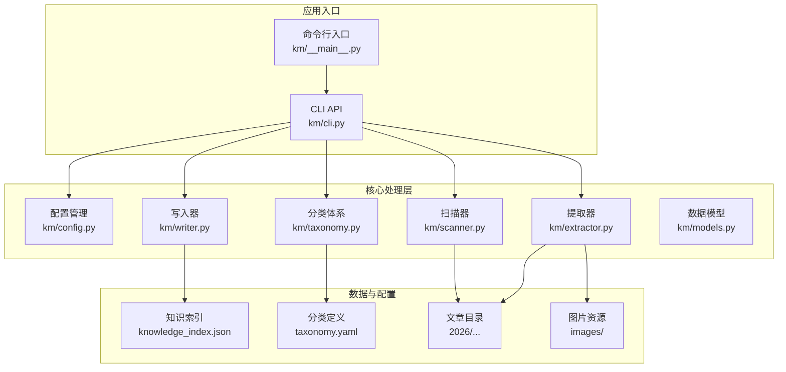
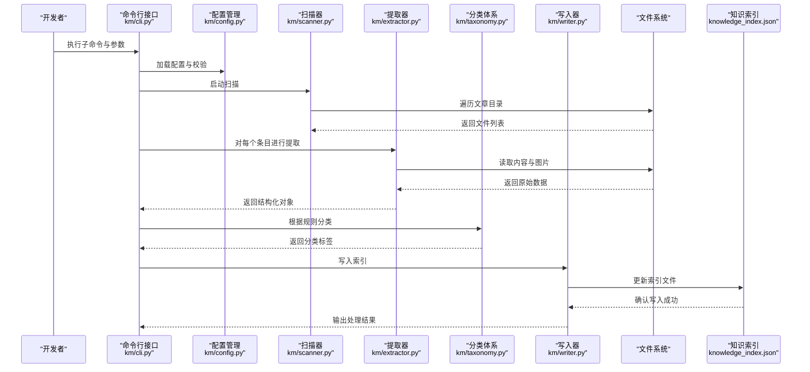
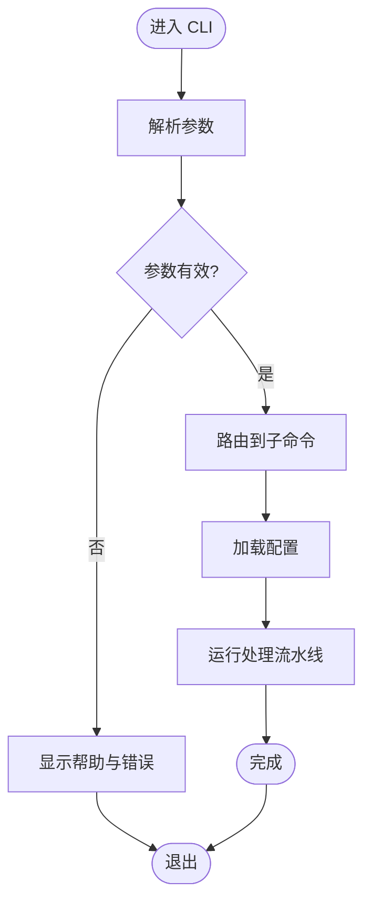
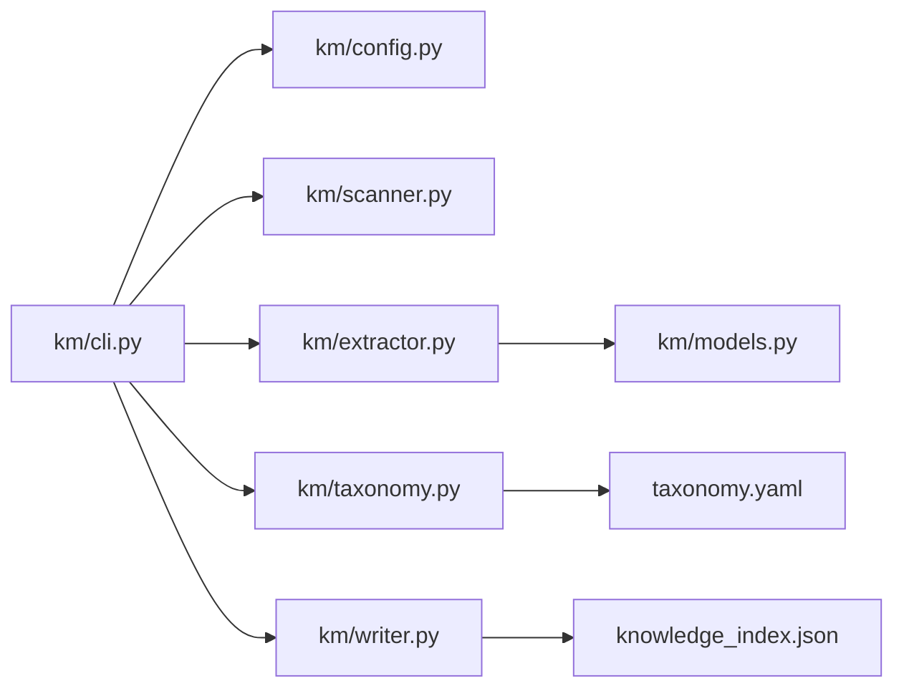

# 开发指南

<cite>
**本文档引用的文件**   
- [README.md](file://README.md)
- [AGENTS.md](file://AGENTS.md)
- [CLAUDE.md](file://CLAUDE.md)
- [knowledge_index.json](file://knowledge_index.json)
- [taxonomy.yaml](file://taxonomy.yaml)
- [km/__init__.py](file://km/__init__.py)
- [km/__main__.py](file://km/__main__.py)
- [km/cli.py](file://km/cli.py)
- [km/config.py](file://km/config.py)
- [km/extractor.py](file://km/extractor.py)
- [km/models.py](file://km/models.py)
- [km/scanner.py](file://km/scanner.py)
- [km/taxonomy.py](file://km/taxonomy.py)
- [km/writer.py](file://km/writer.py)
</cite>

## 目录
1. [简介](#简介)
2. [项目结构](#项目结构)
3. [核心组件](#核心组件)
4. [架构总览](#架构总览)
5. [详细组件分析](#详细组件分析)
6. [依赖关系分析](#依赖关系分析)
7. [性能考虑](#性能考虑)
8. [故障排除指南](#故障排除指南)
9. [结论](#结论)
10. [附录](#附录)

## 简介
本指南面向开发者，系统化说明微信公共文章知识库项目的架构、模块设计与扩展点。内容涵盖开发环境搭建、依赖管理、代码规范、API 接口文档、测试策略与调试技巧、插件开发与自定义处理器实现方法，以及性能优化建议与故障排除指南。读者可据此快速上手并高效扩展系统能力。

## 项目结构
仓库采用“工具库 + 数据”的清晰分层：
- km 包：命令行工具与核心处理逻辑（配置、扫描、提取、分类、写入等）
- 知识数据：按时间分目录的文章集合与图片资源
- 元数据与索引：knowledge_index.json、taxonomy.yaml 用于分类体系与索引
- 工程配置：README.md、AGENTS.md、CLAUDE.md 提供使用说明与约定

图表来源
- [km/__main__.py:1-200](file://km/__main__.py#L1-L200)
- [km/cli.py:1-200](file://km/cli.py#L1-L200)
- [km/config.py:1-200](file://km/config.py#L1-L200)
- [km/scanner.py:1-200](file://km/scanner.py#L1-L200)
- [km/extractor.py:1-200](file://km/extractor.py#L1-L200)
- [km/taxonomy.py:1-200](file://km/taxonomy.py#L1-L200)
- [km/writer.py:1-200](file://km/writer.py#L1-L200)
- [km/models.py:1-200](file://km/models.py#L1-L200)
- [knowledge_index.json:1-200](file://knowledge_index.json#L1-L200)
- [taxonomy.yaml:1-200](file://taxonomy.yaml#L1-L200)

章节来源
- [README.md:1-200](file://README.md#L1-L200)
- [AGENTS.md:1-200](file://AGENTS.md#L1-L200)
- [CLAUDE.md:1-200](file://CLAUDE.md#L1-L200)

## 核心组件
- 配置管理（config）：统一加载与校验配置文件，提供默认值与环境覆盖能力。
- 扫描器（scanner）：遍历文章目录，发现待处理条目，生成任务清单。
- 提取器（extractor）：解析文章内容与图片，抽取结构化字段，适配不同格式。
- 分类体系（taxonomy）：基于 taxonomy.yaml 维护分类树与规则映射。
- 写入器（writer）：将处理结果持久化到索引或目标存储，支持增量更新。
- 数据模型（models）：定义文章、分类、索引等数据结构与校验。
- 命令行接口（cli）：暴露子命令与参数，编排处理流程。

章节来源
- [km/config.py:1-200](file://km/config.py#L1-L200)
- [km/scanner.py:1-200](file://km/scanner.py#L1-L200)
- [km/extractor.py:1-200](file://km/extractor.py#L1-L200)
- [km/taxonomy.py:1-200](file://km/taxonomy.py#L1-L200)
- [km/writer.py:1-200](file://km/writer.py#L1-L200)
- [km/models.py:1-200](file://km/models.py#L1-L200)
- [km/cli.py:1-200](file://km/cli.py#L1-L200)

## 架构总览
系统以 CLI 为入口，通过配置驱动扫描、提取、分类与写入流水线。数据流从文件系统读取文章与图片，经提取器转换为结构化对象，再由分类体系打标，最终由写入器落盘至索引文件。

图表来源
- [km/cli.py:1-200](file://km/cli.py#L1-L200)
- [km/config.py:1-200](file://km/config.py#L1-L200)
- [km/scanner.py:1-200](file://km/scanner.py#L1-L200)
- [km/extractor.py:1-200](file://km/extractor.py#L1-L200)
- [km/taxonomy.py:1-200](file://km/taxonomy.py#L1-L200)
- [km/writer.py:1-200](file://km/writer.py#L1-L200)
- [knowledge_index.json:1-200](file://knowledge_index.json#L1-L200)

## 详细组件分析

### 命令行接口（CLI）
- 职责：解析参数、路由子命令、编排处理流程、输出日志与结果。
- 扩展点：新增子命令需在入口注册；新增处理阶段可在编排处插入中间件式钩子。
- 错误处理：参数校验失败时给出明确提示；处理异常捕获并记录上下文。

图表来源
- [km/__main__.py:1-200](file://km/__main__.py#L1-L200)
- [km/cli.py:1-200](file://km/cli.py#L1-L200)

章节来源
- [km/__main__.py:1-200](file://km/__main__.py#L1-L200)
- [km/cli.py:1-200](file://km/cli.py#L1-L200)

### 配置管理（Config）
- 职责：集中管理配置项、默认值、环境变量覆盖与校验。
- 设计要点：键名命名规范、类型约束、敏感信息隔离。
- 扩展点：新增配置项需同步文档与校验逻辑。

章节来源
- [km/config.py:1-200](file://km/config.py#L1-L200)

### 扫描器（Scanner）
- 职责：递归扫描文章目录，过滤无效条目，生成任务队列。
- 性能要点：批量 IO、跳过已处理文件、并发控制。
- 错误处理：权限不足、路径不存在、编码异常等。

章节来源
- [km/scanner.py:1-200](file://km/scanner.py#L1-L200)

### 提取器（Extractor）
- 职责：解析 Markdown/HTML 等内容，抽取标题、摘要、正文、图片链接等字段。
- 扩展点：新增内容格式适配器；自定义字段抽取策略。
- 健壮性：容错解析、缺失字段回退、图片本地化策略。

章节来源
- [km/extractor.py:1-200](file://km/extractor.py#L1-L200)

### 分类体系（Taxonomy）
- 职责：维护分类树、匹配规则与优先级；支持动态扩展。
- 数据源：taxonomy.yaml 定义分类结构与规则。
- 扩展点：新增分类规则、权重与冲突解决策略。

章节来源
- [km/taxonomy.py:1-200](file://km/taxonomy.py#L1-L200)
- [taxonomy.yaml:1-200](file://taxonomy.yaml#L1-L200)

### 写入器（Writer）
- 职责：将结构化结果写入索引文件或外部存储；支持增量更新与幂等写入。
- 一致性：事务性写入、校验和验证、回滚机制。
- 扩展点：多后端写入（JSON、数据库、对象存储）。

章节来源
- [km/writer.py:1-200](file://km/writer.py#L1-L200)
- [knowledge_index.json:1-200](file://knowledge_index.json#L1-L200)

### 数据模型（Models）
- 职责：定义文章、分类、索引等数据结构与校验规则。
- 设计要点：字段类型、必填项、默认值、枚举约束。
- 扩展点：新增字段需同步序列化/反序列化逻辑。

章节来源
- [km/models.py:1-200](file://km/models.py#L1-L200)

### 包初始化（__init__）
- 职责：暴露包级 API、版本信息与基础常量。
- 最佳实践：避免循环导入，按需懒加载。

章节来源
- [km/__init__.py:1-200](file://km/__init__.py#L1-L200)

## 依赖关系分析
- 内部依赖：CLI 依赖配置、扫描、提取、分类、写入模块；各模块通过 models 共享数据结构。
- 外部依赖：文件系统、JSON/YAML 解析库、可能的网络请求（图片下载）。
- 耦合度：模块间低耦合、高内聚，通过接口契约协作。
- 潜在循环：确保 __init__ 不引入循环依赖。

图表来源
- [km/cli.py:1-200](file://km/cli.py#L1-L200)
- [km/config.py:1-200](file://km/config.py#L1-L200)
- [km/scanner.py:1-200](file://km/scanner.py#L1-L200)
- [km/extractor.py:1-200](file://km/extractor.py#L1-L200)
- [km/taxonomy.py:1-200](file://km/taxonomy.py#L1-L200)
- [km/writer.py:1-200](file://km/writer.py#L1-L200)
- [km/models.py:1-200](file://km/models.py#L1-L200)
- [taxonomy.yaml:1-200](file://taxonomy.yaml#L1-L200)
- [knowledge_index.json:1-200](file://knowledge_index.json#L1-L200)

章节来源
- [km/__main__.py:1-200](file://km/__main__.py#L1-L200)
- [km/cli.py:1-200](file://km/cli.py#L1-L200)

## 性能考虑
- 扫描阶段：使用批量 IO、并行遍历、跳过未变更文件。
- 提取阶段：缓存解析结果、限制图片下载大小与超时、异步 I/O。
- 分类阶段：规则预编译、短路匹配、减少正则回溯。
- 写入阶段：增量更新、批写合并、校验和校验。
- 内存管理：流式处理大文件、及时释放引用、避免全量加载。

[本节为通用指导，不直接分析具体文件]

## 故障排除指南
- 常见问题
  - 配置项缺失或类型错误：检查默认值与环境覆盖，打印配置快照定位。
  - 扫描失败：确认路径权限、编码格式、隐藏文件过滤。
  - 提取异常：内容格式不支持或缺失关键字段，增加回退策略。
  - 分类冲突：调整规则优先级与匹配顺序。
  - 写入失败：索引文件损坏或权限问题，启用幂等与回滚。
- 调试技巧
  - 启用详细日志与追踪 ID。
  - 单步执行子命令，逐步缩小范围。
  - 使用最小复现数据集验证修复。
- 恢复策略
  - 备份索引与配置。
  - 断点续跑与增量重放。
  - 灰度发布与回滚预案。

章节来源
- [km/config.py:1-200](file://km/config.py#L1-L200)
- [km/scanner.py:1-200](file://km/scanner.py#L1-L200)
- [km/extractor.py:1-200](file://km/extractor.py#L1-L200)
- [km/taxonomy.py:1-200](file://km/taxonomy.py#L1-L200)
- [km/writer.py:1-200](file://km/writer.py#L1-L200)

## 结论
本项目以清晰的模块化设计与可扩展的插件机制，支撑微信公共文章的采集、提取、分类与索引。遵循本指南的架构约定与最佳实践，开发者可快速集成新功能、优化性能并稳定运维。建议在扩展时保持低耦合、强校验与良好日志，确保系统可观测与可维护。

[本节为总结性内容，不直接分析具体文件]

## 附录

### 开发环境搭建
- 安装 Python 环境与依赖（参考 README 与 AGENTS 说明）。
- 克隆仓库并初始化虚拟环境。
- 准备 taxonomy.yaml 与示例文章目录。
- 运行 CLI 子命令验证链路。

章节来源
- [README.md:1-200](file://README.md#L1-L200)
- [AGENTS.md:1-200](file://AGENTS.md#L1-L200)
- [CLAUDE.md:1-200](file://CLAUDE.md#L1-L200)

### 依赖管理
- 使用依赖锁定文件确保一致性。
- 分离运行时与开发依赖。
- 定期审计与安全更新。

[本节为通用指导，不直接分析具体文件]

### 代码规范
- 命名与风格：PEP8、函数与类命名清晰。
- 注释与文档：关键逻辑添加 docstring 与行内注释。
- 错误处理：统一异常类型与日志级别。
- 测试覆盖：核心路径单元测试与集成测试。

[本节为通用指导，不直接分析具体文件]

### API 接口文档（CLI）
- 子命令：scan、extract、classify、write、index。
- 参数：输入路径、输出路径、配置项、并发数、重试次数。
- 返回：处理统计、错误码、日志路径。
- 示例：见 README 与 AGENTS 中的用法说明。

章节来源
- [km/cli.py:1-200](file://km/cli.py#L1-L200)
- [README.md:1-200](file://README.md#L1-L200)

### 测试策略
- 单元测试：针对 extractor、taxonomy、writer 的核心逻辑。
- 集成测试：端到端流水线验证，包含异常场景。
- 数据驱动：使用样例文章与分类规则驱动用例。
- 覆盖率：关键路径覆盖率阈值与回归测试。

[本节为通用指导，不直接分析具体文件]

### 调试技巧
- 启用调试模式与详细日志。
- 使用断点与变量监视。
- 最小化复现场景与隔离问题。
- 监控指标：耗时、错误率、吞吐。

[本节为通用指导，不直接分析具体文件]

### 插件开发与自定义处理器
- 插件接口：实现统一的处理器接口（如 extract、classify、write）。
- 注册机制：在 CLI 或模块注册表中声明插件。
- 配置注入：通过 config 获取插件参数。
- 生命周期：初始化、处理、清理钩子。
- 示例：新增自定义提取器或分类规则。

章节来源
- [km/cli.py:1-200](file://km/cli.py#L1-L200)
- [km/config.py:1-200](file://km/config.py#L1-L200)
- [km/extractor.py:1-200](file://km/extractor.py#L1-L200)
- [km/taxonomy.py:1-200](file://km/taxonomy.py#L1-L200)
- [km/writer.py:1-200](file://km/writer.py#L1-L200)