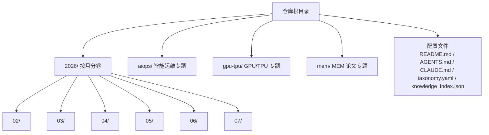
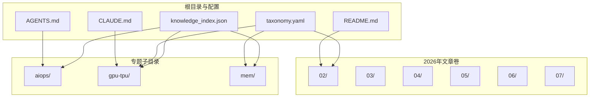
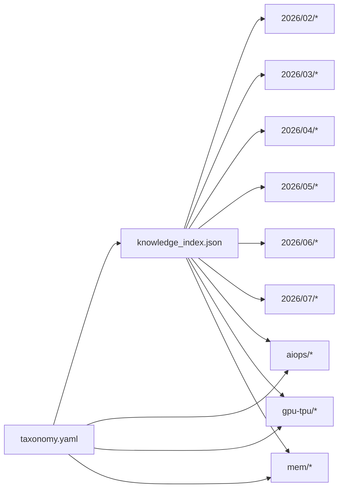

# 2026年文章

<cite>
**本文引用的文件**   
- [README.md](file://README.md)
- [AGENTS.md](file://AGENTS.md)
- [CLAUDE.md](file://CLAUDE.md)
- [taxonomy.yaml](file://taxonomy.yaml)
- [knowledge_index.json](file://knowledge_index.json)
- [2026/07/AIOps 迈入 Agent 时代！行业标准落地，智能运维迎来全新增长赛道.md](file://2026/07/AIOps 迈入 Agent 时代！行业标准落地，智能运维迎来全新增长赛道.md)
- [2026/07/Agent 评测：方法论与体系设计.md](file://2026/07/Agent 评测：方法论与体系设计.md)
- [2026/07/MEM工程管理论文开题答辩及盲审环节中必挂问题!.md](file://2026/07/MEM工程管理论文开题答辩及盲审环节中必挂问题!.md)
- [2026/07/你花大价钱上的 AIOps，为什么生产上还压不住告警？.md](file://2026/07/你花大价钱上的 AIOps，为什么生产上还压不住告警？.md)
- [2026/07/超级个体时代｜腾讯研究院3万字报告.md](file://2026/07/超级个体时代｜腾讯研究院3万字报告.md)
</cite>

## 更新摘要
**所做更改**   
- 更新了2026年07月章节，新增五篇技术文章的内容分析
- 新增了AIOps演进、Agent评估方法论、MEM工程管理论文指导、生产告警挑战、腾讯超级个体时代研究报告等主题
- 扩展了专题子目录中的aiops和mem相关内容
- 完善了搜索与浏览最佳实践，增加了新文章的检索建议

## 目录
1. [引言](#引言)
2. [项目结构](#项目结构)
3. [核心组件](#核心组件)
4. [架构总览](#架构总览)
5. [详细组件分析](#详细组件分析)
6. [依赖关系分析](#依赖关系分析)
7. [性能考量](#性能考量)
8. [故障排查指南](#故障排查指南)
9. [结论](#结论)
10. [附录](#附录)

## 引言
本文件为"2026年文章集合"的内容导航与使用指南，聚焦按月份组织的2月至7月的技术文章，覆盖AI基础设施、存储技术、网络架构、GPU集群运维等前沿主题。文档同时给出分类体系说明（技术解析、实践指南、行业分析等）、搜索与浏览的最佳实践，以及按技术栈快速定位的方法，帮助读者高效获取所需内容。

**最新更新**：2026年7月新增五篇重要文章，涵盖AIOps向Agent时代演进、Agent评估方法论、MEM工程管理论文指导、生产告警挑战解决方案，以及腾讯研究院关于超级个体时代的深度研究报告。

## 项目结构
仓库以"年份/月份"组织文章，辅以专题子目录（如 aiops、gpu-tpu、mem）。根目录包含项目说明与配置，便于理解整体结构与使用方式。

**图表来源**
- [README.md](file://README.md)
- [AGENTS.md](file://AGENTS.md)
- [CLAUDE.md](file://CLAUDE.md)
- [taxonomy.yaml](file://taxonomy.yaml)
- [knowledge_index.json](file://knowledge_index.json)

**章节来源**
- [README.md](file://README.md)
- [AGENTS.md](file://AGENTS.md)
- [CLAUDE.md](file://CLAUDE.md)
- [taxonomy.yaml](file://taxonomy.yaml)
- [knowledge_index.json](file://knowledge_index.json)

## 核心组件
- 月度文章卷（2026/02~07）：按时间线组织的技术文章集合，涵盖AI Infra、存储、网络、GPU集群、Agent与SRE等方向。
- 专题子目录：
  - aiops：围绕智能运维、SRE、Agent运维、故障诊断与自愈等主题。
  - gpu-tpu：聚焦GPU/TPU架构、互联与AI Infra底层技术。
  - mem：工程管理硕士论文相关选题与写作指导（非技术主线，供参考）。
- 元数据与索引：
  - taxonomy.yaml：分类体系定义（用于统一标签与主题划分）。
  - knowledge_index.json：知识库索引（便于检索与聚合）。
  - README/AGENTS/CLAUDE：项目说明与使用说明。

**章节来源**
- [taxonomy.yaml](file://taxonomy.yaml)
- [knowledge_index.json](file://knowledge_index.json)
- [README.md](file://README.md)
- [AGENTS.md](file://AGENTS.md)
- [CLAUDE.md](file://CLAUDE.md)

## 架构总览
下图展示2026年文章集合的整体架构与内容流向：从根目录的配置与说明出发，进入按月划分的文章卷，并延伸至专题子目录；索引与分类体系贯穿其中，支持检索与导航。

**图表来源**
- [README.md](file://README.md)
- [AGENTS.md](file://AGENTS.md)
- [CLAUDE.md](file://CLAUDE.md)
- [taxonomy.yaml](file://taxonomy.yaml)
- [knowledge_index.json](file://knowledge_index.json)

## 详细组件分析

### 2026年02月：AI Infra与存储/网络/硬件深度解析
- 主题领域
  - AI基础设施：GPU互联与加速（GPUDirect RDMA、GDS）、NVLink/ConnectX/BlueField全栈、GPU利用率误区、H200服务器交付与冷却。
  - 存储技术：SSD与NVMe（Marvell SSD、ublk批量IO调度、NVMe Power Limit）、MLPerf Storage v2.0实测、Elasticsearch与SelectDB成本分析。
  - 网络架构：RDMA网卡排障、k8s Mellanox DPDK驱动问题、OCS光交换机、光互连讨论、跨机房组网方案。
  - 向量与数据库：Zvec嵌入式向量数据库、小红书MySQL内核改造。
  - 芯片与架构：谷歌TPU v7与英伟达GB300架构对比、AMD服务器指令集故障分析。
- 分类体系
  - 技术解析：GPUDirect RDMA/GDS、NVMe Power Limit、ublk批量IO、RDMA排障、光互连。
  - 实践指南：k8s Mellanox DPDK问题总结、MLPerf Storage实测、Elasticsearch与SelectDB基准测试。
  - 行业分析：H200服务器交付、TPU vs GB300、AMD指令集故障分析。
- 检索建议
  - 关键词：GPUDirect、RDMA、NVMe、SSD、Elasticsearch、SelectDB、OCS、光互连、TPU、GB300、AMD。
  - 路径：2026/02/* 目录下按标题关键词筛选。

**章节来源**
- [2026/02/GPUDirect RDMA技术详解.md](file://2026/02/GPUDirect RDMA技术详解.md)
- [2026/02/GPUDirect Storage（GDS）技术解析.md](file://2026/02/GPUDirect Storage（GDS）技术解析.md)
- [2026/02/Linux ublk 引入批量 IO 调度：性能再突破.md](file://2026/02/Linux ublk 引入批量 IO 调度：性能再突破.md)
- [2026/02/Marvell：SSD如何应对极致IO挑战？.md](file://2026/02/Marvell：SSD如何应对极致IO挑战？.md)
- [2026/02/NVIDIA MFT 固件管理与调试工具集简析.md](file://2026/02/NVIDIA MFT 固件管理与调试工具集简析.md)
- [2026/02/OCS光交换机专家交流纪要.md](file://2026/02/OCS光交换机专家交流纪要.md)
- [2026/02/RDMA网卡：字节如何系统性揪出18个RDMA子系统性能异常.md](file://2026/02/RDMA网卡：字节如何系统性揪出18个RDMA子系统性能异常.md)
- [2026/02/Zvec- 开箱即用、高性能的嵌入式向量数据库.md](file://2026/02/Zvec- 开箱即用、高性能的嵌入式向量数据库.md)
- [2026/02/k8s mellanox网卡使用dpdk驱动问题总结.md](file://2026/02/k8s mellonox网卡使用dpdk驱动问题总结.md)
- [2026/02/一片SSD能喂饱多少颗GPU？MLPerf Storage v2.0实测.md](file://2026/02/一片SSD能喂饱多少颗GPU？MLPerf Storage v2.0实测.md)
- [2026/02/支撑亿级流量：小红书 2025 MySQL 内核做了哪些关键改造？.md](file://2026/02/支撑亿级流量：小红书 2025 MySQL 内核做了哪些关键改造？.md)
- [2026/02/日志成本降低 83%：云上 Elasticsearch 和 SelectDB 的基准测试及成本分析.md](file://2026/02/日志成本降低 83%：云上 Elasticsearch 和 SelectDB 的基准测试及成本分析.md)
- [2026/02/深度解析2 - 英伟达 Rubin 平台全解析：NVLink 6+ConnectX-9+BlueField-4，构建 AI 工厂全栈架构.md](file://2026/02/深度解析2 - 英伟达 Rubin 平台全解析：NVLink 6+ConnectX-9+BlueField-4，构建 AI 工厂全栈架构.md)
- [2026/02/警惕NVIDIA GPU"满载、饱和"的陷阱和误区！GPU利用率100%≠有效计算100%.md](file://2026/02/警惕NVIDIA GPU"满载、饱和"的陷阱和误区！GPU利用率100%≠有效计算100%.md)
- [2026/02/谈谈光互连的一些问题.md](file://2026/02/谈谈光互连的一些问题.md)
- [2026/02/谷歌TPU v7和英伟达GB300的架构，供应链差异.md](file://2026/02/谷歌TPU v7和英伟达GB300的架构，供应链差异.md)
- [2026/02/超大规模数据中心跨机房组网方案研究.md](file://2026/02/超大规模数据中心跨机房组网方案研究.md)
- [2026/02/这大概是我读过关于AI大模型最全面、好读又易懂的文章了.md](file://2026/02/这大概是我读过关于AI大模型最全面、好读又易懂的文章了.md)
- [2026/02/避坑！AMD 服务器指令集引发的故障分析.md](file://2026/02/避坑！AMD 服务器指令集引发的故障分析.md)
- [2026/02/重大突破！全球首个采用"金刚石"冷却技术H200服务器完成交付！.md](file://2026/02/重大突破！全球首个采用"金刚石"冷却技术H200服务器完成交付！.md)

### 2026年03月：存储与网络前沿、Agent安全与云原生推理
- 主题领域
  - 存储前沿：FAST'26论文（ACOS对象存储、华为云磁带归档）、阿里云本地存储演进、超低延迟SSD IO栈优化。
  - 市场与趋势：TrendForce NAND报告、HBF替代HBM探讨。
  - 网络与可靠性：BGP设计导致算力瓶颈、数据中心Tier等级标准。
  - 云原生与Agent：网易Tmax Fluid推理加速、阿里云Agent安全护栏与Agent安全中心。
- 分类体系
  - 技术解析：FAST'26论文解读、SSD IO栈优化、HBF技术探讨。
  - 实践指南：阿里云本地存储实践、Agent安全中心部署。
  - 行业分析：NAND市场趋势、Tier等级标准。
- 检索建议
  - 关键词：FAST'26、ACOS、磁带归档、SSD、BGP、Tier、Fluid、Agent安全。
  - 路径：2026/03/* 目录内按标题关键词筛选。

**章节来源**
- [2026/03/FAST'26 论文速递  ACOS：苹果 EB 级全球分布式对象存储.md](file://2026/03/FAST'26 论文速递  ACOS：苹果 EB 级全球分布式对象存储.md)
- [2026/03/FAST'26 论文速递  华为云 基于磁带的高性价比归档云存储-设计与部署.md](file://2026/03/FAST'26 论文速递  华为云 基于磁带的高性价比归档云存储-设计与部署.md)
- [2026/03/TrendForce 2026 年 2 月 NAND 市场报告，行业供应保守，长江存储持续扩张.md](file://2026/03/TrendForce 2026 年 2 月 NAND 市场报告，行业供应保守，长江存储持续扩张.md)
- [2026/03/一次错误 BGP 设计导致的算力瓶颈.md](file://2026/03/一次错误 BGP 设计导致的算力瓶颈.md)
- [2026/03/下一个HBM：HBF，能行吗？.md](file://2026/03/下一个HBM：HBF，能行吗？.md)
- [2026/03/什么是Tier等级？数据中心可靠性标准详解.md](file://2026/03/什么是Tier等级？数据中心可靠性标准详解.md)
- [2026/03/网易游戏 Tmax 平台实践：基于 Fluid 的云原生 AI 大模型推理加速架构.md](file://2026/03/网易游戏 Tmax 平台实践：基于 Fluid 的云原生 AI 大模型推理加速架构.md)
- [2026/03/阿里云 AI安全护栏2.0发布Agent运行时防护，抓住"自主执行任务"的"虾".md](file://2026/03/阿里云 AI安全护栏2.0发布Agent运行时防护，抓住"自主执行任务"的"虾".md)
- [2026/03/阿里云重磅新品：Agent安全中心，全新安全框架下AI Agent一体化防御平台.md](file://2026/03/阿里云重磅新品：Agent安全中心，全新安全框架下AI Agent一体化防御平台.md)
- [2026/03/顶会FAST'26解读｜超低延迟SSD的IO栈优化.md](file://2026/03/顶会FAST'26解读｜超低延迟SSD的IO栈优化.md)
- [2026/03/顶会FAST26最佳论文｜阿里云本地存储的过去、现在与未来.md](file://2026/03/顶会FAST26最佳论文｜阿里云本地存储的过去、现在与未来.md)

### 2026年04月：Agent与Skill生态、存储与网络排障
- 主题领域
  - Agent与Skill：Claude Code Skill Monitor、MiniMax CLI Agent设计、SkillRouter、多Agent协同方案、OpenID身份管理。
  - 存储与网络：NVMe Power Limit、网卡驱动导致IO hang案例。
  - 研发范式：Harness实践与Spec-Kit协作模式。
- 分类体系
  - 技术解析：NVMe Power Limit、Agent身份管理（OpenID）。
  - 实践指南：Skill Monitor、SkillRouter、Harness协作范式。
  - 行业分析：多Agent协同、研发范式演进。
- 检索建议
  - 关键词：Skill、Agent、OpenID、NVMe、网卡驱动、Harness。
  - 路径：2026/04/* 目录内按标题关键词筛选。

**章节来源**
- [2026/04/Claude Code Skill Monitor一个可靠的skill管理工具.md](file://2026/04/Claude Code Skill Monitor一个可靠的skill管理工具.md)
- [2026/04/Image2 + MiniMax CLI，一句话到成片。拆解 MiniMax CLI  的Agent 设计哲学.md](file://2026/04/Image2 + MiniMax CLI，一句话到成片。拆解 MiniMax CLI  的Agent 设计哲学.md)
- [2026/04/Skill太多命中率太低怎么办？阿里发布SkillRouter：Agent选择的关键竟然是body，1.2B参数碾压8B模型.md](file://2026/04/Skill太多命中率太低怎么办？阿里发布SkillRouter：Agent选择的关键竟然是body，1.2B参数碾压8B模型.md)
- [2026/04/我用1400年前的三省六部制，搞了一套很酷的多Agent协同方案。.md](file://2026/04/我用1400年前的三省六部制，搞了一套很酷的多Agent协同方案。.md)
- [2026/04/智能体 AI 的身份管理 (Identity Management for Agentic AI) —— OpenID.md](file://2026/04/智能体 AI 的身份管理 (Identity Management for Agentic AI) —— OpenID.md)
- [2026/04/NVMe新特性：Power Limit功能解读.md](file://2026/04/NVMe新特性：Power Limit功能解读.md)
- [2026/04/11分钟惊魂：一个网卡驱动bug如何让整个存储集群数百台虚机io hung住？.md](file://2026/04/11分钟惊魂：一个网卡驱动bug如何让整个存储集群数百台虚机io hung住？.md)
- [2026/04/Harness实践 ，开发应该多向运维同学学习.md](file://2026/04/Harness实践 ，开发应该多向运维同学学习.md)
- [2026/04/这也许就是Harness诞生的过程：从文档协作到 SDD（Spec-Kit），我们如何摸索出一套 AI 协作研发范式.md](file://2026/04/这也许就是Harness诞生的过程：从文档协作到 SDD（Spec-Kit），我们如何摸索出一套 AI 协作研发范式.md)

### 2026年05月：GPU集群交付与网络架构、KVCache演进与成本优化
- 主题领域
  - GPU集群：万卡NVIDIA集群自动化装机、GPU集群交付排障（网卡/PCIe/RoCE/NCCL）、隐性缺电掉卡排查。
  - 网络架构：AWS新网络架构曝光（设备精简、吞吐提升、成本下降）。
  - 存储与缓存：KVCache架构演进、S3 Intelligent-Tiering成本优化。
  - 政策与基建：智能体国家级文件解读、网易贵安数据中心全液冷项目。
- 分类体系
  - 技术解析：GPU集群排障、KVCache演进、AWS网络架构。
  - 实践指南：万卡集群自动化装机、S3成本优化。
  - 行业分析：智能体政策、数据中心液冷基建。
- 检索建议
  - 关键词：GPU集群、NCCL、RoCE、PCIe、AWS网络、KVCache、S3、液冷。
  - 路径：2026/05/* 目录内按标题关键词筛选。

**章节来源**
- [2026/05/GPU集群交付那些坑：从网卡到PCIe，从RoCE到NCCL的调试与排障指南.md](file://2026/05/GPU集群交付那些坑：从网卡到PCIe，从RoCE到NCCL的调试与排障指南.md)
- [2026/05/万卡 NVIDIA GPU 集群自动化装机实战从 BMC 就绪到全集群上线.md](file://2026/05/万卡 NVIDIA GPU 集群自动化装机实战从 BMC 就绪到全集群上线.md)
- [2026/05/隐性缺电：GPU服务器供电不足掉卡的排查与原理分析.md](file://2026/05/隐性缺电：GPU服务器供电不足掉卡的排查与原理分析.md)
- [2026/05/AWS 新网络架构曝光：设备砍掉 69%、吞吐量反增 33%、运营成本降 27%.md](file://2026/05/AWS 新网络架构曝光：设备砍掉 69%、吞吐量反增 33%、运营成本降 27%.md)
- [2026/05/从 305 GB 到 7.4 GB：大模型 KVCache 架构演进全景.md](file://2026/05/从 305 GB 到 7.4 GB：大模型 KVCache 架构演进全景.md)
- [2026/05/我们把所有数据都扔在S3标准存储里，每月花费5万，配了一个Intelligent-Tiering之后，下个月财务问我是不是换了云厂商！.md](file://2026/05/我们把所有数据都扔在S3标准存储里，每月花费5万，配了一个Intelligent-Tiering之后，下个月财务问我是不是换了云厂商！.md)
- [2026/05/智能体第一份国家级文件来了：《智能体规范应用与创新发展实施意见》解读.md](file://2026/05/智能体第一份国家级文件来了：《智能体规范应用与创新发展实施意见》解读.md)
- [2026/05/网易贵安数据中心11亿元全液冷项目启动建设：单机柜30kW+全Direct-to-Chip方案，承载10万台服务器，一期9月试运行.md](file://2026/05/网易贵安数据中心11亿元全液冷项目启动建设：单机柜30kW+全Direct-to-Chip方案，承载10万台服务器，一期9月试运行.md)

### 2026年06月：Agent评估、负载均衡与SCM评测
- 主题领域
  - Agent评估：Agent评估介绍、Agent-Memory评测全景（理论篇）。
  - 网络与存储：AWS RNG数据中心网络论文、Redis 8.4原子槽迁移、DapuStor X5900P SCM评测。
  - 政策与合规：数据中心PUE政策汇总、等保新规与数据安全。
  - 产业与生态：谷歌TPU出货量分析、软件工程生态与大模型影响、阿里云负载均衡演进。
- 分类体系
  - 技术解析：AWS RNG网络、Redis原子槽迁移、SCM评测。
  - 实践指南：负载均衡架构演进、Agent评估方法。
  - 行业分析：TPU出货量、PUE政策、等保合规。
- 检索建议
  - 关键词：Agent评估、RNG、Redis、SCM、PUE、等保、负载均衡。
  - 路径：2026/06/* 目录内按标题关键词筛选。

**章节来源**
- [2026/06/01-AI Infra工程师是干什么的.md](file://2026/06/01-AI Infra工程师是干什么的.md)
- [2026/06/AWS 全新RNG数据中心网络论文详解（附下载）.md](file://2026/06/AWS 全新RNG数据中心网络论文详解（附下载）.md)
- [2026/06/Agent 评估介绍.md](file://2026/06/Agent 评估介绍.md)
- [2026/06/Agent-Memory 评测全景：基准、评估与记忆系统（理论篇）.md](file://2026/06/Agent-Memory 评测全景：基准、评估与记忆系统（理论篇）.md)
- [2026/06/Redis 8.4 Atomic Slot Migration.md](file://2026/06/Redis 8.4 Atomic Slot Migration.md)
- [2026/06/TACO  PaTGen：基于时序相似性的云工作负载代理基准测试生成方法.md](file://2026/06/TACO  PaTGen：基于时序相似性的云工作负载代理基准测试生成方法.md)
- [2026/06/傲腾之后的最强SSDDapuStor X5900P 1.6T SCM评测报告.md](file://2026/06/傲腾之后的最强SSDDapuStor X5900P 1.6T SCM评测报告.md)
- [2026/06/国家及地方政府对数据中心PUE要求政策汇总.md](file://2026/06/国家及地方政府对数据中心PUE要求政策汇总.md)
- [2026/06/如何构建一个更"好"的知识库？.md](file://2026/06/如何构建一个更"好"的知识库？.md)
- [2026/06/等保新规今天起实施，数据安全终于转正了——你的系统跟得上吗？.md](file://2026/06/等保新规今天起实施，数据安全终于转正了——你的系统跟得上吗？.md)
- [2026/06/谷歌 TPU 2027 年出货量分析.md](file://2026/06/谷歌 TPU 2027 年出货量分析.md)
- [2026/06/谷歌首席工程师：二十年自然生长出来的软件工程生态，快被大模型 10 倍提速撑爆.md](file://2026/06/谷歌首席工程师：二十年自然生长出来的软件工程生态，快被大模型 10 倍提速撑爆.md)
- [2026/06/阿里云负载均衡技术：从 CLB 到 ALBNLBGWLB 的架构演进与实现.md](file://2026/06/阿里云负载均衡技术：从 CLB 到 ALBNLBGWLB 的架构演进与实现.md)

### 2026年07月：AI Infra全景、SRE与Agent落地 **已更新**
- 主题领域
  - AI Infra全景：Agent Framework、调度、编排、沙箱、记忆管理、Tracing分层拆解。
  - SRE与稳定性：SLO落地实践、企业级全链路SRE体系、唯品会SREAgent落地。
  - Agent与CLI：Agent时代CLI化、CLISSO鉴权体系、Skills生态与授权方案。
  - 方法论与统计：置信区间、Agent规模化落地冷思考。
  - **新增**：AIOps向Agent时代演进、Agent评估方法论、MEM工程管理论文指导、生产告警挑战、腾讯超级个体时代研究。
- 分类体系
  - 技术解析：AI Infra分层、SLO/SLI设计、CLISSO鉴权。
  - 实践指南：SRE体系构建、Agent落地与CLI化。
  - 行业分析：Agent规模化困境、Skills生态发展。
  - **新增**：AIOps演进分析、Agent评估体系、工程管理论文指导、生产运维挑战、产业发展趋势。
- 检索建议
  - 关键词：AI Infra、SRE、SLO、Agent、CLI、CLISSO、Skills、AIOps、MEM、告警、腾讯。
  - 路径：2026/07/* 目录内按标题关键词筛选。

**最新更新**：2026年7月新增五篇重要技术文章，涵盖AIOps向Agent时代演进的行业趋势、Agent评估方法论与体系设计、MEM工程管理论文开题答辩与盲审关键环节、生产环境告警治理挑战，以及腾讯研究院关于超级个体时代的深度研究报告。

**章节来源**
- [2026/07/AI Infra 全景图：Agent Framework、调度、编排、沙箱、记忆管理、Tracing 分层拆解.md](file://2026/07/AI Infra 全景图：Agent Framework、调度、编排、沙箱、记忆管理、Tracing 分层拆解.md)
- [2026/07/Agent-狂欢热潮下的冷思考：为什么规模化落地总是陷入僵局.md](file://2026/07/Agent-狂欢热潮下的冷思考：为什么规模化落地总是陷入僵局.md)
- [2026/07/OpenCode 与 Dax Raad：一个唱衰 AI 编程的人，为什么能做出增长最快的开源编程 Agent.md](file://2026/07/OpenCode 与 Dax Raad：一个唱衰 AI 编程的人，为什么能做出增长最快的开源编程 Agent.md)
- [2026/07/SLO 落地的工程实践：从 SLI 设计到燃烧率告警的体系化方法.md](file://2026/07/SLO 落地的工程实践：从 SLI 设计到燃烧率告警的体系化方法.md)
- [2026/07/万字长文：做了些爆款 Skills 以后，我对 Skills 的看法.md](file://2026/07/万字长文：做了些爆款 Skills 以后，我对 Skills 的看法.md)
- [2026/07/业务系统 CLI 化授权方案：抢占 Agent 时代的流量入口.md](file://2026/07/业务系统 CLI 化授权方案：抢占 Agent 时代的流量入口.md)
- [2026/07/为什么 Agent 时代，大家都在做 CLI ？.md](file://2026/07/为什么 Agent 时代，大家都在做 CLI ？.md)
- [2026/07/什么是置信区间，这是我听过最透彻的工程学解释.md](file://2026/07/什么是置信区间，这是我听过最透彻的工程学解释.md)
- [2026/07/企业级全链路SRE稳定性工程体系建设方案.md](file://2026/07/企业级全链路SRE稳定性工程体系建设方案.md)
- [2026/07/别把"指出问题"，当成"解决问题".md](file://2026/07/别把"指出问题"，当成"解决问题".md)
- [2026/07/当 SRE 遇上大模型：唯品会 SREAgent 落地全拆解.md](file://2026/07/当 SRE 遇上大模型：唯品会 SREAgent 落地全拆解.md)
- [2026/07/面向 Agent Skill 的 CLISSO 鉴权体系：安全、无感、可追溯.md](file://2026/07/面向 Agent Skill 的 CLISSO 鉴权体系：安全、无感、可追溯.md)
- [2026/07/AIOps 迈入 Agent 时代！行业标准落地，智能运维迎来全新增长赛道.md](file://2026/07/AIOps 迈入 Agent 时代！行业标准落地，智能运维迎来全新增长赛道.md)
- [2026/07/Agent 评测：方法论与体系设计.md](file://2026/07/Agent 评测：方法论与体系设计.md)
- [2026/07/MEM工程管理论文开题答辩及盲审环节中必挂问题!.md](file://2026/07/MEM工程管理论文开题答辩及盲审环节中必挂问题!.md)
- [2026/07/你花大价钱上的 AIOps，为什么生产上还压不住告警？.md](file://2026/07/你花大价钱上的 AIOps，为什么生产上还压不住告警？.md)
- [2026/07/超级个体时代｜腾讯研究院3万字报告.md](file://2026/07/超级个体时代｜腾讯研究院3万字报告.md)

### 专题子目录：aiops（智能运维）**已更新**
- 主题领域
  - Agent Infra与Sandbox：sandbox技术与选型、Agent Infra生产级支撑问题。
  - 故障诊断与自愈：AIOps根因分析、PagerDuty AI RCA、多智能体协同诊断P0故障。
  - 运维体系与SRE：L4级全自治运维、企业级SRE体系、认知型AIOps框架。
  - 工具与实践：Agent Skills开放标准、MCP/CLI/Skills使用姿势、lark-cli密钥保护。
  - **新增**：AIOps评测基准、P0故障复盘、老运维转型思维壁垒、多智能体协同自愈、告警疲劳治理、认知型AIOps实践。
- 分类体系
  - 技术解析：AIOps根因分析、Agent Skills标准、SRE体系。
  - 实践指南：多智能体协同、PagerDuty RCA、lark-cli安全实践。
  - 行业分析：Agent Infra生产级挑战、全自治运维升级。
  - **新增**：AIOps评测基准、故障复盘方法论、运维转型策略、告警治理实践、认知型运维框架。
- 检索建议
  - 关键词：AIOps、SRE、Agent、Skills、MCP、CLI、RCA、Sandbox、评测、故障、告警。
  - 路径：aiops/* 目录内按标题关键词筛选。

**最新更新**：aiops专题在2026年7月新增了多篇关于AIOps评测基准、P0故障复盘、运维转型思维、多智能体协同、告警疲劳治理和认知型AIOps实践的重要文章，进一步完善了智能运维领域的知识体系。

**章节来源**
- [aiops/02/Agent Infra- sandbox技术和选型.md](file://aiops/02/Agent Infra- sandbox技术和选型.md)
- [aiops/02/SRE 的尽头是 Prompt？用 LLM 自动分析 100G 运维日志的工程化复盘.md](file://aiops/02/SRE 的尽头是 Prompt？用 LLM 自动分析 100G 运维日志的工程化复盘.md)
- [aiops/02/万卡GPU 集群真实运维.md](file://aiops/02/万卡GPU 集群真实运维.md)
- [aiops/02/我做了个会进化的SREAgents，每个公司都能用.md](file://aiops/02/我做了个会进化的SREAgents，每个公司都能用.md)
- [aiops/03/AIOps探索：故障根因分析怎么做，才能从"辅助排障"走向"可自动决策".md](file://aiops/03/AIOps探索：故障根因分析怎么做，才能从"辅助排障"走向"可自动决策".md)
- [aiops/03/顶会FAST'26解读｜腾讯与三星联合发布数据中心SSD故障预测方案.md](file://aiops/03/顶会FAST'26解读｜腾讯与三星联合发布数据中心SSD故障预测方案.md)
- [aiops/04/AI Agent Skill全生命周期治理：从可用能力到可信资产.md](file://aiops/04/AI Agent Skill全生命周期治理：从可用能力到可信资产.md)
- [aiops/04/Resolve AI：为什么 AI SRE 领域有望诞生下一代 Datadog.md](file://aiops/04/Resolve AI：为什么 AI SRE 领域有望诞生下一代 Datadog.md)
- [aiops/04/为什么现有的 Agent Infra 无法支撑生产级应用？.md](file://aiops/04/为什么现有的 Agent Infra 无法支撑生产级应用？.md)
- [aiops/04/基于端网协同的智算中心智能运维关键技术研究与实践.md](file://aiops/04/基于端网协同的智算中心智能运维关键技术研究与实践.md)
- [aiops/05/Agent Skills 开放标准及其最佳实践.md](file://aiops/05/Agent Skills 开放标准及其最佳实践.md)
- [aiops/05/PagerDuty 的 AI RCA 不是找一个根因，而是把告警变成可处理的事故.md](file://aiops/05/PagerDuty 的 AI RCA 不是找一个根因，而是把告警变成可处理的事故.md)
- [aiops/05/某集团IT运维智能体（AIOps Agent）自主故障诊断与自愈平台详细设计方案（WORD）.md](file://aiops/05/某集团IT运维智能体（AIOps Agent）自主故障诊断与自愈平台详细设计方案（WORD）.md)
- [aiops/05/生产级 AI Agent 构建指南：MCP、CLI 与 Skills 的正确使用姿势.md](file://aiops/05/生产级 AI Agent 构建指南：MCP、CLI 与 Skills 的正确使用姿势.md)
- [aiops/05/飞书 lark-cli  是如何避密钥泄露给 LLM 的.md](file://aiops/05/飞书 lark-cli  是如何避密钥泄露给 LLM 的.md)
- [aiops/05/龙虾的"记忆" —— 黄东旭谈Agent 时代基础设施的重构.md](file://aiops/05/龙虾的"记忆" —— 黄东旭谈Agent 时代基础设施的重构.md)
- [aiops/06/L4级全自治运维体系升级方案.md](file://aiops/06/L4级全自治运维体系升级方案.md)
- [aiops/06/Mythos ：当攻防进入火器时代，防御策略和人的技能栈，都要重写.md](file://aiops/06/Mythos ：当攻防进入火器时代，防御策略和人的技能栈，都要重写.md)
- [aiops/06/【思】关于基于AI Agents 构建AIOps智能运维底座的一点思考.md](file://aiops/06/【思】关于基于AI Agents 构建AIOps智能运维底座的一点思考.md)
- [aiops/06/京东三面：CLI有什么用，能不能取代MCP？我说：都在用CLI，会将MCP取代掉。面试官让我回去再想清楚.md](file://aiops/06/京东三面：CLI有什么用，能不能取代MCP？我说：都在用CLI，会将MCP取代掉。面试官让我回去再想清楚.md)
- [aiops/06/从人工稽核到智能变更风控：运维工单AI多智能体落地实战与避坑指南.md](file://aiops/06/从人工稽核到智能变更风控：运维工单AI多智能体落地实战与避坑指南.md)
- [aiops/06/企业AI落地新范式：系统CLI化，流程skill化，员工Agent化.md](file://aiops/06/企业AI落地新范式：系统CLI化，流程skill化，员工Agent化.md)
- [aiops/06/告警发到群里，不等于故障有人负责.md](file://aiops/06/告警发到群里，不等于故障有人负责.md)
- [aiops/06/安全运营的下一步：不是大屏，而是 Agent.md](file://aiops/06/安全运营的下一步：不是大屏，而是 Agent.md)
- [aiops/06/群体智能涌现：模拟多角色Agent共同诊断一次P0级核心故障.md](file://aiops/06/群体智能涌现：模拟多角色Agent共同诊断一次P0级核心故障.md)
- [aiops/07/AI 运维智能体评测基准开源与实战指南.md](file://aiops/07/AI 运维智能体评测基准开源与实战指南.md)
- [aiops/07/AIOps一次P0故障复盘：告警泛滥，真正问题被海量信息淹没.md](file://aiops/07/AIOps一次P0故障复盘：告警泛滥，真正问题被海量信息淹没.md)
- [aiops/07/AIOps：老运维转型最大的思维壁垒只会救火，不会做平台与稳定性体系.md](file://aiops/07/AIOps：老运维转型最大的思维壁垒只会救火，不会做平台与稳定性体系.md)
- [aiops/07/SRE实战：基于多智能体协同构建一键隔离流量自愈体系架构方案.md](file://aiops/07/SRE实战：基于多智能体协同构建一键隔离流量自愈体系架构方案.md)
- [aiops/07/[有图版］循序渐进 落地为王：腾讯 IEG 技术运营部落地 AIOps，重塑 SRE 质效实践.md](file://aiops/07/[有图版］循序渐进 落地为王：腾讯 IEG 技术运营部落地 AIOps，重塑 SRE 质效实践.md)
- [aiops/07/告警疲劳终结者：如何用AIOps把误报率从45%压到5%以下.md](file://aiops/07/告警疲劳终结者：如何用AIOps把误报率从45%压到5%以下.md)
- [aiops/07/认知型AIOps实践：基于LLM Agent与知识图谱的工单变更自动化框架.md](file://aiops/07/认知型AIOps实践：基于LLM Agent与知识图谱的工单变更自动化框架.md)

### 专题子目录：gpu-tpu（GPU/TPU架构与AI Infra）
- 主题领域
  - 架构与设计：SIMT到脉动阵列基础、GPU与TPU设计理念、Two Stacks。
  - 综合解读：CPU/GPU/TPU比较、从逻辑运算到光互连的AI Infra全景。
- 分类体系
  - 技术解析：SIMT/脉动阵列、Two Stacks、架构比较。
  - 实践指南：AI Infra底层技术选型与集成。
  - 行业分析：GPU/TPU生态与供应链。
- 检索建议
  - 关键词：SIMT、脉动阵列、Two Stacks、GPU、TPU、AI Infra。
  - 路径：gpu-tpu/2026/* 目录内按标题关键词筛选。

**章节来源**
- [gpu-tpu/2026/05/From SIMT to Systolic - A Foundation for GPU and TPU Architecture.md](file://gpu-tpu/2026/05/From SIMT to Systolic - A Foundation for GPU and TPU Architecture.md)
- [gpu-tpu/2026/05/GPU 和 TPU 设计理念简介.md](file://gpu-tpu/2026/05/GPU 和 TPU 设计理念简介.md)
- [gpu-tpu/2026/05/The Two Stacks.md](file://gpu-tpu/2026/05/The Two Stacks.md)
- [gpu-tpu/2026/07/CPU、GPU、TPU 到底谁更聪明？从逻辑运算到光互连，一篇看懂 AI Infra.md](file://gpu-tpu/2026/07/CPU、GPU、TPU 到底谁更聪明？从逻辑运算到光互连，一篇看懂 AI Infra.md)

### 专题子目录：mem（工程管理硕士论文）**已更新**
- 主题领域
  - 论文选题与框架：MEM论文模型构建、选题范围、理论框架搭建。
  - 研究方法与技术：定量研究方法、数据分析方法、仿真模型应用。
  - 写作指导与技巧：文献综述、数据采集处理、论文格式规范。
  - **新增**：MEM工程管理论文开题答辩与盲审关键环节指导。
- 分类体系
  - 技术解析：论文研究方法、数据分析技术。
  - 实践指南：论文写作流程、选题策略。
  - 行业分析：工程管理发展趋势、技术应用前景。
  - **新增**：论文评审标准、答辩技巧、盲审要点。
- 检索建议
  - 关键词：MEM、工程管理、论文、选题、研究方法、数据分析、答辩、盲审。
  - 路径：mem/2026/* 目录内按标题关键词筛选。

**最新更新**：mem专题在2026年7月新增了关于MEM工程管理论文开题答辩及盲审环节必挂问题的指导性文章，为工程管理硕士论文写作提供了更加完整的指导体系。

**章节来源**
- [mem/2026/02/MEM论文模型构建五大关键步骤！.md](file://mem/2026/02/MEM论文模型构建五大关键步骤！.md)
- [mem/2026/02/上海交通大学MEM论文答辩流程详解（基于2025-2026年最新信息）.md](file://mem/2026/02/上海交通大学MEM论文答辩流程详解（基于2025-2026年最新信息）.md)
- [mem/2026/02/与职业发展深度绑定！3个步骤锁定你的MEM最佳论文方向/.md](file://mem/2026/02/与职业发展深度绑定！3个步骤锁定你的MEM最佳论文方向/.md)
- [mem/2026/02/工程管理案例怎么选？MEM论文实战指南/.md](file://mem/2026/02/工程管理案例怎么选？MEM论文实战指南/.md)
- [mem/2026/02/工程管理（MEM）专业毕业论文往哪个方向写比较好或者比较容易成文？.md](file://mem/2026/02/工程管理（MEM）专业毕业论文往哪个方向写比较好或者比较容易成文？.md)
- [mem/2026/02/还在瞎套理论？MEM 论文理论与工程实践结合的正确写法！.md](file://mem/2026/02/还在瞎套理论？MEM 论文理论与工程实践结合的正确写法！.md)
- [mem/2026/02/零基础也能写！MEM论文数据收集与分析超全攻略/.md](file://mem/2026/02/零基础也能写！MEM论文数据收集与分析超全攻略/.md)
- [mem/2026/03/MEM硕士学位论文的一般选题范围有哪些？.md](file://mem/2026/03/MEM硕士学位论文的一般选题范围有哪些？.md)
- [mem/2026/05/2025年最新MEM（工程管理硕士）论文优秀选题60篇！.md](file://mem/2026/05/2025年最新MEM（工程管理硕士）论文优秀选题60篇！.md)
- [mem/2026/05/2025最新MEM项目管理论文精选3篇！.md](file://mem/2026/05/2025最新MEM项目管理论文精选3篇！.md)
- [mem/2026/05/AI写论文常用语句汇总！（破解导师一眼识破AI论文的秘密）.md](file://mem/2026/05/AI写论文常用语句汇总！（破解导师一眼识破AI论文的秘密）.md)
- [mem/2026/05/MBAMPAMEM论文如何找课题？八种方法让你告别迷茫/.md](file://mem/2026/05/MBAMPAMEM论文如何找课题？八种方法让你告别迷茫/.md)
- [mem/2026/05/MEM工程项目管理方向论文开题报告具体写法！.md](file://mem/2026/05/MEM工程项目管理方向论文开题报告具体写法！.md)
- [mem/2026/05/MEM毕业论文主要数量模型方法/.md](file://mem/2026/05/MEM毕业论文主要数量模型方法/.md)
- [mem/2026/05/MEM毕业论文定量研究方法的成功案例分享！.md](file://mem/2026/05/MEM毕业论文定量研究方法的成功案例分享！.md)
- [mem/2026/05/MEM毕业论文常用的数据分析和统计方法总结/.md](file://mem/2026/05/MEM毕业论文常用的数据分析和统计方法总结/.md)
- [mem/2026/05/MEM硕士学位论文的一般选题范围有哪些？.md](file://mem/2026/05/MEM硕士学位论文的一般选题范围有哪些？.md)
- [mem/2026/05/MEM硕士论文方向大揭秘！轻松写作攻略！.md](file://mem/2026/05/MEM硕士论文方向大揭秘！轻松写作攻略！.md)
- [mem/2026/05/MEM答辩通过率仅60%？导师总结8大高频问题+应答模板，考前必看！.md](file://mem/2026/05/MEM答辩通过率仅60%？导师总结8大高频问题+应答模板，考前必看！.md)
- [mem/2026/05/MEM论文哪个方向好写，如何搭建理论框架？.md](file://mem/2026/05/MEM论文哪个方向好写，如何搭建理论框架？.md)
- [mem/2026/05/MEM论文框架示例：仿真模型在A汽车公司总装车间产能优化中的应用研究/.md](file://mem/2026/05/MEM论文框架示例：仿真模型在A汽车公司总装车间产能优化中的应用研究/.md)
- [mem/2026/05/MEM论文盲审70分以下，到底哪里出了问题？.md](file://mem/2026/05/MEM论文盲审70分以下，到底哪里出了问题？.md)
- [mem/2026/05/MEM论文选题，如何从 "烂选题" 到 "好选题" 的修改技巧！.md](file://mem/2026/05/MEM论文选题，如何从 "烂选题" 到 "好选题" 的修改技巧！.md)
- [mem/2026/05/如何写好一篇MEM非全日制硕士论文 - 从开题到答辩的务实指南（开篇）.md](file://mem/2026/05/如何写好一篇MEM非全日制硕士论文 - 从开题到答辩的务实指南（开篇）.md)
- [mem/2026/05/如何写好一篇MEM非全日制硕士论文 - 开题篇：研究内容与研究方法的"避坑指南"/.md](file://mem/2026/05/如何写好一篇MEM非全日制硕士论文 - 开题篇：研究内容与研究方法的"避坑指南"/.md)
- [mem/2026/05/如何写好一篇MEM非全日制硕士论文 - 数据采集与处理篇：数据从哪里来、怎么洗干净/.md](file://mem/2026/05/如何写好一篇MEM非全日制硕士论文 - 数据采集与处理篇：数据从哪里来、怎么洗干净/.md)
- [mem/2026/05/如何写好一篇MEM非全日制硕士论文 - 文献工具篇：搜得准、管得好、引得对/.md](file://mem/2026/05/如何写好一篇MEM非全日制硕士论文 - 文献工具篇：搜得准、管得好、引得对/.md)
- [mem/2026/05/如何写好一篇MEM非全日制硕士论文 - 文献综述篇：不做文献的搬运工/.md](file://mem/2026/05/如何写好一篇MEM非全日制硕士论文 - 文献综述篇：不做文献的搬运工/.md)
- [mem/2026/05/如何写好一篇MEM非全日制硕士论文 - 现状诊断篇：让数据开口说话/.md](file://mem/2026/05/如何写好一篇MEM非全日制硕士论文 - 现状诊断篇：让数据开口说话/.md)
- [mem/2026/05/如何写好一篇MEM非全日制硕士论文 - 骨架篇：从零到一搭建黄金框架/.md](file://mem/2026/05/如何写好一篇MEM非全日制硕士论文 - 骨架篇：从零到一搭建黄金框架/.md)
- [mem/2026/05/如何精准定位你的"真问题"——MEM论文选题的三大法则/.md](file://mem/2026/05/如何精准定位你的"真问题"——MEM论文选题的三大法则/.md)
- [mem/2026/05/工程管理（MEM）专业毕业论文往哪个方向写比较好或者比较容易成文/.md](file://mem/2026/05/工程管理（MEM）专业毕业论文往哪个方向写比较好或者比较容易成文/.md)
- [mem/2026/05/经验之谈：能让导师一次认可的MEM论文框架！.md](file://mem/2026/05/经验之谈：能让导师一次认可的MEM论文框架！.md)
- [mem/2026/05/超全攻略MBAMEM论文全流程解析！.md](file://mem/2026/05/超全攻略MBAMEM论文全流程解析！.md)
- [mem/2026/05/超全超详细的MEM工程管理硕士论文撰写攻略/.md](file://mem/2026/05/超全超详细的MEM工程管理硕士论文撰写攻略/.md)
- [mem/2026/06/118篇浙江大学MEM毕业论文/.md](file://mem/2026/06/118篇浙江大学MEM毕业论文/.md)
- [mem/2026/06/MEM论文，如何运用AHP联合分析法确定评价体系的指标权重/.md](file://mem/2026/06/MEM论文，如何运用AHP联合分析法确定评价体系的指标权重/.md)
- [mem/2026/06/MEM｜42.2026年最新MEM优秀论文选题119篇/.md](file://mem/2026/06/MEM｜42.2026年最新MEM优秀论文选题119篇/.md)
- [mem/2026/06/硕士论文插表格式规范｜保姆级书写要求，照着做零出错！.md](file://mem/2026/06/硕士论文插表格式规范｜保姆级书写要求，照着做零出错！.md)
- [mem/2026/07/没有具体项目，怎么写MEM论文？.md](file://mem/2026/07/没有具体项目，怎么写MEM论文？.md)
- [2026/07/MEM工程管理论文开题答辩及盲审环节中必挂问题!.md](file://2026/07/MEM工程管理论文开题答辩及盲审环节中必挂问题!.md)

## 依赖关系分析
- 分类与索引依赖
  - taxonomy.yaml提供统一的分类标签，用于跨月与跨专题的主题聚合。
  - knowledge_index.json作为知识库索引，支持按主题、关键词与作者进行检索。
- 内容依赖
  - 各月文章之间通过主题词形成隐式依赖（如"Agent""SRE""RDMA""NVMe"等），便于横向阅读。
  - 专题子目录与主卷形成互补：aiops侧重运维与Agent落地，gpu-tpu侧重底层架构与互联，mem侧重工程管理论文指导。

**图表来源**
- [taxonomy.yaml](file://taxonomy.yaml)
- [knowledge_index.json](file://knowledge_index.json)

**章节来源**
- [taxonomy.yaml](file://taxonomy.yaml)
- [knowledge_index.json](file://knowledge_index.json)

## 性能考量
- 存储与IO
  - NVMe Power Limit与SSD性能调优（见04月与02月相关文章）。
  - ublk批量IO调度与MLPerf Storage v2.0实测（见02月）。
- 网络与互联
  - RDMA与RoCE调优、NCCL通信栈（见02月与05月）。
  - AWS RNG网络架构优化（见06月）。
- 计算与缓存
  - KVCache架构演进与显存优化（见05月）。
  - GPU利用率误区与有效计算评估（见02月）。

[本节为通用性能讨论，不直接分析具体文件]

## 故障排查指南
- 典型故障场景
  - 网卡驱动导致IO hang（见04月）。
  - GPU服务器隐性缺电掉卡（见05月）。
  - RDMA子系统性能异常（见02月）。
- 排查思路
  - 分层定位：从物理层（网卡/PCIe）到传输层（RoCE/NCCL）再到应用层（训练/推理任务）。
  - 指标采集：监控GPU利用率、内存带宽、网络丢包与重传、磁盘IO延迟与吞吐。
  - 工具使用：NVIDIA MFT、RDMA诊断工具、日志分析与基准测试。

**章节来源**
- [2026/04/11分钟惊魂：一个网卡驱动bug如何让整个存储集群数百台虚机io hung住？.md](file://2026/04/11分钟惊魂：一个网卡驱动bug如何让整个存储集群数百台虚机io hung住？.md)
- [2026/05/隐性缺电：GPU服务器供电不足掉卡的排查与原理分析.md](file://2026/05/隐性缺电：GPU服务器供电不足掉卡的排查与原理分析.md)
- [2026/02/RDMA网卡：字节如何系统性揪出18个RDMA子系统性能异常.md](file://2026/02/RDMA网卡：字节如何系统性揪出18个RDMA子系统性能异常.md)
- [2026/02/NVIDIA MFT 固件管理与调试工具集简析.md](file://2026/02/NVIDIA MFT 固件管理与调试工具集简析.md)

## 结论
本仓库以"年月+专题"的结构组织2026年技术文章，覆盖AI基础设施、存储、网络、GPU集群运维与Agent/SRE等前沿主题。通过分类体系与索引，读者可按主题与关键词快速定位内容。建议在阅读时结合"技术解析—实践指南—行业分析"的分类维度，形成从原理到落地再到趋势的系统性理解。

**最新更新**：2026年7月的五篇新增文章进一步丰富了AIOps演进、Agent评估方法论、MEM工程管理论文指导、生产告警挑战和产业发展趋势等内容，使整个知识体系更加完整和实用。

[本节为总结性内容，不直接分析具体文件]

## 附录
- 搜索与浏览最佳实践
  - 按主题关键词检索：在对应月份或专题目录内使用标题关键词过滤（如"RDMA""NVMe""Agent""SRE""AIOps""MEM"）。
  - 利用分类体系：根据taxonomy.yaml定义的标签，将文章归类为"技术解析""实践指南""行业分析"。
  - 跨月串联阅读：围绕同一主题（如"GPU集群""Agent落地""AIOps"）在不同月份的文章中建立知识脉络。
  - 专题深入：优先阅读aiops与gpu-tpu专题，获得更深层次的技术洞察。
  - **新增**：重点关注2026年7月的新增文章，了解AIOps向Agent时代演进的最新趋势。
- 按技术栈快速定位
  - AI Infra：2026/02、05、06、07与gpu-tpu专题。
  - 存储技术：2026/02、03、04与aiops中的SSD/SCM相关。
  - 网络架构：2026/02、03、05、06与aiops中的网络相关。
  - GPU集群运维：2026/02、05与aiops中的GPU集群运维。
  - Agent与SRE：2026/04、06、07与aiops专题。
  - **新增**：AIOps与智能运维：重点阅读2026/07的AIOps演进文章和aiops专题。
  - **新增**：工程管理论文：mem专题中的MEM论文指导文章，特别是2026/07的新增内容。
  - **新增**：产业发展趋势：关注腾讯研究院的超级个体时代报告和相关的行业分析文章。

[本节为通用指导，不直接分析具体文件]