# AIOps智能运维文章

<cite>
**本文引用的文件**   
- [README.md](file://README.md)
- [AGENTS.md](file://AGENTS.md)
- [CLAUDE.md](file://CLAUDE.md)
- [knowledge_index.json](file://knowledge_index.json)
- [taxonomy.yaml](file://taxonomy.yaml)
- [aiops/03/AIOps探索：故障根因分析怎么做，才能从“辅助排障”走向“可自动决策”.md](file://aiops/03/AIOps探索：故障根因分析怎么做，才能从“辅助排障”走向“可自动决策”.md)
- [aiops/04/AI Agent Skill全生命周期治理：从可用能力到可信资产.md](file://aiops/04/AI Agent Skill全生命周期治理：从可用能力到可信资产.md)
- [aiops/05/PagerDuty 的 AI RCA 不是找一个根因，而是把告警变成可处理的事故.md](file://aiops/05/PagerDuty 的 AI RCA 不是找一个根因，而是把告警变成可处理的事故.md)
- [aiops/06/L4级全自治运维体系升级方案.md](file://aiops/06/L4级全自治运维体系升级方案.md)
- [aiops/06/从人工稽核到智能变更风控：运维工单AI多智能体落地实战与避坑指南.md](file://aiops/06/从人工稽核到智能变更风控：运维工单AI多智能体落地实战与避坑指南.md)
- [aiops/07/AI 运维智能体评测基准开源与实战指南.md](file://aiops/07/AI 运维智能体评测基准开源与实战指南.md)
- [aiops/07/AIOps一次P0故障复盘：告警泛滥，真正问题被海量信息淹没.md](file://aiops/07/AIOps一次P0故障复盘：告警泛滥，真正问题被海量信息淹没.md)
- [aiops/07/SRE实战：基于多智能体协同构建一键隔离流量自愈体系架构方案.md](file://aiops/07/SRE实战：基于多智能体协同构建一键隔离流量自愈体系架构方案.md)
- [aiops/07/认知型AIOps实践：基于LLM Agent与知识图谱的工单变更自动化框架.md](file://aiops/07/认知型AIOps实践：基于LLM Agent与知识图谱的工单变更自动化框架.md)
- [07/AIOps 迈入 Agent 时代！行业标准落地，智能运维迎来全新增长赛道.md](file://07/AIOps 迈入 Agent 时代！行业标准落地，智能运维迎来全新增长赛道.md)
- [07/你花大价钱上的 AIOps，为什么生产上还压不住告警？.md](file://07/你花大价钱上的 AIOps，为什么生产上还压不住告警？.md)
</cite>

## 更新摘要
**所做更改**   
- 新增两个关键章节：Agent时代行业标准落地与告警抑制实战挑战
- 扩展了AIOps向Agent时代转型的技术路径与实践案例
- 增强了告警降噪与抑制策略的生产环境应用指导
- 更新了架构图以反映最新的Agent技术与标准规范

## 目录
1. [引言](#引言)
2. [项目结构](#项目结构)
3. [核心组件](#核心组件)
4. [架构总览](#架构总览)
5. [详细组件分析](#详细组件分析)
6. [依赖关系分析](#依赖关系分析)
7. [性能考量](#性能考量)
8. [故障排查指南](#故障排查指南)
9. [结论](#结论)
10. [附录](#附录)

## 引言
本文件面向希望系统掌握AIOps（人工智能驱动的运维）的工程师与管理者，围绕故障诊断、根因分析、告警管理、自动化运维与Agent技术展开，结合仓库中多篇实战文章与方案文档，提炼出可落地的方法论、架构模式与实施路径。内容覆盖从传统运维向智能化运维转型的关键步骤、工具选型建议、部署策略、常见问题与优化技巧，帮助读者在复杂生产环境中构建高可靠、可演进、可度量的智能运维体系。

**更新** 新增Agent时代行业标准落地与告警抑制实战两大主题，进一步丰富AIOps从理论到实践的完整知识体系。

## 项目结构
仓库以主题化目录组织内容，其中 aiops 子目录集中收录AIOps相关文章与方案，涵盖根因分析、Agent技能治理、RCA与告警处理、L4自治体系、多智能体协同、评测基准与P0复盘等主题。根目录提供项目说明、Agent相关规范与分类索引，便于快速定位与扩展。

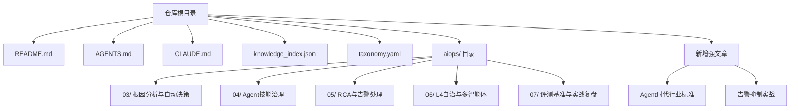

**章节来源**
- [README.md](file://README.md)
- [AGENTS.md](file://AGENTS.md)
- [CLAUDE.md](file://CLAUDE.md)
- [knowledge_index.json](file://knowledge_index.json)
- [taxonomy.yaml](file://taxonomy.yaml)

## 核心组件
围绕AIOps的核心能力，可将体系拆分为以下关键组件：
- 数据采集与指标汇聚：统一采集日志、指标、链路追踪与事件，形成标准化数据湖或时序库。
- 告警管理与降噪：聚合、去重、抑制与关联，降低告警风暴，提升有效告警占比。
- 根因分析与故障诊断：基于规则、图模型与机器学习/大模型进行因果推断与根因定位。
- 自动化与自愈：将处置动作编排为Skill/Playbook，支持审批、回滚与审计。
- 多智能体协同：规划、执行、验证、审计等多角色Agent协作，实现端到端闭环。
- 评测与度量：建立SLO/SLI、燃烧率、误报率、MTTR/MTBF等指标，持续评估改进。
- **新增** Agent标准化：遵循行业标准的Agent框架、协议与治理规范。

上述组件在仓库的多篇文章中得到具体阐述与实践案例支撑，后续章节将逐一展开。

**章节来源**
- [aiops/03/AIOps探索：故障根因分析怎么做，才能从“辅助排障”走向“可自动决策”.md](file://aiops/03/AIOps探索：故障根因分析怎么做，才能从“辅助排障”走向“可自动决策”.md)
- [aiops/05/PagerDuty 的 AI RCA 不是找一个根因，而是把告警变成可处理的事故.md](file://aiops/05/PagerDuty 的 AI RCA 不是找一个根因，而是把告警变成可处理的事故.md)
- [aiops/06/L4级全自治运维体系升级方案.md](file://aiops/06/L4级全自治运维体系升级方案.md)
- [aiops/07/AI 运维智能体评测基准开源与实战指南.md](file://aiops/07/AI 运维智能体评测基准开源与实战指南.md)

## 架构总览
下图展示了一个典型的AIOps智能运维架构，包含数据采集层、数据处理与存储层、智能分析层、自动化执行层与观测度量层，强调多Agent协同与闭环自愈。

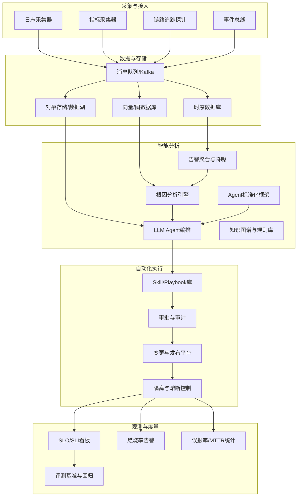

该架构强调：
- 数据驱动：统一接入、标准化建模，保障分析质量。
- 智能驱动：规则+图谱+机器学习/大模型协同，提高准确率与可解释性。
- 自动化闭环：从发现到处置再到验证的全流程自动化，减少人为干预。
- 度量驱动：以SLO为核心，持续评估与优化。
- **新增** 标准驱动：遵循行业Agent标准，确保互操作性与生态兼容性。

[无图表来源，因为该图为概念性架构图，不直接映射具体代码文件]

## 详细组件分析

### 根因分析与自动决策
根因分析是AIOps的核心能力之一，目标是从海量告警与指标中快速定位根因，并支持从“辅助排障”走向“可自动决策”。关键要点包括：
- 数据融合：跨维度指标、日志、拓扑、变更事件联合分析。
- 因果建模：基于图模型与时间序列异常检测，识别传播路径与触发点。
- 决策策略：结合业务SLO与风险偏好，制定自动恢复或人工确认策略。
- 可解释性：输出根因证据链与置信度，便于审计与回溯。

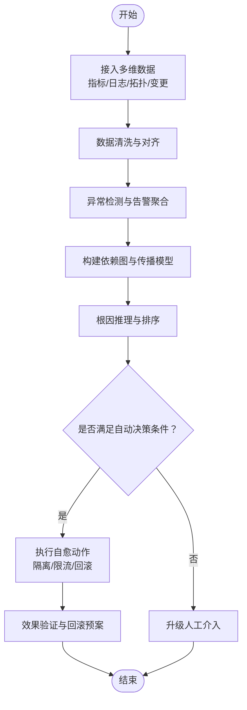

**章节来源**
- [aiops/03/AIOps探索：故障根因分析怎么做，才能从“辅助排障”走向“可自动决策”.md](file://aiops/03/AIOps探索：故障根因分析怎么做，才能从“辅助排障”走向“可自动决策”.md)

### 告警管理与RCA联动
告警管理不仅是通知，更是将告警转化为“可处理的事故”的过程。重点包括：
- 告警收敛：按服务、环境、时间窗口进行聚合与去重。
- 事件归并：将分散告警合并为单一事故，明确责任主体与影响范围。
- RCA联动：在事故级别引入根因分析，输出处置建议与自动化脚本。
- 闭环跟踪：记录处置过程、结果与复盘，持续优化阈值与规则。

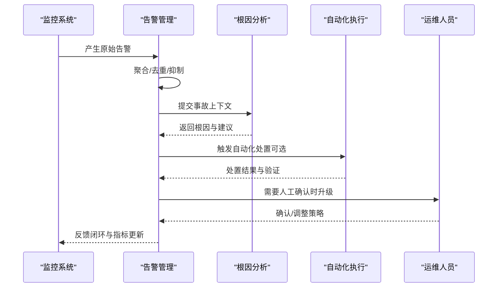

**章节来源**
- [aiops/05/PagerDuty 的 AI RCA 不是找一个根因，而是把告警变成可处理的事故.md](file://aiops/05/PagerDuty 的 AI RCA 不是找一个根因，而是把告警变成可处理的事故.md)

### L4级全自治运维体系
L4自治意味着系统在无需人工干预的情况下完成大部分运维任务，包括预测、诊断、决策与执行。关键要素：
- 预测性维护：基于趋势与异常检测提前预警潜在故障。
- 自适应策略：根据实时状态动态调整阈值、路由与资源分配。
- 安全护栏：对高风险操作设置审批、灰度与回滚机制。
- 持续学习：通过回放与仿真不断优化策略与模型。

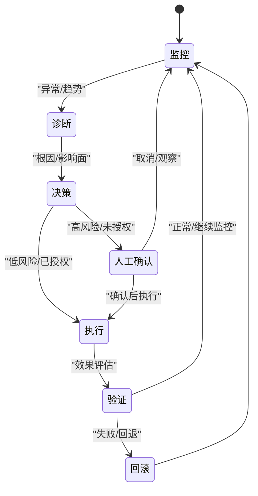

**章节来源**
- [aiops/06/L4级全自治运维体系升级方案.md](file://aiops/06/L4级全自治运维体系升级方案.md)

### 多智能体协同与变更风控
多智能体协同通过不同角色的Agent协作完成复杂任务，如规划、执行、验证、审计等。在变更风控场景中，可实现：
- 智能稽核：自动审查变更计划、依赖与风险。
- 动态审批：基于风险评分与历史表现决定是否需要人工审批。
- 灰度与回滚：分批次发布与自动回滚，降低变更风险。
- 审计与追溯：全程记录决策依据与执行轨迹。

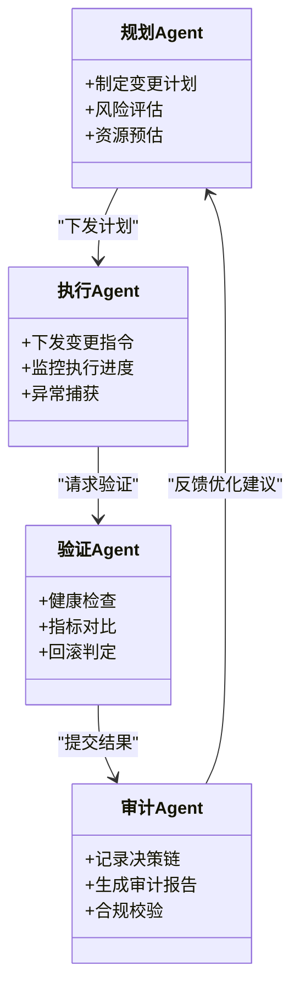

**章节来源**
- [aiops/06/从人工稽核到智能变更风控：运维工单AI多智能体落地实战与避坑指南.md](file://aiops/06/从人工稽核到智能变更风控：运维工单AI多智能体落地实战与避坑指南.md)

### 评测基准与实战指南
建立科学的评测体系是确保AIOps能力持续改进的基础，包括：
- 基准数据集：覆盖典型故障场景、告警噪声与根因标签。
- 评估指标：准确率、召回率、F1、误报率、MTTR、成本等。
- 回归测试：版本迭代前后的一致性验证。
- 实战演练：红蓝对抗、混沌工程与压力测试。

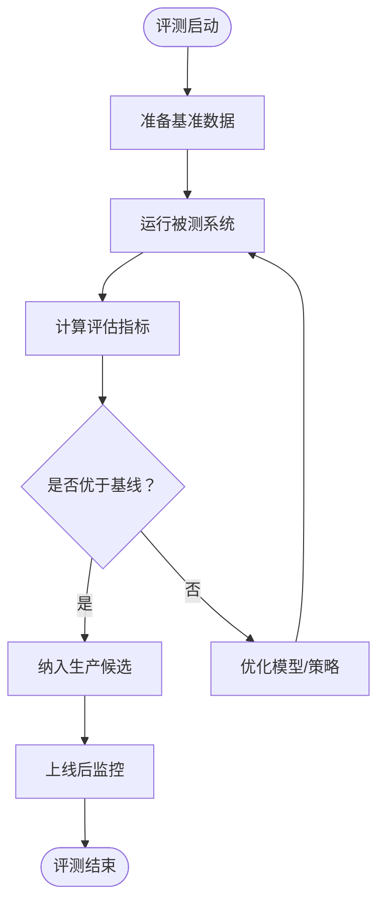

**章节来源**
- [aiops/07/AI 运维智能体评测基准开源与实战指南.md](file://aiops/07/AI 运维智能体评测基准开源与实战指南.md)

### P0故障复盘与告警疲劳治理
P0故障复盘聚焦于告警泛滥导致的“真问题被淹没”，治理思路包括：
- 告警分级与路由：按严重性与影响面分流至不同渠道。
- 噪声抑制：基于相似性聚类与时间窗口抑制重复告警。
- 根因优先：在告警风暴中优先输出根因线索与处置建议。
- 复盘沉淀：将经验固化为规则与Skill，避免重复踩坑。

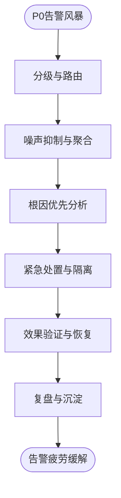

**章节来源**
- [aiops/07/AIOps一次P0故障复盘：告警泛滥，真正问题被海量信息淹没.md](file://aiops/07/AIOps一次P0故障复盘：告警泛滥，真正问题被海量信息淹没.md)

### 认知型AIOps与工单变更自动化
认知型AIOps结合LLM Agent与知识图谱，实现工单变更的自动化框架，包括：
- 意图理解：从自然语言工单中提取变更意图与约束。
- 知识检索：基于图谱与历史案例匹配最佳实践。
- 自动生成：生成变更脚本、审批材料与回滚预案。
- 执行监督：实时监控变更过程，异常时自动中止与回滚。

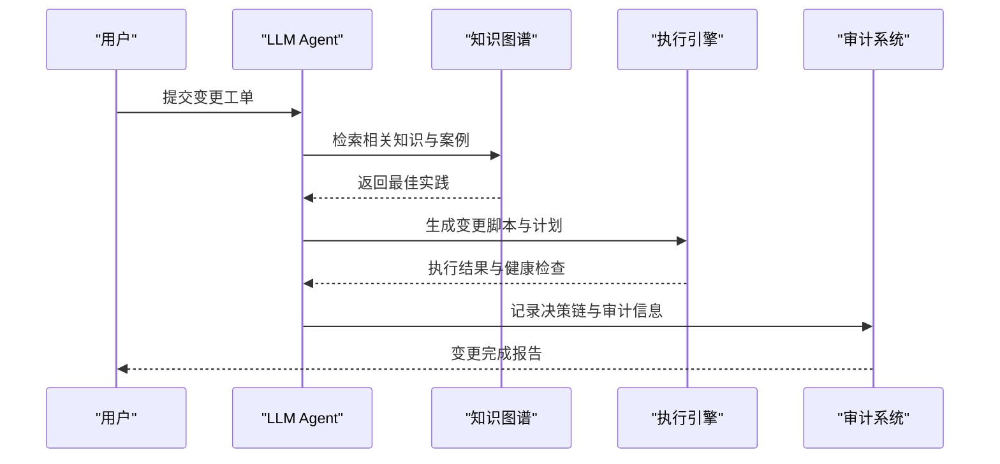

**章节来源**
- [aiops/07/认知型AIOps实践：基于LLM Agent与知识图谱的工单变更自动化框架.md](file://aiops/07/认知型AIOps实践：基于LLM Agent与知识图谱的工单变更自动化框架.md)

### **新增：Agent时代行业标准落地**
随着AIOps进入Agent时代，行业标准成为推动技术落地与生态发展的关键。关键要点包括：
- 标准框架：统一的Agent接口、通信协议与安全规范。
- 互操作性：跨平台、跨厂商的Agent协同与数据共享。
- 治理能力：Agent生命周期管理、权限控制与审计追踪。
- 生态建设：开放API、插件机制与开发者社区。

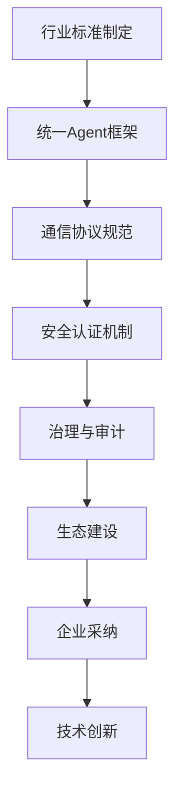

**章节来源**
- [07/AIOps 迈入 Agent 时代！行业标准落地，智能运维迎来全新增长赛道.md](file://07/AIOps 迈入 Agent 时代！行业标准落地，智能运维迎来全新增长赛道.md)

### **新增：告警抑制实战挑战**
在生产环境中，告警抑制是解决告警疲劳的核心手段，但实际落地面临诸多挑战。关键实践包括：
- 抑制策略设计：基于时间窗口、相似度聚类与动态阈值的综合抑制。
- 效果评估：误报率、漏报率与抑制率的平衡优化。
- 动态调整：根据业务特征与环境变化自适应调整抑制参数。
- 可视化监控：抑制效果的实时监控与调优界面。

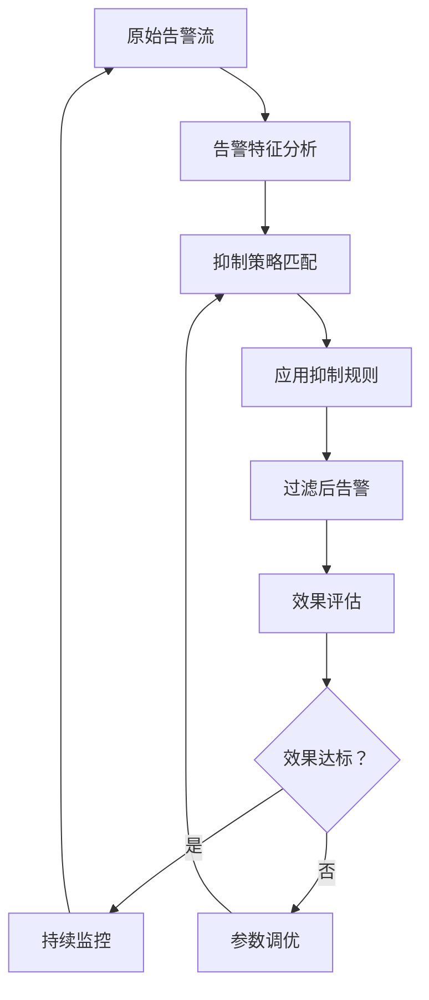

**章节来源**
- [07/你花大价钱上的 AIOps，为什么生产上还压不住告警？.md](file://07/你花大价钱上的 AIOps，为什么生产上还压不住告警？.md)

## 依赖关系分析
AIOps体系的依赖关系主要体现在数据、模型与执行三个层面：
- 数据依赖：指标、日志、拓扑、变更事件等上游数据的质量直接影响分析准确性。
- 模型依赖：规则、图谱、机器学习/大模型之间的协同与权重分配需持续调优。
- 执行依赖：Skill/Playbook的可靠性、权限控制与回滚机制是自动化闭环的关键。
- **新增** 标准依赖：Agent框架、协议与治理规范的兼容性要求。

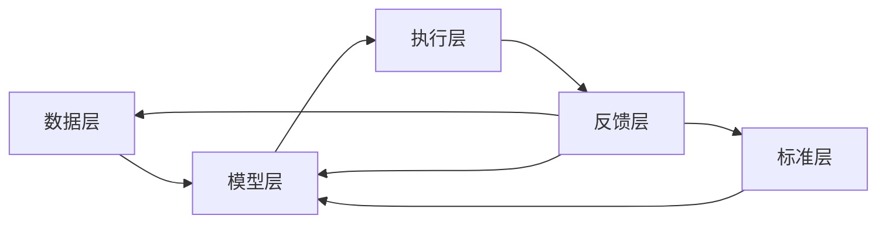

[无图表来源，因为该图为概念性依赖图，不直接映射具体代码文件]

**章节来源**
- [aiops/04/AI Agent Skill全生命周期治理：从可用能力到可信资产.md](file://aiops/04/AI Agent Skill全生命周期治理：从可用能力到可信资产.md)

## 性能考量
- 数据采集与传输：采用批处理与增量同步，减少网络开销与存储压力。
- 实时分析：使用流式计算与近似算法，平衡延迟与精度。
- 模型推理：缓存热点结果，使用量化与蒸馏降低推理成本。
- 自动化执行：并行化与幂等设计，提升吞吐与容错能力。
- 存储优化：冷热分层、压缩与索引优化，降低查询延迟。
- **新增** Agent性能：多Agent并发调度、内存管理与通信开销优化。

[本节为通用指导，不直接分析具体文件]

## 故障排查指南
- 告警风暴：检查聚合规则、抑制策略与路由配置，必要时引入动态阈值。
- 根因不准：复核数据完整性、特征工程与模型训练集，增加可解释性输出。
- 自动化失败：验证权限、依赖与环境一致性，完善回滚与重试机制。
- 性能瓶颈：定位慢查询、内存泄漏与CPU热点，优化索引与并发策略。
- 评测退化：回归测试失败时，逐步缩小范围定位问题模块。
- **新增** Agent故障：检查Agent状态、权限配置与依赖服务可用性。

**章节来源**
- [aiops/07/AIOps一次P0故障复盘：告警泛滥，真正问题被海量信息淹没.md](file://aiops/07/AIOps一次P0故障复盘：告警泛滥，真正问题被海量信息淹没.md)
- [aiops/07/AI 运维智能体评测基准开源与实战指南.md](file://aiops/07/AI 运维智能体评测基准开源与实战指南.md)

## 结论
AIOps智能运维体系的建设是一个系统工程，需要从数据、模型、执行与度量四个维度协同推进。通过根因分析、告警治理、自动化闭环与多智能体协同，企业可以显著提升运维效率与稳定性。同时，建立科学的评测基准与持续优化机制，是确保体系长期有效的关键。建议从痛点场景切入，小步快跑，逐步扩展至全栈自治。

**更新** 随着Agent时代的到来，行业标准将成为推动AIOps规模化落地的关键因素。企业应关注标准演进，积极参与生态建设，确保技术选型的长期价值。

[本节为总结性内容，不直接分析具体文件]

## 附录
- 工具选型建议：选择成熟的消息队列、时序数据库与图数据库；集成主流LLM与Agent框架。
- 部署策略：灰度发布、蓝绿部署与金丝雀发布相结合，确保平滑过渡。
- 安全与合规：权限最小化、审计可追溯、数据脱敏与加密传输。
- 团队与文化：培养SRE与数据思维，建立跨部门协作机制。
- **新增** 标准参与：关注行业组织动态，参与标准制定与生态建设。

[本节为补充信息，不直接分析具体文件]