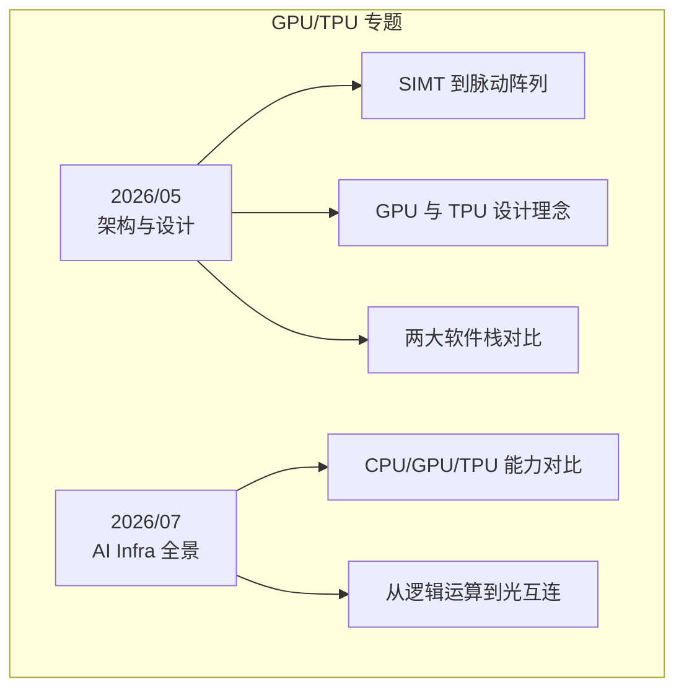
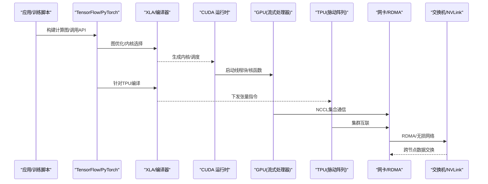
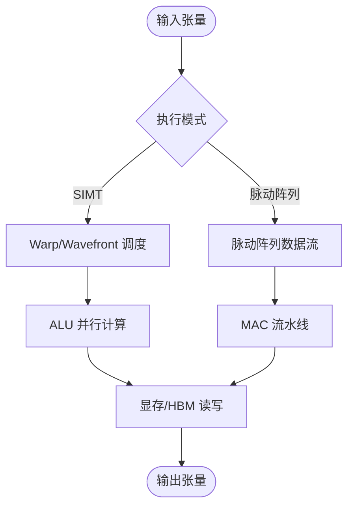
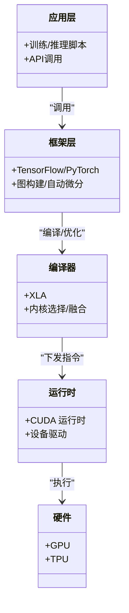
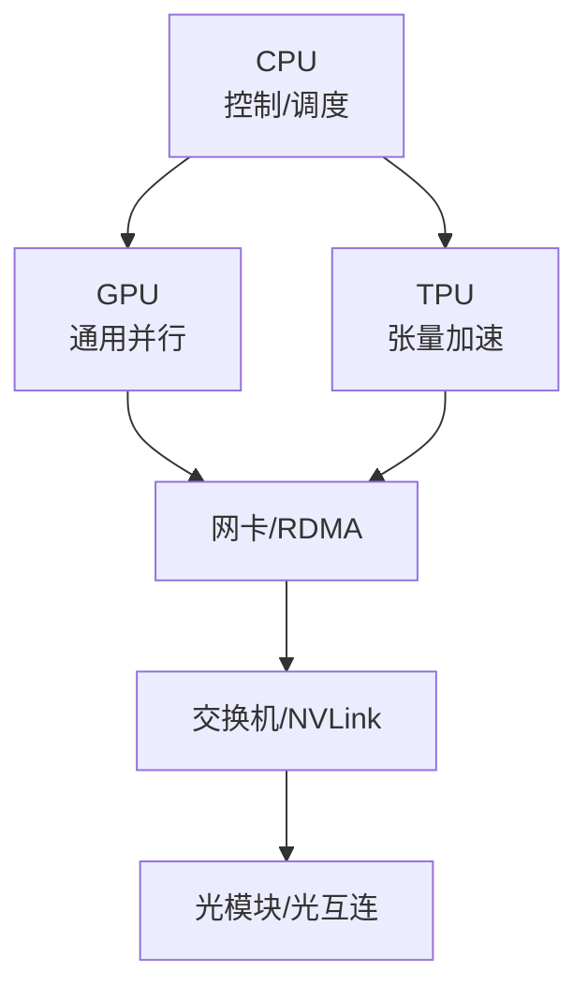
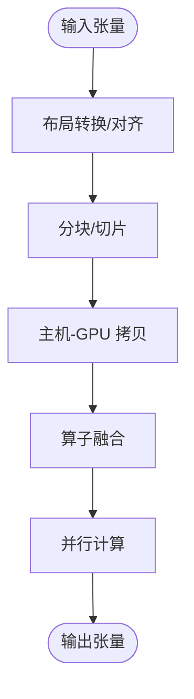
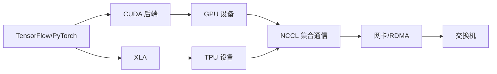

# GPU/TPU技术文章

<cite>
**本文引用的文件**   
- [From SIMT to Systolic - A Foundation for GPU and TPU Architecture.md](file://gpu-tpu/2026/05/From SIMT to Systolic - A Foundation for GPU and TPU Architecture/From SIMT to Systolic - A Foundation for GPU and TPU Architecture.md)
- [GPU 和 TPU 设计理念简介.md](file://gpu-tpu/2026/05/GPU 和 TPU 设计理念简介/GPU 和 TPU 设计理念简介.md)
- [The Two Stacks.md](file://gpu-tpu/2026/05/The Two Stacks/The Two Stacks.md)
- [CPU、GPU、TPU 到底谁更聪明？从逻辑运算到光互连，一篇看懂 AI Infra.md](file://gpu-tpu/2026/07/CPU、GPU、TPU 到底谁更聪明？从逻辑运算到光互连，一篇看懂 AI Infra/CPU、GPU、TPU 到底谁更聪明？从逻辑运算到光互连，一篇看懂 AI Infra.md)
</cite>

## 目录
1. [引言](#引言)
2. [项目结构](#项目结构)
3. [核心组件](#核心组件)
4. [架构总览](#架构总览)
5. [详细组件分析](#详细组件分析)
6. [依赖关系分析](#依赖关系分析)
7. [性能考量](#性能考量)
8. [故障排查指南](#故障排查指南)
9. [结论](#结论)
10. [附录](#附录)

## 引言
本文件面向希望系统掌握 GPU/TPU 技术栈的工程师与研究者，围绕以下目标展开：深入讲解 GPU 的 SIMT 架构与 TPU 的脉动阵列、张量计算等核心技术；对比不同硬件平台的特点与适用场景，提供选型指导；梳理 AI 芯片的技术演进路径（从逻辑运算到光互连）；解释 CUDA 生态与 TensorFlow/PyTorch 框架在底层如何与硬件协同；并给出性能调优、内存管理与并行计算的高级实践案例。内容以仓库中 GPU/TPU 专题文章为依据，辅以可视化图示帮助理解复杂概念。

## 项目结构
GPU/TPU 专题集中在 gpu-tpu/2026 目录下，按月份组织主题文章，涵盖架构基础、设计思想、软硬件栈对比以及从 CPU/GPU/TPU 到光互连的全景解读。

图表来源 
- [From SIMT to Systolic - A Foundation for GPU and TPU Architecture.md](file://gpu-tpu/2026/05/From SIMT to Systolic - A Foundation for GPU and TPU Architecture/From SIMT to Systolic - A Foundation for GPU and TPU Architecture.md)
- [GPU 和 TPU 设计理念简介.md](file://gpu-tpu/2026/05/GPU 和 TPU 设计理念简介/GPU 和 TPU 设计理念简介.md)
- [The Two Stacks.md](file://gpu-tpu/2026/05/The Two Stacks/The Two Stacks.md)
- [CPU、GPU、TPU 到底谁更聪明？从逻辑运算到光互连，一篇看懂 AI Infra.md](file://gpu-tpu/2026/07/CPU、GPU、TPU 到底谁更聪明？从逻辑运算到光互连，一篇看懂 AI Infra/CPU、GPU、TPU 到底谁更聪明？从逻辑运算到光互连，一篇看懂 AI Infra.md)

章节来源
- [From SIMT to Systolic - A Foundation for GPU and TPU Architecture.md](file://gpu-tpu/2026/05/From SIMT to Systolic - A Foundation for GPU and TPU Architecture/From SIMT to Systolic - A Foundation for GPU and TPU Architecture.md)
- [GPU 和 TPU 设计理念简介.md](file://gpu-tpu/2026/05/GPU 和 TPU 设计理念简介/GPU 和 TPU 设计理念简介.md)
- [The Two Stacks.md](file://gpu-tpu/2026/05/The Two Stacks/The Two Stacks.md)
- [CPU、GPU、TPU 到底谁更聪明？从逻辑运算到光互连，一篇看懂 AI Infra.md](file://gpu-tpu/2026/07/CPU、GPU、TPU 到底谁更聪明？从逻辑运算到光互连，一篇看懂 AI Infra/CPU、GPU、TPU 到底谁更聪明？从逻辑运算到光互连，一篇看懂 AI Infra.md)

## 核心组件
- 架构基石：SIMT（单指令多线程）与脉动阵列（Systolic Array）是 GPU 与 TPU 的核心执行模型，分别强调线程级并行与数据流驱动的矩阵乘加速。
- 张量计算：以高维张量为基本操作单元，结合低精度格式与融合算子，提升吞吐与能效。
- 软硬件栈：CUDA + cuBLAS/cuDNN 与 XLA/TensorFlow/PyTorch 后端对硬件抽象与优化，决定实际性能与易用性。
- 互连与存储：NVLink/NVSwitch、PCIe、HBM、光互连构成带宽与延迟的关键瓶颈点。

章节来源
- [From SIMT to Systolic - A Foundation for GPU and TPU Architecture.md](file://gpu-tpu/2026/05/From SIMT to Systolic - A Foundation for GPU and TPU Architecture/From SIMT to Systolic - A Foundation for GPU and TPU Architecture.md)
- [GPU 和 TPU 设计理念简介.md](file://gpu-tpu/2026/05/GPU 和 TPU 设计理念简介/GPU 和 TPU 设计理念简介.md)
- [The Two Stacks.md](file://gpu-tpu/2026/05/The Two Stacks/The Two Stacks.md)
- [CPU、GPU、TPU 到底谁更聪明？从逻辑运算到光互连，一篇看懂 AI Infra.md](file://gpu-tpu/2026/07/CPU、GPU、TPU 到底谁更聪明？从逻辑运算到光互连，一篇看懂 AI Infra/CPU、GPU、TPU 到底谁更聪明？从逻辑运算到光互连，一篇看懂 AI Infra.md)

## 架构总览
下图展示从应用层到硬件层的典型调用链，体现 CUDA 生态与深度学习框架如何驱动 GPU/TPU 执行张量计算，并通过高速互连扩展至多卡/多机。

图表来源 
- [The Two Stacks.md](file://gpu-tpu/2026/05/The Two Stacks/The Two Stacks.md)
- [CPU、GPU、TPU 到底谁更聪明？从逻辑运算到光互连，一篇看懂 AI Infra.md](file://gpu-tpu/2026/07/CPU、GPU、TPU 到底谁更聪明？从逻辑运算到光互连，一篇看懂 AI Infra/CPU、GPU、TPU 到底谁更聪明？从逻辑运算到光互连，一篇看懂 AI Infra.md)

## 详细组件分析

### 组件A：SIMT 与脉动阵列的执行模型
- SIMT（GPU）：将大量轻量线程映射到流式多核上，通过 warp/wavefront 调度实现细粒度并行，适合分支较少、数据并行的张量算子。
- 脉动阵列（TPU）：以数据流驱动的方式在二维阵列中同步推进矩阵乘法，减少访存、提高吞吐，适合大规模矩阵/卷积。

图表来源 
- [From SIMT to Systolic - A Foundation for GPU and TPU Architecture.md](file://gpu-tpu/2026/05/From SIMT to Systolic - A Foundation for GPU and TPU Architecture/From SIMT to Systolic - A Foundation for GPU and TPU Architecture.md)
- [GPU 和 TPU 设计理念简介.md](file://gpu-tpu/2026/05/GPU 和 TPU 设计理念简介/GPU 和 TPU 设计理念简介.md)

章节来源
- [From SIMT to Systolic - A Foundation for GPU and TPU Architecture.md](file://gpu-tpu/2026/05/From SIMT to Systolic - A Foundation for GPU and TPU Architecture/From SIMT to Systolic - A Foundation for GPU and TPU Architecture.md)
- [GPU 和 TPU 设计理念简介.md](file://gpu-tpu/2026/05/GPU 和 TPU 设计理念简介/GPU 和 TPU 设计理念简介.md)

### 组件B：两大软件栈（CUDA vs XLA/TF/PyTorch）
- CUDA 栈：开发者直接编写核函数，精细控制内存与并行，配合 cuBLAS/cuDNN 获得高性能。
- XLA/TF/PyTorch 栈：高层 API 自动图优化、内核选择与融合，降低开发成本，同时通过编译器后端适配 GPU/TPU。

图表来源 
- [The Two Stacks.md](file://gpu-tpu/2026/05/The Two Stacks/The Two Stacks.md)

章节来源
- [The Two Stacks.md](file://gpu-tpu/2026/05/The Two Stacks/The Two Stacks.md)

### 组件C：AI Infra 全景（CPU/GPU/TPU 与光互连）
- CPU：通用控制与串行任务，负责调度、IO、预处理。
- GPU：通用并行计算，适合广泛算子与灵活编程。
- TPU：专用张量加速，适合稳定且规模化的矩阵/卷积负载。
- 互连：PCIe、NVLink、RDMA、光模块/光交换机，决定集群带宽与可扩展性。

图表来源 
- [CPU、GPU、TPU 到底谁更聪明？从逻辑运算到光互连，一篇看懂 AI Infra.md](file://gpu-tpu/2026/07/CPU、GPU、TPU 到底谁更聪明？从逻辑运算到光互连，一篇看懂 AI Infra/CPU、GPU、TPU 到底谁更聪明？从逻辑运算到光互连，一篇看懂 AI Infra.md)

章节来源
- [CPU、GPU、TPU 到底谁更聪明？从逻辑运算到光互连，一篇看懂 AI Infra.md](file://gpu-tpu/2026/07/CPU、GPU、TPU 到底谁更聪明？从逻辑运算到光互连，一篇看懂 AI Infra/CPU、GPU、TPU 到底谁更聪明？从逻辑运算到光互连，一篇看懂 AI Infra.md)

### 组件D：张量计算与内存管理
- 张量布局：NCHW/NHWC、分块与对齐影响缓存命中与带宽利用。
- 内存层次：寄存器、共享内存、全局显存、HBM 的访问代价差异显著。
- 优化策略：算子融合、批量化、异步拷贝、零拷贝（GPUDirect）。

章节来源
- [From SIMT to Systolic - A Foundation for GPU and TPU Architecture.md](file://gpu-tpu/2026/05/From SIMT to Systolic - A Foundation for GPU and TPU Architecture/From SIMT to Systolic - A Foundation for GPU and TPU Architecture.md)
- [GPU 和 TPU 设计理念简介.md](file://gpu-tpu/2026/05/GPU 和 TPU 设计理念简介/GPU 和 TPU 设计理念简介.md)

## 依赖关系分析
- 框架与编译器：TF/PyTorch 依赖 XLA 或 CUDA 后端进行图优化与内核选择。
- 运行时与驱动：CUDA 运行时与设备驱动对接 GPU 资源；TPU 由 XLA 后端驱动。
- 互连与网络：NCCL 依赖 RDMA 与交换机拓扑，影响多卡/多机通信效率。

图表来源 
- [The Two Stacks.md](file://gpu-tpu/2026/05/The Two Stacks/The Two Stacks.md)
- [CPU、GPU、TPU 到底谁更聪明？从逻辑运算到光互连，一篇看懂 AI Infra.md](file://gpu-tpu/2026/07/CPU、GPU、TPU 到底谁更聪明？从逻辑运算到光互连，一篇看懂 AI Infra/CPU、GPU、TPU 到底谁更聪明？从逻辑运算到光互连，一篇看懂 AI Infra.md)

章节来源
- [The Two Stacks.md](file://gpu-tpu/2026/05/The Two Stacks/The Two Stacks.md)
- [CPU、GPU、TPU 到底谁更聪明？从逻辑运算到光互连，一篇看懂 AI Infra.md](file://gpu-tpu/2026/07/CPU、GPU、TPU 到底谁更聪明？从逻辑运算到光互连，一篇看懂 AI Infra/CPU、GPU、TPU 到底谁更聪明？从逻辑运算到光互连，一篇看懂 AI Infra.md)

## 性能考量
- 计算密度与带宽：优先保证算术强度（FLOPs/Byte），避免被内存带宽限制。
- 并行度与利用率：合理划分线程块/网格，关注 SM 占用率与流水线饱和。
- 通信开销：使用高效集合通信库，避免频繁小消息；拓扑感知排序。
- 精度与融合：采用半精度/混合精度，融合算子减少中间结果写入。
- 监控与剖析：使用性能剖析工具定位瓶颈（计算、内存、通信）。

[本节为通用指导，不直接分析具体文件]

## 故障排查指南
- 掉卡/掉速：检查供电、散热、PCIe 链路降速、ECC 错误计数。
- 通信异常：验证 NCCL 初始化、拓扑发现、RDMA 连通性与拥塞控制。
- 内存溢出：调整批大小、启用梯度检查点、优化张量布局与复用。
- 性能不达预期：核对内核选择、数据对齐、算子融合与编译器选项。

[本节为通用指导，不直接分析具体文件]

## 结论
GPU 与 TPU 在执行模型与生态上各有侧重：GPU 以 SIMT 与灵活编程见长，TPU 以脉动阵列与张量加速取胜。选择时应结合负载特征（算子类型、规模、精度）、生态需求（CUDA/XLA 支持）、互连与部署环境综合评估。通过合理的内存管理、并行设计与通信优化，可在不同平台上取得最佳性价比与稳定性。

[本节为总结性内容，不直接分析具体文件]

## 附录
- 术语对照：SIMT（单指令多线程）、Systolic Array（脉动阵列）、ZT（张量）、HBM（高带宽内存）、RDMA（远程直接内存访问）、NCCL（NVIDIA 集合通信库）。
- 延伸阅读：参考仓库中 GPU/TPU 专题文章，进一步理解架构细节与工程实践。

[本节为补充信息，不直接分析具体文件]