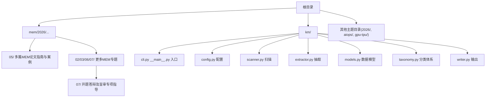
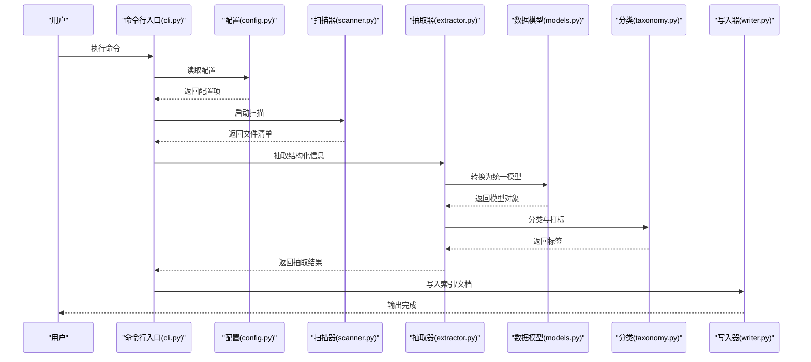
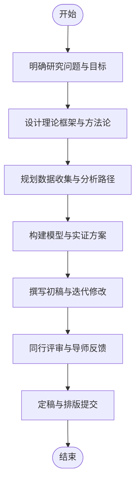
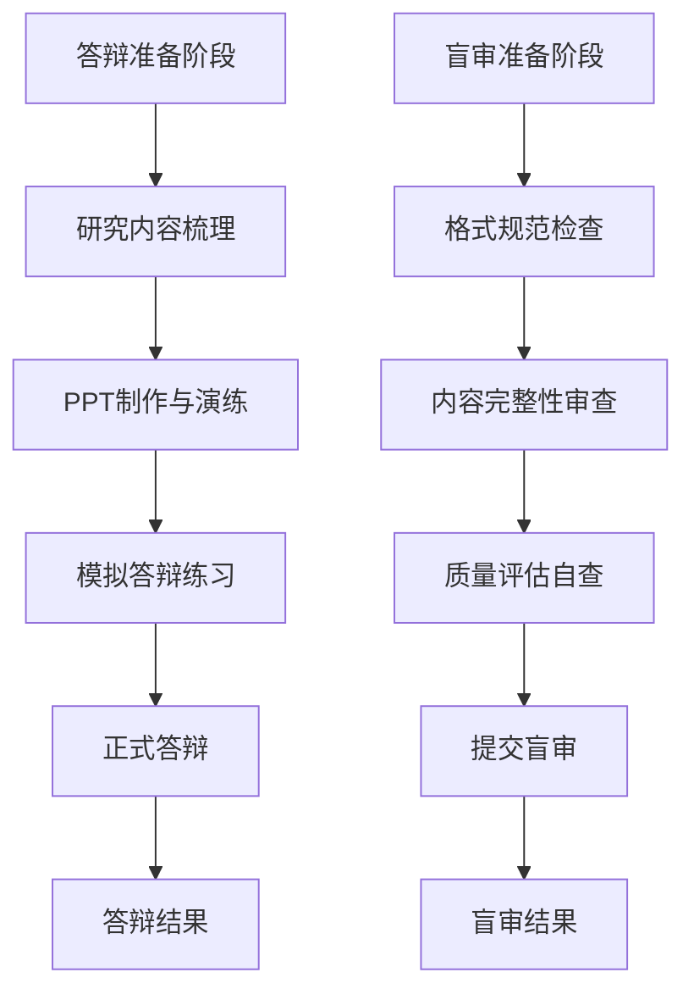
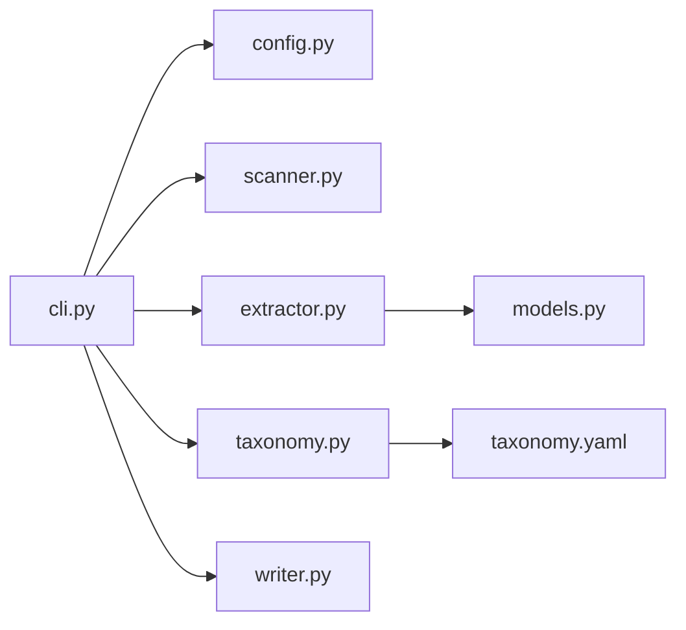

# MEM工程管理文章

<cite>
**本文引用的文件**   
- [README.md](file://README.md)
- [AGENTS.md](file://AGENTS.md)
- [CLAUDE.md](file://CLAUDE.md)
- [knowledge_index.json](file://knowledge_index.json)
- [taxonomy.yaml](file://taxonomy.yaml)
- [km/__init__.py](file://km/__init__.py)
- [km/__main__.py](file://km/__main__.py)
- [km/cli.py](file://km/cli.py)
- [km/config.py](file://km/config.py)
- [km/extractor.py](file://km/extractor.py)
- [km/models.py](file://km/models.py)
- [km/scanner.py](file://km/scanner.py)
- [km/taxonomy.py](file://km/taxonomy.py)
- [km/writer.py](file://km/writer.py)
- [mem/2026/05/2025年最新MEM（工程管理硕士）论文优秀选题60篇！.md](file://mem/2026/05/2025年最新MEM（工程管理硕士）论文优秀选题60篇！.md)
- [mem/2026/05/MEM工程项目管理方向论文开题报告具体写法！.md](file://mem/2026/05/MEM工程项目管理方向论文开题报告具体写法！.md)
- [mem/2026/05/MEM毕业论文主要数量模型方法.md](file://mem/2026/05/MEM毕业论文主要数量模型方法.md)
- [mem/2026/05/MEM毕业论文定量研究方法的成功案例分享！.md](file://mem/2026/05/MEM毕业论文定量研究方法的成功案例分享！.md)
- [mem/2026/05/MEM毕业论文常用的数据分析和统计方法总结.md](file://mem/2026/05/MEM毕业论文常用的数据分析和统计方法总结.md)
- [mem/2026/05/MEM硕士学位论文的一般选题范围有哪些？.md](file://mem/2026/05/MEM硕士学位论文的一般选题范围有哪些？.md)
- [mem/2026/05/MEM论文框架示例：仿真模型在A汽车公司总装车间产能优化中的应用研究/](file://mem/2026/05/MEM论文框架示例：仿真模型在A汽车公司总装车间产能优化中的应用研究/)
- [mem/2026/05/如何写好一篇MEM非全日制硕士论文 - 文献综述篇：不做文献的搬运工.md](file://mem/2026/05/如何写好一篇MEM非全日制硕士论文 - 文献综述篇：不做文献的搬运工.md)
- [mem/2026/05/如何写好一篇MEM非全日制硕士论文 - 现状诊断篇：让数据开口说话.md](file://mem/2026/05/如何写好一篇MEM非全日制硕士论文 - 现状诊断篇：让数据开口说话.md)
- [mem/2026/05/如何写好一篇MEM非全日制硕士论文 - 骨架篇：从零到一搭建黄金框架.md](file://mem/2026/05/如何写好一篇MEM非全日制硕士论文 - 骨架篇：从零到一搭建黄金框架.md)
- [mem/2026/05/经验之谈：能让导师一次认可的MEM论文框架！.md](file://mem/2026/05/经验之谈：能让导师一次认可的MEM论文框架！.md)
- [mem/2026/05/超全攻略MBAMEM论文全流程解析！.md](file://mem/2026/05/超全攻略MBAMEM论文全流程解析！.md)
- [mem/2026/05/超全超详细的MEM工程管理硕士论文撰写攻略/](file://mem/2026/05/超全超详细的MEM工程管理硕士论文撰写攻略/)
- [mem/2026/07/MEM工程管理论文开题答辩及盲审环节中必挂问题!.md](file://mem/2026/07/MEM工程管理论文开题答辩及盲审环节中必挂问题!.md)
</cite>

## 更新摘要
**变更内容**   
- 新增MEM工程管理论文开题答辩及盲审环节指导章节，涵盖常见陷阱和关键问题
- 补充答辩准备策略和盲审评分标准分析
- 增加评审专家关注点与应对技巧
- 完善从开题到答辩的全流程评估指南

## 目录
1. [引言](#引言)
2. [项目结构](#项目结构)
3. [核心组件](#核心组件)
4. [架构总览](#架构总览)
5. [详细组件分析](#详细组件分析)
6. [依赖关系分析](#依赖关系分析)
7. [性能与可扩展性](#性能与可扩展性)
8. [故障排查指南](#故障排查指南)
9. [结论](#结论)
10. [附录](#附录)

## 引言
本文件面向工程管理硕士（MEM）论文写作与工程实践，结合仓库中"mem"主题文章与知识管理工具（km），系统梳理选题方法、研究框架设计、写作规范与答辩流程。内容覆盖从开题报告、文献综述、数据收集、模型构建、实证分析到成果呈现的全流程指导，并强调工程管理理论在项目中的落地应用（项目管理、质量控制、风险管理等）。同时提供优秀论文案例与写作技巧，帮助读者将学术规范与工程实践有机结合。

**更新** 新增开题答辩及盲审环节专项指导，涵盖评审过程中的常见陷阱、关键问题和应对策略，为MEM学生提供完整的评估阶段解决方案。

## 项目结构
仓库围绕"知识管理与内容生产"展开，核心由两部分构成：
- mem 主题文章：按年份与月份组织，聚焦MEM论文选题、框架、方法与实战经验。
- km 工具链：用于扫描、抽取、分类、写入知识内容的命令行工具集，支撑文章与资料的自动化整理与输出。

**图表来源** 
- [README.md](file://README.md)
- [km/cli.py](file://km/cli.py)
- [km/config.py](file://km/config.py)
- [km/scanner.py](file://km/scanner.py)
- [km/extractor.py](file://km/extractor.py)
- [km/models.py](file://km/models.py)
- [km/taxonomy.py](file://km/taxonomy.py)
- [km/writer.py](file://km/writer.py)

**章节来源**
- [README.md](file://README.md)
- [AGENTS.md](file://AGENTS.md)
- [CLAUDE.md](file://CLAUDE.md)
- [knowledge_index.json](file://knowledge_index.json)
- [taxonomy.yaml](file://taxonomy.yaml)

## 核心组件
- 知识管理CLI（km）
  - 入口与命令：通过命令行驱动扫描、抽取、分类与写入流程。
  - 配置管理：集中读取参数与路径设置。
  - 扫描器：遍历知识库目录，发现待处理内容。
  - 抽取器：从文档中提取结构化信息（标题、摘要、关键词、正文片段等）。
  - 数据模型：定义统一的实体与字段，保证抽取结果一致性。
  - 分类体系：基于 taxonomy.yaml 对内容进行标签化与分层。
  - 写入器：将结构化结果持久化为索引或文档。

- MEM论文知识集合
  - 选题与范围：提供大量选题参考与一般范围说明。
  - 开题与框架：给出开题报告写法与论文骨架搭建方法。
  - 方法与模型：汇总常用数量模型、统计方法与成功案例。
  - 数据与诊断：介绍数据来源、清洗与现状诊断思路。
  - 案例与模板：包含仿真模型应用、企业案例与写作模板。
  - **新增** 答辩与盲审指导：涵盖评审流程、常见问题与应对策略。

**章节来源**
- [km/cli.py](file://km/cli.py)
- [km/config.py](file://km/config.py)
- [km/scanner.py](file://km/scanner.py)
- [km/extractor.py](file://km/extractor.py)
- [km/models.py](file://km/models.py)
- [km/taxonomy.py](file://km/taxonomy.py)
- [km/writer.py](file://km/writer.py)
- [mem/2026/05/2025年最新MEM（工程管理硕士）论文优秀选题60篇！.md](file://mem/2026/05/2025年最新MEM（工程管理硕士）论文优秀选题60篇！.md)
- [mem/2026/05/MEM工程项目管理方向论文开题报告具体写法！.md](file://mem/2026/05/MEM工程项目管理方向论文开题报告具体写法！.md)
- [mem/2026/05/MEM毕业论文主要数量模型方法.md](file://mem/2026/05/MEM毕业论文主要数量模型方法.md)
- [mem/2026/05/MEM毕业论文定量研究方法的成功案例分享！.md](file://mem/2026/05/MEM毕业论文定量研究方法的成功案例分享！.md)
- [mem/2026/05/MEM毕业论文常用的数据分析和统计方法总结.md](file://mem/2026/05/MEM毕业论文常用的数据分析和统计方法总结.md)
- [mem/2026/05/MEM硕士学位论文的一般选题范围有哪些？.md](file://mem/2026/05/MEM硕士学位论文的一般选题范围有哪些？.md)
- [mem/2026/05/如何写好一篇MEM非全日制硕士论文 - 文献综述篇：不做文献的搬运工.md](file://mem/2026/05/如何写好一篇MEM非全日制硕士论文 - 文献综述篇：不做文献的搬运工.md)
- [mem/2026/05/如何写好一篇MEM非全日制硕士论文 - 现状诊断篇：让数据开口说话.md](file://mem/2026/05/如何写好一篇MEM非全日制硕士论文 - 现状诊断篇：让数据开口说话.md)
- [mem/2026/05/如何写好一篇MEM非全日制硕士论文 - 骨架篇：从零到一搭建黄金框架.md](file://mem/2026/05/如何写好一篇MEM非全日制硕士论文 - 骨架篇：从零到一搭建黄金框架.md)
- [mem/2026/05/经验之谈：能让导师一次认可的MEM论文框架！.md](file://mem/2026/05/经验之谈：能让导师一次认可的MEM论文框架！.md)
- [mem/2026/05/超全攻略MBAMEM论文全流程解析！.md](file://mem/2026/05/超全攻略MBAMEM论文全流程解析！.md)
- [mem/2026/07/MEM工程管理论文开题答辩及盲审环节中必挂问题!.md](file://mem/2026/07/MEM工程管理论文开题答辩及盲审环节中必挂问题!.md)

## 架构总览
下图展示km工具链的整体架构与数据流：从配置加载、目录扫描、内容抽取、模型映射、分类打标到最终写入，形成闭环的知识生产流水线。

**图表来源** 
- [km/cli.py](file://km/cli.py)
- [km/config.py](file://km/config.py)
- [km/scanner.py](file://km/scanner.py)
- [km/extractor.py](file://km/extractor.py)
- [km/models.py](file://km/models.py)
- [km/taxonomy.py](file://km/taxonomy.py)
- [km/writer.py](file://km/writer.py)

## 详细组件分析

### 知识管理CLI与主流程
- 职责：提供统一命令接口，协调各模块协作，控制执行顺序与错误处理。
- 关键点：
  - 参数解析与校验，确保输入合法。
  - 调用配置模块获取路径、规则与开关。
  - 编排扫描、抽取、分类、写入阶段，支持断点续跑与日志记录。
  - 异常捕获与友好提示，便于定位问题。

**章节来源**
- [km/__main__.py](file://km/__main__.py)
- [km/cli.py](file://km/cli.py)
- [km/config.py](file://km/config.py)

### 扫描器（scanner）
- 职责：递归遍历知识库目录，识别目标文件类型与元数据。
- 关键点：
  - 过滤规则（扩展名、忽略列表）。
  - 并发扫描提升效率。
  - 生成文件清单供后续抽取使用。

**章节来源**
- [km/scanner.py](file://km/scanner.py)

### 抽取器（extractor）
- 职责：从文档中提取标题、摘要、关键词、正文片段等结构化信息。
- 关键点：
  - 多格式适配（Markdown、HTML等）。
  - 正则与解析策略组合，提高抽取准确率。
  - 抽取结果标准化为统一模型。

**章节来源**
- [km/extractor.py](file://km/extractor.py)
- [km/models.py](file://km/models.py)

### 数据模型（models）
- 职责：定义抽取结果的统一数据结构，确保下游一致消费。
- 关键点：
  - 字段命名规范与类型约束。
  - 默认值与必填校验。
  - 序列化/反序列化工具。

**章节来源**
- [km/models.py](file://km/models.py)

### 分类体系（taxonomy）
- 职责：依据 taxonomy.yaml 对内容进行标签化与层级划分。
- 关键点：
  - 规则引擎匹配与优先级。
  - 多级标签与互斥逻辑。
  - 可扩展的分类树维护。

**章节来源**
- [km/taxonomy.py](file://km/taxonomy.py)
- [taxonomy.yaml](file://taxonomy.yaml)

### 写入器（writer）
- 职责：将结构化结果持久化为索引文件或文档。
- 关键点：
  - 输出格式（JSON、Markdown、CSV等）。
  - 增量更新与去重策略。
  - 失败重试与事务回滚。

**章节来源**
- [km/writer.py](file://km/writer.py)

### MEM论文写作与流程（以"骨架篇"为例）
- 目标：从零到一搭建论文框架，明确章节结构与写作要点。
- 关键步骤：
  - 确定研究问题与目标。
  - 设计理论框架与方法论。
  - 规划数据收集与分析路径。
  - 构建模型与实证方案。
  - 撰写讨论与结论，提出改进建议。

**图表来源** 
- [mem/2026/05/如何写好一篇MEM非全日制硕士论文 - 骨架篇：从零到一搭建黄金框架.md](file://mem/2026/05/如何写好一篇MEM非全日制硕士论文 - 骨架篇：从零到一搭建黄金框架.md)

**章节来源**
- [mem/2026/05/如何写好一篇MEM非全日制硕士论文 - 骨架篇：从零到一搭建黄金框架.md](file://mem/2026/05/如何写好一篇MEM非全日制硕士论文 - 骨架篇：从零到一搭建黄金框架.md)

### 开题报告与选题范围（以"开题报告写法"和"选题范围"为例）
- 开题报告要点：
  - 背景与意义、研究内容与目标、技术路线与方法、进度安排与预期成果。
- 选题范围：
  - 工程管理常见方向（项目管理、质量控制、风险管理、供应链、数字化升级等）。
  - 结合行业热点与企业实际，突出可操作性和创新性。

**章节来源**
- [mem/2026/05/MEM工程项目管理方向论文开题报告具体写法！.md](file://mem/2026/05/MEM工程项目管理方向论文开题报告具体写法！.md)
- [mem/2026/05/MEM硕士学位论文的一般选题范围有哪些？.md](file://mem/2026/05/MEM硕士学位论文的一般选题范围有哪些？.md)

### 数据收集与现状诊断（以"现状诊断"为例）
- 数据来源：企业内部报表、项目管理系统、调研问卷、公开数据库。
- 数据处理：缺失值处理、异常值检测、指标标准化。
- 现状诊断：描述性统计、趋势分析、对比分析，用数据揭示问题。

**章节来源**
- [mem/2026/05/如何写好一篇MEM非全日制硕士论文 - 现状诊断篇：让数据开口说话.md](file://mem/2026/05/如何写好一篇MEM非全日制硕士论文 - 现状诊断篇：让数据开口说话.md)

### 数量模型与统计分析（以"主要数量模型方法"和"常用统计方法"为例）
- 数量模型：线性回归、时间序列、优化模型、仿真模型等。
- 统计方法：描述统计、假设检验、方差分析、相关性分析。
- 案例分享：结合真实项目数据，展示模型选择、参数估计与结果解释。

**章节来源**
- [mem/2026/05/MEM毕业论文主要数量模型方法.md](file://mem/2026/05/MEM毕业论文主要数量模型方法.md)
- [mem/2026/05/MEM毕业论文常用的数据分析和统计方法总结.md](file://mem/2026/05/MEM毕业论文常用的数据分析和统计方法总结.md)
- [mem/2026/05/MEM毕业论文定量研究方法的成功案例分享！.md](file://mem/2026/05/MEM毕业论文定量研究方法的成功案例分享！.md)

### 文献综述（以"文献综述篇"为例）
- 目标：梳理领域内研究现状、理论基础与研究空白。
- 方法：系统性检索、筛选标准、主题聚类、批判性评述。
- 写作要点：避免简单堆砌，强调逻辑主线与观点提炼。

**章节来源**
- [mem/2026/05/如何写好一篇MEM非全日制硕士论文 - 文献综述篇：不做文献的搬运工.md](file://mem/2026/05/如何写好一篇MEM非全日制硕士论文 - 文献综述篇：不做文献的搬运工.md)

### 优秀案例与模板（以"论文框架示例"和"撰写攻略"为例）
- 框架示例：仿真模型在企业总装车间的应用，体现理论与实践结合。
- 撰写攻略：从选题到答辩的全流程注意事项与避坑指南。

**章节来源**
- [mem/2026/05/MEM论文框架示例：仿真模型在A汽车公司总装车间产能优化中的应用研究/](file://mem/2026/05/MEM论文框架示例：仿真模型在A汽车公司总装车间产能优化中的应用研究/)
- [mem/2026/05/超全超详细的MEM工程管理硕士论文撰写攻略/](file://mem/2026/05/超全超详细的MEM工程管理硕士论文撰写攻略/)

### 开题答辩及盲审环节专项指导（新增）
- **答辩准备策略**：
  - PPT制作要点：简洁明了、重点突出、图文并茂
  - 演讲技巧：时间控制、语言表达、肢体语言
  - 问答准备：预判问题、准备答案、保持自信
- **盲审评分标准**：
  - 选题价值与创新性（25%）
  - 理论框架与方法科学性（25%）
  - 数据分析与论证质量（25%）
  - 写作规范与表达水平（25%）
- **常见陷阱与应对**：
  - 选题过大过空：聚焦具体问题，缩小研究范围
  - 理论脱离实践：强化工程背景与实际应用
  - 数据质量不足：确保数据来源可靠、样本量充足
  - 逻辑结构混乱：建立清晰的论证链条
  - 格式规范问题：严格遵循学校格式要求

**图表来源** 
- [mem/2026/07/MEM工程管理论文开题答辩及盲审环节中必挂问题!.md](file://mem/2026/07/MEM工程管理论文开题答辩及盲审环节中必挂问题!.md)

**章节来源**
- [mem/2026/07/MEM工程管理论文开题答辩及盲审环节中必挂问题!.md](file://mem/2026/07/MEM工程管理论文开题答辩及盲审环节中必挂问题!.md)

## 依赖关系分析
km工具链内部模块之间存在清晰的依赖关系：CLI依赖配置、扫描器、抽取器、分类器与写入器；抽取器依赖数据模型；分类器依赖分类体系定义。

**图表来源** 
- [km/cli.py](file://km/cli.py)
- [km/config.py](file://km/config.py)
- [km/scanner.py](file://km/scanner.py)
- [km/extractor.py](file://km/extractor.py)
- [km/models.py](file://km/models.py)
- [km/taxonomy.py](file://km/taxonomy.py)
- [km/writer.py](file://km/writer.py)
- [taxonomy.yaml](file://taxonomy.yaml)

**章节来源**
- [km/cli.py](file://km/cli.py)
- [km/config.py](file://km/config.py)
- [km/scanner.py](file://km/scanner.py)
- [km/extractor.py](file://km/extractor.py)
- [km/models.py](file://km/models.py)
- [km/taxonomy.py](file://km/taxonomy.py)
- [km/writer.py](file://km/writer.py)
- [taxonomy.yaml](file://taxonomy.yaml)

## 性能与可扩展性
- 扫描阶段：采用并行遍历与过滤策略，减少I/O开销。
- 抽取阶段：正则与解析规则可插拔，便于新增格式支持。
- 分类阶段：规则引擎支持优先级与冲突消解，提升准确性。
- 写入阶段：支持增量更新与批量写入，降低重复计算成本。
- 可扩展性：通过配置文件与模块化设计，快速接入新数据源与新输出格式。

## 故障排查指南
- 常见问题：
  - 配置路径错误或权限不足导致扫描失败。
  - 文档格式不兼容导致抽取为空或错误。
  - 分类规则冲突导致标签不准确。
  - 写入失败因磁盘空间不足或锁冲突。
- 排查步骤：
  - 检查配置文件与运行环境。
  - 查看日志定位失败阶段与原因。
  - 验证输入数据质量与格式。
  - 逐步禁用模块定位问题。

**章节来源**
- [km/config.py](file://km/config.py)
- [km/scanner.py](file://km/scanner.py)
- [km/extractor.py](file://km/extractor.py)
- [km/taxonomy.py](file://km/taxonomy.py)
- [km/writer.py](file://km/writer.py)

## 结论
本仓库为MEM论文写作提供了系统化资源与工具支撑。通过km工具链实现知识内容的自动化采集、抽取、分类与输出，结合mem主题文章中的选题、框架、方法与案例，帮助读者高效完成从开题到答辩的全过程。**最新更新** 增加了开题答辩及盲审环节的专项指导，涵盖评审过程中的常见陷阱、关键问题和应对策略，进一步完善了MEM论文写作的完整指导体系。建议在实践中遵循学术规范，强化工程实践导向，注重数据质量与模型合理性，持续提升论文质量与应用价值。

## 附录
- 推荐阅读顺序：
  - 先读"选题范围"与"开题报告写法"，明确方向与计划。
  - 再读"骨架篇"与"文献综述篇"，搭建框架与理论基础。
  - 接着学习"现状诊断""数量模型""统计方法"，开展实证分析。
  - 最后参考"优秀案例""撰写攻略"与"答辩盲审指导"，完善细节与表达。

**更新** 新增答辩盲审指导阅读建议，帮助学生在评估阶段做好充分准备。