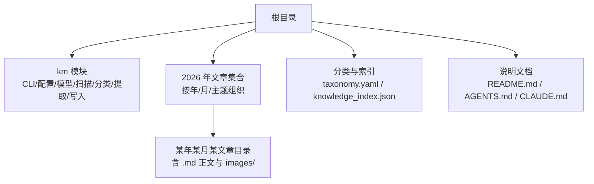
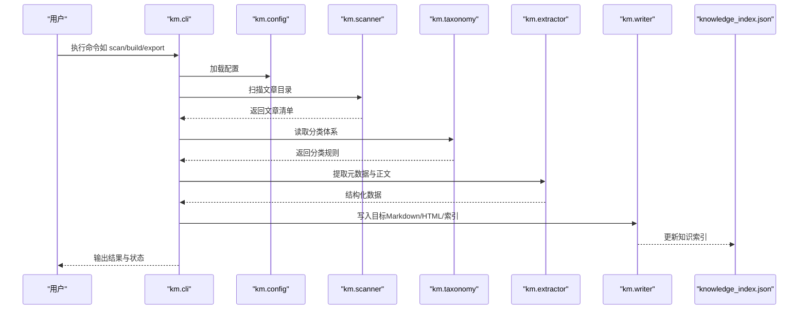
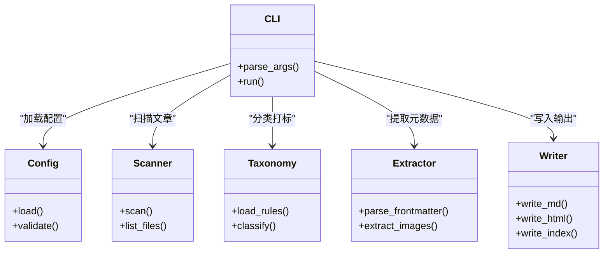

# 文章集合

<cite>
**本文引用的文件**   
- [README.md](file://README.md)
- [AGENTS.md](file://AGENTS.md)
- [CLAUDE.md](file://CLAUDE.md)
- [knowledge_index.json](file://knowledge_index.json)
- [taxonomy.yaml](file://taxonomy.yaml)
- [km/__main__.py](file://km/__main__.py)
- [km/cli.py](file://km/cli.py)
- [km/config.py](file://km/config.py)
- [km/models.py](file://km/models.py)
- [km/scanner.py](file://km/scanner.py)
- [km/taxonomy.py](file://km/taxonomy.py)
- [km/extractor.py](file://km/extractor.py)
- [km/writer.py](file://km/writer.py)
- [2026/02/1000 万人围观的 Claude Code 创始人 0% 手写代码工作流更新了（附我的实战心得）/1000 万人围观的 Claude Code 创始人 0% 手写代码工作流更新了（附我的实战心得）.md](file://2026/02/1000 万人围观的 Claude Code 创始人 0% 手写代码工作流更新了（附我的实战心得）/1000 万人围观的 Claude Code 创始人 0% 手写代码工作流更新了（附我的实战心得）.md)
- [2026/02/insurance_article/convert_to_html.py](file://2026/02/insurance_article/convert_to_html.py)
- [2026/02/insurance_article/manual_convert.py](file://2026/02/insurance_article/manual_convert.py)
- [2026/02/insurance_article/pack_zip.py](file://2026/02/insurance_article/pack_zip.py)
</cite>

## 目录
1. [简介](#简介)
2. [项目结构](#项目结构)
3. [核心组件](#核心组件)
4. [架构总览](#架构总览)
5. [详细组件分析](#详细组件分析)
6. [依赖关系分析](#依赖关系分析)
7. [性能考虑](#性能考虑)
8. [故障排查指南](#故障排查指南)
9. [结论](#结论)
10. [附录](#附录)

## 简介
本仓库是一个“文章集合”系统，用于集中管理大量技术类文章与资料。其特点包括：
- 按年/月组织文章目录，便于时间维度检索与归档
- 每篇文章独立目录，内含 Markdown 正文与 images 资源子目录
- 通过分类体系 taxonomy.yaml 对内容进行分类、标签与元数据管理
- 提供 Python CLI 工具链（km）实现扫描、提取、写入与索引构建
- 支持批量处理脚本（如 HTML 转换、打包等），以及可选的知识索引文件 knowledge_index.json

该文档面向作者、编辑与自动化运维人员，覆盖文章组织结构、分类体系、存储格式、新增与维护流程、模板与图片处理、搜索与过滤、版本控制、批量处理与自动化脚本使用等内容。

## 项目结构
整体采用“根级配置 + 业务模块 + 内容目录”的分层组织：
- 根级配置与说明：README.md、AGENTS.md、CLAUDE.md、taxonomy.yaml、knowledge_index.json
- 业务模块 km：命令行入口、配置、模型定义、扫描器、分类器、提取器、写入器等
- 内容目录 2026/aiops/gpu-tpu/mem 等：按年份/月份/主题分层的文章集合，每篇文章一个目录，包含 .md 正文与 images 资源

图示来源
- [README.md](file://README.md)
- [taxonomy.yaml](file://taxonomy.yaml)
- [km/__main__.py](file://km/__main__.py)
- [km/cli.py](file://km/cli.py)
- [km/scanner.py](file://km/scanner.py)
- [km/taxonomy.py](file://km/taxonomy.py)
- [km/extractor.py](file://km/extractor.py)
- [km/writer.py](file://km/writer.py)

章节来源
- [README.md](file://README.md)
- [AGENTS.md](file://AGENTS.md)
- [CLAUDE.md](file://CLAUDE.md)
- [taxonomy.yaml](file://taxonomy.yaml)
- [knowledge_index.json](file://knowledge_index.json)

## 核心组件
- 命令行入口与路由：km/__main__.py、km/cli.py
- 配置管理：km/config.py
- 数据模型：km/models.py
- 内容扫描：km/scanner.py
- 分类与标签：km/taxonomy.py
- 内容提取：km/extractor.py
- 输出写入：km/writer.py

这些组件共同构成“扫描—解析—分类—提取—写入—索引”的流水线，支撑文章的自动化管理与发布。

章节来源
- [km/__main__.py](file://km/__main__.py)
- [km/cli.py](file://km/cli.py)
- [km/config.py](file://km/config.py)
- [km/models.py](file://km/models.py)
- [km/scanner.py](file://km/scanner.py)
- [km/taxonomy.py](file://km/taxonomy.py)
- [km/extractor.py](file://km/extractor.py)
- [km/writer.py](file://km/writer.py)

## 架构总览
下图展示了从命令行到各模块的调用关系与数据流向：

图示来源
- [km/cli.py](file://km/cli.py)
- [km/config.py](file://km/config.py)
- [km/scanner.py](file://km/scanner.py)
- [km/taxonomy.py](file://km/taxonomy.py)
- [km/extractor.py](file://km/extractor.py)
- [km/writer.py](file://km/writer.py)
- [knowledge_index.json](file://knowledge_index.json)

## 详细组件分析

### 命令行与入口（km/__main__.py、km/cli.py）
- 职责：暴露统一 CLI 接口，接收参数并调度具体任务（扫描、构建、导出、校验等）
- 关键点：
  - 参数解析与默认值
  - 错误提示与退出码
  - 与配置模块交互以获取路径、开关等
- 建议：
  - 为常用操作提供快捷别名
  - 增加 --dry-run 模式便于预览变更

章节来源
- [km/__main__.py](file://km/__main__.py)
- [km/cli.py](file://km/cli.py)

### 配置管理（km/config.py）
- 职责：集中管理路径、开关、格式化选项、输出目录等
- 关键点：
  - 配置文件加载顺序与优先级
  - 环境变量注入
  - 校验与默认值回退
- 建议：
  - 将敏感信息（如密钥）放入环境变量或外部密钥管理

章节来源
- [km/config.py](file://km/config.py)

### 数据模型（km/models.py）
- 职责：定义文章、元数据、分类、索引等数据结构
- 关键点：
  - 字段命名规范与类型约束
  - 必填项与可选项
  - 序列化/反序列化工具
- 建议：
  - 引入校验库（如 pydantic）提升健壮性

章节来源
- [km/models.py](file://km/models.py)

### 内容扫描（km/scanner.py）
- 职责：遍历指定目录，发现 .md 文件与 images 资源，生成文章清单
- 关键点：
  - 递归扫描策略
  - 忽略规则（如 .gitignore）
  - 并发扫描优化
- 建议：
  - 增量扫描，记录上次扫描时间戳

章节来源
- [km/scanner.py](file://km/scanner.py)

### 分类与标签（km/taxonomy.py）
- 职责：基于 taxonomy.yaml 对文章进行分类、打标签、设置权重
- 关键点：
  - 分类树结构与继承
  - 正则匹配与关键词命中
  - 冲突解决策略
- 建议：
  - 提供分类可视化与覆盖率报告

章节来源
- [km/taxonomy.py](file://km/taxonomy.py)
- [taxonomy.yaml](file://taxonomy.yaml)

### 内容提取（km/extractor.py）
- 职责：从 .md 中提取标题、摘要、标签、图片引用、正文等
- 关键点：
  - YAML Front Matter 解析
  - 图片路径规范化
  - 正文清洗与标准化
- 建议：
  - 支持多格式输入（.md/.html/.pdf）

章节来源
- [km/extractor.py](file://km/extractor.py)

### 输出写入（km/writer.py）
- 职责：将结构化数据写回 Markdown、HTML、JSON 索引等
- 关键点：
  - 模板渲染
  - 编码与转义
  - 幂等写入与备份
- 建议：
  - 提供 diff 预览与回滚机制

章节来源
- [km/writer.py](file://km/writer.py)

### 文章模板与存储格式
- 存储格式：
  - 每篇文章一个目录，主文件为 <文章名>.md
  - 图片存放于同目录下的 images/ 子目录
  - 可选的 HTML 副本与中间产物
- 模板建议：
  - 使用 YAML Front Matter 定义标题、日期、分类、标签、摘要、作者等
  - 正文遵循 Markdown 规范，图片相对路径指向 images/
- 示例参考：
  - [2026/02/1000 万人围观的 Claude Code 创始人 0% 手写代码工作流更新了（附我的实战心得）/1000 万人围观的 Claude Code 创始人 0% 手写代码工作流更新了（附我的实战心得）.md](file://2026/02/1000 万人围观的 Claude Code 创始人 0% 手写代码工作流更新了（附我的实战心得）/1000 万人围观的 Claude Code 创始人 0% 手写代码工作流更新了（附我的实战心得）.md)

章节来源
- [2026/02/1000 万人围观的 Claude Code 创始人 0% 手写代码工作流更新了（附我的实战心得）/1000 万人围观的 Claude Code 创始人 0% 手写代码工作流更新了（附我的实战心得）.md](file://2026/02/1000 万人围观的 Claude Code 创始人 0% 手写代码工作流更新了（附我的实战心得）/1000 万人围观的 Claude Code 创始人 0% 手写代码工作流更新了（附我的实战心得）.md)

### 图片处理与格式化选项
- 图片处理：
  - 自动压缩与格式转换（建议 PNG/JPEG/WebP）
  - 路径规范化与去重
  - 外链检测与本地化
- 格式化选项：
  - 标题层级、列表样式、表格对齐
  - 代码块语言标注与高亮
  - 链接检查与修复

章节来源
- [km/extractor.py](file://km/extractor.py)
- [km/writer.py](file://km/writer.py)

### 搜索与过滤
- 能力：
  - 全文检索（基于索引）
  - 按分类、标签、日期范围过滤
  - 关键词高亮与摘要片段
- 实现建议：
  - 使用轻量搜索引擎（如 SQLite FTS、Whoosh）
  - 增量更新索引

章节来源
- [knowledge_index.json](file://knowledge_index.json)
- [km/scanner.py](file://km/scanner.py)
- [km/extractor.py](file://km/extractor.py)

### 版本控制机制
- 推荐实践：
  - 使用 Git 进行版本控制
  - 每次提交附带变更说明（Changelog）
  - 分支策略：主分支稳定，功能分支开发
- 自动化：
  - CI 触发索引重建与校验
  - 预提交钩子检查格式与链接

章节来源
- [AGENTS.md](file://AGENTS.md)
- [CLAUDE.md](file://CLAUDE.md)

### 批量处理工具与自动化脚本
- 现有脚本：
  - convert_to_html.py：Markdown 转 HTML
  - manual_convert.py：手动转换辅助
  - pack_zip.py：打包发布
- 使用方式：
  - 在对应目录执行脚本，传入源/目标路径
  - 结合 km CLI 进行批量扫描与构建

章节来源
- [2026/02/insurance_article/convert_to_html.py](file://2026/02/insurance_article/convert_to_html.py)
- [2026/02/insurance_article/manual_convert.py](file://2026/02/insurance_article/manual_convert.py)
- [2026/02/insurance_article/pack_zip.py](file://2026/02/insurance_article/pack_zip.py)

## 依赖关系分析
km 模块内部依赖关系如下：

图示来源
- [km/cli.py](file://km/cli.py)
- [km/config.py](file://km/config.py)
- [km/scanner.py](file://km/scanner.py)
- [km/taxonomy.py](file://km/taxonomy.py)
- [km/extractor.py](file://km/extractor.py)
- [km/writer.py](file://km/writer.py)

章节来源
- [km/cli.py](file://km/cli.py)
- [km/config.py](file://km/config.py)
- [km/scanner.py](file://km/scanner.py)
- [km/taxonomy.py](file://km/taxonomy.py)
- [km/extractor.py](file://km/extractor.py)
- [km/writer.py](file://km/writer.py)

## 性能考虑
- 扫描阶段：
  - 使用并行 I/O 提升目录遍历速度
  - 缓存文件列表，避免重复扫描
- 提取阶段：
  - 懒加载大文件，按需解析
  - 正则表达式优化与编译复用
- 写入阶段：
  - 批量写入减少磁盘 IO
  - 增量更新索引，避免全量重建
- 内存管理：
  - 流式处理长文，避免一次性加载
  - 及时释放临时对象

[本节为通用指导，不直接分析具体文件]

## 故障排查指南
- 常见问题：
  - 扫描不到新文章：检查目录权限与忽略规则
  - 分类失败：核对 taxonomy.yaml 语法与匹配规则
  - 图片缺失：确认相对路径与 images 目录存在
  - 索引不一致：重建索引并比对差异
- 调试技巧：
  - 启用详细日志（--verbose）
  - 使用 --dry-run 预览变更
  - 分步执行（先扫描，再提取，后写入）

章节来源
- [km/cli.py](file://km/cli.py)
- [km/scanner.py](file://km/scanner.py)
- [km/taxonomy.py](file://km/taxonomy.py)
- [km/extractor.py](file://km/extractor.py)
- [km/writer.py](file://km/writer.py)

## 结论
本文章集合系统通过清晰的目录结构、统一的分类体系与可复用的 Python 工具链，实现了从内容创作到发布的全流程自动化。建议团队遵循本文档的规范进行新增与维护，并结合 CI/CD 实现持续集成与质量保障。

[本节为总结性内容，不直接分析具体文件]

## 附录
- 快速上手：
  - 安装依赖：python -m pip install -r requirements.txt（如有）
  - 初始化配置：cp config.example.yaml config.yaml 并编辑
  - 扫描文章：python -m km scan --path ./2026
  - 构建索引：python -m km build --index knowledge_index.json
  - 导出 HTML：python -m km export --format html
- 最佳实践：
  - 使用 YAML Front Matter 规范元数据
  - 图片统一存放 images/ 目录并使用相对路径
  - 定期运行 lint 与链接检查
  - 提交前执行 dry-run 验证

[本节为补充信息，不直接分析具体文件]