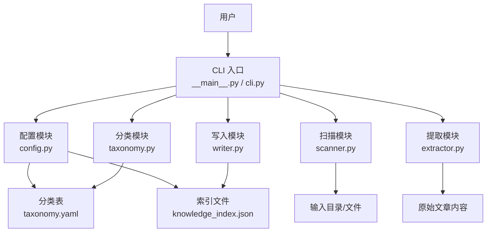
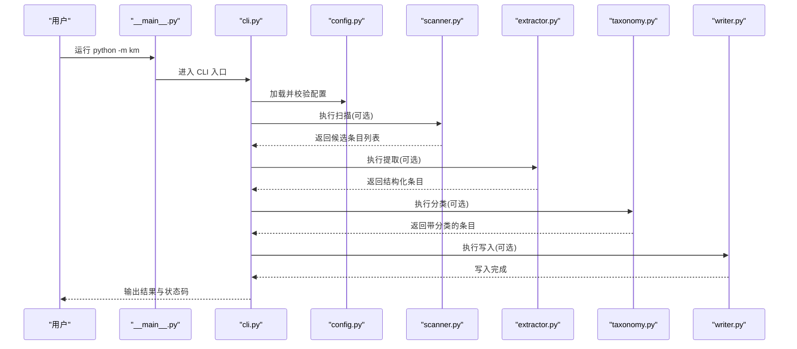
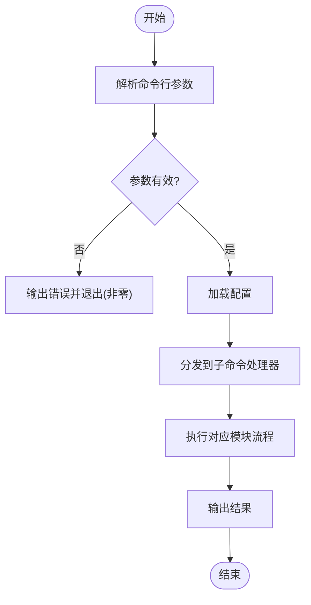
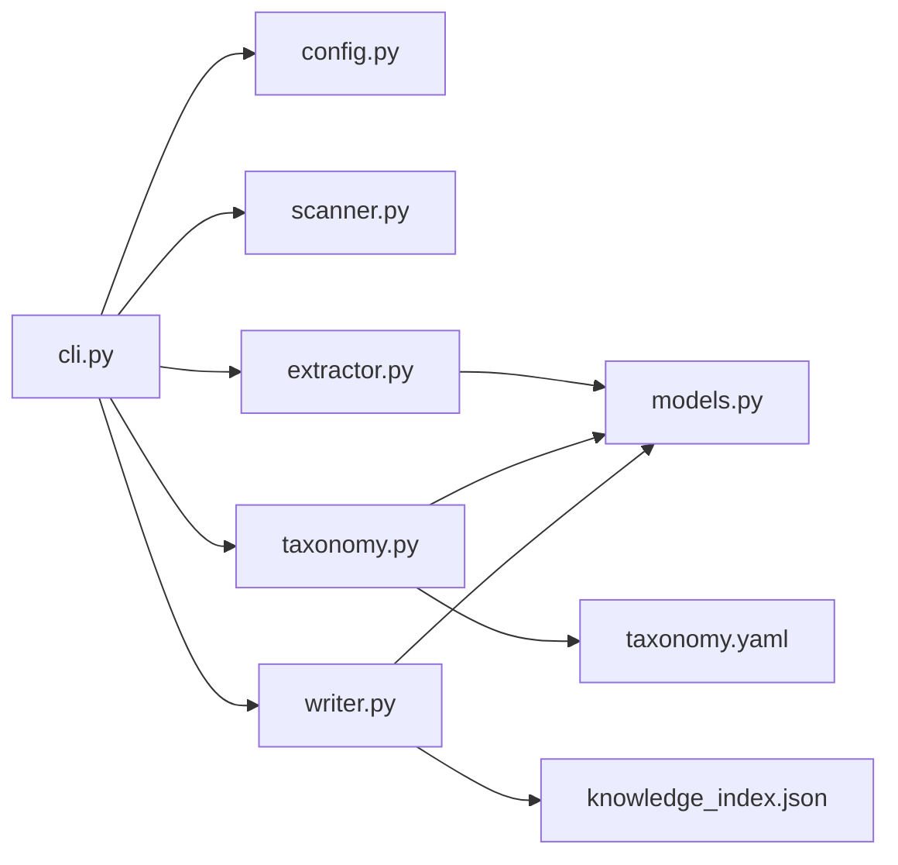

# CLI命令行接口

<cite>
**本文引用的文件**   
- [km/cli.py](file://km/cli.py)
- [km/__main__.py](file://km/__main__.py)
- [km/config.py](file://km/config.py)
- [km/scanner.py](file://km/scanner.py)
- [km/extractor.py](file://km/extractor.py)
- [km/taxonomy.py](file://km/taxonomy.py)
- [km/writer.py](file://km/writer.py)
- [km/models.py](file://km/models.py)
- [taxonomy.yaml](file://taxonomy.yaml)
- [knowledge_index.json](file://knowledge_index.json)
</cite>

## 目录
1. [简介](#简介)
2. [项目结构](#项目结构)
3. [核心组件](#核心组件)
4. [架构总览](#架构总览)
5. [详细组件分析](#详细组件分析)
6. [依赖关系分析](#依赖关系分析)
7. [性能考虑](#性能考虑)
8. [故障排除指南](#故障排除指南)
9. [结论](#结论)
10. [附录](#附录)

## 简介
本仓库提供面向微信公共文章知识库的命令行工具，支持扫描、提取、分类与写入等关键操作。CLI 以子命令组织功能，通过配置文件和分类表驱动处理流程，最终输出结构化的知识索引与归档结果。本文档聚焦于 CLI 的设计原理、命令结构、参数选项、调用流程、错误处理机制与输出格式，并提供常见使用场景的最佳实践与排障建议。

## 项目结构
CLI 的核心代码位于 km 包中，采用按职责划分的模块化设计：
- cli.py：命令行入口与参数解析，编排子命令执行流
- __main__.py：包可执行入口，便于通过 python -m km 启动
- config.py：配置加载与校验（如路径、开关、阈值）
- scanner.py：文件系统扫描与候选条目发现
- extractor.py：从原始内容中提取结构化信息（标题、正文、元数据等）
- taxonomy.py：基于分类表进行主题分类与标签映射
- writer.py：将结果写入目标存储（索引、归档、报告等）
- models.py：领域模型定义（条目、分类、索引等数据结构）
- taxonomy.yaml：分类体系与规则定义
- knowledge_index.json：全局知识索引文件（由写入器维护）

图表来源
- [km/__main__.py](file://km/__main__.py)
- [km/cli.py](file://km/cli.py)
- [km/config.py](file://km/config.py)
- [km/scanner.py](file://km/scanner.py)
- [km/extractor.py](file://km/extractor.py)
- [km/taxonomy.py](file://km/taxonomy.py)
- [km/writer.py](file://km/writer.py)
- [taxonomy.yaml](file://taxonomy.yaml)
- [knowledge_index.json](file://knowledge_index.json)

章节来源
- [km/cli.py](file://km/cli.py)
- [km/__main__.py](file://km/__main__.py)
- [km/config.py](file://km/config.py)
- [km/scanner.py](file://km/scanner.py)
- [km/extractor.py](file://km/extractor.py)
- [km/taxonomy.py](file://km/taxonomy.py)
- [km/writer.py](file://km/writer.py)
- [km/models.py](file://km/models.py)
- [taxonomy.yaml](file://taxonomy.yaml)
- [knowledge_index.json](file://knowledge_index.json)

## 核心组件
- 命令行入口与参数解析
  - 负责注册子命令（如 scan、extract、classify、write、index、help 等），解析并校验参数，构建上下文对象传递给各模块。
- 配置管理
  - 加载默认与用户配置，合并优先级，校验必填项（如输入目录、输出目录、分类表路径）。
- 扫描器
  - 遍历输入目录，识别候选文章或资源，生成待处理清单。
- 提取器
  - 对每个候选条目进行解析，抽取标题、摘要、正文、时间戳、作者等字段，形成统一的数据模型。
- 分类器
  - 依据分类表与规则，为条目分配主题类别与标签，支持多级分类与权重策略。
- 写入器
  - 将结构化结果持久化到索引文件或归档目录，支持增量更新与幂等写入。
- 领域模型
  - 定义条目、分类、索引等数据结构，保证模块间数据一致性。

章节来源
- [km/cli.py](file://km/cli.py)
- [km/config.py](file://km/config.py)
- [km/scanner.py](file://km/scanner.py)
- [km/extractor.py](file://km/extractor.py)
- [km/taxonomy.py](file://km/taxonomy.py)
- [km/writer.py](file://km/writer.py)
- [km/models.py](file://km/models.py)

## 架构总览
CLI 的整体调用流程如下：
- 用户通过命令行触发子命令
- CLI 解析参数并加载配置
- 根据子命令调度相应模块（扫描、提取、分类、写入）
- 模块间通过领域模型传递数据
- 最终产出索引与归档结果

图表来源
- [km/__main__.py](file://km/__main__.py)
- [km/cli.py](file://km/cli.py)
- [km/config.py](file://km/config.py)
- [km/scanner.py](file://km/scanner.py)
- [km/extractor.py](file://km/extractor.py)
- [km/taxonomy.py](file://km/taxonomy.py)
- [km/writer.py](file://km/writer.py)

## 详细组件分析

### 命令行入口与参数解析（cli.py）
- 设计要点
  - 子命令划分清晰：scan、extract、classify、write、index、help
  - 参数校验严格：必填项检查、类型转换、范围限制
  - 上下文传递：将配置、输入/输出路径、日志级别等封装为上下文对象
- 典型调用链
  - 解析参数 -> 加载配置 -> 选择子命令处理器 -> 调用对应模块 -> 汇总结果
- 错误处理
  - 参数错误直接返回非零退出码
  - 运行时异常捕获并输出友好提示

图表来源
- [km/cli.py](file://km/cli.py)

章节来源
- [km/cli.py](file://km/cli.py)

### 配置管理（config.py）
- 功能说明
  - 读取默认配置与用户覆盖配置
  - 校验必填字段（如输入目录、输出目录、分类表路径）
  - 提供便捷访问接口供其他模块使用
- 关键点
  - 配置优先级：用户配置 > 默认配置
  - 失败快速失败：缺失必要配置时立即报错

章节来源
- [km/config.py](file://km/config.py)

### 扫描器（scanner.py）
- 功能说明
  - 递归扫描输入目录，识别符合规则的文件或目录
  - 生成待处理条目清单（路径、类型、大小、时间戳等）
- 优化点
  - 过滤无关后缀与隐藏文件
  - 支持并行扫描以提升性能

章节来源
- [km/scanner.py](file://km/scanner.py)

### 提取器（extractor.py）
- 功能说明
  - 从原始内容中抽取结构化字段（标题、摘要、正文、作者、时间等）
  - 清洗与标准化文本（去噪、编码统一、长度限制）
- 关键点
  - 多格式适配（Markdown、HTML、纯文本等）
  - 容错处理：部分字段缺失时保留空值并记录警告

章节来源
- [km/extractor.py](file://km/extractor.py)

### 分类器（taxonomy.py）
- 功能说明
  - 基于 taxonomy.yaml 的规则与层级，为条目分配主题与标签
  - 支持关键词匹配、正则表达式、权重打分等策略
- 关键点
  - 分类结果可追溯：记录匹配规则与置信度
  - 可扩展：新增分类规则无需修改核心逻辑

章节来源
- [km/taxonomy.py](file://km/taxonomy.py)
- [taxonomy.yaml](file://taxonomy.yaml)

### 写入器（writer.py）
- 功能说明
  - 将结构化条目写入 knowledge_index.json 或其他目标存储
  - 支持增量更新、幂等写入、冲突解决
- 关键点
  - 原子写入：避免部分写入导致索引损坏
  - 校验与回滚：写入前校验，失败时回滚

章节来源
- [km/writer.py](file://km/writer.py)
- [knowledge_index.json](file://knowledge_index.json)

### 领域模型（models.py）
- 功能说明
  - 定义条目、分类、索引等数据结构
  - 提供序列化/反序列化方法，确保跨模块一致性
- 关键点
  - 强类型约束：减少运行时错误
  - 扩展性：新增字段不影响现有逻辑

章节来源
- [km/models.py](file://km/models.py)

## 依赖关系分析
- 模块耦合
  - cli.py 作为编排者，依赖 config、scanner、extractor、taxonomy、writer
  - extractor 与 taxonomy 依赖 models 定义的数据结构
  - writer 依赖 models 与 taxonomy 的分类结果
- 外部依赖
  - taxonomy.yaml：分类规则定义
  - knowledge_index.json：持久化索引文件
- 潜在风险
  - 循环依赖：需确保模块间单向依赖
  - 配置不一致：需加强配置校验与版本兼容

图表来源
- [km/cli.py](file://km/cli.py)
- [km/config.py](file://km/config.py)
- [km/scanner.py](file://km/scanner.py)
- [km/extractor.py](file://km/extractor.py)
- [km/taxonomy.py](file://km/taxonomy.py)
- [km/writer.py](file://km/writer.py)
- [km/models.py](file://km/models.py)
- [taxonomy.yaml](file://taxonomy.yaml)
- [knowledge_index.json](file://knowledge_index.json)

章节来源
- [km/cli.py](file://km/cli.py)
- [km/config.py](file://km/config.py)
- [km/scanner.py](file://km/scanner.py)
- [km/extractor.py](file://km/extractor.py)
- [km/taxonomy.py](file://km/taxonomy.py)
- [km/writer.py](file://km/writer.py)
- [km/models.py](file://km/models.py)
- [taxonomy.yaml](file://taxonomy.yaml)
- [knowledge_index.json](file://knowledge_index.json)

## 性能考虑
- 扫描阶段
  - 使用并行扫描提升大目录遍历效率
  - 过滤无关文件减少 IO 开销
- 提取阶段
  - 批量处理与缓存机制减少重复解析
  - 文本清洗流水线化，避免多次遍历
- 分类阶段
  - 规则预编译与索引加速匹配
  - 支持分块处理与超时控制
- 写入阶段
  - 增量更新避免全量重写
  - 异步写入与批提交降低锁竞争

[本节为通用指导，不直接分析具体文件]

## 故障排除指南
- 常见问题
  - 参数错误：检查必填项与类型，使用 help 子命令查看用法
  - 配置缺失：确认配置文件路径与权限，检查必填字段
  - 扫描失败：验证输入目录存在且可读，检查文件权限
  - 提取失败：确认文件格式支持，查看日志中的警告信息
  - 分类失败：检查 taxonomy.yaml 语法与规则有效性
  - 写入失败：确认输出目录可写，检查磁盘空间与索引完整性
- 调试技巧
  - 启用详细日志（--verbose）
  - 逐步执行子命令（先 scan，再 extract，再 classify，最后 write）
  - 使用 dry-run 模式验证流程而不实际写入

章节来源
- [km/cli.py](file://km/cli.py)
- [km/config.py](file://km/config.py)
- [km/scanner.py](file://km/scanner.py)
- [km/extractor.py](file://km/extractor.py)
- [km/taxonomy.py](file://km/taxonomy.py)
- [km/writer.py](file://km/writer.py)

## 结论
本 CLI 工具通过清晰的模块化设计与严格的参数校验，提供了稳定高效的微信公共文章知识库处理能力。其扫描、提取、分类与写入流程可灵活组合，满足多样化使用场景。建议在生产环境中结合自动化脚本与监控告警，确保数据处理的一致性与可靠性。

[本节为总结性内容，不直接分析具体文件]

## 附录
- 常用命令示例
  - 扫描输入目录：python -m km scan --input ./articles --output ./scanned.json
  - 提取结构化内容：python -m km extract --input ./scanned.json --output ./extracted.json
  - 分类条目：python -m km classify --input ./extracted.json --taxonomy taxonomy.yaml --output ./classified.json
  - 写入索引：python -m km write --input ./classified.json --index knowledge_index.json
  - 查看帮助：python -m km help
- 最佳实践
  - 先小批量测试，再扩展到全量数据
  - 定期备份索引文件与分类规则
  - 使用版本控制管理 taxonomy.yaml 与配置文件
  - 结合 CI/CD 自动化执行完整流程

[本节为补充信息，不直接分析具体文件]