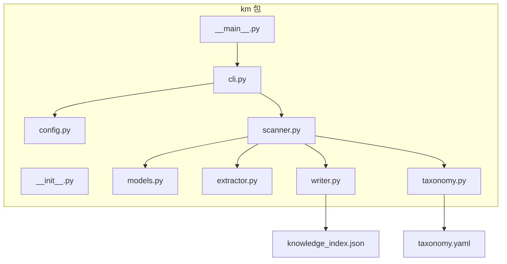
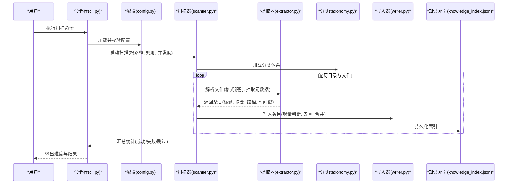
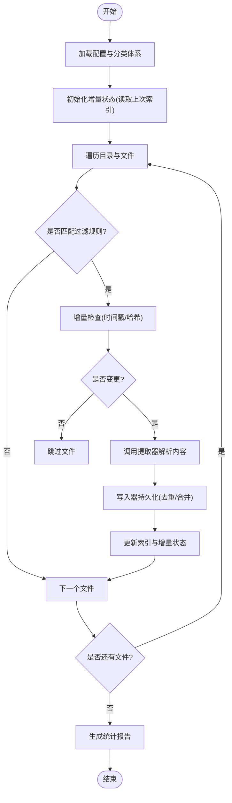
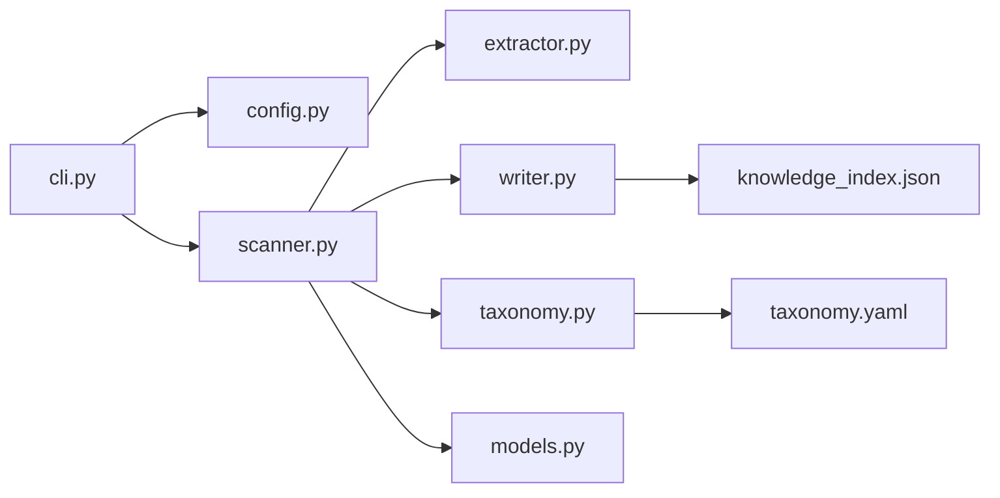

# 内容扫描器

<cite>
**本文引用的文件**   
- [km/scanner.py](file://km/scanner.py)
- [km/extractor.py](file://km/extractor.py)
- [km/writer.py](file://km/writer.py)
- [km/config.py](file://km/config.py)
- [km/models.py](file://km/models.py)
- [km/taxonomy.py](file://km/taxonomy.py)
- [km/cli.py](file://km/cli.py)
- [km/__main__.py](file://km/__main__.py)
- [km/__init__.py](file://km/__init__.py)
- [knowledge_index.json](file://knowledge_index.json)
- [taxonomy.yaml](file://taxonomy.yaml)
</cite>

## 目录
1. [简介](#简介)
2. [项目结构](#项目结构)
3. [核心组件](#核心组件)
4. [架构总览](#架构总览)
5. [详细组件分析](#详细组件分析)
6. [依赖关系分析](#依赖关系分析)
7. [性能考量](#性能考量)
8. [故障排查指南](#故障排查指南)
9. [结论](#结论)
10. [附录](#附录)

## 简介
本文件为“内容扫描器”的完整技术文档，面向需要理解并优化大规模内容扫描能力的工程师与运维人员。内容涵盖：
- 文件扫描算法与目录遍历策略
- 增量更新机制与并发处理模型
- 支持的存储格式与扫描规则
- 配置项、进度监控与错误恢复
- 大规模场景下的实践案例与调优建议

该扫描器以 Python 模块形式组织，核心能力集中在 km 包内，通过 CLI 暴露统一入口，结合 taxonomy.yaml 与 knowledge_index.json 完成分类索引与结果持久化。

## 项目结构
仓库采用按功能划分的模块化结构，核心代码位于 km 目录，CLI 入口与主程序启动逻辑清晰分离；数据与配置由 YAML 与 JSON 提供。

图表来源
- [km/__main__.py](file://km/__main__.py)
- [km/cli.py](file://km/cli.py)
- [km/config.py](file://km/config.py)
- [km/scanner.py](file://km/scanner.py)
- [km/extractor.py](file://km/extractor.py)
- [km/writer.py](file://km/writer.py)
- [km/taxonomy.py](file://km/taxonomy.py)
- [km/models.py](file://km/models.py)
- [taxonomy.yaml](file://taxonomy.yaml)
- [knowledge_index.json](file://knowledge_index.json)

章节来源
- [km/__main__.py](file://km/__main__.py)
- [km/cli.py](file://km/cli.py)
- [km/config.py](file://km/config.py)
- [km/scanner.py](file://km/scanner.py)
- [km/extractor.py](file://km/extractor.py)
- [km/writer.py](file://km/writer.py)
- [km/taxonomy.py](file://km/taxonomy.py)
- [km/models.py](file://km/models.py)
- [taxonomy.yaml](file://taxonomy.yaml)
- [knowledge_index.json](file://knowledge_index.json)

## 核心组件
- 扫描器（scanner）：负责目录遍历、文件过滤、增量判断与并发调度。
- 提取器（extractor）：解析不同存储格式，抽取结构化元数据与正文片段。
- 写入器（writer）：将扫描结果与索引写入知识索引文件，支持幂等与冲突合并。
- 配置（config）：加载并校验扫描参数、并发度、忽略规则、输出路径等。
- 模型（models）：定义扫描任务、条目、索引记录的数据结构与约束。
- 分类体系（taxonomy）：基于 taxonomy.yaml 构建分类树与映射规则。
- CLI（cli）：命令行接口，封装扫描流程、进度展示与错误处理。

章节来源
- [km/scanner.py](file://km/scanner.py)
- [km/extractor.py](file://km/extractor.py)
- [km/writer.py](file://km/writer.py)
- [km/config.py](file://km/config.py)
- [km/models.py](file://km/models.py)
- [km/taxonomy.py](file://km/taxonomy.py)
- [km/cli.py](file://km/cli.py)

## 架构总览
整体流程从 CLI 接收参数，经配置加载后驱动扫描器执行目录遍历与并发任务；提取器对每个文件进行格式识别与内容抽取；写入器将结果写入知识索引，同时维护增量状态；分类体系为条目打上标签与层级信息。

图表来源
- [km/cli.py](file://km/cli.py)
- [km/config.py](file://km/config.py)
- [km/scanner.py](file://km/scanner.py)
- [km/extractor.py](file://km/extractor.py)
- [km/taxonomy.py](file://km/taxonomy.py)
- [km/writer.py](file://km/writer.py)
- [knowledge_index.json](file://knowledge_index.json)

## 详细组件分析

### 扫描器（scanner）
- 目录遍历：深度优先或广度优先可配置，支持忽略目录与文件模式匹配。
- 文件过滤：基于扩展名、大小阈值、修改时间窗口等规则筛选目标文件。
- 增量更新：对比上次扫描的时间戳与哈希，仅处理变更文件，避免重复工作。
- 并发处理：使用线程池或进程池控制并发度，限制 IO 与 CPU 压力。
- 进度监控：实时上报已处理数量、速率、错误计数，便于外部观察。
- 错误恢复：捕获异常并记录上下文，支持重试与跳过策略，保证整体稳定性。

图表来源
- [km/scanner.py](file://km/scanner.py)
- [km/config.py](file://km/config.py)
- [km/taxonomy.py](file://km/taxonomy.py)
- [km/extractor.py](file://km/extractor.py)
- [km/writer.py](file://km/writer.py)
- [knowledge_index.json](file://knowledge_index.json)

章节来源
- [km/scanner.py](file://km/scanner.py)
- [km/config.py](file://km/config.py)
- [km/taxonomy.py](file://km/taxonomy.py)
- [km/extractor.py](file://km/extractor.py)
- [km/writer.py](file://km/writer.py)
- [knowledge_index.json](file://knowledge_index.json)

### 提取器（extractor）
- 格式识别：根据扩展名与头部特征识别 Markdown、HTML、PDF、DOCX、图片等。
- 内容抽取：提取标题、摘要、正文、图片链接、元数据（作者、日期、标签）。
- 文本清洗：去除噪声、标准化编码、截断超长内容、保留关键段落。
- 结构化输出：统一为模型定义的条目结构，便于后续写入与索引。

章节来源
- [km/extractor.py](file://km/extractor.py)
- [km/models.py](file://km/models.py)

### 写入器（writer）
- 幂等写入：基于唯一键（如路径+时间戳）避免重复插入。
- 增量合并：对同一内容的多次扫描进行合并，保留最新元数据。
- 事务性更新：批量写入时保证一致性，失败回滚或重试。
- 索引维护：更新知识索引文件的结构与引用关系。

章节来源
- [km/writer.py](file://km/writer.py)
- [knowledge_index.json](file://knowledge_index.json)

### 配置（config）
- 扫描范围：根路径、子目录白名单/黑名单、文件扩展名列表。
- 过滤规则：文件大小上限、修改时间窗口、关键词匹配。
- 并发设置：最大并发数、队列长度、超时与重试次数。
- 输出选项：索引文件路径、日志级别、进度回调函数。
- 分类映射：关联 taxonomy.yaml 的分类规则与标签。

章节来源
- [km/config.py](file://km/config.py)
- [taxonomy.yaml](file://taxonomy.yaml)

### 模型（models）
- 条目模型：包含标题、摘要、正文片段、路径、时间戳、标签、分类等字段。
- 索引模型：记录条目集合、版本、更新时间、统计信息。
- 校验规则：必填字段、类型约束、长度限制、枚举值。

章节来源
- [km/models.py](file://km/models.py)

### 分类体系（taxonomy）
- 分类树：基于 taxonomy.yaml 定义层级结构与父子关系。
- 映射规则：根据文件名、路径、内容关键词自动归类。
- 动态扩展：支持运行时新增分类与规则，无需重启服务。

章节来源
- [km/taxonomy.py](file://km/taxonomy.py)
- [taxonomy.yaml](file://taxonomy.yaml)

### 命令行（cli）
- 参数解析：支持根路径、输出路径、并发度、忽略模式等选项。
- 流程编排：串联配置加载、扫描、提取、写入、报告生成。
- 进度展示：实时打印处理进度、速率、错误统计。
- 错误处理：捕获异常并输出友好提示，支持退出码指示状态。

章节来源
- [km/cli.py](file://km/cli.py)
- [km/__main__.py](file://km/__main__.py)

## 依赖关系分析
组件间耦合清晰，职责单一，依赖方向明确：
- CLI 依赖配置与扫描器
- 扫描器依赖提取器、写入器、分类体系与模型
- 写入器依赖知识索引文件
- 分类体系依赖 taxonomy.yaml

图表来源
- [km/cli.py](file://km/cli.py)
- [km/config.py](file://km/config.py)
- [km/scanner.py](file://km/scanner.py)
- [km/extractor.py](file://km/extractor.py)
- [km/writer.py](file://km/writer.py)
- [km/taxonomy.py](file://km/taxonomy.py)
- [km/models.py](file://km/models.py)
- [knowledge_index.json](file://knowledge_index.json)
- [taxonomy.yaml](file://taxonomy.yaml)

章节来源
- [km/cli.py](file://km/cli.py)
- [km/config.py](file://km/config.py)
- [km/scanner.py](file://km/scanner.py)
- [km/extractor.py](file://km/extractor.py)
- [km/writer.py](file://km/writer.py)
- [km/taxonomy.py](file://km/taxonomy.py)
- [km/models.py](file://km/models.py)
- [knowledge_index.json](file://knowledge_index.json)
- [taxonomy.yaml](file://taxonomy.yaml)

## 性能考量
- 目录遍历优化：使用惰性迭代与并行遍历，减少内存占用与 IO 等待。
- 文件过滤前置：在遍历阶段尽早丢弃无关文件，降低后续处理开销。
- 增量扫描：基于时间戳与哈希比较，避免重复解析大文件。
- 并发控制：合理设置线程/进程池大小，平衡 CPU 与 IO 利用率。
- 批处理写入：合并小写入为大块写入，减少文件系统操作次数。
- 缓存策略：对分类规则与映射表进行内存缓存，提升查询效率。
- 资源限制：限制单文件最大大小与解析超时，防止极端情况拖慢整体。

[本节为通用指导，不直接分析具体文件]

## 故障排查指南
- 常见错误
  - 权限不足：确保对根路径与子目录有读权限。
  - 文件过大：调整大小阈值或启用分块解析。
  - 编码问题：统一转换为 UTF-8，忽略无法解码字符。
  - 并发冲突：增加锁粒度或改用串行写入。
  - 索引损坏：重建索引或回滚到上一版本。
- 诊断步骤
  - 查看日志输出，定位失败文件与原因。
  - 检查配置项是否正确，尤其是路径与忽略规则。
  - 验证 taxonomy.yaml 语法与分类映射。
  - 使用最小数据集复现问题，逐步扩大范围。
- 恢复策略
  - 启用重试与跳过模式，保证部分成功。
  - 备份索引文件，支持快速回滚。
  - 清理临时文件与锁文件，释放资源。

章节来源
- [km/cli.py](file://km/cli.py)
- [km/config.py](file://km/config.py)
- [km/scanner.py](file://km/scanner.py)
- [km/writer.py](file://km/writer.py)
- [knowledge_index.json](file://knowledge_index.json)

## 结论
内容扫描器通过模块化设计与清晰的职责划分，实现了高效、稳定、可扩展的大规模内容扫描能力。其增量更新与并发处理机制显著提升了性能，分类体系与索引持久化确保了数据的可用性与可追溯性。在实际部署中，建议结合业务场景调优并发度、过滤规则与写入策略，以获得最佳效果。

[本节为总结性内容，不直接分析具体文件]

## 附录
- 配置示例：参考 config.py 中的默认值与校验逻辑。
- 分类规则：编辑 taxonomy.yaml 以自定义分类与标签。
- 索引结构：查看 knowledge_index.json 了解数据结构与字段含义。
- 使用示例：通过 cli.py 提供的命令行参数组合不同扫描策略。

章节来源
- [km/config.py](file://km/config.py)
- [taxonomy.yaml](file://taxonomy.yaml)
- [knowledge_index.json](file://knowledge_index.json)
- [km/cli.py](file://km/cli.py)