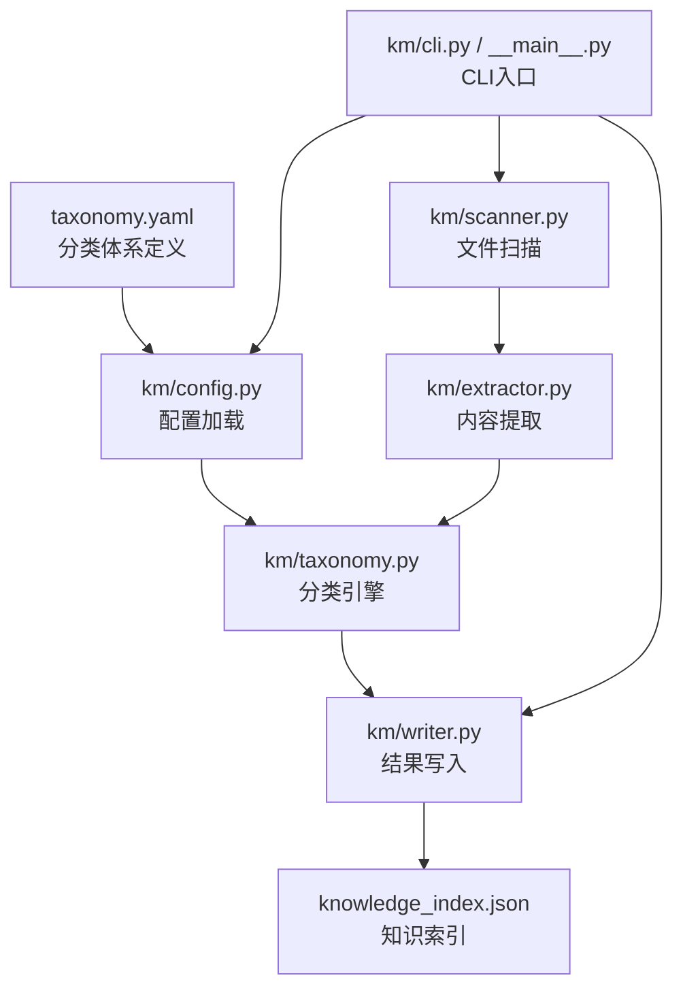
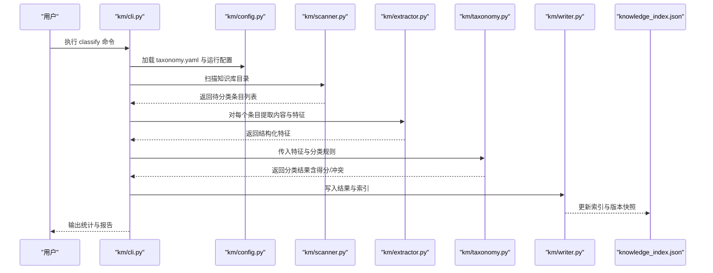
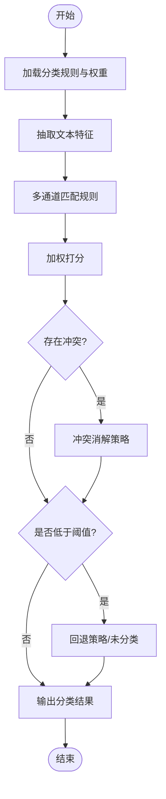
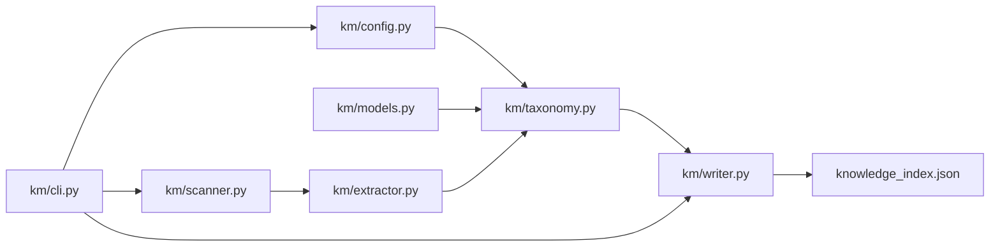

# 分类体系

<cite>
**本文引用的文件**   
- [taxonomy.yaml](file://taxonomy.yaml)
- [knowledge_index.json](file://knowledge_index.json)
- [km/taxonomy.py](file://km/taxonomy.py)
- [km/models.py](file://km/models.py)
- [km/extractor.py](file://km/extractor.py)
- [km/scanner.py](file://km/scanner.py)
- [km/writer.py](file://km/writer.py)
- [km/cli.py](file://km/cli.py)
- [km/config.py](file://km/config.py)
- [km/__main__.py](file://km/__main__.py)
- [README.md](file://README.md)
</cite>

## 目录
1. [简介](#简介)
2. [项目结构](#项目结构)
3. [核心组件](#核心组件)
4. [架构总览](#架构总览)
5. [详细组件分析](#详细组件分析)
6. [依赖关系分析](#依赖关系分析)
7. [性能考量](#性能考量)
8. [故障排查指南](#故障排查指南)
9. [结论](#结论)
10. [附录](#附录)

## 简介
本文件面向“微信公共文章知识库”的分类体系，系统性阐述分类算法、标签系统、层次结构与智能匹配机制；说明如何自定义分类规则、进行权重计算与冲突解决；记录分类结果的结构化表示、版本管理与迁移策略；并提供分类效果评估与优化的实践案例。文档兼顾工程实现与可操作指导，帮助读者快速理解并扩展该分类体系。

## 项目结构
仓库采用“数据驱动 + Python 工具链”的组织方式：
- 顶层配置与索引
  - taxonomy.yaml：分类体系定义（类别树、标签、规则、权重等）
  - knowledge_index.json：知识条目索引（用于检索与统计）
- Python 模块 km/：分类扫描、提取、写入与 CLI 入口
  - models.py：数据模型定义
  - extractor.py：内容提取与特征抽取
  - scanner.py：文件系统扫描与元数据收集
  - writer.py：结果落盘与索引更新
  - config.py：配置加载与校验
  - cli.py / __main__.py：命令行接口与启动流程
  - taxonomy.py：分类引擎（规则解析、匹配、打分、冲突消解）

**图示来源** 
- [taxonomy.yaml](file://taxonomy.yaml)
- [km/config.py](file://km/config.py)
- [km/taxonomy.py](file://km/taxonomy.py)
- [km/scanner.py](file://km/scanner.py)
- [km/extractor.py](file://km/extractor.py)
- [km/writer.py](file://km/writer.py)
- [knowledge_index.json](file://knowledge_index.json)
- [km/cli.py](file://km/cli.py)
- [km/__main__.py](file://km/__main__.py)

**章节来源**
- [README.md](file://README.md)
- [taxonomy.yaml](file://taxonomy.yaml)
- [knowledge_index.json](file://knowledge_index.json)

## 核心组件
- 分类引擎（taxonomy.py）
  - 负责解析 taxonomy.yaml，构建分类树与规则表，执行匹配、打分与冲突消解，输出结构化分类结果。
- 数据模型（models.py）
  - 定义分类节点、标签、规则、匹配分数、冲突信息、分类结果等数据结构。
- 内容提取器（extractor.py）
  - 从 Markdown/HTML 等源文件中抽取标题、正文、元数据、图片与链接等特征，供匹配使用。
- 扫描器（scanner.py）
  - 遍历知识库目录，发现待分类条目，收集路径、时间戳、大小等元数据。
- 写入器（writer.py）
  - 将分类结果持久化到索引或归档目录，维护版本快照与变更日志。
- 配置（config.py）
  - 加载 taxonomy.yaml，校验必填字段，提供默认值与覆盖策略。
- CLI（cli.py / __main__.py）
  - 暴露 scan/classify/export 等命令，串联扫描、提取、分类、写入流程。

**章节来源**
- [km/taxonomy.py](file://km/taxonomy.py)
- [km/models.py](file://km/models.py)
- [km/extractor.py](file://km/extractor.py)
- [km/scanner.py](file://km/scanner.py)
- [km/writer.py](file://km/writer.py)
- [km/config.py](file://km/config.py)
- [km/cli.py](file://km/cli.py)
- [km/__main__.py](file://km/__main__.py)

## 架构总览
分类流水线以“扫描 → 提取 → 分类 → 写入”为主线，由 CLI 统一编排。

**图示来源** 
- [km/cli.py](file://km/cli.py)
- [km/config.py](file://km/config.py)
- [km/scanner.py](file://km/scanner.py)
- [km/extractor.py](file://km/extractor.py)
- [km/taxonomy.py](file://km/taxonomy.py)
- [km/writer.py](file://km/writer.py)
- [knowledge_index.json](file://knowledge_index.json)

## 详细组件分析

### 分类引擎（taxonomy.py）
- 功能要点
  - 解析 taxonomy.yaml，构建分类树、标签字典与规则集。
  - 基于关键词、正则、语义向量（可选）等多通道匹配，生成候选集合。
  - 加权打分：标题权重 > 摘要权重 > 正文权重；支持按类别/标签动态调整。
  - 冲突消解：同层多选一、跨层继承优先、白名单强制命中、阈值过滤。
  - 输出标准化分类结果，附带置信度、命中规则、证据片段与调试信息。
- 关键流程（流程图）

**图示来源** 
- [km/taxonomy.py](file://km/taxonomy.py)
- [km/models.py](file://km/models.py)

**章节来源**
- [km/taxonomy.py](file://km/taxonomy.py)
- [km/models.py](file://km/models.py)

### 数据模型（models.py）
- 主要实体
  - 分类节点：包含层级、标识、名称、父节点、标签集合、权重等。
  - 规则对象：包含匹配条件（关键词/正则/语义）、作用域（标题/摘要/正文）、权重系数、优先级。
  - 分类结果：包含目标节点、得分、置信度、命中规则、冲突标记、证据片段、时间戳与版本。
- 设计原则
  - 不可变性与序列化友好，便于版本对比与迁移。
  - 可扩展字段，兼容未来新增的匹配维度（如作者、来源、时间）。

**章节来源**
- [km/models.py](file://km/models.py)

### 内容提取器（extractor.py）
- 能力范围
  - 解析 Markdown/HTML，抽取标题、摘要、正文、图片、外链、代码块等。
  - 清洗噪声（广告、导航、脚注），归一化编码与换行。
  - 生成结构化特征：词频、TF-IDF、命名实体、主题信号（可选）。
- 性能优化
  - 流式读取大文件，避免一次性加载。
  - 缓存已解析内容的哈希，增量更新。

**章节来源**
- [km/extractor.py](file://km/extractor.py)

### 扫描器（scanner.py）
- 职责
  - 递归扫描知识库目录，识别待分类条目（Markdown/HTML）。
  - 收集元数据：路径、修改时间、文件大小、相对路径映射。
  - 支持忽略规则（.gitignore 风格）与并行扫描。
- 输出
  - 条目清单，供后续提取与分类流水线消费。

**章节来源**
- [km/scanner.py](file://km/scanner.py)

### 写入器（writer.py）
- 职责
  - 将分类结果写入索引（knowledge_index.json）与归档目录。
  - 维护版本快照（diff 与回滚点），记录变更审计日志。
  - 支持幂等写入与并发安全（锁/事务）。
- 版本管理
  - 每次写入生成版本号与时间戳，保留历史快照，便于回溯与迁移。

**章节来源**
- [km/writer.py](file://km/writer.py)
- [knowledge_index.json](file://knowledge_index.json)

### 配置（config.py）
- 职责
  - 加载 taxonomy.yaml，校验必填字段与类型，合并运行时覆盖项。
  - 提供默认权重、阈值、匹配模式等参数。
- 扩展性
  - 支持多环境配置（开发/测试/生产）与环境变量注入。

**章节来源**
- [km/config.py](file://km/config.py)
- [taxonomy.yaml](file://taxonomy.yaml)

### CLI（cli.py / __main__.py）
- 命令
  - scan：扫描知识库，输出条目清单。
  - classify：执行分类流水线，输出结果与统计。
  - export：导出分类结果为 CSV/JSON 等格式。
  - validate：校验 taxonomy.yaml 与索引一致性。
- 编排
  - 串联扫描、提取、分类、写入，支持断点续跑与重试。

**章节来源**
- [km/cli.py](file://km/cli.py)
- [km/__main__.py](file://km/__main__.py)

## 依赖关系分析
- 模块耦合
  - taxonomy.py 强依赖 models.py 与 config.py。
  - extractor.py 被 taxonomy.py 调用，作为特征输入。
  - scanner.py 为上游数据源，writer.py 为下游落盘。
- 外部依赖
  - YAML 解析、JSON 读写、文件系统 IO、可选 NLP/向量库。
- 潜在循环依赖
  - 通过 models.py 抽象数据边界，避免直接循环引用。

**图示来源** 
- [km/config.py](file://km/config.py)
- [km/models.py](file://km/models.py)
- [km/taxonomy.py](file://km/taxonomy.py)
- [km/scanner.py](file://km/scanner.py)
- [km/extractor.py](file://km/extractor.py)
- [km/writer.py](file://km/writer.py)
- [km/cli.py](file://km/cli.py)
- [knowledge_index.json](file://knowledge_index.json)

**章节来源**
- [km/taxonomy.py](file://km/taxonomy.py)
- [km/models.py](file://km/models.py)
- [km/extractor.py](file://km/extractor.py)
- [km/scanner.py](file://km/scanner.py)
- [km/writer.py](file://km/writer.py)
- [km/config.py](file://km/config.py)
- [km/cli.py](file://km/cli.py)
- [knowledge_index.json](file://knowledge_index.json)

## 性能考量
- 扫描与提取
  - 使用并行扫描与流式解析，降低内存峰值与 I/O 等待。
  - 对重复文件使用内容哈希缓存，避免重复解析。
- 分类匹配
  - 先做轻量级关键词/正则预筛，再进入重计算（如语义向量）。
  - 批量向量化与近似最近邻搜索，提升召回效率。
- 写入与索引
  - 批量写入与延迟提交，减少频繁磁盘 IO。
  - 索引分片与增量更新，支持大规模知识库。

[本节为通用性能建议，不直接分析具体文件]

## 故障排查指南
- 常见问题
  - 分类结果为空：检查阈值设置、关键词覆盖率、特征抽取是否成功。
  - 冲突频发：审查规则优先级、白名单与继承策略，确认是否存在重叠规则。
  - 索引不一致：运行 validate 命令，修复缺失或损坏条目。
- 诊断步骤
  - 启用调试日志，查看命中规则与证据片段。
  - 抽样人工复核，定位规则缺陷或特征不足。
  - 逐步放宽阈值与增加规则，观察命中率变化。
- 恢复策略
  - 使用版本快照回滚至上一稳定版本。
  - 清理临时缓存与锁文件，重启流水线。

**章节来源**
- [km/writer.py](file://km/writer.py)
- [km/cli.py](file://km/cli.py)
- [knowledge_index.json](file://knowledge_index.json)

## 结论
本分类体系以 taxonomy.yaml 为核心，结合 Python 工具链实现了从扫描、提取、分类到写入的完整流水线。通过多通道匹配、加权打分与冲突消解，能够在保证准确率的同时具备良好的可扩展性。配合版本管理与迁移策略，可在持续演进中保持分类质量与系统稳定性。

[本节为总结性内容，不直接分析具体文件]

## 附录

### 分类规则自定义指南
- 在 taxonomy.yaml 中新增类别与标签，定义匹配条件（关键词/正则/语义）与权重。
- 设置优先级与白名单，处理特殊场景与例外。
- 使用 CLI 的 validate 命令校验规则合法性。

**章节来源**
- [taxonomy.yaml](file://taxonomy.yaml)
- [km/config.py](file://km/config.py)
- [km/cli.py](file://km/cli.py)

### 权重计算与冲突解决机制
- 权重计算
  - 标题权重最高，摘要次之，正文最低；可按类别动态调整。
  - 支持时间衰减与来源可信度加权。
- 冲突解决
  - 同层多选一：取最高分；若平局，按优先级与白名单决定。
  - 跨层继承：子类优先于父类；白名单强制命中。
  - 阈值过滤：低于阈值的候选丢弃，避免误分类。

**章节来源**
- [km/taxonomy.py](file://km/taxonomy.py)
- [km/models.py](file://km/models.py)

### 分类结果的结构化表示
- 字段包括：类别路径、标签集合、得分、置信度、命中规则、证据片段、时间戳、版本号。
- 支持 JSON/YAML 导出，便于下游系统与可视化展示。

**章节来源**
- [km/models.py](file://km/models.py)
- [knowledge_index.json](file://knowledge_index.json)

### 版本管理与迁移策略
- 版本管理
  - 每次写入生成版本号与时间戳，保留历史快照。
  - 支持 diff 对比与回滚。
- 迁移策略
  - 提供迁移脚本，自动升级 taxonomy.yaml 与索引结构。
  - 灰度发布与双写验证，确保平滑过渡。

**章节来源**
- [km/writer.py](file://km/writer.py)
- [knowledge_index.json](file://knowledge_index.json)

### 分类效果评估与优化案例
- 评估指标
  - 准确率、召回率、F1、平均置信度、冲突率、未分类率。
- 优化方法
  - 补充关键词与正则，增强匹配覆盖。
  - 引入语义向量与相似度阈值调优。
  - 定期人工抽检与规则迭代。
- 实际案例
  - 针对“GPU 集群”相关条目，增加硬件术语与厂商名，提升召回率。
  - 对“运维/AIOps”交叉领域，细化子类别与优先级，降低冲突率。

**章节来源**
- [km/taxonomy.py](file://km/taxonomy.py)
- [km/cli.py](file://km/cli.py)
- [knowledge_index.json](file://knowledge_index.json)