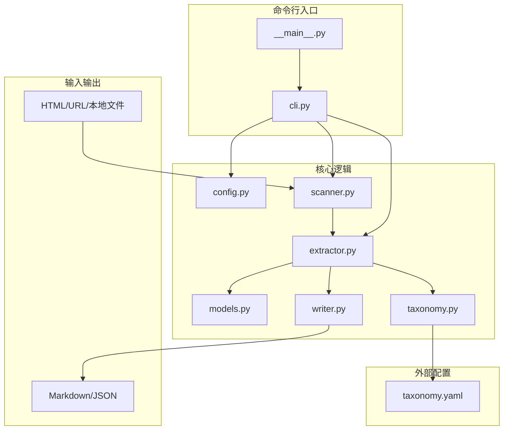
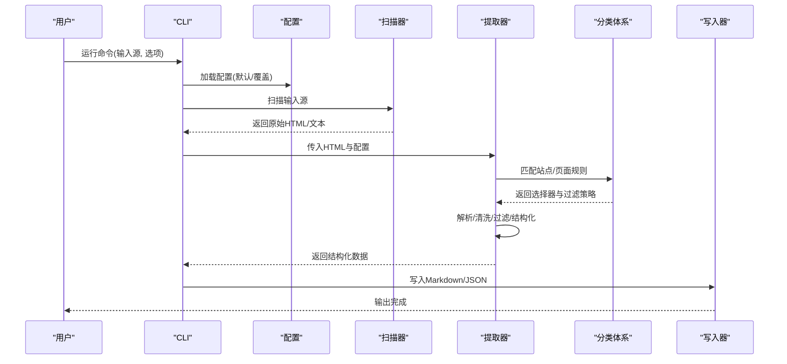
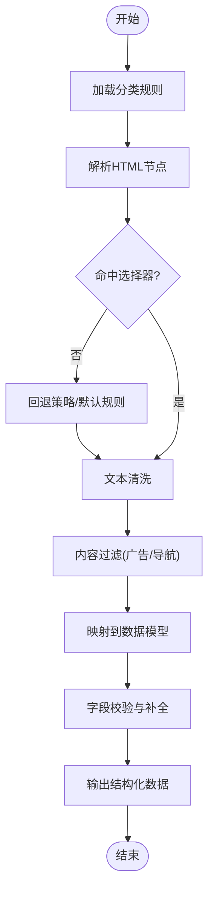
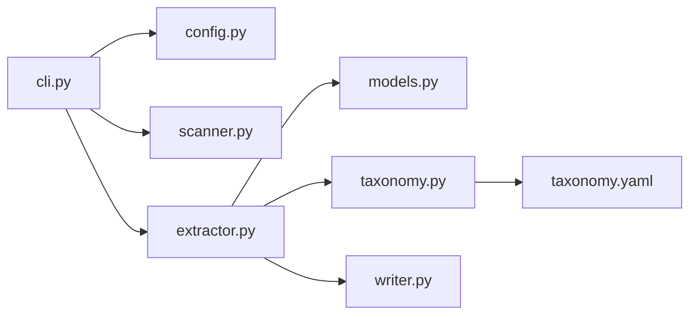

# 数据提取器

<cite>
**本文引用的文件**   
- [km/__init__.py](file://km/__init__.py)
- [km/__main__.py](file://km/__main__.py)
- [km/cli.py](file://km/cli.py)
- [km/config.py](file://km/config.py)
- [km/extractor.py](file://km/extractor.py)
- [km/models.py](file://km/models.py)
- [km/scanner.py](file://km/scanner.py)
- [km/taxonomy.py](file://km/taxonomy.py)
- [km/writer.py](file://km/writer.py)
- [README.md](file://README.md)
- [taxonomy.yaml](file://taxonomy.yaml)
</cite>

## 目录
1. [简介](#简介)
2. [项目结构](#项目结构)
3. [核心组件](#核心组件)
4. [架构总览](#架构总览)
5. [详细组件分析](#详细组件分析)
6. [依赖关系分析](#依赖关系分析)
7. [性能考虑](#性能考虑)
8. [故障排查指南](#故障排查指南)
9. [结论](#结论)
10. [附录](#附录)

## 简介
本仓库实现了一个面向微信公众号文章的“数据提取器”，用于从网页或本地 HTML 中抽取标题、正文、图片、元信息等结构化内容，并输出为 Markdown 等格式。其设计围绕“扫描—解析—过滤—结构化—写入”的流水线展开，支持通过配置文件与分类体系进行规则化扩展，便于在不同站点或文章形态下稳定产出一致的结构化结果。

## 项目结构
- km：Python 包，包含 CLI、配置、模型、扫描器、提取器、分类体系与写入器等核心模块
- taxonomy.yaml：分类与规则定义的外部配置
- README.md：项目说明与使用指引
- 2026、aiops、gpu-tpu、mem：示例文章与产物目录（由提取器生成）

**图表来源** 
- [km/cli.py](file://km/cli.py)
- [km/__main__.py](file://km/__main__.py)
- [km/config.py](file://km/config.py)
- [km/scanner.py](file://km/scanner.py)
- [km/extractor.py](file://km/extractor.py)
- [km/models.py](file://km/models.py)
- [km/writer.py](file://km/writer.py)
- [km/taxonomy.py](file://km/taxonomy.py)
- [taxonomy.yaml](file://taxonomy.yaml)

**章节来源**
- [README.md](file://README.md)

## 核心组件
- 命令行接口（CLI）：提供统一入口，接收参数、加载配置、编排执行流程
- 配置管理（Config）：读取 YAML/环境变量/默认值，校验并合并配置
- 扫描器（Scanner）：识别输入源（URL/本地路径），获取原始 HTML 或文本
- 提取器（Extractor）：基于选择器与规则对 HTML 进行解析、清洗、过滤与结构化
- 数据模型（Models）：定义文章实体、字段与校验约束
- 分类体系（Taxonomy）：根据 taxonomy.yaml 动态加载站点/页面规则
- 写入器（Writer）：将结构化结果持久化为 Markdown/JSON 等格式

**章节来源**
- [km/cli.py](file://km/cli.py)
- [km/config.py](file://km/config.py)
- [km/scanner.py](file://km/scanner.py)
- [km/extractor.py](file://km/extractor.py)
- [km/models.py](file://km/models.py)
- [km/taxonomy.py](file://km/taxonomy.py)
- [km/writer.py](file://km/writer.py)

## 架构总览
整体采用“插件式规则 + 流水线处理”的架构：
- 输入层：URL/本地文件 → 扫描器获取原始 HTML
- 解析层：提取器按分类规则选择节点、清洗内容、去噪、规范化
- 结构化层：映射到模型对象，进行字段校验与补全
- 输出层：写入器生成 Markdown/JSON，并保存至目标目录

**图表来源** 
- [km/cli.py](file://km/cli.py)
- [km/config.py](file://km/config.py)
- [km/scanner.py](file://km/scanner.py)
- [km/extractor.py](file://km/extractor.py)
- [km/taxonomy.py](file://km/taxonomy.py)
- [km/writer.py](file://km/writer.py)

## 详细组件分析

### 命令行接口（CLI）
- 职责：解析命令行参数、初始化日志、加载配置、调度扫描与提取、汇总结果
- 关键流程：参数校验 → 配置合并 → 调用扫描器 → 调用提取器 → 调用写入器
- 错误处理：捕获异常并输出友好提示，支持重试与跳过失败项

**章节来源**
- [km/cli.py](file://km/cli.py)
- [km/__main__.py](file://km/__main__.py)

### 配置管理（Config）
- 职责：读取 taxonomy.yaml 与运行时参数，合并默认值，进行类型校验
- 扩展点：新增配置项时需在默认结构与校验逻辑中声明
- 性能：懒加载与缓存已解析的配置，避免重复 IO

**章节来源**
- [km/config.py](file://km/config.py)
- [taxonomy.yaml](file://taxonomy.yaml)

### 扫描器（Scanner）
- 职责：识别输入类型（URL/本地路径），获取原始 HTML 或文本
- 网络请求：支持超时、重试、代理与 UA 设置（由配置驱动）
- 容错：网络异常降级为本地文件模式或跳过

**章节来源**
- [km/scanner.py](file://km/scanner.py)

### 提取器（Extractor）
- 职责：依据分类规则对 HTML 进行解析、清洗、过滤与结构化
- 解析逻辑：
  - 选择器匹配标题、正文、图片、作者、发布时间等节点
  - 文本清洗：去除脚本/样式、折叠空白、转义特殊字符
  - 内容过滤：按规则剔除广告、导航、侧边栏等噪声
  - 结构化：映射到模型字段，补齐缺失信息（如默认时间、来源）
- 自定义扩展点：
  - 在 taxonomy.yaml 中新增站点/页面规则（选择器、过滤表达式）
  - 在提取器中注册新的清洗/过滤处理器
- 性能优化：
  - 选择性解析（仅加载必要节点）
  - 批量处理与并行度控制
  - 缓存中间结果（同站点复用规则）

**图表来源** 
- [km/extractor.py](file://km/extractor.py)
- [km/taxonomy.py](file://km/taxonomy.py)

**章节来源**
- [km/extractor.py](file://km/extractor.py)
- [km/models.py](file://km/models.py)

### 数据模型（Models）
- 职责：定义文章实体、字段类型、必填项与默认值
- 校验：内置基础校验（长度、格式、枚举值）
- 扩展：新增字段需同步更新序列化/反序列化逻辑

**章节来源**
- [km/models.py](file://km/models.py)

### 分类体系（Taxonomy）
- 职责：加载 taxonomy.yaml，提供站点/页面级别的规则查询
- 规则内容：选择器、过滤表达式、字段映射、输出格式
- 热更新：支持运行时重载规则（按需）

**章节来源**
- [km/taxonomy.py](file://km/taxonomy.py)
- [taxonomy.yaml](file://taxonomy.yaml)

### 写入器（Writer）
- 职责：将结构化数据持久化为 Markdown/JSON 等格式
- 模板：支持按站点或分类定制输出模板
- 并发：可配置写入并发与缓冲策略

**章节来源**
- [km/writer.py](file://km/writer.py)

## 依赖关系分析
- 低耦合高内聚：各模块职责清晰，通过接口传递数据
- 外部依赖：HTTP 客户端、HTML 解析库、YAML 解析器
- 潜在循环依赖：通过分层与接口隔离避免
- 扩展性：新增站点只需在 taxonomy.yaml 中声明规则，无需修改核心代码

**图表来源** 
- [km/cli.py](file://km/cli.py)
- [km/config.py](file://km/config.py)
- [km/scanner.py](file://km/scanner.py)
- [km/extractor.py](file://km/extractor.py)
- [km/models.py](file://km/models.py)
- [km/taxonomy.py](file://km/taxonomy.py)
- [km/writer.py](file://km/writer.py)
- [taxonomy.yaml](file://taxonomy.yaml)

**章节来源**
- [km/cli.py](file://km/cli.py)
- [km/config.py](file://km/config.py)
- [km/scanner.py](file://km/scanner.py)
- [km/extractor.py](file://km/extractor.py)
- [km/models.py](file://km/models.py)
- [km/taxonomy.py](file://km/taxonomy.py)
- [km/writer.py](file://km/writer.py)
- [taxonomy.yaml](file://taxonomy.yaml)

## 性能考虑
- 解析优化：仅解析必要节点，避免全量 DOM 遍历
- 并发控制：限制 HTTP 并发与写入并发，防止资源耗尽
- 缓存策略：缓存已解析的规则与中间结果，减少重复计算
- 内存管理：流式处理大文档，避免一次性加载全部 HTML
- 监控指标：记录耗时、成功率、失败原因，便于定位瓶颈

[本节为通用指导，不直接分析具体文件]

## 故障排查指南
- 常见问题：
  - 选择器不匹配：检查 taxonomy.yaml 中的选择器是否正确
  - 网络超时：调整超时与重试参数，检查代理设置
  - 输出为空：确认过滤规则未误删正文
  - 编码问题：确保正确识别字符集
- 调试方法：
  - 启用详细日志，查看解析步骤与中间结果
  - 使用单条 URL 测试，逐步缩小范围
  - 临时关闭过滤规则，验证选择器有效性
- 错误恢复：
  - 自动重试与跳过失败项
  - 保留原始 HTML 以便后续分析

**章节来源**
- [km/cli.py](file://km/cli.py)
- [km/scanner.py](file://km/scanner.py)
- [km/extractor.py](file://km/extractor.py)
- [km/writer.py](file://km/writer.py)

## 结论
该数据提取器以模块化设计与规则化扩展为核心，能够灵活适配不同站点的文章结构，提供稳定的结构化输出。通过清晰的流水线与完善的错误处理机制，既保证了易用性，也兼顾了可扩展性与性能。未来可在智能选择器、自适应清洗与多模态内容支持方面进一步演进。

[本节为总结性内容，不直接分析具体文件]

## 附录
- 支持的输入格式：URL、本地 HTML 文件、纯文本
- 提取规则：基于 taxonomy.yaml 的选择器与过滤表达式
- 自定义扩展点：
  - 新增站点规则：在 taxonomy.yaml 中添加选择器与映射
  - 新增清洗处理器：在提取器中注册新逻辑
  - 新增输出模板：在写入器中扩展模板引擎
- 配置选项：
  - 网络：超时、重试、代理、UA
  - 解析：并发度、缓存开关、调试模式
  - 输出：格式、目录、模板、编码
- 实际示例：
  - 从公众号文章 URL 提取标题、正文与图片，输出为 Markdown
  - 批量处理本地 HTML 文件夹，生成结构化 JSON
- 调试技巧：
  - 打印选择器匹配结果
  - 导出原始 HTML 与中间清洗结果
  - 逐步禁用过滤规则定位问题

[本节为补充信息，不直接分析具体文件]