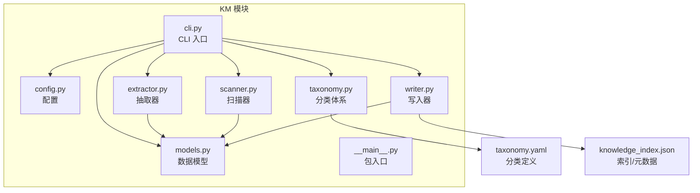
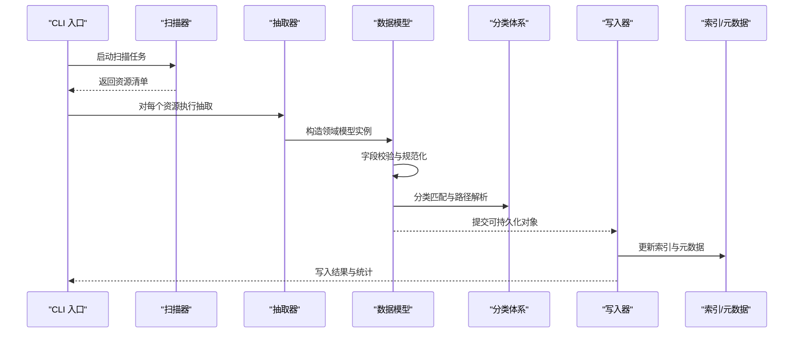
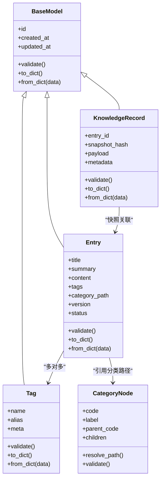
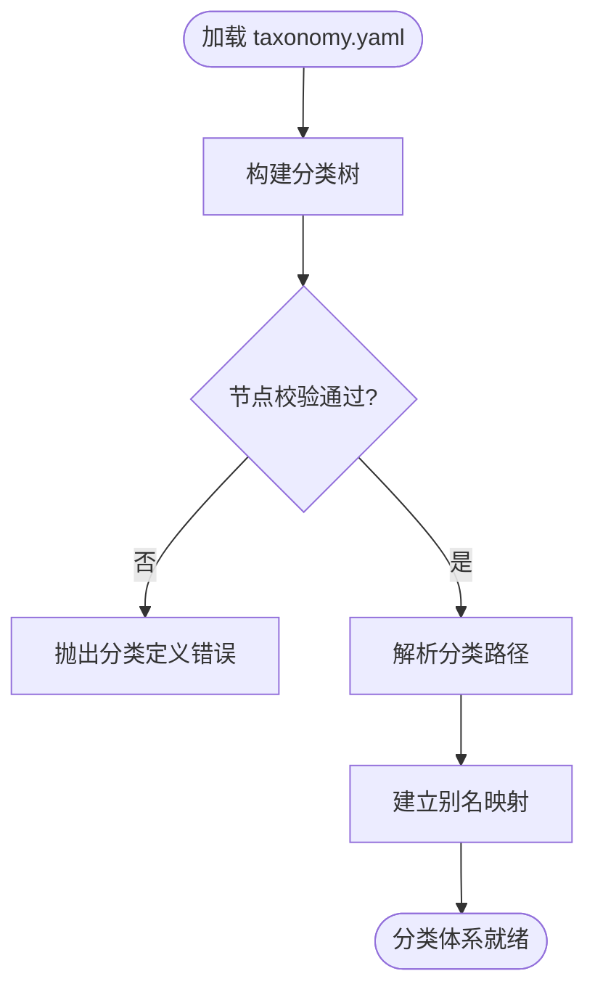
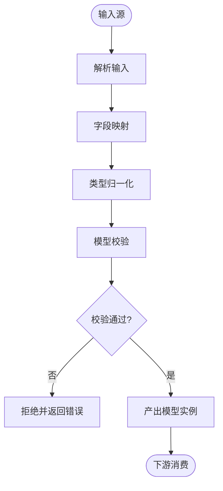
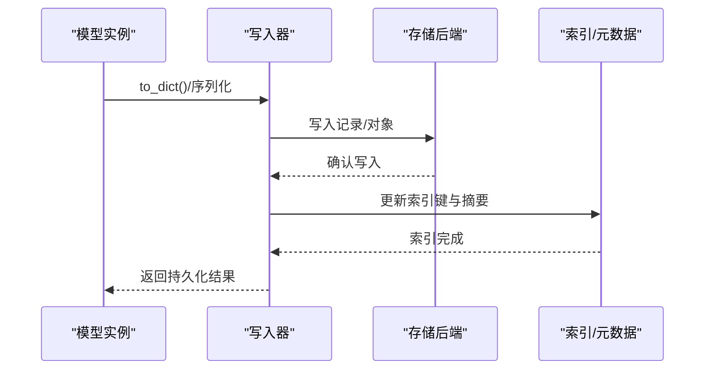
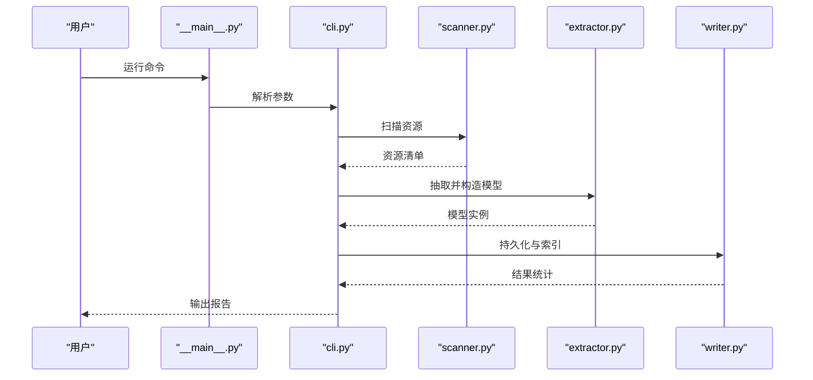
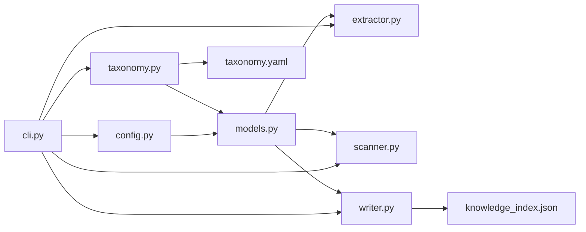

# 数据模型定义

<cite>
**本文引用的文件**   
- [km/models.py](file://km/models.py)
- [km/config.py](file://km/config.py)
- [km/cli.py](file://km/cli.py)
- [km/extractor.py](file://km/extractor.py)
- [km/scanner.py](file://km/scanner.py)
- [km/taxonomy.py](file://km/taxonomy.py)
- [km/writer.py](file://km/writer.py)
- [km/__main__.py](file://km/__main__.py)
- [km/__init__.py](file://km/__init__.py)
- [taxonomy.yaml](file://taxonomy.yaml)
- [knowledge_index.json](file://knowledge_index.json)
</cite>

## 目录
1. [简介](#简介)
2. [项目结构](#项目结构)
3. [核心组件](#核心组件)
4. [架构总览](#架构总览)
5. [详细组件分析](#详细组件分析)
6. [依赖关系分析](#依赖关系分析)
7. [性能考虑](#性能考虑)
8. [故障排查指南](#故障排查指南)
9. [结论](#结论)
10. [附录](#附录)

## 简介
本文件面向“知识管理（KM）”子系统的核心数据模型，系统性梳理领域实体、字段定义、类型约束与关系映射；说明序列化/反序列化机制、校验规则与继承关系；并给出数据库映射、缓存策略与数据生命周期管理的实践建议。同时提供使用示例与最佳实践，帮助开发者快速理解并正确使用该数据模型。

## 项目结构
KM 模块采用按功能划分的组织方式：
- models.py：领域数据模型与校验逻辑
- config.py：配置加载与默认值
- taxonomy.py：分类体系与层级关系
- extractor.py：内容抽取与结构化转换
- scanner.py：扫描与发现逻辑
- writer.py：持久化写入（JSON/YAML/DB）
- cli.py：命令行入口与参数绑定
- __main__.py：包级入口
- taxonomy.yaml：分类树定义
- knowledge_index.json：索引与元数据

图表来源
- [km/models.py](file://km/models.py)
- [km/config.py](file://km/config.py)
- [km/taxonomy.py](file://km/taxonomy.py)
- [km/extractor.py](file://km/extractor.py)
- [km/scanner.py](file://km/scanner.py)
- [km/writer.py](file://km/writer.py)
- [km/cli.py](file://km/cli.py)
- [km/__main__.py](file://km/__main__.py)
- [taxonomy.yaml](file://taxonomy.yaml)
- [knowledge_index.json](file://knowledge_index.json)

章节来源
- [km/models.py](file://km/models.py)
- [km/config.py](file://km/config.py)
- [km/taxonomy.py](file://km/taxonomy.py)
- [km/extractor.py](file://km/extractor.py)
- [km/scanner.py](file://km/scanner.py)
- [km/writer.py](file://km/writer.py)
- [km/cli.py](file://km/cli.py)
- [km/__main__.py](file://km/__main__.py)
- [taxonomy.yaml](file://taxonomy.yaml)
- [knowledge_index.json](file://knowledge_index.json)

## 核心组件
- 领域模型（models.py）
  - 定义核心实体（如条目、标签、分类、版本等），包含字段类型、默认值、约束与校验方法
  - 提供序列化为字典/JSON 与从字典/JSON 反序列化的能力
  - 支持基础验证（非空、长度、枚举、格式）与业务校验（唯一性、关联一致性）
- 配置（config.py）
  - 加载 YAML/环境变量/默认值，提供强类型配置对象
  - 为模型初始化提供默认字段与校验开关
- 分类体系（taxonomy.py）
  - 基于 taxonomy.yaml 构建分类树，提供节点查找、路径解析、父子关系校验
- 抽取器（extractor.py）
  - 将原始内容转换为领域模型实例，执行字段映射与类型转换
- 扫描器（scanner.py）
  - 发现待处理资源，生成模型实例的候选列表
- 写入器（writer.py）
  - 将模型实例持久化为 JSON/YAML/数据库记录，维护索引与元数据

章节来源
- [km/models.py](file://km/models.py)
- [km/config.py](file://km/config.py)
- [km/taxonomy.py](file://km/taxonomy.py)
- [km/extractor.py](file://km/extractor.py)
- [km/scanner.py](file://km/scanner.py)
- [km/writer.py](file://km/writer.py)

## 架构总览
下图展示数据模型在系统中的流转：输入经扫描与抽取生成模型实例，随后进行校验、分类与持久化，最终输出索引与文档。

图表来源
- [km/cli.py](file://km/cli.py)
- [km/scanner.py](file://km/scanner.py)
- [km/extractor.py](file://km/extractor.py)
- [km/models.py](file://km/models.py)
- [km/taxonomy.py](file://km/taxonomy.py)
- [km/writer.py](file://km/writer.py)
- [knowledge_index.json](file://knowledge_index.json)

## 详细组件分析

### 数据模型类图（models.py）
以下类图展示了核心领域实体及其关系。字段名与方法名以概念形式描述，避免直接粘贴代码。

图表来源
- [km/models.py](file://km/models.py)

章节来源
- [km/models.py](file://km/models.py)

### 分类体系与继承（taxonomy.py）
- 分类树由 taxonomy.yaml 驱动，节点包含编码、标签、父节点与子节点集合
- 提供路径解析、层级校验与别名映射
- 支持扩展点：新增分类无需修改核心逻辑

图表来源
- [km/taxonomy.py](file://km/taxonomy.py)
- [taxonomy.yaml](file://taxonomy.yaml)

章节来源
- [km/taxonomy.py](file://km/taxonomy.py)
- [taxonomy.yaml](file://taxonomy.yaml)

### 抽取与校验流程（extractor.py + models.py）
抽取器负责将原始输入转换为领域模型，并进行严格校验。

图表来源
- [km/extractor.py](file://km/extractor.py)
- [km/models.py](file://km/models.py)

章节来源
- [km/extractor.py](file://km/extractor.py)
- [km/models.py](file://km/models.py)

### 写入与索引（writer.py + knowledge_index.json）
写入器负责将模型实例持久化，并维护索引与元数据。

图表来源
- [km/writer.py](file://km/writer.py)
- [knowledge_index.json](file://knowledge_index.json)

章节来源
- [km/writer.py](file://km/writer.py)
- [knowledge_index.json](file://knowledge_index.json)

### CLI 与包入口（cli.py + __main__.py）
- cli.py 将命令行参数映射到各模块，协调扫描、抽取、校验与写入
- __main__.py 作为包入口，统一启动流程

图表来源
- [km/__main__.py](file://km/__main__.py)
- [km/cli.py](file://km/cli.py)
- [km/scanner.py](file://km/scanner.py)
- [km/extractor.py](file://km/extractor.py)
- [km/writer.py](file://km/writer.py)

章节来源
- [km/__main__.py](file://km/__main__.py)
- [km/cli.py](file://km/cli.py)

## 依赖关系分析
- 模块内聚与耦合
  - models.py 被 extractor.py、scanner.py、writer.py 共同依赖，属于高内聚核心
  - taxonomy.py 独立于 IO 层，仅依赖分类定义文件
  - writer.py 与外部存储和索引解耦，便于替换后端
- 外部依赖
  - taxonomy.yaml：分类树定义
  - knowledge_index.json：索引与元数据
- 潜在循环依赖
  - 抽取与写入均依赖模型，但彼此不直接依赖，避免循环

图表来源
- [km/models.py](file://km/models.py)
- [km/extractor.py](file://km/extractor.py)
- [km/scanner.py](file://km/scanner.py)
- [km/writer.py](file://km/writer.py)
- [km/taxonomy.py](file://km/taxonomy.py)
- [km/config.py](file://km/config.py)
- [km/cli.py](file://km/cli.py)
- [knowledge_index.json](file://knowledge_index.json)
- [taxonomy.yaml](file://taxonomy.yaml)

章节来源
- [km/models.py](file://km/models.py)
- [km/extractor.py](file://km/extractor.py)
- [km/scanner.py](file://km/scanner.py)
- [km/writer.py](file://km/writer.py)
- [km/taxonomy.py](file://km/taxonomy.py)
- [km/config.py](file://km/config.py)
- [km/cli.py](file://km/cli.py)
- [knowledge_index.json](file://knowledge_index.json)
- [taxonomy.yaml](file://taxonomy.yaml)

## 性能考虑
- 批量处理
  - 扫描与抽取阶段尽量批量化，减少重复计算与 IO
- 校验优化
  - 先做轻量校验（必填、类型），再做重校验（唯一性、关联）
- 序列化
  - 使用增量序列化，避免全量重建大对象
- 索引更新
  - 合并多次写入，降低索引碎片与锁竞争
- 内存控制
  - 流式读取与分块处理，避免一次性加载全部数据

[本节为通用指导，不直接分析具体文件]

## 故障排查指南
- 常见错误
  - 分类路径无效：检查 taxonomy.yaml 中节点编码与父子关系
  - 字段校验失败：核对必填项、长度限制与枚举值
  - 序列化异常：确认字段命名与类型一致，缺失字段提供默认值
- 定位步骤
  - 启用详细日志，记录抽取前后数据结构
  - 打印模型 to_dict() 结果，对比期望结构
  - 检查索引文件完整性与键冲突
- 恢复策略
  - 回滚到上一版本快照
  - 清理损坏索引后重建

章节来源
- [km/models.py](file://km/models.py)
- [km/taxonomy.py](file://km/taxonomy.py)
- [km/writer.py](file://km/writer.py)
- [knowledge_index.json](file://knowledge_index.json)

## 结论
本数据模型以 models.py 为核心，配合 taxonomy.yaml 的分类体系与 writer.py 的持久化能力，形成稳定可扩展的知识管理数据层。通过严格的校验与清晰的序列化接口，确保数据质量与系统稳定性。建议在扩展新字段或新分类时，优先更新模型与分类定义，并保持抽取与写入逻辑的兼容性。

[本节为总结性内容，不直接分析具体文件]

## 附录
- 使用示例（概念性）
  - 创建条目：调用抽取器将原始内容转为 Entry 实例，设置标题、摘要、内容与标签
  - 分类匹配：根据内容关键词与 taxonomy 路径自动归类
  - 持久化：调用写入器保存为 JSON 或数据库记录，并更新索引
  - 查询：通过索引检索条目，返回标准化结构
- 最佳实践
  - 字段命名保持语义清晰，避免缩写歧义
  - 所有外部输入必须经过模型校验
  - 分类变更需同步更新 taxonomy.yaml 与相关测试用例
  - 写入操作幂等设计，支持重试与回滚

[本节为通用指导，不直接分析具体文件]