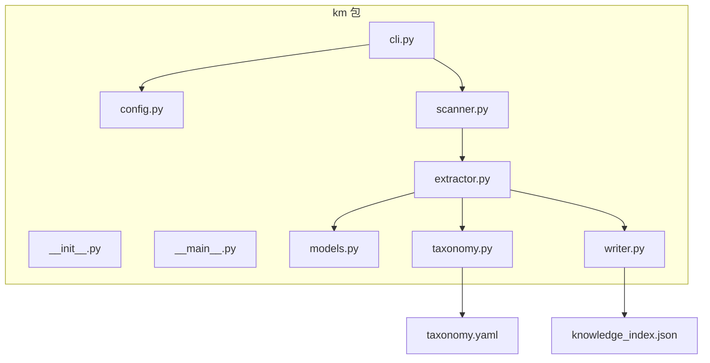
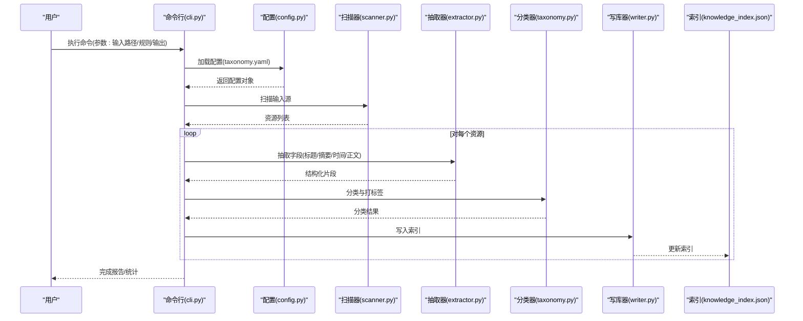
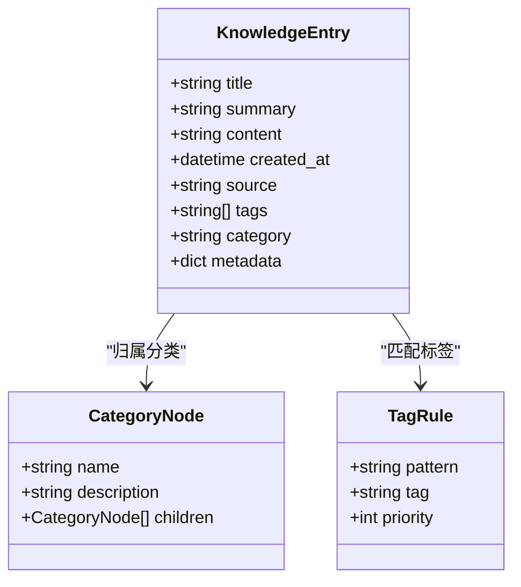
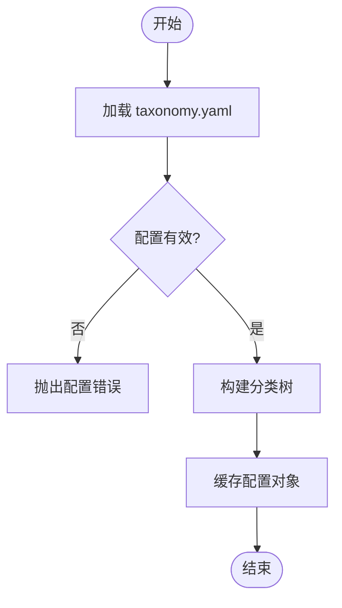
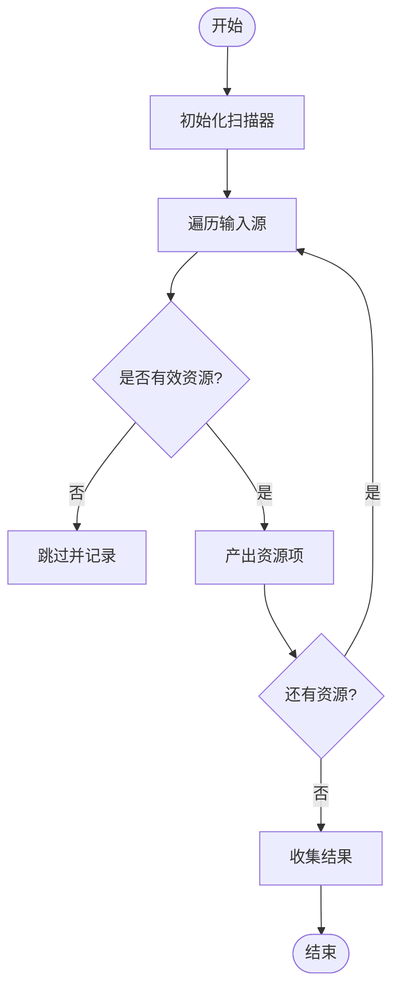
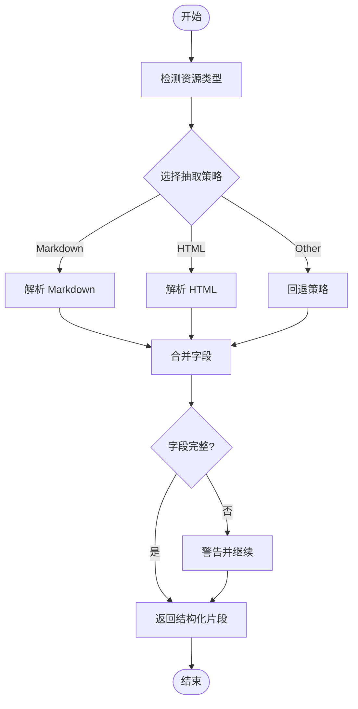
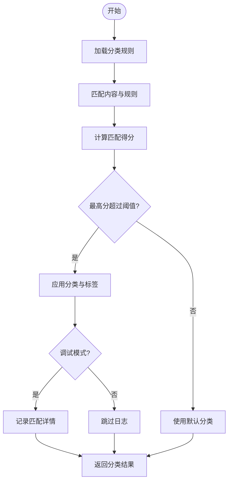
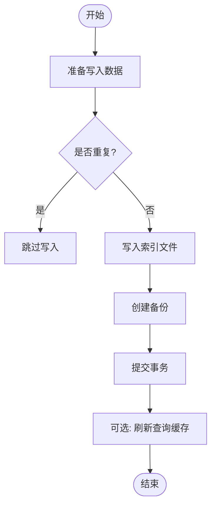
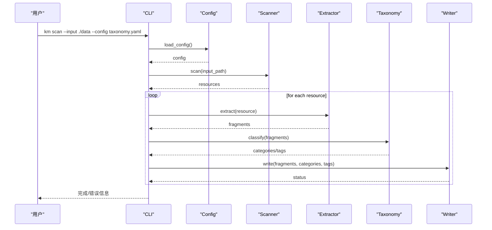
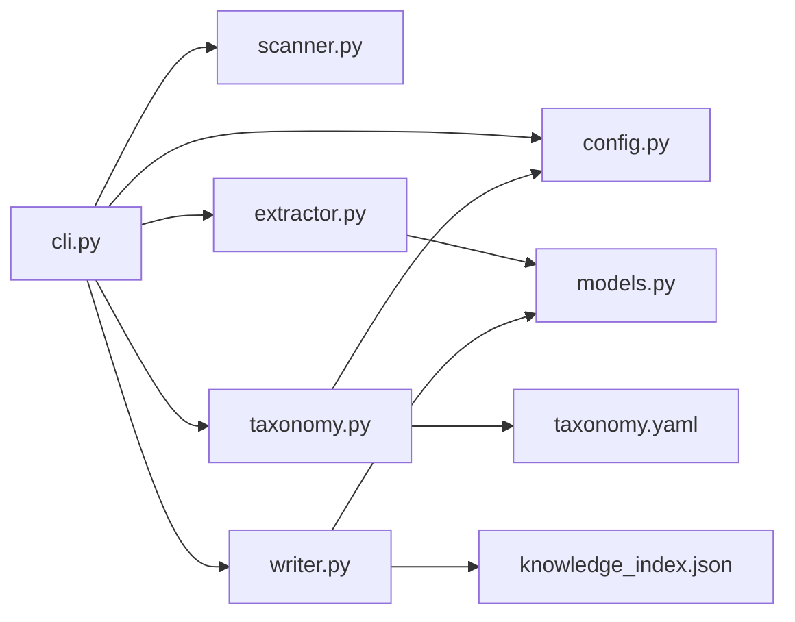

# 知识管理系统

<cite>
**本文引用的文件**   
- [km/__init__.py](file://km/__init__.py)
- [km/__main__.py](file://km/__main__.py)
- [km/cli.py](file://km/cli.py)
- [km/config.py](file://km/config.py)
- [km/extractor.py](file://km/extractor.py)
- [km/models.py](file://km/models.py)
- [km/scanner.py](file://km/scanner.py)
- [km/taxonomy.py](file://km/taxonomy.py)
- [km/writer.py](file://km/writer.py)
- [taxonomy.yaml](file://taxonomy.yaml)
- [knowledge_index.json](file://knowledge_index.json)
</cite>

## 目录
1. [简介](#简介)
2. [项目结构](#项目结构)
3. [核心组件](#核心组件)
4. [架构总览](#架构总览)
5. [详细组件分析](#详细组件分析)
6. [依赖关系分析](#依赖关系分析)
7. [性能与可扩展性](#性能与可扩展性)
8. [故障排查指南](#故障排查指南)
9. [结论](#结论)
10. [附录：配置项与接口参考](#附录配置项与接口参考)

## 简介
本模块为“知识管理系统”（Knowledge Management, KM），负责从多源内容中抽取、分类、索引并持久化知识条目，提供命令行工具以驱动扫描、提取、写入等流程。系统围绕领域模型、分类体系、数据抽取器、扫描器与写库器协同工作，形成“输入→解析→分类→索引→输出”的完整流水线。

## 项目结构
- km 包：Python 模块实现，包含 CLI、配置、模型、抽取器、扫描器、分类器与写库器。
- taxonomy.yaml：分类体系定义文件，用于指导内容的分类与标签生成。
- knowledge_index.json：知识索引文件，存储结构化索引以便检索。

**图示来源** 
- [km/__main__.py](file://km/__main__.py)
- [km/cli.py](file://km/cli.py)
- [km/config.py](file://km/config.py)
- [km/scanner.py](file://km/scanner.py)
- [km/extractor.py](file://km/extractor.py)
- [km/taxonomy.py](file://km/taxonomy.py)
- [km/writer.py](file://km/writer.py)
- [km/models.py](file://km/models.py)
- [taxonomy.yaml](file://taxonomy.yaml)
- [knowledge_index.json](file://knowledge_index.json)

**章节来源**
- [km/__init__.py](file://km/__init__.py)
- [km/__main__.py](file://km/__main__.py)
- [km/cli.py](file://km/cli.py)
- [km/config.py](file://km/config.py)
- [km/models.py](file://km/models.py)
- [km/scanner.py](file://km/scanner.py)
- [km/extractor.py](file://km/extractor.py)
- [km/taxonomy.py](file://km/taxonomy.py)
- [km/writer.py](file://km/writer.py)
- [taxonomy.yaml](file://taxonomy.yaml)
- [knowledge_index.json](file://knowledge_index.json)

## 核心组件
- 命令行入口（CLI）：对外暴露命令，接收参数并编排扫描、抽取、分类、写入流程。
- 配置管理（Config）：加载 taxonomy.yaml 等配置，提供统一访问接口。
- 领域模型（Models）：定义知识条目、元数据、分类标签等数据结构。
- 扫描器（Scanner）：遍历输入源（目录、文件、URL 等），产出待处理资源列表。
- 抽取器（Extractor）：从资源中提取文本、标题、摘要、时间戳等关键信息。
- 分类器（Taxonomy）：基于 taxonomy.yaml 将内容映射到分类树与标签。
- 写库器（Writer）：将结构化结果写入索引文件（如 knowledge_index.json）。

**章节来源**
- [km/cli.py](file://km/cli.py)
- [km/config.py](file://km/config.py)
- [km/models.py](file://km/models.py)
- [km/scanner.py](file://km/scanner.py)
- [km/extractor.py](file://km/extractor.py)
- [km/taxonomy.py](file://km/taxonomy.py)
- [km/writer.py](file://km/writer.py)

## 架构总览
整体采用“流水线+插件化”的设计：CLI 作为调度中心，串联 Scanner → Extractor → Taxonomy → Writer；Models 贯穿全链路提供统一的数据契约；Config 提供外部可配置能力。

**图示来源** 
- [km/cli.py](file://km/cli.py)
- [km/config.py](file://km/config.py)
- [km/scanner.py](file://km/scanner.py)
- [km/extractor.py](file://km/extractor.py)
- [km/taxonomy.py](file://km/taxonomy.py)
- [km/writer.py](file://km/writer.py)
- [knowledge_index.json](file://knowledge_index.json)
- [taxonomy.yaml](file://taxonomy.yaml)

## 详细组件分析

### 领域模型（Models）
- 职责：定义知识条目的数据结构，包括标题、摘要、正文、时间戳、来源、分类、标签等。
- 设计要点：
  - 使用强类型或命名良好的字典/对象，确保跨模块一致性。
  - 支持扩展字段，便于后续增加新的元数据。
  - 提供序列化/反序列化工具，配合 Writer 与索引文件。

**图示来源** 
- [km/models.py](file://km/models.py)
- [km/taxonomy.py](file://km/taxonomy.py)

**章节来源**
- [km/models.py](file://km/models.py)

### 配置管理（Config）
- 职责：加载 taxonomy.yaml，提供分类树、标签规则、默认值等。
- 关键点：
  - 支持层级分类与继承。
  - 提供校验逻辑，避免非法配置导致运行时错误。
  - 暴露统一的 get/set 接口，供其他组件读取。

**图示来源** 
- [km/config.py](file://km/config.py)
- [taxonomy.yaml](file://taxonomy.yaml)

**章节来源**
- [km/config.py](file://km/config.py)
- [taxonomy.yaml](file://taxonomy.yaml)

### 扫描器（Scanner）
- 职责：遍历输入源（本地目录、文件、URL 等），过滤无效资源，产出标准化资源列表。
- 关键点：
  - 支持递归扫描与白名单/黑名单。
  - 对大文件或二进制文件进行快速跳过。
  - 提供进度回调与异常隔离，保证批量处理的稳定性。

**图示来源** 
- [km/scanner.py](file://km/scanner.py)

**章节来源**
- [km/scanner.py](file://km/scanner.py)

### 抽取器（Extractor）
- 职责：从资源中提取结构化字段（标题、摘要、正文、时间戳、作者等）。
- 关键点：
  - 针对不同格式（Markdown、HTML、PDF、日志等）提供适配策略。
  - 支持正则、DOM 解析、OCR 等多种抽取方式。
  - 抽取失败时回退到默认策略，并记录诊断信息。

**图示来源** 
- [km/extractor.py](file://km/extractor.py)

**章节来源**
- [km/extractor.py](file://km/extractor.py)

### 分类器（Taxonomy）
- 职责：依据 taxonomy.yaml 将内容映射到分类与标签。
- 关键点：
  - 支持关键词匹配、正则匹配、权重评分。
  - 允许多级分类与冲突消解策略。
  - 提供调试模式，输出匹配过程与得分。

**图示来源** 
- [km/taxonomy.py](file://km/taxonomy.py)
- [taxonomy.yaml](file://taxonomy.yaml)

**章节来源**
- [km/taxonomy.py](file://km/taxonomy.py)
- [taxonomy.yaml](file://taxonomy.yaml)

### 写库器（Writer）
- 职责：将结构化知识条目写入索引文件（如 knowledge_index.json），支持增量更新与去重。
- 关键点：
  - 原子写入与备份机制，防止损坏索引。
  - 支持并发写入时的锁控制。
  - 提供查询接口，按分类、标签、时间范围检索。

**图示来源** 
- [km/writer.py](file://km/writer.py)
- [knowledge_index.json](file://knowledge_index.json)

**章节来源**
- [km/writer.py](file://km/writer.py)
- [knowledge_index.json](file://knowledge_index.json)

### 命令行入口（CLI）
- 职责：解析用户命令与参数，协调各组件完成端到端流程。
- 关键点：
  - 支持子命令：scan、extract、classify、write、index。
  - 提供全局选项：配置文件路径、输出目录、日志级别。
  - 错误处理与退出码规范，便于集成自动化脚本。

**图示来源** 
- [km/cli.py](file://km/cli.py)
- [km/config.py](file://km/config.py)
- [km/scanner.py](file://km/scanner.py)
- [km/extractor.py](file://km/extractor.py)
- [km/taxonomy.py](file://km/taxonomy.py)
- [km/writer.py](file://km/writer.py)

**章节来源**
- [km/cli.py](file://km/cli.py)

## 依赖关系分析
- CLI 依赖 Config、Scanner、Extractor、Taxonomy、Writer。
- Extractor 依赖 Models 与可能的第三方解析库。
- Taxonomy 依赖 Config 与 taxonomy.yaml。
- Writer 依赖 Models 与文件系统/索引存储。

**图示来源** 
- [km/cli.py](file://km/cli.py)
- [km/config.py](file://km/config.py)
- [km/scanner.py](file://km/scanner.py)
- [km/extractor.py](file://km/extractor.py)
- [km/taxonomy.py](file://km/taxonomy.py)
- [km/writer.py](file://km/writer.py)
- [km/models.py](file://km/models.py)
- [taxonomy.yaml](file://taxonomy.yaml)
- [knowledge_index.json](file://knowledge_index.json)

**章节来源**
- [km/cli.py](file://km/cli.py)
- [km/config.py](file://km/config.py)
- [km/scanner.py](file://km/scanner.py)
- [km/extractor.py](file://km/extractor.py)
- [km/taxonomy.py](file://km/taxonomy.py)
- [km/writer.py](file://km/writer.py)
- [km/models.py](file://km/models.py)
- [taxonomy.yaml](file://taxonomy.yaml)
- [knowledge_index.json](file://knowledge_index.json)

## 性能与可扩展性
- 扫描阶段：支持并行遍历与惰性加载，减少内存占用。
- 抽取阶段：策略模式便于新增格式支持；对大文件采用流式处理。
- 分类阶段：规则预编译与缓存，提升匹配速度。
- 写入阶段：批量写入与事务提交，降低 IO 开销。
- 可扩展点：
  - 新增抽取器：实现统一接口即可接入。
  - 新增分类规则：在 taxonomy.yaml 中声明，无需修改代码。
  - 新增存储后端：Writer 抽象接口支持替换为数据库或对象存储。

[本节为通用建议，不直接分析具体文件]

## 故障排查指南
- 配置错误：检查 taxonomy.yaml 语法与必填字段，确认路径正确。
- 抽取失败：查看日志中的资源类型与回退策略；验证输入文件格式。
- 分类不准确：启用调试模式，观察匹配得分与规则优先级。
- 写入失败：检查索引文件权限与磁盘空间；确认原子写入与备份机制。
- 常见问题定位：
  - 资源被跳过：确认白名单/黑名单设置。
  - 索引不一致：运行重建索引命令，比对差异。
  - 性能瓶颈：监控扫描与抽取阶段的耗时，考虑并行度调优。

**章节来源**
- [km/config.py](file://km/config.py)
- [km/extractor.py](file://km/extractor.py)
- [km/taxonomy.py](file://km/taxonomy.py)
- [km/writer.py](file://km/writer.py)

## 结论
知识管理系统通过清晰的模块化设计与可扩展的流水线架构，实现了从多源内容到结构化索引的高效处理。借助 taxonomy.yaml 的可配置分类体系与灵活的抽取策略，系统能够适应不同业务场景。建议在持续迭代中关注性能优化与错误恢复机制，以提升稳定性与用户体验。

[本节为总结性内容，不直接分析具体文件]

## 附录：配置项与接口参考
- 配置项（taxonomy.yaml）
  - 分类树：name、description、children
  - 标签规则：pattern、tag、priority
  - 默认分类与回退策略
- 命令行参数（CLI）
  - 输入路径、配置文件路径、输出目录、日志级别
  - 子命令：scan、extract、classify、write、index
- 领域模型（Models）
  - KnowledgeEntry：title、summary、content、created_at、source、tags、category、metadata
- 接口约定
  - Scanner：scan(input_path) → list of resources
  - Extractor：extract(resource) → structured fragment
  - Taxonomy：classify(fragment) → category & tags
  - Writer：write(entries) → status

**章节来源**
- [km/config.py](file://km/config.py)
- [km/cli.py](file://km/cli.py)
- [km/models.py](file://km/models.py)
- [km/scanner.py](file://km/scanner.py)
- [km/extractor.py](file://km/extractor.py)
- [km/taxonomy.py](file://km/taxonomy.py)
- [km/writer.py](file://km/writer.py)
- [taxonomy.yaml](file://taxonomy.yaml)