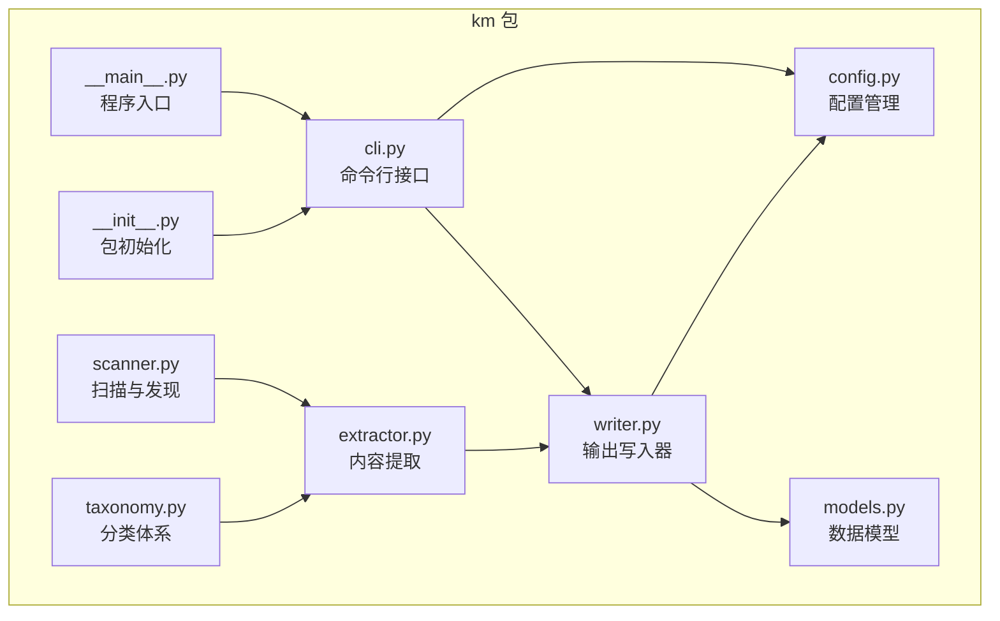
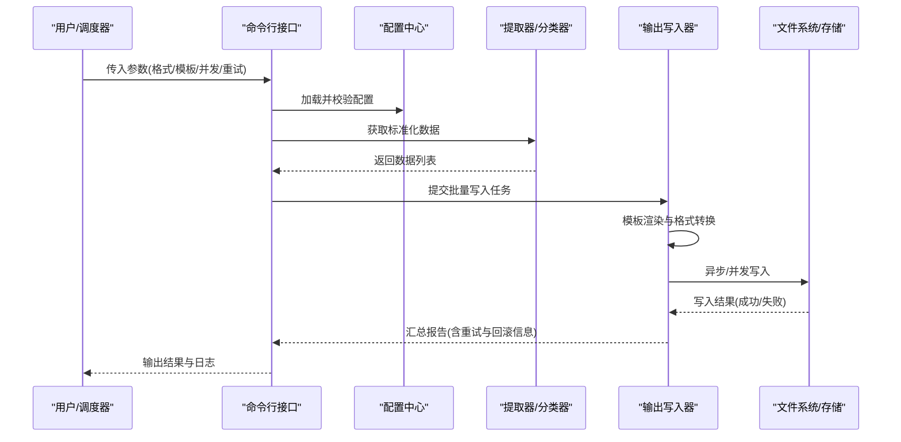
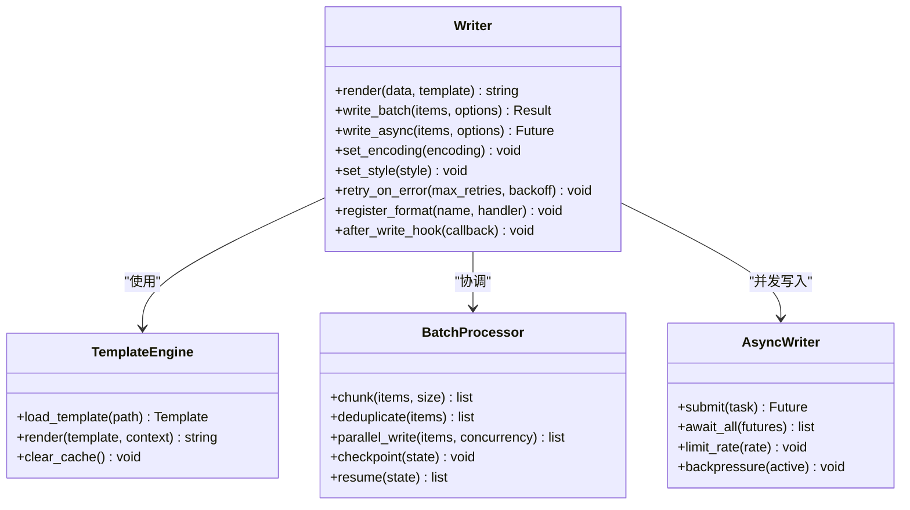
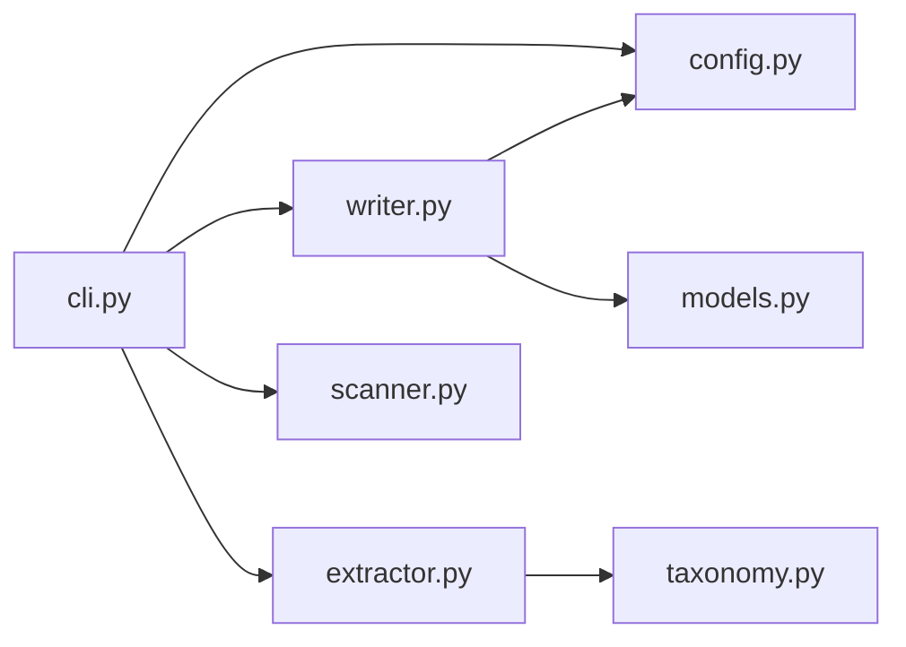

# 输出写入器

<cite>
**本文引用的文件**   
- [km/writer.py](file://km/writer.py)
- [km/cli.py](file://km/cli.py)
- [km/config.py](file://km/config.py)
- [km/models.py](file://km/models.py)
- [km/extractor.py](file://km/extractor.py)
- [km/scanner.py](file://km/scanner.py)
- [km/taxonomy.py](file://km/taxonomy.py)
- [km/__main__.py](file://km/__main__.py)
- [km/__init__.py](file://km/__init__.py)
</cite>

## 目录
1. [简介](#简介)
2. [项目结构](#项目结构)
3. [核心组件](#核心组件)
4. [架构总览](#架构总览)
5. [详细组件分析](#详细组件分析)
6. [依赖分析](#依赖分析)
7. [性能考虑](#性能考虑)
8. [故障排查指南](#故障排查指南)
9. [结论](#结论)
10. [附录](#附录)

## 简介
本文件面向“输出写入器”模块，系统性阐述其支持的导出格式、模板引擎、批量处理与异步写入能力，并给出配置项、样式定制、编码处理、错误重试机制以及扩展方法。文档同时提供不同输出场景的使用示例与最佳实践，帮助读者快速上手并高效集成。

## 项目结构
仓库采用按功能划分的模块化组织方式，其中 km 子包为核心实现：
- writer.py：输出写入器的核心逻辑，负责多格式生成、模板渲染、批量与异步写入、编码与样式控制等。
- cli.py：命令行入口，解析参数、调用写入器、支持批量任务与并发选项。
- config.py：配置加载与校验，集中管理输出格式、模板路径、并发度、重试策略等。
- models.py：数据模型定义，统一输入数据结构与输出契约。
- extractor.py / scanner.py / taxonomy.py：上游数据处理与知识分类，为写入器提供标准化数据源。
- __main__.py / __init__.py：包入口与初始化。

**图表来源** 
- [km/cli.py](file://km/cli.py)
- [km/config.py](file://km/config.py)
- [km/models.py](file://km/models.py)
- [km/extractor.py](file://km/extractor.py)
- [km/scanner.py](file://km/scanner.py)
- [km/taxonomy.py](file://km/taxonomy.py)
- [km/writer.py](file://km/writer.py)
- [km/__main__.py](file://km/__main__.py)
- [km/__init__.py](file://km/__init__.py)

**章节来源**
- [km/writer.py](file://km/writer.py)
- [km/cli.py](file://km/cli.py)
- [km/config.py](file://km/config.py)
- [km/models.py](file://km/models.py)
- [km/extractor.py](file://km/extractor.py)
- [km/scanner.py](file://km/scanner.py)
- [km/taxonomy.py](file://km/taxonomy.py)
- [km/__main__.py](file://km/__main__.py)
- [km/__init__.py](file://km/__init__.py)

## 核心组件
- 输出写入器（writer）：封装多格式生成、模板渲染、批量与异步写入、编码与样式控制、错误重试与回滚。
- 配置中心（config）：集中管理输出格式、模板路径、并发度、重试策略、编码与样式等。
- 数据模型（models）：定义统一的输入数据结构与输出契约，确保写入器与上游解耦。
- 命令行接口（cli）：暴露参数化接口，支持批量任务、并发与日志级别控制。

**章节来源**
- [km/writer.py](file://km/writer.py)
- [km/config.py](file://km/config.py)
- [km/models.py](file://km/models.py)
- [km/cli.py](file://km/cli.py)

## 架构总览
输出写入器处于数据处理流水线的末端，接收来自提取器与分类器的标准化数据，依据配置选择目标格式与模板，进行渲染与写入。批量与异步能力通过队列与线程池/协程池实现，错误处理包含重试、降级与回滚。

**图表来源** 
- [km/cli.py](file://km/cli.py)
- [km/config.py](file://km/config.py)
- [km/extractor.py](file://km/extractor.py)
- [km/taxonomy.py](file://km/taxonomy.py)
- [km/writer.py](file://km/writer.py)

## 详细组件分析

### 输出写入器（writer）
- 功能要点
  - 多格式生成：支持 Markdown、HTML、PDF、JSON、CSV 等常见格式（具体以配置为准）。
  - 模板引擎：基于模板变量替换与片段组合，支持自定义模板路径与命名空间隔离。
  - 批量处理：支持分片、去重、顺序或并行写入，具备进度统计与断点续写。
  - 异步写入：通过线程池/协程池并发写入，结合 I/O 限流与背压控制。
  - 编码处理：自动检测与转码，支持 UTF-8、GBK、GB2312 等，异常时回退到安全编码。
  - 样式定制：主题、字体、颜色、边距、分页等样式参数可配置；HTML/PDF 支持 CSS/样式表注入。
  - 错误重试：指数退避、最大重试次数、幂等写入与事务回滚。
  - 扩展点：插件式格式注册、模板钩子、写入后处理器。

**图表来源** 
- [km/writer.py](file://km/writer.py)

**章节来源**
- [km/writer.py](file://km/writer.py)

### 配置中心（config）
- 关键配置项
  - 输出格式：format（如 markdown/html/pdf/json/csv）
  - 模板路径：template_dir、template_name、namespace
  - 并发与批处理：concurrency、batch_size、chunk_size
  - 重试策略：max_retries、backoff_type、timeout
  - 编码与样式：encoding、theme、css_path、font_family、margins
  - 存储与路径：output_dir、filename_pattern、overwrite_policy
- 行为特性
  - 配置校验与默认值合并
  - 运行时覆盖与环境变量注入
  - 多环境配置切换（开发/测试/生产）

**章节来源**
- [km/config.py](file://km/config.py)

### 数据模型（models）
- 统一数据结构
  - 条目字段：标题、正文、元数据、标签、时间戳
  - 输出契约：格式化后的字符串或字节流、附加资源（图片/附件）
  - 错误对象：错误码、消息、上下文、重试建议
- 类型约束与序列化
  - 严格类型检查与可选字段
  - JSON/YAML 序列化适配

**章节来源**
- [km/models.py](file://km/models.py)

### 命令行接口（cli）
- 主要参数
  - --format、--template、--output-dir、--encoding、--style
  - --concurrency、--batch-size、--max-retries、--backoff
  - --input、--scan-path、--taxonomy-file
- 执行流程
  - 参数解析与配置加载
  - 扫描与提取数据
  - 调用写入器执行批量/异步写入
  - 输出日志与结果摘要

**章节来源**
- [km/cli.py](file://km/cli.py)

### 上游数据处理（extractor/scanner/taxonomy）
- extractor：从原始内容中提取结构化数据，清洗与规范化。
- scanner：扫描目录/文件，发现待处理条目。
- taxonomy：根据分类体系对条目打标签，辅助模板选择与样式应用。

**章节来源**
- [km/extractor.py](file://km/extractor.py)
- [km/scanner.py](file://km/scanner.py)
- [km/taxonomy.py](file://km/taxonomy.py)

## 依赖分析
- 内部依赖
  - writer 依赖 config、models、extractor、taxonomy。
  - cli 依赖 config、writer、extractor、scanner。
- 外部依赖
  - 模板引擎库（如 Jinja2 或内置渲染器）
  - PDF 生成库（如 WeasyPrint/ReportLab）
  - 并发库（如 concurrent.futures/asyncio）
  - 编码库（如 chardet）
- 耦合与内聚
  - writer 高内聚于输出逻辑，低耦合于上游数据与下游存储。
  - 通过接口与事件钩子降低模块间耦合。

**图表来源** 
- [km/cli.py](file://km/cli.py)
- [km/config.py](file://km/config.py)
- [km/writer.py](file://km/writer.py)
- [km/models.py](file://km/models.py)
- [km/extractor.py](file://km/extractor.py)
- [km/scanner.py](file://km/scanner.py)
- [km/taxonomy.py](file://km/taxonomy.py)

**章节来源**
- [km/cli.py](file://km/cli.py)
- [km/config.py](file://km/config.py)
- [km/writer.py](file://km/writer.py)
- [km/models.py](file://km/models.py)
- [km/extractor.py](file://km/extractor.py)
- [km/scanner.py](file://km/scanner.py)
- [km/taxonomy.py](file://km/taxonomy.py)

## 性能考虑
- 并发与批处理
  - 合理设置 concurrency 与 batch_size，避免 I/O 饱和与内存峰值。
  - 使用分片与去重减少重复计算与写入。
- 异步写入
  - 使用协程/线程池提升吞吐，配合速率限制与背压防止阻塞。
- 缓存与复用
  - 模板编译缓存、样式资源缓存、字符编码探测缓存。
- 资源管理
  - 文件句柄与连接池的及时释放，避免泄漏。
- 监控与度量
  - 记录写入耗时、成功率、重试次数、错误分布。

[本节为通用指导，不直接分析具体文件]

## 故障排查指南
- 常见问题
  - 模板未找到或渲染失败：检查模板路径与命名空间。
  - 编码错误：确认输入编码与目标编码一致，启用自动探测与回退。
  - 写入失败：检查权限、磁盘空间、路径合法性。
  - 并发冲突：调整并发度与锁策略，确保幂等写入。
- 调试手段
  - 开启详细日志与追踪 ID。
  - 启用 checkpoint 与断点续写。
  - 使用最小数据集复现问题。
- 恢复策略
  - 指数退避重试与最大重试上限。
  - 失败回滚与补偿写入。
  - 降级模式（如仅输出日志或草稿）。

**章节来源**
- [km/writer.py](file://km/writer.py)
- [km/config.py](file://km/config.py)
- [km/cli.py](file://km/cli.py)

## 结论
输出写入器通过模块化设计与可扩展接口，实现了多格式生成、模板渲染、批量与异步写入、编码与样式控制、错误重试与回滚等核心能力。配合配置中心与命令行接口，能够灵活适配多种输出场景。建议在大规模场景中关注并发、缓存与监控，以获得稳定高效的输出体验。

[本节为总结性内容，不直接分析具体文件]

## 附录

### 支持的导出格式与适用场景
- Markdown：适合技术文档、知识库归档、版本化管理。
- HTML：适合网页发布、在线预览、样式定制。
- PDF：适合正式文档、打印输出、合规归档。
- JSON/CSV：适合数据交换、二次加工、自动化流水线。

[本节为概念性说明，不直接分析具体文件]

### 模板引擎与样式定制
- 模板变量：标题、正文、元数据、标签、时间戳、作者等。
- 片段组合：章节模板、页眉页脚、引用块、代码块。
- 样式参数：主题、字体、颜色、边距、分页、链接样式。
- 自定义扩展：注册新模板语言、注入 CSS/JS、钩子函数。

[本节为概念性说明，不直接分析具体文件]

### 批量处理与异步写入
- 分片策略：固定大小、动态调整、优先级排序。
- 去重与幂等：哈希键、唯一标识、条件写入。
- 并发模型：线程池/协程池、I/O 限流、背压控制。
- 断点续写：状态持久化、增量更新、一致性校验。

[本节为概念性说明，不直接分析具体文件]

### 编码处理与兼容性
- 自动探测：chardet 或类似库，识别 GBK/UTF-8 等。
- 转码策略：统一输出 UTF-8，必要时保留原编码。
- 异常回退：遇到非法字符时替换或跳过，保证完整性。

[本节为概念性说明，不直接分析具体文件]

### 错误重试与回滚机制
- 重试策略：指数退避、固定间隔、抖动随机。
- 最大重试：上限控制，避免无限重试。
- 幂等写入：确保多次写入结果一致。
- 事务回滚：失败时撤销已写入部分，保持原子性。

[本节为概念性说明，不直接分析具体文件]

### 使用示例与自定义扩展
- 基本用法：指定格式与模板，输出到目标目录。
- 批量任务：扫描目录，批量生成多格式输出。
- 异步写入：高并发场景下提升吞吐。
- 自定义格式：注册新格式处理器与模板渲染器。
- 样式扩展：注入 CSS/JS，定制主题与布局。

[本节为概念性说明，不直接分析具体文件]