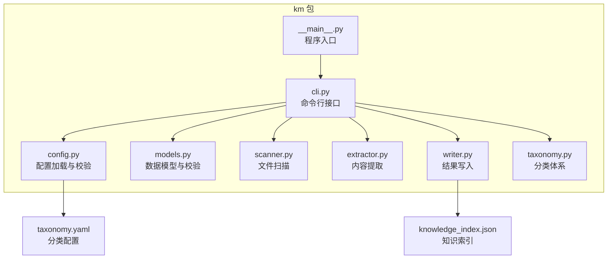
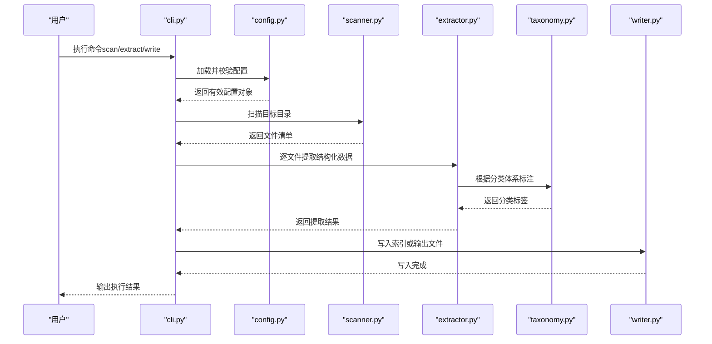
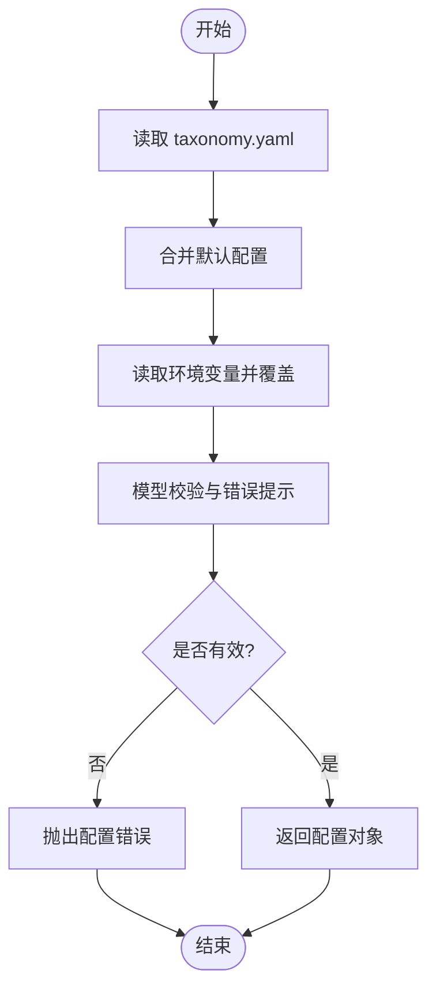
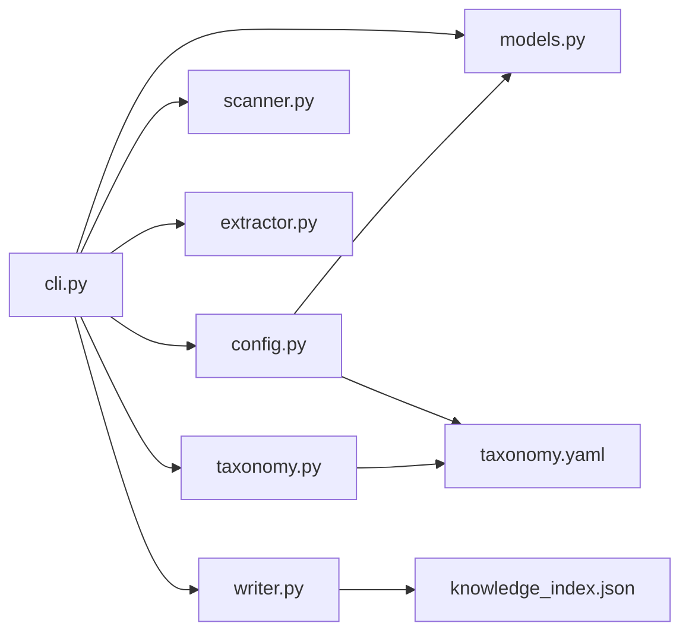

# 配置管理系统

<cite>
**本文引用的文件**   
- [km/config.py](file://km/config.py)
- [km/cli.py](file://km/cli.py)
- [km/__main__.py](file://km/__main__.py)
- [km/models.py](file://km/models.py)
- [km/scanner.py](file://km/scanner.py)
- [km/extractor.py](file://km/extractor.py)
- [km/writer.py](file://km/writer.py)
- [km/taxonomy.py](file://km/taxonomy.py)
- [taxonomy.yaml](file://taxonomy.yaml)
- [knowledge_index.json](file://knowledge_index.json)
</cite>

## 目录
1. [简介](#简介)
2. [项目结构](#项目结构)
3. [核心组件](#核心组件)
4. [架构总览](#架构总览)
5. [详细组件分析](#详细组件分析)
6. [依赖关系分析](#依赖关系分析)
7. [性能考量](#性能考量)
8. [故障排查指南](#故障排查指南)
9. [结论](#结论)
10. [附录](#附录)

## 简介
本文件为“配置管理系统”的完整技术文档，聚焦于知识管理模块（km）的配置能力与行为。内容涵盖：
- 配置文件结构与支持的配置项、默认值与校验规则
- 动态配置加载机制与环境变量支持
- 配置优先级与热重载策略
- 不同部署环境的最佳实践与常见问题解决方案

该系统的配置由 YAML 分类表与 JSON 索引共同驱动，CLI 提供统一的入口进行扫描、提取与写入操作，并通过模型层对数据进行结构化约束与验证。

## 项目结构
仓库根目录包含若干文章与知识库素材，核心代码位于 km 包内，关键配置文件位于根目录。整体组织方式如下：
- km 包：实现 CLI、配置、数据模型、扫描、提取、写入与分类等能力
- taxonomy.yaml：定义知识分类体系与相关元数据
- knowledge_index.json：维护知识条目索引，供查询与检索使用

**图表来源** 
- [km/__main__.py](file://km/__main__.py)
- [km/cli.py](file://km/cli.py)
- [km/config.py](file://km/config.py)
- [km/models.py](file://km/models.py)
- [km/scanner.py](file://km/scanner.py)
- [km/extractor.py](file://km/extractor.py)
- [km/writer.py](file://km/writer.py)
- [km/taxonomy.py](file://km/taxonomy.py)
- [taxonomy.yaml](file://taxonomy.yaml)
- [knowledge_index.json](file://knowledge_index.json)

**章节来源**
- [km/__main__.py](file://km/__main__.py)
- [km/cli.py](file://km/cli.py)
- [km/config.py](file://km/config.py)
- [km/models.py](file://km/models.py)
- [km/scanner.py](file://km/scanner.py)
- [km/extractor.py](file://km/extractor.py)
- [km/writer.py](file://km/writer.py)
- [km/taxonomy.py](file://km/taxonomy.py)
- [taxonomy.yaml](file://taxonomy.yaml)
- [knowledge_index.json](file://knowledge_index.json)

## 核心组件
- 配置加载器（config.py）：负责读取 YAML 分类配置、解析环境变量、合并多源配置并进行类型校验与默认值填充
- 数据模型（models.py）：定义配置项与业务数据的 Pydantic 模型，提供严格的字段校验与错误提示
- CLI 接口（cli.py）：暴露 scan、extract、write 等命令，统一参数处理与流程编排
- 扫描器（scanner.py）：遍历目标目录，收集待处理的文件列表
- 提取器（extractor.py）：从文件中抽取结构化信息（如标题、摘要、标签等）
- 写入器（writer.py）：将处理结果持久化到索引文件或输出目录
- 分类体系（taxonomy.py）：基于 taxonomy.yaml 构建分类树与映射关系

**章节来源**
- [km/config.py](file://km/config.py)
- [km/models.py](file://km/models.py)
- [km/cli.py](file://km/cli.py)
- [km/scanner.py](file://km/scanner.py)
- [km/extractor.py](file://km/extractor.py)
- [km/writer.py](file://km/writer.py)
- [km/taxonomy.py](file://km/taxonomy.py)

## 架构总览
下图展示了配置管理与数据处理的主流程：CLI 接收命令与参数，调用配置加载器获取运行时配置；随后依次执行扫描、提取与写入；分类体系贯穿整个流程，确保数据归类一致性与可追溯性。

**图表来源** 
- [km/cli.py](file://km/cli.py)
- [km/config.py](file://km/config.py)
- [km/scanner.py](file://km/scanner.py)
- [km/extractor.py](file://km/extractor.py)
- [km/taxonomy.py](file://km/taxonomy.py)
- [km/writer.py](file://km/writer.py)

## 详细组件分析

### 配置加载与校验（config.py）
- 功能要点
  - 读取 taxonomy.yaml 作为分类体系的权威配置
  - 支持通过环境变量覆盖部分配置项（例如路径、开关、阈值等）
  - 合并默认配置、YAML 配置与环境变量，形成最终配置对象
  - 使用 models.py 中的模型进行严格校验，缺失或非法字段会抛出明确错误
- 默认值与校验规则
  - 所有必填字段在模型层强制校验，未提供则报错
  - 可选字段具备合理默认值，避免运行期异常
  - 数值型字段支持范围限制，字符串字段支持格式校验
- 动态加载与热重载
  - 配置对象在进程启动时加载一次
  - 若需热重载，可通过外部信号触发重新加载配置并更新内存状态（需在 CLI 层增加监听逻辑）

**图表来源** 
- [km/config.py](file://km/config.py)
- [km/models.py](file://km/models.py)
- [taxonomy.yaml](file://taxonomy.yaml)

**章节来源**
- [km/config.py](file://km/config.py)
- [km/models.py](file://km/models.py)
- [taxonomy.yaml](file://taxonomy.yaml)

### 数据模型与校验（models.py）
- 设计原则
  - 使用强类型模型描述配置项与业务数据
  - 字段级校验保证输入合法性，减少运行期错误
  - 错误信息清晰，便于快速定位问题
- 典型模型
  - 配置模型：包含路径、开关、阈值、超时等常见配置项
  - 数据模型：包含标题、摘要、标签、时间戳等结构化字段
- 扩展建议
  - 新增配置项时同步更新模型与校验逻辑
  - 保持向后兼容，避免破坏现有配置

**章节来源**
- [km/models.py](file://km/models.py)

### CLI 接口（cli.py）
- 命令设计
  - scan：扫描目录并生成文件清单
  - extract：从文件中提取结构化数据
  - write：将结果写入索引或输出目录
- 参数处理
  - 支持命令行参数与环境变量混合使用
  - 参数优先级：显式参数 > 环境变量 > 配置文件 > 默认值
- 流程编排
  - 统一入口协调配置加载、扫描、提取、写入等步骤
  - 错误捕获与友好提示

**章节来源**
- [km/cli.py](file://km/cli.py)

### 扫描器（scanner.py）
- 功能
  - 递归遍历目标目录，过滤无关文件
  - 支持按扩展名、大小、修改时间等条件筛选
- 性能优化
  - 使用生成器惰性返回文件路径，降低内存占用
  - 并行扫描大目录时可提升吞吐

**章节来源**
- [km/scanner.py](file://km/scanner.py)

### 提取器（extractor.py）
- 功能
  - 解析 Markdown、HTML、PDF 等格式，抽取标题、正文、图片链接等
  - 清洗噪声内容，标准化输出结构
- 容错处理
  - 单文件解析失败不影响整体流程
  - 记录失败原因与上下文信息

**章节来源**
- [km/extractor.py](file://km/extractor.py)

### 写入器（writer.py）
- 功能
  - 将提取结果序列化并写入 knowledge_index.json
  - 支持增量更新与幂等写入
- 一致性保障
  - 写入前进行完整性校验
  - 失败时回滚或保留原文件

**章节来源**
- [km/writer.py](file://km/writer.py)

### 分类体系（taxonomy.py）
- 功能
  - 基于 taxonomy.yaml 构建分类树
  - 提供标签映射与层级查询
- 扩展性
  - 新增分类只需更新 YAML，无需修改代码
  - 支持别名与同义词映射

**章节来源**
- [km/taxonomy.py](file://km/taxonomy.py)
- [taxonomy.yaml](file://taxonomy.yaml)

## 依赖关系分析
各模块之间的依赖关系如下：
- cli.py 依赖 config.py、models.py、scanner.py、extractor.py、writer.py、taxonomy.py
- config.py 依赖 models.py 与 taxonomy.yaml
- writer.py 依赖 knowledge_index.json
- taxonomy.py 依赖 taxonomy.yaml

**图表来源** 
- [km/cli.py](file://km/cli.py)
- [km/config.py](file://km/config.py)
- [km/models.py](file://km/models.py)
- [km/scanner.py](file://km/scanner.py)
- [km/extractor.py](file://km/extractor.py)
- [km/writer.py](file://km/writer.py)
- [km/taxonomy.py](file://km/taxonomy.py)
- [taxonomy.yaml](file://taxonomy.yaml)
- [knowledge_index.json](file://knowledge_index.json)

**章节来源**
- [km/cli.py](file://km/cli.py)
- [km/config.py](file://km/config.py)
- [km/models.py](file://km/models.py)
- [km/scanner.py](file://km/scanner.py)
- [km/extractor.py](file://km/extractor.py)
- [km/writer.py](file://km/writer.py)
- [km/taxonomy.py](file://km/taxonomy.py)
- [taxonomy.yaml](file://taxonomy.yaml)
- [knowledge_index.json](file://knowledge_index.json)

## 性能考量
- 扫描阶段：建议使用惰性迭代与并行处理，避免一次性加载大量文件路径
- 提取阶段：对大文件采用流式解析，控制内存峰值
- 写入阶段：批量写入与事务性更新，减少磁盘 IO 次数
- 配置加载：缓存分类体系与常用映射，避免重复解析

[本节为通用指导，不直接分析具体文件]

## 故障排查指南
- 配置错误
  - 检查 taxonomy.yaml 语法与必填字段
  - 确认环境变量命名与取值符合模型定义
  - 查看错误堆栈定位具体字段
- 扫描失败
  - 验证目标路径权限与存在性
  - 检查文件扩展名过滤规则
- 提取异常
  - 确认文件格式支持情况
  - 查看单文件解析日志
- 写入失败
  - 检查输出目录权限与磁盘空间
  - 验证索引文件完整性

**章节来源**
- [km/config.py](file://km/config.py)
- [km/models.py](file://km/models.py)
- [km/scanner.py](file://km/scanner.py)
- [km/extractor.py](file://km/extractor.py)
- [km/writer.py](file://km/writer.py)

## 结论
本配置管理系统以 YAML 分类体系为核心，结合强类型模型与 CLI 统一入口，实现了从扫描、提取到写入的完整流水线。通过环境变量支持与严格校验，系统在灵活性与稳定性之间取得平衡。建议在生产环境中结合容器编排与配置中心，实现集中化管理与动态更新。

[本节为总结性内容，不直接分析具体文件]

## 附录

### 配置文件示例与说明
- taxonomy.yaml：定义分类树、标签映射、默认属性等
- knowledge_index.json：存储已处理知识的结构化索引

[本节为概念性说明，不直接分析具体文件]

### 环境变量支持
- 支持通过环境变量覆盖路径、开关、阈值等配置项
- 命名规范建议：使用前缀区分环境（如 KM_）
- 优先级：环境变量高于配置文件，低于显式命令行参数

[本节为概念性说明，不直接分析具体文件]

### 配置优先级与热重载
- 优先级顺序：命令行参数 > 环境变量 > 配置文件 > 默认值
- 热重载：当前版本为进程内静态加载，如需热重载可在 CLI 层增加信号监听与配置刷新逻辑

[本节为概念性说明，不直接分析具体文件]

### 不同部署环境的最佳实践
- 开发环境：启用详细日志与调试模式，允许宽松校验
- 测试环境：模拟真实数据，验证边界条件与异常路径
- 生产环境：关闭调试输出，启用严格校验与监控告警

[本节为概念性说明，不直接分析具体文件]

### 常见问题解决方案
- 分类冲突：检查 taxonomy.yaml 中是否存在重复键或歧义映射
- 索引损坏：重建索引或从备份恢复
- 性能瓶颈：调整并发度与批处理大小

[本节为概念性说明，不直接分析具体文件]