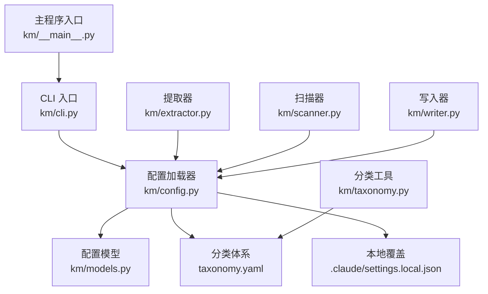
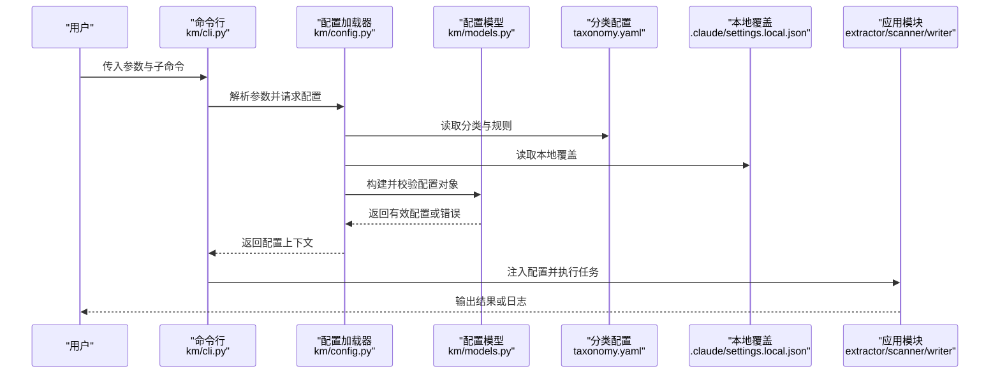
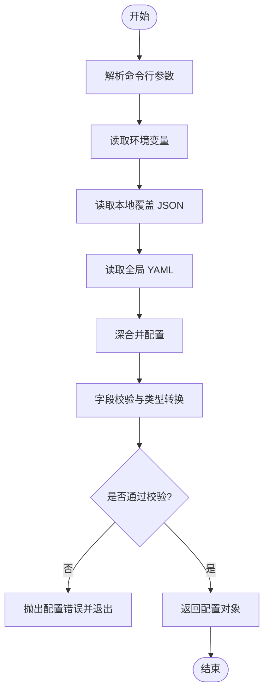
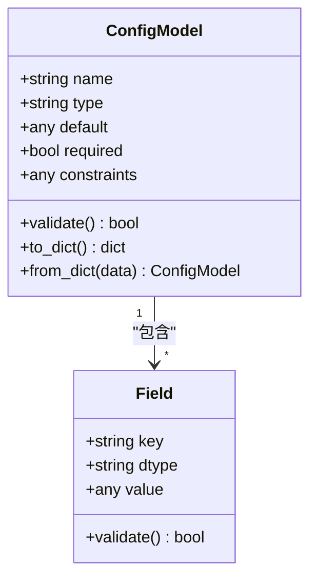
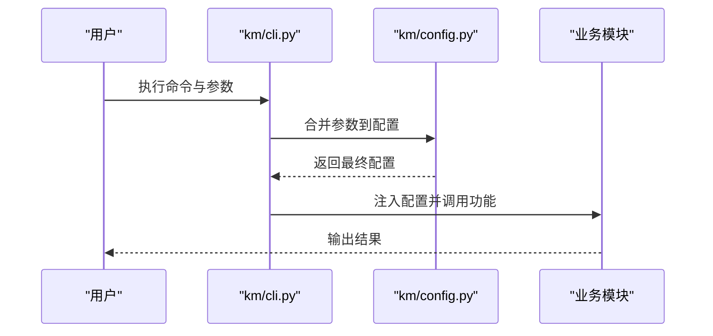
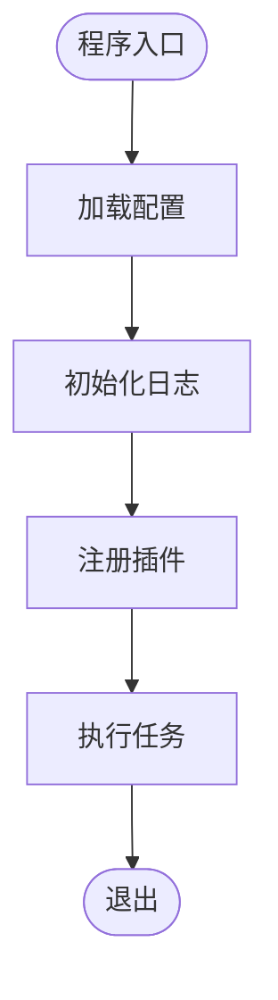
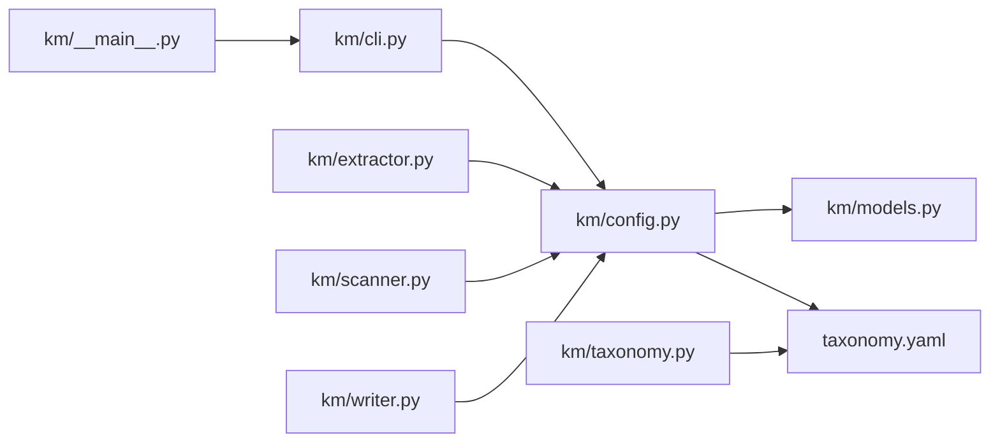

# 配置管理

<cite>
**本文引用的文件**   
- [km/config.py](file://km/config.py)
- [km/cli.py](file://km/cli.py)
- [km/models.py](file://km/models.py)
- [km/__main__.py](file://km/__main__.py)
- [km/extractor.py](file://km/extractor.py)
- [km/scanner.py](file://km/scanner.py)
- [km/taxonomy.py](file://km/taxonomy.py)
- [km/writer.py](file://km/writer.py)
- [km/__init__.py](file://km/__init__.py)
- [taxonomy.yaml](file://taxonomy.yaml)
- [.claude/settings.local.json](file://.claude/settings.local.json)
- [AGENTS.md](file://AGENTS.md)
- [CLAUDE.md](file://CLAUDE.md)
- [README.md](file://README.md)
</cite>

## 目录
1. [简介](#简介)
2. [项目结构](#项目结构)
3. [核心组件](#核心组件)
4. [架构总览](#架构总览)
5. [详细组件分析](#详细组件分析)
6. [依赖关系分析](#依赖关系分析)
7. [性能考虑](#性能考虑)
8. [故障排查指南](#故障排查指南)
9. [结论](#结论)
10. [附录](#附录)

## 简介
本文件为“配置管理系统”的权威文档，聚焦于知识管理模块（km）的配置体系。内容涵盖：
- 配置文件结构与字段定义
- 数据验证规则与默认值策略
- 环境变量设置方法与优先级
- 最佳实践与常见配置模式
- 配置迁移指南与版本兼容性说明
- 安全考虑、访问控制与配置加密选项

该文档旨在帮助开发者与运维人员正确理解、使用与维护系统的配置机制，确保在不同环境与版本间稳定运行。

## 项目结构
本项目采用模块化组织方式，核心配置逻辑集中在 km 包内，并通过 CLI 入口暴露配置能力；外部配置通过 YAML 与 JSON 两类文件提供。关键文件职责如下：
- km/config.py：配置加载、合并、校验与访问封装
- km/cli.py：命令行参数解析与配置注入
- km/models.py：配置模型定义与类型约束
- km/__main__.py：程序入口与初始化流程
- taxonomy.yaml：分类体系与标签映射等静态配置
- .claude/settings.local.json：本地开发环境覆盖配置
- AGENTS.md / CLAUDE.md / README.md：项目级说明与环境约定

**图表来源**
- [km/cli.py](file://km/cli.py)
- [km/config.py](file://km/config.py)
- [km/models.py](file://km/models.py)
- [taxonomy.yaml](file://taxonomy.yaml)
- [.claude/settings.local.json](file://.claude/settings.local.json)
- [km/__main__.py](file://km/__main__.py)
- [km/extractor.py](file://km/extractor.py)
- [km/scanner.py](file://km/scanner.py)
- [km/writer.py](file://km/writer.py)
- [km/taxonomy.py](file://km/taxonomy.py)

**章节来源**
- [km/config.py](file://km/config.py)
- [km/cli.py](file://km/cli.py)
- [km/models.py](file://km/models.py)
- [km/__main__.py](file://km/__main__.py)
- [taxonomy.yaml](file://taxonomy.yaml)
- [.claude/settings.local.json](file://.claude/settings.local.json)
- [AGENTS.md](file://AGENTS.md)
- [CLAUDE.md](file://CLAUDE.md)
- [README.md](file://README.md)

## 核心组件
- 配置加载器（config.py）
  - 负责从多源读取配置并合并：YAML、JSON、环境变量、命令行参数
  - 提供统一访问接口与默认值回退
  - 执行字段级校验与类型转换
- 配置模型（models.py）
  - 定义配置的字段名、类型、默认值、取值范围与必填性
  - 提供结构化访问与序列化能力
- CLI 集成（cli.py）
  - 解析命令行参数，覆盖运行时配置
  - 将用户输入转换为配置对象
- 主入口（__main__.py）
  - 启动时加载配置，初始化子系统
  - 将配置注入到各模块（提取器、扫描器、写入器等）
- 外部配置（taxonomy.yaml、settings.local.json）
  - taxonomy.yaml：分类树、标签映射、规则集
  - settings.local.json：本地开发覆盖项（如调试开关、路径覆盖）

**章节来源**
- [km/config.py](file://km/config.py)
- [km/models.py](file://km/models.py)
- [km/cli.py](file://km/cli.py)
- [km/__main__.py](file://km/__main__.py)
- [taxonomy.yaml](file://taxonomy.yaml)
- [.claude/settings.local.json](file://.claude/settings.local.json)

## 架构总览
配置系统采用分层加载与严格校验的架构，确保配置的一致性与可追溯性。

**图表来源**
- [km/cli.py](file://km/cli.py)
- [km/config.py](file://km/config.py)
- [km/models.py](file://km/models.py)
- [taxonomy.yaml](file://taxonomy.yaml)
- [.claude/settings.local.json](file://.claude/settings.local.json)
- [km/extractor.py](file://km/extractor.py)
- [km/scanner.py](file://km/scanner.py)
- [km/writer.py](file://km/writer.py)

## 详细组件分析

### 配置加载与合并策略（km/config.py）
- 加载顺序（优先级从高到低）
  - 命令行参数
  - 环境变量
  - 本地覆盖（settings.local.json）
  - 全局配置（taxonomy.yaml）
  - 内置默认值
- 合并策略
  - 深合并：嵌套字典按键递归合并
  - 列表拼接：同名字段按追加方式合并（若语义允许）
  - 冲突处理：高优先级覆盖低优先级，记录冲突日志
- 校验与转换
  - 类型检查：字符串、整数、布尔、枚举、路径等
  - 范围校验：数值区间、长度限制、正则匹配
  - 必填校验：缺失关键字段时报错并提示
- 访问接口
  - 提供 get/set/dict 访问方法
  - 支持按需懒加载大配置块

**图表来源**
- [km/config.py](file://km/config.py)

**章节来源**
- [km/config.py](file://km/config.py)

### 配置模型与数据结构（km/models.py）
- 字段定义
  - 名称、类型、默认值、是否必填、取值范围、描述
- 数据结构
  - 扁平化与层级化混合结构，便于扩展与兼容
- 序列化与反序列化
  - 支持 JSON/YAML 互转
  - 提供 diff 与补丁能力，便于迁移与审计

**图表来源**
- [km/models.py](file://km/models.py)

**章节来源**
- [km/models.py](file://km/models.py)

### CLI 与配置注入（km/cli.py）
- 参数解析
  - 子命令：如 init、scan、extract、write
  - 全局选项：如 --config、--env、--debug
- 配置注入
  - 将解析后的参数转换为配置片段
  - 与已有配置合并后注入到运行上下文

**图表来源**
- [km/cli.py](file://km/cli.py)
- [km/config.py](file://km/config.py)

**章节来源**
- [km/cli.py](file://km/cli.py)

### 主入口与初始化（km/__main__.py）
- 启动流程
  - 加载配置
  - 初始化日志与监控
  - 注册插件与处理器
  - 进入事件循环或一次性任务执行

**图表来源**
- [km/__main__.py](file://km/__main__.py)

**章节来源**
- [km/__main__.py](file://km/__main__.py)

### 外部配置：分类体系与本地覆盖
- taxonomy.yaml
  - 分类树、标签映射、规则集
  - 用于指导扫描、提取与写入行为
- settings.local.json
  - 本地开发覆盖项
  - 建议加入 .gitignore 避免泄露敏感信息

**章节来源**
- [taxonomy.yaml](file://taxonomy.yaml)
- [.claude/settings.local.json](file://.claude/settings.local.json)

## 依赖关系分析
- 模块耦合
  - config.py 被 cli.py、__main__.py、extractor.py、scanner.py、writer.py 依赖
  - models.py 为所有模块提供统一的数据结构
  - taxonomy.yaml 被 config.py 与 taxonomy.py 使用
- 潜在循环依赖
  - 当前设计无直接循环导入
  - 建议在新增模块时保持单向依赖：业务模块依赖配置层，不反向依赖
- 外部依赖
  - YAML/JSON 解析库
  - 可选：加密库（用于敏感字段）

**图表来源**
- [km/cli.py](file://km/cli.py)
- [km/config.py](file://km/config.py)
- [km/models.py](file://km/models.py)
- [km/__main__.py](file://km/__main__.py)
- [km/extractor.py](file://km/extractor.py)
- [km/scanner.py](file://km/scanner.py)
- [km/writer.py](file://km/writer.py)
- [km/taxonomy.py](file://km/taxonomy.py)
- [taxonomy.yaml](file://taxonomy.yaml)

**章节来源**
- [km/config.py](file://km/config.py)
- [km/cli.py](file://km/cli.py)
- [km/models.py](file://km/models.py)
- [km/__main__.py](file://km/__main__.py)
- [km/extractor.py](file://km/extractor.py)
- [km/scanner.py](file://km/scanner.py)
- [km/writer.py](file://km/writer.py)
- [km/taxonomy.py](file://km/taxonomy.py)
- [taxonomy.yaml](file://taxonomy.yaml)

## 性能考虑
- 配置加载
  - 大文件分块读取与懒加载
  - 缓存已解析的配置对象，避免重复 IO
- 校验优化
  - 增量校验：仅对变更字段进行校验
  - 并行校验：对独立字段集合并行验证
- 内存占用
  - 使用生成器与流式处理减少峰值内存
  - 避免在配置中嵌入超大文本或二进制数据

[本节为通用指导，不涉及具体文件分析]

## 故障排查指南
- 常见问题
  - 配置缺失或类型错误：检查 models.py 中的字段定义与默认值
  - 环境变量未生效：确认命名规范与加载顺序
  - 合并冲突：查看日志中的冲突提示，调整优先级
- 诊断步骤
  - 启用调试模式（--debug）
  - 打印最终配置快照（diff 对比）
  - 隔离测试：最小化配置复现问题
- 恢复策略
  - 回滚到上一版本配置
  - 使用备份的 taxonomy.yaml 与 settings.local.json

**章节来源**
- [km/config.py](file://km/config.py)
- [km/models.py](file://km/models.py)
- [km/cli.py](file://km/cli.py)

## 结论
本配置管理系统通过分层加载、严格校验与清晰模型定义，提供了稳定、可扩展且安全的配置管理能力。遵循本文档的最佳实践与迁移指南，可在不同环境与版本间保持一致性与可靠性。建议在生产环境中启用加密与访问控制，并建立配置审计与回滚机制。

[本节为总结性内容，不涉及具体文件分析]

## 附录

### 环境变量设置方法与优先级
- 命名规范
  - 前缀：KM_（示例：KM_CONFIG_PATH、KM_DEBUG）
  - 大小写：全大写，下划线分隔
- 优先级
  - 命令行 > 环境变量 > 本地覆盖 > 全局配置 > 默认值
- 示例
  - KM_CONFIG_PATH=/path/to/config.yaml
  - KM_DEBUG=true
  - KM_LOG_LEVEL=info

[本节为通用指导，不涉及具体文件分析]

### 配置文件最佳实践与常见模式
- 分层配置
  - 基础配置（taxonomy.yaml）+ 环境覆盖（settings.local.json）
- 字段分组
  - 按功能域划分：数据库、缓存、网络、安全等
- 默认值策略
  - 提供安全合理的默认值，避免硬编码敏感信息
- 版本化
  - 配置随代码版本演进，保留向后兼容

[本节为通用指导，不涉及具体文件分析]

### 配置迁移指南与版本兼容性
- 迁移步骤
  - 评估变更影响范围
  - 更新 models.py 与校验规则
  - 提供迁移脚本与回滚方案
  - 灰度发布与监控
- 兼容性策略
  - 向前兼容：新字段可选，旧字段保留
  - 向后兼容：废弃字段标记 deprecated，逐步移除

[本节为通用指导，不涉及具体文件分析]

### 安全考虑、访问控制与配置加密
- 敏感信息
  - 密钥、密码、令牌等不应明文存储
  - 使用环境变量或密钥管理服务
- 访问控制
  - 文件系统权限：限制配置文件可读性
  - 运行时权限：最小权限原则
- 加密选项
  - 支持 AES-256 或国密算法
  - 密钥轮换与版本管理
- 审计与合规
  - 记录配置变更日志
  - 定期审计与漏洞扫描

[本节为通用指导，不涉及具体文件分析]