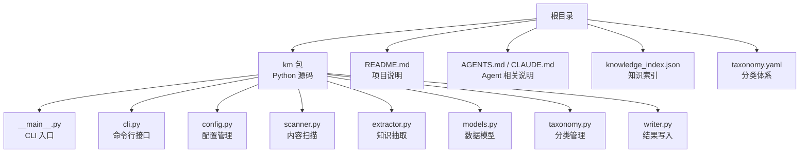
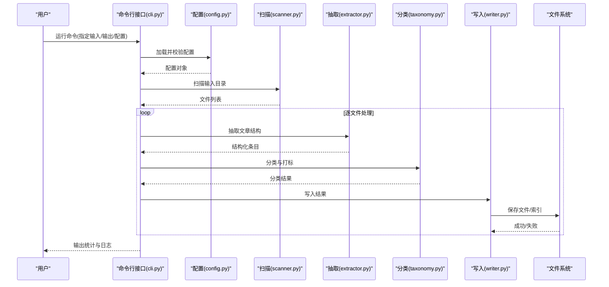
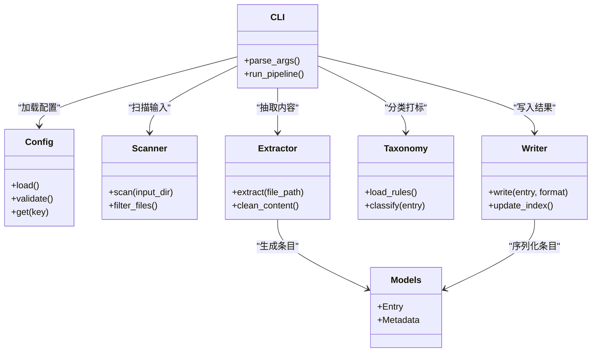
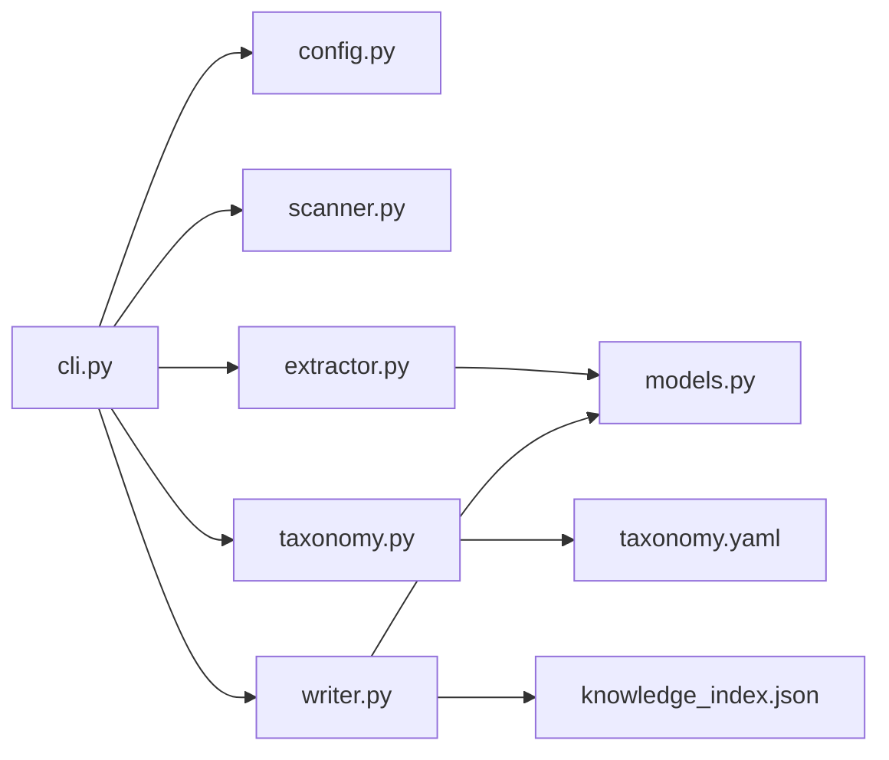

# 项目概览

<cite>
**本文引用的文件**   
- [README.md](file://README.md)
- [AGENTS.md](file://AGENTS.md)
- [CLAUDE.md](file://CLAUDE.md)
- [knowledge_index.json](file://knowledge_index.json)
- [taxonomy.yaml](file://taxonomy.yaml)
- [km/__init__.py](file://km/__init__.py)
- [km/__main__.py](file://km/__main__.py)
- [km/cli.py](file://km/cli.py)
- [km/config.py](file://km/config.py)
- [km/extractor.py](file://km/extractor.py)
- [km/models.py](file://km/models.py)
- [km/scanner.py](file://km/scanner.py)
- [km/taxonomy.py](file://km/taxonomy.py)
- [km/writer.py](file://km/writer.py)
</cite>

## 目录
1. [简介](#简介)
2. [项目结构](#项目结构)
3. [核心组件](#核心组件)
4. [架构总览](#架构总览)
5. [详细组件分析](#详细组件分析)
6. [依赖关系分析](#依赖关系分析)
7. [性能考量](#性能考量)
8. [故障排查指南](#故障排查指南)
9. [结论](#结论)
10. [附录](#附录)

## 简介
WeChatPublicArticle 是一个面向微信公众号文章的“知识抽取与索引”工具。其目标是从公众号文章（Markdown、HTML 等）中抽取结构化知识，按分类体系组织，并生成可检索的知识索引，便于后续检索、分析与展示。项目采用 Python 实现，提供命令行入口，支持配置驱动的流程控制，并通过分类体系对内容进行标签化与归档。

该项目的核心价值在于：
- 将非结构化或半结构化的公众号文章内容转化为结构化知识条目
- 基于统一分类体系进行内容组织与检索
- 通过 CLI 和配置文件实现自动化流水线处理

## 项目结构
仓库根目录包含文档说明、配置与知识库索引，以及核心代码模块 km。km 目录下为完整的命令行工具与数据处理管线，包括配置加载、扫描、抽取、模型定义、分类管理与写入输出等。

图表来源
- [km/__main__.py](file://km/__main__.py)
- [km/cli.py](file://km/cli.py)
- [km/config.py](file://km/config.py)
- [km/scanner.py](file://km/scanner.py)
- [km/extractor.py](file://km/extractor.py)
- [km/models.py](file://km/models.py)
- [km/taxonomy.py](file://km/taxonomy.py)
- [km/writer.py](file://km/writer.py)

章节来源
- [README.md](file://README.md)
- [AGENTS.md](file://AGENTS.md)
- [CLAUDE.md](file://CLAUDE.md)
- [knowledge_index.json](file://knowledge_index.json)
- [taxonomy.yaml](file://taxonomy.yaml)

## 核心组件
- 命令行入口与调度：负责解析参数、加载配置、编排执行流程
- 配置管理：读取 YAML/JSON 配置，校验并提供默认值
- 内容扫描器：遍历输入目录，识别文章文件（如 .md/.html），建立待处理队列
- 知识抽取器：从文章内容中提取标题、摘要、正文、图片、元数据等
- 数据模型：定义抽取结果的统一结构，确保一致性
- 分类管理：依据 taxonomy.yaml 对内容进行分类与打标
- 写入器：将抽取结果持久化为 JSON/Markdown/HTML 等格式

章节来源
- [km/__main__.py](file://km/__main__.py)
- [km/cli.py](file://km/cli.py)
- [km/config.py](file://km/config.py)
- [km/scanner.py](file://km/scanner.py)
- [km/extractor.py](file://km/extractor.py)
- [km/models.py](file://km/models.py)
- [km/taxonomy.py](file://km/taxonomy.py)
- [km/writer.py](file://km/writer.py)

## 架构总览
整体架构遵循“配置驱动 + 模块化处理”的设计：CLI 作为统一入口，依次调用扫描、抽取、分类、写入等阶段，中间以统一的数据模型传递结果。

图表来源
- [km/cli.py](file://km/cli.py)
- [km/config.py](file://km/config.py)
- [km/scanner.py](file://km/scanner.py)
- [km/extractor.py](file://km/extractor.py)
- [km/taxonomy.py](file://km/taxonomy.py)
- [km/writer.py](file://km/writer.py)

## 详细组件分析

### 命令行接口与入口
- __main__.py：程序入口，绑定 CLI 命令到具体功能
- cli.py：定义命令参数、帮助信息、错误提示，协调各模块执行顺序

典型使用模式
- 初始化：指定输入目录、输出目录、配置文件路径
- 执行：启动扫描、抽取、分类、写入流程
- 报告：输出处理统计、错误汇总

章节来源
- [km/__main__.py](file://km/__main__.py)
- [km/cli.py](file://km/cli.py)

### 配置管理
- config.py：读取 YAML/JSON 配置，提供默认值与校验逻辑
- 关键配置项示例（概念性描述）：
  - 输入/输出路径
  - 支持的扩展名
  - 抽取策略开关
  - 分类规则文件路径
  - 日志级别与并发度

章节来源
- [km/config.py](file://km/config.py)
- [taxonomy.yaml](file://taxonomy.yaml)

### 内容扫描器
- scanner.py：递归扫描输入目录，过滤目标文件类型，构建待处理队列
- 行为要点：
  - 忽略隐藏文件与临时文件
  - 记录扫描进度与异常文件
  - 支持增量扫描（可选）

章节来源
- [km/scanner.py](file://km/scanner.py)

### 知识抽取器
- extractor.py：从 Markdown/HTML 中抽取标题、摘要、正文、图片、元数据
- 处理流程：
  - 解析文档结构
  - 提取关键段落与列表
  - 清理冗余 HTML/Markdown 标记
  - 生成结构化条目

章节来源
- [km/extractor.py](file://km/extractor.py)

### 数据模型
- models.py：定义统一的条目结构（如标题、摘要、正文、图片、时间戳、分类标签等）
- 设计原则：
  - 字段命名一致
  - 必填字段校验
  - 可扩展的元数据字段

章节来源
- [km/models.py](file://km/models.py)

### 分类管理
- taxonomy.py：加载 taxonomy.yaml，提供分类树查询、匹配与打标能力
- 能力要点：
  - 多级分类支持
  - 关键词/正则匹配规则
  - 默认分类回退机制

章节来源
- [km/taxonomy.py](file://km/taxonomy.py)
- [taxonomy.yaml](file://taxonomy.yaml)

### 写入器
- writer.py：将抽取结果写入目标格式（JSON/Markdown/HTML），更新知识索引
- 行为要点：
  - 原子写入（避免部分写入）
  - 冲突检测与覆盖策略
  - 索引同步更新

章节来源
- [km/writer.py](file://km/writer.py)
- [knowledge_index.json](file://knowledge_index.json)

### 类图（代码级关系）

图表来源
- [km/cli.py](file://km/cli.py)
- [km/config.py](file://km/config.py)
- [km/scanner.py](file://km/scanner.py)
- [km/extractor.py](file://km/extractor.py)
- [km/taxonomy.py](file://km/taxonomy.py)
- [km/writer.py](file://km/writer.py)
- [km/models.py](file://km/models.py)

## 依赖关系分析
- 内部依赖：
  - CLI 依赖配置、扫描、抽取、分类、写入模块
  - 抽取与写入共享数据模型
  - 分类依赖 taxonomy.yaml
- 外部依赖：
  - 文件系统（读写输入/输出）
  - 可能的第三方库（用于 Markdown/HTML 解析、YAML/JSON 处理）

图表来源
- [km/cli.py](file://km/cli.py)
- [km/config.py](file://km/config.py)
- [km/scanner.py](file://km/scanner.py)
- [km/extractor.py](file://km/extractor.py)
- [km/taxonomy.py](file://km/taxonomy.py)
- [km/writer.py](file://km/writer.py)
- [km/models.py](file://km/models.py)
- [taxonomy.yaml](file://taxonomy.yaml)
- [knowledge_index.json](file://knowledge_index.json)

章节来源
- [km/cli.py](file://km/cli.py)
- [km/config.py](file://km/config.py)
- [km/scanner.py](file://km/scanner.py)
- [km/extractor.py](file://km/extractor.py)
- [km/taxonomy.py](file://km/taxonomy.py)
- [km/writer.py](file://km/writer.py)
- [km/models.py](file://km/models.py)
- [taxonomy.yaml](file://taxonomy.yaml)
- [knowledge_index.json](file://knowledge_index.json)

## 性能考量
- 扫描阶段：建议限制递归深度与文件类型，避免扫描无关目录
- 抽取阶段：对大文档分块处理，减少内存占用
- 分类阶段：预编译匹配规则，提升匹配效率
- 写入阶段：批量写入与索引更新，减少 IO 次数
- 并发：根据 CPU/IO 特性调整并行度，避免资源争用

[本节为通用指导，不直接分析具体文件]

## 故障排查指南
常见问题与定位方法：
- 配置错误：检查 YAML/JSON 语法与必填字段
- 扫描失败：确认输入目录权限与路径正确性
- 抽取异常：查看文件格式是否受支持，必要时启用调试日志
- 分类失败：核对 taxonomy.yaml 规则与内容匹配条件
- 写入失败：检查输出目录权限与磁盘空间

章节来源
- [km/config.py](file://km/config.py)
- [km/scanner.py](file://km/scanner.py)
- [km/extractor.py](file://km/extractor.py)
- [km/taxonomy.py](file://km/taxonomy.py)
- [km/writer.py](file://km/writer.py)

## 结论
WeChatPublicArticle 通过清晰的模块化设计与配置驱动方式，实现了从公众号文章到结构化知识的自动化处理。其优势在于：
- 易于扩展：新增抽取规则与分类策略只需修改对应模块或配置文件
- 可维护性强：数据模型与流程解耦，便于独立测试与优化
- 实用性强：生成的索引可直接用于检索与分析

建议在后续迭代中关注：
- 抽取准确率评估与反馈闭环
- 大规模文档处理的性能优化
- 多格式支持与国际化增强

[本节为总结性内容，不直接分析具体文件]

## 附录
- 快速上手步骤（概念性）：
  - 准备输入目录，放置 Markdown/HTML 文章
  - 编辑 taxonomy.yaml，定义分类规则
  - 运行 CLI 命令，指定输入/输出/配置路径
  - 检查输出目录与 knowledge_index.json 是否正确生成
- 术语表：
  - 知识条目：抽取后的结构化内容单元
  - 分类体系：用于内容打标的层级化规则集合
  - 知识索引：对知识条目的可检索映射

[本节为补充信息，不直接分析具体文件]