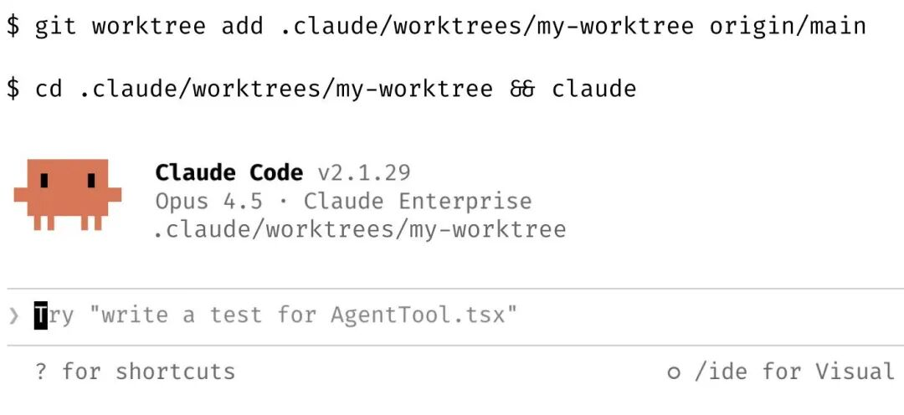
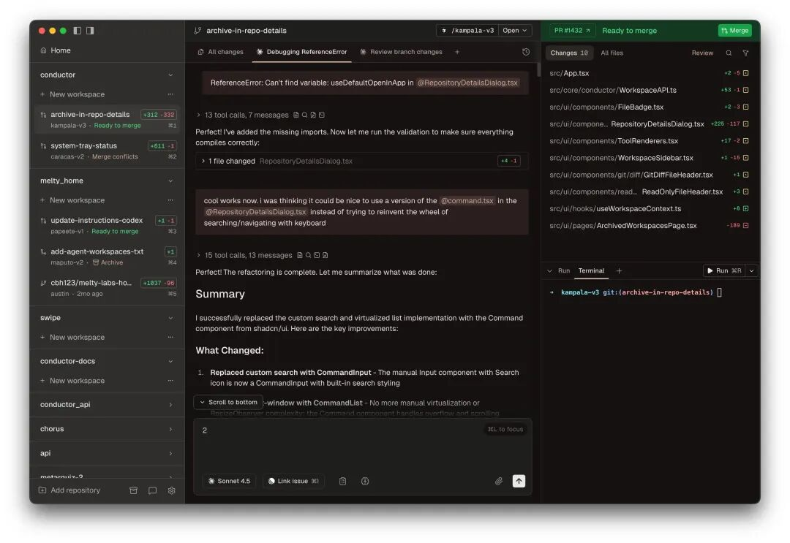
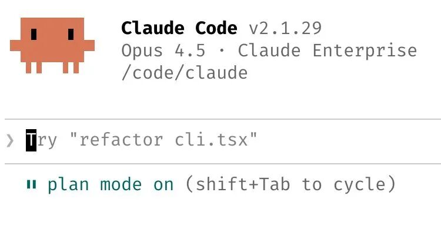
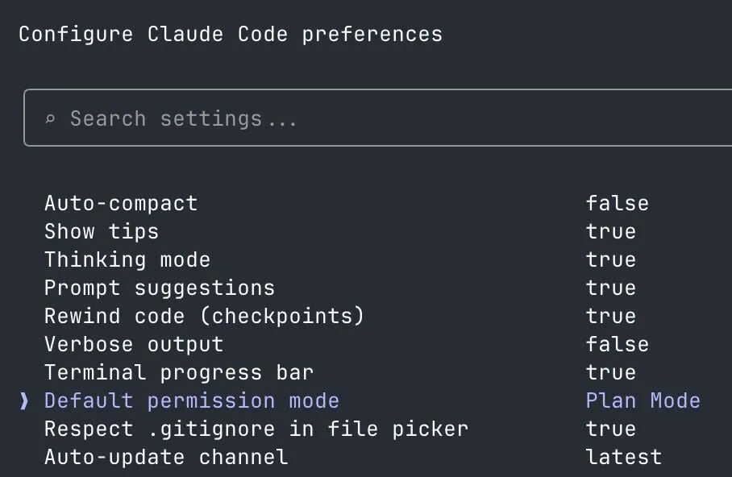
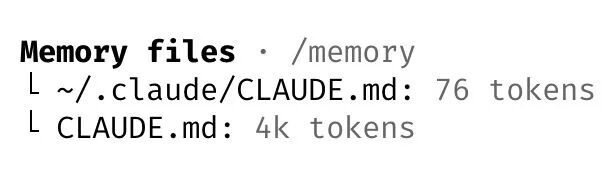
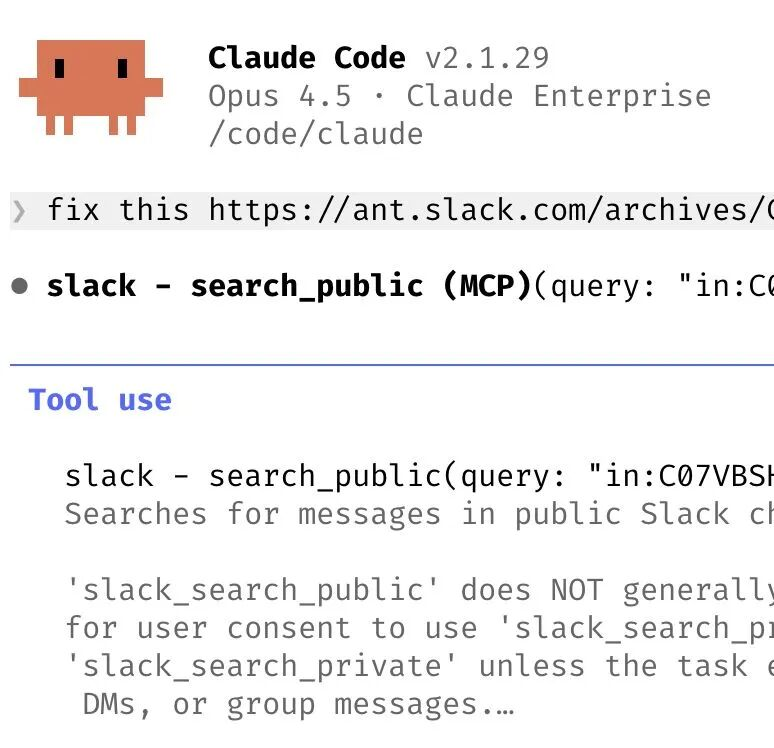
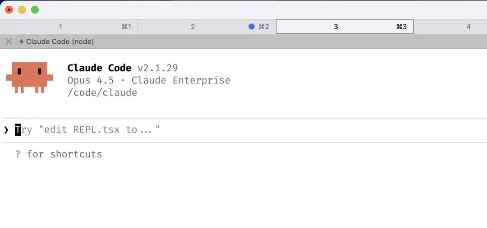
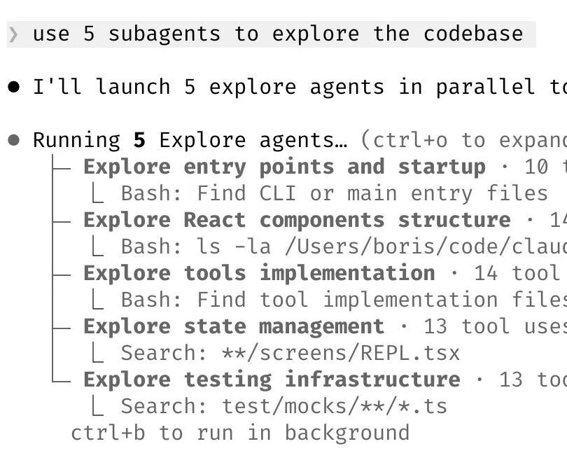
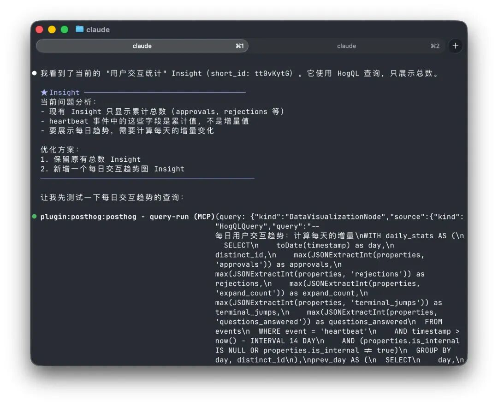
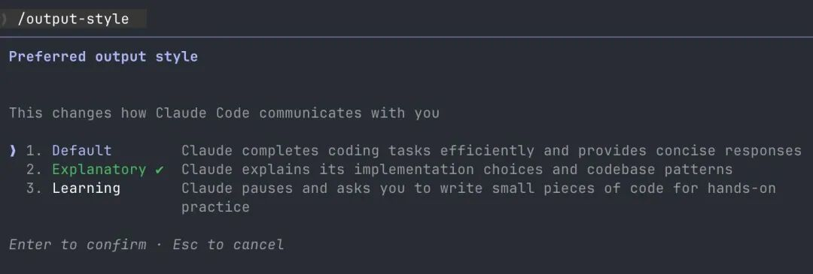

# 1000 万人围观的 Claude Code 创始人 0% 手写代码工作流更新了（附我的实战心得）

> 原文链接：[1000 万人围观的 Claude Code 创始人 0% 手写代码工作流更新了（附我的实战心得）](https://mp.weixin.qq.com/s/Mm99cuDD2LUfTyfJ0A11zw)

大家好，我是 Edward。

一个月前，我分享了&nbsp;[Claude Code 创始人 Boris 在推特公开的 0% 手写代码工作流](https://mp.weixin.qq.com/s?__biz=MzY0MDU4NzYwNA==&mid=2247483727&idx=1&sn=e9146033cd2716739058c554b2919587&scene=21#wechat_redirect)。这两天他又发了条新推文，两篇共 1000 多万浏览，可能是全推特分享 Claude Code 使用经验流量最高的帖子。

获取高质量 AI 资讯要「**Follow builders, not influencers**」。这次的内容是 Boris 和 Claude Code 开发团队一起总结的 10 条技巧，相比上次更具实操价值，用法也更高阶，非常值得学习。

原推文信息密度极高，但缺少具体实践指引。我结合自己过去半年用 CC 独立开发产品的经历，针对每条技巧都补充了具体的使用心得，分享给大家：

在我看来，这 10 条技巧可以归纳为四个核心思路：

**并行提效**：同时跑多个 worktrees、善用 subagents，让多个 Claude 为你打工。

**构建知识复利**：Plan mode、CLAUDE.md、Skill、Spec 文档——把经验变成可复用的资产。

**自动化闭环**：让 Claude 自动修 bug、用 AI 审批权限，减少人工干预。

**扩展使用边界**：不只是写代码，还能做数据分析、边写边学。## ▌01 提高效率的最佳技巧：同时跑多个 Claude Code 任务

这点上次也提过，但这次补充了更多细节。

Boris 他们会同时启动 3-5 个 git worktrees，每个 worktree 跑一个独立的 Claude Code 对话。Claude 桌面端已经原生支持这个功能了。

一个小技巧：给 worktrees 设置 shell 别名（比如 za、zb、zc），一个快捷键就能切换。也可以专门留一个 worktree 只用来读日志、跑数据查询，不干扰主开发流程。

注：为什么要用 worktree 而不只是多开几个对话窗口？**因为每个 worktree 都有独立的文件状态，一个 worktree 里的改动不会影响其他 worktree，多个 Claude 同时改代码也不会互相干扰**。

如果你也想试试 git worktrees 的工作方式，强烈推荐试试看&nbsp;**Conductor**&nbsp;这个软件。它把 worktree 的创建、提 PR、合并这些操作都整合到产品里了，体验很顺滑。

我现在就用它来并行开发产品的多个功能，有了不同的 worktrees，多 Agents 同步开发的效率成倍增加 ，也不用担心搞坏代码库。后续打算单独写一篇 Conductor 的使用教程，感兴趣的欢迎留言。

## ▌02 复杂任务从 Plan mode 开始

核心思路：**把精力花在计划上，让 Claude 能一次性高质量完成**。

Boris 他们会让一个 Claude 先写计划，再开另一个 Claude 来审核这个计划。如果审核时发现有偏差，就切回 Plan mode 重新规划，而不是硬着头皮继续写。他们甚至会在验证步骤也用 Plan mode，不只是在写代码的时候用。

**我是直接在设置里把默认模式改成了 Plan mode，每次启动 Claude Code 就直接进入计划模式**，推荐大家也这么改哈哈，不然有时候很容易忘记。

## ▌03 运用复利思维，持续更新你的 CLAUDE.md，沉淀使用经验。

每次 Claude 犯错后，Boris 都会在对话结尾加一句：「把这条规则更新到 CLAUDE.md，下次别再犯同样的错」。Claude 写给自己的规则出奇地有效。

他们会持续迭代 CLAUDE.md，直到 Claude 的出错率明显下降。团队里还有工程师会让 Claude 为每个项目维护一个文档目录，每次提 PR 后都更新，然后在 CLAUDE.md 里指向这个目录。

我的 CLAUDE.md 每个项目至少有十几条规则，都是 Claude 犯错后一条条加上去的。**我留了一段「踩坑记录」，专门记下那些反复出现的问题。一旦把踩坑经验清晰写下之后，Claude 基本就再没有出现过类似的错误**。## ▌04 把重复的工作流沉淀成 Skill

Boris 他们判断什么时候该创建 Skill 的标准很简单：**如果每天做某件事超过一次，就把它变成一个 Skill**。

他们团队的一些例子：

创建一个&nbsp;`/techdebt`&nbsp;指令，每次会话结束时运行，查找并消除重复代码

设置一个指令把 Slack、Google Drive、Asana、GitHub 过去 7 天的内容同步到一个上下文汇总文档

构建分析工程师风格的 agents，用于写 dbt 模型、审查代码、在开发环境测试变更

我自己常用的几个 Skill：

**Plan Review**：写完方案后，用 Skill 调用 Codex 的 GPT 5.2 xhigh 帮我检查一遍计划是否有漏洞（千万别浪费 GPT Plus 的额度）

**代码 Review**：写完功能后，同样请 Codex 老师帮我 review 代码，看看有没有 bug 或者可以简化的地方

**产品发布版本更新**：每次 release 新版本时帮我自动提交，自动填写更新说明

这套「**Claude 写 + Codex 审**」的工作流非常好用，后续也会单独写一篇分享，欢迎关注。## ▌05 Claude 可以自主修复绝大多数 Bug

Boris 他们的做法：

启用 Slack MCP 后，直接把 Slack 里的 bug 讨论帖丢给 Claude，**只说一个字「fix」**，不需要额外解释上下文

直接说「Go fix the failing CI tests」，不用告诉它具体怎么做

让 Claude 读 docker logs 来排查分布式系统问题，效果出奇地好

我自己的做法更简单：给产品接上 Sentry 监控崩溃报告，遇到线上问题直接把崩溃报告丢给 Claude，让它自动分析问题、自动修复。

日常开发 iOS 应用时也是一样，构建报错了 Claude 会自动检查报错信息、自动修复，都不需要我手动复制粘贴报错日志。## ▌06 三个高阶的 Claude Code 使用思路

Boris 分享了三种思路：

**a. 让 Claude 挑战你**

说「用这些变更考考我，没通过你的测试不准提交 PR」，让 Claude 担任代码审查者。或者说「证明这功能确实有效」，让 Claude 比较主分支和功能分支的代码差异。

**b. 先实现，再优化**

在完成一个「能用但不够优雅」的方案后，说：「既然你现在已经知道我要什么了，废弃这个方案，去实现那个更优雅的解决方案吧。」

这一点我深有体会。我的做法是：**先追求功能完成，再追求代码优雅**。先通过精确的需求描述让 Claude 完成功能，等用户体验上没问题之后，再让 Claude 和 Codex 帮我 review 一遍完整代码。因为功能已经实现了，它们知道我要的是什么，就可以在保证功能的情况下，想尽办法找到代码可优化的部分，写出更优雅的方案。

**c. 写详细的 Spec**

在移交工作前，写详细的规格说明，减少模糊性。越具体，产出质量越高。

我基本上每天都在用这个方法：每次完成一个新功能、完成一次技术调研、每次踩坑、以及上下文快用尽的时候，我都会让 Claude 总结成一个 Markdown 文档，分门别类存在 Doc 文件夹里。下次遇到类似问题就可以直接读文档，快速恢复上下文。## ▌07 终端环境配置

Claude Code 团队都很喜欢用 Ghostty（一个新兴的终端应用，渲染效果非常好，我也很喜欢），主要是看中它的同步渲染、24 位色彩和完善的 Unicode 支持。

为了更方便地切换 Claude，可以用&nbsp;`/statusline`&nbsp;指令自定义状态栏，显示上下文使用情况和当前 Git 分支。他们还会给终端标签页加颜色标记、重命名，有时用 tmux 来管理，每个 tab 对应一个 task 或 worktree。

他还提到**他们整个团队都使用语音输入而非打字编程**。这一点我也深有感触，**人类的说话速度是打字的 3 倍以上**，除了速度，**使用语音输入的更大价值在于，你会不自觉地说出更多的上下文，从而获得更好的结果**。## ▌08 善用 Claude Code 的 subagents 子代理

Claude Code 团队总结了 3 种常见的 subagent 使用场景：

**a. 需要更多计算资源时**

在请求后面加一句「使用子代理」，让 Claude 投入更多计算资源来处理问题。

**b. 保持主对话上下文干净**

把单个任务交给子代理处理，主对话的上下文窗口就能保持简洁、专注。

**c. 用 hook 让 AI 自动审批权限（高阶）**

通过 hook 把权限请求发给 Opus 4.5，让它判断请求是否安全，安全的自动批准，危险的拦截。

我之前一直不敢开&nbsp;`dangerously-skip-permissions`，怕 Claude 误删文件或者搞坏代码库。但用了这个**「AI 辅助审批权限」**的思路之后，我现在都是开 bypass 模式工作，极大提升了效率——既享受了自动批准的便利，又不用担心安全问题。这是个很高阶的技巧，值得花点时间研究配置。

## ▌09 Claude Code 不只会写代码，还能做数据分析

Boris 他们基本不手写 SQL 了，直接让 Claude 用 bq 命令行工具实时提取和分析指标。他们在代码库里集成了 BigQuery 技能模块，团队成员都可以直接在 Claude Code 里跑分析查询。

这个方法适用于任何有 CLI、MCP 或 API 接口的数据库。

我最近给产品接上了 PostHog 分析用户使用数据，虽然从来没学过 SQL，**但只要跟 Claude 口述我想看什么数据，它就能直接写出可用的查询语句，生成可视化的产品数据 dashboard**。

如果现有埋点不足以支撑分析，Claude 甚至还能根据需求优化埋点的设计，让我的重心完全聚焦于如何根据用户数据迭代产品，而不用浪费时间在学习数据分析上。## ▌10 你可以边用 Claude Code 写代码边学习

Boris 团队分享的几个学习技巧：

在&nbsp;`/config`&nbsp;中启用 Explanatory 或 Learning 的 output style，让 Claude 解释它做了什么。

让 Claude 生成可视化 HTML 演示文稿，解释不熟悉的代码。它生成的幻灯片效果出奇地好！Claude Code 官方新出的 Playground Plugin 也非常适合用来做这件事。

让 Claude 画 ASCII 图示，帮你理解新协议和代码库的结构。

创建一个间隔重复的学习 Skill：你阐述你对代码的理解，Claude 来提问填补空白，还能存储学习结果便于复习——活脱脱一个编程界的多邻国。

source:&nbsp;https://x.com/bcherny/status/2017742752566632544## ▌写在最后

以上就是 Boris 分享的全部技巧，你会发现 Boris 并没有用什么“黑魔法”或复杂的工作流，他们绝大多数用的功能其实都写在 Claude Code 的官方文档里。

更该学习的是背后的思维方式：**并行处理、构建知识复利、自动化重复流程、拓展使用边界。**

重复我上次提到过的观点：**学习 Claude Code 最好的方式，不是看无数个教程，而是现在就打开软件，去 Build 那个你一直想做却没做的产品。**

「**只要一直 build，就会有好事发生**」

如果这篇文章对你有启发，欢迎一键三连，转发给同样在用 Claude Code 的朋友！

也欢迎关注我的公众号，后续还会分享更多 Vibe Coding 编程技巧。

我是 Edward，我们下期再见。

[陪女朋友逛街时，我带上了 Claude Code（附配置教程）](https://mp.weixin.qq.com/s?__biz=MzY0MDU4NzYwNA==&mid=2247483864&idx=1&sn=06ff8fa4f7892b39e629aefa74b092ea&scene=21#wechat_redirect)

[两天 600 万阅读：Claude Code 创始人公开 0% 手写代码工作流](https://mp.weixin.qq.com/s?__biz=MzY0MDU4NzYwNA==&mid=2247483727&idx=1&sn=e9146033cd2716739058c554b2919587&scene=21#wechat_redirect)

