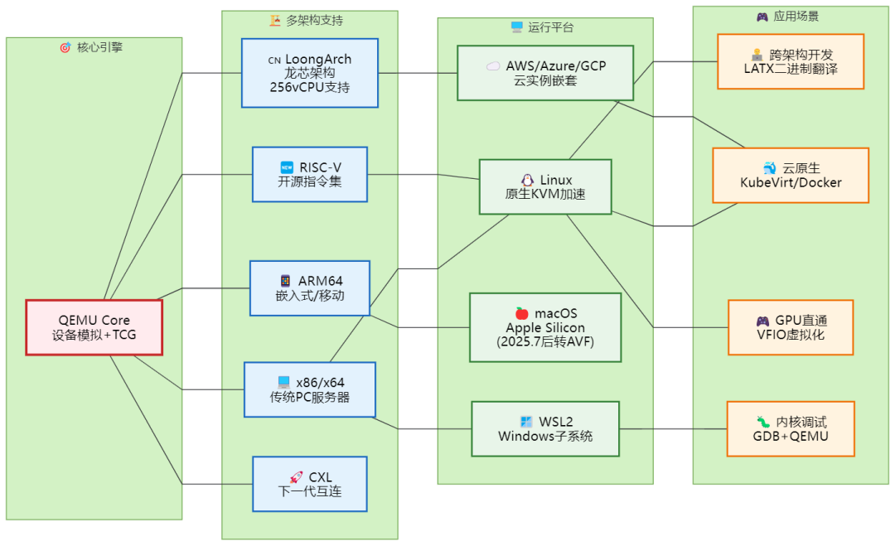
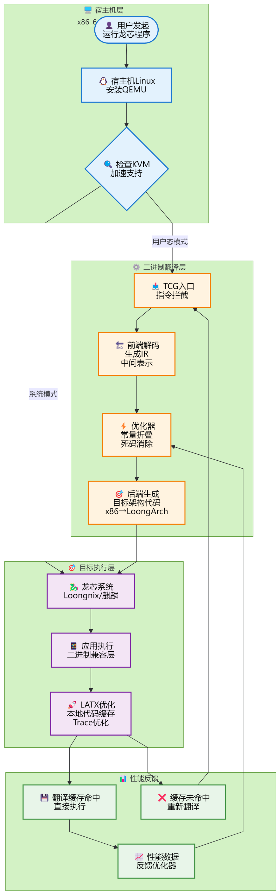

恭  
喜  
发  
财  
  
开篇：一个让全团队崩溃的周一早晨凌晨2点，你终于在本机调试好了那个复杂的微服务架构。兴冲冲地打包发给运维，结果对方回复："你这x86的镜像，怎么跑在我们ARM服务器上？"或者更惨：你花了3天在Windows WSL里配好的开发环境，迁移到同事Mac M2上，全盘崩溃。如果你还在用传统虚拟机方案，2025年的这些坑，你大概已经踩过不止一次。但有一批"极客老司机"，早就偷偷切到了QEMU——这个开源界的"变形金刚"，最近刚刚发布了史诗级更新。今天，基于我们梳理的300+篇技术文档、官方Release、CVE安全报告和一线实战案例，给你讲讲2025年的QEMU到底强到什么程度。  

PART 01

  
别再把QEMU当"备用选项"了，它早已是基础设施的"隐形冠军"  
  
很多人以为QEMU只是个"能跑其他架构程序的模拟器"，那是极大的误解。现在的QEMU早已进化为"全栈虚拟化引擎"：

  * 底层：直接对话硬件的KVM加速（性能损耗<5%）

  * 中层：支持x86/ARM/RISC-V/龙芯LoongArch等全架构

  * 上层：无缝接入Docker、Kubernetes、OpenStack

用个不恰当的比喻：如果说VMware是精装公寓（拎包入住但定制性差），那QEMU就是带有全套建筑图纸的别墅——你想怎么改就怎么改。2025年的关键数据：

  * 龙芯LoongArch架构从QEMU 7.1的基础支持，进化到9.1版本的256 vCPU KVM加速

  * 新增CXL内存扩展设备仿真（下一代数据中心关键技术）

  * Docker官方开始原生支持QEMU运行Windows容器（虽然7月后macOS改用Apple虚拟化，但Linux生态更完善了）

  

PART 02

  
年必须知道的三大"黑科技"场景  
  
🚀 场景一：一机多芯，程序员的"架构任意门"还在为跨平台编译发愁？QEMU的用户态模拟（User-mode）已经强到离谱：实战案例：在Mac M2或普通x86笔记本上，直接跑龙芯LoongArch的银河麒麟系统，还能满速编译。技术原理：

  * LATX二进制翻译器（基于QEMU 6深度优化）让x86应用在龙芯上性能提升300%+

  * 反向也成立：在x86上模拟龙芯环境测试国产软件兼容性

 *这意味着什么？* 国产芯片开发者不再需要昂贵的实体开发板，一台笔记本就能搞定全架构测试。🐳 场景二：Docker里跑Windows？云原生的"俄罗斯套娃"最近社区爆火的项目Dockur/windows，就是利用QEMU在Docker容器内运行完整Windows系统。为什么这很酷？

  * 以前的Windows容器是"阉割版"，很多系统级API不支持

  * 现在可以在Linux服务器上，用Docker Compose一键拉起带图形界面的Windows 11，还能GPU直通跑CUDA任务

企业级玩法：

  * KubeVirt：在Kubernetes集群里调度VM，实现"虚拟机容器化"统一管理

  * CI/CD流水线：用QEMU启动不同架构的虚拟机做交叉编译测试，跑完即销毁，成本极低

⚡ 场景三：热迁移"零感知"，运维的"乾坤大挪移"2025年的QEMU热迁移（Live Migration）已经成熟到生产环境标配：

  * 内存预拷贝：业务不中断，把运行中的虚拟机从物理机A搬到B

  * 存储热迁移：配合Ceph等分布式存储，连磁盘都能在线迁移

  * 龙芯平台：已经支持基于KVM的虚拟机热迁移，国产服务器也能玩高端运维

  

PART 03

  
黄金三角工作流：KVM + QEMU + Libvirt  
  
如果你现在还在手动敲\`qemu-system-x86\_64\`命令，那就像在用算盘写代码——能跑，但太痛苦。2025年的标准打开方式是"黄金三角"：

  *   *   *   *   *   *   *   *   *   *   *   *   *   * 

    
    
    ┌─────────────┐│   Libvirt   │  ← 统一管理层（Python/Go API）│   ( virsh ) │    自动处理网络/存储/权限└──────┬──────┘│┌──────▼──────┐│    QEMU     │  ← 设备模拟专家│  ( 用户态 ) │    显卡/USB/磁盘仿真└──────┬──────┘│┌──────▼──────┐│     KVM     │  ← 硬件加速引擎│  ( 内核态 ) │    CPU/内存虚拟化└─────────────┘

实战配置示例（性能优化版）：<domain type='kvm'> <cpu mode='host-passthrough'/> <\!-- CPU直通，性能提升30% --> <memoryBacking> <hugepages/> <\!-- 大页内存，减少TLB miss --> </memoryBacking> <devices> <interface type='network'> <model type='virtio'/> <\!-- VirtIO半虚拟化网卡 --> </interface> <disk type='file' device='disk'> <driver name='qemu' type='qcow2' cache='none' io='native'/> </disk> </devices></domain>关键优化点：

  1. VirtIO驱动：半虚拟化设备比模拟设备快5-10倍
  2. host-passthrough：CPU特性直接透传，适合嵌套虚拟化（在虚拟机里再跑KVM）
  3. qcow2格式：支持快照、压缩、加密，比raw格式更适合生产环境

  

PART 04

  
避坑指南：2025年你必须警惕的安全与性能陷阱  
  
⚠️ 安全警报：这些CVE漏洞你修复了吗？根据阿里云和Nessus的漏洞库数据，2024-2025年QEMU高危漏洞主要集中在：

  * CVE-2024-3446/3447：DMA重入导致的双重释放（影响8.0-8.2版本）

  * CVE-2025-11234：virtio-gpu越界写入（可能导致宿主机逃逸）

修复建议：

  * 生产环境务必升级到 QEMU 9.0+ 或发行版最新补丁

  * 启用sVirt/SELinux，限制虚拟机对宿主机的访问权限

  * 禁用不必要的设备（如USB重定向、未使用的显卡）

🐢 性能陷阱：为什么你的虚拟机这么卡？Top 3 翻车现场：

  1. 没有开启KVM加速（纯TCG模拟，性能下降90%）

  * 检查：\`lsmod | grep kvm\`，没输出就是没开

  1. 磁盘I/O用了IDE而不是VirtIO

  * IDE模拟的是老硬盘，VirtIO才是SSD速度

  1. 网络用了默认的User模式

  * User模式NAT性能极差，生产环境必须配置桥接模式或SR-IOV直通

  

PART 05

  
未来已来：QEMU的下一个战场  
  
基于学术文献和官方路线图，2025-2026年QEMU的进化方向：1\. CXL（Compute Express Link）内存池化

  * 新一代数据中心技术，支持内存热插拔和池化共享

  * QEMU 9.x已加入CXL设备仿真，开发者现在就能在笔记本上模拟未来数据中心的内存架构

2\. RISC-V的爆发

  * 从嵌入式到服务器级，QEMU对RISC-V的向量指令（Vector）支持日趋完善

  * 学术圈已用QEMU进行RISC-V向量化卷积的自动调优研究

3\. 机密计算（Confidential Computing）

  * AMD SEV、Intel TDX的QEMU支持持续增强

  * 未来可以在加密内存中运行虚拟机，连宿主机管理员都看不到数据

  

PART 06

  
结语：虚拟化的本质，是打破物理边界的想象力  
  
从2003年Fabrice Bellard最初写下那行代码，到今天支撑起AWS、阿里云的底层基础设施，QEMU证明了开源的力量。2025年的QEMU早已不是"退而求其次"的选择，而是：

  * 国产芯片（龙芯）开发的首选平台

  * 云原生时代的瑞士军刀

  * 跨架构开发的标准桥梁

如果你还在用收费虚拟化软件，或者用物理机硬刚不同架构的兼容性测试，也许是时候拥抱这个"自由且强大"的工具了。毕竟，在算力即生产力的今天，能让一台机器变成任意形态的能力，就是最大的竞争力。💬 互动时间：你在使用QEMU过程中踩过最大的坑是什么？是显卡直通的Code 43错误，还是热迁移时的网络中断？\#虚拟化 \#QEMU \#KVM \#龙芯 \#云原生 \#技术架构 \#开源