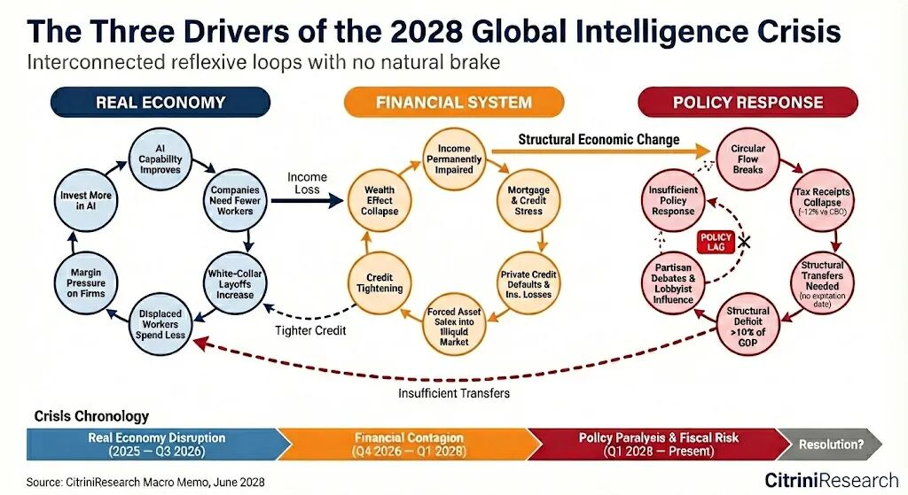
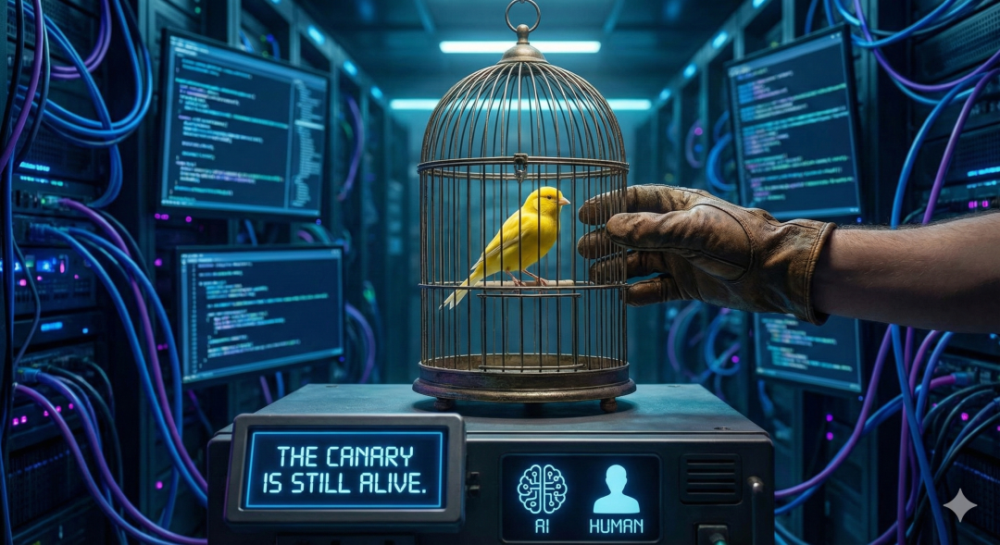

原文在这里：https://www.citriniresearch.com/p/2028gic昨天 X 上 timeline 疯狂刷新的一篇文章，早上花了一个多小时看了下原文，感觉有点《赛博朋克2077》的末日论，但不少观点个人认为是有趣和道理的，而且讲的还挺细节。

## 一、文章的主要观点

> What follows is a scenario, not a prediction.
> 
> THE 2028 GLOBAL INTELLIGENCE CRISIS

文章首先强调了这并不是一份真实的未来报告，而是一篇**以“2028年未来视角”书写的思维实验（Thought Exercise）** 。它模拟了当 AI 变得过于强大且廉价时，全球经济可能面临的极端“左尾风险”。另外文章中提到的更多经济的背景是全球、老美、纳斯达克，不直接涉及东大的情况讨论。核心观点摘要如下：1\. 核心矛盾：效率极度提高，经济却在萎缩。AI 在各行各业超预期地普及，导致生产力大幅提升，但这种进步却成了经济的毒药。文章提出了一“幽灵 GDP”（Ghost GDP）的概念： 产出在国家账面上增加，但资金不再流向真实经济。机器不消费，人类消费经济开始枯竭。

### 2\. 连锁反应从软件到所有中介行业：

  * ### 企业发现可以自己用 AI 写软件，不再续约昂贵的 SaaS（如ServiceNow或Zendesk），导致软件公司大规模裁员；

  * ### AI 代理（Agents）全天候自动寻找最优价格，摧毁了依靠“人类懒惰”和“信息差”获利的行业，如旅游平台（携\*还能杀熟否？）；

###   

### 3\. 劳动力市场的“位移螺旋”：失业的白领进入服务业/零工经济导致蓝领工资也被拉低，企业为了生存进一步依赖 AI 削减成本；

###   

### 4\. 金融系统风险：美国 13 万亿的抵押贷款市场是建立在“借款人有稳定白领收入”的假设上的。当这一群体失去收入，即便他们信用分再高，房贷系统也会面临系统性违约风险；

###   

### 5\. 政策与社会的无力感

  * ### 政府由于收不到个人所得税（人类工资少了），财政收入锐减，难以维持福利支出；

  * ### 社会冲突加剧，出现了针对 AI 实验室（如

OpenAI和Anthropic）的抗议活动（Occupy Silicon Valley）。

## 二、还有什么有意思的？

> The unemployment rate printed 10.2% this morning, a 0.3% upside surprise. The market sold off 2% on the number, bringing the cumulative drawdown in the S&amp;P to 38% from its October 2026 highs
> 
> THE 2028 GLOBAL INTELLIGENCE CRISIS

第一反应是 0.3% 好像也没多少，果然还是太无知了，问了一下 gemini，给出的回答是：

在金融市场中，**“预期”比“事实”更重要** 。0.3% 的偏差在失业率数据中是非常巨大的（通常偏差 0.1% 就会引发震荡）。这反映出：

  * **AI 的替代速度超过了政策制定者和分析师的预测模型；**

  * 市场原本寄希望于“软着陆”，但这一数据打破了幻想，证实了经济正在进入严重的衰退阶段。

* * *

  

> When cracks began appearing in the consumer economy, economic pundits popularized the phrase “Ghost GDP“: output that shows up in the national accounts but never circulates through the real economy.
> 
> THE 2028 GLOBAL INTELLIGENCE CRISIS

“幽灵 GDP”（Ghost GDP）的逻辑为什么 **AI 导致的生产力大爆发，反而可能引发经济大萧条** 。

### 1\. 产出与消费“脱钩” 在传统经济中，GDP 的增长通常伴随着人类活动的增加：

  * **传统逻辑：** 企业多生产 100 台电脑 -> 雇佣更多工人/给工人加薪 -> 工人拿钱去买面包、付房租 -> 资金进入循环；

  * **AI 逻辑（幽灵 GDP）：** 企业利用 AI 代理（Agents）提升了 50% 的产出，但由于 AI 不需要拿工资、不喝咖啡、不买房，这部分增加的“产出价值”变成了**纯粹的账面数字或企业利润；****  
**

  * **结果：** GDP 数字在涨，但因为没有人类参与消费，这些财富像“幽灵”一样停留在企业的服务器和银行账户里，无法进入真实经济循环。

> 为什么要假定机器就不能消费呢？这是我们碳基生物的优越感么。兴许硅基生物也能实现经济的内循环？
> 
> 小生说大生讲

2\. 货币流速停滞：文中提到，北达科他州一个 GPU 集群所产生的产出，相当于之前曼哈顿中城 10,000 名白领的产出。原本这 10,000 人的工资会在餐厅、超市、房市中循环几十次；现在，这笔钱直接变成了企业的资本支出（买更多 GPU）。资金从“高流速”的人类手中，流向了“低流速”的资本积累中。钱“死”在了闭环里；

### 3\. 当 AI 可以胜任绝大多数白领工作时，人类失去了议价权。即便总产出（GDP）在增加，但分配给“人”的那份越来越少。如果没有足够的“人收入”，就没有足够的“人消费”来支撑现有的商业体系；

### 4\. 大多数国家的税收支柱是个人所得税和**工资税** 。当 AI 取代人类，政府发现账面 GDP 很高，但收不到税了；

> 感觉这是最不成问题的一个点了？当全球都是 AI 的时候，技术外逃又能逃到哪里去？再者钱在权面前是一个不成正比的较量
> 
> 小生说大声讲

* * *

  

> We had overestimated the value of “human relationships”. Turns out that a lot of what people called relationships was simply friction with a friendly face.
> 
> THE 2028 GLOBAL INTELLIGENCE CRISIS

熟人关系、人情味不再重要1\. “人情味”其实是“信息不对称”的包装，在很多传统行业（如房地产中介、保险经纪、理财顾问），我们认为自己是在为“信任”和“关系”买单。但文章认为，这种所谓的“关系”本质上是因为**过程太复杂、信息太乱** ，你需要一个“带有笑脸的人”来帮你处理这些麻烦（即文中的 **Friction/摩擦** ）,或者是为了人自身的惰性买单（比如不愿意货比三家）；2\. AI Agent 会最大化 ROI：Agents removed friction。AI Agent 是没有“品牌忠诚度”的，它不看脸，只看**价格（Price）**和** 匹配度（Fit）。所谓的“关系价值”在绝对的“效率优势”面前迅速归零。一旦 AI 抹平了信息差和操作难度（Friction），人们对人类中介（平台）的依赖会快速崩塌；**

* * *

  

> while blue-collar openings remained relatively stable \(construction, healthcare, trades\)
> 
> THE 2028 GLOBAL INTELLIGENCE CRISIS

产生的“智能”变成了廉价的商品（Commodity），而蓝领提供的“服务”依然是稀缺的刚需参考莫拉维克悖论 \(Moravec's Paradox\)，对人类来说很难的“高级”推理（如编程、财务分析、法律检索），对 AI 来说其实很容易；但对人类来说很简单的“低级”感知和运动技能（如在复杂的建筑工地搬砖、给病人翻身、修理漏水的水管），对 AI 来说极其困难。

白领的工作环境是“数字”的，文件、代码、邮件都是结构化的数据，AI 处理起来几乎没有阻力（Friction 为零）。

**蓝领工作的复杂性：**

    * **建筑业（Construction）：** 每一个工地的情况都不同，天气、地形、材料的微小差异都需要人类灵活处理。

    * **医疗护理（Healthcare）：** 照顾病人涉及复杂的情感交流和精细的体力操作。

    * **技工（Trades）：** 电工、木工、水管工需要进入各种千奇百怪的物理

    * 空间解决问题。

不过也如文章中所提到的，失业的白领进入服务业/零工经济导致蓝领工资也将被拉低。

* * *

  

> NVDA was still posting record revenues. TSM was still running at 95%+ utilization. The hyperscalers were still spending $150-200 billion per quarter on data center capex.
> 
> THE 2028 GLOBAL INTELLIGENCE CRISIS

英伟达和台积电会持续爆涨么“卖铲子的人”无法在荒废的矿堆上永远繁荣。AI 说的：当 2028 年的“智能危机”爆发，失业率升至 10.2%，人类消费经济萎缩时，市场会意识到：即便 AI 芯片卖得再好，如果终端消费者（人类）没钱买东西了，那么整个社会的经济总量（GDP）就是在萎缩。在这种极度悲观的宏观环境下，**估值倍数（PE Multiple）会发生剧烈杀跌** ，抵消掉营收的增长。

* * *

  

> For the entirety of modern economic history, human intelligence has been the scarce input.
> 
> THE 2028 GLOBAL INTELLIGENCE CRISIS

人类智慧还会绝对稀缺，不可复制么作者直接给出了答案”We are now experiencing the unwind of that premium. Machine intelligence is now a competent and rapidly improving substitute for human intelligence across a growing range of tasks.”这种稀缺性的可替代性变强了，“溢价”正在变低。企业发现，不需要支付那么高的薪水去买人类的脑力，用 AI 同样能搞定.以前要 1000 个人的智慧，就得雇 1000 个人；现在，你只需要增加算力（GPU 簇），就可以瞬间复制出等同于 1000 人的分析和决策能力。想到了国内经常说的一句话：我们正处于一个**几百年未有之大变局** 的时代。

* * *

三、The canary is still alive

原文章以  *"**The canary is still a* *live." 结束，可能是不想那么悲观？但我也会认为过度悲观，Duck 不必。文章的叙事虽然有很多有趣的观点，但整体还是叙事，也不是经济预测， 当“科幻小说”看看就好了。*

 *现实总是有很多不确定性，比如还是以 AI 为例，当城里的经理、工程师在春节回到村里，当起 了翠花、阿牛，还有人谈 AI 么？*

 *又比如和朋友的日常交流，还能了解到大量的公司对 AI 使用还是不确定的、不信任的，甚至是抵制的？（ 正如如果 ToB 软件都像 OpenClaw 一升级就挂一大片那样，这世界不得完蛋？）*

 *又比如你能否确认原文章在贩卖焦虑是不是为了拉动某只股票，或者更好的 sales 他们的 token 呢？*

又正如文章中所提到 Humans are still in the loop, **coordinating at the highest level or directing for taste**. 人类的协调能力、审美、品味在 AI 时代更显重要。

 **The canary is still alive. 你怎么看？**

 **\#AI \#OpenClaw \#VibeCoding \#人工智能**