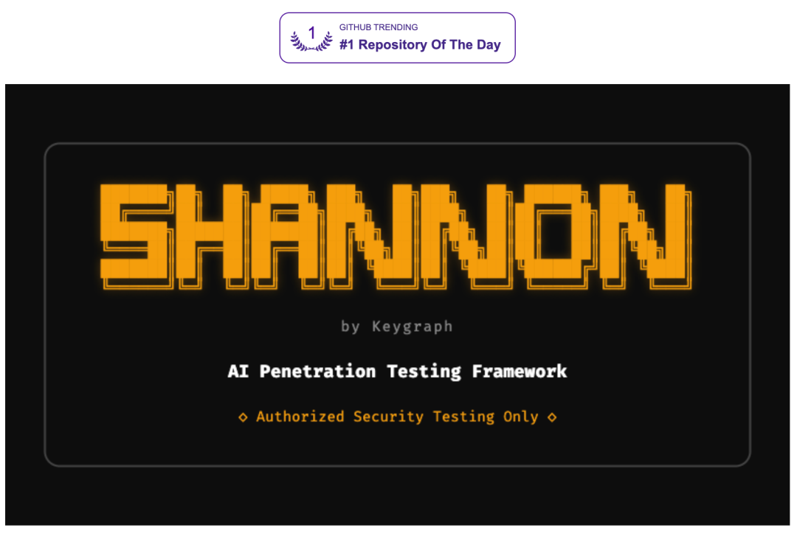

# AI 渗透测试进入"全自动"时代：我发现了一个叫 Shannon 的开源安全工具

> 原文链接：[AI 渗透测试进入"全自动"时代：我发现了一个叫 Shannon 的开源安全工具](https://mp.weixin.qq.com/s?__biz=MzE5ODA1NTAwNQ==&mid=2247485220&idx=1&sn=9f454b51c0b81849026e300a3c969f8f&chksm=979fc46cda2897f6746afcf95defc6a13b2bb69c20906c0b53301fa42074c9bed2b963b5b50b&mpshare=1&scene=1&srcid=0211QK6AY1D7kb7ZbtYL7Jne&sharer_shareinfo=a4aa30b27ee031c0cd2a086a0caf1bd4&sharer_shareinfo_first=a4aa30b27ee031c0cd2a086a0caf1bd4#rd)

&nbsp;

做安全的人大概都有这个感受：市面上的扫描工具，不管叫什么名字，最后交给你的报告，都是一长串"可能存在的漏洞"。

关键词是"可能"。

你得自己去验证，去复现，去确认哪些是真的能打进去的，哪些只是工具的误判。一份报告几十条告警，真正有威胁的可能就三五条，但你得把每一条都过一遍。这个验证过程，有时候比写代码还累。

最近在 GitHub 上翻到一个项目，叫 Shannon，做的事情挺直接的——它不只是告诉你"这里可能有洞"，而是自己去打一遍，打得进去才写报告。

我去看了它的 README、示例报告、架构设计，越翻越觉得这个思路值得聊聊。

## 先说它到底是什么

Shannon 是一个&nbsp;**AI 驱动的全自动渗透测试工具**，由 Keygraph 团队开源（Lite 版本基于 AGPL-3.0 协议）。底层用的是 Anthropic 的 Claude Agent SDK 做推理引擎，通过多个 AI Agent 协同工作，对 Web 应用做从侦察到攻击验证的完整安全评估。

它跟传统 SAST（静态分析）和 DAST（动态扫描）工具的区别在于一个核心原则：

**No Exploit, No Report**——没有成功利用的漏洞，不会出现在报告里。

这句话的含金量，做过安全审计的人应该能体会。它意味着你拿到的每一条结果，都是经过实际攻击验证的，不是猜测，不是推断。## 它怎么工作的

Shannon 的整个流程分四个阶段，每个阶段干的事情都比较清楚：

**第一阶段：侦察。**&nbsp;分析你给它的源代码，同时用 Nmap、Subfinder、WhatWeb 这些工具去探测目标的基础设施。还会通过浏览器自动化去点、去翻、去摸整个应用的攻击面——端点、API、认证机制，挨个映射出来。

**第二阶段：漏洞分析。**&nbsp;这一步是多个专用 Agent 并行工作，每个 Agent 盯一个 OWASP 漏洞类别。它会做数据流分析，追踪用户输入到危险汇聚点的路径，输出"假设性可利用路径"。

**第三阶段：利用验证。**&nbsp;这是 Shannon 最核心的环节。上一步的假设，在这里必须通过实际攻击来验证——用浏览器自动化或者命令行工具，真的去打目标应用。打不进去的，直接丢掉。

**第四阶段：报告生成。**&nbsp;把所有经过验证的漏洞整理成报告，附带可复现的 PoC（概念验证），格式和内容接近专业渗透测试人员的交付物。

说白了，它把安全工程师手动做的"发现→验证→出报告"这套流程，用多 Agent 架构自动化了。## 一个比较有意思的设计：白盒 + 黑盒混合

传统工具基本是二选一，要么看代码（白盒），要么打应用（黑盒）。Shannon 两个都要。

它要求你同时提供应用的源代码和一个可以访问的运行实例。源代码用来做精准的数据流分析，运行实例用来做真实的攻击验证。两条线的结果交叉印证，这样既能找到代码层面的深层问题，又能确认这些问题在实际环境中真的可以被利用。

这个思路其实不新鲜，很多安全团队手动做的时候就是这么干的。但能自动化跑起来，还是让人眼前一亮。## 实测数据值得一看

Shannon 在 XBOW 基准测试上拿到了&nbsp;**96.15% 的成功率**（无提示、源代码感知模式）。

项目仓库里还放了三份示例报告，跑的都是安全领域常用的练兵靶场：•&nbsp;**OWASP Juice Shop**：发现 20+ 高危漏洞，包括完整的认证绕过和通过注入攻击实现的数据库泄露。•&nbsp;**c{api}tal API**：识别出 15 个严重/高危漏洞，涵盖通过黑名单绕过实现的根级注入、遗留端点导致的认证绕过、以及通过批量赋值实现的权限提升。•&nbsp;**OWASP crAPI**：15+ 个漏洞，包括 JWT 算法混淆、alg:none 攻击、kid 注入，还通过注入攻击拿下了数据库。

这三个靶场在安全圈里都是公认的标准测试目标，拿它们当验证对象是说服力比较强的。## 用起来不复杂

部署方面，Shannon 用 Docker 容器化，安装过程比较直接：

  `git&nbsp;clone&nbsp;https://github.com/KeygraphHQ/shannon.git
cd&nbsp;shannon
export&nbsp;ANTHROPIC_API_KEY="your-key"
./shannon start URL=https://your-app.com REPO=repo-name`

配置用 YAML 文件，放在&nbsp;`./configs/`&nbsp;目录下。认证流程可以自定义，支持 2FA/TOTP，甚至 Google 登录这种复杂认证也能处理。你还可以设置规则，告诉它哪些路径不要碰（比如&nbsp;`/logout`），哪些路径重点测（比如&nbsp;`/api`）。

日常管理也就几个命令：

  `./shannon logs &nbsp; &nbsp; &nbsp; &nbsp; &nbsp;# 看实时日志
./shannon query ID=xxx &nbsp;# 查进度
./shannon stop &nbsp; &nbsp; &nbsp; &nbsp; &nbsp;# 停掉容器`

工作流引擎用的是 Temporal，有自带的 Web UI 可以看任务状态，这点对运维比较友好。## 当然，也有它的边界

说几个需要注意的地方。

它目前只支持白盒模式，也就是说你必须有目标应用的源代码。纯黑盒场景用不了。对于安全研究人员来说这可能不是什么问题，但如果你想测第三方应用，就得另想办法。

另外，Shannon 底层依赖 Claude API，这意味着每次运行都会产生 API 调用费用。虽然项目也实验性地支持通过 OpenRouter 走 GPT 或 Gemini，但官方说了"不稳定，不官方支持"。

还有一点，OWASP 漏洞类别目前没有全覆盖，主要集中在注入、XSS、SSRF、认证/授权绕过这几类。更多类别还在开发中。

这些不是什么致命问题，但得知道。## 两个版本的区别

Shannon LiteShannon Pro许可证AGPL-3.0（开源）商业许可适合谁安全团队、独立研究人员企业级用户核心差异社区版功能更深度的 LLM 数据流分析

Lite 版本开源可用，对于大多数安全研究和学习场景来说够了。Pro 版本面向需要更高级代码分析能力的企业客户。## 为什么我觉得这个方向值得关注

安全工具这个领域，其实很长时间没有出现过让人觉得"这思路对了"的东西。大部分工具还停留在"扫一遍给你一堆告警，剩下的你自己搞"的阶段。

Shannon 的思路不一样。它不是在原有的扫描逻辑上套了一层 AI，而是让 AI Agent 去模拟一个真实的渗透测试工程师的工作流程——侦察、分析、攻击、报告，完整走完。

说真的，96.15% 的基准测试成功率、对标准靶场的验证结果、以及"No Exploit, No Report"这个原则，放在一起看，你会觉得 AI 在安全领域的落地，可能比在很多其他领域更实在。

不是替代安全工程师，而是把最耗时间的验证工作自动化了。安全工程师可以把精力放在更需要判断力的地方——风险评估、防御策略、架构改进。

工具和人各做各擅长的事，这大概是 AI 落地最健康的样子。

**项目地址**：https://github.com/KeygraphHQ/shannon

**Stars**：17.5k

**许可证**：AGPL-3.0（Lite 版本）

如果你在做安全相关的工作，或者对 AI Agent 在垂直领域的应用感兴趣，这个项目值得花点时间翻一翻。

&nbsp;

