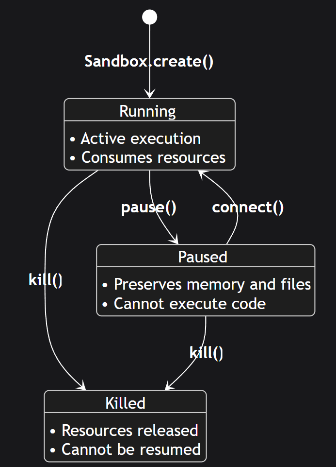

# Agent Infra: sandbox技术和选型

> 原文链接：[Agent Infra: sandbox技术和选型](https://mp.weixin.qq.com/s?__biz=Mzk2NDU1NDcyMA==&mid=2247483672&idx=1&sn=c7ae5a3201bf0315b2063be6a0ddf27b&chksm=c5a554bbf06d24b52418795a25de173996a0622584ac3418b36ec0e732c9c4a5a927234ded3e&mpshare=1&scene=1&srcid=0210A73u5eLXfCvjc7eOItDG&sharer_shareinfo=4f0566e54c9424765a762d76c32bd4e2&sharer_shareinfo_first=4f0566e54c9424765a762d76c32bd4e2#rd)

## 背景: 从Context Engineering 角度出发

在量子力学中，希尔伯特空间内的任何复杂**量子态**，本质上都是一组**正交完备基矢**的线性叠加

在过去我们总是以为，只要给LLM足够多的tools，则agent就更强大，但事实总是事与愿违，工具并非越多越好，过多的工具，会降低使用准确率和浪费宝贵的上下文，也就是&nbsp;**Context Rot；**&nbsp;于是乎，有了一个新的领域：**Context Engineering。**

根据业界领先的context Engineering的经验：•&nbsp;**Cursor 的 "File-based Tools"**： Cursor 采取了一种文档化方案，将工具的“说明书”全部文件化。当 Agent 需要使用某个能力时，它会先通过Retrieval找到对应的文档，阅读后生成代码•&nbsp;**Manus 的 "Context Offloading"**： 在 Manus 的设计中，采用了层级化的工具架构。为了应对复杂的长流程任务，Agent 不再试图把所有中间状态都记在 Context Window 里，而是利用**文件系统**进行 Context Offloading（上下文卸载）。文件系统成为了 Agent 的外挂memory（不同于compact的有损压缩，Offloading是无损的）•&nbsp;**Anthropic 的 "Programming tool-using" 和skills**：由agent自身编写代码实现tool-call相比于直接的tool-call能够节约大量context；同时agent skills本质上也是利用了file-system，对宝贵的context 进行节约的设计

显而易见，**代码执行环境 (Code Execution)**&nbsp;和&nbsp;**可读写的文件系统 (File System)**&nbsp;已经超越了辅助工具的范畴，成为 Agent 组件中必要且不可或缺的部分。

しかし赋予 Agent “写代码”和“改文件”的能力，等同于赋予了它巨大的破坏力。

与传统软件确定的执行路径不同，Agent 的行为是基于概率和上下文动态生成的

意味着：•&nbsp;**Prompt Injection**• Agent 的幻觉导致死循环或资源耗尽

因此，通过为 Agent 划定严格的&nbsp;**安全边界（Sandbox）**——如网络隔离、文件系统隔离、进程隔离，便显得尤为重要。

此外与 Claude Code 这样跑在开发者本地电脑上的 Coding Agent 不同，开发者通常拥有把控风险的能力（虽然在 "YOLO 模式" 下误删文件的事故屡见不鲜）；对于部署在云端的 Agent 服务，这两者存在着信任边界的差异，用户不希望为 Agent 的每一次执行 点击“批准”，**只要 Agent 在sandbox内折腾，它就是安全的**；## 技术实现比较

技术方案核心原理启动速度隔离强度典型适用场景**Local Runtime**OS 原语 (bubblewrap)极快 (ms级)低本地开发、CLI 工具**WASM**字节码沙箱微秒级中简单的纯计算任务**Docker (Standard)**进程级 (Cgroups/NS)快 (s级)中通用任务，需深度加固**gVisor**内核模拟 (Sentry)中 (s级)高多租户、不可信代码执行**MicroVM (Firecracker)**硬件虚拟化 (KVM)极快 (~125ms)极高公有云、高密度 Agent 托管

从技术实现角度，现阶段的Sandbox有以下几种实现方式### Local Sandbox-runtime

其原理利用 Linux 的&nbsp;`namespaces`&nbsp;和&nbsp;`cgroups`&nbsp;或 macOS 的&nbsp;`sandbox-exec`&nbsp;等操作系统原语直接限制进程权限， 如限制对配置路径的读/写访问，通过内置代理路由网络流量。•&nbsp;**优点**：极轻量，无镜像拉取开销，适合用户的本地开发环境。•&nbsp;**缺点**：依赖宿主内核，如果内核存在漏洞，恶意代码可能逃逸。

如 Claude Code 中 执行&nbsp;`/sandbox`

可在&nbsp;****&nbsp;中配置对应的权限：

   `{
&nbsp; "sandbox":&nbsp;{
&nbsp; &nbsp; "enabled":&nbsp;true,
&nbsp; &nbsp; "autoAllowBashIfSandboxed":&nbsp;true,
&nbsp; &nbsp; "excludedCommands":&nbsp;["git",&nbsp;"docker"],
&nbsp; &nbsp; "network":&nbsp;{
&nbsp; &nbsp; &nbsp; "allowUnixSockets":&nbsp;["/var/run/docker.sock"],
&nbsp; &nbsp; &nbsp; "allowLocalBinding":&nbsp;true
&nbsp; &nbsp; }
&nbsp; }
}`

本质上，Claude Code 的&nbsp;**sandbox runtime 是一个 OS 级别的“受限 Bash 运行环境”。**

对 Claude code 发出的 bash 命令及其所有子进程统一施加：•&nbsp;**文件系统隔离**（只允许访问/写入你事先配置的目录）；•&nbsp;**网络隔离**（只允许访问你事先配置的域名/IP，通常通过本地 proxy/过滤实现）

好消息是，Anthropic 将这个sandbox开源了，通过：

`npx @anthropic-ai/sandbox-runtime &lt;command-to-sandbox&gt;`使用，不只只能给CC使用的，也可用于自己的agent项目中，通过MCP的方式配置使用。

具体可见：anthropic-experimental/sandbox-runtime

不过，macOS 的&nbsp;`sandbox-exec`&nbsp; 基本上处于废弃状态，建议谨慎使用。### WebAssembly (WASM)

WASM 最初是为浏览器设计的，天生具有沙箱属性。

WASM 将代码编译成通用的二进制格式（`.wasm`）。Runtime 会像显微镜一样检查每一条指令，确保它只能访问分配给它的那块内存数组。越界访问会被立即掐断。

WASM 的冷启动时间极快， 成本低，适合执行简单逻辑的场景。

但其生态兼容性是最大痛点。虽然 Python 可以编译为 WASM (Pyodide)，但许多依赖 C 扩展的库（如 Pandas, NumPy, Scipy 的某些部分）支持尚不完善，且网络栈受限### Docker

默认的 Docker 是不安全的，在标准 Docker 中，容器只是宿主机上的一个**进程**。

存在容器逃逸的问题： Linux 内核由数千万行代码组成，不可避免地存在 Bug（漏洞）。如果 Agent 发送了一个精心构造的“恶意系统调用”触发了内核漏洞（Kernel Panic 或 提权漏洞），它就能**瞬间逃出容器**，直接控制整台宿主机。

因此必须进行安全加固。

   `docker run \
&nbsp; --cap-drop ALL \
&nbsp; --security-opt no-new-privileges \
&nbsp; --security-opt seccomp=/path/to/seccomp-profile.json \
&nbsp; --read-only \
&nbsp; --tmpfs /tmp:rw,noexec,nosuid,size=100m \
&nbsp; --tmpfs /home/agent:rw,noexec,nosuid,size=500m \
&nbsp; --network none \
&nbsp; --memory 2g \
&nbsp; --cpus 2 \
&nbsp; --pids-limit 100 \
&nbsp; --user 1000:1000 \
&nbsp; -v /path/to/code:/workspace:ro \
&nbsp; -v /var/run/proxy.sock:/var/run/proxy.sock:ro \
&nbsp; agent-image`

关键配置包括移除 Linux capabilities、只读文件系统、禁用网络接口等**选项****目的**`--cap-drop ALL`删除 Linux 功能，如&nbsp;`NET_ADMIN`&nbsp;和&nbsp;`SYS_ADMIN`，这些功能可能导致权限提升`--security-opt no-new-privileges`防止进程通过 setuid 二进制文件获得权限`--security-opt seccomp=...`限制可用的系统调用；Docker 的默认值阻止约 44 个，自定义配置文件可以阻止更多`--read-only`使容器的根文件系统不可变，防止代理持久化更改`--tmpfs /tmp:...`提供一个可写的临时目录，在容器停止时清除`--network none`删除所有网络接口；代理通过下面挂载的 Unix 套接字进行通信`--memory 2g`将内存使用限制为 2GB 以防止资源耗尽`--pids-limit 100`限制进程数以防止 fork 炸弹`--user 1000:1000`以非 root 用户身份运行`-v ...:/workspace:ro`以只读方式挂载代码，以便代理可以分析但不能修改。**避免挂载敏感的主机目录，如 、 或&nbsp;**`-v .../proxy.sock:...`挂载连接到在容器外运行的代理的 Unix 套接字`--userns-remap`将容器 root 映射到非特权主机用户；需要守护程序配置，但限制容器逃逸造成的损害`--ipc private`隔离进程间通信以防止跨容器攻击

（from Claude: Securely deploying AI agents）### gVisor

标准docker容器共享主机内核，这意味着内核漏洞可能允许容器逃逸。

gVisor 通过在用户空间中拦截系统调用来解决这个问题，然后才到达主机内核，实现自己的兼容性层来处理大多数系统调用，而无需涉及真实内核。

简单来说，使用 gVisor，攻击面要小得多，恶意代码首先需要利用 gVisor 的用户空间实现，并且对真实内核的访问有限。不信任容器内的进程，不让它们直接接触真内核。

**流程对比：**•&nbsp;**Docker:**&nbsp;Agent -&gt; Syscall -&gt;&nbsp;**宿主机真内核**•&nbsp;**gVisor:**&nbsp;Agent -&gt; Syscall -&gt;&nbsp;**Sentry (伪内核)**&nbsp;-&gt; (检查并过滤) -&gt; 必要的 Syscall -&gt;&nbsp;**宿主机真内核**

要将 gVisor 与 Docker 一起使用，安装&nbsp;`runsc`&nbsp;运行时并配置守护程序：

   `// /etc/docker/daemon.json
{
&nbsp; "runtimes": {
&nbsp; &nbsp; "runsc": {
&nbsp; &nbsp; &nbsp; "path":&nbsp;"/usr/local/bin/runsc"
&nbsp; &nbsp; }
&nbsp; }
}`

运行容器：

   `docker run --runtime=runsc agent-image`**工作负载****开销**CPU 密集型计算~0%（无系统调用拦截）简单系统调用~2 倍慢文件 I/O 密集型对于繁重的打开/关闭模式，最多慢 10-200 倍

计算密集型任务（如矩阵运算）几乎无损耗，但系统调用密集型任务（如大量小文件读写、网络请求）损耗显著， 对于多租户环境或处理不受信任的内容时，额外的隔离通常值得开销。### MicroVM

MicroVM 其的核心逻辑，是为了解决 Docker 无法解决的根本性矛盾：既要像容器一样快，又要像物理机一样安全。

AWS 在 2018 年开源了 Firecracker，专为 Serverless 和多租户容器设计: 砍掉了传统虚拟机（如 QEMU）中 90% 对 Agent 无用的功能，只保留了 CPU、内存、网络和最基础的块设备， 因而带来了惊人的性能，**约 125 毫秒**的冷启动时间，内存开销不到 5 MiB。

因此成为了目前公有云Sandbox 服务商，如E2B、Modal的底层标准技术。

除了Firecracker以外：• QEMU (Traditional VM)：功能更强但启动慢、内存占用高• Kata Containers：对外暴露 Docker/K8s 的操作接口，但对内它会启动一个轻量级虚拟机（支持调用 QEMU 或 Firecracker）来包裹容器## 如何选择： 分类维度

从工程落地角度，可以在以下几个维度做出权衡。### 自托管 (Self-hosting) vs 云服务 (Managed Provider)

并非所有企业的数据隐私要求都能够接受云托管的sandbox。拥有成熟运维团队的前提下，基于 Hardened Docker、gVisor 或 Kata Containers 自建集群都是不错的选择。

当然，云托管解决了Firecracker 极度复杂的网络配置和资源调度，也让开发者能够将精力放在开发和快速验证上，更何况如E2B之类的sandbox服务商，已是不少agent项目（Manus、Perplexity等）的底层技术的一环。### Long running vs High-frequency (Lifecycle，&nbsp;**persistence)**

现阶段的sandbox的最主要用途，还是 code Interpreter，如执行agent生成的代码、数据分析等。

对于大多数情况下，用完即焚，每次请求启动一个全新环境，任务结束立即销毁。同时通过预装环境的sandbox（常用数据分析库）也可节约响应时间。

在如Agent skills所需要file-system的场景下，持久化则显得很重要。像E2B也支持了一定时间内（30天内）的持久化：

   `from&nbsp;e2b_code_interpreter&nbsp;import&nbsp;Sandbox

sandbox = Sandbox.create()&nbsp; # Starts in Running state

# Pause the sandbox
sandbox.betaPause()&nbsp; # Running → Paused

# Resume the sandbox
sandbox.connect()&nbsp; # Running/Paused → Running

# Kill the sandbox (from any state)
sandbox.kill()&nbsp; # Running/Paused → Killed`

### Serving vs Agentic RL Rollout

不同业务场景下的并发密度和Isolation要求不同。

User-facing Serving： 核心关注点在多租户隔离和响应延迟；因而，Firecracker 或 gVisor成为首选，同时通过Warm Pool预热机制以最大程度降低冷启动延迟。

Training &amp; Data Gen： 这时候考虑的是Throughput和Cost；需要 Agent 在 Sandbox 中并行执行数万次代码，以生成用于 RLVR算法的奖励数据（Rollout）；此时docker已经足够（如 sandbox fusion）### Text-only vs GUI (Computer Use &amp; Browser)

Text-only (Code Interpreter)： 标准的 REPL 环境，仅涉及&nbsp;`stdin/stdout`&nbsp;和文件读写，基于轻量级 Linux 发行版和极低的资源消耗；

GUI / Computer Use (Browser-using)： 需要VNC提供实时截屏于VLM，意味着更大的资源要求，和更复杂的数据传输；常见如`[browserbase](https://www.browserbase.com/)`, steel-browser## 主流 Sandbox 方案汇总

通用sandbox（云服务）• E2B• model sandboxes• daytona• AgentRun• Runloop• cloudflare-sandbox• vercel-sandbox

轻量级（开源）• BoxLite• Microsandbox• anthropic-experimental/sandbox-runtime• agent-infra/sandbox

Browser-using• steel-browser• Browserbase• browser-use-sandbox## 结语

起初OpenAI Code Interpreter 的出现， 需要一个安全的 Sandbox 来执行它生成的 Python 代码，仅仅为了弥补数学计算和逻辑执行的短板。

随后， 随着 Context Engineering 的深入，Manus 和 Anthropic 的实践告诉我们，Sandbox 里的 File System 不再只是存临时文件的地方，它是 Agent 的memory，于是Sandbox 变成了 Agent Skills 和Memory 的载体。

**那么未来？是 Agent Using Sandbox，还是 Agent Inside Sandbox？**## 参考

Beyond permission prompts: making Claude Code more secure and autonomous

Claude Code: Sandboxing

Securely deploying AI agents

smolagents: Secure code execution

Demystifying Agent Sandbox

