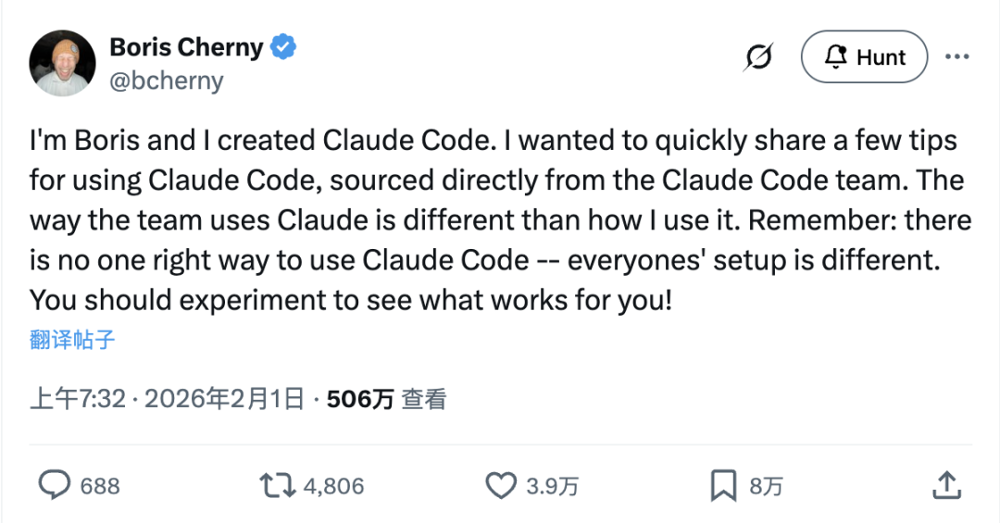
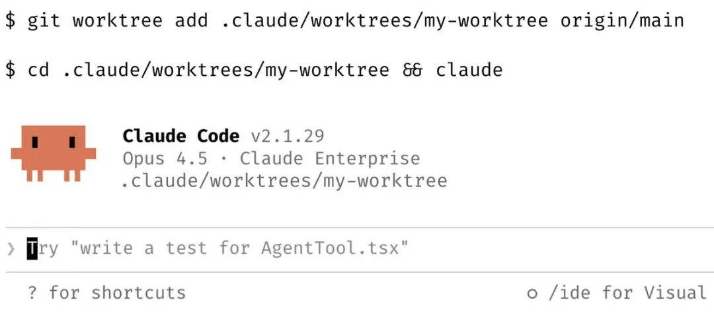
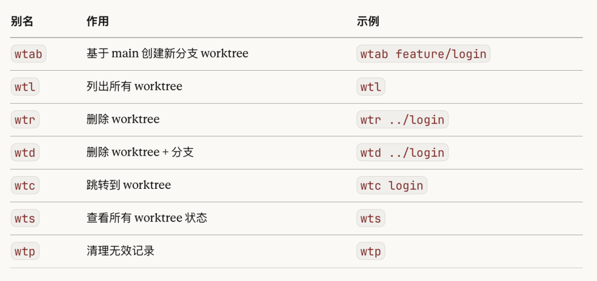
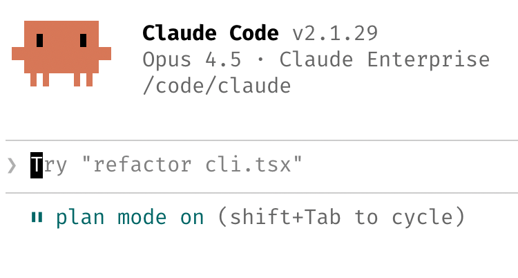
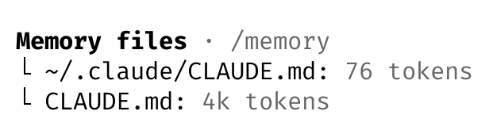
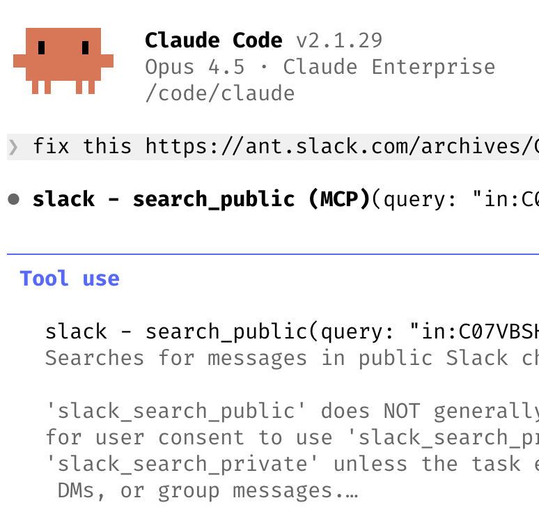
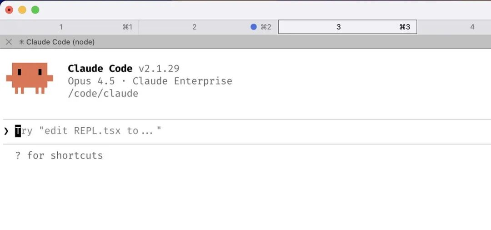
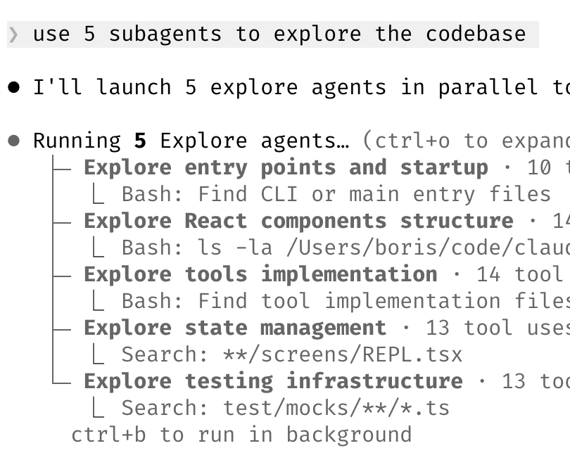

# Claude Code 之父分享 10 大使用技巧

> 原文链接：[Claude Code 之父分享 10 大使用技巧](https://mp.weixin.qq.com/s/qlUkcSPxklsSLBKmJtOZEw?clicktime=1770011443&enterid=1770011443&scene=90&subscene=236&xtrack=1)

Claude Code 的创造者 Boris Cherny 最新发了一串推文，把他和团队内部使用 Claude Code 的技巧全抖出来了。




Boris 说，团队里每个人用 Claude Code 的方式都不一样，**没有所谓「唯一正确」的用法**，关键是自己去试，找到适合自己的节奏。

下面是他分享的 10 条经验：## 1. 并行才是第一生产力


Boris 说这是团队内部**排名第一的提效技巧**：

同时开 3-5 个 git worktree，每个 worktree 跑一个独立的 Claude Code session，并行干活。

他自己用的是多个 git checkout，但团队大多数人更喜欢 worktree，这也是为什么 @amorriscode 专门在 Claude Desktop 里做了原生 worktree 支持。

有人给 worktree 起名字，配好 shell alias（za、zb、zc），一个按键就能跳转。还有人专门搞了一个 "analysis" worktree，只用来读日志和跑 BigQuery 查询。

说到这里，我自己有一批 worktree 的快捷命令，比如&nbsp;`wtl`、`wtp`、`wtn`……




参考：

```
grep ^wt ~/git-worktree.sh
```

有兴趣的可以自己找 AI 帮做一套，或者我下次专门介绍具体使用方式。

而为什么用 alias 而不是用 skill 或者让 Claude Code 自己来呢？

因为这种**确定性的操作，直接执行永远比让 AI 判断更快、更准、更稳定**。

不能想着提交效率，但其实一直在等 Claude Code 的输出，这也是我 Claude Code &gt; Codex 的原因。## 2. 先规划，再动手


Boris 说，**复杂任务一定要先进 plan mode**，把精力花在计划上，让 Claude 一次性把实现写对。

团队里有人的做法是：让一个 Claude 写计划，再开第二个 Claude 以 staff engineer 的身份来 review 这个计划。

还有人说，一旦事情开始跑偏，**立刻切回 plan mode 重新规划，不要硬推**。他们甚至会明确告诉 Claude 在验证步骤时也进入 plan mode，而不只是在构建时才用。

其实我之前的文章：[被喷了……我索性扔出价值过万的 AI 编程 prompt](https://mp.weixin.qq.com/s?__biz=MzA4NzgzMjA4MQ==&mid=2453479329&idx=1&sn=584f87da5b33d50b14d513dd2b781319&scene=21#wechat_redirect)&nbsp;中也有讲到过类似的思路：

我更早之前是写好这个千行级别的文档后，就直接给 AI 了，但事实上因为文档过长，难免其中会有一些矛盾或明显的错误。

这就是人和 AI 相比的劣势了，需要用到 AI 的地方了。

当然，我自己肯定可以校正好，但我可能需要花很长的时间。

所以在真正干活之前，先 @ 这个文件，然后下发指令：

全面阅读和理解 @xx.md 中的需求，指出其中明显的错误、遗漏、矛盾、不完善的地方

然后 AI 就会指出一大堆问题。

我会手动修改，重复这个过程，直到没有问题。

或者只有点无关紧要，AI 吹毛求疵指出的小问题。

然后再让他开干。

plan mode 的本质就是「磨刀不误砍柴工」，**把模糊的想法变成清晰的步骤，Claude 的执行质量会好一个量级**。## 3. CLAUDE.md 是你最重要的资产


Boris 的建议：**每次纠正 Claude 之后，都让它更新 CLAUDE.md**。

告诉它：「Update your CLAUDE.md so you don't make that mistake again.」

Claude 写给自己的规则，**准得吓人**。

然后持续迭代，反复编辑，直到 Claude 的出错率明显下降。

团队里有个工程师，让 Claude 为每个任务/项目维护一个 notes 目录，每次提 PR 之后都更新，再把 CLAUDE.md 指向这些 notes。

我也会经常更新 CLAUDE.md，但为了省 token，**我会让 Claude 自己用精炼、准确的文字来写这个极其重要的记忆文件**。

```
wc -l&nbsp;CLAUDE.md&nbsp;
```

于是原本 400 多行的 CLAUDE.md 就压缩到现在的 80 多行了。

毕竟这东西每次对话都会被加载进 context，写得越臃肿，token 消耗越大，反而影响模型的理解、拖累效率。## 4. 打造自己的 Skills 库


Boris 说团队的原则是：**如果一件事你一天做一次以上，就把它变成 skill 或 slash command。**

团队里的实际案例：

有人做了个&nbsp;`/techdebt`&nbsp;命令，每次 session 结束时跑一遍，专门找重复代码然后干掉。

有人搞了个 slash command，一键同步过去 7 天的 Slack、Google Drive、Asana 和 GitHub 到一个 context dump 里。

还有人造了 analytics-engineer 风格的 Agent，自动写 dbt model、review 代码、在 dev 环境跑测试。

说到这个，**我们团队内部正在打造一套类似的自动化体系**：飞书机器人、GitHub 集成，我们做了很多自动化收集 issue 的工作——AI 自己开 branch、自己开发、自己提 PR、多 Agent cross review、自己跑 test、自己过 CI……

不过说实话，**离全 AI 化还有一点距离**。

如果有兴趣，欢迎加入一起打造，**我们在[招人](https://mp.weixin.qq.com/s?__biz=MzA4NzgzMjA4MQ==&mid=2453479329&idx=1&sn=584f87da5b33d50b14d513dd2b781319&scene=21#wechat_redirect)**。## 5. 让 Claude 自己修 Bug


Boris 说 Claude 能自己修掉大部分 bug，团队的做法是：

开启 Slack MCP，把一个 Slack bug thread 贴给 Claude，然后说一句&nbsp;**"fix"**。零上下文切换。

或者直接说「Go fix the failing CI tests.」不要管它怎么做。

还可以让 Claude 去看 docker logs 来排查分布式系统的问题，Boris 说它在这方面**出人意料地强**。

我自己有个 skill，是**让 Claude Code 知道不同环境对应的 SSH IP**，这样可以让它远程执行命令，在本地完成远程 bug 查找和修复。本地一个终端，远程的事它自己搞定。## 6. 提升你的 Prompt 水平


Boris 给了几个很实用的 prompt 技巧：

**让 Claude 来考你。**&nbsp;告诉它：「Grill me on these changes and don't make a PR until I pass your test.」让 Claude 当你的 reviewer。或者说「Prove to me this works」，让它 diff main 和 feature branch 之间的行为差异。

**逼它重做。**&nbsp;当 Claude 给了个平庸的修复方案，直接说：「Knowing everything you know now, scrap this and implement the elegant solution.」

**写详细的 spec。**&nbsp;交给 Claude 之前，减少歧义，**你写得越具体，输出越好**。

关于 review，我会用 Codex 和 Claude Code 进行**交叉 review**。我会同时打开同一个 worktree 目录里的 Codex，让 Claude Code 和 Codex 同时工作，有时甚至是多个，但要注意可能的 conflict.

Codex 处理一些相对难的或者 Claude Code 没有解决好的任务，以及一些 review 类的工作。

**两个模型互相盯着，漏网的鱼会少很多。**## 7. 终端环境很重要



团队很多人用&nbsp;**Ghostty**，喜欢它的同步渲染、24-bit 颜色和 Unicode 支持。

Boris 建议用&nbsp;`/statusline`&nbsp;自定义状态栏，始终显示 context 用量和当前 git branch。很多人还会给终端 tab 加颜色、起名字，有人用 tmux 管理——一个 tab 对应一个任务/worktree。

还有个意想不到的建议：**用语音输入**。你说话的速度是打字的 3 倍，prompt 的细节程度会大幅提升。macOS 上连按两次 fn 就能启动。

语音输入我倒是一直在用，用的Wispr Flow，可以用我的邀请码：

https://wisprflow.ai/r?JOHN1554

而说到终端，我用了一段时间的 Warp，打算放弃了……

这货虽然该有的都有，有些地方也确实不错，但有时就比较离谱。**正好趁这个机会切 Ghostty 试试**。## 8. 善用 Subagent


Boris 分享了三种 subagent 的用法：

在任何请求后面加上&nbsp;**"use subagents"**，让 Claude 投入更多算力来解决问题。

把单独的小任务分给 subagent，**保持主 Agent 的 context window 干净、聚焦**。

通过 hook 把权限请求路由到 Opus 4.5，让它扫描是否安全，自动批准安全的操作。## 9. 用 Claude 做数据分析


Boris 说他&nbsp;**6 个月没写过一行 SQL 了**。

团队的做法是让 Claude Code 直接调&nbsp;`bq`&nbsp;CLI 来查询和分析指标。他们在代码库里提交了一个 BigQuery skill，整个团队都在 Claude Code 里直接跑分析查询。

这个方法对任何有 CLI、MCP 或 API 的数据库都适用。## 10. 用 Claude 来学习


Boris 还分享了几个用 Claude Code 学习的技巧：

在&nbsp;`/config`&nbsp;里开启&nbsp;**"Explanatory"**&nbsp;或&nbsp;**"Learning"**&nbsp;输出风格，让 Claude 解释每个改动背后的**原因**。

让 Claude 生成**可视化的 HTML 演示**来解释不熟悉的代码——Boris 说它做 slides 做得出奇地好。

让 Claude 画&nbsp;**ASCII 图**来帮你理解新的协议和代码库。

还可以搭一个**间隔重复学习的 skill**：你说出自己的理解，Claude 追问来填补盲区，然后存储结果。## 最后


看完，我想说最好的技巧其实就一句话：**多用多想**。

一旦有好的点子，就让它以某种方式沉淀下来。一旦有重复的工作，就找个办法将其自动化。一旦某件事进入了你每天的 top 5 工作时间，就想一想能否用 Claude Code 来提效。

**凡事先扔给 Claude Code**（或者 Codex，但 Codex 确实稳而慢），不行再自己来。

对了，**我们在招人**，欢迎来聊。


**相关链接：**

Claude Code 官方文档：https://code.claude.com

并行 worktree 使用指南：https://code.claude.com/docs/en/common-workflows[#run]()-parallel-claude-code-sessions-with-git-worktrees

Skills 文档：https://code.claude.com/docs/en/skills[#extend]()-claude-with-skills

终端配置指南：https://code.claude.com/docs/en/terminal-config

Hook 权限配置：https://code.claude.com/docs/en/hooks[#permissionrequest]()

