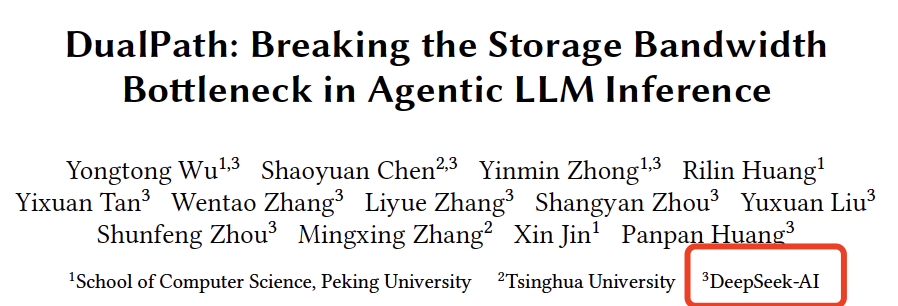
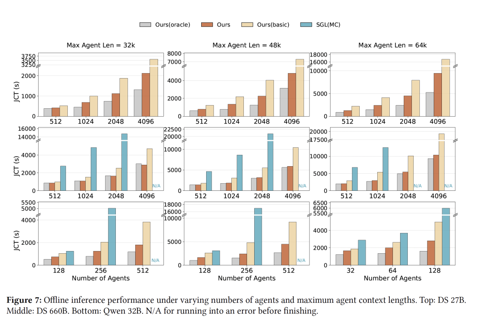
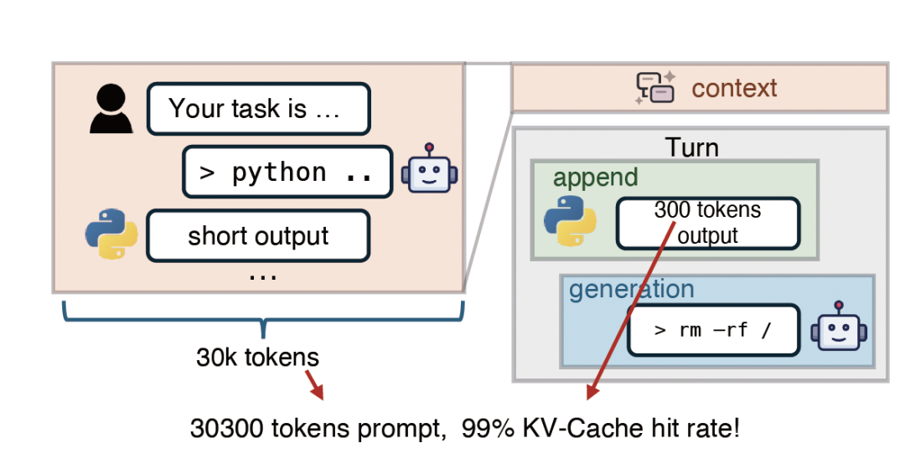
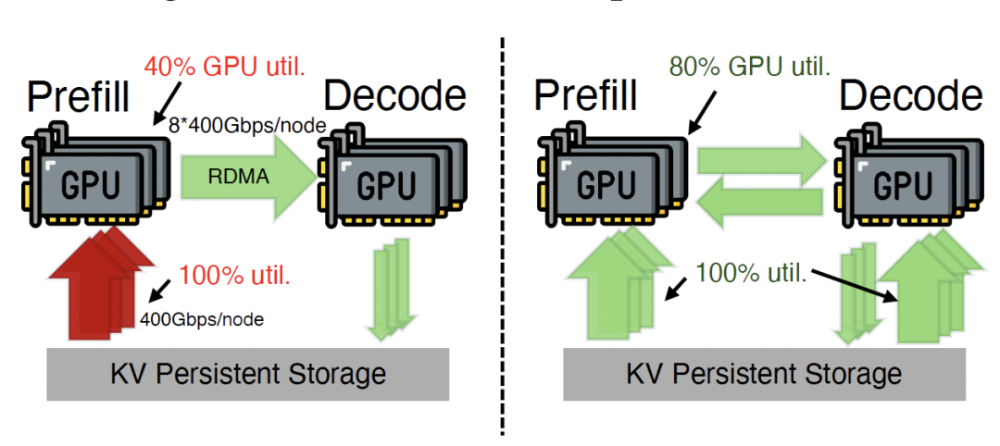
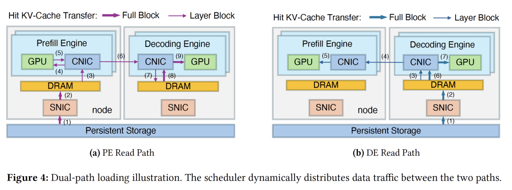
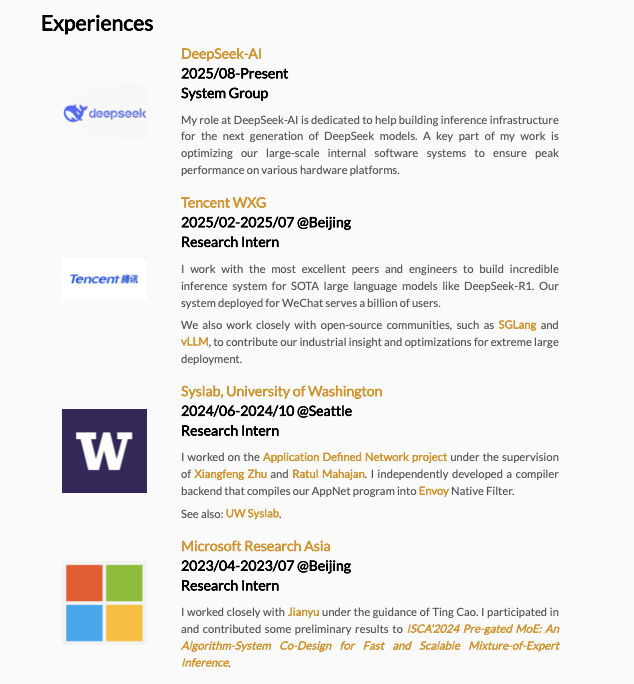
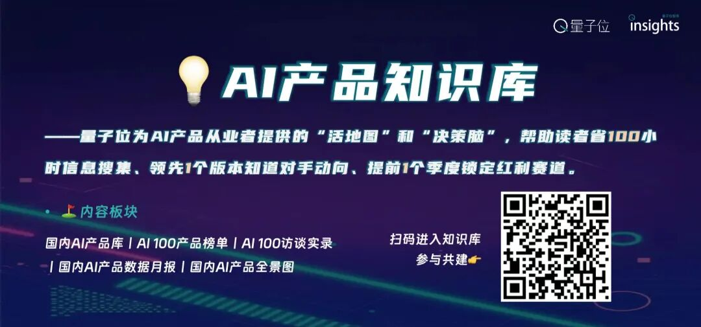

##### henry 发自 凹非寺  
量子位 | 公众号 QbitAI

DeepSeek这小子最精了，当全世界都在盯着他的GitHub仓库，等待V4时——

他和北大、清华在ArXiv悄咪咪地上了一篇论文，发布了一个全新的针对智能体的推理框架：**DualPath** 。

而且就跟前几天曝出的算力话题相关。

DualPath的核心在于解决Agent长文本推理场景下的I/O瓶颈，通过优化从外部存储加载KV-Cache的速度，确保计算资源不被存储读取拖累。

它改变了传统的**存储至预填充引擎（Storage-to-Prefill）** 单路径加载模式，引入了**存储至解码引擎（Storage-to-Decode）** 的第二条路径。

通过利用解码引擎**闲置的存储网卡（SNIC）** 带宽读取缓存，并配合高速计算网络（RDMA）将其传输至预填充引擎，DualPath实现了集群存储带宽的全局池化与动态负载均衡。

在660B规模的生产级模型的实测中，DualPath表现惊人：

离线推理吞吐量提高了**1.87倍** ，在线服务吞吐量平均提升**1.96倍** 。

在高负载下，首字延迟（TTFT）大幅优化，而 Token间的生成速度（TPOT）几乎不受任何干扰。

接下来，我们一起来看。

## 双路径加载 \(Dual-Path Loading\)

总的来说，DualPath是一个专门为智能体系统设计的推理框架，它的核心洞见是——

**KV-Cache的加载不必以预填充为中心** 。

在以往的理解中，谁负责计算谁就去搬数据。但DualPath认为，缓存可以先加载到解码引擎中，再通过高性能RDMA网络传输至预填充引擎。

通过在两条路径间动态选择，DualPath重新分配了网络负载，缓解了预填充侧的带宽压力。

那么，为什么要费这么大劲去“绕路”？

之所以这样做，是因为在当前的智能体应用中，对话轮数多且上下文长，KV-Cache命中率通常高达95%以上。

这意味着，每一轮对话都要搬运海量的“旧记忆”，**推理性能的瓶颈已经从“计算”转移到了“搬运”上** 。

在现有的预填充-解码分离（PD-disaggregated）架构中，所有的加载任务都拥挤在预填充引擎（PE）的存储网卡上，导致带宽瞬间饱和；

与此同时，解码引擎（DE）的存储网卡却在闲置，造成了严重的资源错配。

更进一步的，当前GPU算力的增长远快于网络带宽和HBM容量的增长，也加剧了I/O限制。

正如英伟达首席科学家Bill Dally、谷歌架构师Jeff Dean等大佬反复强调的：**计算是免费的，但数据移动是昂贵的。**

针对这些问题，DualPath构建了创新的双路径模型：

  * 路径 A（传统）：存储→PE，缓存直接读入预填充引擎。

  * 路径 B（新增）：存储→DE→PE，缓存先读入解码引擎的缓冲池，再通过RDMA传输给预填充引擎。

在架构组成上：

  * 推理引擎： 每个引擎管理一块GPU，严格区分为预填充（PE）和解码（DE）。

  * 流量管理器： 负责H2D/D2H拷贝、引擎间传输以及SNIC存储读写。

  * 中央调度器： 担任“大脑”角色，实时决策每一条请求该走哪条路，从而实现全局带宽的最大化利用。

## 核心技术方案：存储至解码路径

如上所述，DualPath推理系统的核心在于打破了传统的“存储至预填充”单路径模式，创新性地引入了**“存储至解码”路径** 。

该设计允许KV-Cache先加载至解码引擎（DE），再通过高带宽计算网络（RDMA）无损传输给预填充引擎（PE）。

通过在两条路径间动态分配负载，系统将集群中原本闲置的解码侧存储网卡（SNIC）带宽彻底释放，构建起一个全局可调度的存储I/O资源池。

具体来说，为了支持层级流式处理，DualPath在PE和DE上均分配了少量DRAM缓冲区（PE/DE Buffer），并针对不同阶段设计了精细的数据流：

  * PE读取路径： 命中Token的KV-Cache从存储读入PE缓冲区。在每层计算前，该层缓存传输至PE HBM，与计算过程重叠执行。计算完成后，全量KV-Cache传回DE缓冲区以形成完整上下文。

  * DE读取路径： KV-Cache直接进入DE缓冲区。在PE预填充期间，对应层的缓存跨节点传输至PE HBM（计算重叠）。计算结束后，PE仅需传回新生成的KV-Cache片段与DE原有缓存合并。

  * 解码与持久化： DE缓冲区接收完整KV-Cache后启动解码，执行H2D拷贝并随后释放CPU内存。虽然引入缓冲增加了DRAM压力，但能显著降低GPU显存占用并优化首字延迟（TTFT）。生成过程中，每累积满一个Block（如 64 Token）即触发异步持久化。

但就像前面提到的，“绕路”加载会带来新问题：比如搬运缓存的流量撞上了模型计算的通信，怎么办？

对此，DualPath给出了两套优化方案：

首先是以计算网卡（CNIC）为中心的流量管理，强制所有流量通过配对的CNIC走GPUDirect RDMA路径。

在InfiniBand或RoCE网络中，利用虚拟层（VL/TC）技术，将推理通信设为“最高优先级”并预留99%带宽，让缓存搬运只能在间隙中“蹭”带宽，确保互不干扰。

其次是自适应请求调度器： 调度器会盯着每个节点的磁盘队列长度和Token数。系统会优先将任务分配给I/O压力较小且计算负载较轻的节点，从根本上避免单侧网卡或单点计算资源的拥塞。

在实验阶段，DualPath在DeepSeek-V3、Qwen等模型上进行了测试，场景覆盖了离线Rollout和在线服务。

如开头所说，在离线推理中，DualPath 将端到端吞吐量提高了高达1.87倍，在线服务吞吐量平均提升1.96倍，显著降低了首字延迟（TTFT），且保持了极其稳定的Token间延迟（TBT）。

总的来说，DualPath 证明了通过重新思考数据加载路径可以有效突破当前大模型推理的I/O墙。

它成功利用了解码引擎原本被浪费的I/O带宽，配合自适应调度和严谨的流量隔离机制，在不增加硬件成本的前提下，大幅提升了智能体LLM推理系统的效率。

## One more thing

这篇论文的第一作者**吴永彤** ，是北京大学的博士生，师从**金鑫** 教授。

他的研究方向聚焦于系统软件与大模型基础设施（LLM Infrastructure），尤其是推理系统的工程优化与规模化部署。

他目前在DeepSeek系统组，参与下一代模型的推理基础设施建设，负责大规模软件系统在多硬件平台上的性能优化。

此前，他还曾在腾讯、华盛顿大学，微软亚研院等机构实习。

 *参考链接* *  
*

*\[1\]https://arxiv.org/pdf/2602.21548* *  
*

*\[2\]https://jokerwyt.github.io/*

— **欢迎AI产品从业者共建** —

  

📚「AI产品知识库」是量子位智库基于长期产品库追踪和用户行为数据推出的飞书知识库，旨在成为AI行业从业者、投资者、研究者的核心信息枢纽与决策支持平台。

  

**一键关注 👇 点亮星标**

**科技前沿进展每日见**