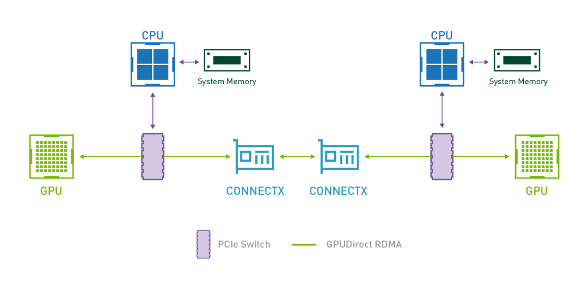
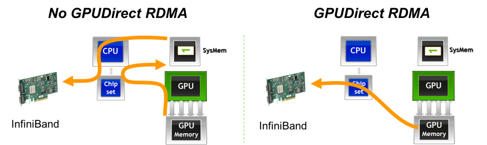
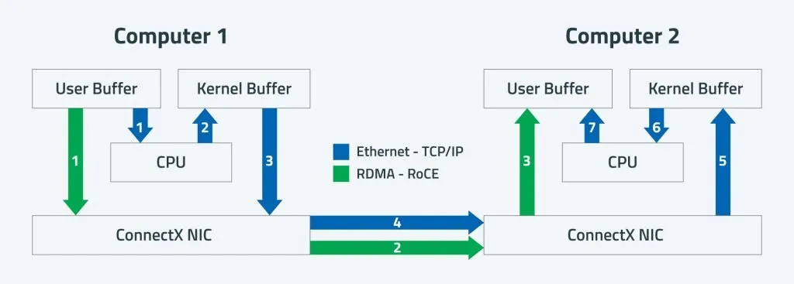

# GPUDirect RDMA技术详解

> 原文链接：[GPUDirect RDMA技术详解](https://mp.weixin.qq.com/s?__biz=Mzk2NDEyMTM1Mg==&mid=2247488686&idx=1&sn=2073b60f777b4d02eab63a6c4e7aa5d4&chksm=c51d559f9a821caefdc078e4e823613373a6ee6c4952b1b6639a446f839f4421c6d4e9286d66&mpshare=1&scene=1&srcid=0211HpP6t3x1tbUM7edDzjN4&sharer_shareinfo=7e2ee7aeea5bad2d1c0c8656c3e955bc&sharer_shareinfo_first=7e2ee7aeea5bad2d1c0c8656c3e955bc#rd)

GPUDirect RDMA（Remote Direct Memory Access）是 NVIDIA 推出的一项高性能计算和数据中心通信优化技术，旨在**绕过 CPU 和系统内存**，实现**GPU 显存与其他设备（如网卡、存储设备或其他 GPU）之间的直接数据传输**。这项技术显著降低了通信延迟、减少了 CPU 开销，并提升了整体系统吞吐能力，广泛应用于 AI 训练、HPC（高性能计算）、分布式存储等场景。

主要内容：1. 技术背景2. GPUDirect RDMA核心原理3. 启用GPUDirect RDMA的条件4. 应用场景5. 性能优势6. 验证与调试7. 局限性与注意事项8. 写在最后## 1. 技术背景

1）在传统的多节点或多设备通信架构中，当 GPU 需要将数据发送到网络（例如通过 InfiniBand 或 RoCE 网卡）时，典型流程如下：`GPU → 主机内存（CPU 内存）`：通过 PCIe 总线拷贝数据。`主机内存 → 网卡`：由 CPU 或 DMA 引擎将数据从内存传送到网卡。`网卡 → 远程节点`：通过高速网络发送。

2）这种“绕道”方式存在以下问题：高延迟：两次内存拷贝（`GPU→Host`，`Host→NIC`）。高 CPU 占用：CPU 需参与或管理数据搬运。带宽瓶颈：受限于主机内存带宽和 PCIe 带宽。

3）为解决这些问题，NVIDIA 联合 Mellanox（现属 NVIDIA）推出了 GPUDirect 技术家族，其中 RDMA 是关键子集。## 2. GPUDirect RDMA核心原理

1）RDMA概念：一种网络技术，允许两台计算机的内存直接读写对方内存，无需操作系统内核和 CPU 干预。常用于 InfiniBand、RoCE（RDMA over Converged Ethernet）等高速网络。

2）GPUDirect RDMA工作原理：GPUDirect RDMA 允许支持 RDMA 的 NIC（网络接口卡）直接访问 GPU 的显存地址空间，数据流向为`GPU 显存 ↔ NIC ↔ 远程节点 GPU 显存`，整个过程无需经过主机内存或 CPU。

3）关键技术点包括：统一虚拟地址空间（UVA）：CUDA 提供统一虚拟寻址，使 GPU 显存地址对系统可见。IOMMU / ATS 支持：确保 NIC 可以安全地通过 PCIe 直接访问 GPU 显存。内核驱动协同：NVIDIA GPU 驱动 + 网卡驱动（如 Mellanox OFED）需协同注册 GPU 显存区域为“可远程访问”。PCIe Peer-to-Peer（P2P）：在单机多 GPU 场景下，也可用于 GPU 间直接通信。## 3. 启用GPUDirect RDMA的条件

组件要求GPUNVIDIA Tesla/Quadro/A100/H100 等专业卡（消费级 GeForce 通常不支持）驱动NVIDIA GPU 驱动 ≥ 某版本（通常 418+），支持&nbsp;`nvidia-peermem`&nbsp;内核模块网卡支持 RDMA 的 Mellanox ConnectX 系列（如 CX-5、CX-6、CX-7）或兼容设备网络协议InfiniBand 或 RoCE v2（需无损网络）操作系统Linux（主流发行版如 RHEL、Ubuntu），Windows 不支持软件栈CUDA ≥ 10.0，Mellanox OFED（MLNX_OFED）或 inbox 驱动

注意：需加载&nbsp;`nvidia-peermem`&nbsp;内核模块，使 RDMA 驱动能“看到”GPU 显存。## 4. 应用场景

1）分布式深度学习训练多节点 GPU 通过 NCCL（NVIDIA Collective Communications Library）利用 GPUDirect RDMA 进行梯度同步。显著提升 AllReduce 等集合通信性能。

2）高性能计算（HPC）MPI 应用（如 OpenMPI、MVAPICH2-GDR）可直接在 GPU 显存间通信。减少 Host 内存拷贝，提升计算效率。

3）高性能存储存储服务器使用 GPU 加速数据处理（如视频转码、AI 推理），通过 GPUDirect Storage（GDS，RDMA 的延伸）直接从 NVMe SSD 读入 GPU 显存。## 5. 性能优势

1）实测数据显示（以 A100 + ConnectX-6 为例）：通信延迟降低 30%~50%CPU 利用率下降 60%+有效带宽接近理论 PCIe/NIC 带宽上限（如 200 Gb/s）

2）例如，在 8 节点 × 8 GPU 的训练集群中，启用 GPUDirect RDMA 可使训练吞吐提升 1.5~2 倍。## 6. &nbsp;验证与调试

1）验证步骤：

  
   
   
   
  `# 检查 nvidia-peermem 是否加载
lsmod |grep nvidia_peermem

# 查看 RDMA 设备是否识别 GPU 内存
ibdev2netdev
rdma link show

# 使用 perftest 工具测试 RDMA 性能（配合 GPU）
ib_write_bw -d mlx5_0 --use-rdma-write
`

2）`NCCL`测试：

  
   
   
   
  `NCCL_DEBUG=INFO NCCL_GPUDIRECT_RDMA=1 mpirun -np16 ./nccl_test_script
`

若日志中出现&nbsp;`Using GPU Direct RDMA`，则表示成功启用。## 7. 局限性与注意事项

1）仅限专业 GPU：GeForce 系列通常禁用该功能。

2）硬件兼容性严格：需 NVIDIA 官方认证的 GPU + NIC 组合。

3）网络要求高：RoCE 需配置 PFC/ECN 等无损机制，否则易丢包。

4）NUMA 拓扑影响性能：GPU 与 NIC 应位于同一 NUMA 节点。## 8. 写在最后

GPUDirect RDMA 是现代 AI 与 HPC 基础设施的关键加速技术，通过打通 GPU 显存与 RDMA 网络之间的“高速公路”，实现了极致的通信效率。在大规模分布式训练、低延迟推理、科学计算等领域具有不可替代的价值。

关于GPUDirect更多的信息可以参见：

[GPUDirect Storage（GDS）技术解析](https://mp.weixin.qq.com/s?__biz=Mzk2NDEyMTM1Mg==&mid=2247488648&idx=1&sn=19ca56a2d3aa8d52f10a7190d3d63fec&scene=21#wechat_redirect)

[GPUDirect P2P技术详解](https://mp.weixin.qq.com/s?__biz=Mzk2NDEyMTM1Mg==&mid=2247488664&idx=1&sn=89f3fa4907b2c504d2a114a12119654a&scene=21#wechat_redirect)

