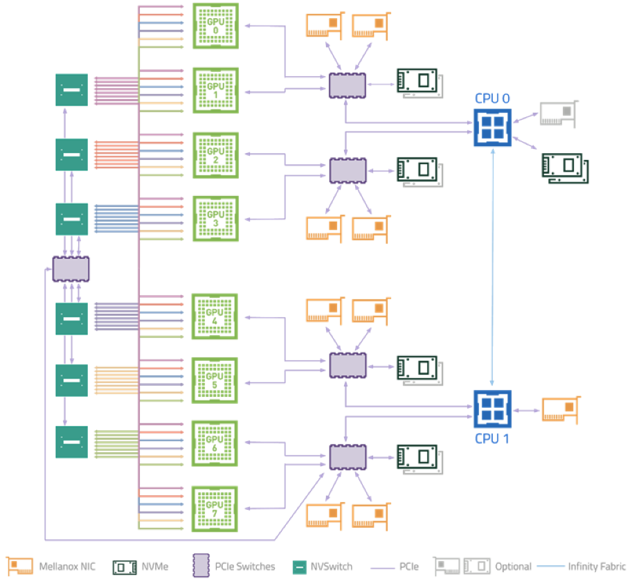
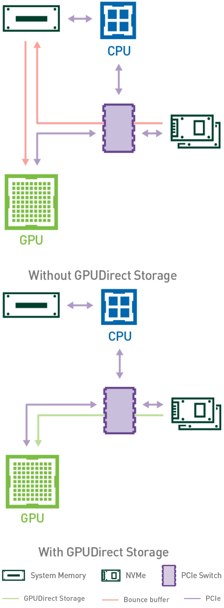

# GPUDirect Storage（GDS）技术解析

> 原文链接：[GPUDirect Storage（GDS）技术解析](https://mp.weixin.qq.com/s?__biz=Mzk2NDEyMTM1Mg==&mid=2247488648&idx=1&sn=19ca56a2d3aa8d52f10a7190d3d63fec&chksm=c52d6b93207f2d24b2060f0cf576e0a1c23319a2f13ed7a46ef798a2d491152f0e5a04286c8e&mpshare=1&scene=1&srcid=021076nHW1g0awXd7WWkkYtS&sharer_shareinfo=c0fa5bf05e8615d6164b0422f3c617c0&sharer_shareinfo_first=c0fa5bf05e8615d6164b0422f3c617c0#rd)

主要内容：1. 概述2. 传统 I/O 的瓶颈3. GDS技术原理4. GDS的核心优势5. 典型应用场景6. GDS 与相关技术协同7. 使用前提与限制8. RTX 4090与RTX 5090官方不支持GDS9. 写在最后## 1. 概述

**GDS（GPUDirect Storage）**&nbsp;是 NVIDIA Magnum IO 技术栈的重要组成部分，属于&nbsp;**GPUDirect 系列技术**（还包括 GPUDirect RDMA、Peer-to-Peer 等）之一。它允许GPU直接从NVMe SSD等存储设备读取数据，或直接将数据写入存储设备，无需经过CPU和系统内存的中转。这极大地提升了数据密集型应用（如AI训练、科学计算、数据分析）的I/O性能。

**核心目标**：绕过 CPU 和系统内存（Host Memory），让 GPU 能直接读写 NVMe SSD、分布式文件系统等存储设备，建立“存储 ↔ GPU 显存”的端到端直通通道。## 2. 传统 I/O 的瓶颈

1）在传统深度学习或 HPC 数据处理流程中，数据加载路径为：`Storage → CPU 内存（Bounce Buffer） → GPU 显存`

2）该路径存在以下问题：多次数据拷贝：数据需先从存储拷贝到 CPU 内存，再由 CPU 拷贝至 GPU。CPU 成为瓶颈：大量 I/O 操作占用 CPU 资源，影响计算任务调度。延迟高、带宽受限：受 PCIe 带宽和内存带宽限制，无法匹配高端 GPU 的吞吐能力（如 H100 显存带宽 &gt; 3 TB/s）。“存储墙”效应：GPU 算力远超存储 I/O 能力，导致 GPU 频繁“饥饿等待”。

据统计，AI 训练中&nbsp;**30% 以上时间耗费在数据加载环节**。## 3. GDS技术原理

1）DMA（Direct Memory Access）引擎存储设备（如 NVMe SSD 或支持 RDMA 的 NIC）通过 DMA 直接将数据写入&nbsp;**GPU 显存物理地址**。无需 CPU 参与数据搬运。

2）PCIe P2P（Peer-to-Peer）通信利用 PCIe 总线的点对点能力，使存储控制器与 GPU 在同一 PCIe 根复合体下直接通信。

3）cuFile API 与 nvidia-fs 驱动应用程序通过&nbsp;**cuFile**（CUDA File I/O Library）发起 GDS 请求。**nvidia-fs 内核模块**&nbsp;负责注册 GPU 显存地址、管理 DMA 映射，并与文件系统（如 ext4、XFS 或分布式存储 YRCloudFile）对接。**注意，不是特有NVIDIA GPU卡都支持nvidia-fs内核模块**。

4）内存对齐与零拷贝GDS 要求数据块按 4KB 对齐，以满足硬件 DMA 限制。实现 零拷贝（Zero-Copy） 传输，避免 bounce buffer。## 4. GDS的核心优势

维度传统方式GDS 方式数据路径存储 → CPU 内存 → GPU存储 → GPU（直通）CPU 开销高（参与拷贝、中断处理）极低（仅初始化）延迟高（多级缓冲）降低 最高达 3.8 倍带宽利用率受限于内存带宽提升 2～8 倍可扩展性多 GPU 时 CPU 成瓶颈支持高并发 GPU 直连## 5. 典型应用场景

1）大规模 AI/ML 模型训练千亿参数模型（如 GPT、LLaMA）需持续加载 TB 级数据集。GDS 使每个 GPU 节点直接从分布式存储拉取分片数据，避免中心化 CPU 瓶颈。

2）科学计算与仿真流体力学、气候模拟等需频繁读写大型网格数据。GDS 支持异步预取 + 计算重叠，提升迭代效率。

3）实时视频/医学影像处理视频帧或 CT 扫描数据直接送入 GPU 进行重建、推理。满足 毫秒级延迟 要求（如手术导航）。

4）高频金融交易实时聚合历史行情 + 实时流数据，在 GPU 上完成风险建模。GDS 保障低延迟、高吞吐的数据融合。

5）自动驾驶数据湖多传感器（LiDAR、Camera）原始数据直传 GPU，实现同步预处理与标注。## 6. GDS 与相关技术协同

技术作用与 GDS 关系NVIDIA DALIGPU 加速数据预处理库DALI + GDS = 端到端 GPU 数据管道GPUDirect RDMAGPU 直连远程 GPU/NICGDS 可基于 RDMA 访问远程存储Magnum IO整体 I/O 加速框架GDS 是其核心组件之一CXL / NVLink新一代互连协议未来可能进一步优化 GDS 拓扑

示例：DALI 启用 GDS 后，图像解码、增强、批处理全流程在 GPU 完成，**无需任何 CPU 内存中转**。## 7. 使用前提与限制

1）支持条件：**GPU**：Ampere 架构（如 A100）及以上（部分 Turing 也支持）。**驱动**：NVIDIA 驱动 ≥ R470，安装&nbsp;`nvidia-fs`&nbsp;内核模块。**存储**：本地 NVMe SSD 或支持 GDS 的分布式存储（如 WekaFS、VAST、YRCloudFile）。**文件系统**：ext4、XFS 等需启用 O_DIRECT；分布式存储需厂商适配。

2）限制：不支持所有文件系统（如 ZFS、Btrfs 未完全验证）。小文件 I/O 效益有限（更适合大块顺序读写）。需应用程序显式调用 cuFile API 或使用支持 GDS 的库（如 DALI）。## 8. RTX 4090与RTX 5090官方不支持GDS

RTX 4090与RTX 5090官方不支持GDS，除了产品定位与市场策略因素之外，还包括：

1）驱动与固件限制GDS 依赖&nbsp;`nvidia-fs`&nbsp;内核模块和特定的 GPU 固件（firmware）支持。GeForce 驱动（Game Ready / Studio）未包含 GDS 所需的内核接口和 DMA 地址注册能力。即使硬件架构具备潜力（如 Ada/Blackwell 支持 PCIe P2P），软件栈被主动禁用。

2）缺乏认证与稳定性保障GDS 要求存储设备、文件系统、驱动、GPU 四者协同工作。消费级平台（家用主板、普通 NVMe SSD）未通过 NVIDIA GDS 兼容性认证，无法保证可靠性。

3）硬件架构短缺缺少 GDS 所需的 IOMMU/DMA 地址空间管理权限NVIDIA 在 VBIOS 和驱动中屏蔽了相关功能cuFile API 在 GeForce 驱动下会返回 “unsupported device” 错误

社区曾有尝试通过修改驱动或使用 Linux 内核 hack 启用 P2P，但无法真正实现 GDS 的零拷贝直通，且极不稳定。## 9. 写在最后

1）GDS 是解决“GPU 算力强、I/O 弱”矛盾的关键技术。它通过构建`存储 ↔ GPU 显存`的直连通道，实现了：更低延迟更高带宽更少 CPU 开销更强扩展性

2）随着 AI 模型规模持续膨胀，GDS 已从“可选优化”变为“基础设施标配”。对于高性能计算、AI 训练平台、实时分析系统而言，支持 GDS 的存储架构将成为释放 GPU 全部潜能的必要条件。

