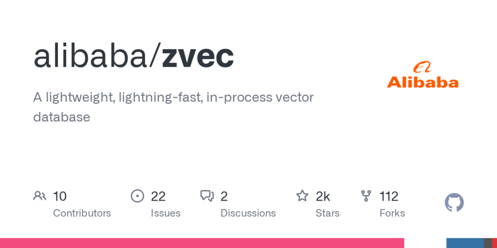

## 项目介绍

Zvec是一款由阿里巴巴开源的轻量级进程内向量数据库，基于 battle-tested 的Proxima引擎构建，无需服务器部署即可嵌入应用。其核心优势在于毫秒级 billion 级向量搜索性能，支持密集/稀疏向量混合查询，并原生集成结构化过滤能力。通过Python/Node.js等多语言API，开发者可在秒级完成安装配置，满足从边缘设备到云端的全场景向量检索需求，已广泛应用于RAG、推荐系统等AI场景。 

📊项目状态

项目状态：活跃开发中

### 核心功能

功能点：采用优化索引结构，实现毫秒级 billion 向量检索，远超传统数据库性能。

功能点：零配置嵌入式部署，无服务依赖，直接集成到应用进程中。

功能点：同时支持密集向量与稀疏向量，单查询可混合多种向量类型。

功能点：语义相似度与结构化条件混合搜索，提升结果精准度。

功能点：跨平台支持Linux/macOS，适配x86\_64/ARM64架构，边缘设备友好。

### 快速上手 & 评价

Python快速安装：
    
    
    pip install zvec

基础使用示例：
    
    
    import zvec schema = zvec.CollectionSchema(name="example", vectors=zvec.VectorSchema("embedding", zvec.DataType.VECTOR_FP32, 4))
    collection = zvec.create_and_open(path="./zvec_db", schema=schema)
    collection.insert([zvec.Doc(id="doc1", vectors={"embedding": [0.1,0.2,0.3,0.4]})])
    results = collection.query(zvec.VectorQuery("embedding", vector=[0.4,0.3,0.3,0.1]), topk=10)
    print(results)

💡 在AI应用开发中，向量数据库的部署复杂度与查询性能常成为瓶颈。Zvec通过进程内嵌入架构彻底消除服务依赖，同时依托Proxima引擎的高性能索引技术，在10M向量数据集上实现亚毫秒级查询延迟。相比同类产品，其独特的多向量类型混合检索能力，完美适配现代RAG系统中多模态数据处理需求。Apache-2.0许可下商业友好，配合完善的Python/Node.js SDK，适合从原型验证到大规模生产环境的全周期使用。

## 项目信息

➜repo

项目地址: https://github.com/alibaba/zvec

➜license开源协议: Apache-2.0 license，允许商业使用，需保留原始版权和许可声明。

➜languageC++

\#embedded-database\#rag\#vector-search\#ann-search\#vectordb