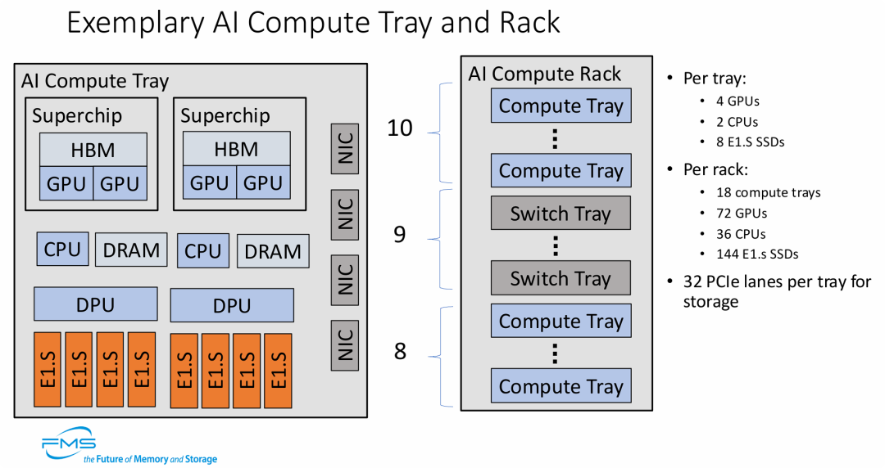
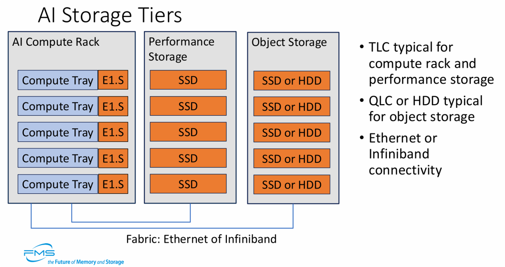
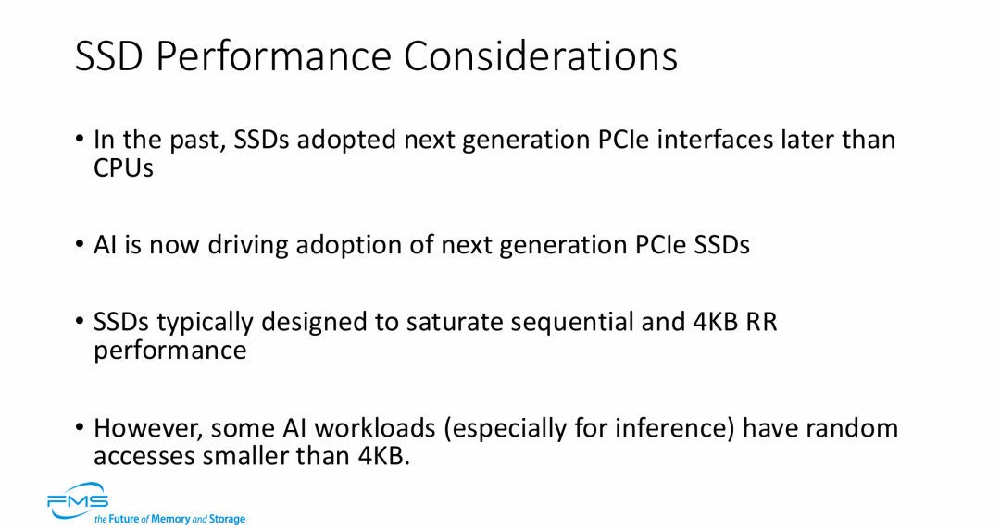
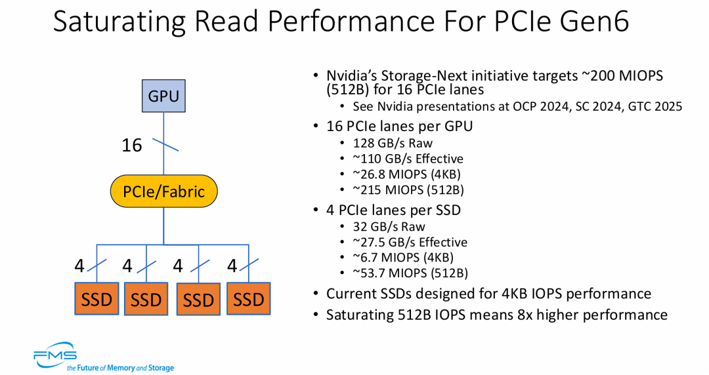
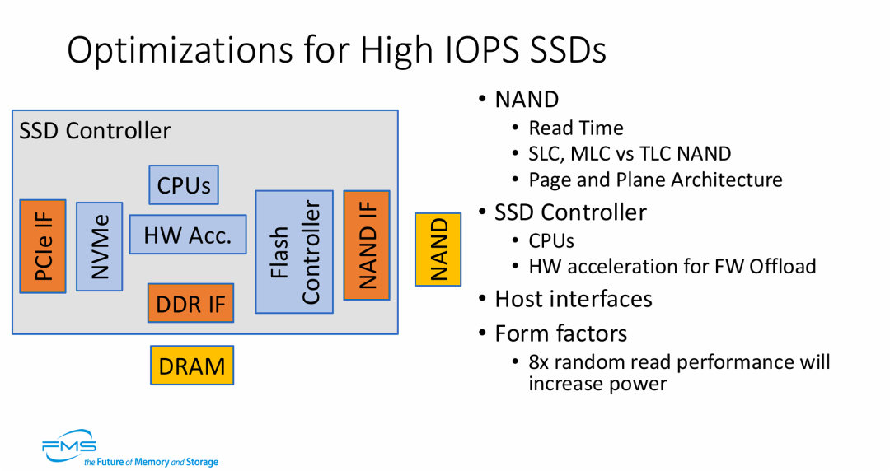
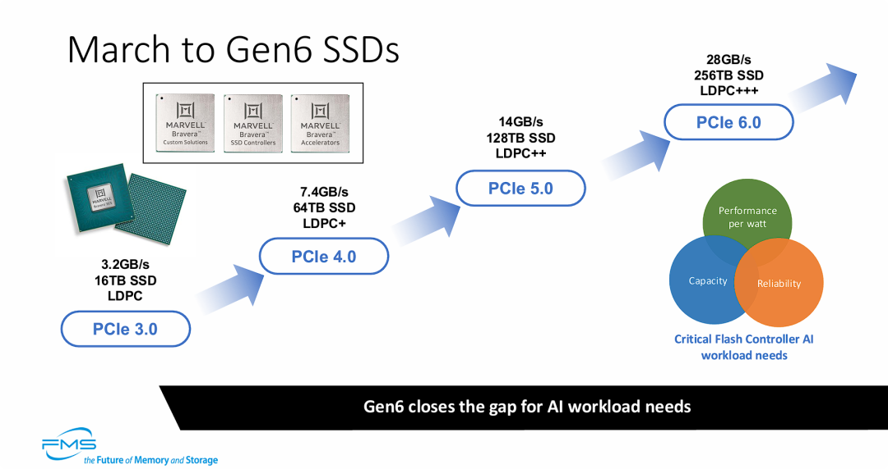

阅读收获

  1. **AI存储架构演进洞察：** 深入理解AI时代“以数据为中心”的异构计算架构，包括CPU、GPU、DPU的协同，以及分层存储（E1.S TLC、SSD TLC、QLC/HDD对象存储）如何平衡性能、容量与成本，为存储系统设计和优化提供前瞻性指导。
  2. **SSD性能瓶颈与设计趋势：** 识别AI推理场景中512B微小数据随机读取的性能瓶颈，以及PCIe Gen5-7时代对SSD控制器、NAND介质和固件卸载（DPU/硬件加速）提出的极致IOPS和带宽要求，为SSD产品研发和选型提供关键参考。
  3. **行业投资与技术路线分析：** 掌握QLC在对象存储层取代HDD的趋势，以及SSD在带宽、容量、纠错能力上的同步飞跃，为行业证券分析师评估存储市场投资机会、技术路线选择和未来增长点提供数据支撑。
  4. **前沿研究方向启发：** 了解NVIDIA Storage-Next等倡议对存储软件栈重构的需求，以及硬件加速固件卸载、功耗散热等挑战，为高校研究生和教授在AI存储领域开展创新研究提供新的视角和课题方向。

全文概览

人工智能的浪潮正以前所未有的速度重塑着计算范式，从大模型训练到实时推理，对底层基础设施提出了极致挑战。传统的“以计算为中心”架构已难以满足需求，一个“以数据为中心”的AI基础设施架构正加速崛起。然而，当GPU算力以指数级增长时，存储系统，尤其是SSD，是否已准备好迎接这场性能革命？

本文将深入探讨AI工作负载如何颠覆传统SSD设计，揭示在PCIe Gen5-7时代，AI对存储带宽、IOPS和延迟的恐怖需求。我们不仅会看到异构计算、分层存储和DPU在AI架构中的关键作用，更将聚焦于AI推理场景中“微小数据随机读取”这一被忽视的性能瓶颈。面对单机架200 MIOPS、512B小块数据8倍性能提升的严苛目标，SSD控制器架构、NAND介质潜力以及功耗散热等全链路优化将如何展开？这些挑战将如何重塑我们对未来存储的认知？让我们一同探索AI时代存储的极限与未来。  
  

👉 划线高亮 观点批注

* * *

图片展示了**以数据为中心（Data-Centric）的AI基础设施架构** ，其核心观点包括：

  1. **高度集成的异构计算：** 强调了CPU、GPU、DPU以及HBM/DRAM的紧密协同，这种“超级芯片”架构是为了满足大模型训练所需的海量并行计算需求。

  2. **存储的前置与高速化：** 单个托盘配置8个E1.S SSD，并提供32条PCIe通道，说明AI计算对本地高速存储（如数据预取、检查点保存/Checkpointing）有极高的带宽要求。

  3. **高密度的机架扩展：** 通过18个计算托盘的堆叠，单个机架可提供高达72个GPU的算力。这体现了现代AI数据中心向高功率、高密度、模块化方向发展的趋势。

  4. **DPU的重要性：** 引入DPU作为独立模块，体现了在AI集群中通过硬件卸载来减轻CPU负担并优化网络流量（如RDMA）的关键设计思路。

* * *

**AI基础架构需要通过分层存储来平衡性能、容量与成本。**

  * **分层策略：** 从计算节点本地的 **E1.S \(TLC\)** ，到中间层的 **SSD \(TLC\) 阵列** ，再到远端的大容量 **QLC/HDD 对象存储** ，数据根据访问频次在不同介质间流动。

  * **硬件演进：** TLC 依然是高性能层的主力，而 QLC 正在逐步取代 HDD 进入对象存储层以提升检索速度。

  * **网络解耦：** 强调了计算与存储之间通过高性能 Fabric 互连的解耦架构，支持以太网和 IB 网络以满足不同数据中心的需求。

* * *

图片的核心观点是：**AI 工作负载正在改变 SSD 的设计范式和性能优化方向。**

  1. **接口升级加速：** AI 对带宽的极致需求迫使存储行业打破传统，使 SSD 能够更同步地跟进最新的 PCIe 标准。

  2. **性能优化盲区：** 传统的 SSD 优化主要针对 4KB 或更大的数据块，但 AI 推理等任务中频繁出现的“微小数据随机读取”成为了当前 SSD 架构的性能瓶颈。

  3. **推理场景的特殊性：** 相比训练阶段的大吞吐量，推理阶段对超小数据块的极低延迟和高 IOPS 提出了更高要求。

* * *

图片展示了 AI 存储性能优化的新高度，其核心观点为：

  1. **从小数据块要性能：** 随着 PCIe Gen6 的普及，AI 负载（如 NVIDIA 的 Storage-Next）正推动存储架构向**极小数据块（512B）的高并发访问** 演进。

  2. **吞吐量与 IOPS 的双重饱和：** 系统设计不仅要填满 128 GB/s 的带宽，还要挑战单机架 200 MIOPS 的极端 IO 强度。

  3. **SSD 设计范式的转移：** 现有的以 4KB 为基础的 SSD 设计已无法满足下一代 AI 计算的需求，行业必须解决 512B 随机读取下 8 倍性能提升的难题。

===

PCIe Gen5-7 下 GPU对SSD性能要求的理论极限 **性能指标** | **PCIe Gen5 \(推演\)** | **PCIe Gen6 \(基准\)** | **PCIe Gen7 \(推演\)**  
---|---|---|---  
**单通道速率 \(GT/s\)** | 32 GT/s | **64 GT/s** | 128 GT/s  
**GPU \(x16 通道\)** |  |  |   
裸带宽 \(Raw Bandwidth\) | 64 GB/s | **128 GB/s** | 256 GB/s  
有效带宽 \(Effective Bandwidth\) | ~55 GB/s | **~110 GB/s** | ~220 GB/s  
4KB 随机性能 \(IOPS\) | ~13.4 M | **~26.8 M** | ~53.7 M  
**512B 随机性能 \(IOPS\)** | **~107 M** | **~215 M** | **~430 M**  
**单 SSD \(x4 通道\)** |  |  |   
裸带宽 \(Raw Bandwidth\) | 16 GB/s | **32 GB/s** | 64 GB/s  
有效带宽 \(Effective Bandwidth\) | ~13.75 GB/s | **~27.5 GB/s** | ~55 GB/s  
4KB 随机性能 \(IOPS\) | ~3.4 M | **~6.7 M** | ~13.4 M  
**512B 随机性能 \(IOPS\)** | **~26.9 M** | **~53.7 M** | **~107.4 M**  
  
### 关键洞察：

  1. **Gen7 的恐怖 IOPS 压力：**

     * 推演显示，在 PCIe Gen7 时代，为了填满 x16 通道的带宽，如果使用 **512B** 小数据块，系统需要处理高达 **4.3 亿 \(430 M\)** 的 IOPS。

     * 这是一个惊人的数字，目前的通用 CPU 完全无法处理这种级别的中断和上下文切换，这进一步印证了之前提到的 **"HW acceleration for FW Offload"（硬件加速固件卸载）** 和 DPU 的必要性。

  2. **SSD 设计的滞后性：**

     * 目前的顶级消费级/企业级 PCIe Gen5 SSD 在 4KB 读取上通常只能达到 2-3 MIOPS。

     * 即使是推演中的 Gen5 理论上限（x4 通道）也需要达到 **3.4 MIOPS** \(4KB\) 或 **26.9 MIOPS** \(512B\)。这说明目前的 SSD 控制器性能距离物理接口的上限还有很大差距，尤其是在小数据块随机读方面。

  3. **从 Gen5 到 Gen7 的质变：**

     * Gen5 SSD 的理论有效带宽（~13.75 GB/s）在 Gen7 时代甚至不如单条 PCIe 通道的速度。这种指数级的带宽增长要求存储软件栈（Software Stack）必须彻底重构（如 NVIDIA Storage-Next 倡议），否则软件将成为最大的瓶颈。

* * *

图片的核心观点是：**要实现 AI 所需的极致 IOPS，必须对 SSD 进行全链路的深度优化，并接受功耗上升的代价。**

  1. **控制器架构的进化：** 仅靠 CPU 运行固件已无法满足数亿级 IOPS 的需求，**硬件加速（HW Acceleration）** 成为必须，用于接管协议解析、地址转换等高频操作。

  2. **挖掘介质潜力：** 必须充分利用 NAND 的物理特性（如多 Plane 并行、更快的介质类型）来减少底层的读取延迟。

  3. **性能与功耗的博弈：** 明确指出了为了达成上一页提到的“512B 小块数据 8 倍性能提升”的目标，外形规格设计必须考虑到显著增加的功耗和散热挑战。

* * *

**SSD 的演进不仅仅是速度的提升，而是带宽、容量和可靠性（ECC）的同步飞跃，旨在满足 AI 的极致需求。**

  * **速度与容量的双重倍增：** 每一代接口升级，SSD 的实际有效带宽（Effective Bandwidth）和单盘容量都在成倍增加。Gen6 单盘 28GB/s 和 256TB 的规格，使其能单独应对以往需要磁盘阵列才能处理的任务。

  * **纠错能力的必要升级：** 随着速度提升（特别是 Gen6 引入 PAM4 调制），信号完整性挑战变大，必须配套更强的 LDPC+++ 纠错算法。

* * *

延伸思考

这次分享的内容就到这里了，或许以下几个问题，能够启发你更多的思考，欢迎留言，说说你的想法~

  1. 文章指出PCIe Gen7时代，512B小数据块随机读取可能需要高达4.3亿IOPS，远超现有CPU处理能力。除了DPU和硬件加速，您认为在存储软件栈（如文件系统、块存储层）层面，还需要哪些根本性的创新才能有效应对如此极端的IOPS压力？
  2. AI工作负载对SSD提出了极致的性能要求，尤其是在小数据块随机读方面。这是否意味着未来SSD将出现高度分化的产品线，例如专为AI推理优化的“微IOPS SSD”和传统通用型SSD？这种分化将如何影响存储市场的竞争格局和供应链？
  3. 为了实现AI所需的极致IOPS，文章提到必须接受功耗显著上升的代价。在数据中心绿色节能的大背景下，您认为如何在满足AI性能需求的同时，有效控制存储系统的整体能耗？是否存在创新的散热技术或能源管理策略可以缓解这一矛盾？

 *原文标题：Optimizing Flash Controllers for the AI Data Center\[1\]*

***Notice** ：Human's prompt, Datasets by Gemini-3-Pro*

\#FMS25 \#超高IO-SSD主控设计

\---【本文完】--- 丰子恺-护生画集-拾遗

👇**阅读原文** ，搜索🔍更多历史文章。

* * *

  1. https://files.futurememorystorage.com/proceedings/2025/01K9E04QGNZGJARE124FP7FZYN.pdf ↩