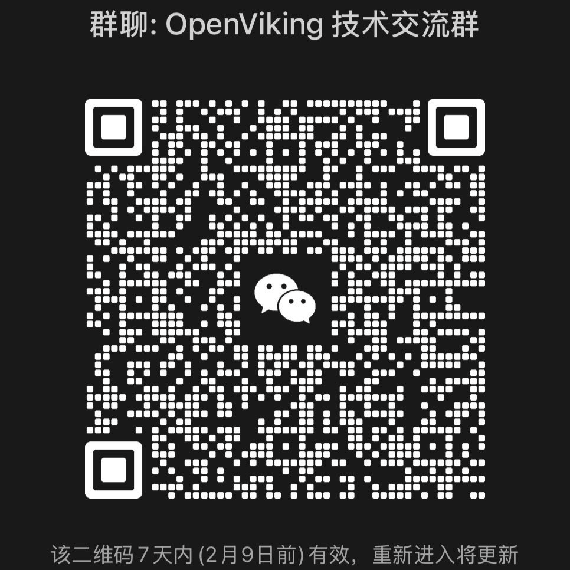

# OpenViking：面向 Agent 的上下文数据库

> 原文链接：[OpenViking：面向 Agent 的上下文数据库](https://mp.weixin.qq.com/s/Mkp3fyDsFyZZxGcTyyeHQw?scene=1)

# 挣脱上下文的枷锁：OpenViking，为 AI Agent 而生的开源上下文数据库

“We are swimming in a sea of information, and we need to learn to navigate.” — Norbert Wiener

“我们正畅游在信息的海洋中，我们需要学会航行。” — 诺伯特·维纳

AI Agent 的浪潮已至，它正从简单的任务执行者，演变为能够感知环境、自主规划、并调用工具完成复杂目标的智能实体。然而，在这片充满无限可能的机遇之海中，开发者们却普遍遭遇了一座难以逾越的冰山——**上下文管理**。

随着模型能力飞速提升，Agent 不再满足于处理单轮对话或短文本，而是开始面对长周期任务、海量多模态数据和复杂的协同需求。记忆、资源、技能……这些原本分散各处的上下文，管理起来愈发混乱。然而，如何高效管理和利用这些上下文，已成为开发者们普遍遭遇的瓶颈：

**上下文无序且割裂**：记忆在代码中，资源在向量库，技能分散在各个角落，关联和维护成本极高。

**长程任务需要更多上下文**：Agent 逐渐从处理单轮对话转向执行长周期任务，会涉及多工具、多 Agent 间的复杂协同。每一轮任务执行都会给上下文窗口和模型理解带来压力，如果简单的截断或压缩，本质上是“丢卒保帅”，会带来不可逆的信息损失和高昂的模型成本。

**朴素 RAG 检索效果局限**：朴素 RAG 的数据切片是平铺式存储，缺乏全局视野，面对海量、多模态且有信息组织的数据越来越力不从心，可能回去错失关键信息。同时，它过于关注语义相关性，在需要兴趣泛化和探索的开放式场景中表现不佳。

**上下文缺乏观测和调试**：从 DeepSeek 和 Manus 的爆火能发现，在 AI 越来越强大时，用户更渴望白盒化的体验，能看到其思考与决策的轨迹。而传统 RAG 隐式的检索链路如同黑箱，出错时难以归因和调试，改进门槛高。

**记忆成为核心资产**：模型本身是通用的，大家越发意识到沉淀的记忆才是 Agent 的核心资产，但这不止包括使用用户的记忆，还包括 Agent 自身的经验和偏好记忆。记忆需要在开发初期就建设起来，这样才能形成使用时间越长，体验越好的**复利效果**。

而近年来，业界也关于 Context Engineering 有一些探索实践：**Manus**&nbsp;提出文件系统是上下文的终极形态；**Claude Code**&nbsp;的成功验证了文件系统 + Bash 的简洁方案在特定场景下超越复杂向量索引的潜力；而&nbsp;**Anthropic 的 Skills 系统**也巧妙地以文件夹来组织能力模块。这些实践给了我们启发，但也反映了一个问题：文件系统是上下文一种很好的组织方式，但并没有一个类似数据库能有效管理Agent所需所有上下文并解决上述问题。

为此，我们正式开源&nbsp;**OpenViking**——专为 AI Agent 设计的上下文数据库。

我们旨在为&nbsp;**Agent 定义一套极简的上下文交互范式，让开发者彻底告别上下文管理的烦恼。**&nbsp;OpenViking 摒弃了传统 RAG 的碎片化向量存储模式，创新性地采用“文件系统范式”，将 Agent 所需的记忆、资源和技能进行统一的结构化组织。

Memory, Resource, Skill. Everything is a File.
记忆、资源、技能，皆为文件。

 

OpenViking&nbsp;信息图，由 vaka 知识助手生成(https://aisearch.volcengine.com/)

借助 OpenViking，上下文不再是散落一地的拼图，而是一个层次分明、井然有序的认知系统。它能够实现上下文的分层供给，在保障信息完整性的前提下，将 Token 成本降至最低；它提供**协同写入**与**自我迭代**机制，让 Agent 的“知识”与“经验”在与世界的交互中持续成长，开发者可以像管理本地文件一样构建 Agent 的大脑：

**文件系统管理范式 → 解决碎片化问题**：基于文件系统范式，将记忆、资源、技能进行统一上下文管理

**分层上下文按需加载 → 降低 Token 消耗**：L0/L1/L2 三层结构，按需加载，大幅节省成本

**目录递归检索 → 提升检索效果**：支持原生文件系统检索方式，融合目录定位与语义搜索，实现递归式精准上下文获取

**可视化检索轨迹 → 上下文可观测**：支持可视化目录检索轨迹，让用户能够清晰观测问题根源并指导检索逻辑优化

**会话自动管理 → 上下文自迭代**：自动压缩对话中的内容、资源引用、工具调用等信息，提取长期记忆，让 Agent 越用越聪明

现在，让我们一起深入了解 OpenViking，看看它如何挣脱上下文的枷锁，助您在 AI Agent 的浪潮中扬帆远航。

OpenViking 核心理念

OpenViking 的设计哲学围绕四大核心理念构建，旨在将复杂的上下文管理流程化繁为简，让开发者能将宝贵的精力聚焦于业务创新。

**文件系统管理范式**

我们不再将上下文视为扁平的文本切片，而是将其统一抽象并组织于一个虚拟文件系统中。无论是记忆、资源还是能力，都会被映射到&nbsp;`viking://`&nbsp;协议下的虚拟目录，拥有唯一的 URI。这种范式赋予了 Agent 前所未有的上下文操控能力，使其能像开发者一样，通过&nbsp;`list`、`find`&nbsp;等标准指令来精确、确定性地定位、浏览和操作信息，让上下文的管理从模糊的语义匹配演变为直观、可追溯的“文件操作”。

文件系统管理范式

**分层上下文按需加载**

将海量上下文一次性塞入提示词，不仅成本高昂，更容易超出模型窗口并引入噪声。OpenViking 借鉴业界前沿实践，在上下文写入时便自动将其处理为三个层级：

L0 (摘要)：一句话概括，用于快速判断。

L1 (概述)：包含核心信息和使用场景，供 Agent 在规划阶段进行决策。

L2 (详情)：完整的原始数据，供 Agent 在确有必要时深入读取。

OpenViking 的设计使其能够灵活适配各类 AI Agent 的开发场景。无论是简单的问答机器人，还是复杂的自动化工作流，它都能作为坚实的上下文底座，提供稳定、高效的支撑。

分层上下文按需加载

目录递归检索

单一的向量检索难以应对复杂的查询意图。OpenViking 设计了一套创新的**目录递归检索**策略，它深度融合了多种检索方式的优点：首先，通过**意图分析生成多个检索条件**；然后，利用向量检索快速定位初始切片所在的**高分目录**；接着，在该目录下进行**二次检索**，并将高分结果更新至候选集合；若目录下仍存在子目录，则**逐层递归**重复上述二次检索步骤；最终，拿到最相关上下文返回。这种 “先锁定高分目录、再精细探索内容” 的策略，不仅能找到语义最匹配的片段，更能理解信息所在的完整语境，从而提升检索的全局性与准确性。

目录递归检索

**可观测与自迭代**

OpenViking 的组织方式采用层次化虚拟文件系统结构，所有上下文均以统一格式整合且每个条目对应唯一 URI（如 viking:// 路径），打破传统扁平黑箱式管理模式，层次分明易于理解；同时检索过程采用目录递归策略，每次检索的目录浏览、文件定位轨迹均被完整留存，能够清晰观测问题根源并指导检索逻辑优化。

此外，OpenViking 内置了记忆自迭代闭环。在每次会话结束时，通过&nbsp;`session.commit()`&nbsp;主动触发，系统会异步分析任务执行结果与用户反馈，并自动更新至 User 和 Agent 的 /memory 目录下。既能更新用户偏好相关记忆，使 Agent 回应更贴合用户需求，又能从任务执行经验中提取操作技巧、工具使用经验等核心内容，助力后续任务高效决策实现自我进化，让 Agent 在与世界的交互中“越用越聪明”。

可观测与自迭代

快速上手：三分钟运行 OpenViking

OpenViking 的一大核心优势是其极简的集成方式。我们深知开发者的宝贵时间不应浪费在繁琐的配置上。您无需部署复杂的服务或学习新的 DSL，只需通过几行 Python 代码，即可为您的 Agent 装上强大的“上下文大脑”。

以下示例是以OpenViking的Readme英文版作为文件进行写入，展示处理后的上下文目录结构，以及对应文档的分层信息，并进行简单问题的回复。

**第一步：安装 OpenViking**

`pip install openviking
`

**第二步：获取模型服务**

OpenViking 需要VLM模型（用于多模态内容理解）和Embedding 模型（用于向量化）能力的API Key：

我们支持多种模型服务：

OpenAI 模型：支持 GPT-4V 等 VLM 模型和 OpenAI Embedding 模型

火山引擎（豆包模型）：推荐使用，成本低、性能好，新用户有免费额度。如需购买和开通，请参考：**火山引擎购买指南https://github.com/volcengine/OpenViking/blob/main/docs/zh/configuration/volcengine-purchase-guide.md**

其他自定义模型服务：支持兼容 OpenAI API 格式的模型服务

**第三步：配置环境**

创建配置文件&nbsp;`ov.conf`：&nbsp;

⚠️ 重要提示：请将下方配置中的 &lt;your-volcengine-api-key&gt; 替换为你在第二步获取的真实 API Key！

`{
&nbsp;&nbsp;"vlm": {
&nbsp; &nbsp;&nbsp;"api_key":&nbsp;"&lt;your-api-key&gt;", &nbsp; &nbsp; &nbsp;// 模型服务的 API 密钥
&nbsp; &nbsp;&nbsp;"model":&nbsp;"&lt;model-name&gt;", &nbsp; &nbsp; &nbsp; &nbsp; &nbsp;// VLM 模型名称（如 doubao-seed-1-8-251228 或 gpt-4-vision-preview）
&nbsp; &nbsp;&nbsp;"api_base":&nbsp;"&lt;api-endpoint&gt;", &nbsp; &nbsp;&nbsp;// API 服务端点地址（如volcengine api：https://ark.cn-beijing.volces.com/api/v3）
&nbsp; &nbsp;&nbsp;"backend":&nbsp;"&lt;backend-type&gt;"&nbsp; &nbsp; &nbsp; &nbsp;// 后端类型（volcengine 或 openai）
&nbsp; },
"embedding": {
&nbsp; &nbsp;&nbsp;"dense": {
&nbsp; &nbsp; &nbsp;&nbsp;"backend":&nbsp;"&lt;backend-type&gt;", &nbsp; &nbsp;// 后端类型（volcengine 或 openai）
&nbsp; &nbsp; &nbsp;&nbsp;"api_key":&nbsp;"&lt;your-api-key&gt;", &nbsp; &nbsp;// 模型服务的 API 密钥
&nbsp; &nbsp; &nbsp;&nbsp;"model":&nbsp;"&lt;model-name&gt;", &nbsp; &nbsp; &nbsp; &nbsp;// Embedding 模型名称（如 doubao-embedding-vision-250615 或 text-embedding-3-large）
&nbsp; &nbsp; &nbsp;&nbsp;"api_base":&nbsp;"&lt;api-endpoint&gt;", &nbsp;&nbsp;// API 服务端点地址（如volcengine api：https://ark.cn-beijing.volces.com/api/v3）
&nbsp; &nbsp; &nbsp;&nbsp;"dimension":&nbsp;1024&nbsp; &nbsp; &nbsp; &nbsp; &nbsp; &nbsp; &nbsp; &nbsp;&nbsp;// 向量维度
&nbsp; &nbsp; }
&nbsp; }
}
`

并设置环境变量：

`export&nbsp;OPENVIKING_CONFIG_FILE=ov.conf
`

**第四步：运行体验**

创建简单的 Python 脚本&nbsp;`example.py`&nbsp;并运行，通过写入 OpenViking README 文档来体验写入-检索-读取的全过程：

`import&nbsp;openviking&nbsp;as&nbsp;ov

# Initialize OpenViking client with data directory
client = ov.SyncOpenViking(path="./data")

try:
&nbsp; &nbsp;&nbsp;# Initialize the client
&nbsp; &nbsp; client.initialize()

&nbsp; &nbsp;&nbsp;# Add resource (supports URL, file, or directory)
&nbsp; &nbsp; add_result = client.add_resource(
&nbsp; &nbsp; &nbsp; &nbsp; path="https://raw.githubusercontent.com/volcengine/OpenViking/refs/heads/main/README.md"
&nbsp; &nbsp; )
&nbsp; &nbsp; root_uri = add_result['root_uri']

&nbsp; &nbsp;&nbsp;# Explore the resource tree structure
&nbsp; &nbsp; ls_result = client.ls(root_uri)
&nbsp; &nbsp; print(f"Directory structure:\n{ls_result}\n")

&nbsp; &nbsp;&nbsp;# Use glob to find markdown files
&nbsp; &nbsp; glob_result = client.glob(pattern="**/*.md", uri=root_uri)
&nbsp; &nbsp;&nbsp;if&nbsp;glob_result['matches']:
&nbsp; &nbsp; &nbsp; &nbsp; content = client.read(glob_result['matches'][0])
&nbsp; &nbsp; &nbsp; &nbsp; print(f"Content preview:&nbsp;{content[:200]}...\n")

&nbsp; &nbsp;&nbsp;# Wait for semantic processing to complete
&nbsp; &nbsp; print("Wait for semantic processing...")
&nbsp; &nbsp; client.wait_processed()

&nbsp; &nbsp;&nbsp;# Get abstract and overview of the resource
&nbsp; &nbsp; abstract = client.abstract(root_uri)
&nbsp; &nbsp; overview = client.overview(root_uri)
&nbsp; &nbsp; print(f"Abstract:\n{abstract}\n\nOverview:\n{overview}\n")

&nbsp; &nbsp;&nbsp;# Perform semantic search
&nbsp; &nbsp; results = client.find("what is openviking", target_uri=root_uri)# Input query
&nbsp; &nbsp; print("Search results:")
&nbsp; &nbsp;&nbsp;for&nbsp;r&nbsp;in&nbsp;results.resources:
&nbsp; &nbsp; &nbsp; &nbsp; print(f" &nbsp;{r.uri}&nbsp;(score:&nbsp;{r.score:.4f})")

&nbsp; &nbsp;&nbsp;# Close the client
&nbsp; &nbsp; client.close()

except&nbsp;Exception&nbsp;as&nbsp;e:
&nbsp; &nbsp; print(f"Error:&nbsp;{e}")
`

运行脚本：

`python example.py
`

**若您得到检索结果，恭喜！你已成功运行 OpenViking 🎉**

开源共建，定义下一代 Agent 上下文标准

我们坚信，开放与协作是推动技术创新的核心动力。将 OpenViking 开源，是我们回馈社区、并与全球开发者共同探索 AI Agent 未来的第一步。

这不仅仅是一次代码的分享，更是一次理念的传播。我们希望通过 OpenViking，能够为业界提供一个关于 Agent 上下文管理的全新范式，一个能够有效降低开发门槛、激发业务创新的坚实底座。

我们深知，OpenViking 目前还处于早期阶段，有许多需要完善和探索的地方。但这正是开源的魅力所在——它允许我们汇聚最广泛的智慧，应对最前沿的挑战。

在此，我们诚挚地邀请每一位对 AI Agent 技术充满热情的开发者：

**访问我们的 GitHub 仓库&nbsp;https://github.com/volcengine/OpenViking**，为我们点亮一颗宝贵的 Star，给予我们前行的动力。

**访问我们的网站https://openviking.ai（点击阅读原文可跳转）**，了解我们传递的理念，并通过文档使用它，在您的项目中感受它带来的改变，并向我们反馈最真实的体验。

**扫描下方二维码加入我们的社区**，分享您的洞见，帮助解答他人的疑问，共同营造一个开放、互助的技术氛围。

飞书群

微信群**成为我们的贡献者**，无论是提交一个 Bug 修复，还是贡献一个新功能，您的每一行代码都将是 OpenViking 成长的重要基石。&nbsp;

让我们一起，共同定义和构建 AI Agent 上下文管理的未来。旅程已经开始，期待您的加入！

关于我们：字节跳动 Viking 团队

我们用 C 端产品的体验标准打造能够重塑企业生产力的产品和技术。在上下文工程领域具有深厚的技术积累与商业化实践，我们的愿景是提供用户友好的上下文工程产品矩阵。

**我们的产品历程**

**2019 年**：VikingDB 向量数据库支撑字节内部全业务大规模使用

**2023 年**：VikingDB 在火山引擎公有云售卖

**2024 年**：推出面向开发者的产品矩阵：VikingDB 向量数据库、Viking 知识库、Viking 记忆库

**2025 年**：打造 AI 搜索、vaka 知识助手等上层应用产品

**2025 年 10 月**：开源 MineContext&nbsp;https://github.com/volcengine/MineContext，主动式 AI 应用探索

**2026 年 1 月**：开源&nbsp;**OpenViking**，为 AI Agent 提供底层上下文数据库支撑

