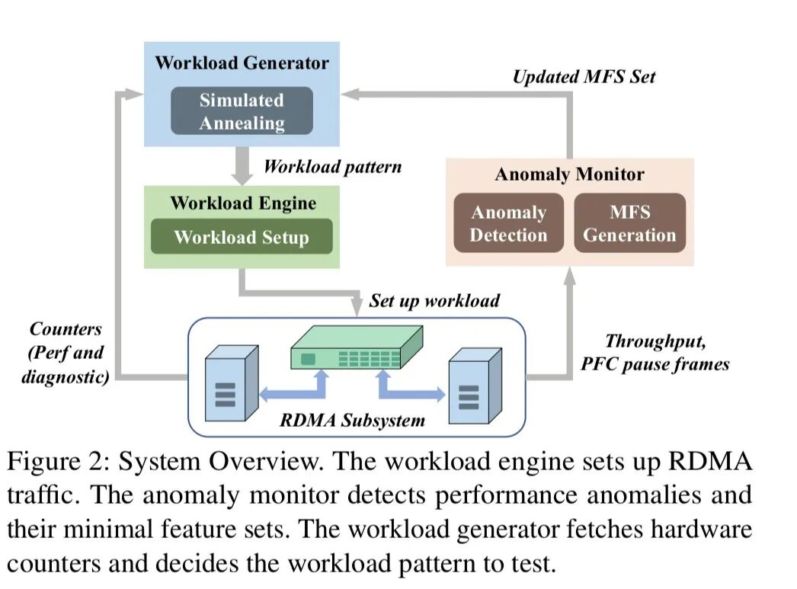
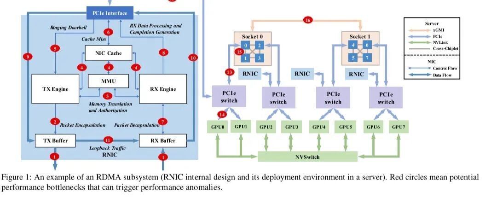
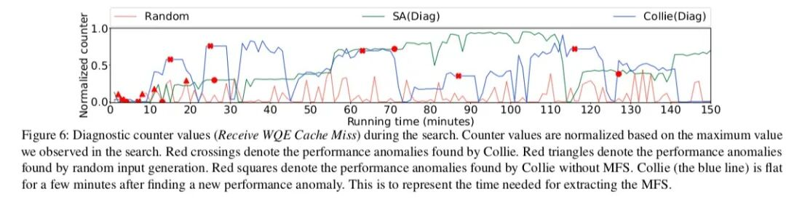
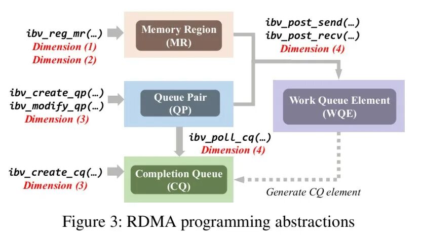
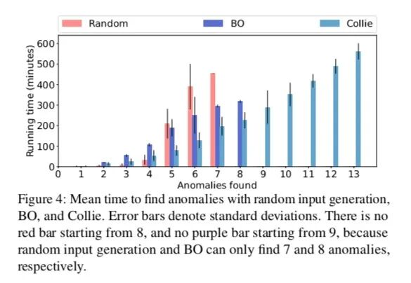
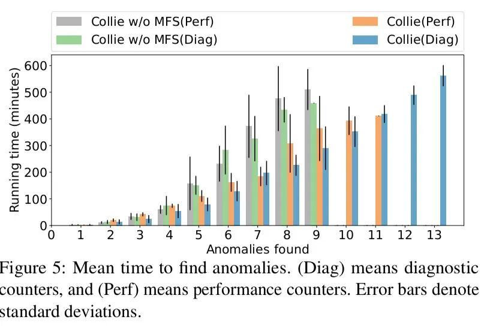
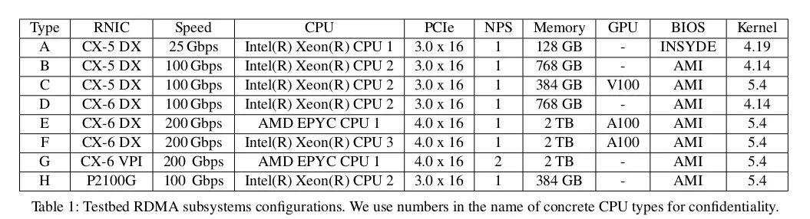
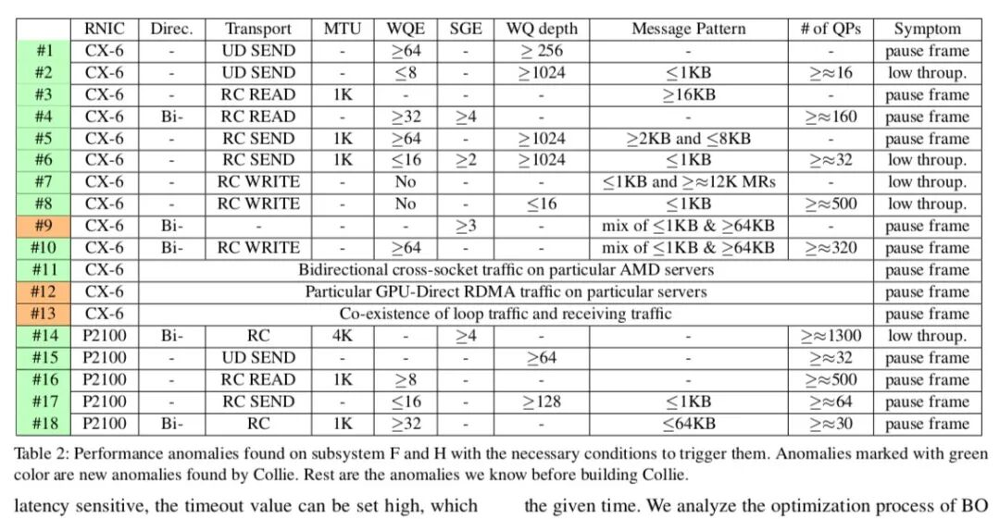

引言：

字节这篇几年前的文章《Collie: Finding Performance Anomalies in RDMA Subsystems》提出了一套系统性发现RDMA子系统性能异常的工具。与之前讨论的R-Pingmesh（侧重于部署后的监控诊断）不同，Collie更像一个部署前的主动测试与“漏洞挖掘”工具，旨在找出那些在特定硬件组合与特定应用负载下才会触发的隐藏性能问题。

\- Collie系统架构图：包含Workload Engine、Anomaly Monitor、Workload Generator三大模块  
几点启示：

\- 没有“万能”MTU：Anomaly \#3（小MTU触发）、\#14（大MTU触发）表明最佳MTU因硬件而异。  
\- 隐藏资源竞争：RNIC内部缓存（如WQE缓存）是性能隔离的新战场。  
\- 端到端流控缺失：主机瓶颈（如PCIe背压）会诱发PFC，RoCEv2依赖PFC是双刃剑

一、背景与挑战

1\. RDMA子系统的复杂性

\- RDMA子系统不仅包含RNIC（RDMA网卡），还包括CPU、内存、PCIe链路、GPU等服务器内部组件。

如图所示，一个RNIC内部至少有6大组件（TX引擎、MMU、SRAM缓存、RX引擎等），它们与外部硬件的交互路径非常复杂（图中用红圈标出了潜在的瓶颈点）。

  

2\. 生产环境中的异常现象

几个真实案例：

a.同样的RNIC，在不同PCIe配置的服务器上性能差异巨大。

b. 特定的负载模式，只有在特定NUMA设置+特定RNIC+特定服务器组合下，才会触发PFC暂停帧风暴。

c. 一个微小的代码改动（如消息大小混合模式），导致200G网卡性能还不如100G网卡。

  

3\. 现有测试方法的不足

· 简单基准测试（如PerfTest）：只能测试固定流量模式，无法覆盖复杂交互。

· 代表性应用测试：只能测试已知负载，无法发现未知但可能出现的负载引发的异常。

· 根本问题：应用负载会随着时间变化，而现有方法无法系统性地探索所有可能的负载组合。

  

二、解决的问题

帮助数据中心运维人员和应用开发者：

1\. 系统性发现RDMA子系统中由特定应用负载触发的性能异常。

2\. 高效搜索庞大的负载组合空间，找到那些隐藏的异常。

3\. 提取最小特征集，帮助开发者理解触发条件，从而规避异常。

  

三、关键技术总结

  

1\. 构建全面的搜索空间（Search Space）

\- 核心理念：虽然底层硬件是黑盒，但RDMA编程的窄腰抽象（verbs API） 是明确定义且稳定的。

\- 四个搜索维度：

1\. 主机拓扑：数据流经哪些硬件（如NUMA亲和内存、GPU）→ 如图中的红圈路径。

2\. 内存分配设置：内存区域（MR）的数量和大小 → 影响MMU缓存命中率。

3\. 传输设置：QP类型（RC/UC/UD）、操作码（READ/WRITE/SEND）、WQE批处理大小、SG列表长度。

4\. 消息模式：请求序列的模式（如大包+小包+大包的混合）。

  

2\. 利用硬件计数器引导搜索

\- 两类计数器：

1.性能计数器：如吞吐量（bits/sec, packets/sec）。

2.诊断计数器：如PCIe背压、RNIC内部缓存未命中。

-搜索算法：基于模拟退火（Simulated Annealing），驱动计数器值进入极端区域。

1.对性能计数器：最小化（寻找吞吐下降点）。

2.对诊断计数器：最大化（寻找内部压力点）。

关键数据：如图所示，Collie成功将“Receive WQE缓存未命中”计数器驱动到高位，并在这些区域发现了多个异常（图中红叉标记）。

  

3\. 最小特征集（Minimal Feature Set, MFS）

\- 作用：确定触发某个异常所必需的最小条件集合。

\- 方法：对每个维度进行“是否必要”的测试（如将UD改为RC，看异常是否消失）。

\- 价值：

1.加速搜索：避免重复测试同一异常区域（见算法1第5行）。

2.帮助开发者规避：只要打破MFS中的任意一个条件，即可避免异常。

  

4\. 异常定义

为了可量化检测，Collie聚焦于两类可精确定义的异常：

1\. 无网络拥塞时不应有PFC暂停帧（阈值设为0.1%的暂停时长比例）。

2\. 吞吐量应受限于RNIC规格（bits/sec或packets/sec），若低于规格的20%则视为异常。

  

四、关键数据与图表

1.RDMA编程抽象层次图，展示了从应用到verbs API到硬件的层次

  

2\. 搜索效率对比图：随机生成、贝叶斯优化、Collie（带/不带诊断计数器）的异常发现时间，Collie最优

3.诊断计数器 vs 性能计数器的搜索效率对比，诊断计数器引导效率更高

4\. 测试的8种RDMA子系统配置，涵盖不同RNIC（Mellanox CX5/CX6、Broadcom）、CPU（Intel/AMD）、GPU、速度（25-200Gbps）

  

5\. Collie发现的18个性能异常（3个已知+15个新发现），列出异常现象、根因分类、状态（已修复/待修复）

6\. 18个异常的具体触发条件、根因分析和修复建议：

  

1\. 异常 \#1（新发现）：在使用UD QP时，若采用较大的WQE批处理大小和较长的WQ（工作队列长度），即使只有单个UD QP连接，也会导致PFC暂停帧风暴和吞吐量急剧下降。Collie观察到暂停时长比例高达约20%，意味着RNIC平均每秒要求上游交换机暂停约200毫秒。

-厂商已复现该异常，但根本原因尚未明确，因此尚未修复。推测可能与接收WQE的预取机制触发缓存未命中有关，从而限制了接收端的流量处理能力。

-简化触发条件：1个UD QP，使用SEND/RECV操作码，每个QP有1个64KB的发送MR和1个64KB的接收MR，工作队列长度为256，MTU为2KB，发送方每次批量发送64个请求，每个请求只有一个SG元素，大小为2KB。

  
2\. 异常 \#2（新发现）：在UD QP场景下，若WQE批处理大小较小、WQ较长、消息较小且连接数较少，会导致吞吐量下降但不触发PFC暂停帧。与异常\#1类似但表现不同：发送方不批量或小批量（如小于8）发送请求，消息较小（如512B、1KB），接收方有极长的工作队列时，吞吐量下降超过20%且无PFC。若减小接收方工作队列长度，吞吐量恢复正常。

\- 厂商已确认，推测根本原因与\#1相似，但由于未知的RNIC瓶颈，表现出不同的症状。

-简化触发条件：16个UD QP，使用SEND/RECV，每个QP有64KB的发送/接收MR，工作队列长度为1024，MTU为1KB，发送方每次批量发送4个请求，每个请求单个SG元素大小为1KB。

  
3\. 异常 \#3（新发现）：在RC READ操作中，当MTU小于1500（以太网默认值）且使用大消息时，会触发PFC暂停帧。吞吐量急剧下降，暂停时长可达10%以上，吞吐量降至一半以下。

\- 厂商指出低MTU可能触发200Gbps网卡内部包处理瓶颈。通过将MTU从1500提升至4200（RDMA MTU可达4096）即可解决。该异常已修复。

\- 简化触发条件：8个RC QP使用READ操作码，每个QP有4MB发送/接收MR，工作队列长度为128，MTU为1KB，发送方持续发送4MB的READ请求，每个请求单个SG元素。

  
4\. 异常 \#4（新发现）：在双向RC READ流量中，即使将MTU提升至4200（解决了异常\#3），若采用较大的WQE批处理大小、较长的SG列表（每个请求包含多个SG元素）以及一定数量的连接（约160个），仍会触发PFC暂停帧，暂停时长比例约30%。

-厂商已复现并确认，但根本原因未知，尚未修复。

-简化触发条件：80个RC QP（每个方向），使用READ操作码，每个QP有64KB发送/接收MR，工作队列长度为128，MTU为4KB，发送方每次批量发送128个请求，每个请求有4个SG元素，每个元素大小128B。

  
5\. 异常 \#5（新发现）：在RC SEND操作中，若MTU较小、WQE批处理大、WQ长、消息较长，会触发PFC暂停帧和吞吐量急剧下降。

\- 与UD类似但触发条件更严格。厂商尚未修复。

-简化触发条件：1个RC QP使用SEND/RECV，每个QP有64KB发送/接收MR，工作队列长度为1024，MTU为1KB，发送方每次批量发送64个请求，每个请求有2个SG元素，大小为2KB。

  
6\. 异常 \#6（新发现）：在RC SEND操作中，若MTU较小、WQE批处理小、SG列表批处理大、WQ长、消息小、连接数较少，会导致吞吐量下降但不触发PFC暂停帧。

\- 与\#5不同，其现象类似UD的\#2。厂商尚未修复。

-简化触发条件：32个RC QP使用SEND/RECV，每个QP有64KB发送/接收MR，工作队列长度为1024，MTU为1KB，发送方每次批量发送8个请求，每个请求有2个SG元素，大小为1KB。

  
7\. 异常 \#7（新发现）：在RC WRITE操作中，若连接数很多、消息小、WQ深度小、WQE批处理小，会导致吞吐量下降。这是RDMA可扩展性问题的一种表现，但在实际应用中即使连接数超过1万也未出现，而Collie成功触发。

\- 根本原因是RNIC内部缓存（如连接上下文）未命中，需要额外PCIe操作从主机DRAM获取，但若请求足够大，流水线可隐藏开销；小请求则暴露开销。

-简化触发条件：480个RC QP使用WRITE，每个QP有64KB发送/接收MR，工作队列长度为16，MTU为1KB，发送方无WQE批处理，每个请求单个SG元素大小512B。

  
8\. 异常 \#8（新发现）：在RC WRITE操作中，若MR数量很多、消息小、WQE批处理小，会导致吞吐量下降。

\- 同样属于可扩展性问题，由内存翻译表缓存未命中引发。

\- 简化触发条件：24个RC QP使用WRITE，每个QP有1024个64KB发送MR和1024个64KB接收MR，工作队列长度为128，MTU为1KB，无WQE批处理，每个请求512B。

  
9\. 异常 \#9（已知）：在特定AMD服务器上，双向流量中混合大小消息（如SG列表中包含128B、64KB、1KB的模式）会触发PFC暂停帧和吞吐量急剧下降。

\- 根本原因是PCIe排序问题：若RNIC未配置为PCIe松弛排序，DMA请求可能被前序请求阻塞，导致接收缓冲区累积，进而触发大量PFC。通过将RNIC配置为强制松弛排序设备即可解决，已修复。

\- 简化触发条件：8个RC QP（每个方向）使用WRITE，每个QP有4MB发送/接收MR，工作队列长度128，MTU为4KB，批量发送8个请求，每个请求3个SG元素，模式为\[128B, 64KB, 1KB\]。

  
10\. 异常 \#10（新发现）：在双向RC WRITE流量中，若WQE批处理大、混合大量短消息和少量长消息、连接数较多，会触发PFC暂停帧。即使已配置PCIe松弛排序（解决\#9后），仍出现此问题。

\- 厂商确认并在后续固件中修复。根本原因是RNIC内部某包处理组件未充分双向化，双向可靠流量中大量短请求导致该组件成为瓶颈，进而阻塞长请求，引发PFC。

\- 简化触发条件：320个RC QP（每个方向）使用WRITE，每个QP有64KB发送/接收MR，工作队列长度128，MTU为1KB，批量发送64个请求，每个请求单个SG元素，模式为\[64KB, 128B, 128B, 128B\]（即一个长包后跟三个短包）。

  
11\. 异常 \#11（新发现）：在特定AMD服务器上，双向跨NUMA流量（源和目标位于不同NUMA节点）即使只有单个连接，也会触发PFC风暴（暂停时长比例达15.7%）。

-根本原因是这些服务器跨NUMA性能问题，导致PCIe延迟增加，进而限制RNIC接收速率。厂商建议使用2x100G NIC分别绑定不同NUMA以减少跨NUMA流量，已采纳并视为修复。

-简化触发条件：1个RC QP（每个方向）使用WRITE，每个QP有32个4MB发送MR和32个4MB接收MR，工作队列长度128，MTU为4KB，批量发送16个请求，每个请求单个SG元素大小256KB，主机A使用socket0内存，主机B使用socket1内存。

  
12\. 异常 \#12（已知）：在特定AMD服务器上，GPU-Direct RDMA会触发PFC风暴和吞吐量急剧下降（吞吐降至40Gbps以下，暂停占比15%）。

-根本原因是PCIe桥接配置差异（ACSClt配置不当），导致GPU流量经过根复杂而非直接到RNIC。采用正确配置后修复。

-简化触发条件：8个RC QP（每个方向）使用WRITE，每个QP有4MB发送/接收MR，工作队列长度128，MTU为4KB，批量发送8个请求，每个请求3个SG元素，模式\[128B, 64KB, 1KB\]，MR分配自GPU内存且与RNIC在同一PCIe桥下。

  
13\. 异常 \#13（已知）：当接收流量和环回流量共存时（如Worker和Server同机），会触发网卡内部拥塞/incast，导致PFC暂停帧。RNIC缺乏对环回流量的限速机制。

\- 目前通过识别环回通信并使用其他IPC（如共享内存）规避，但未完全修复，因为虚拟化环境不能完全依赖IPC。该问题暴露了RNIC需考虑内部incast设计。

\- 简化触发条件：16个RC QP使用WRITE，其中8个接收端和8个发送端在同机A，另8个发送端在主机B，每个QP有32个4MB发送/接收MR，工作队列长度128，MTU为4KB，批量发送16个请求，每个请求单个SG元素大小256KB。

  
14\. 异常 \#14（新发现）：在Broadcom P2100G 100G网卡上，双向RC流量若连接数很多且MTU较大（4KB），会导致吞吐量下降且无PFC暂停帧。而将MTU改为1KB即可达到线速，这与通常经验（大MTU提升性能）相反。其他网卡未见此现象。

\- 简化触发条件：1024个RC QP（每个方向）使用WRITE，每个QP有81个256KB发送MR和83个256KB接收MR，工作队列长度128，MTU为4KB，发送方每次发送1个请求，每个请求4个SG元素，每个元素64KB。

  
15\. 异常 \#15（新发现）：在Broadcom网卡上，UD QP若WQ较长且连接数较多，会触发PFC暂停帧。与Mellanox的\#1类似但触发条件不同（\#1单连接即可，此处需多连接）。

-简化触发条件：32个UD QP使用SEND/RECV，每个QP有4KB发送/接收MR，工作队列长度64，MTU为2KB，发送方每次发送1个请求，消息模式\[256B, 1KB, 64B, 1KB\]。

  
16\. 异常 \#16（新发现）：在Broadcom网卡上，RC READ若连接数很多、WQE批处理大、MTU小，会触发PFC暂停帧。与Mellanox的\#4类似，表明同一网卡在不同负载下最优MTU选择可能不同。

\- 简化触发条件：500个RC QP使用READ，每个QP有256KB发送/接收MR，工作队列长度128，MTU为1KB，批量发送8个请求，每个请求单个SG元素大小64KB。

  
17\. 异常 \#17（新发现）：在Broadcom网卡上，RC SEND若连接数多、WQE批处理小、MTU小、消息短、WQ长，会触发PFC暂停帧。

\- 厂商确认，并与\#18一起通过配置特定寄存器修复。

-简化触发条件：80个RC QP使用SEND/RECV，每个QP有1MB发送/接收MR，工作队列长度128，MTU为1KB，每次发送1个请求，单个SG元素大小1KB。

  
18\. 异常 \#18（新发现）：在Broadcom网卡上，双向RC WRITE若连接数较少、WQE批处理大、消息小，会触发PFC暂停帧。

\- 厂商通过配置RNIC特定寄存器修复。

-简化触发条件：16个RC QP（每个方向）使用WRITE，每个QP有12KB发送/接收MR，工作队列长度64，MTU为1KB，批量发送16个请求，每个请求单个SG元素大小64KB。

  

五、未来工作

  

1\. 扩展搜索空间

· 当前简化了网络环境（两台服务器+一台交换机），未来可考虑多路径、网络拥塞等因素。

· 暂未考虑控制路径行为和请求间的时间间隔，这些会大幅扩大搜索空间。

2\. 改进搜索算法

· 模拟退火之外，可探索强化学习等更高效的算法。

· 当前MFS算法基于启发式，未来可引入机器学习自动提取特征。

3\. 推广到其他NIC类型

· 方法学应适用于InfiniBand、其他智能网卡，只要硬件提供类似的诊断计数器。

4\. 深入分析异常根本原因

· Collie目前定位的是“现象”和“触发条件”，而非硬件内部的根本原因。

· 与 vendors 合作，理解这些异常背后的硬件设计问题，有助于改进未来硬件。

  

  

六、总结

  

Collie是一个系统性发现RDMA子系统性能异常的工具，其核心贡献在于：

  

· 从开发者视角构建搜索空间，不依赖硬件内部知识。

· 利用硬件计数器引导模拟退火搜索，高效探索庞大负载空间。

· 提取最小特征集，帮助开发者理解和规避异常。

· 在8种不同硬件配置上发现15个新异常，全部被厂商承认，其中7个已修复。

  

与R-Pingmesh（部署后监控）相比，Collie更像是部署前的“体检”工具，两者结合可以构建完整的RDMA可靠性保障体系：Collie负责在测试阶段发现潜在问题，R-Pingmesh负责在生产环境中实时监控和定位问题。