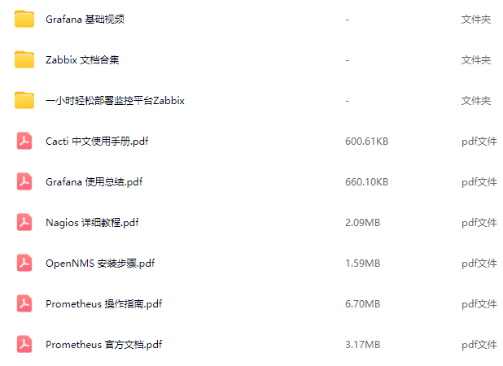
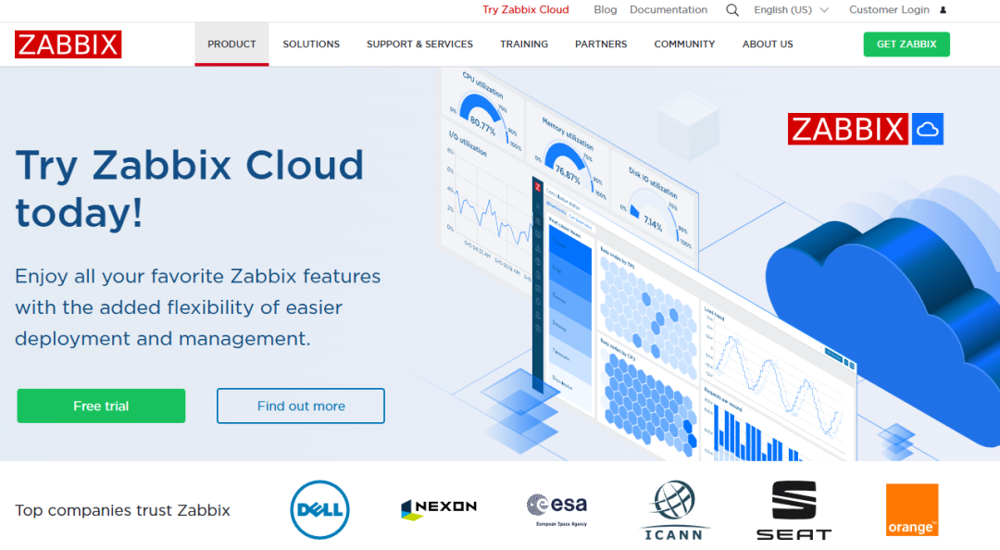
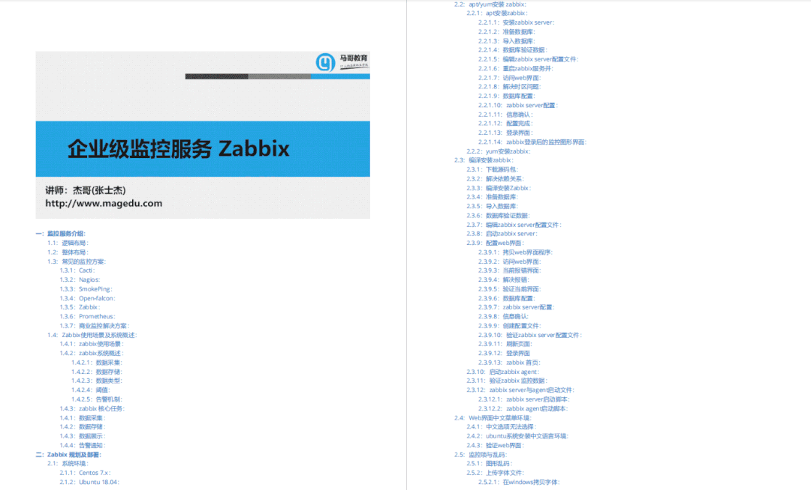

# SRE 的尽头是 Prompt？用 LLM 自动分析 100G 运维日志的工程化复盘

> 原文链接：[SRE 的尽头是 Prompt？用 LLM 自动分析 100G 运维日志的工程化复盘](https://mp.weixin.qq.com/s?__biz=MzAxMTkwODIyNA==&mid=2247611265&idx=2&sn=632d19492364b56c717076f5a5d367ec&chksm=9abe432dac0488b41ba1f7f8ab123748003e2d94bc35799fa0a80ec7c032f49f33f5a0046aed&mpshare=1&scene=1&srcid=02114STu6sxA63dtLbFLZzL8&sharer_shareinfo=43d2d1b763f0c32a5770024718d6c395&sharer_shareinfo_first=43d2d1b763f0c32a5770024718d6c395#rd)

# 一、概述

### 1.1 背景介绍

在生产环境里，“日志量太大”从来不是一个纯技术问题，而是一个工程与组织问题：当你的日志规模从 GB 级增长到 100G/天甚至更高，任何依赖人工&nbsp;`grep`/`kubectl logs`&nbsp;的排障方式都会在高峰期失效。SRE 的真实痛点通常表现为：值班期间告警爆发，定位需要跨服务、跨节点、跨链路，日志分散且字段不统一事故复盘需要给出“时间线 + 根因 + 证据 + 改进项”，但日志粒度过细导致信息噪声远大于信号老问题反复出现，经验沉淀在少数人脑子里，难以规模化复制

LLM 能在这个场景提供新的杠杆：**把大规模非结构化日志快速压缩成可读、可追溯、可复用的结构化结论**。但前提是你不能把 LLM 当成“超强版 grep”，更不能把 100G 日志直接喂给模型。正确的路线是：先用工程手段把数据变成“可检索的证据”，再让模型做“基于证据的分析与总结”。### 1.2 技术特点

**特点一：证据优先（RAG/检索增强）**
让模型只看到与问题相关的“Top-K 证据片段”，并要求输出结论时附带引用（比如&nbsp;`log_id`/`trace_id`/时间范围），避免“看似合理但不可验证”的幻觉。

**特点二：分层压缩（Map-Reduce 总结）**
面对 100G 级别日志，先做“时间窗口/组件维度”的局部总结，再对总结结果聚合，最终形成事故时间线与根因候选。这样成本、延迟与可控性都更好。

**特点三：结构化沉淀（可复用的复盘产物）**
输出不是一段散文，而是可落地的产物：时间线、影响面、根因假设、验证步骤、改进项、可观测性缺口、Runbook 更新建议。### 1.3 适用场景

场景一：值班排障加速（告警 → 关键证据抽取 → 根因候选 → 下一步动作）场景二：事故复盘自动化（自动生成时间线、影响评估、改进项草案，人工审阅定稿）场景三：例行健康报告（每日/每周聚合异常模式、TOP 错误、容量风险与趋势）### 1.4 环境要求

组件版本要求说明操作系统Linux LTS 发行版便于批处理、压缩与稳定运行日志存储Loki/ELK/ClickHouse（二选一或组合）需要支持高吞吐写入与按时间/标签检索Python3.10+用于编排管道、切分、嵌入与总结向量库pgvector/Milvus/Weaviate用于证据检索；小规模可用 pgvector 降组件复杂度LLM 推理内部推理服务或外部 API生产建议：有 SLA、可审计、可限流、可追踪可观测性Prometheus + 日志平台监控“分析任务”本身：吞吐、延迟、失败率、成本## 二、详细步骤

### 2.1 准备工作

#### 2.1.1 系统检查

`# 基础资源检查
free -h
df -hT
ulimit&nbsp;-n

# 时间同步（排查时间线必备）
timedatectl status
`

**说明**：
日志分析的最大敌人是“时间不可信”。NTP 漂移会让时间线拼接失真，导致复盘结论不可靠。#### 2.1.2 安装依赖

`# 常用工具（以 Debian/Ubuntu 为例）
sudo apt update &amp;&amp; sudo apt install -y jq zstd pigz ripgrep

# Python 运行时（建议用 venv/容器固定依赖）
python3 -V
python3 -m venv .venv &amp;&amp; . .venv/bin/activate
pip install -U pip
pip install pyyaml orjson pandas pyarrow fastapi uvicorn&nbsp;"pydantic&gt;=2"
`### 2.2 核心配置

#### 2.2.1 数据预处理：从“原始日志”到“结构化事件”

目标是把“文本行”变成“事件”，至少包含：时间、服务、实例、级别、消息、关键维度（如&nbsp;`trace_id`/`request_id`/`pod`/`node`）。

`# 示例：解压 + 预过滤（先缩小范围，避免无意义地花 token）
zstd -dc /data/logs/app-2025-12-25.log.zst | rg&nbsp;"ERROR|Exception|timeout|OOM"&nbsp;&gt; /data/work/suspect.log

# 示例：把日志行转成 JSONL（实际建议使用 logstash/fluent-bit/Vector）
python - &lt;&lt;&nbsp;'PY'
import json, sys, re
pat = re.compile(r'^(?P&lt;ts&gt;[^ ]+) (?P&lt;level&gt;[A-Z]+) (?P&lt;svc&gt;[^ ]+) (?P&lt;msg&gt;.*)$')
for&nbsp;line&nbsp;in&nbsp;sys.stdin:
&nbsp; &nbsp; line=line.rstrip("\n")
&nbsp; &nbsp; m=pat.match(line)
&nbsp; &nbsp;&nbsp;if&nbsp;not m:
&nbsp; &nbsp; &nbsp; &nbsp;&nbsp;continue
&nbsp; &nbsp; obj=m.groupdict()
&nbsp; &nbsp; obj["raw"]=line
&nbsp; &nbsp;&nbsp;print(json.dumps(obj, ensure_ascii=False))
PY &lt; /data/work/suspect.log &gt; /data/work/suspect.jsonl
`

**说明**：预过滤不是“丢数据”，而是“先救火”。事故定位阶段先抓住高信噪比证据；事后再全量回放补齐细节。真正的工程化建议使用采集侧统一结构化（fluent-bit/Vector/OTel），减少下游解析成本。#### 2.2.2 检索与切分：让 LLM 只看“该看的那几页”

大规模日志分析的关键不是“模型多大”，而是“检索多准”。推荐把每条结构化事件写入日志存储（便于过滤），同时把事件文本切分成可检索片段写入向量库（便于语义检索）。

`# config.yml（示例）
project:
&nbsp;&nbsp;name:&nbsp;log-aiops

data:
&nbsp;&nbsp;input_jsonl:&nbsp;/data/work/suspect.jsonl
&nbsp;&nbsp;time_field:&nbsp;ts
&nbsp;&nbsp;service_field:&nbsp;svc

chunking:
&nbsp;&nbsp;mode:&nbsp;time_window
&nbsp;&nbsp;window_minutes:&nbsp;5
&nbsp;&nbsp;max_events_per_chunk:&nbsp;500

retrieval:
&nbsp;&nbsp;top_k:&nbsp;12
&nbsp;&nbsp;filter_fields:&nbsp;["svc",&nbsp;"level"]

llm:
&nbsp;&nbsp;max_context_chars:&nbsp;18000
&nbsp;&nbsp;temperature:&nbsp;0.1
&nbsp;&nbsp;require_citations:&nbsp;true
`

**参数说明**：`window_minutes`：时间窗口越小越利于时间线，但会增加总结次数；建议先从 5~10 分钟起步。`max_events_per_chunk`：控制单次输入规模，避免把噪声塞进上下文。`top_k`：检索召回数量。过小会漏证据，过大会带入噪声；应通过回放评估校准。`require_citations`：强制“结论必须引用证据”。没有引用的结论默认不可信。#### 2.2.3 分层总结：Map-Reduce 复盘管道（可追溯）

推荐把分析拆成 3 层，形成“可复核”的链路：**Chunk 层**：对每个时间窗口/服务的证据片段做局部总结（输出：异常摘要、关键日志、候选原因、下一步验证）**Service 层**：把同一服务的多个窗口总结聚合成服务级时间线（输出：事件序列、依赖关系、关键拐点）**Incident 层**：跨服务合并，输出最终复盘草案（输出：时间线、影响评估、根因假设、证据引用、改进项）

`提示词（建议版本化管理）：
你是资深 SRE。请基于【证据片段】输出：
1) 异常摘要（不超过 5 条）
2) 关键证据列表（每条必须包含时间与 log_id）
3) 根因候选（按置信度排序，并说明为何）
4) 下一步验证步骤（可执行、可回滚）
约束：不得编造未出现的事实；若证据不足，明确标注“不确定/缺失什么证据”。
`### 2.3 启动和验证

#### 2.3.1 启动分析任务

`# 示例：跑一次离线分析（实际命令按你的实现替换）
python analyse_logs.py --config /data/work/config.yml --out /data/out/report.md
`#### 2.3.2 功能验证

`# 产物检查（重点：是否可追溯）
rg -n&nbsp;"log_id|trace_id|证据|时间线|不确定"&nbsp;/data/out/report.md
`

**预期输出**：
报告中包含可复核的证据引用与时间范围；若模型给出结论但没有证据引用，应判定为失败并回到检索/切分阶段调整。## 三、示例代码和配置

### 3.1 完整配置示例

#### 3.1.1 主配置文件

`# 文件路径：/data/work/config.yml（示例）
project:
&nbsp;&nbsp;name:&nbsp;log-aiops

data:
&nbsp;&nbsp;input_jsonl:&nbsp;/data/work/suspect.jsonl
&nbsp;&nbsp;time_field:&nbsp;ts
&nbsp;&nbsp;service_field:&nbsp;svc
&nbsp;&nbsp;keep_raw:&nbsp;true

chunking:
&nbsp;&nbsp;mode:&nbsp;time_window
&nbsp;&nbsp;window_minutes:&nbsp;10
&nbsp;&nbsp;max_events_per_chunk:&nbsp;800

retrieval:
&nbsp;&nbsp;top_k:&nbsp;16
&nbsp;&nbsp;min_level:&nbsp;ERROR

output:
&nbsp;&nbsp;report_md:&nbsp;/data/out/report.md
&nbsp;&nbsp;timeline_json:&nbsp;/data/out/timeline.json
`#### 3.1.2 辅助脚本

`#!/bin/bash
# 文件名：/data/work/run_daily_digest.sh
set&nbsp;-euo pipefail

day="${1:-$(date -d 'yesterday' +%F)}"
in="/data/logs/app-$day.log.zst"
work="/data/work/$day"
out="/data/out/$day"

mkdir -p&nbsp;"$work"&nbsp;"$out"

zstd -dc&nbsp;"$in"&nbsp;| rg&nbsp;"ERROR|Exception|timeout|OOM"&nbsp;&gt;&nbsp;"$work/suspect.log"
python parse_to_jsonl.py &lt;&nbsp;"$work/suspect.log"&nbsp;&gt;&nbsp;"$work/suspect.jsonl"
python analyse_logs.py --config&nbsp;"$work/config.yml"&nbsp;--out&nbsp;"$out/report.md"
echo&nbsp;"ok day=$day&nbsp;out=$out/report.md"
`### 3.2 实际应用案例

#### 案例一：值班快速定位（告警 → 证据 → 行动）

**场景描述**：
告警触发后，SRE 需要在 5~10 分钟内给出“下一步动作”，而不是“可能原因列表”。LLM 的价值在于：从海量日志中快速抽取证据并给出可执行的验证步骤。

**实现步骤**：用告警标签/服务名/时间范围对日志做初筛对候选错误模式做语义检索与聚合（同类错误合并）输出“证据 + 置信度 + 下一步动作”，并把动作写进 Runbook 草案#### 案例二：事故复盘初稿生成（人审定稿）

**场景描述**：
复盘最耗时的不是“写”，而是“整理证据与时间线”。让 LLM 生成初稿，SRE 负责校验与补充，通常能显著缩短复盘周期。

**实现步骤**：生成跨服务时间线（按分钟级聚合）生成根因候选与证据引用输出改进项建议（观测缺口、限流降级、发布治理、容量规划）## 四、最佳实践和注意事项

### 4.1 最佳实践

#### 4.1.1 性能优化

**优化点一：先过滤后检索，先结构化后总结**
100G 的核心处理原则是“减少无效输入”。优先通过标签/时间/级别过滤，再做语义检索，最后交给 LLM 总结。

`# 先按时间范围与关键字切片，再做聚合
rg&nbsp;"2025-12-25T12:"&nbsp;/data/work/suspect.log | rg&nbsp;"timeout|deadline"&nbsp;| head -2000 &gt; /data/work/slice.log
`

**优化点二：缓存与去重**
对重复错误模板进行去重（按 message template 或哈希），可显著降低嵌入与总结成本。

**优化点三：提示词版本化 + 回放评估**
Prompt 不是玄学。对每次提示词调整，用历史事故数据回放评估，并记录“召回率/可读性/误导率”。#### 4.1.2 安全加固

**安全措施一：最小权限与审计**
分析管道通常只需要读日志与写报告。对任何可能触发执行动作的接口（重启、扩容、回滚）必须启用人审门禁。

**安全措施二：敏感信息处理**
在进入向量库与 LLM 之前对日志做脱敏（token、手机号、身份证、Cookie、密钥）。脱敏策略必须可配置、可审计。

**安全措施三：证据引用强约束**
没有证据引用的结论默认不可信。把“引用”当作产品能力而不是写作习惯。#### 4.1.3 高可用配置

**HA 方案一：分析任务幂等化**：同一时间范围重复跑不会写坏结果，产物带版本与时间戳**HA 方案二：分层降级**：LLM 不可用时仍输出结构化统计（TOP 错误、时间分布、关联服务）**备份策略**：原始日志、结构化事件、向量索引与报告都要分层备份，便于复盘复现### 4.2 注意事项

#### 4.2.1 配置注意事项

**警告**：不要让 LLM 直接读取“全量日志”并输出“根因结论”。在证据不可追溯的情况下，这会制造新的事故风险（误导排障方向、增加 MTTR）。注意事项一：先做“证据抽取”，再做“根因推断”注意事项二：输出必须包含引用与不确定性说明注意事项三：把“人审”写进流程，尤其是涉及执行动作时#### 4.2.2 常见错误

错误现象原因分析解决方案报告看起来合理但不可复核没有证据引用或引用不稳定强制引用&nbsp;`log_id/时间范围`；固化检索条件结论经常跑偏检索召回不准、噪声太大优化切分策略；加入过滤字段；提升结构化质量成本/耗时不可控输入规模过大、重复计算引入去重与缓存；控制窗口与 top_k；分层总结#### 4.2.3 兼容性问题

**版本兼容**：日志字段演进要有版本；结构化解析器要能兼容旧格式**平台兼容**：不同日志后端（Loki/ES/ClickHouse）查询语法不同，需要适配层**组件依赖**：向量库与嵌入模型升级需灰度与回放评估，避免检索质量突变## 五、故障排查和监控

### 5.1 故障排查

#### 5.1.1 日志查看

`# 分析任务自身日志（示例）
tail -f /data/logs/log-aiops/pipeline.log
`#### 5.1.2 常见问题排查

**问题一：召回证据不相关**

`# 快速抽样检查检索结果（示例）
jq -r&nbsp;'.retrieval_hits[] | "\(.score)\t\(.svc)\t\(.ts)\t\(.text[0:120])"'&nbsp;/data/out/debug.json | head -30
`

**解决方案**：增加过滤字段（服务名、级别、环境）优化切分策略（按时间窗口/trace_id 聚合）对嵌入模型/索引参数做回放评估并灰度升级

**问题二：报告生成耗时过长**

`# 检查是否被 IO 或 CPU 限制
iostat -x 1
top
`

**解决方案**：
优先排查输入规模是否过大；引入去重与缓存；把“全量分析”拆成离线批处理与在线快速通道。### 5.2 性能监控

#### 5.2.1 关键指标监控

`# 建议采集的指标（示例：按实际系统输出）
# - pipeline_events_total
# - pipeline_duration_seconds
# - llm_tokens_total
# - retrieval_latency_seconds
`#### 5.2.2 监控指标说明

指标名称正常范围告警阈值说明处理吞吐依规模而定持续下降可能是 IO/索引/限流导致失败率接近 0&gt; 1%需要区分可重试与不可重试token 消耗稳定可控突增可能是切分失控或 top_k 过大检索延迟稳定持续升高向量库压力或索引退化#### 5.2.3 监控告警配置

`# Prometheus 规则示例（骨架）
groups:
&nbsp;&nbsp;-&nbsp;name:&nbsp;log-aiops
&nbsp; &nbsp;&nbsp;rules:
&nbsp; &nbsp; &nbsp;&nbsp;-&nbsp;alert:&nbsp;LogAIOpsPipelineFailureRateHigh
&nbsp; &nbsp; &nbsp; &nbsp;&nbsp;expr:&nbsp;rate(pipeline_failures_total[10m])&nbsp;/&nbsp;rate(pipeline_runs_total[10m])&nbsp;&gt;&nbsp;0.01
&nbsp; &nbsp; &nbsp; &nbsp;&nbsp;for:&nbsp;10m
&nbsp; &nbsp; &nbsp; &nbsp;&nbsp;labels:
&nbsp; &nbsp; &nbsp; &nbsp; &nbsp;&nbsp;severity:&nbsp;warning
&nbsp; &nbsp; &nbsp; &nbsp;&nbsp;annotations:
&nbsp; &nbsp; &nbsp; &nbsp; &nbsp;&nbsp;summary:&nbsp;"日志分析管道失败率升高"
`### 5.3 备份与恢复

#### 5.3.1 备份策略

`#!/bin/bash
# 备份脚本示例（建议把日志/索引/报告分层归档）
set&nbsp;-euo pipefail

ts="$(date +%Y%m%d-%H%M%S)"
tar -czf&nbsp;"/backup/log-aiops-$ts.tgz"&nbsp;/data/work /data/out
echo&nbsp;"backup_ok=$ts"
`#### 5.3.2 恢复流程

**恢复数据**：恢复结构化事件与索引（或重建索引）**验证完整性**：抽样比对报告引用的&nbsp;`log_id`&nbsp;是否存在**重跑分析**：对关键事故做回放复现，确保结论一致## 六、总结

### 6.1 技术要点回顾

**要点一**：先结构化、再检索、后总结；让模型基于证据输出**要点二**：100G 级别需要分层压缩（Map-Reduce）与成本控制（去重/缓存/窗口化）**要点三**：输出产物要可追溯、可复核、可沉淀（时间线/证据/改进项）**要点四**：AIOps 要有“人审门禁”，把风险控制写进流程### 6.2 进阶学习方向

**方向一：日志结构化与异常聚类**学习资源：Drain3/日志模板挖掘、ClickHouse 工程实践实践建议：把“字段统一”作为平台能力，减少业务侧自由发挥

**方向二：RAG 评估与检索质量工程**学习资源：检索评估指标（Recall@K/MRR）、离线回放实践建议：把历史事故做成评测集，任何变更先回放再灰度

**方向三：运维知识库与自动化闭环**学习资源：Runbook 工程化、事件驱动自动化实践建议：先做“建议与证据”，后做“自动执行”### 6.3 参考资料

OpenTelemetry 文档&nbsp;- 结构化日志、追踪与关联 IDPrometheus 文档&nbsp;- 指标与告警最佳实践ClickHouse 文档&nbsp;- 大规模日志分析与查询优化Vector 文档&nbsp;- 日志采集与结构化处理## 附录

### A. 命令速查表

`# 快速过滤与抽样
rg&nbsp;"ERROR|Exception"&nbsp;/data/work/suspect.log | head -200

# 解压与并行压缩
zstd -dc file.log.zst | pigz -c &gt; file.log.gz

# JSONL 抽样
head -100 /data/work/suspect.jsonl | jq .
`### B. 配置参数详解

`window_minutes`：时间窗口粒度，影响时间线精度与成本`top_k`：检索召回数量，影响漏检与噪声引入`require_citations`：强制引用，提升可追溯性，降低误导风险### C. 术语表

术语英文解释检索增强生成RAG先检索证据再生成答案，减少幻觉并提升可追溯性时间线Timeline以时间顺序组织的关键事件与证据可追溯Traceable结论可通过日志/指标/变更记录进行复核

**文末福利**

**
**

网络监控是保障网络系统和数据安全的重要手段，能够帮助运维人员及时发现并应对各种问题，及时发现并解决，从而确保网络的顺畅运行。

谢谢一路支持，给大家分享6款开源免费的网络监控工具，并准备了对应的资料文档，建议运维工程师收藏（文末一键领取）。

**备注：【监控合集】****
**

**
**

**100%免费领取**
### 一、zabbix

 ### 二、Prometheus

内容较多，6款常用网络监控工具（zabbix、Prometheus、Cacti、Grafana、OpenNMS、Nagios）不再一一介绍，&nbsp;需要的朋友扫码备注【监控合集】，即可100%免费领取。

**&nbsp;以上所有资料获取请扫码****备注：【监控合集】****
**

**
**

**100%免费领取**

**（后台不再回复，**扫码一键领取）****

