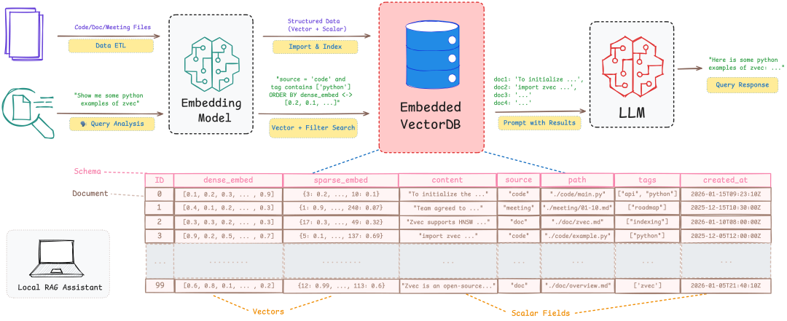
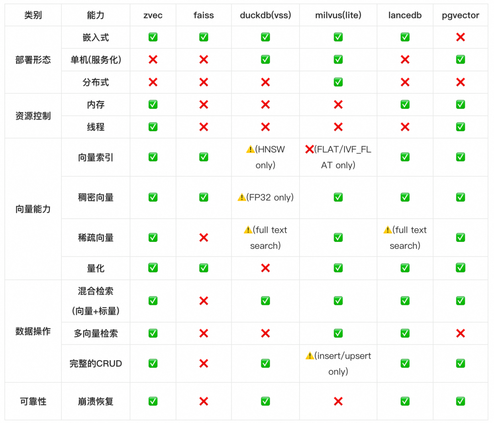
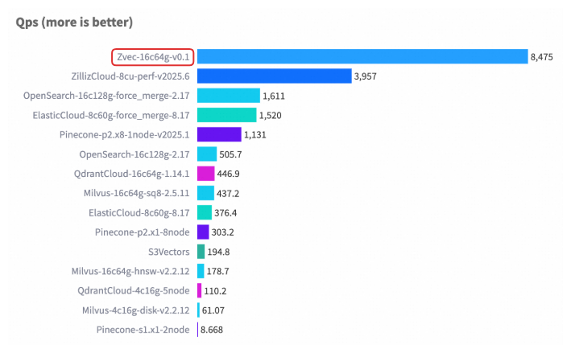
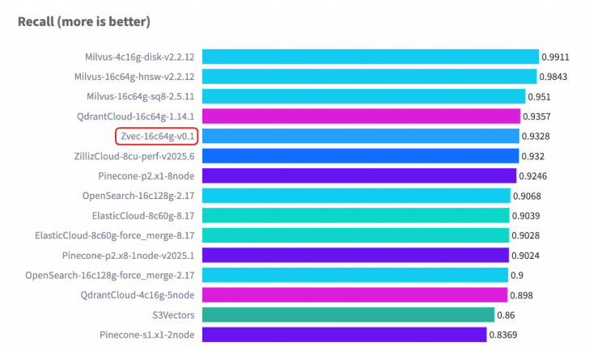
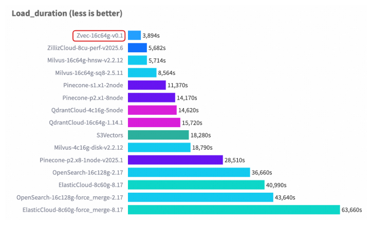
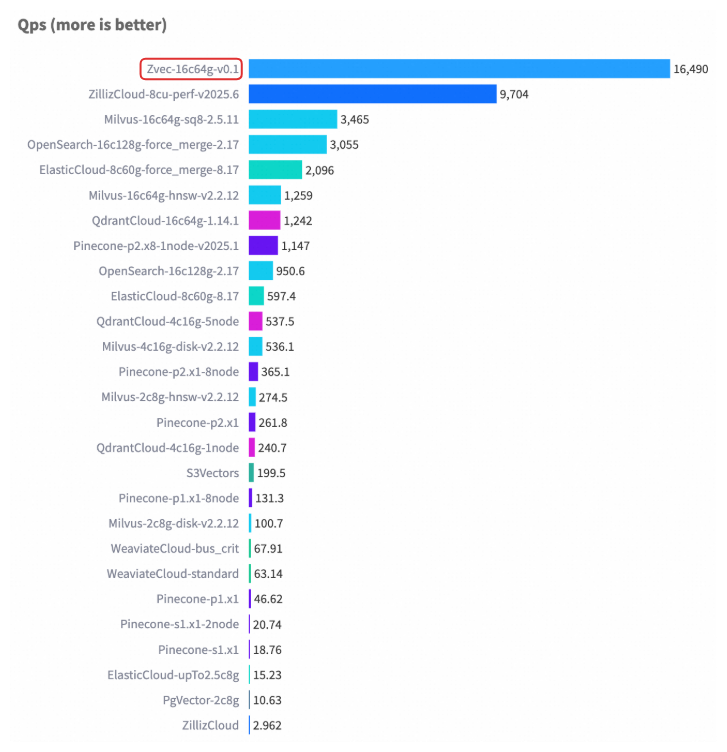
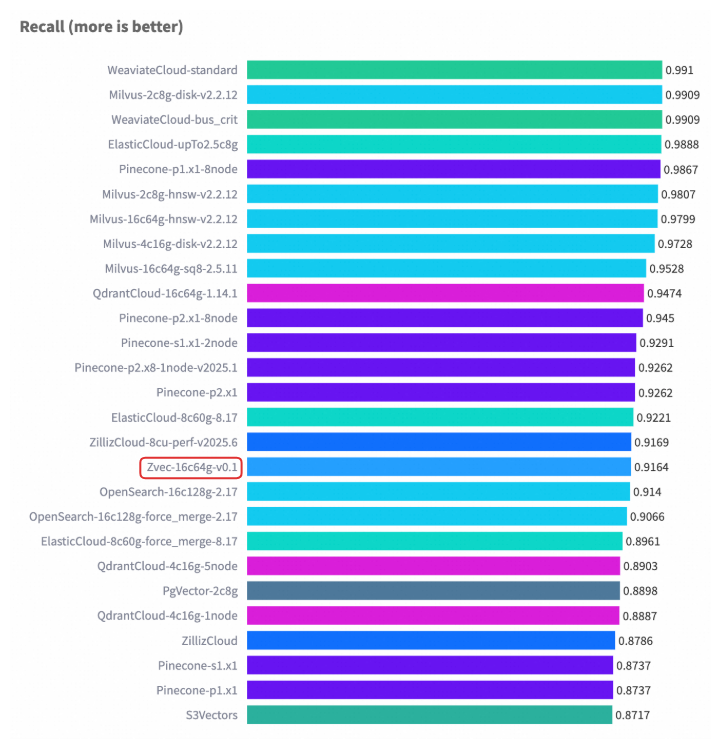
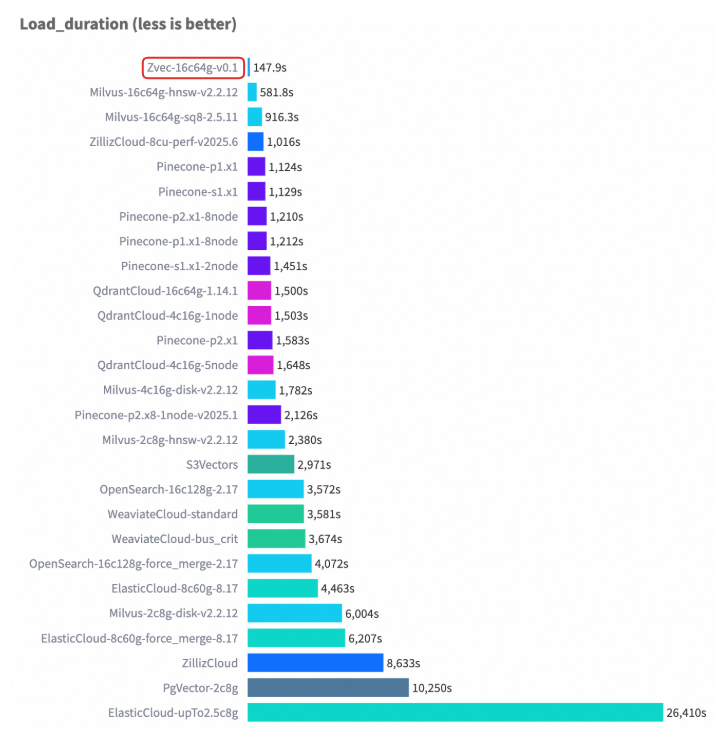
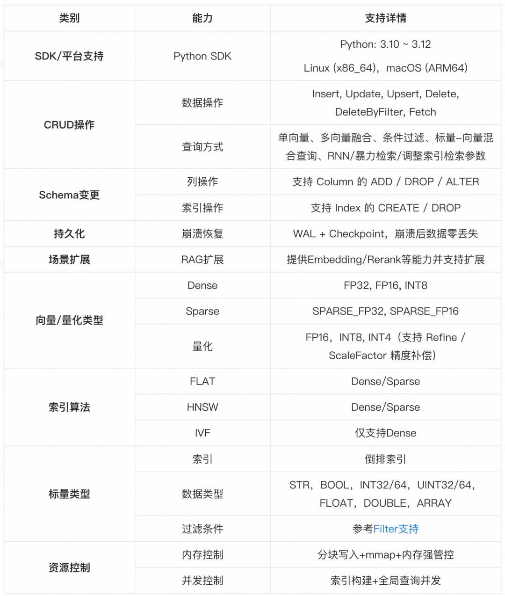

# Zvec: 开箱即用、高性能的嵌入式向量数据库

> 原文链接：[Zvec: 开箱即用、高性能的嵌入式向量数据库](https://mp.weixin.qq.com/s/4t5QTUghdqVU-aTYbj0X-w)

**摘要**：Zvec 是一款类 SQLite 的轻量级嵌入式向量数据库，专为终端侧设计，具备开箱即用、资源可配置、极致性能以及多样化向量能力四大核心优势。基于Apache 2.0协议开源，Zvec 旨在为开发者提供从原型验证到端侧生产部署的一站式解决方案。欢迎体验 Zvec，期待你的使用、反馈与贡献！### 1. 背景

过去几年，向量检索已从搜索与推荐系统的后台组件，演变为智能应用的通用数据基础设施。尤其在 RAG（Retrieval-Augmented Generation）兴起后，开发者不再只为搜推广场景构建向量系统，而是为任意知识问答、语义理解或智能助手嵌入“语义记忆”。与之同时，向量检索技术也从云端下沉至终端设备（如PC、手机），驱动因素包括：**开发者门槛降低**：LangChain 等框架降低向量检索使用门槛，向量能力成为开发者标配；**终端设备算力提升**：边缘AI趋势下，端侧算力持续提升，支持本地向量计算与存储；**数据隐私与低延迟刚需**：医疗/金融等场景要求数据本地处理，AR/自动驾驶需低延迟响应。

以典型终端应用场景 ——&nbsp;**PC/手机端本地 RAG 助手**&nbsp;为例：用户在无网络环境下，通过自然语言查询本地代码库、技术文档或会议记录。系统需同时支持向量与标量（如时间、文件类型、标签等）字段的存储，并提供向量 检索、以及基于时间、文件类型等标量属性的混合过滤；知识库会随本地文件动态增删改，则要求系统提供完整的 CRUD 能力；作为终端应用，其内存与后台资源占用必须严格受限，并能在进程崩溃或强制退出后可靠恢复数据；此外，启动与查询响应延迟需足够低，方可融入开发者日常工作流。

然而，现有技术方案在上述场景下存在适配缺口：**纯索引库（如Faiss）**：缺乏标量属性存储、混合查询、完整 CRUD 以及崩溃恢复等数据库能力，需大量外围工程实现生产级功能，工程成本显著；**嵌入式方案（如DuckDB-VSS）**：向量功能受限，包括向量索引类型单一、不支持量化压缩、运行时内存等资源不可控等，在 PC 端易因内存或 CPU 占用过高影响系统整体性能；**服务化方案（如Milvus）**：依赖独立进程与网络通信，架构复杂、资源开销大，无法嵌入 CLI 工具、桌面应用或移动客户端，且运维负担重，与终端场景存在天然适配障碍。### 2. What is Zvec?

为了满足上述需求，我们开源了&nbsp;**Zvec**&nbsp;—— 以嵌入式架构，提供极致性能、零依赖、生产可用的向量能力，让向量检索像 SQLite 一样简单、可靠、随处可嵌。

Zvec 的核心设计目标是&nbsp;**让高质量的向量能力触手可及**，设计宗旨包括：**嵌入式**：纯本地运行，无需网络或独立服务，零配置迅速启动；运行时资源（如内存）可控，接口设计简洁，并易于集成和扩展，可无缝嵌入终端应用、CLI 工具、AI 框架或数据库系统；**向量原生**：全栈面向向量工作负载设计，提供丰富的高质量索引与量化能力，满足不同资源约束下的需求，并深度适配各类硬件平台；支持丰富的向量检索模式，覆盖 RAG、多模态搜索等应用需求；**生产就绪**：以稳定性为核心，通过持久化存储、线程安全访问与崩溃自动恢复等机制，确保在手机、CLI、车载等无运维终端环境中长期可靠运行，避免因异常退出导致数据丢失或状态不一致。### 3. Why Zvec?

Zvec 在保证易用性的同时，相比于其他端侧向量数据库方案，提供更完整的检索功能、更强的资源管控能力以及更出色的检索性能，关键对比如下：#### 3.1 开箱即用：一分钟搭建向量检索应用

凭借**一键安装**（无需部署服务、依赖极少），以及**极简的 API 设计**，Zvec 达到了**开箱即用**的使用体验。Python 用户通过&nbsp;`pip install zvec`&nbsp;即可将向量能力直接嵌入应用，通过三步 API（`create_and_open → insert → query`）即可构建本地语义搜索原型，从安装到运行不超过一分钟。

Zvec Python SDK（v0.1.0）现已发布，欢迎开发者即刻体验：

**一键安装**

`pip install zvec
`

**One-Minute Example**

`import&nbsp;zvec

# Define collection schema
schema = zvec.CollectionSchema(
&nbsp; &nbsp; name="example",
&nbsp; &nbsp; vectors=zvec.VectorSchema("embedding", zvec.DataType.VECTOR_FP32,&nbsp;4),
)

# Create collection
collection = zvec.create_and_open(path="./zvec_example", schema=schema,)

# Insert documents
collection.insert([
&nbsp; &nbsp; zvec.Doc(id="doc_1", vectors={"embedding": [0.1,&nbsp;0.2,&nbsp;0.3,&nbsp;0.4]}),
&nbsp; &nbsp; zvec.Doc(id="doc_2", vectors={"embedding": [0.2,&nbsp;0.3,&nbsp;0.4,&nbsp;0.1]}),
])

# Search by vector similarity
results = collection.query(
&nbsp; &nbsp; zvec.VectorQuery("embedding", vector=[0.4,&nbsp;0.3,&nbsp;0.3,&nbsp;0.1]),
&nbsp; &nbsp; topk=10
)

# Results: list of {'id': str, 'score': float, ...}, sorted by relevance&nbsp;
print(results)
`#### 3.2 极致性能：满足端侧实时交互需求

基于阿里巴巴通义实验室自研的高性能向量引擎 Proxima，通过深度优化——包括 **多线程并发，内存布局优化，SIMD 加速，CPU 预取 **等技术优化策略，Zvec 显著提高了索引构建与查询流程的计算效率，实现了低延迟、高吞吐的向量检索能力，端侧资源受限场景下也能做到实时交互。

在&nbsp;**VectorDBBench**&nbsp;的典型场景（Cohere 10M 数据集）中，Zvec 在相当硬件配置以及对齐 Recall 水平的前提下，**检索吞吐超过了 8000 QPS，是此前榜单首位（ZillizCloud）的 2 倍以上，同时构建延迟大幅缩短**，展现出全面领先的性能优势。

**Cohere 10M Performance Case**

**Cohere 1M Performance Case**

#### 3.3 资源可控：适配CLI、移动端等资源受限环境

在移动端、Serverless 函数或 CLI 工具等资源受限环境中，向量系统必须对内存与 CPU 使用具备明确边界，否则极易因资源超限导致应用崩溃或系统干预（如 Linux OOM Killer 或 Android ANR）。Zvec 从架构层面内置资源约束机制，确保在有限资源下稳定运行。

**内存控制：向量索引适配有限内存，避免 OOM**

HNSW 等图索引在构建或查询阶段可能瞬时占用数倍于原始数据的内存。为避免此类不可控行为，Zvec 提供三层内存管理机制：**流式分块写入**：写入默认采用 64MB 分块流式处理，避免全量数据驻留内存，兼顾写入效率和内存占用；**mmap按需加载**：支持通过&nbsp;`enable_mmap=true`&nbsp;启用内存映射模式。在此模式下，向量与索引数据由操作系统按需换入物理内存，即使总数据量超过可用 RAM，亦可避免 OOM；**强内存管控[Experimental]**&nbsp;：当未启用`mmap`时，进入强内存管控管控模式，Zvec会维护一个隔离的、进程级的内存池，用户可通过`memory_limit_mb`参数显式限定该内存池的预算上限。

**并发控制：避免线程资源侵占，保障主线程响应性**

在 GUI 应用（如桌面工具、手机 App）中，无约束的向量计算可能启动大量线程，耗尽 CPU 资源，导致 UI 卡顿或调度器惩罚。Zvec 提供细粒度并发调控能力：**索引构建并发控制**：所有索引创建接口均支持&nbsp;`concurrency`&nbsp;参数，用于指定构建阶段的并行线程数；同时可通过全局&nbsp;`optimize_threads`&nbsp;参数限制进程内最大构建并发，防止后台任务抢占前台资源；**查询并发控制**：通过&nbsp;`query_threads`&nbsp;全局参数，用户可限定查询阶段的最大并发线程数。#### 3.4 应用就绪：RAG场景下向量能力全覆盖

Zvec 从设计之初即以 RAG 场景为首要目标，向量能力完整覆盖 RAG 全生命周期，体现为以下核心能力：

**动态知识库管理**提供了完整的 CRUD 能力，允许用户实时更新私有知识，满足知识动态更新需求；支持Schema变更，便于根据元数据演进或查询模式动态选择最优索引策略。

**多路召回与融合**原生支持多向量联合查询，轻松实现 RAG 中的 多路语义 以及 语义+关键词 召回；内置默认重排序器（支持加权融合与 RRF 等策略），自动完成多路结果融合与排序，无需应用层手动合并。

**标量-向量混合查询**支持标量过滤条件下推至向量索引执行层，避免高维空间中的全量扫描，显著提升混合查询效率；标量字段可选建倒排索引，加速等值/范围过滤，进一步优化混合检索性能。#### 3.5 能力总览

### 4. 后续规划

一个真正“随手可用”的向量数据库，需要持续打磨。接下来，我们将聚焦四个方向持续迭代：**开发体验优化**：完善 CLI 工具和 多语言 SDK、LangChain/LlamaIndex 集成，面向典型场景完善扩展；**能力纵向扩展**：持续增强索引能力，打造分组查询等向量特色能力，并持续跟进主流性能榜单；**生态协同共建**：推进 DuckDB /PostgreSQL 向量扩展集成、外表（Parquet/CSV）支持，参与生态共建；**场景闭环验证**：与 ISV、硬件厂商合作，打磨端侧（iOS/Android/Nvidia Jetson）真实交付案例。### 5. 加入我们

Zvec 以 Apache 2.0 协议开源，目标是让向量能力触手可及——轻量、可靠、无许可壁垒。

无论你是开发者、用户还是生态伙伴，都欢迎参与：**代码**：C++/Python/Rust 开发、测试、性能优化；**文档**：教程、示例、API 注释；**场景**：分享 RAG、推荐、端侧智能等实践；**生态**：集成 LangChain/LlamaIndex，联动 DuckDB/PostgreSQL 等。

项目刚刚起步，期待与你一起打造真正可用的嵌入式向量基础设施。

