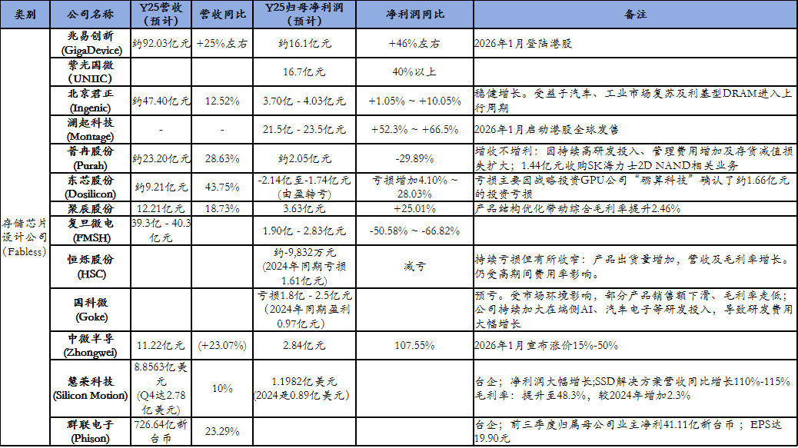
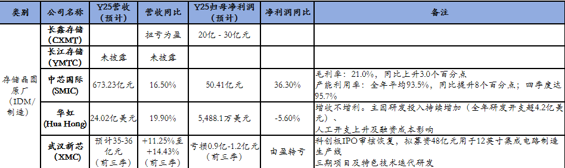
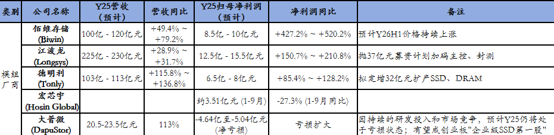
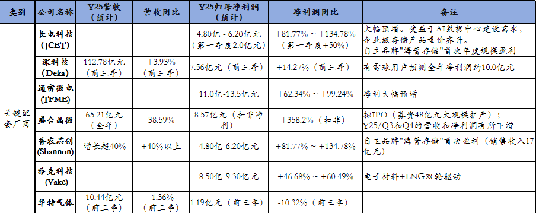

# 一文概览国产核心存储厂商2025年度业绩

> 原文链接：[一文概览国产核心存储厂商2025年度业绩](https://mp.weixin.qq.com/s/3q-06tcM_BFT_QU674s04A)

 **点击蓝字关注**&nbsp;**了解更多内容**2025年是国产存储厂商的丰收年。

受益于AI服务器需求的激增以及主流存储巨头产能向HBM等高端产品转移导致的供给紧张，存储产品价格自Y25H2起快速回升。

整理部分已披露业绩预告的存储核心厂商在Y25年表现：

 

从上表可看出虽然存储行业整体处于上行周期，但不同公司的最终利润表现却大相径庭。

例如百维存储在Y25Q4归母净利润YoY达219.9%~278.4%，成为全年业绩的“引爆点”。

香农芯创通过精准卡位AI数据中心需求，实现利润的爆发式增长。

但像复旦微电、东芯股份则分别因高额的存货减值计提和对外投资亏损，导致主业向好但整体利润承压。

**附：国产核心存储厂商的简介**

**存储芯片原厂(IDM&amp;Foundry)**

这类公司是直接负责存储芯片的制造与研发。

‌长江存储(YMTC)‌：

国内3D NAND闪存领域的绝对龙头，自主研发的Xtacking架构技术领先，量产232层、294层NAND。

Y25年全球市场份额约10%，预计Y26年底升至13%。‌

‌长鑫存储(CXMT)‌：

国内唯一DRAM大规模量产的企业。

其19nm工艺良率超95%，DDR5/ LPDDR5X产品性能成熟。

Y25 年CX的全球市占约 5%，正积极布局那个啥以满足AI算力需求。‌

中芯国际(SMIC)：

中国大陆规模最大、技术最先进的晶圆代工企业，世界领先的集成电路晶圆代工企业之一。

福建晋华 (JHICC)：

专注于DRAM(动态随机存取存储器)的研发与制造。

华虹半导体(Hua Hong)：

专注于嵌入式/独立式非易失性存储器、功率器件、模拟与电源管理、逻辑与射频等特色工艺平台的研发和制造，是全球领先的特色工艺晶圆代工企业之一。

其技术平台覆盖从0.35微米至55纳米的主流节点，并在部分领域如嵌入式闪存、IGBT、超级结MOSFET等方面具备全球竞争力。

上海华力(Huali)：

华虹集团旗下的集成电路晶圆代工企业，拥有先进的12英寸集成电路生产线。

工艺技术覆盖逻辑/射频/嵌入式存储等、65/55纳米至28纳米节点‌；是本土重要的特色工艺代工平台。

武汉新芯(XMC)：

国内领先的半导体特色工艺晶圆代工企业，以特色存储为支撑、三维集成技术为牵引，产品覆盖汽车电子、工业控制等领域。

目前公司称亏损主要由于产能扩张、研发投入增加及汇兑损失扩大所致。

**存储芯片设计公司(Fabless)**

这类公司专注于芯片设计。

‌兆易创新(GigaDevice)‌：

NOR Flash全球市占 18.5%，市占率稳居前3(国内第1)；利基型 DRAM 国内领先，与长鑫深(独)度(家)合(代)作(工)。

其19nm车规存储通过AEC Q100认证，覆盖工业与车载场景。

‌紫光国微(UNIIC)‌：

作为新紫光集团的核心子公司，是国内特种集成电路和智能安全芯片的龙头企业。

其在存储领域布局广泛，尤其在三维堆叠DRAM(SeDRAM®)技术上取得标志性突破，为AI芯片提供超高带宽内存解决方案。

紫光国芯 (UniGroup)：

全称通常是西安紫光国芯半导体有限公司，主要以DRAM存储芯片和技术服务为核心业务。

2025年12月已完成北交所上市辅导备案。

紫光展锐(UNISOC)：

国内领先的泛芯片设计平台，主营移动通信和物联网领域的核心芯片。

产品包括手机处理器(5G SoC)、基带芯片、射频芯片等，全球智能手机芯片市占率稳居前列。

已启动IPO辅导，目标在科创板上市，成为“国产智能手机芯片第一股”。‌

‌北京君正(Innovusion)‌：

车规级存储芯片领先企业，车规存储市占率位居国内前列、深度绑定头部车企。

其产品主要应用于汽车的各类智能化系统，车载存储渗透率稳步提高。

其SRAM产品在全球市场占据重要份额。‌

‌东芯股份(Dosilicon)‌：

目前国内A股唯一同时覆盖NAND、NOR、DRAM全品类的Fabless公司。

专注于中小容量存储芯片。在IOT、工业和车载市场优势显著。

SLC NAND为核心，产品已通过车规级AEC-Q100验证，并在多款车型中实现量产。

慧荣科技(Silicon Motion, SIMO)：

全球NAND闪存主控芯片领导厂商，产品涵盖SSD控制芯片、eMMC/UFS控制芯片等，是存储产业链上游的核心企业。

群联电子(Phison)：

全球领先的快闪记忆体控制芯片设计及周边应用整合厂商(市占超 50%。)，业务涵盖主控芯片、SSD模组等。

芯天下(XTX&nbsp;)：

专注于代码型闪存芯片(NOR Flash、SLC NAND Flash)，在该领域全球排名第6。

目前正处于冲刺港股IPO的关键阶段。

产品已进入三星、美的、科沃斯、中兴通讯等知名品牌供应链，广泛应用于网络通讯、消费电子、智能家居、物联网、工业医疗、汽车电子等领域。

普冉股份(Puya)‌：

在NOR Flash、EEPROM细分领域表现突出，同时推行“存储+”战略，拓展微控制器领域。

聚辰股份(Giantec)：

EEPROM 全球市占 10%(国内第一)、全球第三大SPD供应商(内存模组配套芯片)。

业内少数具备工业级与汽车级EEPROM研发能力的企业之一。

OIS音圈马达驱动芯片在主流手机品牌实现商用。

车规级 EEPROM 进入特斯拉、比亚迪供应链。

复旦微电 (FMSH)：

产品线覆盖安全与识别芯片、非挥发存储器、FPGA及MCU等，在FPGA领域技术优势明显。

国科微 (Goke)：

国内领先的固态存储、视频编解码及物联网芯片设计企业，产品广泛应用于超高清智能显示、安防监控、汽车电子等领域。

恒烁股份(HSC)：

主营NOR Flash存储芯片和MCU芯片，致力于成为一家“存储+控制”一体化解决方案的芯片设计公司。

中微半导(Zhongwei)：

专注于高性价比的混合信号芯片设计，产品线从MCU拓展至电源管理、ASIC及近日切入的NOR Flash存储芯片，为客户提供一站式芯片解决方案。

江苏扬贺扬微电子：

NAND Flash存储芯片；入选国家级专精特新"小巨人"。

掌握晶圆架构优化技术，模组成本较市场低25%-30%。

存储模组厂/方案商

‌德明利(Dmingli)‌：

专注于存储主控芯片研发及模组方案，实现“芯片+算法+场景”全栈自研。

产品产品覆盖SSD、嵌入式存储和移动存储全品类；适配AI终端与服务器需求。‌

‌佰维存储(Biwin)‌：

聚焦NAND闪存模组与工业消费级SSD；为AI终端/服务器核心配套厂商。

自研主控芯片实现批量交付；高端存储模组出货量快速提升，算力配套能力领先。‌

在AI/AR眼镜等端侧AI市场卡位核心，已进入Meta、Rokid等知名品牌供应链。

‌江波龙(Longsys)‌：

全球前2、中国最大的独立存储器企业，拥有“行业级(FORESEE)和国际消费级(Lexar)”双品牌。

全场景存储模组布局，企业级SSD市占率约12%、收入占比升至 30%。

深度绑定长存，高端SSD批量出货，数据中心与工业存储双轮驱动。

大普微 (DapuStor)：

企业级 SSD 核心企业，专注于数据中心和企业级智能SSD解决方案。

PCIe 4.0/5.0 SSD 适配 AI 服务器，国内企业级 SSD 份额稳步提升。

宏芯宇 (Hosin Global)：

全球第5、中国内地第2大独立存储器厂商。

客户包括小米、传音、OPPO等，并已进入汽车Tier 1供应链

泽石科技(ZhiShi)：

属于国内少数拥有主控、固件及SSD完整研发能力的厂商，产品覆盖消费级、工业级和企业级SSD。

宏杉科技 (Macrosan)：

企业级存储系统和解决方案提供商；常年在主存储阵列市场中位列国内厂商前五。

主要面向数据中心、云计算、政府、金融等企业级客户销售存储整机。

天硕 (TOPSSD)：

专注于航天级、军工级高可靠固态存储，是国内极少数能做到全栈自主创新(主控、闪存全链路国产化)的企业。

忆联 (Union Memory)：

企业级与数据中心SSD；是记忆科技的子公司。在互联网、云服务商数据中心有规模部署案例。

**关键配套厂商**

这类公司为存储芯片生产提供核心材料、封测服务或进行分销。

‌澜(蓝)起科技(Montage)‌：

全球内存接口芯片绝对龙头，DDR5 RCD芯片市占率超40%-45%。

参与行业标准制定，HBM 配套芯片技术领先；是AI服务器的核心供应商。

‌长电科技(JCET)‌：

国内存储封测龙头，掌握HBM封测核心技术，具备2.5D、3D封装能力，AI芯片封测订单占比持续提升。

公司表示将继续聚焦高性能计算、存储、汽车电子等核心业务领域。‌

‌深科技(Deka)‌：

存储封测+模组双主业，积极布局HBM封测，产能利用率维持高位(合肥、深圳基地满产运营)。

是全球一线品牌的代工伙伴、AI 服务器高端存储封测国内唯一玩家。‌

‌合肥沛顿(Payton)‌：

深科技旗下子公司，专注于存储芯片的封装测试与模组制造。

是CX等本土晶圆厂的核心封测配套企业，拥有“国家队”股东背景。‌

通富微电(TF)：

国内少数能承接HBM(高带宽内存)封测订单的企业。受益存储等需求景气传导至封测领。

盛合晶微(sjsemi)：

国内集成电路晶圆级先进封测领域的领军企业，尤其在2.5D/3D先进封装方面技术实力突出。

2024年是中国大陆2.5D封装收入规模排名第一的企业，市场占有率约85%。

按收入计，公司也是全球第十大、中国大陆第四大封测企业。

‌北方华创(NAURA)‌：

国内半导体设备平台型龙头，产品覆盖刻蚀、沉积等存储芯片制造的关键环节，是YMTC/CXMT的核心设备供应商。‌

‌华特气体‌(HURTE GAS)：

电子特气核心供应商，超80种特种气体通过认证，打入全球头部晶圆厂供应链，存储芯片用特气覆盖率行业领先。‌

‌护硅产业‌(National Silicon)：

国产大硅片龙头，12英寸硅片批量供货，为存储芯片制造提供基础原材料。‌

绑定头部晶圆厂，大尺寸硅片国产化率持续提升，替代空间超百亿。

雅克科技(Yake)：

半导体前驱体(HBM关键材料)。已进入SK海力士、长存等供应链。

拓荆科技(PioTech)：

PECVD设备。主要应用于28nm及以上逻辑芯片、存储芯片制造及先进封装。

精测电子(Jingce)：

半导体检测设备。与YT、CX等建立良好合作关系。

星辰天合 (XSKY)：

AI存储解决方案。2026年1月向港交所递表，AI产业装机市占率约10%(国内第二)。

香农芯创(Shannon)：

“分销+产品”两翼齐飞，拥有顶尖原厂授权，同时自研“海普存储”品牌。

已完成企业级DDR4、DDR5的研发试产。

**其他重要参与者**

全志科技：

市值340亿，总部位于珠海，业务延伸至SoC芯片与存储芯片。

以SoC芯片为核心拓展存储领域，产品广泛应用于智能硬件、物联网等场景。

协创数据：

市值292亿，总部设在北京，专注存储主控芯片研发。

为存储设备提供核心主控部件，在消费级存储市场具备较强竞争力。

航宇微：

市值103亿，总部位于珠海，布局存储器与存储器控制器。

产品在航空航天、工业高端领域实现应用，是具备特种存储特色的企业。

同有科技：

市值85亿，总部设在北京，聚焦存储控制芯片研发。

作为企业级存储系统核心部件供应商，在政务、金融行业的解决方案优势突出。

神工股份：

业界领先的集成电路刻蚀用单晶硅材料供应商，全球市占率约15%，用于芯片制造环节。

多家机构认为，由AI驱动的需求增长与相对谨慎的产能扩张之间的矛盾难以在短期内解决。

预测Y26年存储行业供需将维持偏紧状态，上半年价格有望持续上涨。

**T姐祝福**

财神罩你，到你发财芯耀征途，业绩长虹

