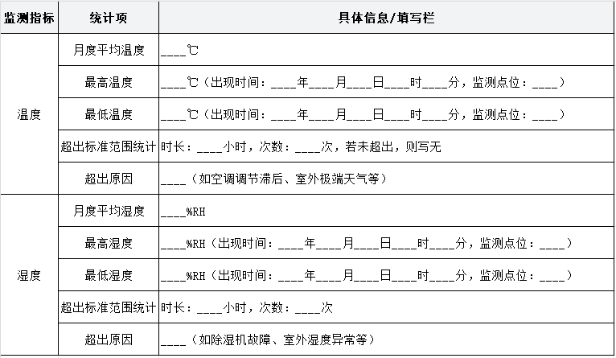

# 一文看懂数据中心运维服务月度报告

> 原文链接：[一文看懂数据中心运维服务月度报告](https://mp.weixin.qq.com/s?__biz=Mzg3MDkwNTM2Ng==&mid=2247498778&idx=1&sn=0580479096b6d636cfe4bfa1e759dccb&chksm=cf31ff73bb3747187555f3a3f929fcc6379e1660fff2fd67729b5408e1251e0f544f078a9957&mpshare=1&scene=1&srcid=0211EYFUtEZVRjbCcvrgvocP&sharer_shareinfo=c36a210375cbad56fa52172fbd89d4b7&sharer_shareinfo_first=c36a210375cbad56fa52172fbd89d4b7#rd)

欢迎点击上方**蓝色字点关注&nbsp;**

数据中心运维服务月度报告

报告期间：__年__月__日至__年__月__日

运维单位：__

使用单位：__

报告提交日期：__年__月__日

备注：月度服务报告模板和内容若有调整的，甲乙双方由运维侧沟通微调。本报告所有数据均为报告期间内实际运维采集数据，真实有效，供甲乙双方参考，用于数据中心运维优化、问题整改及服务复盘。

第一章基础设施运行数据

1.1数据中心可用性

1.可用性计算标准：采用行业通用标准，可用性=（报告期间总时长-数据中心整体中断时长）/报告期间总时长×100%；其中，数据中心整体中断指因基础设施（供配电、空调、消防等）故障导致整个数据中心IT设备无法正常运行的时长，单区域、单机柜非基础设施故障导致的中断不计入。

2.报告期间基础数据：数据中心安全运行总时长__天，数据中心整体中断时长__小时__分钟（无中断则填写0），中断次数__次，单次最长中断时长__小时__分钟，中断原因（无则填写“无”）：___。

3.可用性结果：供配电系统可用性&nbsp; &nbsp;%（保留4位小数），暖通系统可用性&nbsp; &nbsp;&nbsp;%，安全事故为0。

4.补充说明：明确可用性统计范围（全机房/特定区域），若存在非运维原因导致的中断，需标注责任方及说明。

1.2数据中心温湿度曲线

1.监测标准：依据GB50174-2017《数据中心设计规范》，IT机房温度控制在18℃-27℃，相对湿度控制在40%-60%；监测点位覆盖所有IT房间，每个房间至少设置2个监测点（机房前端、后端），监测频率为每10分钟1次。

2.月度数据汇总：

3.温湿度曲线说明：详见附件1《数据中心月度温湿度监测曲线》，曲线需标注监测点位、标准范围线、异常点及对应时间，清晰呈现月度温湿度变化趋势；针对曲线中出现的异常波动，需在曲线下方补充文字说明原因及处理措施。

1.3机柜开电和计费情况

1.机柜基础信息：数据中心总机柜数量__个，已部署机柜数量__个，空闲机柜数量__个，部署率__%。

2.开电情况：

（1）本月新增开电机柜__个，开电时间及机柜编号：___；新增开电机柜对应IT设备功率__kW，开电验收结果（合格/不合格）：__，不合格整改情况（无则填写“无”）：__。

（2）本月停用机柜__个，停用时间及机柜编号：__；停用原因（如客户退租、设备迁移等）：__，停用后机柜断电、清理情况：___。

（3）当前正常开电机柜__个，其中高功率机柜（功率≥8kW）__个，标准机柜（功率4-8kW）__个，其它机柜（功率&lt;4kW）__个。

3.计费情况：

（1）计费标准：依据甲乙双方签订的运维服务协议，机柜租金__元/个/月，电费__元/kWh，其他费用（如带宽费、增值服务费）：__。

（2）本月计费汇总：机柜租金合计__元，电费合计__元（总用电量__kWh），其他费用合计__元，本月总费用__元。

（3）计费异常说明：若存在计费差异、欠费、减免等情况，需详细说明：__；无异常则填写“无计费异常”。

1.4机房人员出入支持

1.出入管理标准：严格执行甲乙双方约定的机房出入管理制度，所有出入人员需提前报备、核实身份、登记备案，严禁无授权人员出入；运维人员出入需携带工作证件，客户及外来人员出入需由甲方指定人员陪同，并办理临时出入手续。

2.月度出入统计：

（1）出入总次数__次，其中运维人员出入__次，甲方人员出入__次，客户及外来人员出入__次（外来人员姓名、单位、陪同人员、出入时间详见附件2《机房人员出入登记表》）。

（2）出入异常情况：本月是否存在无授权出入、证件不符、未登记出入等异常情况（是/否）；若为是，需详细说明异常情况、处理时间、处理措施及整改结果：__；若为否，填写“无出入异常”。

3.出入支持说明：本月为甲方及客户提供出入协助__次（如陪同巡检、设备搬运出入等），协助内容及反馈：__。

第二章专项巡检情况

1.特殊天气统计：报告期间内出现的特殊天气（如暴雨、台风、高温、寒潮、雷电等）：__；每种特殊天气出现的时间、持续时长：__。

2.巡检方案：针对各类特殊天气，乙方已制定专项巡检方案，明确巡检时间、巡检点位、巡检内容、巡检人员及责任分工；巡检频率：特殊天气预警前需至少进行1次全面巡检，期间每_4_小时巡检1次，天气预警解除后，增加1次全面巡检，确保基础设施无异常。

3.巡检执行情况：

（1）本月共开展特殊天气专项巡检__次，其中暴雨天气巡检__次，台风天气巡检__次，高温天气巡检__次，其他特殊天气巡检__次；巡检人员__人，巡检覆盖点位__个（含供配电房、空调机房、消防机房、IT机房、室外设备区等）。

（2）巡检内容落实：重点巡检内容包括但不限于：室外冷却塔等设施是否牢固、排水系统是否畅通、防漏水措施是否到位、供配电设备是否受潮/过热、空调系统运行是否稳定、防雷接地系统是否正常、消防设备是否完好、IT设备运行状态是否正常等；所有巡检内容均已按方案落实，巡检记录详见附件3《特殊天气专项巡检记录表》。

4.巡检发现问题及处理：

（1）巡检发现问题__个，其中重大问题__个，一般问题__个；问题明细（含问题描述、发现时间、发现点位、严重程度）：__。

（2）问题处理：所有发现的问题均已启动应急处理流程，处理人员__人，处理时长累计__小时；重大问题处理结果（如整改完成、临时管控、待后续整改等）：__；一般问题整改完成率__%，未完成整改问题的原因及整改计划：__。

5.后续措施：针对本月特殊天气巡检情况，优化专项巡检方案__处（如调整巡检频率、补充巡检点位等）；加强运维人员特殊天气应急处置培训__次，提升应急响应能力；密切关注天气预警信息，提前做好防范准备，确保数据中心安全稳定运行。

第三章事件管理

1.事件定义及分类：依据ITIL运维标准，事件指数据中心基础设施、IT设备及运维服务过程中出现的所有异常情况（如设备故障、性能下降、服务中断、安全隐患等）；按严重程度分为4级：

（1）P1级事件（重大）：导致整个数据中心服务中断、重大设备损坏或造成重大损失的事件，需立即启动应急响应，10分钟内通知甲乙双方相关负责人。

（2）P2级事件（重要）：导致单个区域、多机柜服务中断或关键设备故障，影响部分客户业务，30分钟内通知甲乙双方相关负责人。

（3）P3级事件（一般）：单个机柜、单台设备故障，不影响核心业务，1小时内通知甲方相关负责人，及时处理。

（4）P4级事件（轻微）：不影响设备运行及服务质量的轻微异常（如指示灯异常、日志告警等），2小时内处理并反馈。

2.月度事件统计：

（1）本月共发生事件__起，其中P1级事件__起，P2级事件__起，P3级事件__起，P4级事件__起。

（2）事件分类统计：供配电系统事件__起，空调系统事件__起，消防系统事件__起，IT设备事件__起，门禁及安防系统事件__起，其他事件__起。

3.事件处理详情：

（1）事件响应：所有事件均按分级标准及时响应，响应及时率__%（100%为合格）。

（2）事件处理：P1级事件平均处理时长__小时，P2级事件平均处理时长__小时，P3级事件平均处理时长__小时，P4级事件平均处理时长__小时；事件处理完成率__%，未完成处理事件__起，原因、处理进度及计划完成时间：__。

（3）典型事件说明：选取本月1-2起典型事件（如重大事件、高频事件），详细说明事件描述、发生时间、响应过程、处理措施、处理结果及预防措施：__。

4.事件复盘及优化：本月组织事件复盘会议__次，复盘事件__起，分析事件发生原因（人为操作、设备老化、环境因素、系统缺陷等）__类；针对复盘发现的问题，优化运维流程__处，完善预防措施__项，加强人员培训__次，避免同类事件重复发生。

第四章变更管理

1.变更定义及范围：变更指对数据中心基础设施、IT设备、运维流程、配置参数等进行的修改、新增、删除等操作（如基础设施设备预防性维护、机柜扩容、设备升级、线路调整、配置变更、流程优化等）；所有变更需严格执行甲乙双方约定的变更管理流程，未经审批不得擅自实施变更。

2.变更管理流程：变更申请→变更评估→变更审批→变更准备→变更实施→变更验证→变更归档；其中，重大变更（如核心设备变更、影响服务运行的变更）需经甲乙双方共同审批，一般变更由甲方相关负责人审批。

3.月度变更统计：

（1）本月共提交变更申请__份，其中重大变更申请__份，一般变更申请__份；变更申请通过率__%，未通过变更申请__份，未通过原因：__。

（2）变更实施情况：已实施变更__份，其中重大变更__份，一般变更__份；变更实施完成率__%，实施成功率__%（无故障、无服务中断为成功）；未实施变更__份，原因及计划实施时间：__。

（3）变更分类统计：基础设施变更__份（机柜、供配电、空调等），IT设备变更__份，运维流程变更__份，配置参数变更__份，其他变更__份。

4.变更实施详情：

（1）变更准备：所有变更实施前，均已完成风险评估、方案制定、应急预案编制、人员安排及物资准备，确保变更过程可控。

（2）变更实施：变更实施时间__年__月__日__时__分至__时__分，实施人员__人，实施过程严格按审批方案执行，未出现擅自修改变更内容的情况；变更实施期间，是否影响数据中心服务运行（是/否）；若为是，说明影响范围、持续时长及应对措施：__。

（3）变更验证：变更实施完成后，运维人员对变更结果进行全面验证，验证内容包括设备运行状态、服务质量、配置参数等，验证合格后完成变更归档；验证不合格的变更__份，整改措施及整改结果：__。

5.变更风险管控：本月实施的变更中，识别潜在风险__个，采取风险管控措施__项；所有风险均已得到有效管控，未因变更引发安全事件或服务中断；后续将进一步优化变更评估流程，提升风险识别能力。

第五章演练管理

1.演练目的：通过定期开展应急演练，检验数据中心应急预案的可行性和完整性，提升运维人员应急处置能力，规范应急响应流程，确保发生突发事件时能够快速、高效、有序处置，最大限度减少损失。

2.演练计划：依据甲乙双方约定及数据中心运维需求，本月计划开展演练__次，演练类型、演练主题、演练时间、演练人员及演练方案详见附件4《数据中心月度演练计划》。

3.演练执行情况：

（1）本月实际开展演练__次，其中计划内演练__次；演练类型：供配电故障应急演练__次，空调系统故障应急演练__次，消防应急演练__次，服务中断应急演练__次，其他演练__次。

（2）演练实施：演练严格按方案执行，参与演练人员__人，演练时长累计__小时；演练过程中，模拟突发事件__类，运维人员按应急流程完成预警、响应、处置、恢复等环节，演练过程顺利，未出现安全事故。

（3）演练记录：所有演练均已完成记录，详细记录演练过程、参与人员、处置步骤、存在问题等，演练记录详见附件5《数据中心应急演练记录表》。

4.演练评估及总结：

（1）演练评估：演练结束后，组织甲乙双方相关人员开展演练评估，评估内容包括演练方案可行性、应急响应速度、处置措施合理性、人员配合度等；评估结果：优秀__次，良好__次，一般__次，不合格__次；不合格演练的原因：__。

（2）演练总结：总结演练过程中的优点__项，存在问题__项（如应急流程不熟练、人员配合不够默契、应急物资准备不足等）；针对存在的问题，制定整改措施__项，明确整改责任人及整改完成时间：__。

5.后续计划：根据本月演练情况，优化应急预案__份，调整演练计划__处；加强运维人员应急处置培训__次，提升应急能力；下月计划开展演练__次，演练主题及时间：__。

第六章维护保养管理

第七章容量管理

第八章门禁系统授权数据

第九章附件

。。。。。。

报告中剩下的章节请扫码→关注→回复“运维月度报告”，即可获得完整版的运维服务月报。

&nbsp;

