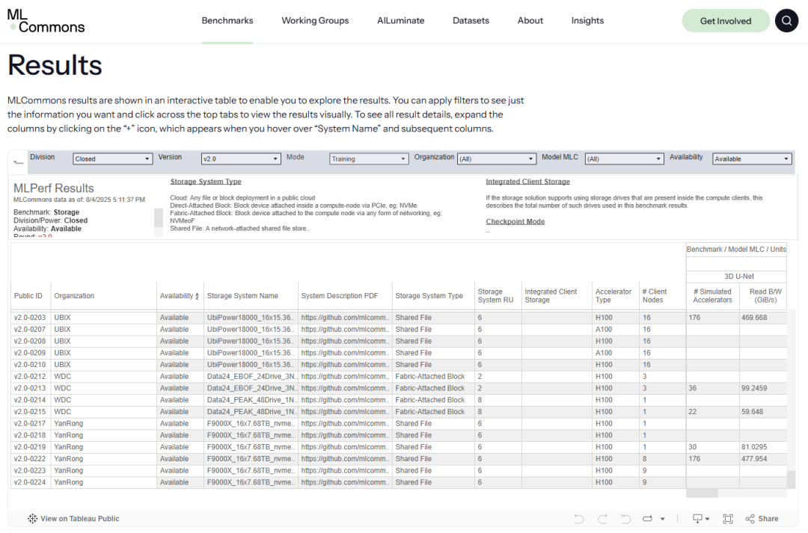
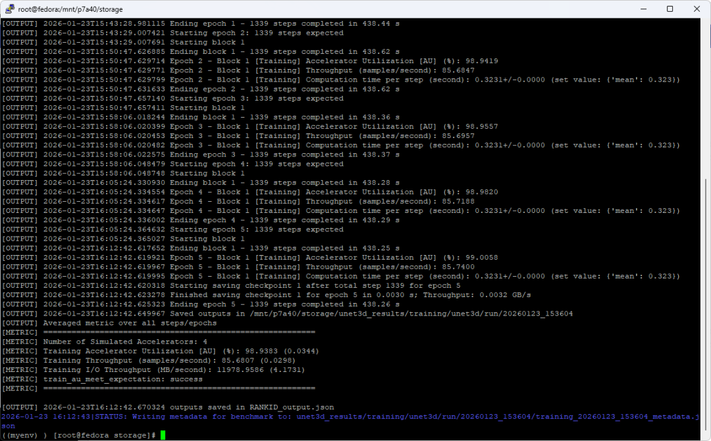
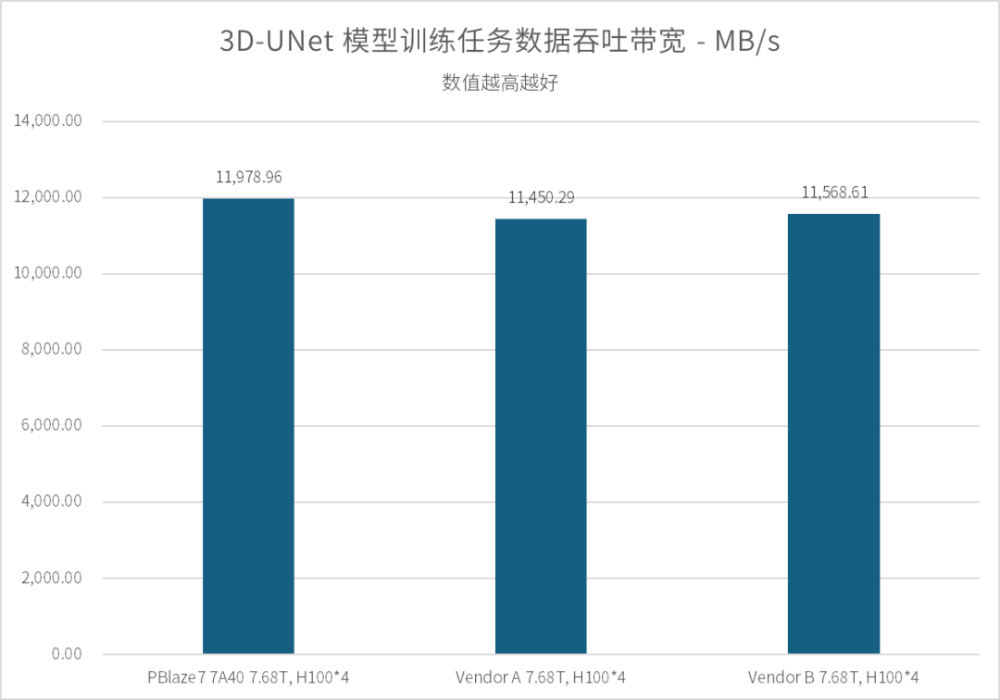
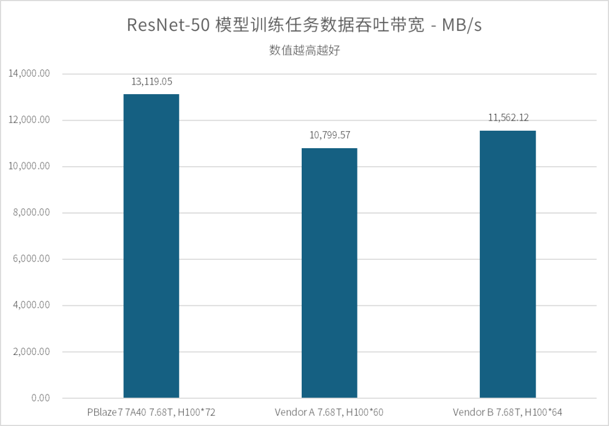
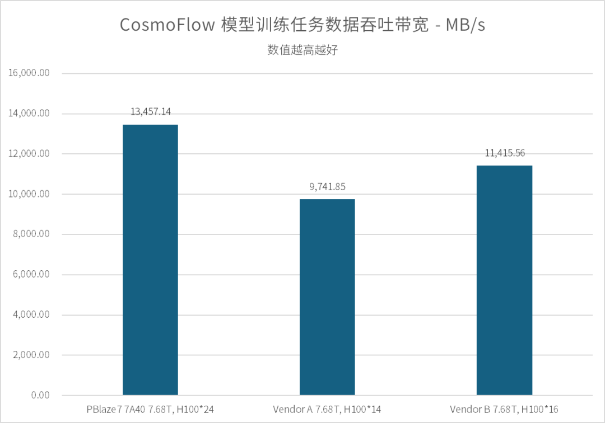
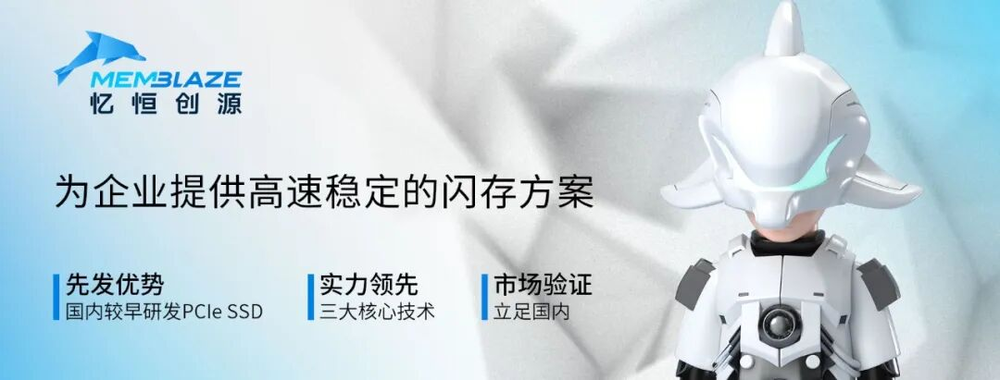
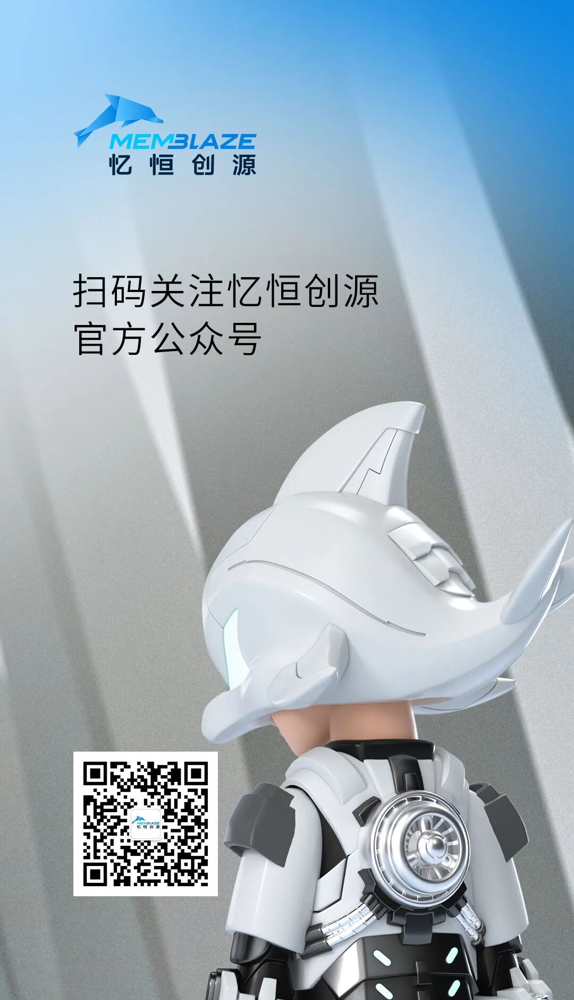
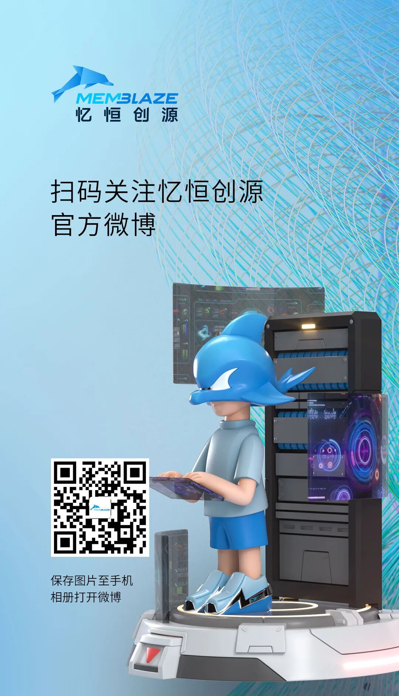

在算力即生产力的 AI 时代，存储系统的响应速度已成为决定大模型训练效率的关键变量。在备受瞩目的 MLPerf Storage v2.0 基准测试中，我们曾与合作伙伴携手，以 513GB/s 的数据带宽斩获多项行业第一。这不仅得益于底层硬件性能的飞跃，也是整个存储架构高效协同带来的显著成果。

MLPerf Storage v2.0 测试结果页面（引自MLCommons网站）

作为全球存储领域公认的“奥林匹克”竞赛，MLPerf Storage 由权威 AI 基准性能评测组织 MLCommons 发布。相较于 v1.0 版本，v2.0 在测试维度与合规性上进行了全方位进阶：它不仅要求通过多次重复实验以验证性能均值，还引入了严苛的测试环境验证机制，并新增了关键的 Checkpoint（检查点）保存与加载环节。这一系列演进旨在剔除“瞬时峰值”的偶然性干扰，从而真实反映存储系统在长程、高压、复杂 AI 负载下的底层韧性与持续输出能力。

当然，对企业级 SSD 厂商而言，在大规模存储架构之外，我们还需要回归到最纯粹的单片 SSD 本地存储性能测试。以最简洁的配置，直观展现不同 SSD 在处理相同负载时的原生性能差异 —— 我们无法预知用户会使用何种服务器、何种系统设置，我们能做的，就是提供尽可能强的 SSD 性能，为每一项 AI 训练任务提供更坚实、更可靠的存储支撑。

MLPerf Storage v2.0 实测结果

本次测试基于单片 PBlaze7 7A40 7.68TB PCIe 5.0 SSD。测试使用标准 2U 服务器，配备双路 Xeon 8457C 处理器，1TB 系统内存，运行 Fedora 操作系统及 XFS 文件系统。测试数据集设定在 5TB 以上，以最大程度减少命中系统内存带来的加速效果，并符合 MLPerf Storage v2.0 规范要求。

**3D-UNet**

**高吞吐持续输出，GPU利用率接近 满载**

  

首先是针对 3D-UNet 模型（医学影像分析）的训练任务。本次测试我们在模拟 A100 GPU 的基础上，重点引入模拟 H100 GPU 训练环境的存储压测，以便与友商提交到 MLCommons 官方的数据进行比对。

  

3D-UNet 的样本平均体积达 146MB，在 Batch Size 为 7 的设定下，单颗 H100 GPU每 0.323s 即可完成一轮数据处理。这意味着，要保证 GPU 利用率不低于 90%，存储系统必须为每颗 GPU 持续提供 2.85GB/s 以上的带宽输出。

  

在配置 4 颗 H100 GPU 的模拟环境下，PBlaze7 7A40 展现出了优秀的爆发力，提供 11,978 MB/s 的稳定数据带宽，GPU 利用率高达 98.94%。这一成绩不仅领先于 MLCommons 公示的 Vendor A 11,450 MB/s 与 Vendor B 的 11,568 MB/s，更在 8 颗 A100 GPU 模拟配置下，跑出了 12,208 MB/s 的吞吐。实测数据表明，PBlaze7 7A40 能够有效匹配当前主流算力平台的 I/O 需求，大幅缓解模型训练中的数据等待压力。

  

**ResNet-50**

**百余GPU并发访问，性能线性提升**

  

ResNet-50 是一种经典的深度残差网络模型，其数据集样本虽然经过打包（平均单文件体积约 143MB，内含 1251个样本），但在基于 TensorFlow 框架进行数据加载时，系统需要高频处理文件内部索引并进行实时解压。这不仅要求 SSD 具备极高的吞吐带宽，更对其在海量随机读取请求下的低延迟响应能力提出了严苛要求。

  

考虑到此前我们曾取得过 120 颗 A100 GPU 顺利通过的佳绩，本轮测试中，我们直接挑战了更高负载的 64 颗 H100 以及 128 颗 A100 模拟环境。

测试结果显示：

  * 在 64 颗 H100 配置下，PBlaze7 7A40 提供了 12,284 MB/s 的带宽，GPU 利用率高达 98.49%。

  * 我们将模拟 GPU 数量增加至 72 颗（即增加一个 8 卡训练节点）时，其带宽进一步攀升至 13,119 MB/s，GPU 利用率仍保持在 93% 以上。

  * 在 128 颗 A100 配置下，训练带宽依然稳健输出在 12,407 MB/s，GPU 利用率为 96.73%。

  

作为对比，行业同类产品 Vendor B 在 64 颗 H100 环境下的吞吐表现为 11,562 MB/s。PBlaze7 7A40 凭借更出色的 I/O 调度机制，在同等压力下展现了更强的存力支撑。

**CosmoFlow**

**GPU利用率突破90%，响应稳定流畅**

  

CosmoFlow 是一项用于宇宙演化研究的深度学习训练框架。不同于前两项测试，CosmoFlow 对存储系统提出了另一种层面的挑战：其样本数据集极为琐碎，涵盖了多达 194 万个独立样本，且平均文件体积仅约为 2.8MB。这种典型的海量小文件并发读取场景，对 SSD 的文件检索效率，以及突发 I/O 的响应一致性有着更高要求。

  

根据 MLPerf Storage v2.0 规范，GPU 利用率达到 70% 即视为通过测试。但在实测中，PBlaze7 7A40 展示出了远超标准的性能余量：

  * 在配置 16 颗 H100 GPU 时，GPU 利用率达到 90% 以上，实时训练带宽达到 10,931 MB/s。

  * 在满足 70% 利用率的基线上，单片 PBlaze7 7A40 支持的 H100 GPU 数量可进一步扩展至 24 颗。此时，系统输出带宽升至 13,457 MB/s，GPU 利用率稳定在 74.35%。

  

实测证明，在面对零散的数据集检索请求时，PBlaze7 7A40 能够凭借稳定的高带宽输出、极致的 QoS 和延迟表现，有效保障 AI 训练任务的连续性，降低因存储端响应滞后对算力效率的影响。

**Checkpoint**

**高速保存与加载，训练中断时间最小化**

  

在大语言模型（LLM）的持续训练过程中，Checkpoint（检查点）的保存与加载是保障任务连续性的核心机制。随着模型参数量向千亿甚至万亿级演进（如本次模拟的 Llama-405B），Checkpoint 产生的数据量也会非常庞大。而在 Checkpoint 保存与加载过程中，昂贵的 GPU 算力资源通常处于等待状态，因此，存储端的写入与读取速度直接关系到训练的整体有效时长。

  

在 Llama-405B Checkpoint 模拟测试中，通过配置 4 颗虚拟 GPU 负载，基于 PBlaze7 7A40 的存储系统表现出了极高的读写效率：高达 8.43 GB/s 的 Checkpoint 保存速度 与 7.45GB/s 的加载速度，成功将超大模型的保存与恢复操作控制在 6 秒和 7 秒内。

在 MLPerf Storage v2.0 基准测试中，单片 PBlaze7 7A40 PCIe Gen5 SSD 在多项 AI 训练负载下展现出稳定而持续的数据供给能力。无论是高吞吐模型训练、大规模 GPU 并发，还是海量小文件与 Checkpoint 场景，其均能够有效保障 GPU 利用率，降低算力等待时间。以上种种测试结果表明，高性能本地 NVMe 存储已成为释放 AI 算力潜能的重要基础设施组成，PBlaze7 7A40 也将持续为新一代大模型训练提供可靠的存力支撑。

  

