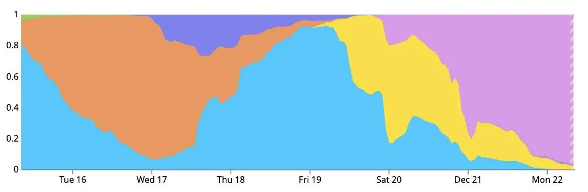
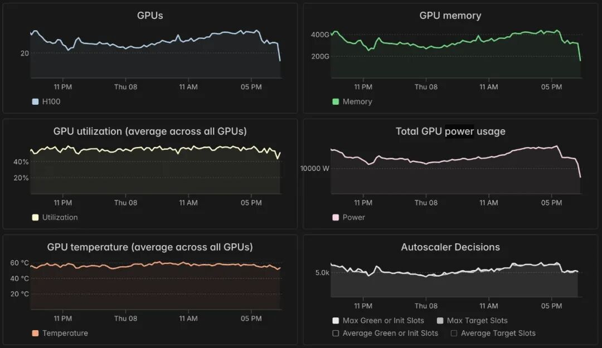
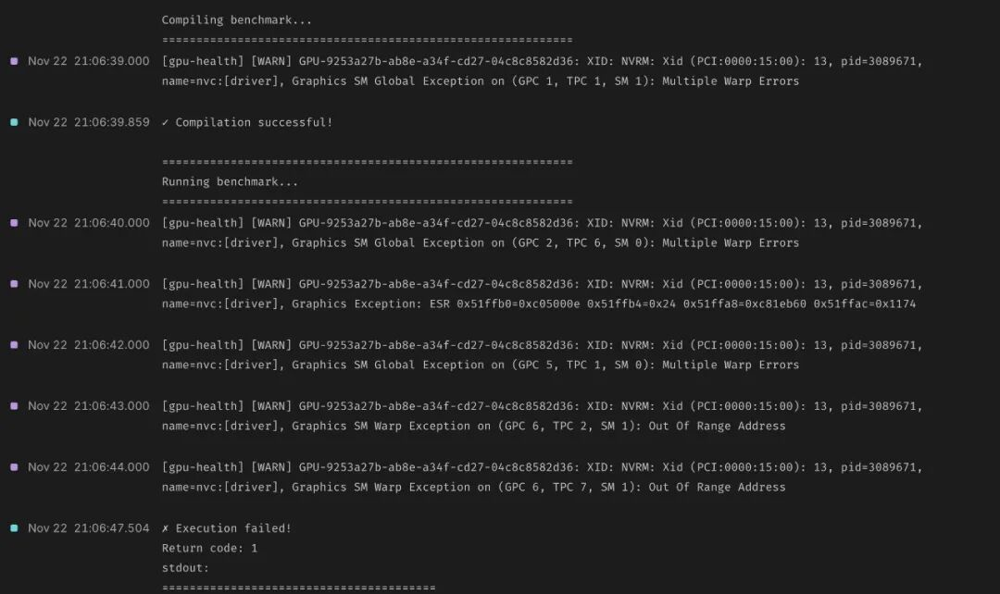

# 万卡GPU 集群真实运维

> 原文链接：[万卡GPU 集群真实运维](https://mp.weixin.qq.com/s?__biz=MzIwMDIzNTI4MA==&mid=2247485605&idx=1&sn=ddbe18b86fb40601b83854d4cbc5ea6f&chksm=97198b3147fa72c72093c5ba535bc6c7bedf6634483649617f68abb6e143ae1e5238df0b2a0a&mpshare=1&scene=1&srcid=0219HmAINAynKN6DMm7ztJSq&sharer_shareinfo=e0cd9dae59e8a93feb95fd6c8e36bd01&sharer_shareinfo_first=e0cd9dae59e8a93feb95fd6c8e36bd01#rd)

&nbsp;# 维护20,000个GPU的健康

Modal通过从所有云巨头（AWS、GCP、Azure、OCI）获取计算资源，运行着一个全球分布式、自动扩缩的GPU工作池。在过去几年中，他们将工作池扩展到超过20,000个并发GPU，并启动了超过四百万个云实例。在这个规模下，几乎所有GPU的可靠性问题都会显现出来。

他们分享了GPU可靠性系统，这既是对Modal客户承诺的证明，也是为那些租用超大规模云（hyperscaler）或新兴云（neocloud）计算卡的用户提供的一份指南。独自前行很危险！ 带上这个。

本文首先介绍云实例类型的测试与选择。或许令人惊讶的是，不同的云超大规模提供商（hyperscaler）在性能和可靠性方面存在显著差异。接着，其中将讨论机器镜像的准备和实例启动检查。然后，会介绍在每个实例生命周期中进行的被动和主动GPU健康检查。最后，讨论可观测性（observability）和支持，当GPU可靠性问题未能被我们的自动化健康检查系统发现时，它们变得至关重要。

文章中不直接提及云提供商，而是使用匿名标识符A、B、C、D来指代它们。如果您想知道它们是谁，可以最后的参考文献，追踪线索。

一直以来没有机会走进大型数据中心，运维超万卡集群是一件奢侈的事情，最近开始研究Neocloud 的商业模式，一如即往，我们从技术的角度拆解投资方向，运维是其核心竞争力。

Modal这篇文章描述了整个集群的运维周期，非常之精彩，其中主要的观点是：GPU的稳定性是整个集群运维的最大难题。

好了，正文开始...## 实例类型测试与选择

我们从云实例类型的可靠性开始。超大规模提供商（hyperscaler）在实例类型层面存在显著差异。具体到与可靠性相关的差异，我们观察到：• 云A拥有最简单、最可靠的实例启动API。如果您请求一个裸金属（BM）或虚拟机（VM）并收到HTTP 201响应，99.6%的情况下它能成功启动，并且启动速度相对较快（2-3分钟）。• 云A运行的H100在StableDiffusion `text2img`任务上的表现比云C和云D差50%。• 云C的H100在2025年有几个月运行温度过高，有时甚至超过90°C。FLOP/s性能在70°C中期就开始下降。• 云C比其他云提供商多预留了228MiB的H100内存。因此，客户可用内存较少。• 云D的A10 GPU经常出现硬件侧时钟减速（`HW_SLOWDOWN`和`HW_POWER_BRAKE`）。• 云D在美国某个区域的NVIDIA A10 GPU出现更频繁的不可纠正ECC错误。不幸的是，这不是能很快发现的问题。• 云D拥有最佳的性价比。其裸金属服务器性能强劲。

通常，我们的提供商排名以容量和价格为导向，但我们还会维护内部的*调整后*价格，其中考虑了在发现特定实例类型、区域等问题后我们施加的罚款。

我们维护半自动化的基准测试（称为`modal-host-bench`），以便我们评估大量我们希望消除或至少计入成本的性能和可靠性问题。以下是一些基准测试样本数据，强调了当你可以租用SXM H100时，你绝不会想租用PCIe H100。****类别********云D H100 SXM********云B H100 NVL (PCIe)********% 差异****`torch_matmul_duration_seconds`1.622.7267.5%`torch_matmul_flops`678 TF/s405 TF/s-40.3%`h2d_bw_pageable_1024`7.68 GiB/s21.0 GiB/s174%`h2d_bw_pinned_1024`49.1 GiB/s51.2 GiB/s4.40%`d2h_bw_pageable_1024`14.3 GiB/s20.9 GiB/s46.0%`d2h_bw_pinned_1024`50.7 GiB/s53.4 GiB/s5.30%## 机器镜像

机器镜像（Machine images）是我们裸金属（BM）和虚拟机（VM）服务器用于启动的。它们包括内核（kernel）、操作系统文件、NVIDIA驱动、已安装的系统库、配置以及Modal的一些应用软件。

我们发现所用机器镜像的质量对可靠性和性能有重要影响。我们非常重视多云计算池中机器镜像的一致性（相同的内核、相同的驱动程序等）以及新颖性。我们的镜像会及时更新到最新的生产版NVIDIA驱动（580.95.05[4]），以确保安全性、性能和新功能。

在Modal早期，机器镜像更新是临时性的、手动测试的，错误层出不穷。几年前，这种情况变得难以维持，因此我们转向了机器镜像的持续、渐进式集成，并在镜像推广前进行自动化测试。

Timeseries graph showing our machine image rollout 

一周内机器镜像版本发布的可视化。颜色表示版本，可以看到橙色版本被回滚了。

由于云巨头在加载自定义机器镜像方面非常可靠，您可以在镜像构建阶段进行大量的GPU测试。具体来说，在构建结束时，我们会在认为镜像配置可以投入生产之前，运行NVIDIA Data Center GPU Manager (DCGM)[5]等系统工具测试以及Modal容器运行时内部的自定义GPU测试。这确保了Worker主机和我们客户的客户容器都能与GPU协同工作。

可靠的机器镜像支持是云巨头将其平台与大多数新兴云（neocloud）初创公司（例如Lambda Labs, Nebius）区分开来的地方。很少有新兴云支持镜像定制，而且由于hypervisor和缓存效率低下，它们的实例启动性能也更差。云C是我们用机器镜像启动新VM最快的，平均不到2分钟。某些新兴云甚至难以在5分钟内启动其平台默认的机器镜像。

尽管超大规模提供商（hyperscaler）在机器镜像功能和可靠性方面没有显著差异，但云D的区域镜像复制速度*极慢*，复制到10个区域需要3小时。## 实例启动

实例启动是我们的机器镜像在数据中心的喧嚣中被激活，面对生产环境的现实。如果我们在带有故障GPU的主机上启动，或者我们的cloud-init进程存在错误，我们需要及时发现并介入，以防任何客户使用这些GPU。

这里存在一个显著的权衡。Modal运行着一个自动扩缩的容器。减慢启动速度会增加客户的调度开销。更糟糕的是，额外的启动延迟实际上会在延迟故障转移时*降低*可靠性。

在新主机上可以进行的最深入的通用检查是`dcgmi diag --run 4`。它能发现一系列长尾问题，但需要大约一小时。即使是最浅层的检查，`dcgmi diag --run 1`也需要至少一分钟。

在启动时测试硬件可能与云提供商已执行的健康检查重复。毕竟，我们理应为正常工作的GPU付费！ 对一个已经达到四九可靠性（99.99%）的流水线生产出的每个实例进行深入检查，将是捡了芝麻丢了西瓜。

因此，在实例启动时，通常执行相对轻量的检查：`systemctl`查询、`nvidia-smi`查询，以及对随机选择的GPU（0-7）进行基本读写操作。

如今，我们几乎没有GPU问题能漏检并影响到用户容器。我们在生产中遇到的一个令人烦恼的问题是，云C的L4 GPU在CUDA初始化时有0.1%的几率出现故障[6]。针对这些卡的应用程序代码必须使用`cuInit`重试机制。## 生命周期管理

此时，我们已经获得了一个满意的实例，并已启动它，开始在其上运行客户工作负载。我们对生产环境感到满意，但需要保持这种状态，这就是持续的*被动*和*主动*健康检查发挥作用的地方。• 被动健康检查不运行在GPU上，是非侵入性的，只读的。被动数据流包括`dmesg`和`dcgmi health`。• 主动健康检查会独占GPU设备并进行读写操作以获取健康数据。`dcgmi check`和`nvbandwidth`就是例子。### 被动健康检查

按云划分的每小时关键级别Xid错误[8]数量，按GPU数量归一化。云B（蓝色）的关键错误率是迄今为止最高的。

您可以通过20%的工作获得80%的被动健康检查收益：定期运行`dcgmi`并检查`dmesg`以发现最常见的问题。更具体地说，`dcgmi`可以告诉您特定GPU上不可纠正的ECC错误。我们还可以被动地了解GPU热量违规、同步提升违规、硬件减速和过高温度（&gt;88°C）。

如上所述，直到几个月前，云C一直存在严重的散热问题。我们曾看到云C的GPU达到94°C！在那个温度下，性能受到严重影响，约为峰值的50%。### 主动健康检查

由于主动健康检查需要独占GPU，因此其调度更为复杂。过度使用主动健康检查会浪费宝贵的GPU时间。使用不足则有留下性能下降GPU的风险。

遵循SemiAnalysis的ClusterMAX[9]，我们确保每个GPU节点每周至少进行一次深入的主动检查。尽管我们已确认我们的底层云提供商会执行自己的深度主动健康检查，但当实例被我们占用时，他们显然无法进行检查。

我们的大部分实例容量都是通过短期（&lt;24小时）租赁获得的，因此我们不像那些租赁机器数月的平台那样经常遇到这个问题。然而，我们确实有一些生命周期较长的容量。每周我们持有实例时，我们会运行以下主动检查：• NVIDIA DCGM `diag`级别2。• GPUBurn/GPU-fryer——验证GPU在高负载下不会出现故障。• 本地NCCL all-reduce测试，以验证NVLink/NVSwitch/NVLink SHARP性能。

如果这些检查失败，我们会收到警报，该实例不允许继续接受任务，有时我们会“隔离”该实例，供我们自己或底层提供商进行分析。

在不久的将来，由于对用于训练和推理的快速互连的兴趣日益增长，我们将增加以下面向网络的活跃检查：• 本地InfiniBand all reduce测试，用于验证InfiniBand性能和链接（通过强制禁用NVLink/p2p/SHM）。• 成对CPU和GPU的`ib_write_bw`和`ib_write_latency`双向测试，以验证网络性能是否符合参考规范。### 行动

理论上，通过隔离和重置GPU，有可能从某些不健康的GPU状态中恢复。但在实践中，对我们而言，这过于复杂且无法保证恢复。因此，我们选择自动将整个主机标记为不健康，清空其任务，然后将其废弃或重重安装。## 可观测性

GPU metrics 

我们的仪表板通过以下四个指标，为每个容器提供其GPU可靠性的视图：• 内存使用量• 利用率• 温度• 功耗

有关如何解读这些指标的更多详细信息，请参阅我们之前关于GPU利用率的高级指南[10]。

需要注意的是，所有这些指标目前都在容器层面进行聚合，因此它们在八个GPU中发现单个故障GPU的效果较差。

除了指标之外，我们还将异常GPU健康事件输出到仪表板容器日志中。请参阅以下截图中的信息性“gpu-health”行（用紫色标示）。

gpu-health logs 

Modal中容器日志流的截图，显示检测到多个Xid 13错误。

我们的指南文档维护着一个详细的Xid和sXid字典[11]，用于理解错误。我们认为它是互联网上最好的GPU错误资源。## 支持

### 

新队列中p50时间

等待Modal的p50时间

我们所有渠道的支持指标，从Pylon导出。

以上所有措施都能轻松为您带来四九的GPU正常运行时间。但总会有边缘情况和黑天鹅事件——对于这些，您需要支持。

对于我们的企业客户，我们使用一个共享的私有Slack频道[12]，并有严格的SLA。Slack连接到Pylon，跟踪从问题创建到解决的全过程。由于Modal建立在云巨头之上，并专为动态计算自动扩缩而设计，我们可以相当快速地替换有问题的GPU！

对于其他所有用户，我们仍然在社区频道中提供响应，并且当我们未能及时发现并处理故障GPU时，会提供积分补偿。## 结论

GPU的不可靠性被低估了。NVIDIA的硬件是一个奇迹，FLOPs令人惊叹。但可靠性却是一个拖累。一个令人难忘的例子，说明可靠性如何阻碍AI/ML开发，来自Meta详细介绍LLaMA 3模型训练过程的论文[13]：“GPU问题是最大的类别，占所有意外问题的58.7%。”

想象一下，当GPU像CPU一样可靠时，我们将享受到的未来。Llama3团队的CPU问题只占0.5%的时间。我在Modal工作期间，不记得发现过一个性能下降的CPU核心。

### 参考链接

 &nbsp; &nbsp;[1] &nbsp; &nbsp;

*https://en.wikipedia.org/wiki/It%27s_dangerous_to_go_alone!* &nbsp; &nbsp;[2] &nbsp; &nbsp;

*https://docs.nvidia.com/datacenter/dcgm/latest/dcgm-api/dcgm-api-field-constants.html#c.DCGM_CLOCKS_EVENT_REASON_HW_SLOWDOWN* &nbsp; &nbsp;[3] &nbsp; &nbsp;

*https://docs.nvidia.com/datacenter/dcgm/latest/dcgm-api/dcgm-api-field-constants.html#c.DCGM_CLOCKS_EVENT_REASON_HW_POWER_BRAKE* &nbsp; &nbsp;[4] &nbsp; &nbsp;

*https://www.nvidia.com/en-us/drivers/details/250991/* &nbsp; &nbsp;[5] &nbsp; &nbsp;

*https://developer.nvidia.com/dcgm* &nbsp; &nbsp;[6] &nbsp; &nbsp;

*https://modal.com/docs/guide/troubleshooting#cuda-driver-initialization-failed-on-l4-gpu-type* &nbsp; &nbsp;[7] &nbsp; &nbsp;

*https://github.com/NVIDIA/nvbandwidth* &nbsp; &nbsp;[8] &nbsp; &nbsp;

*https://modal.com/docs/guide/gpu-health* &nbsp; &nbsp;[9] &nbsp; &nbsp;

*https://www.clustermax.ai/health-checks* &nbsp; &nbsp;[10] &nbsp; &nbsp;

*https://modal.com/blog/gpu-utilization-guide* &nbsp; &nbsp;[11] &nbsp; &nbsp;

*https://modal.com/docs/guide/gpu-health* &nbsp; &nbsp;[12] &nbsp; &nbsp;

*https://modal.com/pricing* &nbsp; &nbsp;[13] &nbsp; &nbsp;

*https://arxiv.org/abs/2407.21783*

&nbsp;

