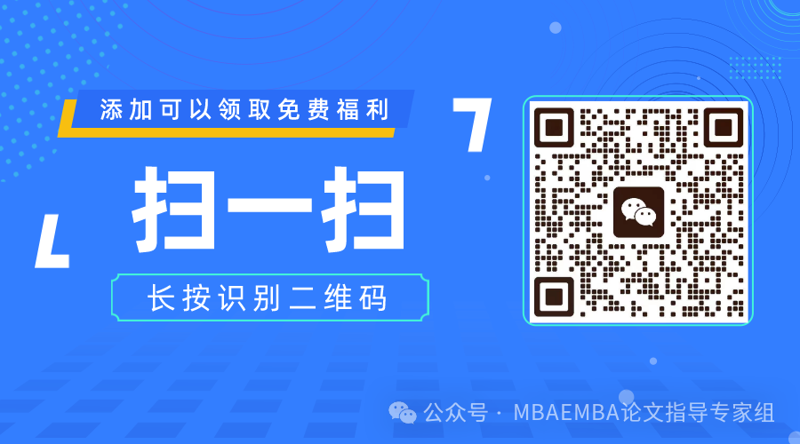

# 与职业发展深度绑定！3个步骤锁定你的MEM最佳论文方向

> 原文链接：[与职业发展深度绑定！3个步骤锁定你的MEM最佳论文方向](https://mp.weixin.qq.com/s?__biz=Mzg3Mjg4NDE0Nw==&mid=2247491278&idx=1&sn=8d089f49c2c5b63f5c80dec596322437&chksm=cf5574d68f1782c0f1faf3e41fb5884cafae5e2e33447c0a1d753988b49f0371872f5b2c1a70&mpshare=1&scene=1&srcid=0202R0TtdNCGc5Uv0Low22CW&sharer_shareinfo=66e742463824a018a5b5bc7a969d1050&sharer_shareinfo_first=66e742463824a018a5b5bc7a969d1050#rd)

这不是你的个人困境。在接触了数百位MEM学生后发现，超过70%的人在选题初期都卡在同一个问题上：**如何让这项耗费数月心血的工程，不止于一张毕业证书，更能成为职业跃迁的实心砝码。答案是：用战略投资的思维做选择，****让你要解决的论文问题，恰好是市场未来愿意为你的能力付费的问题。**## 一、向内看：盘点你岗位中的“高价值问题”

**选题的起点，不是你“想”研究什么，而是你每天“在”处理什么。**许多同学在寻找论文方向时，会把视野投向宏大、前沿但陌生的领域。然而，真正的黄金选题，往往埋藏在你日常工作的细节里。那些让你反复困扰、消耗团队大量精力、或制约部门绩效的瓶颈问题，就是绝佳的研究矿藏。你需要问自己三个问题：**我的岗位核心目标是什么？目前最大的障碍是什么？如果解决它，能创造多少价值？****举例来说**，如果你是一名**智能制造工程师**，你车间的设备综合效率（OEE）长期偏低，大量时间花在非计划停机上。那么，“**基于深度学习的生产线设备预测性维护模型研究**”就是一个从岗位中自然生长出的选题。它让你能系统地用数据分析故障模式，用算法优化维护策略。这个过程，正是企业数字化转型中急需的核心能力。**再比如**，作为一名**IT项目经理**，你发现团队在敏捷开发中，需求变更频繁导致效率低下。那么，“**面向AIGC辅助开发的敏捷需求动态管理机制研究**”，就能让你在解决问题时，同步掌握用新技术优化流程的前沿方法。**行动清单**：用一周时间记录你工作中的“痛点瞬间”，并与你的KPI或部门目标关联。找出那个最具改善潜力、且有数据或技术手段介入空间的问题。## 二、向外探：锚定你行业与企业的“核心痛点”

**个人的价值，在于解决组织发展的难题。**当你的研究与企业当前战略重点或行业普遍痛点同频时，你的论文就获得了一个强大的“势能”。你的研究将不再是你一个人的事，而可能获得来自企业的数据支持、资源倾斜，乃至高层关注。这不仅能让研究更顺利，其成果也天然带有极强的实践光晕，成为你内部晋升或外部求职时的硬通货。**关键在于识别趋势**：你的企业年报中反复提及的关键词是什么？你所在的行业，正在被什么政策驱动，或被什么技术颠覆？**举例来说**，如果你在**汽车零部件企业**，行业正面临“电动化、轻量化”的浪潮。那么，研究“**新能源汽车电池托盘轻量化设计与成本控制优化**”或“**面向电动化的供应链柔性重构研究**”，就精准地锚定了企业的生命线。这证明你具备在产业变革中为企业寻找解决方案的战略视野。**又或者**，你身处**建筑施工行业**，“绿色低碳”与“数字化交付”是明确的趋势。那么，“**基于BIM的绿色建筑碳足迹测算与优化研究**”，就同时踩中了技术趋势和政策要求两个节点。**行动清单**：精读你所在公司近年的战略规划、CEO内部信，并关注行业协会发布的年度报告。找出1-2个被反复强调的战略级挑战，思考你的专业领域如何切入。## 三、向前看：将论文构筑为你的“能力名片”

**最终，你的论文题目，应当是你理想下一站的“能力预演”。**这要求你向前看一步：完成MEM学业后，你期望迈向哪个平台、担任何种角色？你的论文，就是你向未来雇主或上级展示你能胜任该角色的“原型作品”和“深度测评报告”。**你需要让论文的每个关键词，都为你代言**。题目中的方法论（如“基于数据挖掘”、“运用系统动力学”），展示你的分析工具库；研究对象（如“智慧供应链”、“客户体验”）亮出你的专业领域；最终成果（“优化模型”、“管理机制”）则呈现你定义和交付解决方案的能力。**举例来说**，如果你渴望成为一名**供应链专家**，那么“**复杂国际环境下基于韧性的多级供应链库存优化研究**”这样的题目，就比宽泛的“供应链优化研究”有力得多。它精准地展示了你处理不确定性和构建韧性的能力。如果你的目标是**科技公司的技术管理者**，那么“**AI研发团队的知识协同效率评估与提升研究**”，则表明你已开始思考如何管理高级智力资本，这正是从技术走向管理的核心一跃。**行动清单**：打开你目标职位的招聘描述（JD），提取其中3-5个核心能力要求。审视你的选题方向，是否包含这些关键词，能否完整论证你具备这些能力。## 四、最终，构建“三位一体”的选题验证

当你有了一些初步方向，请用这个“三位一体”终极框架进行验证，它能确保你的论文价值最大化、风险最小化。拿出纸笔，为你的意向题目，在**个人价值、企业痛点、行业趋势**三个维度上分别打分。理想的选题，应当位于三圈重叠的核心地带。**个人价值**意味着你有兴趣、有基础、能完成；**企业痛点**确保研究接地气、有数据、能落地；**行业趋势**则赋予研究前瞻性、有张力、不过时。一个经典的范例是：如果你是一名**消费电子企业的项目经理**，你选择研究“**基于用户在线评论数据挖掘的新产品迭代需求识别与优先级管理**”。从**个人**角度，你掌握了数据分析和产品管理的新技能；从**企业**角度，你解决了研发部门如何精准捕获用户需求的真实痛点；从**行业**角度看，你切入了“数据驱动产品开发”的普遍趋势。这是一个完美的、能为你未来担任产品负责人铺路的“能力声明”。**立即行动**：不要追求想象中的最优解，寻找当下的最优解。从今天起，完成上述三步自查。然后，带着一个经过深思熟虑、逻辑自洽的选题方案，去和你的导师进行一次“战略对齐”式的沟通。你会惊奇地发现，当你的选题能清晰阐述出对个人、对组织、对领域的多重价值时，你获得的将远不止是“同意”，更是导师的重视和资源的倾斜。**MEM学习是时间的投资，而你的论文，则是这笔投资中最具战略意义的标的。用数个月的时间，集中解决一个能定义你未来数年职业高度的问题，这或许是整个MEM生涯中，回报率最高的决策。**

写论文找助研，论文变得很简单

论文的成功通过只是一个起点，我们期待让更多的学员都能在助研的辅导下收获学术成果。请相信我们，助研的全体辅导老师，具备多年的论文辅导经验，一对一提供写作方案，解决你的疑问，带你轻松完成论文！以下是我们学员的一些反馈：

免责声明：部分资料来源于网络，转载目的传递更多信息和分享，仅供平台交流，不为其版权负责，如涉嫌侵权请联系我们及时修改和删除.

