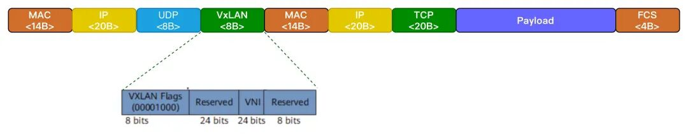

# 云网络基础：underlay网络和overlay网络

> 原文链接：[云网络基础：underlay网络和overlay网络](https://mp.weixin.qq.com/s/R35jJDROhP_W19DS2wS24g?clicktime=1770355815&enterid=1770355815&exptype=unsubscribed_card_recommend_article_u2i_mainprocess_coarse_sort_pcfeeds&ranksessionid=1770355773_1&req_id=1770355773514328&scene=169&subscene=200)

 我们讨论云网络时，经常提到两个词：underlay网络和overlay网络，他们到底是什么意思呢？让我们从两个更基础的技术VLAN和VXLAN开始… # VLAN

 为了解决局域网过大后，引起的网络风暴和安全隐患，引入了VLAN技术：VLAN (Virtual Local Area Network)，就是把一个物理上的大二层网络，逻辑上切成几个独立的小网络。不同的小网用VLAN ID识别。 

 支持VLAN的交换机接口，有三种模式 ❖&nbsp;&nbsp;Access模式：接入不识别VLAN的终端设备；一个端口只能属于一个VLAN；&nbsp; &nbsp; ⊙ 收包：从终端设备收到不带VLAN的报文后，打上VLAN ID，送给交换机内部处理 &nbsp; &nbsp; &nbsp; &nbsp;&nbsp; &nbsp;✦ 收到带VLAN的包，如果VLAN tag和端口不匹配，直接丢包
 &nbsp; &nbsp; ⊙ 发包：报文需要发给终端设备时，剥离VLAN tag，变成普通报文发给终端设备 
❖&nbsp; Trunk模式：连接交换机和交换机，交换机和路由器；一个端口运行多个VLAN通过；
 &nbsp; &nbsp; ⊙ 收包： &nbsp; &nbsp; &nbsp; &nbsp;&nbsp; &nbsp;✦&nbsp;收到带tag的包，检查是否在允许通过列表里，在，放行；不在，丢包； &nbsp; &nbsp; &nbsp; &nbsp;&nbsp; &nbsp;✦&nbsp;收到不带tag的包，先打上端口的VLAN tag，再检查是否允许通过；
 &nbsp; &nbsp; ⊙ 发包： &nbsp; &nbsp; &nbsp; &nbsp;&nbsp; &nbsp;✦ 包的tag等于端口默认的tag，剥离tag发送（兼容不支持vlan的设备）&nbsp; &nbsp; &nbsp; &nbsp;&nbsp; &nbsp;✦&nbsp;包的tag不等于端口默认的tag，保留tag，原样透传
❖&nbsp; Hybrid模式：华为/华三设备特有模式；允许多VLAN通过，且可以指定发包时是否剥离Tag
 &nbsp; &nbsp; ⊙ 收包逻辑和Trunk模式的收包逻辑完全一致 
 &nbsp; &nbsp; ⊙ 发包逻辑：支持配置需要剥离tag的VLAN和不需要剥离tag的VLAN 

# VXLAN

VXLAN（Virtual Extensible LAN，虚拟可扩展局域网），即在物理的 IP 网络之上，通过“隧道”技术，构建了一个虚拟的二层逻辑网络。它是一种Layer 2 over Layer 3的隧道技术，可以解决VLA技术中只有4096个数量限制的问题。同时，可以实现将二层网络跨越IP网络限制；

VXLAN的术语

VNI：&nbsp;(VXLAN Network Identifier，VXLAN 网络标识符)，用于区分不同的VXLAN段，一个 VNI 代表一个独立的广播域（对应VLAN ID），即VNI标记了一个虚拟二层网络；24位，可以支持 1600 万 (16,777,216) 个独立的虚拟网络。

VTEP：VXLAN Tunnel Endpoint，VXLAN隧道端点，负责封装和解封装VXLAN报文 ；

Underlay网络：底层物理IP网络，承载VXLAN流量；

Overlay网络：虚拟的二层网络。通过 VXLAN 构建的虚拟二层/三层网络，建立在Underlay之上，对租户或应用透明，看起来就像是在同一个二层广播域中；

/* 所以，underlay/overlay其实是VxLAN的术语，只不过在云网络中应用广泛，经常被提起 */

/* 所以，VLAN和VxLAN是网络的基础，更是云网络的基础*/

VXLAN的特点

❖&nbsp;&nbsp;VXLAN 是一种 Overlay 网络技术：

&nbsp; &nbsp; ⊙&nbsp;VXLAN 将这些二层数据封装在三层（通常是UDP/IP）报文中进行传输。使得二层网络跨越来地域等限制；

&nbsp; &nbsp; ⊙&nbsp;它在现有网络之上“覆盖”了一层虚拟的二层网络，所以称为“Overlay”。

❖&nbsp;&nbsp;VXLAN 使用 UDP 封装：

&nbsp; &nbsp; ⊙&nbsp;VXLAN 把二层以太网帧封装在 UDP 数据包中，再通过 IP 网络进行传输。

&nbsp; &nbsp; ⊙&nbsp;默认使用 UDP 端口 4789（标准端口）进行通信。

❖&nbsp;&nbsp;大规模扩展：

&nbsp; &nbsp; ⊙&nbsp;24bitVNI，支持多达 1600 万个 VXLAN 网络（对比 VLAN 的 4094），适合大型数据中心和云计算环境。

❖&nbsp;&nbsp;跨物理边界通信：

&nbsp; &nbsp; ⊙&nbsp;虚拟机可以跨越不同的物理服务器、机架、甚至数据中心，只要底层 IP 网络可达，就能处于同一 VXLAN 网络中。

❖&nbsp;&nbsp;与物理网络解耦：

&nbsp; &nbsp; ⊙&nbsp;VXLAN 网络的构建不依赖于底层物理网络拓扑，更灵活，便于自动化和虚拟化运维。

VXLAN通信过程

❖&nbsp; 发送端（源VTEP）：

&nbsp; &nbsp; ⊙&nbsp;要发送数据到同一 VXLAN 网络中的另一台终端时，源 VTEP 收到这个二层数据帧。

&nbsp; &nbsp; ⊙&nbsp;源 VTEP 根据目标 MAC 地址等信息，确定目标属于哪个 VXLAN（即哪个 VNI）。

&nbsp; &nbsp; ⊙&nbsp;源 VTEP 将该二层帧封装进 VXLAN 头部（包含 VNI）、UDP 头部、IP 头部，然后通过底层 IP 网络发送给目标 VTEP。

❖&nbsp; 传输：

&nbsp; &nbsp; ⊙&nbsp;封装后的数据包通过底层 IP 网络（Underlay）路由到目标 VTEP 所在的服务器或设备。

❖&nbsp; 接收端（目标VTEP）：

&nbsp; &nbsp; ⊙&nbsp;目标 VTEP 接收到 VXLAN 封装的数据包后，先解封装，提取出原始的二层数据帧。

&nbsp; &nbsp; ⊙&nbsp;然后将这个二层帧转发给目标虚拟机，就像它们在同一个二层网络中一样。

