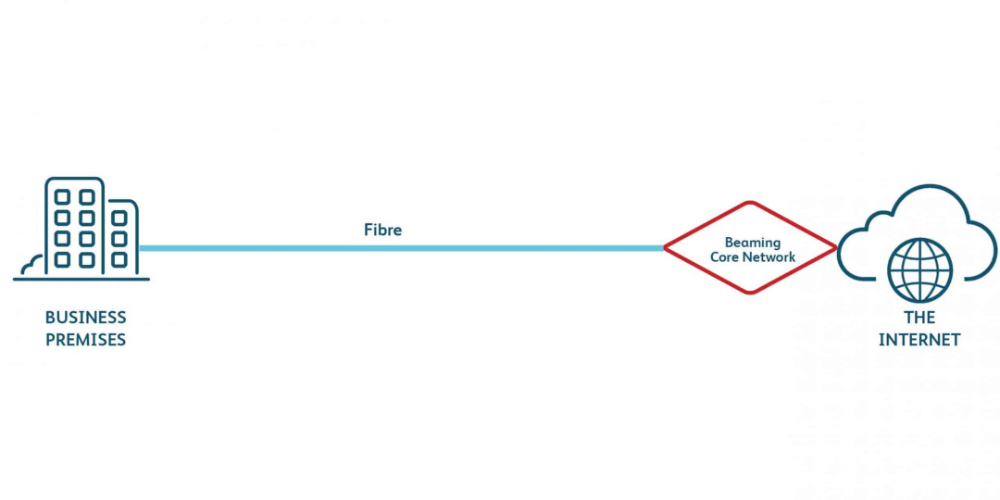
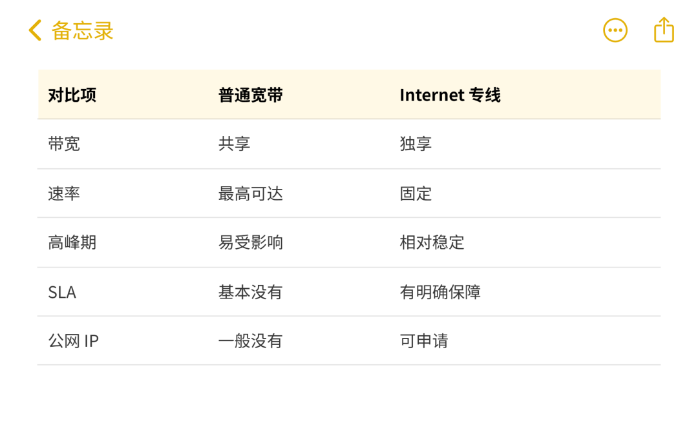
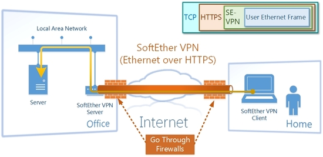
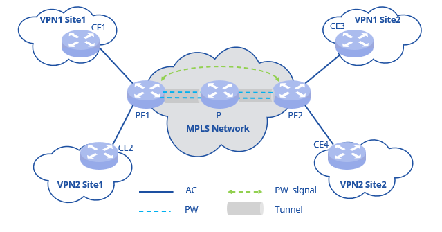
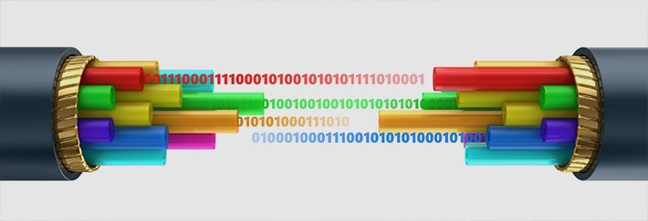
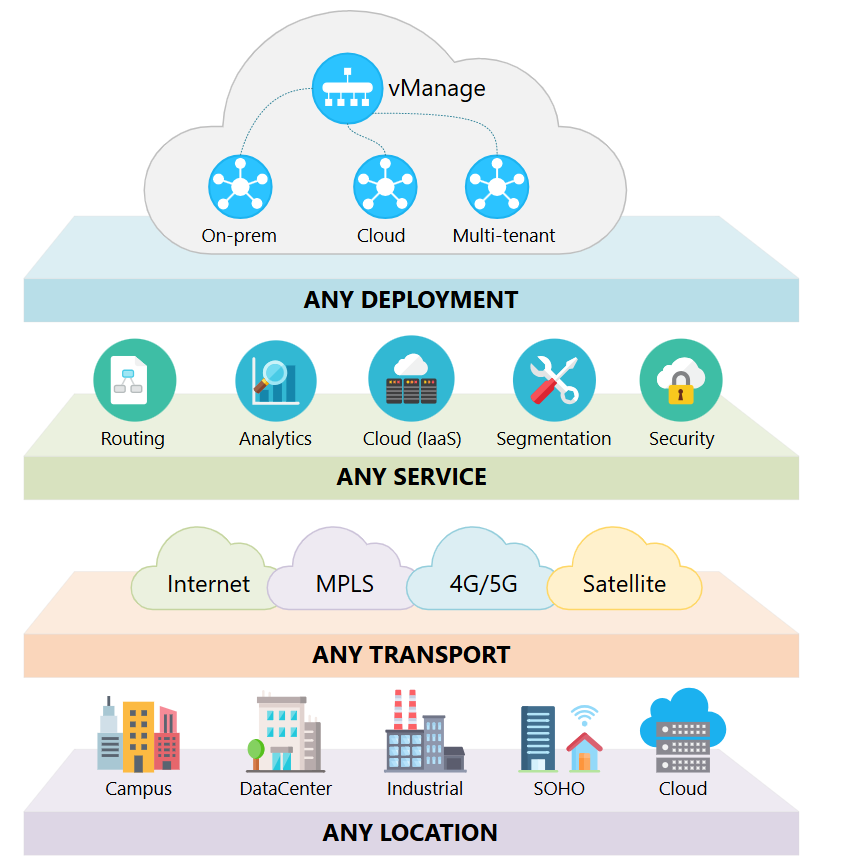

# 企业网络里常说的专线，到底分哪几类？你公司用的是哪一种

> 原文链接：[企业网络里常说的专线，到底分哪几类？你公司用的是哪一种](https://mp.weixin.qq.com/s/X2v_m6y37Jr7bZACEL_e8w?clicktime=1770347942&enterid=1770347942&exptype=unsubscribed_card_recommend_article_u2i_mainprocess_coarse_sort_pcfeeds&ranksessionid=1770347746_3&req_id=1770347083831088&scene=169&subscene=200)

公众号：网络技术联盟站&nbsp;

在企业网络中，通常被称为“专线”的线路，一般具备几个共同特征：带宽是固定的，而不是“最高可达”线路面向企业用户交付有明确的服务保障（SLA）稳定性和可用性优先级高于普通宽带多数情况下支持公网 IP 或专用地址

如果一条线路在高峰期会明显被抢占、速率波动很大、出了问题只能排队报修，那即便名字里带着“专线”，实际体验也更接近普通宽带。

有的专线是为了**稳定上网**，

有的是为了**分支机构互联**，

有的是为了**跨地域、跨国家访问**，

还有的专线，本质是为了承载数据中心或灾备系统。

如果不区分类型，很容易出现以下情况：实际需求只是稳定上网，却选择了成本很高的企业组网专线需要分支互联，却只拉了一条普通 Internet 专线网络慢，问题却不在“是不是专线”，而在选型不匹配## 最常见的一类：Internet 专线

Internet 专线，可以理解为：

**运营商为企业提供的一条独享、固定带宽的互联网接入线路。**

它直接连接运营商的骨干网络，不与家庭宽带用户共享接入资源。

常见规格包括 50M、100M、200M、1G 等，上下行通常是对称的。### 和普通宽带的主要区别

这也是很多公司“第一次上专线”时最常选择的类型。### 适合哪些场景？

单一办公点主要使用云服务、SaaS、互联网业务对稳定性有要求，但网络结构相对简单没有复杂的多分支互联需求## 二层专线：更“透明”的专线形式

二层专线通常指：

**运营商在二层网络上，为用户打通两个或多个站点的专用通道。**

对用户来说，中间的运营商网络几乎是“不可见”的，两个站点就像通过一根很长的网线直接连在了一起。

常见叫法包括：

L2 专线、以太网专线、二层透明通道等。### 二层专线的特点

两端处于同一二层网络IP、路由、协议完全由用户控制延迟和抖动较低运维和配置复杂度相对较高

简单理解就是：

**自由度高，但对网络管理能力要求也更高。**### 常见使用场景

同城机房互联主备数据中心灾备链路对延迟非常敏感的业务系统## MPLS VPN 专线：传统企业组网方案

MPLS VPN 专线是一种：

**由运营商在其骨干网内部构建的企业专用网络。**

分支机构接入后，彼此之间可以直接通信，而不经过公网。### 它的优点和局限

**优点：**稳定性高网络质量可控分支互联简单运维压力较小

**局限：**成本较高开通周期较长灵活性相对有限扩展速度慢

因此，它更常见于对稳定性要求极高的传统行业。### 哪些企业还在大量使用？

金融机构政企单位全国性大型企业对网络中断容忍度极低的业务## 国际专线 / 跨境专线

普通互联网在跨境访问时，常见问题包括：路由绕行延迟高抖动和丢包访问质量不稳定

国际专线的核心目的，就是在跨境链路上提供**更稳定、可预期的网络质量**。### 常见形式

国际 Internet 专线国际 MPLS 专线海外节点接入跨境二层专线### 适合哪些业务？

海外分公司办公跨国协同系统跨境电商海外数据中心访问## 专线 + SD-WAN

越来越常见的组合方式

SD-WAN 本身并不是一种专线，而是一种**网络使用方式**。

它可以：同时使用多条专线或宽带根据实时质量自动选路提升链路利用率降低单一专线的依赖

现在不少企业的网络形态，已经从“只靠一条专线”，变成了：

**专线为主，多链路协同使用。**## 判断你公司用的是什么专线

可以从几个实际问题入手：带宽是不是固定的？高峰期是否明显变慢？分支之间是否天然互通？业务是否直接暴露在公网？运维对接的是企业专线团队还是普通客服？

这些问题基本可以帮助判断专线的类型，而不需要深入技术细节。

**喜欢就****分享**
**认同就****点赞**

**支持就****在看**

**一键四连，你的技术也四连**

