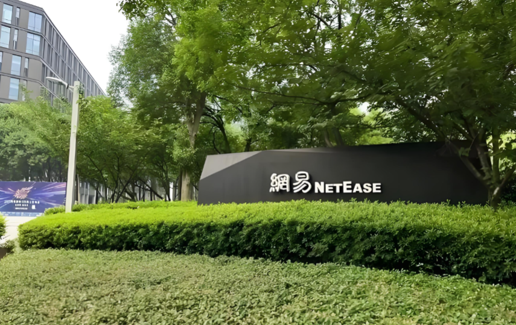

# 再见了, 网易!

> 原文链接：[再见了, 网易!](https://mp.weixin.qq.com/s?__biz=Mzk0OTg3ODM3Ng==&mid=2247490775&idx=1&sn=34fdadfff04a1849ee5348c8a8e4c6e4&chksm=c27bbdd8064659ad027cf6a5b8215e602f858aada44b7677dd96c4b6a9c22bdb142667a4fa58&mpshare=1&scene=1&srcid=0213foHcajLbgCCItl7ivxtV&sharer_shareinfo=6bf2dcab837de5f1b8ea48d2eb18fd54&sharer_shareinfo_first=6bf2dcab837de5f1b8ea48d2eb18fd54#rd)

如果你刷到过2025年底那波网易新闻——"丁迎峰退休""梦幻西游之父谢幕", 你可能觉得，那场面很体面，算是功成身退。

可我在2025年初就走了。

没赶上给丁老板送行，倒是赶上了广州这边那场漫长的、无声的"人事地震"。我工位对面，就是一个已经停运的大项目组的成员。我刚去的时候他还在带实习生调UI，等我走的时候，那一片区的灯，黑了快一半。

老有人问我：网易到底怎么样？

我想了挺久, 你要我说一个绝对的结论，我讲不出。但如果你愿意听一个普通策划讲一讲那段在网易的经历，我至少能告诉你：当一个公司开始排着队送走"老功臣"的时候，底下那池水到底有多凉。

2024年7月，我拖着箱子到广州科韵路报到。

网易食堂是真好，入职培训也是真的像样。HR把我们那批校招生领进去的时候，大厅屏幕正放着《梦幻西游》20周年的海报。那种"我进了一家有年头的大厂"的感觉，真挺踏实。

也就是那个月，后来我才知道，某个事业部的负责人已经在走离职流程了。

新人嘛，没人跟你聊这些。你只知道你导师忙得回微信都没空；你只知道隔壁组的代码库好几个月没人动了，但周会的PPT做得跟画报似的。

那一年，网易游戏成天在"调整"。媒体后来给它包装成"丁磊回归一线""反腐""聚焦精品"。但我们底下人感受到的，是另一种东西——

每两周换一版组织架构图，和永远对不上号的汇报线。

我带第一个小需求，要过三层审批：组长、主策、还有个我不知道该叫啥的事业部接口人。三个人意见经常打架，改完一轮又一轮。我问组长："这功能到底听谁的？"

他愣了几秒，说："你先照我的来，后面还得改。"

后来确实改了。不是需求改，是人换。两周后，接口人换了一个。

2024年下半年到2025年底，网易至少7个游戏工作室动了刀。我们部门没被砍，但汇报关系换了三回：从A事业部划到B中心，再从B中心划到C产品线。每次一划，就得重新写立项材料、盘人头、报预算。

入职前我以为游戏策划就是"设计好玩的东西"，后来才明白，设计东西只占20%，剩下80%是在证明"你凭什么有资格设计东西"。

网易内部有个说法，叫"制作人即土皇帝"。

我刚听觉得太夸张。后来发现，这话既准，又不准。

往准了说，一个项目真就是制作人那点脾气的投射。审美、节奏、用谁不用谁，全是他说了算。你根本不用看什么流程手册，瞅他平时喜欢谁、嫌弃谁，就知道这组往哪走。

往偏了说，这种一个人说了算的模式，公司要冲业绩时是发动机，公司要找个人背锅时，就成了活靶子。

2024年《射雕》那波折了，是个转折点。

10个亿，6年，金庸的顶级IP，丁磊亲自盯。上线俩月流水崩盘，2025年11月官宣停运。我当时不在那个项目，但那段时间整个广州办公区的气压是通的——大家走路都绕着那个楼层绕，不是冷漠，是不知道该说啥。

然后就新闻里那波人走：李凯明、金韬、邵赟、林云枫。

有意思的是，这些人走之前，都曾经是自己那条道上封神的主儿。率土Like的开创者，《阴阳师》的爹，《梦幻西游》手游的掌舵人。他们不是没做出过爆款，正是因为做出过，才被留在牌桌边上，坐太久了。

我不是说他们不该走。我只是想说，当一家公司开始琢磨"英雄史观"是不是有问题的时候，最先难受的，是那帮以前最信英雄的底层。

我隔壁工位的同事，跟了某位已走的大佬五年。大佬一走，新来的负责人约他谈话，问："你以前的思路是不是有点过时了？"

他没辩解，只是回来之后，把工位上那尊手办默默收进了抽屉。

那一年，我们内部其实很少说"网易"，都是分"广州网易"和"杭州网易"。

杭州有雷火，有《逆水寒》，有《永劫无间》，有《蛋仔派对》，有《燕云十六声》。广州有大话、梦幻、天下——还有一堆没跑出来的新东西。

2025年3月，胡志鹏升了集团执行副总裁。消息出来的那天下午，茶水间有人压着声音聊："以后互娱是不是得给雷火汇报了？"

没人答得上。

杭州团队确实猛。猛在哪？猛在敢花钱、敢试错、敢用AI把MMO的价格打下来。丁磊在财报会上说"整合能力是新的护城河"，翻译成我们能听懂的话就是：以后不看你手里有多少人，看你把这些人拧成一股绳要多快。

而广州的问题，正好是那根绳子太粗，拧不动。

我参与过一个广州侧的新项目立项。从需求评审到美术demo过审，用了四个月。同期杭州那边一个类似玩法的项目，已经做完一轮玩家测试了。

不是说杭州没流程。是说，一艘大船发现自己转不了弯的时候，第一件事不是调舵，是换一批划船的。

我就是那个还在划、但舵手已经换了的船员。

看网上有人说"汇报形式主义严重"，底下有人回：哪个大厂不汇报？这就矫情了吧。

我想替他说一句：累的不是汇报本身，是汇报给一个明天还在不在都不知道的部门，最累。

2024年底到2025年，网易广州的人事变动，论月算。你花三天写了一份年度规划，抬头的人换了；你再花两天改一版，又换一个。

最离谱的一次，是双周汇报会上，leader当着一组人的面问项目主策："你这条数据口径谁让你这么出的？"

主策答："上个月您让这么出的。"

leader愣了一下，说："哦，那改了吧。"

会开完，那个主策在工位上坐了二十分钟没动。他没哭，也没骂，就是单纯坐着。

我不知道他在想什么。但我猜，那会儿他肯定也在琢磨：这个月定下来的事，下个月还能算数吗？

我是2025年3月提的离职。

办完交接那天晚上，我一个人在科韵路天桥上站了很久。网易那栋楼的灯还是那么亮，跟我一年前面试时一模一样。

那时候我压根没想到，2025年12月，我会在游戏圈刷到丁迎峰退休的消息。

23年。从《大话西游》到《梦幻西游》，从端游的黄金年代到手游的红海。他等到了《漫威争锋》上线，等到了《燕云十六声》登顶，然后体面收场。

我没能等来我的项目上线。

说不难受是假的。但也谈不上恨。

网易不是没有好人，就是那阵子，把好人搁错地方了。

现在我待一家小公司，二十来个人，做一款没人听说过的游戏。

没食堂，没班车，也没高管离职上的新闻。但我的需求今天提，明天就能进版本。主策坐我斜对面，喊一嗓子就好。

有时候加班到很晚，会突然想起网易那段日子。

那段时间教会我的，不是怎么做游戏，而是一个地方到底什么样才算正常。

2026年了，网易还在调，还在换，还在找下一个《梦幻西游》。

我也终于能挺平静地说一句：那段时间，没白待。我见过它最好的样儿，也见过它最焦虑的样儿。

