·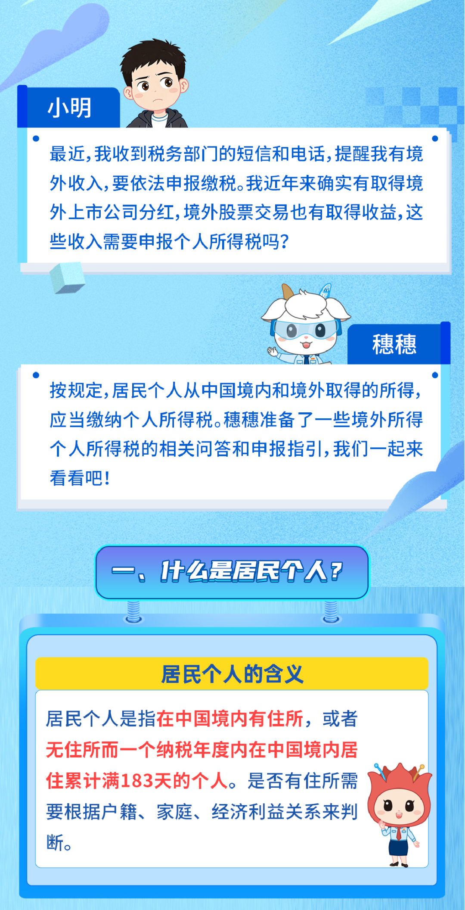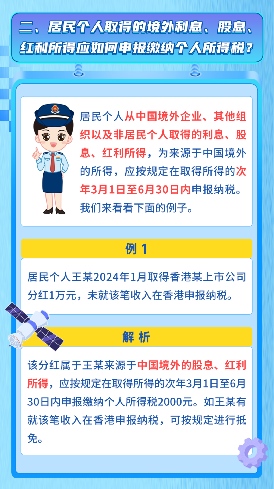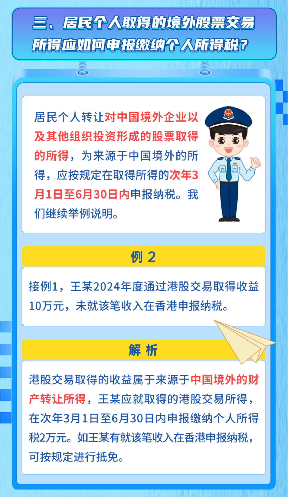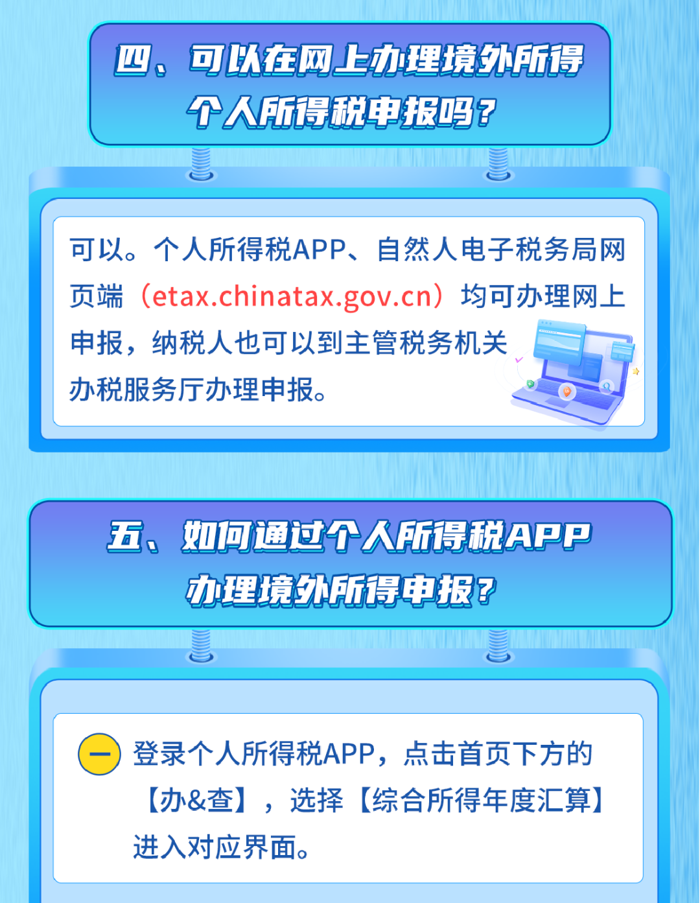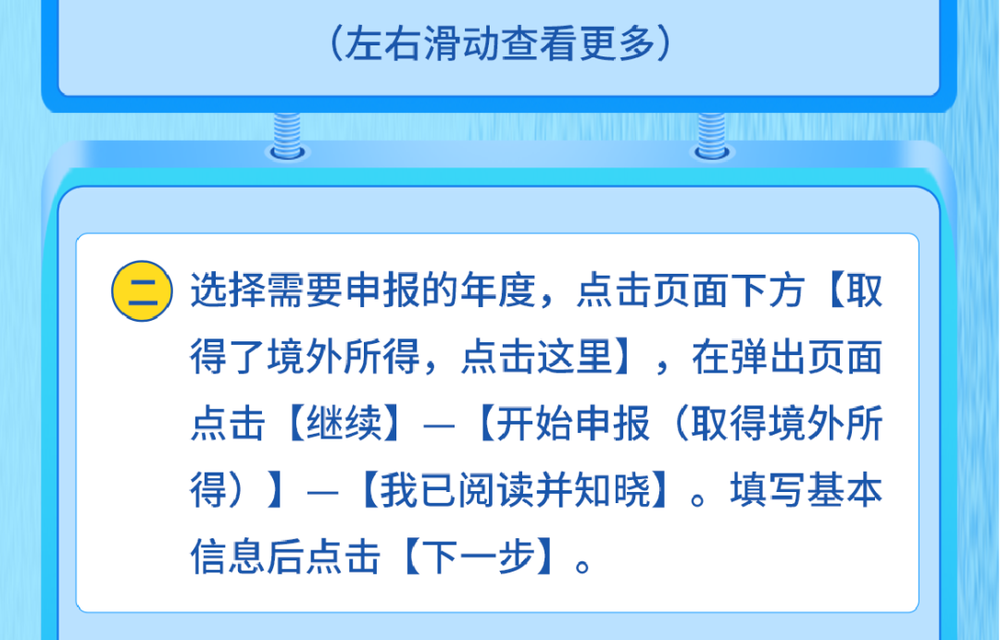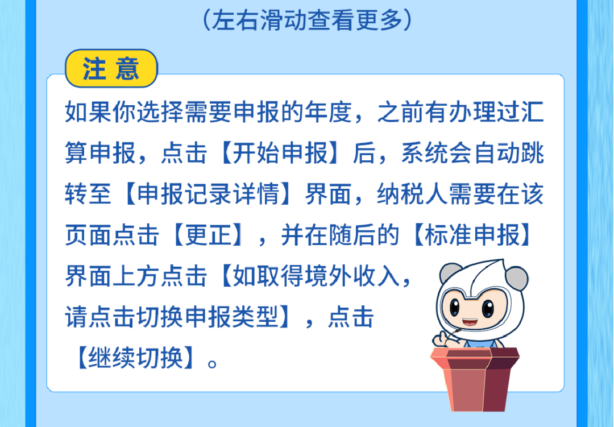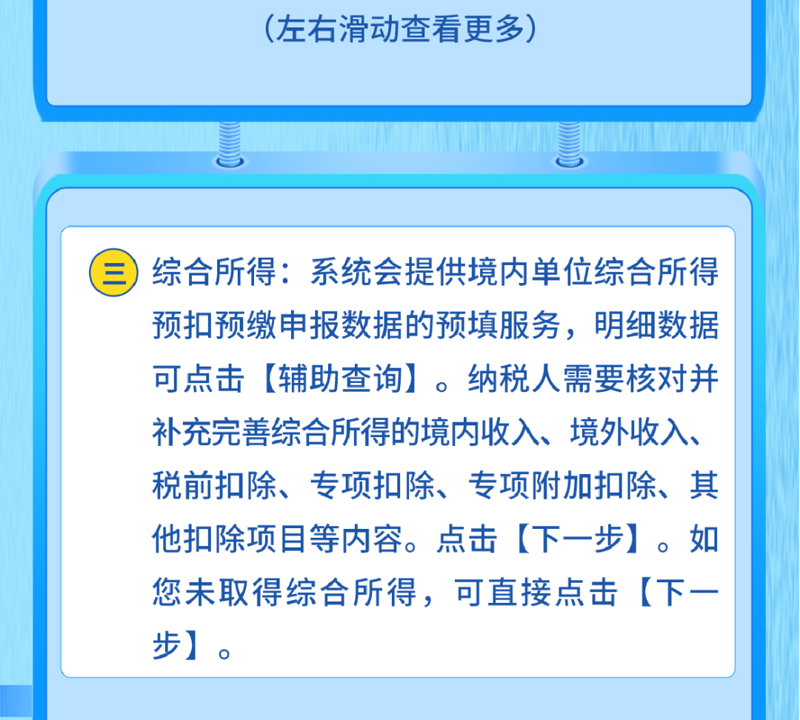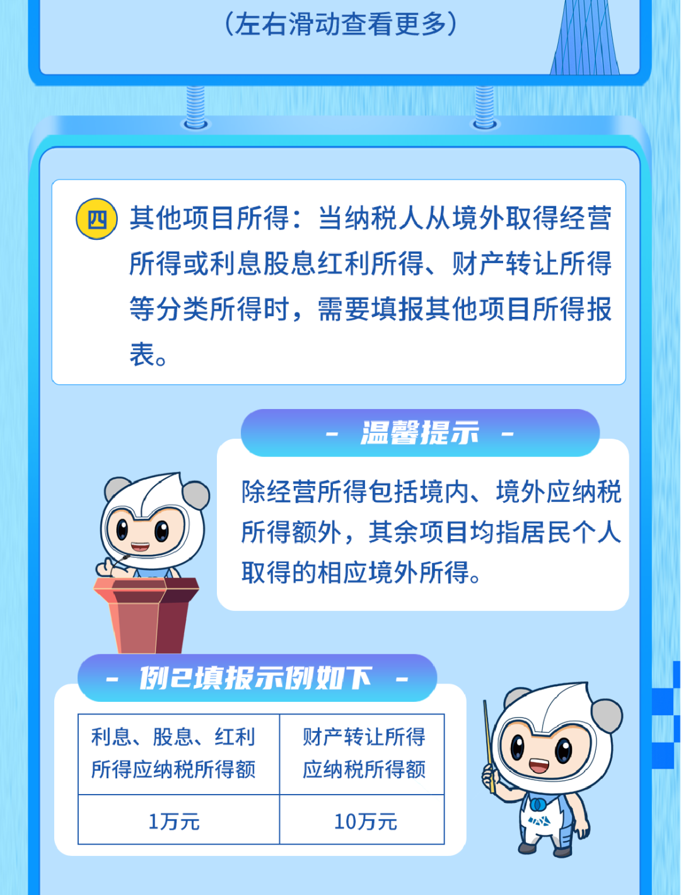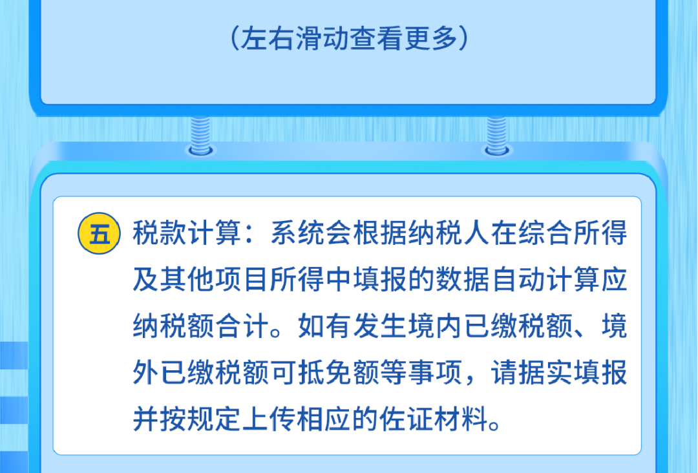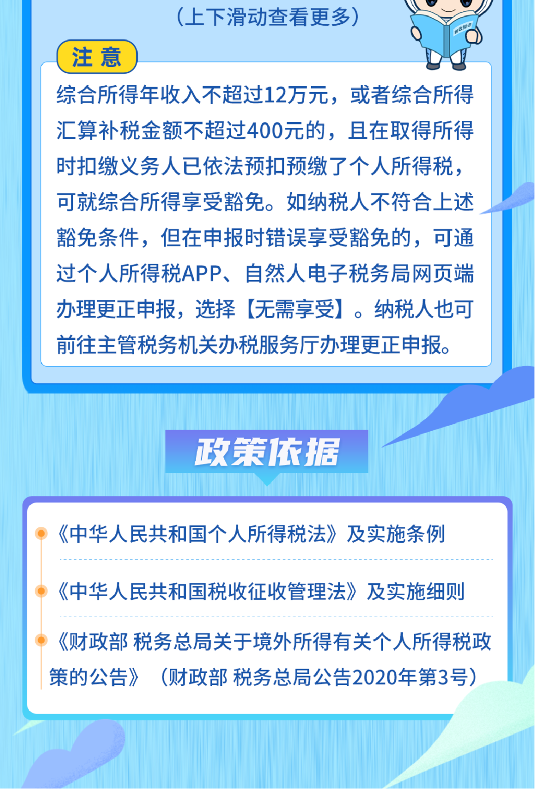

* * *

来源：国家税务总局广州市税务局

国家税务总局广州市荔湾区税务局

编发：广州税务融媒体中心

  

  

  
[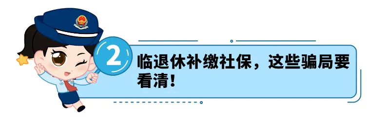](https://mp.weixin.qq.com/s?__biz=MzUxMzU0ODQ5Mw==&mid=2247700701&idx=1&sn=930b5516738b9642827f9f95f660af6d&scene=21#wechat_redirect)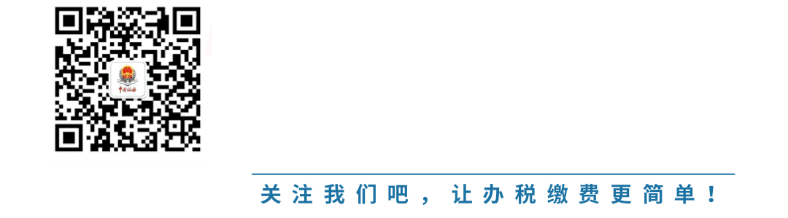