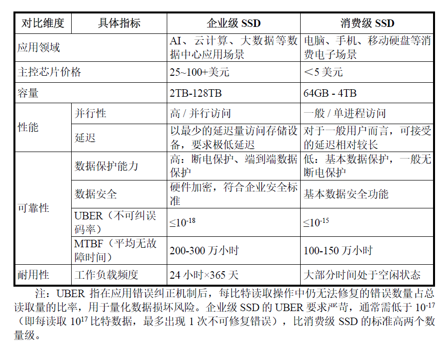
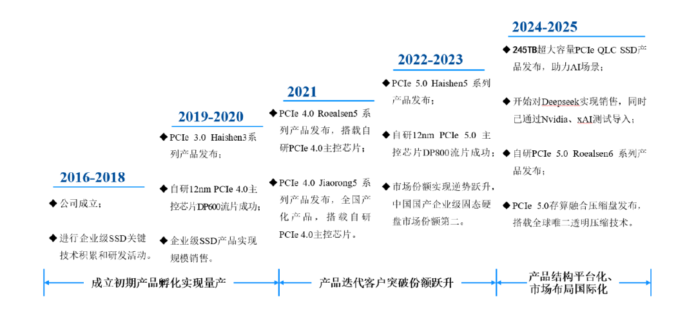
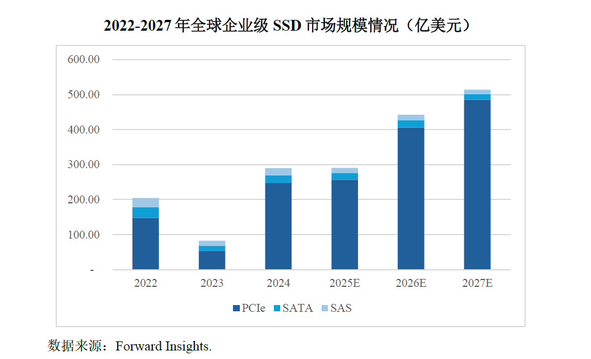
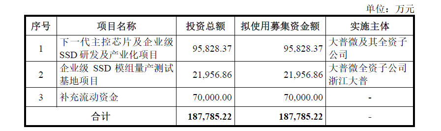

# 大普微IPO，中国企业级 SSD 的历史性一跃，存储产业迎来关键力量

> 原文链接：[大普微IPO，中国企业级 SSD 的历史性一跃，存储产业迎来关键力量](https://mp.weixin.qq.com/s/k_Oc6BlUGVBVyvxId-UIsg)

**从全球存储产业演进，看中国企业的缺席与转折**

**
**

1956 年，IBM 推出世界上第一台硬盘，现代存储产业由此起步。此后数十年，机械硬盘技术不断演进，并逐步形成以西部数据、希捷和东芝为代表的寡头格局。

**这是一个延续了半个多世纪的产业线，但在这条主线中，中国大陆厂商几乎长期缺席于全球核心存储技术与高端市场。**

存储技术的下一次关键变化，源于**闪存**的出现。1984年东芝公司发明闪存，经多年技术商业化探索，2000年首次以U盘形式用于消费电子领域；此后经过十余年的技术探索和演进，经过SLC NAND到3D NAND，SATA/SAS到PCIe接口标准的迭代，直到英特尔2016年企业级PCIe SSD的规模化量产，推动企业级SSD在数据中心、云计算等场景逐渐占据存储体系的主角位置。

近年来，AI的快速发展，进一步放大了高性能存储的重要性。但从产业演进角度看，这一趋势本质上是存储体系由**HDD时代向SSD时代过渡**的延续，**中国存储产业迎来了以企业级 SSD 为代表的关键窗口期。**

大普微围绕企业级 SSD 关键存储技术持续投入，并在全球科技产业体系中逐步形成具有实质影响力的工程与产品能力。2026年1月23日，大普微IPO注册获批，即将登陆深交所创业板。

**数据中心企业级 SSD，国家信息基础设施的关键核心部件**

与消费级SSD不同，企业级 SSD 面对高度复杂且长期运行的数据中心环境：7×24 小时持续运行、高并发多队列访问、复杂混合读写负载，以及对一致性、可靠性和安全性的严格要求。

在企业级领域真正决定一款企业级 SSD 能否被核心系统采用的是一整套工程能力的协同结果。从芯片到产品的工程链条：**设计实现、封装、板级、热设计、电源保护、验证策略、量产测试、质量追溯，**使用场景要求极其严苛，任何环节不足，都会把风险留给客户系统。

企业级产品要求的是规模化交付后极低的失误率，更直观地来说，**企业级 SSD 承担的是社会关键系统的底层责任：**

**
**

AI智算中心里，高性能、低时延的存储体系，是保障训练效率与推理稳定性、避免算力资源空转的关键支撑；

金融系统中，交易、清算、审计、风控日志的稳定存储，是保障业务连续运行、资产安全与信任机制的重要部分；

公共服务、工业制造、交通通信等领域，存储则承载着数据可追溯性、可恢复性和社会信任。

正因为承担着上述系统级责任，**数据存储被明确界定为国家信息基础设施的关键核心部件。**企业级 SSD 之所以长期由少数厂商主导，正是源于其极高的技术与工程门槛。这也是全球企业级 SSD 市场长期保持高度集中的根本原因。即便在国产化进程加速推进的背景下，**真正具备系统级能力并能够实现规模化出货的厂商仍然有限。**随着数据中心规模扩大、系统复杂度提升，这一门槛并未降低，反而持续抬高。

从产品力与市场地位上看，大普微是业内领先、国内极少数具备企业级 SSD“主控芯片+固件算法+模组”全栈自研能力并实现批量出货的半导体存储产品提供商，从资本市场角度观察，大普微也是**兼具稀缺性与成长性的企业级PCIe SSD标的**，技术壁垒和成长前景显著更高。

**大普微，在企业级 SSD高壁垒存储领域的领导企业**

在这样一个高壁垒、强工程属性的赛道中，判断一家厂商是否真正具备实力关键在于其是否能够通过最苛刻应用场景的系统级验证，并留下可被验证的工程与商业里程碑。

大普微成立于 2016 年，公司在创立之初即明确聚焦数据中心企业级 SSD 这一高门槛领域，并围绕主控芯片、固件算法与模组工程构建长期研发体系。随着公司生产经营规模持续扩大，2022年至2024年，公司**主营业务收入复合增长率达57.66%。**

根据大普微官网，在 PCIe 4.0 代际逐渐走入市场视野的2020年，大普微完成了自研 12nm Gen4 主控芯片DP600的流片，标志着公司在企业级 SSD 最关键的控制与数据路径环节上**具备完全自主研发能力。**2021 年，公司发布了第二代SCM SSD产品——Xlenstor2，值得一提的是，该产品是市面上少有的对标英特尔Optane的“存储级内存”产品，兼具SSD硬盘的持久性、低成本与DRAM内存的高速率。

2022 年，公司作为首批全球厂商发布企业级PCIe 5.0 SSD系列产品，PCIe 5.0企业级SSD产品具备了相较于上一代产品两倍的数据吞吐能力，在随机读写和时延等核心指标表现上业内领先。

2023 年，大普微自研 PCIe 5.0 主控芯片 DP800流片成功，并在国产企业级固态硬盘市场实现逆势跃升，当年主营业务收入达到 5.09 亿元，国产企业级 SSD 开始同步参与新一代数据中心平台建设。

2024年AI领域的突破震荡数据世界，为存储产品容量与介质结构带来极大影响，大普微凭借前瞻的产品布局，率先推出 PCIe 4.0 QLC 企业级 SSD，实现国产厂商PCIe 4.0代际大容量&nbsp;**QLC 企业级 SSD 的首发，**并进一步量产 64TB 超大容量产品，面向冷数据、近线数据及混合负载AI场景，为企业级 HDD 的国产替代提供可工程化落地方案。2024年，**公司全年营业收入接近翻倍，业务进入明显放量阶段。**此外，公司基于多年的技术积累和客户覆盖优势，积极开发应用于数据中心网络互联场景的智能网卡和RAID卡等智能网联类产品，产品矩阵进一步平台化。

自此，公司形成了面向AI和云计算等场景的“SCM + TLC SSD + QLC SSD”的完整企业级存储产品矩阵，并布局智能网联为代表的产品平台化延展。产品线覆盖了AI大模型从数据采集到训练、推理、归档的全链条存储需求，为后续AI客户导入、收入持续放量建立了坚实的基础。

2025 年，公司实现对 DeepSeek 的批量销售，并通过 Nvidia、xAI 等**全球头部 AI 企业**的测试导入。上述企业在存储选型中通常采用高强度、多轮的系统级测试，对并发访问、持续写入稳定性与一致性提出极高要求，能够进入其评估与验证体系，意味着产品在性能、长期运行稳定性与工程一致性等关键指标上，**已达到国际一线数据中心的应用水准，形成了明显的客户资源优势。**

2022-2025年6月，公司企业级SSD累计出货量达4900PB以上，其中搭载自研主控芯片的出货比例达75%以上。并且，公司注重研发投入，2022–2024年研发投入分别为19,387.13万元、26,867.72万元和27,436.03万元，累计研发投入占主营业务收入占比达40%。

根据招股书披露，大普微已承担2项国家级、4项省市级重大科研专项，参与多项行业标准与规范制定，并获评国家级专精特新重点“小巨人”企业、国家知识产权优势企业、广东省存储芯片及系统工程技术研究中心等资质。在中国企业级 SSD 存储产业中，大普微已形成领先的技术与产业位置，在实现自主可控的同时，获得了客户与市场的持续认可。

**政策与需求共振，企业级 SSD 迎来规模扩展期**

在完成多层级系统验证与客户导入后，大普微进入企业级存储业务的放量阶段。这一阶段的形成，既源于公司前期在技术、产品与工程能力上的持续积累，也与数据中心基础设施建设所处的发展周期高度契合。

从行业主要法律法规及产业政策层面看，数据存储作为信息基础设施的重要组成部分，长期处于国家重点支持与规范发展的方向之中。《“十四五”数字经济发展规划》《“十四五”信息化规划》《新型数据中心发展行动计划》等政策文件，均**将数据中心、云计算、算力基础设施及其关键部件纳入重点发展范围，**并对系统安全性、可靠性以及自主可控能力提出明确要求。这些政策为**企业级存储等关键基础部件提供了长期、稳定的发展环境。**

从全球市场维度看，企业级 SSD 已成为数据中心存储体系的重要组成部分。根据**&nbsp;Forward Insights&nbsp;**统计，随着存储行业需求提振持续增长，**预计到 2027 年市场规模将达到 514.18 亿美元，年复合增长率约为 20.25%。**在产品结构方面，**PCIe 接口企业级 SSD 占据主导地位，且占比持续上升，**其在数据中心等终端场景中的应用覆盖率不断提高，成为企业级存储的主流技术路径。

在上述政策与市场环境下，招股书披露，2025 年公司预计实现营业收入20.5-23.5亿元，同比增长 113.06%-144.24%。

大普微本次 IPO 拟募集资金约 18.78 亿元，重点投向下一代主控芯片及企业级 SSD 研发与产业化、企业级 SSD 模组量产测试基地建设及补充流动资金。募投方向紧密围绕规模化交付能力、测试一致性与供应链稳定性等关键环节，服务于公司在更大规模数据中心项目中的持续参与能力。

其中，下一代PCIe 6.0主控芯片及企业级 SSD 研发与产业化项目，**聚焦企业级 SSD 最核心、附加值最高的主控芯片和固件系统研发环节。**企业级 SSD 具有显著的代际演进特征，要求厂商具备持续迭代主控芯片与产品体系的能力。该项目的实施，有助于公司保持在 PCIe 接口演进及新一代数据中心平台中的技术连续性，避免在平台切换过程中出现能力断层。

**存储能力正在成为基础设施竞争的关键变量**

从更长的产业周期看，中国存储产业正处在关键转折点。机械硬盘主导的时代，中国几乎未能参与全球核心竞争；当存储形态加速向企业级 SSD 转移，竞争重心从介质制造进一步转向系统架构、工程体系与长期可靠性，产业第一次获得了重新进入主赛道的窗口。随着 AI 带来的数据访问模式变化叠加数据中心持续扩张，企业级 SSD 的价值正在从硬件部件走向基础设施能力，行业上行的主线也更清晰。

在这一窗口期里，能把“芯片—固件—模组工程—规模化交付”贯通并跑出可验证里程碑的厂商极少。大普微在企业级 PCIe SSD 赛道上形成了“主控芯片 + 固件算法 + 模组”全栈自研与批量出货能力，且产品矩阵覆盖 SCM、TLC 与 QLC 等关键层级，能够匹配 AI 与云计算全链条的存储需求。这类全栈能力对应的是更高的技术壁垒、更可见的规模扩展空间，也为中国存储产业在全球技术体系中确立更关键的位置提供了现实基础。

