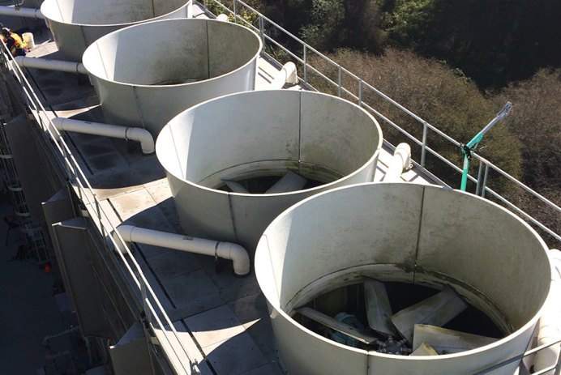
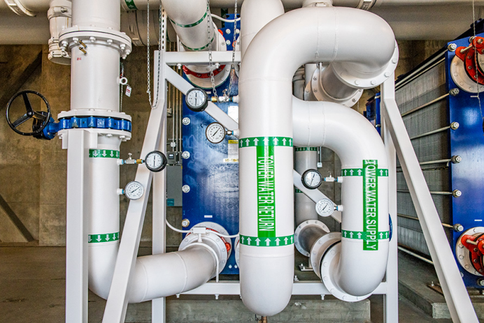
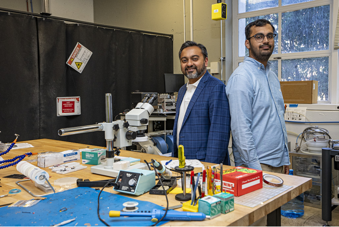

  

**研究人员如何推动数据中心技术****的****进步******

**How Researchers Are Driving Advances for Data Centers**

**  
**

**译 者 说**

本文围绕数据中心成为美国关键基础设施后，因规模扩张与 AI 发展引发的能耗、冷却等核心挑战，聚焦伯克利实验室的七大革新举措。从能源趋势追踪、芯片与制冷技术突破，到冷却标准制定、能效工具研发及仿真优化，全方位展现科研与产业协同的创新路径。这些实践为数据中心高效、可靠、绿色运行提供关键支撑，也为行业可持续发展指明方向。

  

  

从专业的能效分析、节能计算机模型，到集成冷却技术的超级计算机，劳伦斯伯克利国家实验室正全方位推动技术创新，助力打造绿色节能的数据中心。

From expert analyses and energy-saving computer models to supercomputers with built-in cooling technologies, Berkeley Lab is driving innovation toward energy wise data centers

当今技术对计算机和人工智能的依赖程度日益加深，而这两类技术的运行需要数据中心提供动力。如今，数据中心已成为美国至关重要的基础设施。在过去二十年间，数据中心的数量迅猛增长，不仅推高了高性能计算芯片的供电需求，也增加了冷却系统所需的水资源和能源消耗。

Today’s technologies depend increasingly on computers and artificial intelligence — largely powered by data centers, which have become essential U.S. infrastructure. Over the past two decades, data centers have proliferated quickly, driving up demand for electricity to power high-performance computing chips, as well as water and energy for cooling.

劳伦斯伯克利国家实验室（伯克利实验室）始终走在这一变革的研究前沿，不仅开展开创性分析，还与产业界展开合作——合作对象涵盖头部人工智能企业、公用事业机构及电网运营商——助力保障现代数据中心所需的能源与制冷，实现全天候可靠供应。研究人员针对数据中心行业快速扩张所带来的能源影响展开分析与量化评估，同时与行业核心参与者携手探寻最佳实践方案、支持负荷预测、优化数据中心结构与电网的合作模式。

Lawrence Berkeley National Laboratory \(Berkeley Lab\) has been at the forefront of research on this evolution, conducting pioneering analysis and partnering with industry — from top AI companies to utilities and grid operators — to help ensure the reliable, around-the-clock supply of energy and cooling that modern data centers demand. Researchers are analyzing and quantifying the energy implications of the data center industry’s rapid expansion. They are also working with key players in the industry to identify best practices, support load forecasting, and optimize data centers and how they interact with the electric grid.

**以下是劳伦斯伯克利国家实验室助力美国数据中心提升运行可靠性的七大举措。  
**

**Here are seven ways Berkeley Lab is helping U.S. data centers run more reliably.******

追踪发展趋势  
Tracking growth trends

**  
**

劳伦斯伯克利国家实验室是美国能源部数据中心能源专业技术中心的依托单位。该实验室致力于明确这一快速发展领域所需的各类资源，并助力构建稳定高效、效能最大化的基础设施。去年 12月，实验室研究人员更新了具有里程碑意义的《美国数据中心能源使用报告》，全面呈现了2014-2028年美国数据中心的水电需求态势。

Home to the U.S. Department of Energy’s Center of Expertise for Data Center Energy \(CoE\), Berkeley Lab is identifying the resources that will be needed to fuel this fast-growing sector and helping to ensure stable, reliable infrastructure that runs as efficiently as possible. In December last year, the Lab’s researchers updated the seminal  *United States Data Center Energy Usage Report* , providing a comprehensive picture of water and electricity needs for data centers from 2014 through 2028.

《数据中心能源使用报告》指出，2016至2023年间，数据中心的耗电量近乎增长至原来的三倍。报告撰写者发现，到2028年，数据中心的耗电量最高或将占到美国总用电量的12%。劳伦斯伯克利国家实验室持续吸纳产业界的反馈意见，力求产出最为精准的预测数据，并提高报告的更新频率，以适应这一行业飞速发展的步伐。

The  *Data Center Energy Usage Report* notes that data center electricity use nearly tripled between 2016 and 2023. By 2028, the report’s authors found, data centers could account for as much as 12% of U.S. electricity consumption. Berkeley Lab continues to incorporate industry feedback to ensure the most accurate projections and will provide more frequent updates to keep pace with this rapidly evolving sector.

  

以集成式制冷技术赋能人工智能革命  

Fueling the AI revolution with built-in cool tech

**  
**

长期以来，劳伦斯伯克利国家实验室的计算与能源研究人员在管控数据中心能源影响方面发挥着关键作用。他们持续优化超级计算机的能效表现，这对于改善数据中心的能耗水平至关重要。同时，该实验室与行业伙伴合作，为美国能源部下属、位于伯克利实验室的国家能源研究科学计算中心（ NERSC）设计超级计算机系统，以实现节水节能目标。无论是2021年投入运行的 NERSC “珀尔马特” 超级计算机系统，还是计划于2026年底上线的下一代旗舰系统 “杜德纳”，均采用液体直冷芯片+自然风冷却的复合冷却方案，以实现能效最大化。

Berkeley Lab computing and energy research staff have long played critical roles in managing the energy impacts of data centers. They have been optimizing supercomputing for efficiency, which is critical to improving data center energy consumption. And they have partnered with industry to design supercomputer systems housed in the Department of Energy’s National Energy Research Scientific Computing Center \(NERSC\) at Berkeley Lab to save energy and water. Both NERSC’s Perlmutter system, installed in 2021, and its next flagship system Doudna, due in late 2026, are liquid, direct-to-chip cooled systems combined with ambient air cooling to maximize energy efficiency.

美国国家能源研究科学计算中心（NERSC）并未采用制冷剂系统进行冷却，而是利用环境空气和冷却塔提供的 “自然散热”，将数据中心产生的废热直接排放到外界环境中。该中心耗时两年开展的节能改造项目，成功将非IT能耗降低了 42%，每年可节省超过200万千瓦时的电力和50万加仑的水资源，每年减少约20万美元的公用事业账单支出。（非IT设备能耗指用于保障高性能计算机运行的配套能耗，其中包含制冷系统能耗）。该项目所积累的技术经验，可推广至全美各地的高性能计算中心。

Instead of using refrigerant systems for cooling, the NERSC facility uses natural air conditioning provided by ambient air and cooling towers, which rejects data center waste heat directly to the outside environment. A two-year effort reduced non-IT power consumption by 42%, with annual savings of over 2 million kWh of electricity and a half million gallons of water, reducing utility bills by approximately $200,000 per year. \(Non-IT power is used to support high-performance computers, including power used for cooling\). Lessons learned from the project could be applied to high-performance computing centers across the country.

  

美国国家能源研究科学计算中心（NERSC）冷却塔实景图。

View of NERSC cooling towers. 

  

换热管道将外部冷却塔的冷水输送至NERSC机房，同时将热水回流至冷却塔进行冷却，全程无需借助暖通空调系统。

Water exchange pipes bring cool water from exterior cooling towers to the NERSC machine room while sending warm water back to the towers to be cooled without the use of HVAC systems. 

在微芯片上集成更高算力  
Packing more compute power on microchips

**  
**

虽然高效计算是提升数据中心能效的关键，但微芯片才是改善处理速度与能耗表现的核心所在。劳伦斯伯克利国家实验室在先进晶体管研发领域开展了开创性的先导研究，为节能型计算机微芯片的问世铺平了道路 ——这类芯片相比传统硅基芯片，不仅性能更优，能耗也更低。

While efficient computing is critical to improving data center efficiency, microchips are key to improving processing speeds and energy consumption. Berkeley Lab has led pioneering research in building advanced transistors, paving the way for energy-efficient computer microchips that could perform better and require less energy than conventional silicon chips. 

近期，研究团队取得了一项突破性成果：研发出具备超高能量密度与功率密度的创新型微型电容器，这项技术有望革新电子设备的储能方案。实验室的研究人员还证实，一种名为光电子学的新型光操控材料技术，可将光子直接转化为信息而非图像，这一突破或能降低计算机在图像传输与分析环节的能耗。此外，研究人员还开发了一款开源3D仿真框架，通过对电子材料中物理现象的原子级成因进行建模，为行业提供了一种更快速、低成本的节能微芯片研发方案。

In a recent breakthrough, researchers created groundbreaking microcapacitors with ultrahigh energy and power density, potentially transforming on-chip energy storage for electronic devices. Berkeley Lab researchers also demonstrated how a new approach to light-manipulating materials called optoelectronics could convert photons directly into information instead of images, potentially reducing the energy currently used by a computer to transmit and analyze images. In another advance, researchers developed an open-source 3D simulation framework that could offer industry a much faster and cheaper approach to developing energy-efficient microchips by modeling the atomistic origins of physical phenomena in electronic materials.

  

劳伦斯伯克利国家实验室的研究员萨伊夫・萨拉丁（左）与尼尔曼・尚克尔，正身处他们研发出超高能量密度及功率密度微型电容器的实验室中。

Berkeley Lab researchers Sayeef Salahuddin \(left\) and Nirmaan Shanker in the lab where they developed microcapacitors with ultrahigh energy and power density. 

  

  

为人工智能时代制定冷却策略标准

  

Standardizing cooling strategies for the age of AI

**  
**

数据中心是各类核心计算服务的基石 ——从云端数据的安全处理与存储，到为人工智能提供关键基础设施，其作用不可或缺。服务器及其他核心硬件在处理数据的过程中会产生大量热量，若缺乏恰当高效的冷却措施，这些废热会严重影响数据中心的运行性能。液冷技术相比风冷，能更高效地将中央处理器（CPU）、图形处理器（GPU）等核心部件的热量导出。随着数据中心不断适配人工智能领域日趋增长的需求，业界将需要能效表现更优的新一代液冷技术，为这一持续扩张的基础设施提供支撑。

Data centers are the backbone of essential computing services, from securely processing and storing data in the cloud to providing essential infrastructure for artificial intelligence. Servers and other critical hardware generate heat while processing this data; and without proper and efficient cooling, this waste heat can compromise a data center’s performance. Liquid cooling can transfer heat away from components like CPUs and GPUs more efficiently than air cooling, and as data centers adapt to the evolving demands of AI, new liquid cooling technologies with even better efficiencies will be needed to support this growing infrastructure.

劳伦斯伯克利国家实验室已与产业界携手合作，制定出覆盖芯片层级的数据中心液冷技术规范。目前，该实验室仍在持续与产业界开展协作，以应对人工智能专用系统所带来电力与冷却需求的指数级增长。

Berkeley Lab has partnered with industry to develop specifications for liquid cooling of data centers down to the chip level. The Lab continues to collaborate with industry today to address the dramatically greater power and cooling demands of AI-focused systems.

劳伦斯伯克利国家实验室与劳伦斯利弗莫尔国家实验室牵头的“高效能计算能效工作组”的协作下，制定了液冷服务器机架及机柜的技术规范，为高效液冷解决方案的广泛推广奠定了基础。该规范涵盖传输流体的系统材料与运行标准。此后，实验室又与开放计算项目进一步优化液冷传输流体规范，并将其正式发布为行业指导文件。

In collaboration with the Energy Efficiency High-Performance Computing Working Group, led by Lawrence Livermore National Laboratory, Berkeley Lab developed specifications for liquid-cooled server racks or cabinets, facilitating broader adoption of efficient liquid cooling solutions. This included industry-standard specifications for the transfer-fluid covering system materials and operation. The liquid cooling transfer fluid specification was further refined with the Open Compute Project and issued as a guideline.

依托最佳实践方案与在线评估工具降低能耗损耗  
Reducing waste with best practices and online assessment

**  
**

劳伦斯伯克利国家实验室研发的技术成果与专业经验，正助力公共及私营领域的数据中心运营商，将节省资源投入到其他 具有竞争力的领域。依托数据中心能源专业技术中心（CoE），该实验室已开发出一套涵盖诊断工具、最佳实践方案及技术指南的完整体系，旨在推动数据中心运营更高效、更具竞争力：

Technology and expertise developed by Berkeley Lab are helping public and private data center operators invest saved resources into other needs that can drive competitiveness. Through the Center of Expertise for Data Center Energy \(CoE\), the Lab has developed a suite of diagnostic tools, best practices, and technical guidance to enable more effective and competitive data center operations:

  * lDC Pro 工具：评估基准能源性能，定位核心改进方向

  * lThe DC Pro Tool assesses baseline energy performance and identifies major areas for improvement

  

  * 气流管理工具套件：评估气流组织与冷却策略的适配性

  * The Air Management Tool Suite evaluates airflow and cooling strategies

  

  * 电力链路工具：梳理不间断电源（UPS）系统及配电环节的能效优化空间

  * The Electrical Power Chain Tool maps efficiency opportunities in UPS systems and electrical distribution

借助这些工具，数据中心运营商能够精准定位能效短板、测试改造方案，并在投入升级成本前模拟评估改造对性能的影响。通过实施一系列针对性优化举措——包括优化气流组织管理、升级机房空调机组控制策略、采用热虹吸式冷却技术等——数据中心的制冷能耗预计可降低8%，每年还能节约超100万加仑水资源。此外，这些系统级的优化改造还提升了设备的容错能力与运行灵活性，为下一代高性能计算所需的可扩展性提供了有力支撑。

These tools allow operators to pinpoint inefficiencies, test retrofits, and model performance impacts before investing in upgrades. Targeted improvements — such as refined airflow management, upgraded computer room air handler controls, and the adoption of thermosyphon-based cooling — achieved an estimated 8% reduction in cooling energy use and over 1 million gallons of water savings annually. These system-level enhancements also improved fault tolerance and operational flexibility, supporting the scalability required by next-generation high-performance computing.

  

通过仿真技术优化数据中心能耗  

Optimizing data center energy consumption with simulations

**  
**

**伯克利实验室研发的建筑仿真工具，正助力解决数据中心领域的诸多核心问题。******

**Building simulation tools developed by Berkeley Lab are helping solve key problems in data centers.******

元宇宙平台（Meta）采用了伯克利实验室开发的Modelica建筑库——这是一款动态仿真模型库，可免费提供开源的建筑能源管理系统，用于优化自身能源与水资源的消耗。作为全球最大的暖通空调（HVAC）制造商，开利公司（Carrier）借助Modelica技术，实现了多租户数据中心的协同运行，并为超大规模数据中心研发冷却系统及售后服务提供方案。

Meta uses the Lab’s Modelica Buildings Library, a free open-source library with dynamic simulation models for building energy management systems, to optimize energy and water use. Carrier, the world’s largest HVAC manufacturer, uses Modelica to operate co-located data centers and to develop cooling systems and after-market services for hyperscale data centers.

劳伦斯伯克利国家实验室的研究人员正与马里兰大学牵头的团队合作，在美国先进能源研究计划署（ARPA - E）的 “芯片冷却能效优化”（COOLERCHIPS）项目支持下，共同研发一款数据中心建模工具——MOSTCOOL（面向冷却优化与设备长效运行的多目标仿真工具）。

Berkeley Lab researchers are also partnering with a team led by the University of Maryland to develop a data center modeling tool, MOSTCOOL \(Multi-Objective Simulation Tool for Cooling Optimization and Operational Longevity\), under the ARPA-E COOLERCHIPS program.

MOSTCOOL是一套仿真软件工具集，可用于优化数据中心设计，包括电力与热管理系统的优化，从而在维持高可靠性与高可用性的前提下，降低制冷能耗与全生命周期成本。该团队负责以EnergyPlus为引擎，开发并集成能源建模功能，涵盖冷却系统与余热回收两大核心板块。

MOSTCOOL is a simulation software tool set that can be used to optimize the design of data centers, including power and thermal management systems for lower cooling energy demand and lower cost, while maintaining high reliability and availability. The team is responsible for developing and integrating energy modeling capability \(cooling systems and waste heat recovery\) using the EnergyPlus engine.

规划数据中心能效的未来发展方向  
Planning for the future of data center efficiency

**  
**

劳伦斯伯克利国家实验室为数据中心与电力行业均提供技术支持，助力二者规划算力稳定增长的未来发展蓝图。该实验室研发的最佳实践方案与工具，已从小型服务器机房到超大规模云数据中心实现全面落地应用。为实现知识共享，实验室开设了数据中心能源从业者培训项目，旨在培养推动技术升级所需的专业人才。该项目通过与企业深度沟通，定期更新课程内容，确保课程涵盖 IT设备、气流管理、冷却系统及电力系统等关键领域的前沿技术。

Berkeley Lab has supported both the data center and electric industries in planning for a future where computing power has a stable foundation to grow. Best practices and tools from the lab have been adopted from small server rooms to hyperscale cloud facilities. To share knowledge, the Data Center Energy Practitioner Training Program educates the workforce needed to realize upgrades. Consulting with industry, the program regularly updates its curriculum to reflect the state of the art in key areas such as IT equipment, air management, cooling systems, and electrical systems.

2025年10月，在开放计算项目（OCP）全球峰会期间，劳伦斯伯克利国家实验室与合作伙伴英国石油嘉实多（BP Castrol）联合主办了一场意见征询会，吸引了近150位产业界人士参与。本次会议旨在收集行业反馈，聚焦两大核心议题：一是梳理高密度计算设备及微芯片在供电与冷却方面面临的技术壁垒及优先级；二是明确不同类型数据中心在不同负载场景下，信息技术（IT）设备选型的全行业通用实践方案与发展趋势。这些反馈意见，将用于校对全美数据中心能源消耗模型。

In October, close to 150 attendees from industry participated in a listening session jointly hosted by the Lab with partner BP Castrol at the 2025 OCP Global Summit. This event solicited input on prioritizing the most challenging technical barriers, including topics like powering and cooling high-density compute equipment and microchips, and identifying industry-wide practices and trends in the selection of IT equipment across data center types and workloads. This feedback will be used to calibrate industry-wide models of U.S. data center energy use.

劳伦斯伯克利国家实验室（伯克利实验室）致力于突破性研究，聚焦探索性科学，为实现充足稳定的能源供应提供方案。该实验室的专业领域覆盖材料学、化学、物理学、生物学、地球与环境科学、数学及计算机科学等多个学科。全球各地的研究人员均依托该实验室的世界级科研设施，开展自身的开创性研究工作。

Lawrence Berkeley National Laboratory \(Berkeley Lab\) is committed to groundbreaking research focused on discovery science and solutions for abundant and reliable energy supplies. The lab’s expertise spans materials, chemistry, physics, biology, earth and environmental science, mathematics, and computing. Researchers from around the world rely on the lab’s world-class scientific facilities for their own pioneering research. 

伯克利实验室始建于1931年，其创立宗旨是攻克重大科研难题，最佳途径是团队协作。凭借卓越的科研成果，实验室及其科研人员已斩获17项诺贝尔奖。该实验室是一所多学科综合性国家实验室，由加州大学负责运营管理，隶属美国能源部科学办公室。

Founded in 1931 on the belief that the biggest problems are best addressed by teams, Berkeley Lab and its scientists have been recognized with 17 Nobel Prizes. Berkeley Lab is a multiprogram national laboratory managed by the University of California for the U.S. Department of Energy’s Office of Science.

美国能源部科学办公室是全美物理科学领域基础研究的最大资助机构，正致力于攻克当下最紧迫的重大挑战。

DOE’s Office of Science is the single largest supporter of basic research in the physical sciences in the U.S.

  

**DKC交流群邀请**

深知社创立于2017年，是数字能源行业工程技术人员学习、交流、合作、创新的虚拟社区平台。深知社秉承互联网精神，践行工程师文化，提倡全球视野、终身学习、乐于分享的博学深知理念，感兴趣的同学可以扫描下方二维码申请进群交流学习。  

  

  

  
  
**深 知 社**  
  

  

**翻译：**

刘开元

**北京城建设计发展集团有限公司 暖通设计工程师  
**

**DKV（DeepKnowledge Volunteer）计划成员**

**  
**

**校对：**

**谢亚成**

 **天津市天河计算机技术有限公司 暖通工程师**

 **DKI（DeepKnowledge *Institute* ）高级研究员**

**  
**

**公众号声明：**

 **本文并非官方认可的中文版本，仅供读者学习参考，不得用于任何商业用途，文章内容请以英文原版为准，本文不代表深知社观点。文中内容来自互联网，如有侵权，将在24小时内删除。中文版未经公众号DeepKnowledge文字授权，请勿转载。**

**  
**

**推荐阅读：**

  
