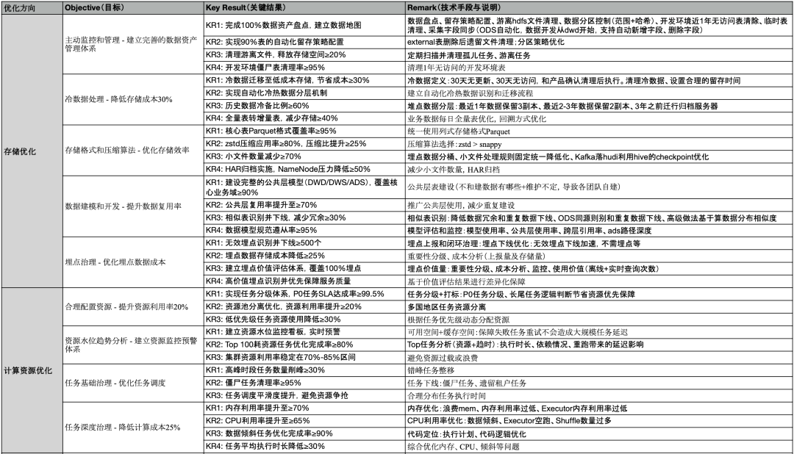
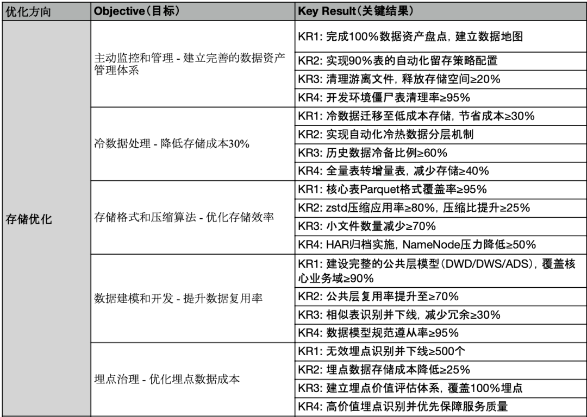
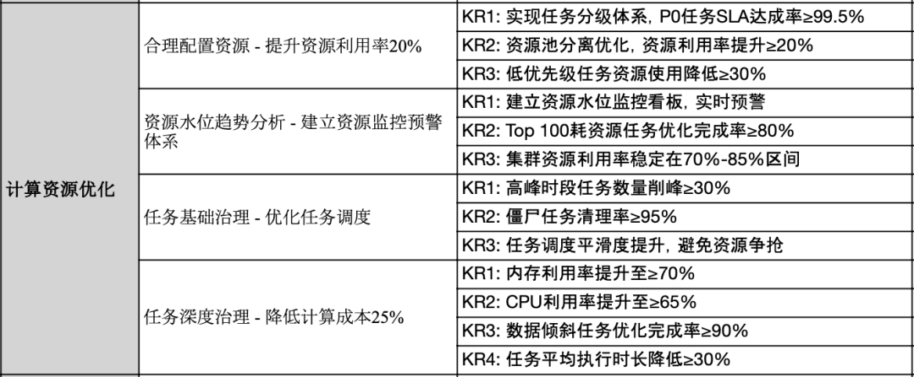
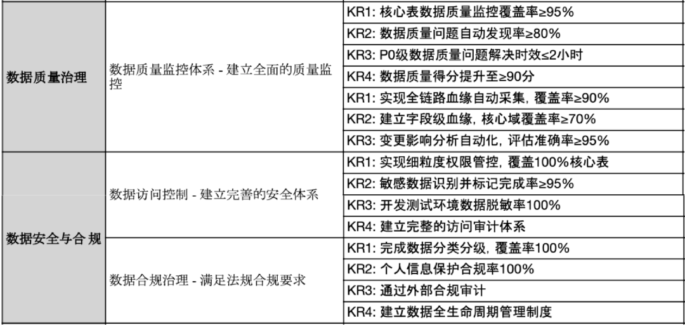
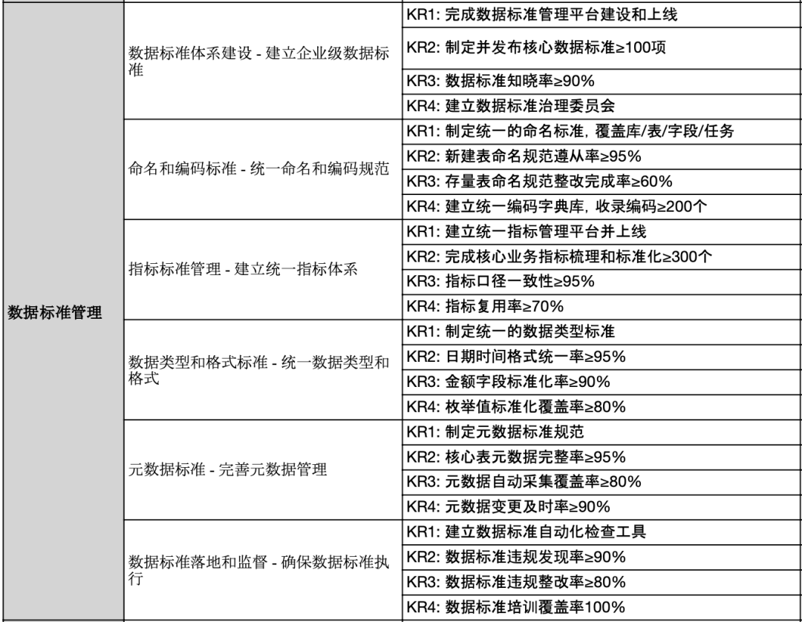
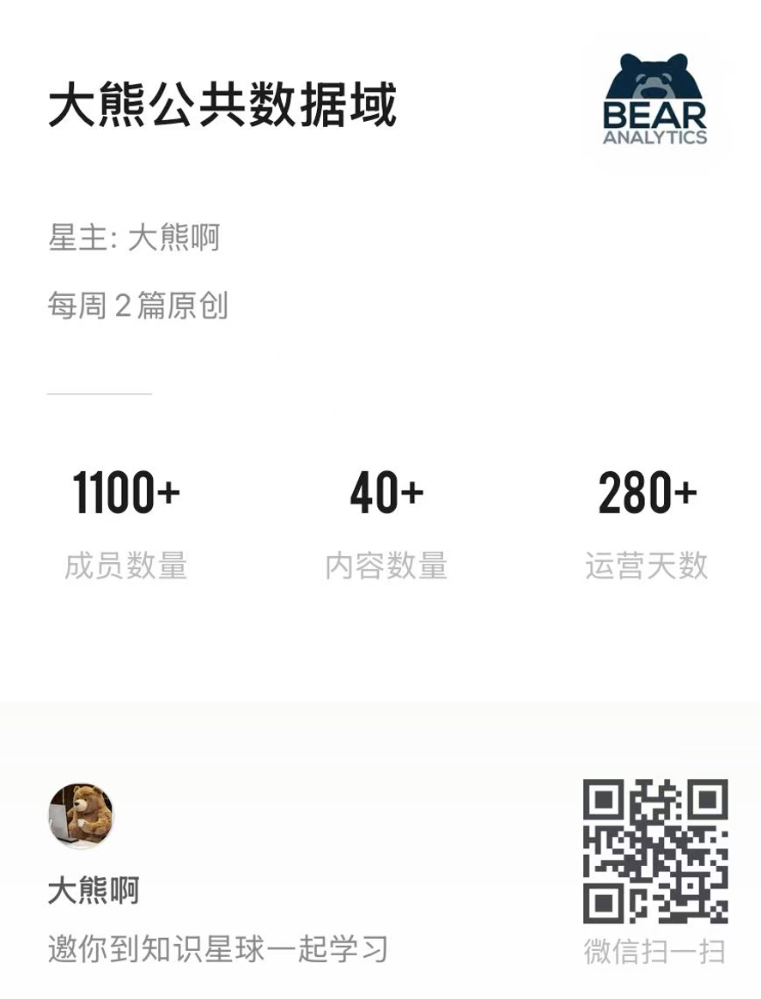

我是大熊！某大厂数据负责人

**拒绝AI无脑文**

**每周原创，主要分享大厂实战经验**

关注我，全是百度不到的数据经验

文末附《完整高清124条KR》

总结完这份OKR

第一反应不是“全”，而是“痛”

每个KR背后

都是无数次故障复盘后的思考

这份OKR不是给

从0到1搭建数仓的团队看的

那是草莽阶段，要的是快

毕竟我也对老板画过很多饼

说数据是石油

如果不治理，其实是废料

（回想起来自己都吐了）

之前群里大家都想听OKR

（没进的赶紧+V）

那熊大就聊了OKR背后的推演逻辑

以及我在不同阶段对“治理”的取舍

  

1、存算治理

这通常是数据治理的第一枪

为什么？

因为降本最显性，老板最听得懂

但很多团队做降本

容易陷入“割韭菜”的误区：

今年下了一批废表，明年又长出来了

早些年我们靠人肉催业务下线表

效率极低

  

现在的核心认知是

数据的价值随时间呈指数级衰减

所以冷热分层与TTL的自动化治理

是必须的

这里的关键不是删，而是“转”

意味我们必须建立自动化的判定机制

（基于访问热度、血缘依赖）

将30天无访问的数据自动转入冷存

（比如阿里的OSS归档或AWS的Glacier）

  

更进一步的思考是

为什么会有这么多冷数据？

  * 是因为业务方不需要吗？

  * 是因为数据质量不好吗？

都不是

往往是因为开发人员习惯了“全量保留”

缺乏生命周期意识

所以，治理的尽头是“默认策略”

建表时必须指定TTL，否则不予审批

  

2、技术压榨

“Parquet覆盖率≥95%”

“ZSTD压缩等级提到10”

...

这其实都是在吃技术的红利

  

我当年的经验是：

从TextFile转ORC/Parquet

再把压缩算法从Snappy换成Zstd

在几乎不改动业务逻辑的情况下

存储能省下30%-40%

这是老板们最喜欢的“无痛降本”

但难点在于全链路的兼容性测试

特别是老旧的计算引擎是否支持新的压缩算法

  

3、资源的“错峰”与“分级”

数仓迟早都要面临的局面：

资源不够

我们不能为了满足凌晨6点的SLA

去无限扩容集群

真正的治理高手

是懂得“玩弄时间”的

  * 通过分析任务的SLA等级（P0/P1/P2）

  * 强行将非核心任务（比如周报、月报）

  * 挪出核心产出链路（0:00-6:00）

  

这需要底气

因为你得敢于拒绝业务方

“我的报表要早上8点看”

这种无理的需求

这是技术负责人的政治力体现

（敢于拍板并和业务方battle，还得赢）

  

4、质量与合规安全

如果说存算是为了省钱

那“数据质量治理”和“安全与合规”

就是为了保命

我看过太多团队

平时不做质量监控

一出事就是P0级事故

CEO看的数据不对

或者核心报表挂了

然后大家一起加班救火

不要让CEO是第一个发现数据问题的人

  

做大数据的核心认知：

故障是不可避免的

所以OKR我们要设的是提升MTTR

（平均修复时间）

定的是“解决时效”

而不是“无故障”

  

背了几次P0故障后，我的心得是：

数据准确性和及时性是无法同时达到

如果数据错了

是否敢于自动熔断下游任务？

很多团队不敢，怕影响产出

但我的原则是：

晚给数据，好过给错误的数据

错误的数据会误导决策

到时候的雪球会越滚越大

估计得滚蛋

  

至于个人信息保护合规

在GDPR和个保法出台后

这不再是可选项

这里的难点不在于技术上的加密或脱敏

而在于识别

你根本不知道业务方

在哪个JSON字段里塞了用户的手机号

所以，OKR里提到的“敏感数据识别”

必须依赖NLP和正则扫描等自动化手段

  

5、数据建模

公共层的复用率≥70%

烟囱式开发是数据团队的“老朋友”

业务A要个指标，开发一套

业务B要个类似的，又开发一套

最后结果是

口径打架，资源浪费

  

推行公共层（OneModel）极其痛苦

因为这反人性

开发人员想偷懒

不想去查现有模型

只想自己写SQL

这时候

治理就需要强制手段

比如在开发平台上

如果不引用公共层的表

代码评审不予通过

当然很多团队没有代码评审，没有收敛的人

那作为负责人，就应该挺身而出

先带头做，然后再过渡给骨干成员

  

6、数据标准

前面说到口径的问题

但口径的问题背后

是数据标准的问题。

同名不同义，同义不同名

是所有大厂的通病

比如“GMV”

  * 财务算的是到账

  * 运营算的是下单

  * 产品算的是支付

  

解决这个问题的不是技术，是组织

需要建立“指标委员会”

把各方大佬拉到一个屋子里吵架

吵清楚了，落到指标系统里

谁也不许改

  

7、数仓的价值

你们团队一年花几千万服务器费用，到底带来了什么价值？

怕不怕被老板这样问？

治理不仅仅是省钱

这是在倒逼业务思考

我在推行“账单分摊”时

把每一张表、每一个计算任务的钱

算到具体的业务团队头上

当业务M总看到

看一张报表一个月要分摊5万块钱成本

而这张报表带来的业务增量几乎为零时

他们自己就会来找我下线任务

  

用经济手段治理技术问题

治理是反人性的，但必须做

如果我们能把这份OKR里的60%做到位

这个数据团队在行业里绝对是一流的

因为

技术好做，人心（规范、意识、文化）难测

而治理，就是在治理人心

  

8、来来的OKR  

报表会消亡

或者退化为事后的“复盘报告”

复盘的是过去，交付的是为什么

未来的数据团队

交付的不是报表和数据产品

而是数据决策建议和数据洞察

  

现在的模式是：

数据团队交付Dashboard -> 业务看图表 -> 业务大脑分析 -> 业务做决策

这个链路太长

且极度依赖人的水平

  

我上一篇文章已经说了

[Meta收购Manus：数据不再是给人看](https://mp.weixin.qq.com/s?__biz=MzIyNzc2OTQ5NQ==&mid=2247487454&idx=1&sn=f6434a25facc682a350bb74552679f53&scene=21#wechat_redirect)

而是把数据喂给Agent

以后数据团队要构建的不是BI系统

而是自动化决策引擎

比如：

数仓开发了一个数据决策建议

显示A商品库存周转慢，滞销了

算法根据库存水位、竞对价格、历史弹性

直接计算出“建议降价5%”

并自动推送到ERP系统等待确认

甚至自动执行

这是配合运营来做的影子决策

未来的运营操盘手也必须是Agent

真正的业务洞见在数据处理的瞬间

就已经被自动决策了

  

在生成式AI满天飞的时代

内容生产变得极其廉价

但“真实”变得极其昂贵

  

熊大也做不到公众号日更

尤其是原创要写出深度和认知

这是需要投入大量的精力

辛苦给个“一键三连”🌸🌸🌸

  

当业务人员用自然语言问AI：

“上个月毛利为什么跌了？” 

AI可能会一本正经地胡说八道

数据团队就是最后的兜底

AI基于的是可能性

而数据团队基于的是确定性

  

负责人要尽快把那些“搬砖”的活儿

（建表、写ETL、做报表）

通过治理实现高度自动化

把团队的精力从机械劳动腾出来

去思考、去设计、去升维

带团队走出“低水平勤奋”的泥塘

  

这才是大数据负责人真正的核心OKR

  

  
【OKR高清源文件】已独家上传知识星球内部规划参考，没有套路，纯大厂原创干货“限时免费”下载圈子不大，抬头不见低头见  
加个好友，以备不时之需  

有话直说，有干货直接给

  

**  
**

**END  
**