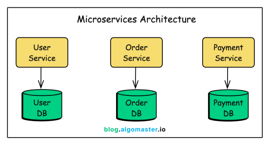
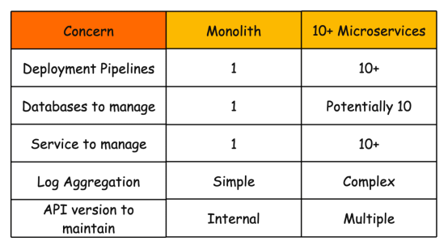
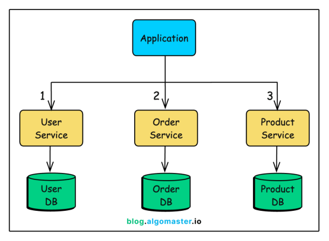
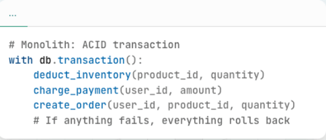
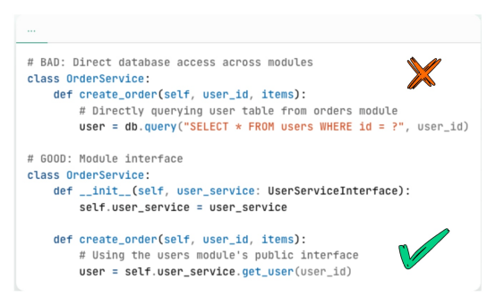
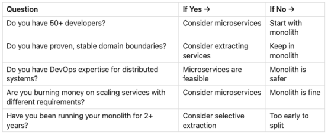

# 学了Netflix的微服务架构，整个团队差点被优化……

> 原文链接：[学了Netflix的微服务架构，整个团队差点被优化……](https://mp.weixin.qq.com/s/UyLhgCQUKN3jdcXV2p0OIg?clicktime=1770218044&enterid=1770218044&scene=90&subscene=236)


你正在启动一个新项目，并且已经了解Netflix 、亚马逊和Uber如何使用微服务来处理数百万个请求。


你想从一开始就构建一个可扩展的系统。


因此，你开始设计系统，为用户、订单、支付、通知和库存分别构建独立的服务。每个服务都有自己的数据库、部署流程和监控机制。


六个月后，你拥有15项服务，一个由3名开发人员组成的团队，但你80%的时间都花在调试分布式系统问题上，而非功能开发。


这就是微服务陷阱，而且它比你想象得更容易让团队掉进去。


本文将解释：


为何微服务对新项目而言诱人但又充满风险


无人提及的隐性成本


微服务真正发挥作用的时机


“单体优先”方法及其有效性


为什么微服务在系统设计面试中很重要


**一、微服务热潮**


微服务不仅听起来极具吸引力，在系统设计面试中也往往能成为加分项，给面试官留下深刻印象。


能够独立开发、部署和扩展的小型独立服务的想法，听起来就像是工程领域的理想境界。




当你阅读有关微服务的资料时，你会了解到：


独立部署：部署一项服务而不影响其他服务；


技术灵活性：针对每项服务使用最合适的语言或者框架；


团队自主性：小型团队对其服务拥有端到端的所有权；


可扩展性：仅扩展需要扩展的服务；


故障隔离：一项服务故障不会导致系统崩溃。


这些好处确实存在，但也伴随着陷阱。


这些优势只有在流量和团队都达到一定规模时才能显现。


对于初创公司或小型团队而言，微服务不仅无法提供这些好处，反而会适得其反。


让我来解释一下原因。


**二、微服务的隐性成本**


**1、分布式系统复杂性**


当你把应用程序拆分成多个服务时，就创建了一个分布式系统，而分布式系统很难构建。


原本在单一环境中不存在的问题，如今变成了你的日常挑战：


网络故障：服务A无法连接到服务B，现在该怎么办？


延迟：原本只需几微秒的函数调用，现在变成了需要几毫秒的网络调用。


数据一致性：如何维护多个数据库中的数据一致性？


调试噩梦：一个请求可能涉及10个服务。


祝你好运，希望你能追踪到这个错误。


在单体架构中，调用函数要么保证成功，要么保证抛出异常。


在微服务架构中，服务调用可以：


成功；


失败并出现错误；


超时（但它真的成功了吗？）；


成功但返回的数据已过时；


重试成功，但导致重复操作。


每种情况都需要不同的处理方法，而这样的处理要覆盖到系统内的**每一次服务间调用。**


那调试方面呢？


在单体架构中，你会得到堆栈跟踪信息。


在微服务架构中，单个用户请求可能会调用10个不同的服务。当出现问题时，需要追踪所有服务的日志，关联时间戳，并找出导致故障的服务。


但分布式复杂性仅仅只是开始，你究竟该如何管理所有这些服务呢？


**2、运营费用**


单体架构意味着只需部署、监控和维护一个系统。


有了微服务，一切都成倍增长：




你还需要一些单体架构不需要的额外基础设施：


服务发现：服务之间如何相互发现？


API网关：外部客户端如何访问你的服务？


分布式追踪：如何跨服务进行调试？


断路器：如何处理级联故障？


消息队列：服务如何进行异步通信？


这些因素都会增加复杂性、成本和潜在的故障点。一个小团队在基础设施管理上耗费的时间往往比在功能开发上更多。


说到性能成本，我们来看看应用程序的速度会发生什么变化。


**3、网络现在是你的瓶颈**


在单体架构中，数据访问速度很快(约1微秒)。对象要么存储在内存中，要么只需一次数据库调用即可访问。


在微服务中，曾经的方法调用现在变成了：


```
1. Serialize request to JSON &nbsp; &nbsp; &nbsp; &nbsp; &nbsp; ~0.5ms
```


这种开销会迅速累积，原本只需要5次内部方法调用的单体应用页面，现在可能需要5次网络调用，每次调用都会增加10-50毫秒的延迟。


**4、数据管理变成一场噩梦**


微服务的优势之一是每个服务都拥有独立的数据，但同时带来严峻的挑战。


1）连接问题


在单体架构中，你可以轻松地通过单个SQL查询将用户、订单和产品关联起来：


```
SELECT&nbsp;u.name, o.total, p.title
```


在微服务架构中，相同的数据存储在不同的数据库中：




要获取用户、订单和产品信息，你需要：


致电用户服务


致电订单服务


致电产品服务部


在应用程序代码中合并数据


2）交易问题


在单体架构中，可以将多个操作封装在一个数据库事务中：




在微服务架构中，每个服务都有独立的数据库，事务无法跨多个服务运行。因此，需要采用分布式事务或Saga模式，但这两种模式都很复杂且容易出错。


**5、测试难度呈指数级增长**


测试单体应用很简单：启动应用程序，运行测试。


微服务测试需要多个环节：


服务之间的合同测试；


启动多个服务的集成测试；


对整个系统进行端到端测试；


利用混沌工程验证容错性。


你的 CI/CD 流水线会变成一个复杂的编排流程，需要按正确的顺序构建、部署和测试多个服务，对共享API的任何更改都需要更新和测试所有依赖服务。


**6、你还不了解你的领域**


这或许是最重要的一点。


在启动新项目时，你可能对你的领域并不完全了解。


需求会发生变化，你会发现那些原本以为相互独立的问题，实际上存在紧密的内在关联。


在单体架构中，重构主要指代代码包间的迁移。而在微服务架构中，重构是指重新设计API、迁移数据以及协调跨团队的部署。


马丁·福勒称之为“单体优先”方法：


“几乎所有成功的微服务案例都是从过于庞大的单体应用开始，然后被拆分的。”

——马丁·福勒


项目初期采用微服务，意味着你要在尚未明确服务边界的前提下强行划分，而错误的边界划分会带来极其高昂的修复成本。


那么，微服务究竟在什么情况下才真正有意义呢？


**三、微服务何时真正适用**


微服务本身并无不妥，它是针对大多数项目所缺乏的特定问题而提出的解决方案。


考虑采用微服务时，你需要有：


**1、多个需要独立运作的团队**


如果你有50多个开发人员，且在单体架构中频繁产生协作冲突时，微服务可以有效保障团队自主权。


经验法则：要让微服务在组织架构中合理运作，每个服务至少需要一个团队（5-8 名开发人员）。


**2、不同的扩展需求**


```
Traffic&nbsp;Distribution:
```


如果90%的流量流向搜索服务，而用户服务只占10% ，并且需要支付更高的费用才能将所有内容扩展时，采用微服务架构或许能成为解决方案。


但请扪心自问：你的公司真的存在这个问题吗？还是说一个优化过的单体架构就能解决所有问题？


**3、清晰、稳定的领域边界**


如果你的单体架构已经运行多年，并且清楚地了解系统中哪些部分是独立的，很少同时发生变化，便可放心地进行服务拆分。


**4、基础设施和专业技术**


微服务正常运行需要成熟的基础设施：


成熟的 CI/CD 管道


容器编排（Kubernetes 或类似平台）


服务网格或 API 网关


分布式追踪和日志记录


多个部门的轮值待命


如果缺乏这些条件，你会把更多时间耗费在基础设施建设上，而非功能开发。


**四、单体优先方法**


以下是推荐的做法：


**1、从结构良好的整体式系统开始**


构建单体架构，但要确保内部结构合理。采用清晰的模块边界，分离关注点，并在组件之间编写简洁的接口。


```
my-app/
```


这有时被称为“模块化单体”。


**2、明确内部界限**


即使在单体架构中，模块之间也应该通过明确定义的接口进行通信。不要让订单模块直接访问用户数据库表，而应该让它调用用户模块的公共接口。




这样既能简化当前的开发过程，又能方便以后的拆分工作。


**3、当痛苦真正来临时，拆分服务**


只有当遇到微服务能够解决的实际痛点时，再考虑拆分服务：


“我们无法部署，因为另一个团队正在使用相同的代码库。”


“我们需要将这个组件的规模扩大100倍，但其他组件不需要这样做。”


“这个组件需要不同的技术栈”


“由于代码库非常庞大，部署需要2个小时。”


当提取数据时，你已经明确领域，边界已经确定，并且有实际的需求作为指引。


**五、真实案例**


一些最成功的科技公司最初都是从单体架构起家的：


**亚马逊**


亚马逊在转型为服务型企业之前，多年来一直采用单体架构。他们并非一开始就使用微服务，而是在单体架构无法进一步扩展且组织瓶颈日益凸显时才逐步演进。


**Shopify**


Shopify以“模块化单体”架构而闻名。即使规模庞大，他们也选择优化单体架构，而不是将其拆分为微服务。他们的单体架构处理着数十亿美元的交易。


**Etsy**


Etsy坚持使用单体架构，并投资开发工具以优化性能，而不是拆分成微服务。在竞争对手苦苦挣扎于微服务复杂性时，Etsy 已经实现了盈利并取得成功。


**六、决策框架**


使用以下框架来确定你的架构：




如果你对以上大多数问题的回答是“否”，那么几乎可以确定单体架构是正确的选择。


**七、等等：系统设计面试呢？**


事情到这里就变得复杂起来了。


我前面所说的这些都是适用于实际的架构决策，但系统设计面试则另当别论。


面试时，你应该谈谈微服务，原因如下：


**面试考察的是知识，而不仅仅是判断力**


面试官希望你掌握分布式系统的概念，即使你不会立即用到它们。


他们正在评估：


你能否将一个系统分解成逻辑组件？


你了解服务边界和API吗？


你能谈谈不同方法之间的优缺点吗？


你知道如何扩展单个组件吗？


**制胜面试策略**


最优秀的候选人会展现出进化论思维，具体思路如下：


1）明确起点


“对于早期产品，我会从模块化单体架构入手。这样开发、部署和调试都更简单。”


2）展示缩放后的架构


“随着系统用户增长到数百万，我们将根据扩展需求和团队结构提取服务。”


3）明确讨论权衡取舍


“拆分成微服务会增加网络延迟和运维复杂性，但可以实现独立的扩展和部署。”


这种方法既体现了实践判断力（从简单入手），又体现了技术深度（懂得如何扩展）。


**八、结语**


微服务听起来很有吸引力，这并非没有道理。它们在理论层面颇具研究价值，在架构图上呈现得清晰美观，同时也是一些优秀企业的主流选择。


但那些优秀的公司并非一开始就采用微服务架构，而是在多年的发展之后才逐渐转型的。


作为一名工程师，你的职责不是使用最花哨的架构，而是用最简单有效的方案解决问题。


对于大多数项目而言，这种解决方案是结构良好的单体架构。


开始时平淡无奇，需要的时候会变得精彩纷呈。


作者丨Ashish Pratap Singh &nbsp; &nbsp;编译丨dbaplus社群来源丨https://blog.algomaster.io/p/why-you-should-never-start-with-microservices?utm_source=profile&amp;utm_medium=reader2dbaplus社群欢迎广大技术人员投稿，投稿邮箱：editor@dbaplus.cn


