# 实现GPU大幅降本！顺丰科技基于自研的算力资源管理与调度实践

> 原文链接：[实现GPU大幅降本！顺丰科技基于自研的算力资源管理与调度实践](https://mp.weixin.qq.com/s?__biz=MzkzMjYzNjkzNw==&mid=2247634464&idx=1&sn=76edbd50ff2bb5660711db5e4b67c42c&chksm=c30ca5edefbeb4b8237b6bcf07d29686682c5e1c22be832f1e0fe3957af563c94ffc4d0ea5c2&mpshare=1&scene=1&srcid=0210dByYb2sQQhNgqqqENi2o&sharer_shareinfo=f118a5447f473c1c5a24693f5dd8cb0c&sharer_shareinfo_first=f118a5447f473c1c5a24693f5dd8cb0c#rd)

******本文根据江山山老师在〖deeplus直播：顺丰科技如何实现GPU大幅降本〗线上分享演讲内容整理而成。******（文末有回放的方式，不要错过）****

**江山山**

顺丰科技

AI技术平台后端开发工程师

负责AI平台的后端开发工作，核心聚焦于PaaS层的构建与优化。日常工作围绕GPU资源管理、模型广场功能开发及云原生技术落地展开，深度运用K8s实现容器编排与集群管理，确保平台在多云环境下的稳定运行与高效扩展。

**目录**

一、传统GPU使用方式与局限性

二、EffectiveGPU功能与切分/超分介绍

三、EffectiveGPU结合Volcano实现调度精准掌控

四、EffectiveGPU实现降本案例

**一、传统GPU使用方式与局限性**

**1、传统方式使用GPU介绍**

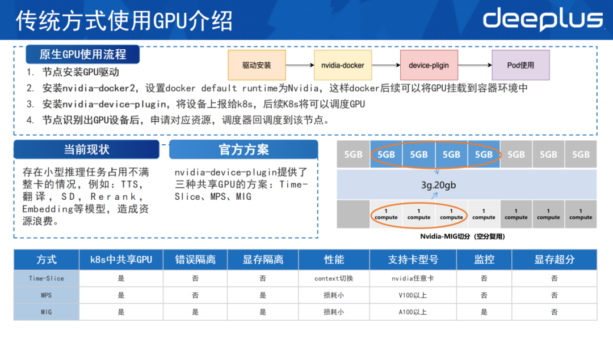

使用原生GPU时，第一步需要在节点上安装GPU驱动。第二步安装nvidia-docker2，设置docker default runtime为nvidia。如此一来，docker后续可以将GPU挂载到容器环境中。第三步安装nvidia-device-plugin，它的作用是将设备上报给K8s集群，后续K8s则可以调度该节点的GPU。第四步，等节点识别出GPU设备后，若pod有申请GPU的资源，调度器便往这个节点上去调度pod，kubelet则会为其分配GPU的设备。

顺丰科技的内部存在着大量的小型的推理任务，占不满一整张卡。比如说有一些TTS、翻译、SD、Rerank、Embedding等模型，这种不能占满卡的情况容易造成GPU资源的浪费。

官方提供了三种共享GPU的方案，分别是Time-Slice、MPS和MIG。这里简单介绍MIG方案，即Ampere架构以后的GPU，会原生地将算力切分成7个单元，将显存切分成8个单元，随后通过算力单元和显存单元做组合的方式，把整个GPU切分成多个小GPU，单独在pod中使用。

通过对比，这三种方式都有缺陷。Time-Slice和MPS没有办法做到错误隔离，并且对监控的支持不是很好。MIG虽支持错误隔离和监控，但它只适配于A100以上的GPU，即对Ampere架构以后的GPU才会生效。对于一些低端卡，比如V100或者t4则用不了该方式，并且Time-Slice、MPS和MIG三者均做不了显存超分。

**2、原生GPU使用的方式局限**

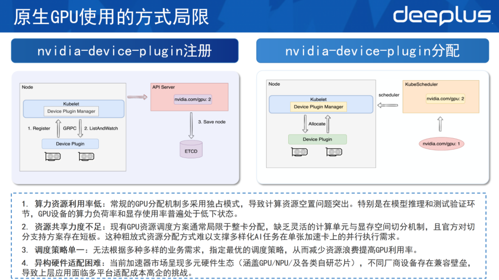

原生GPU使用方式十分局限，这需要先了解官方的device-plugin是如何工作的，并将其分为注册和分配两个部分。

在注册过程中，device-plugin部署好之后会向kubelet的device plugin manager注册自己的资源。注册完成会建立一个GRPC连接，GRPC连接通过List And Watch的机制不断监控这个节点的设备，一旦设备故障或者失效，则可通过List And Watch及时上报给kubelet，把该设备从可以调度的列表里面移除掉。完成注册过程之后，通过API Server把节点的设备数量存储到ETCD里面，使整个集群清楚该节点里面GPU设备的数量。

在分配的过程中，对于资源请求来说，K8s只能做到整数级别，无法申请0.5个GPU。例如申请一个GPU，其申请请求和pod的创建请求会发送到Kube Schedule，Kube Schedule在集群中寻找节点和空闲的资源，随后把pod给调度到节点上，调度之后kubelet的device plugin manager会通过Allocate的方法，把设备分配给pod并拉起。

根据这两个过程，可以总结原生GPU的局限性如下。

1）该独占式的分配方式会导致资源的闲置。特别在一些小模型推理以及测试的验证环节时， 通常GPU的算力负荷和显存都处于普遍偏低的状态，设备利用率不高。

2）原生GPU的共享力度不足。因为GPU的分配常常是局限于整卡分配，没有办法做到灵活的显存单元和计算单元的切分，并且官方支持的方案也存在短板，难以支撑顺丰内部多平台的AI任务的需求。

3）调度策略的单一。官方并没有提供多种多样的调度策略，这可能会造成资源的浪费，或者资源碎片问题，这需要通过调度的方式来解决。

4）异构硬件适配困难。当前不仅有GPU，还有国产卡NPU之类的异构硬件，需对这些异构硬件进行管理，解决不同设备的壁垒。

**3、EffectiveGPU VS 原生GPU**

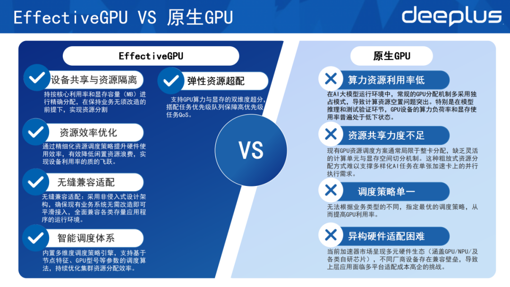

基于以上问题，团队决定自研顺丰内部的GPU切分方案，因此开发出EGPU。以上是EGPU跟原生GPU的对比，EGPU主要解决以下问题。

1）支持设备的共享和资源的隔离：可按核心的利用率以及显存的容量做资源的精准分配。在保证业务无需修改的前提下，实现资源的切分。

2）资源效率的优化：可通过各种调度策略来提升硬件的使用率，有效降低闲置资源浪费。

3）无缝兼容的适配：因为采用非嵌入式的架构，可保证部署的业务，无需进行改造便可直接使用EGPU。

4）智能调度体系的建设：基于EGPU实现多种的调度策略，制作自己的调度器进行资源的优化。

5）资源的弹性超配：EGPU支持GPU的算力和显存的双维度的超分，并且可搭配任务的优先级队列来保障高优先级的QoS。

**二、EffectiveGPU功能与切分/超分介绍**

**1、EffectiveGPU功能介绍**

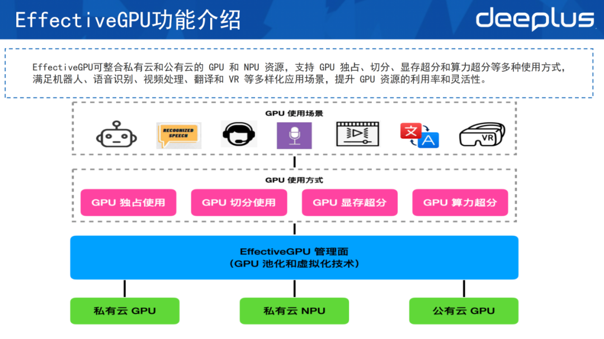

这是一个简单的EGPU架构，EGPU可以管理私有云和公有云的GPU 和NPU。它的使用方式有很多，可用GPU独占、GPU切分以及显存超分和算力超分等方式支持上层的应用，满足机器人、语音识别、视频、翻译以及AI模型等应用场景。

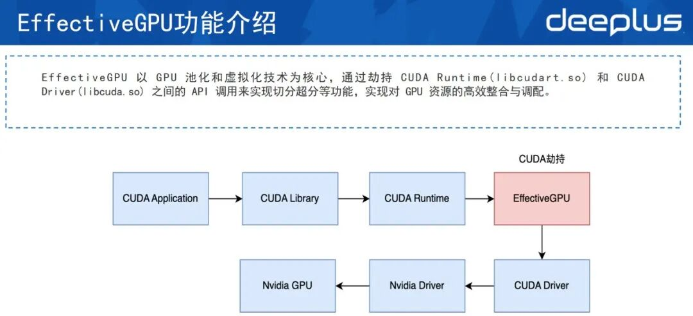

市场上有较多池化的技术，例如修改驱动。EGPU使用的方式是CUDA劫持，这也是当前最适合顺丰的方案，其对于业务的侵占是最小的。这种方式主要是在CUDR Runtime和CUDA Driver的中间层劫持了一下CUDA，从而实现GPU的切分、超分等功能。

**2、EffectiveGPU组件**

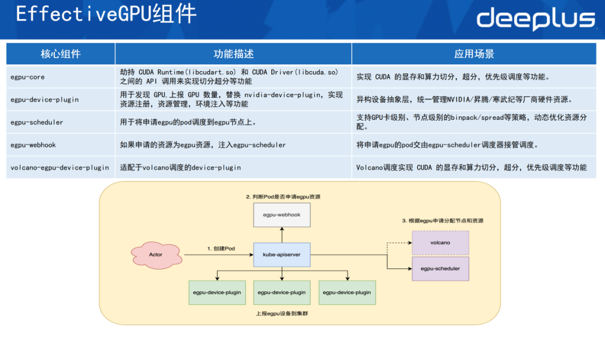

EGPU有5个核心组件。

1）egpu-core：其主要作用是劫持Runtime层跟Driver层之间的API来实现切分超分，有优先级调度的功能。

2）egpu-device-plugin：用于发现GPU的设备，上报GPU数量，可以替换掉原生的device-plugin，主要作用是实现资源注册、资源管理以及环境注入等功能。

3）egpu的调度器：自研的调度器，主要作用是将egpu的pod调度到egpu节点上，根据一些调度的策略，例如支持GPU卡级别的binpack/spread，或是节点级别的binpack/spread来实现资源的优化分配。

4）egpu-webhook：主要作用是当pod申请egpu资源时，webhook识别到申请的适宜资源，便会主动给po注入 egpu的调度器，让egpu的调度器接管pod，从而调度多种多样的功能。

5）volcano-egpu-device-plugin：适配于volcano调度的device-plugin，其功能是把显存的切分超分和优先级的功能在volcano上实现一遍。

以下是这些组件的大致运行流程。

首先egpu-device-plugin会将这些设备通过apiserver上报到集群表，上报每一个节点上有哪些设备的内容。当用户去创建一个pod的时候，webhook会判断报道它申请的是不是 EGPU资源，如果申请的是 EGPU资源，它就会给 pod设置调度器，最终这个pod会由volcano或 EGPU的调度器调度到指定的节点上。

**3、Effective GPU使用**

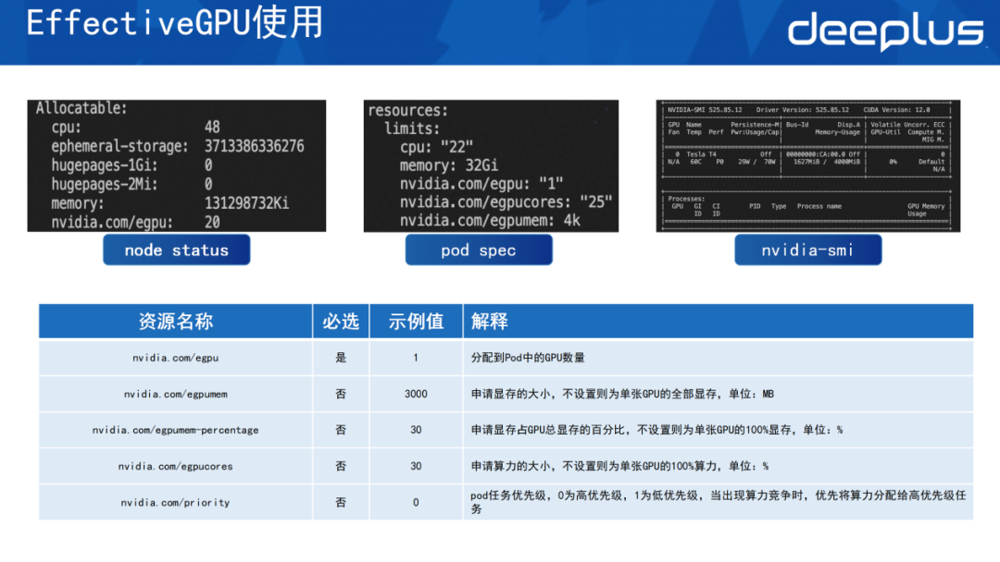

部署好EGPU之后，在node status里可看到上报的EGPU的设备信息，随后在pod里可用该方式。例如申请多少个EGPU，设置每一个EGPU卡的算力以及显存是多少。显存这里设置的是4k，即4000兆的显存。在容器中可看到它实际申请的是4k，显示是4000兆的信息。

这里资源可分为以下几种。一是申请EGPU的数量，二是EGPU的显存，即申请到每一张卡EGPU的显存的大小，单位是MB。三是支持按百分比去申请EGPU的显存。假设是一张32g的卡，若申请50%的显存，它便分配16g；假设是一个40g的卡，申请30%，实际上挂载到容器中的线程就是12g。四是EGPU的算力，这里申请30%的算力。最后一个是优先级，EGPU支持高优先级和低优先级的配置。如果高优先级任务和低优先级的任务同时部署到同一张卡上，高优先级任务会抢占低优先级任务的时间片，而此时低优先级任务会因为拿不到GPU算力被hang住。

**4、Effective GPU算力与优先级**

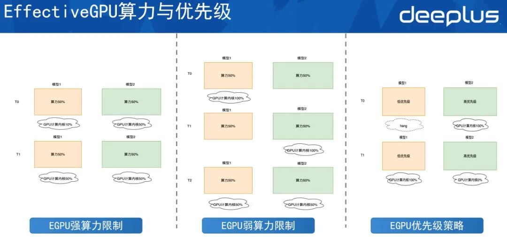

算力分为两种限制。

第一种是强算力限制。以图中为例，在t0时刻模型一仅用了10%的算力，模型二用50%的算力。虽然该GPU卡还空闲40%的算力，但由于是强算力限制，两个模型都不可以突破该算力的限制，最多都只能用到50%。

第二种是弱算力限制。弱算力限制是指让 GPU算力内核的最大化利用。虽然模型一和模型二都设置为50%的算力，但在t0时刻，模型二并没有去使用算力，此时模型一可以用到整张卡，即100%。同样，当模型一空闲时，模型二也可以用满算力，但如果它们同时调用算力，每个模型都只能用到50%。

而在EGPU的优先级策略中，模型一是一个低优先级的任务，模型二是一个高优先级的任务。因此当模型二有请求时，它会抢占掉模型一的算力，此时模型二用满整个GPU的算力，模型一分不到算力的时间片会被hang住。当模型二的高优先级任务执行完之后，不再占用计算内核，此时低优先级任务便可拿到计算内核开始执行，这就是算力的优先级。

**5、Effective GPU切分和调度**

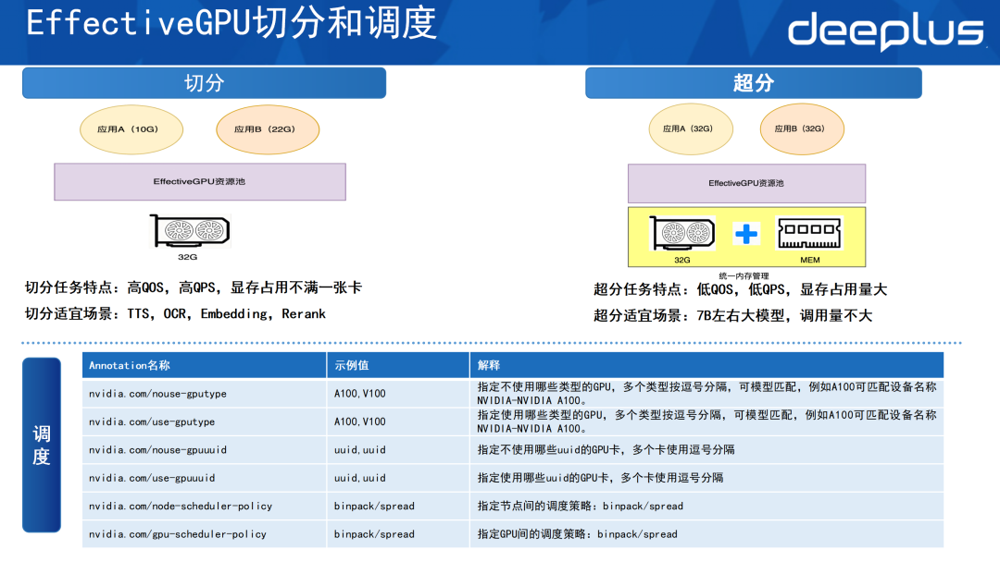

在切分和调度方面，EGPU支持按GPU显存的方式切分。如图所示，应用A和应用B都用不满整张卡，应用A申请了10g的显存，应用B申请了22g的显存。此时通过调度的方式将两者部署到同一张卡上共享，这样便做到资源的高效利用。因为原本部署它们可能需要两张卡，现在用一张卡便解决，大大提升了利用率。

切分的特点是适配高QOS、高QPS以及显存占不满一整张卡的情况，场景适合于TTS，OCR，Embedding模型和Rerank模型。

在超分的任务场景时，需先做统一内存管理，将GPU的显存和内存统一，方便数据在显存和内存之间做交换。假设上层有两个模型，二者都需要32g的显存，此时便可以超分的方式将应用A和应用B都部署到同一张GPU卡上，随后通过显存和内存的置换让这两个服务都跑起来。

超分比较适宜低QOS、低QPS，但是显存占用量比较大的场景。顺丰内部会用这种方式部署一些7B左右的大模型，它的调用量和并发量可能并不高。

在调度层面，EGPU支持设置使用或者不使用哪些型号的GPU、哪一个指定的GPU的uid，并支持节点级别的调度策略binpack和spread。如果是binpack级别，会优先往一个节点上去调。如果是spread，则会评估每个节点，每个节点均适量调度。

同时EGPU也支持GPU级别的binpack和spread的调度：GPU 的binpack会优先将单卡资源用满，spread则会均匀利用节点上的每一张GPU卡。

**三、EffectiveGPU结合Volcano实现调度精准掌控**

**1、Volcano调度中使用EffectiveG PU**

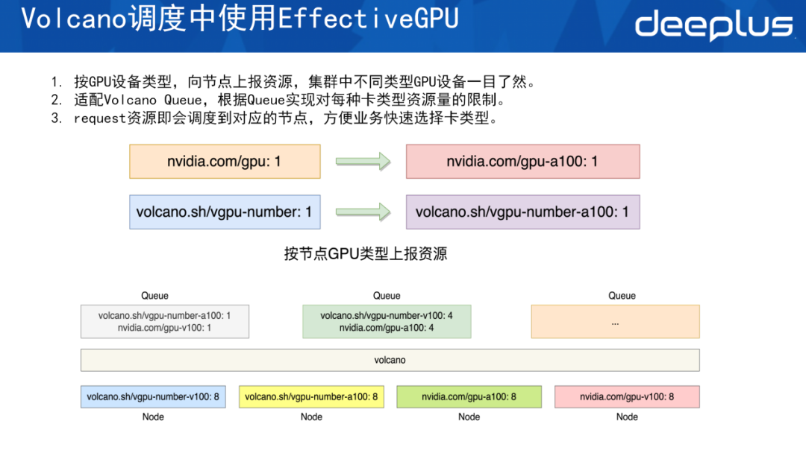

在Volcano调度中使用EGPU的方面，顺丰做了改造，把所有的GPU设备的上报都以原生的方式加上设备的型号，这样便可通过其注册的资源快速知道这个节点的GPU属于哪种类型。同时复用vgpu-number标准，在volcano上注册GPU具体的型号，这样便可通过资源名称知道这个节点里面使用的是哪一种GPU型号，知道这个节点是用原生的GPU卡亦或者是用虚拟化之后的EGPU卡。

这种方式同样适配 Volcano Queue。AI平台属于租户型平台，需借助 Queue的方式限制每个租户的资源使用量。基于设备类型进行区分后，能够清晰地为租户分配对应设备，确保每个租户对设备的使用严格控制在预设的范围内。

在调度层面也有好处。以往使用这种方式，假设一个集群里面有多种GPU类型（t4、v100、a100、h20、l20等），每次做调度时需先申请资源，并通过亲和性或者节点的选择来让指定的调度到希望部署的卡上面。现在，例如部署千问235B并希望其调度到H20时，因上报了这种资源，因此在申请request资源时决定了它的资源会调度到哪个节点上，这样可以清晰地看到调度的动向。

**2、Effective GPU监控**

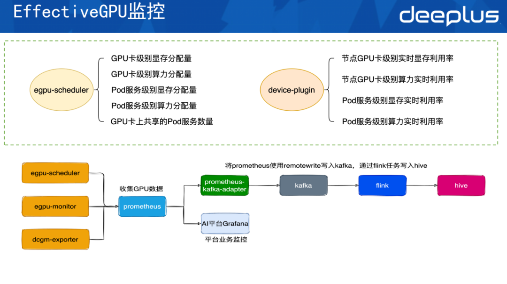

EGPU的监控分为两个层级。

第一个层级是EGPU的调度器。调度器主要是负责暴露GPU卡级别的显存的分配量，即这个节点的第一张卡，其分配出去多少显存和算力，以及空闲多少显存和算力可分配。它还会暴露pod分配多少显存和算力，也能看到GPU卡上有哪些服务共享并使用GPU。

第二个层级是device-plugin。其主要是暴露实时利用率，即这个节点的GPU卡上用了多少实时的显存和算力，这两个指标跟官方的dcgm-exporter一致。该层级还可暴露 Pod服务级别的显存与算力实时利用率，清晰呈现为 Pod 分配的显存和算力配额，以及实际的资源消耗情况。

数据收集的架构如下，把EGPU暴露的信息以及原生dcgm-exporter暴露的metrics同时收集到平台的prometheus里。

prometheus中的数据会有两个出口。第一个出口是它会通过AI平台的grafana暴露出平台的业务监控，用户可以在AI平台的界面上看到每一个部署的服务实际上用了多少显存和算力。第二个是数据流向出口。依托Prometheus的remote write功能，将数据写入 prometheus-kafka-adapter，再通过adapter写到Kafka。后续由Flink任务把Kafka中的数据写入顺丰内部大数据平台，即最终记录到Hive中。

收集到Hive之后，根据Hive的数据做报表，并对每个服务做算力和显存的监控。通过这些数据了解每一张GPU卡是否有资源的闲置。如果有，便使用运营手段调整 GPU，将其空闲的算力释放出来给其它业务使用。

**四、Effective GPU实现降本案例**

最后解析采用EGPU实现降本的三个具体案例。

**案例一：使用训推一体式降本**

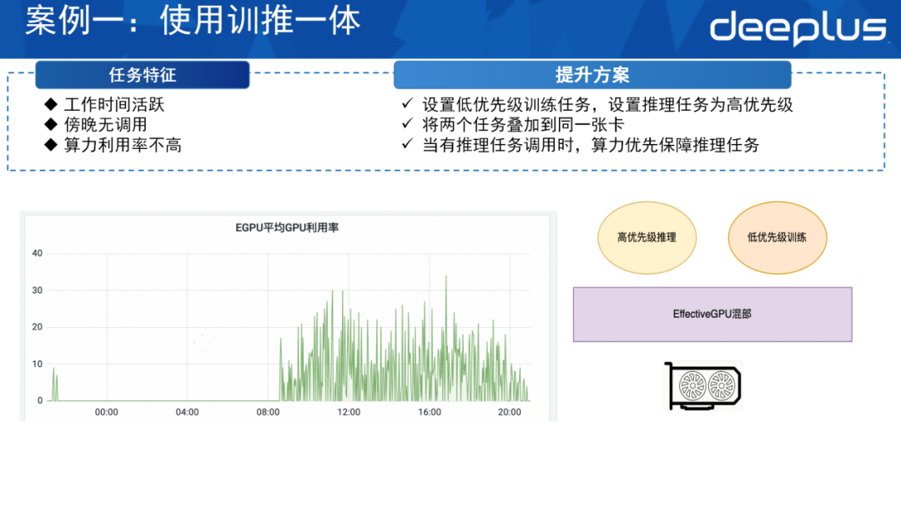

该任务的特点是其在白天活跃，晚上没有调动，算力一直空闲，且在白天利用率也不高。如此一来，可利用这部分空闲算力，用EGPU的方式提高它的利用率。

首先在卡上给它部署一个低优先级的训练任务，随后把推理任务设置成高优先级。通过混部的方式，把这两个任务同时部署到同一张卡上。在白天，如果有部分算力的请求，推理任务会抢占训练任务的时间片，此时便会优先保证推理任务的执行。当推理任务没有调用时，或者在晚间比较空闲时，低优先级的训练任务会使用这部分算力去做业务的训练，这便是训推一体。

**案例二：使用切分实现降本**

如图，该任务的调用量和利用率并不高。其显存配额虽达40g，但实际利用率低，存在大量闲置算力资源。因此可通过监控手段，从Hive中找出类似任务，采用切分方式：根据hive中的数据，确定任务的最大显存使用量，将剩下闲置的算力分配给其他服务使用，从而减少算力和显存资源的浪费。

**案例三：使用超分实现降本**

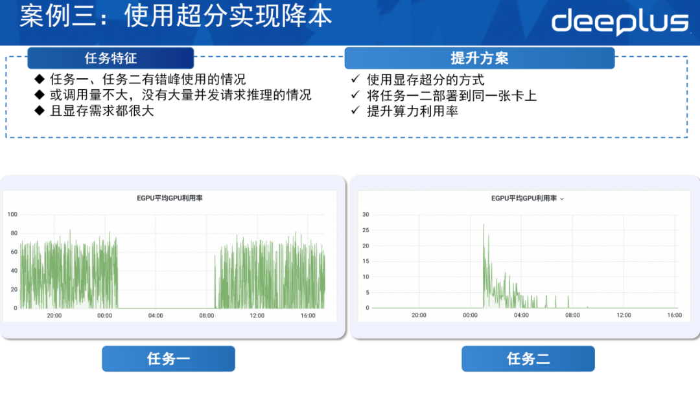

图中的任务一仅在白天活跃，而任务二仅在晚上活跃，所以二者存在错峰使用情况。该情况适合采用显存超分的方式，将它们同时部署到同一张卡上。

由于这两个任务之间有很长时间的错峰，即当任务一去使用显存和算力时，任务二可能闲置，其数据可能会被交换到内存上。在晚间，任务二处于活跃状态，任务一不频繁使用，此时便将任务一的数据从显存中置换到内存，保证任务二的执行。

诚然，这里的例子稍显极端，并不是所有任务都如同这两个任务严格按照白天和晚上的方式错峰调用，也有一些任务调用不频繁的时候存在错峰情况。对于峰值时段互不重叠的任务，可通过显存超分技术部署至同一张GPU卡。该方式既能保障业务平稳运行，又可有效节省GPU卡，甚至能实现整卡资源的节约，且对任务执行无太大影响。

**Q&amp;A**

Q1：EGPU支持GPU算力与显存的双维度超分，这个技术具体如何实现？

A1：算力以时间片方式调度，因此算力超分仅为Quota层面的超分，主要是CPU分配量的管控。超分的主要能力体现在显存超分，其依托GPU内存统一管理机制，打通内存与显存的数据通路，通过置换的方式实现。

Q2：EGPU与Volcano的结合在实际应用中带来哪些具体的优势和改进？

A2：AI平台实际上是一个租户类型的系统，对Volcano Queue的依赖挺高，因此便基于Volcano Queue针对自身场景设计了这种方案。

若要改进，会将这个资源按节点的GPU类型做上报，它的优势主要是在调度的层面，一是Volcano Queue对于资源的限制，二是在选择资源层面。选择在request上进行资源调度时，一定会分配对应的GPU。例如 request 配置为 A100，调度器将直接分配 A100 节点，无需额外配置节点选择策略进行GPU节点管控。

Q3：EffectiveGPU的超分技术会不会对模型的精度或者性能产生影响？

A3：自测结果显示，该技术对模型精度无影响；但在性能层面，因该技术通过内存的方式置换，内存速度肯定是慢于显存的。如果两个模型都被大量调用，比如两个服务通过超分的方式部署到一张卡上，二者部署的都是一个大模型，或者用4个log部署一个大模型，大模型每时每刻都被超量调用，这种情况下肯定是会有影响的。若两类任务实现错峰调用（如前一秒为 A 任务调用，后一秒为 B任务调用），这种情况对性能的影响是很小的。

目前，该超分技术已在生产环境中落地并支撑多类业务，实际应用中也常面临调用量较低但必须部署在平台的场景。对于存在微量调用且无法下线的业务场景，该技术具备显著的适配优势。

Q4：EGPU如何解决异构硬件适配问题，解决方案的稳定性与性能如何？

A4：对于每一种资源来说，其实会有一些不同的device-plugin，我们是通过不同device-plugin的适配做到的。

Q5：会频繁调度资源导致性能问题吗?

A5：首先，Volcano本身是一个很强大的调度器，如果是自己EGPU的调度，实际上调度器内部也是一个kube-scheduler。因为kube-scheduler内部会有一个插件的机制，在插件的机制里实现对EGPU的调度。所以可以将它理解为还是一个kube-scheduler，只是在kube-scheduler里面加了调度EGPU的逻辑。

Q6：当训练和推理任务对GPU资源需求存在冲突时，EGPU如何保证这两个任务顺利进行？

A6：我们会通过优先级的方式，如果需要把训练任务和推理任务部署到一起，推理任务是优先级较高的，训练任务是较低的。

因为推理任务比较讲究实时，而训练任务其实挂在那里即可。设置推理任务到高优先级之后，EGPU会优先去把算力的时间片分配给推理的任务。此时如果是算力的任务，它拿到的时间片，需要用到的那部分数据也会从内存里面加载到显存里面，这样可保证推理任务的优先。

当推理任务不再使用GPU资源，训练任务将获得GPU算力时间片。此时系统会根据算力需求，将对应数据置换至显存，以此保障高、低优先级任务的调度。

dbaplus社群欢迎广大技术人员投稿，投稿邮箱：editor@dbaplus.cn

**↓↓ 点击****阅读原文****获取本期直播回放**

