# 小小光模块，竟然是暴利产品！

> 原文链接：[小小光模块，竟然是暴利产品！](https://mp.weixin.qq.com/s?__biz=MzI3MzAzNDAyMQ==&mid=2657892001&idx=1&sn=04056c51f3fee13195f7a78608c66175&chksm=f114ad19e19e3e2b82b0d0ff0790f96c083c08c166ea065f215e11b7214af3455b7c4fc7183a&mpshare=1&scene=1&srcid=02106yTHE872Q7bWLGG7f0dV&sharer_shareinfo=d3894ead9801b14e6813c21d5155969e&sharer_shareinfo_first=d3894ead9801b14e6813c21d5155969e#rd)

你没想到吧，在网络产品中看起来最不起眼的光模块，竟然是暴利产品！

很多时候，买一台交换机的钱，还不如配套的光模块多。所以，今天我就给大家掰扯一下大厂网络中最不起眼、却又不可忽视的部分：连接器（Connector）。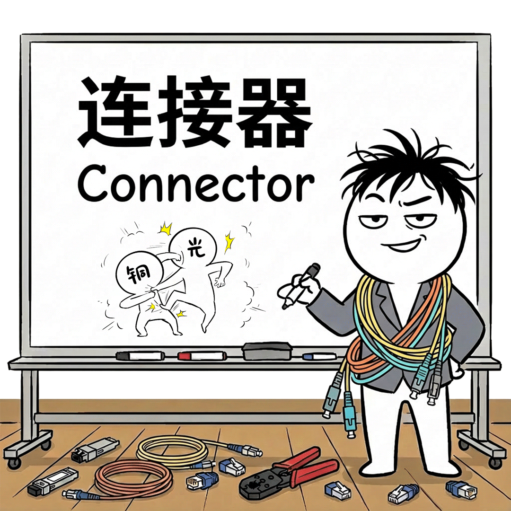虽然这个类别叫光模块更通俗，但目前还是光铜互搏的时代，铜缆尤其DAC仍有一席之地，大厂里面也是同一伙人在主理，所以我们还是统称为连接器吧。连接器的基础知识

我po一张表吧，大家先了解下，在大厂不同距离和场景下，什么样的介质和连接器更适用。

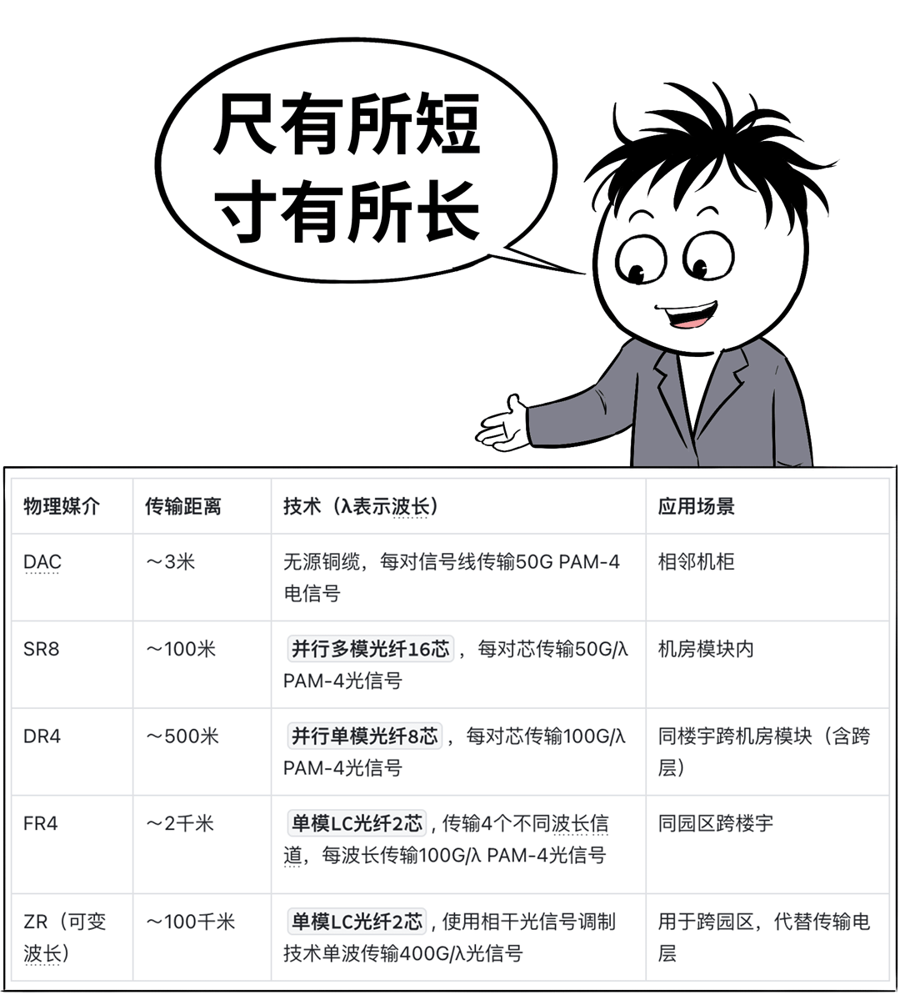

结合上面的表，我们拿个具体的模块型号「400G QSFP-DD DR4」，来详细拆解含义↓400G是模块速率表示模块可以提供的通信速率是400Gbps，这是目前大厂网络比较典型的速率。QSFP-DD是模块物理规格SFP是这个规格系列的起点，字面翻译是小型可热抽插光电接口模块（Small&nbsp;Form-factor&nbsp;Pluggable），SFP是外部电信号侧“1收1发”的非并行模块。Q表示Quad，即4，是对SFP的电信号的数量描述，表示是4个SFP并行的模块，表示4收4发，类似还有DSFP表示2收2发，OSFP表示8收8发。DD，是对QSFP的修订，DD表示Double Density，即8收8发，修订的意思是不改变外型上的宽度和高度，并兼容QSFP模块。类似的还有OSFP-XD，老外规范命名上略显随性。DR4是模块的光侧属性DR表示传输距离和光纤类型，即500m、单模；SR和VR表示100m、50m多模；FR表示2KM单模，专业人士可以通过这些参数快速分辨出使用的激光器类型、制造工艺、成本范围。4表示4×光通道并行，所以就很容易理解SR2、SR4、SR8、FR4的含义。还有一种变形如800G OSFP 2×DR4，表示光模块上有2组DR4插槽，和DR8的1组插槽是不一样的。也就是说这个800G更多是变成2个400G在用（不直接做成2个400G接口可能是一种宣传上的算计）。还有一种更科学的表示方式400G QSFP-DD56 DR4、400G QSFP112 DR4，这里的56和112表示外部单路电信号速率：56是56Ghz PAM4调制格式可以妥妥提供50Gbps的速率，112是112G PAM4调制格式提供100Gbps的速率。结合QSFP-DD表示8路电信号，8×50Gbps=400Gbps；QSFP表示4路电信号，4×100Gbps=400Gbps。都是DR4说明光信号侧是同样的规格，这2个模块又都是400G，所这2个光模块是可以互联的。同样可以互联的还有400G QSFP112 SR8和400G QSFP-DD56 SR8，可以发现只要模块速率一致，光侧信号规格一致都可以互联。区别在于是电信号高的降级到光信号低的还是电信号低的升级到光信号高的。这个升降级的关键就是DSP的变速能力，所以DSP是可插拔模块中技术含量最高的器件。有个别DSP厂商会把TOSA和ROSA的一部分集成在一起，也有硅光会把TOSA、ROSA都做在一起的方案，但这只影响成本和利益的分配，并不影响光模块的功能。网卡侧模块有一些特例，例如CX6 100G QSFP网卡，可以工作在QSFP28的4收4发模式，也可以工作在QSFP56的2收2发模式（虽然是QSFP，但只用2路信号），因此可以大量看到网卡侧是100G QSFP56 SR2，交换机侧是100G DSFP56 SR2的情况。下图是比较常用的400G光模块：QSFP-DD的爆炸图，大家看看内部结构吧。

400G qsfp-dd光模块爆炸图光模块真正值钱的都在壳子里面，最常见的主要是3大件↓负责电信号整形的DSP（也有叫oDSP的，o表示optical）负责把DSP整形后的电信号转成光信号并向光纤精准发射的发光集成TOSA负责把光纤的光信号转成电信号并放大发给DSP的收光集成ROSA熟练掌握光模块的基础结构、光模块规格命名参数的含义是能在大厂做互联的基础门槛。

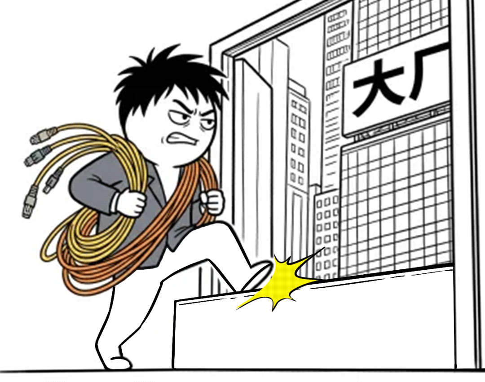

如今，电信号112G PAM4已经是成熟制程了（也是目前国产芯片的上限），先进的224G PAM4即将规模商用，NV也已经发在NVLink 6发布了448G。别看这个玩意很枯燥，但在数据通信和通信领域，这个速率是实力层面的至高皇冠。

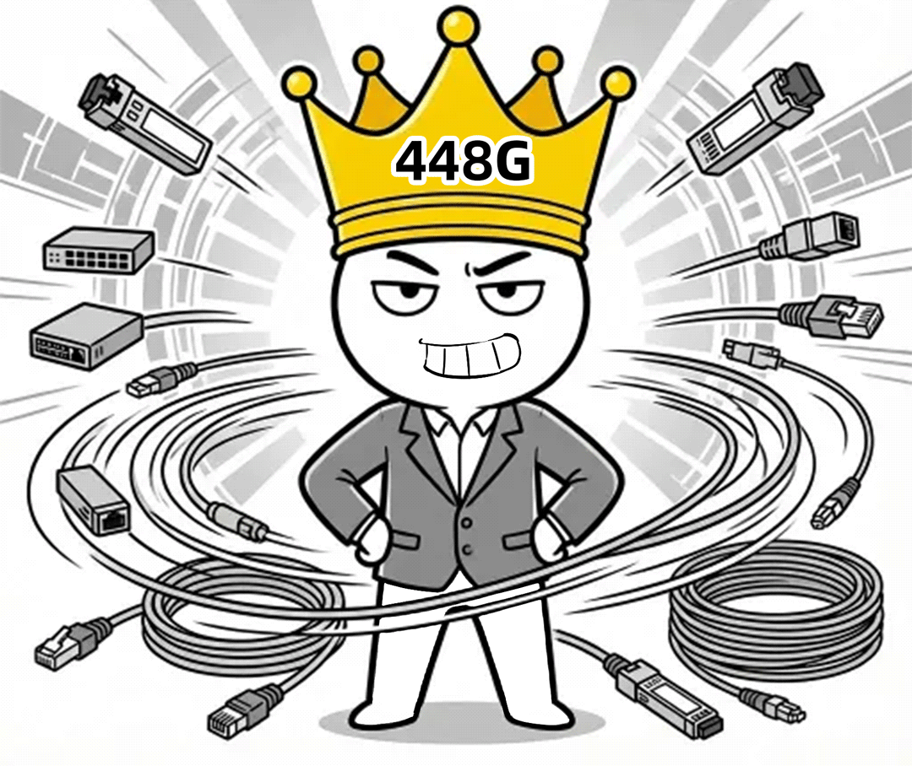

所以在技术领域，400G QSFP112模块和800G OSFP112模块完全没有高下之分。特别是“多此一举”的800G OSFP 2×DR4，只有集成生产成本的细微差异，这和热闹的资本市场嗨点并不匹配。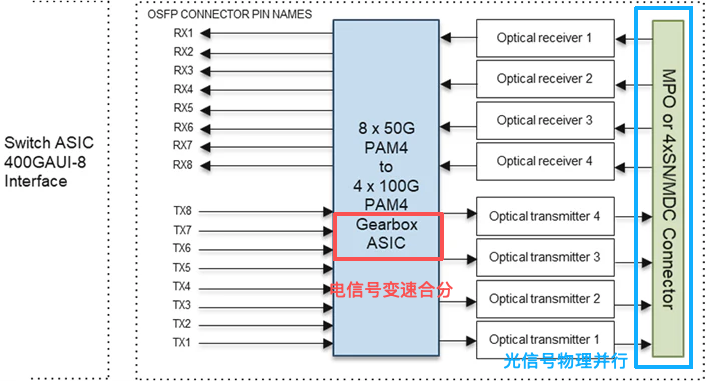图2 DR4在电信号进行合分，光信号直接采用物理并行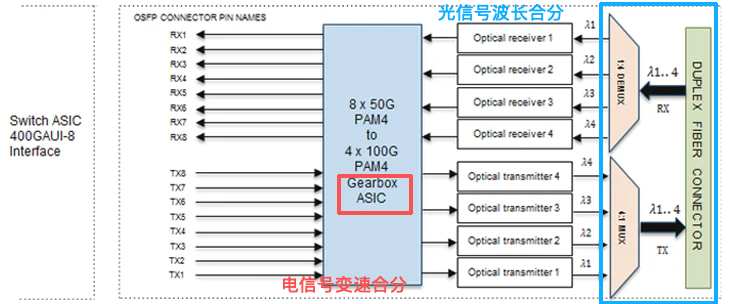图3 FR4在电信号和光信号上都有合分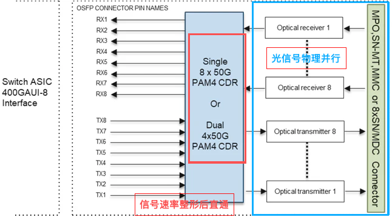图4 SR8在电信号和光信号上都不合分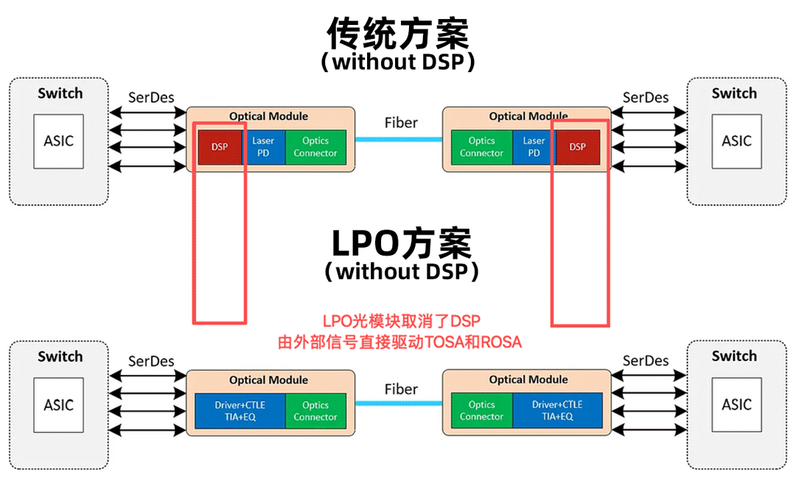图5 LPO光模块取消了DSP，由外部电信号直接对接TOSA和ROSA如图2和图3，DR4和FR4光模块上有电信号的gear box，是DSP的基本功能，可以把金手指上的8*50G信号变速转换成4*100G电信号，再驱动TOSA或者对接ROSA。如图2，DR4把变速后的4路100G通过TOSA变成4路物理的光信号并直接打进4芯，这就叫物理并行。反向的ROSA到DSP方向也是一样的，好处是可以把物理并行光纤进行拆分，可以把400G拆分成2×200G端口或者4×100G端口。如图3，FR4把4路100G通过TOSA变成4路不同波长的光信号，进行合波（光模块内部有很小的光器件进行合分波，因此FR4的封装成本要比DR4高）后打进1芯，就无法拆分端口，但纤芯数量小，可以节约长距离通信的纤芯租赁费用。如图4，SR8在电信号和光信号上都不做变速、合封装，因此可以不使用DSP，可以使用性价比更高的CDR，其独特的VSCEL激光器也在成本上更有优势，SR8由于是物理并行，所以也可以和DR4一样进行连接拆分（如图6）。如图5，LPO光模块则进一步简化，把成本占比显著的CDR和DSP都取消了（和无源铜缆DAC一样），由外部电信号直接驱动光收发模块。特点是光模块成本进一步降低，但缺点是要求外部电信号的完整度很高。当前交换机的PCB设计，并不一定可以保证所有端口在各种复杂工况下都可以做到较好的电信号完整度，所以并未能得到很好的普及。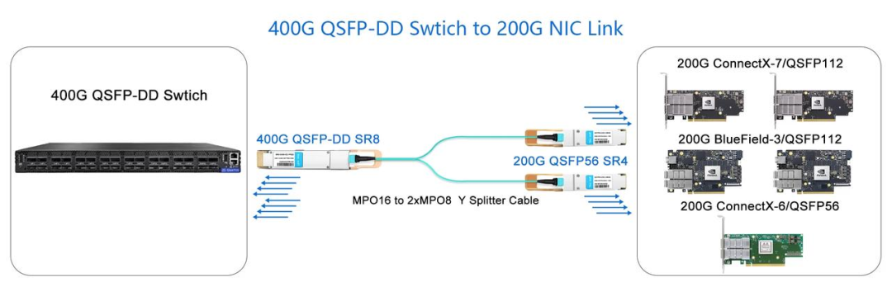图6 400G qsfp-dd使用并行光纤拆分成2 × 200G示意，DR4也是类似

硅光为什么会流行？

# 如今互联网大厂也好，数通大厂也好，都在推硅光，究竟是为啥？我还是直接上图吧↓

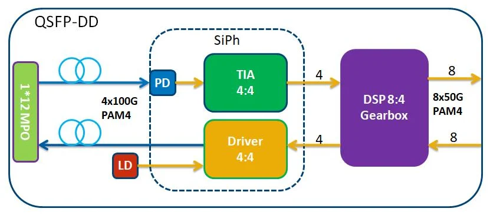图7 硅光代替了T/ROSA的PD、TIA、Driver等器件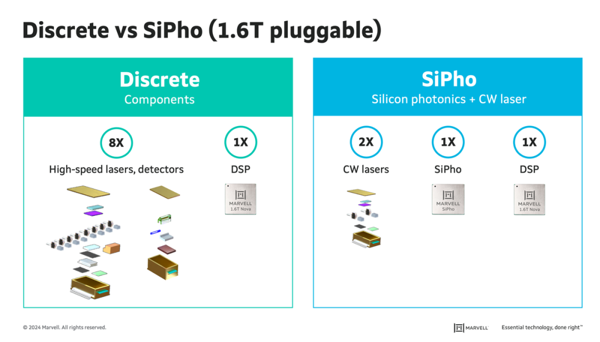图8 DSP大厂MARVELL的硅光相对分散器件优势介绍硅光Silicon Photonics简称SiPho或者SiPh，利用了硅的数字逻辑处理能力和光电效应，实现了电、光信号的翻译。可以把多个T/ROSA的分立器件合并成1个，这可以极大简化光模块生产环节的复杂操作，降低光模块生产过程中的封装成本：PD，Photonics Detector，收光方向的探测器，把光信号还原成电信号；TIA，跨阻放大器，把PD还原后的电信号进行放大，便于DSP进行处理；Driver，激光器驱动，把DSP发出的电信号进行放大，以驱动激光器产生对应的光信号硅光的优势是提升集成度、降低制造成本，只要是能降低成本的技术，大厂都是趋之若鹜的。既然谈到硅光，那就不能不讲CPO，毕竟大厂要求极致的功耗、密度。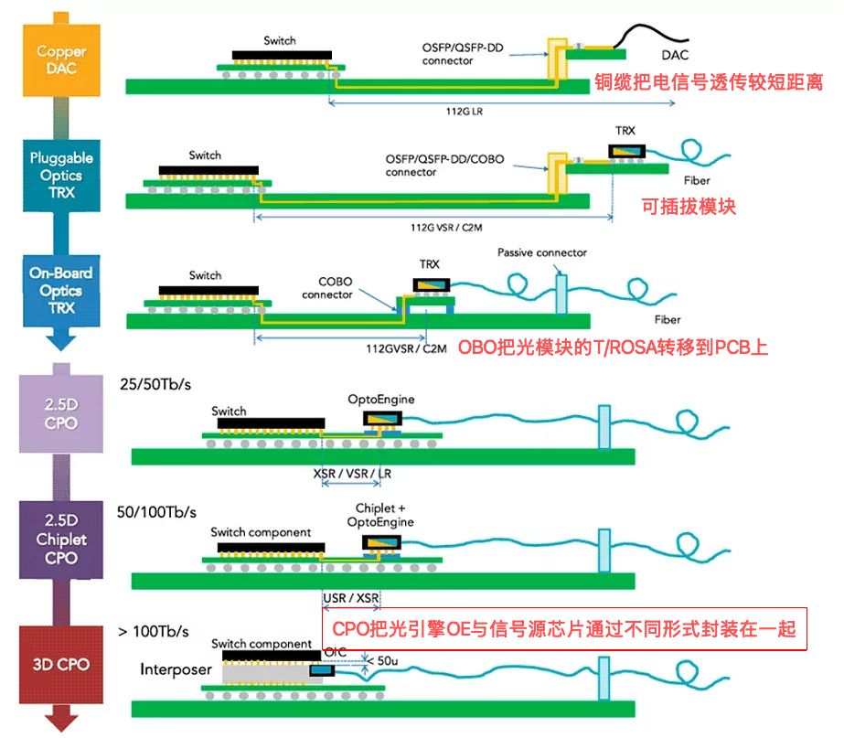图9 随着带宽需求上涨，光收发器件与信号源越来越近在LPO模块中了解到，LPO模块由于输入电信号完整性在实际应用中并不可靠。所以工程师们就会自然地想到，如果把电光TOSA、光电ROSA离信号源更近就可以解决电信号完整度的问题。而且越近的铜走线可以天然地支持更高速的信号，同时硅光的发展也可以把T/ROSA紧密地封装成1个硅器件，硅器件就天然地可以和同是硅芯片的逻辑处理信号源封装在一起。CPO（Co- Packaged Optics，即字面意思合封装光模块）就是这个理论的产物↓TOSA、ROSA合在一起，叫光引擎Optical Engine简称OE，负责电、光信号的翻译。OE通过不同的封装方式，可以和信号源有不同的距离，最佳方案就是3D CPO，目前成熟应用应该是2.5D CPO。OE主要实现信号调制，其光功率不足够传远，所以需要外置激光器提供高功率的光源。由于激光器故障率相对较高，所以这些激光器通常做成交换机面板可插拔的模块形式，1个激光器可以提供如16、32路光通道光源。OE把外置光源调制成光信号后通过光跳线接到交换机面板，交换机连接光纤的面板就像是配线架一样简陋。这种光跳线接驳的方式会带来额外的信号插损，对多模信号影响会比较明显，通常为了具备相对大范围的使用场景，会做成类似DR4单模物理并行的方式。需要注意的是，CPO也不是100%好，而是有适合使用的场景。所有端口都工作在DR模式且没有DSP的变速功能，如果需要不同距离灵活接入、前向后速率兼容的通用DCN场景就不那么普遍合适了（可能个别角色如模块核心合适）。幸好现在的Scale-Out网络就是这种纯粹的密集互联场景，所以我们可以看到老黄发布的Spectrum6交换芯片是CPO形态的，就是专打Scale-Out场景。话外音：好家伙，老黄连光模块的钱都不让别人赚了。

CPO的好处主要是性能方面的，成本优势是理论上和间接的，如CPO因电信号传输距离短可以降低整体功耗，同时规避了DSP的成本支出。之所以是理论上，原因是CPO和处理逻辑芯片耦合了，被厂商彻底绑定。大厂针对这种情况通常是再找一个能做交换芯片和CPO的大厂与之抗衡，只是换了个战场。

大厂连接器决策逻辑

基本原则：满足性能、功能的前提下，降低成本。## 1、端口类型

直接上结论：看看服务器主流网卡的接口的电信号规格是什么样，交换机就选什么样的。比如服务器是CX6网卡100G QSFP56，电信号是2路50G，那么交换机也选择2路50G的100G端。这样的好处是可以直接用DAC，同时可以避免端口拆分，因为拆分意味着交换机端口的爆炸半径至少是单端口的2倍甚至4倍，可靠性是网工的第一优先。为什么不要求光模块物理规格一样呢？因为交换机是以端口多为特点，需要考虑面板尺寸能不能放下这么多端口。所以CX6网卡是100G QSFP56 SR2，而交换机可以是100G DSFP56 SR2，DSFP尺寸紧凑，可以让1U高的交换机面板上布置48个100G端口。而且以中国庞大的光通信产业能力，100G QSFP-DSFP这种2端模块物理规格不一致的，不管是DAC还是SR2 AOC的生产都不在话下。到了CX7是主流了，CX7网卡是2×200G QSFP112 VR2或者单口400G QSFP112 VR4。那么接入交换机最好就是用400G QSFP112 VR4，既可以直连400G也可以拆分后支持200G。这里交换机为什么做200G端口的？原因是在112G时代的交换机芯片常见容量是51.2Tbps。51.2T可以做成128 × 400G QSFP112端口，4U高的交换机在布线、散热上都有比较成熟的方案。如果做成256个200G，需要做成6U甚至8U高，芯片到面板端口最长距离比4U会延长，电信号完整度会下降，不利于通信性能。这是可以解释国外品牌非常喜欢2U甚至1U高的盒子（2U高64×800G OSFP112、1U高32×1.6T OSFP-XD112）的原因交换芯片的MAC规格表示可以做出多少个L2端口，51.2T这一代，通常达不到256个，所以也无法工作在256×200G的形态，因此128×400G就是最合适的选择。## 2、可以接受的拆分场景

不建议拆分的原因是会扩大故障场景的爆炸半径，如果拆分后不会影响可靠性，反而可以提升可靠性呢，那绝对是可以的。比如HPN网络的多平面组网场景，不管是网卡还是交换机都会把800G拆成4×200G来使用。这种打散后的连接在任意端口故障时都只会损失对端的1/4性能。这样干可以有效地分散故障爆炸效应，如图13：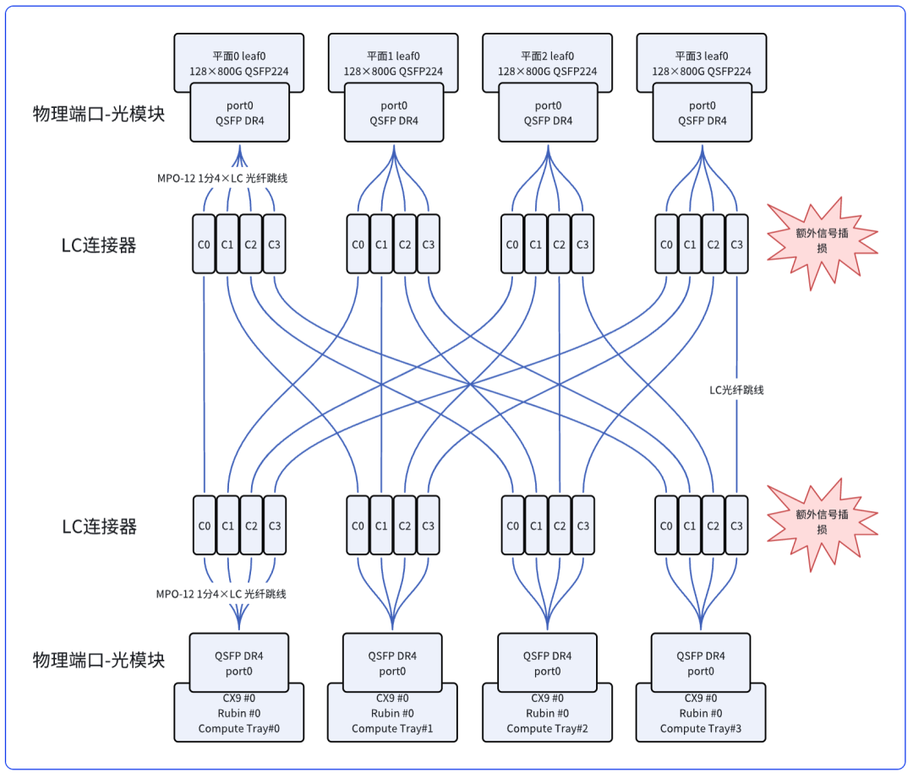图13 多平面组网的端口拆分及光纤连接这种原理图是好画的，但如果实际布线会是一场灾难。先拆分后组合的交叉布线逻辑会急剧增加施工复杂度并让工时大幅上升，为了简化布线复杂度，会使用光纤shuffle box代替现场拆分互联。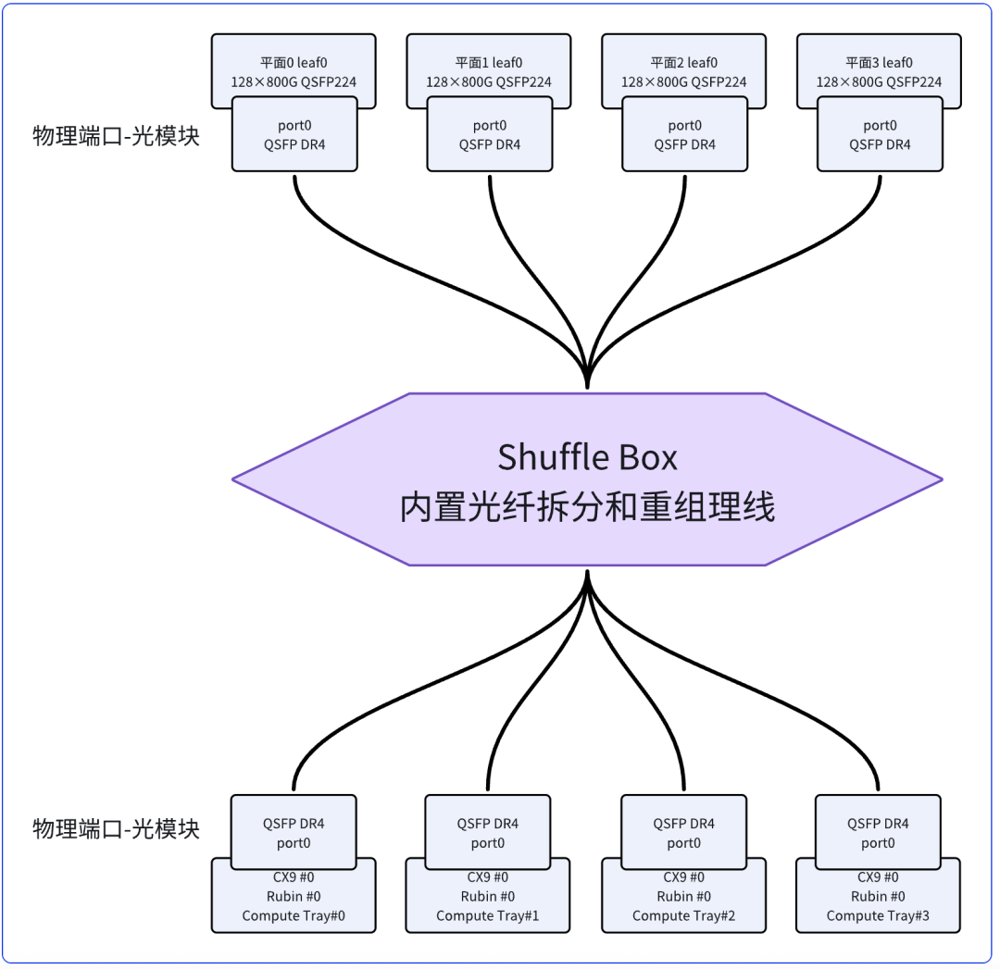图15 使用Shuffle Box简化布线连接这种mini的配线架简化布线，理论上可以减少信号插损，但缺点也是有的↓不同交换机到服务器走线距离不同，Shuffle Box使用的光纤长度需要规划，或者统一较长的长度并提供盘纤装置以调节长度。故障替换，需要把Shuffle Box打开，或者完整替换，替换的逻辑要比不拆分的方式更为复杂。根据原理，shuffle box就是光纤+理线逻辑，生产线上多一道理线工序，成本并不会增加很多，是一个非常靠谱的选择。3、光模块的软性规格前面讲的都是硬的部分，其实大厂对光模块最狠的要求还是软性规格，基本上网络设备的管理拉平：具备标准的I²C接口，便于交换机和服务器使用标准的方法读取光模块的EEPROM信息，交换机和服务器读取后以telemetry的方式吐到网管平台进行分析，产生告警、资产巡检、质量预测等等。支持通过I²C接口对光模块进行固件升级。光模块EEPROM不同的页面必须包含哪些信息，通常是CMIS标准：光模块的生产信息和资产信息；实时的状态如温度、电压、收发光功率、收发OSNR和ESNR、纠前和纠后BER（误码率）等。要求各个光模块厂商一致，便于标准化管理。在技术规格中，出厂的纠前BER也在Scale-Out组网中变得重要，纠前误码率越小，意味着光模块的容错空间越大。因为实际的机房环境并不是完全洁净的，布线过程中沾染细小的灰尘颗粒、光纤端面磨损等等现象是常见的。而Scale-Out网络但凡中断一下，都是影响昂贵的使用时间，这也是NV强烈推荐其原厂光模块的原因（据说，其原厂模块经过了BER筛选，哈哈哈，就是太贵）。

最后还是要说一句，光模块的暴利时代已经过去了，当下最好的理财产品其实是内存。

 关于作者
铁笼牛马，一个误入江湖20多年的老网工，在铁笼中享受着互联工业技术的变迁，为了让网工们也能获得这份“享受”，他决定写点什么。
可搜索微信号"_SerDes_"，添加好友进一步忆苦思甜。

