# 微信WFS传统TCP网络Fio跑满200Gb网卡实践

> 原文链接：[微信WFS传统TCP网络Fio跑满200Gb网卡实践](https://mp.weixin.qq.com/s?__biz=MjM5ODYwMjI2MA==&mid=2649800087&idx=1&sn=6a467f41f32841821dc3065cb08e27b5&chksm=bffec62877ff6267ce775487e04951f95e18ac75636c532ddc59a2577d93a3f2386b661feaec&mpshare=1&scene=1&srcid=0211EaRmBxv1ieRQK7Zwwv1j&sharer_shareinfo=7e7df4b55a992b5362761dff0f16fc30&sharer_shareinfo_first=7e7df4b55a992b5362761dff0f16fc30#rd)

作者：微信WFS团队

DeepSeek 在去年二月对外开源了 3FS，凭借基于 RDMA 的架构设计实现了极高吞吐，成为业界关注的标杆，网友纷纷复现其在 100Gb 网络下 Fio 跑满带宽的惊艳表现。微信 WFS 团队也在第一时间跟进学习，但受限于内部庞大存量集群环境不支持 RDMA 通信，我们转而聚焦在传统 TCP 网络下的吞吐优化，启动了 WFS Ultra 极限性能优化项目。最终，在同等 200Gb 网络环境中，实现 Fio 吞吐超越 RDMA 加持的 3FS。目前该优化已在内部跑了半年，本文将分享优化的关键思路。

### **性能数据**

Client : 1 台 T0-CM6AX Server : 6 台 T0-CM6AX (WFS，3FS同环境部署)

Fio 测试 WFS 可以轻松打满200G网卡带宽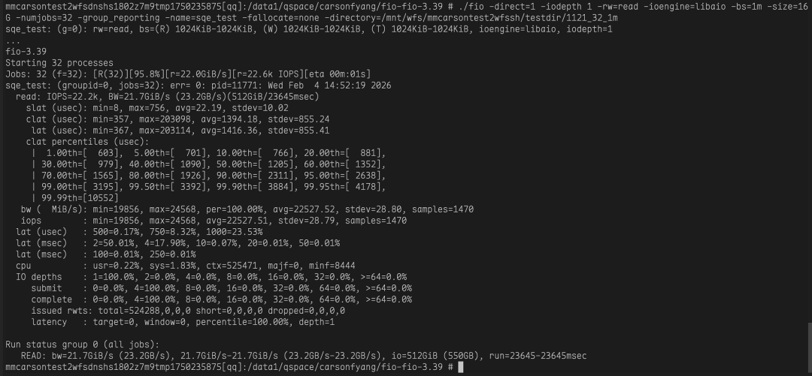

此外，针对 DirectIO 与 BufferIO 不同块大小的读吞吐测试中，WFS 经过本次优化后，对比 3FS 均展现出一定的性能优势。

目前公开资料看，WFS是业界首个能够在传统网络下，不依赖RDMA，Fio跑满200Gb网卡的DFS。#### **DirectIO性能对比**

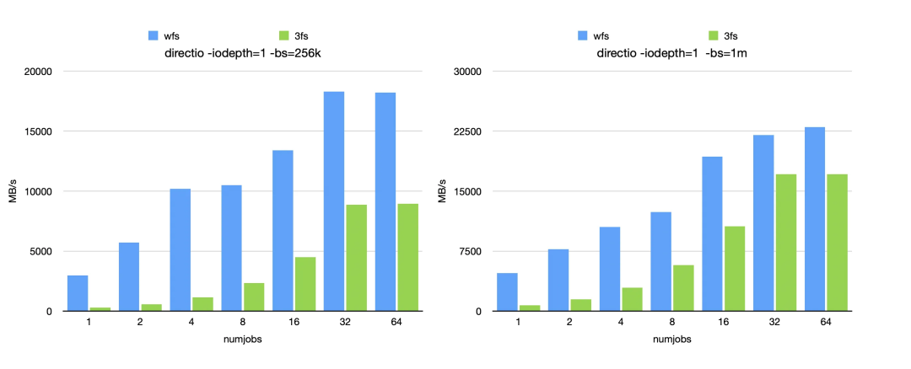#### **BufferIO性能对比**

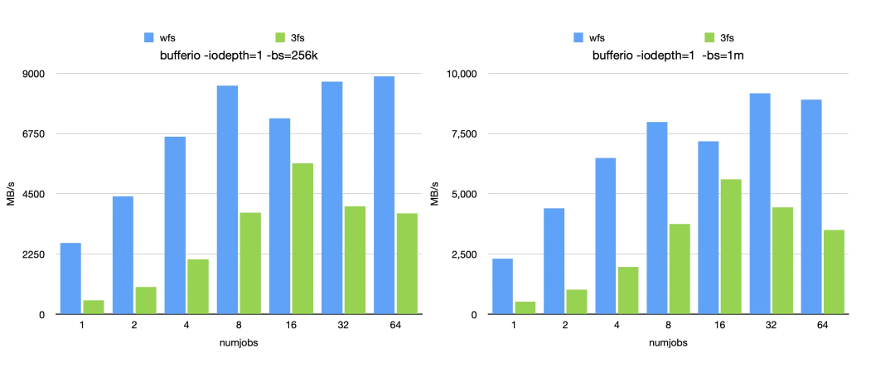### **关键优化点**

#### **Run-To-Completion线程模型**

在 Fuse 使用场景中，传统线程由 libfuse 创建，这类线程不具备 libco 协程环境，这就导致老版本 wfsfuse 采用的是同步等待线程模型。在该模型中，每个读请求会占用一个线程，线程需要同步等待 RPC 调用返回才能继续工作。想要提升性能，就只能开启大量线程，这会造成严重的资源浪费，同时还会带来高昂的线程切换开销。为了实现 Run-To-Completion 的高效线程模型，我们采取了以下两项核心优化。##### **深度定制的 ultra-core 异步网络组件**

首先我们将 libfuse 读接口改造成异步形式，完成非阻塞化改造。改造后，线程不会因为等待 RPC 响应而被阻塞，能够持续处理任务，大幅提升整体处理效率。通过重新设计 libfuse 的接口调用逻辑，引入ultra-core 异步回调机制，让读请求的发起与结果处理解耦。线程发起请求后无需等待，可以立即处理下一个任务，当请求结果返回时，再通过回调函数进行后续处理。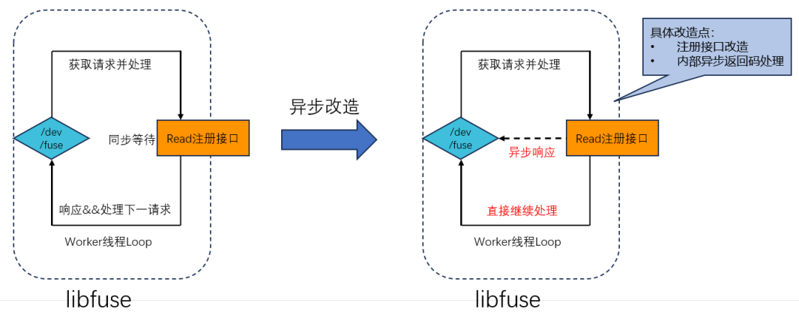##### **libfuse/ultra-core实施一致绑核策略**

ultra-core 异步网络组件与 libfuse 的线程逻辑深度整合，通过将线程绑定到特定的 CPU 核心，避免线程在多个 CPU 核心之间频繁切换。这一措施有效减少了 CPU Cache Miss 的概率，进一步提升了线程的执行效率，整体约等效于在一个线程内执行完整个流程。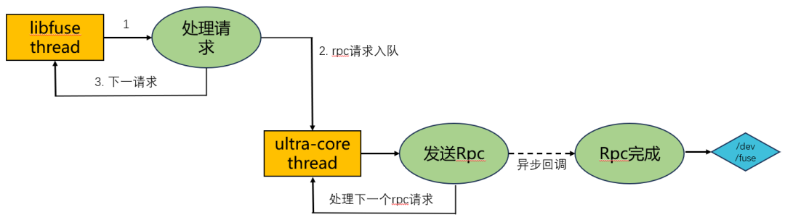#### **全链路零拷贝**

##### **读写可插拔架构**

Linux 系统提供了多种数据收发方式，不同方式在性能与适用场景上各有差异。为了快速验证各种方案的优化效果，我们设计并实现了ultra-core读写可插拔架构。该架构允许我们灵活替换不同的数据读写方案，通过对比测试，最终选定客户端采用 splice、服务端采用 sendfile 的组合方案作为读吞吐极限性能优化方案。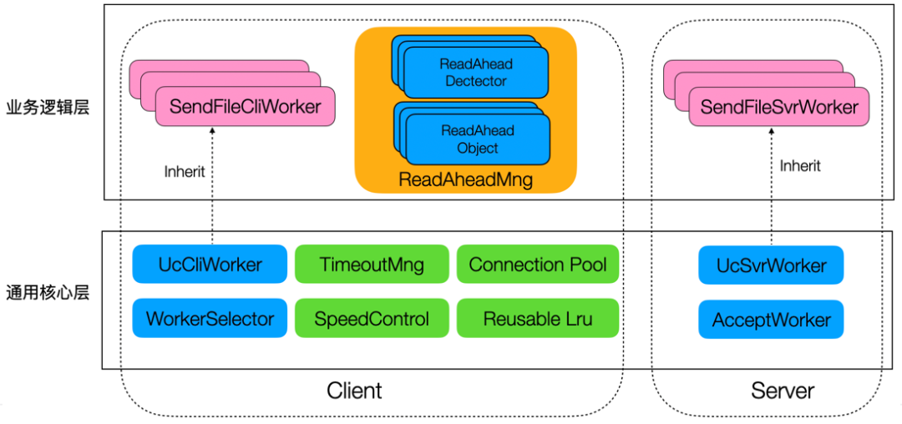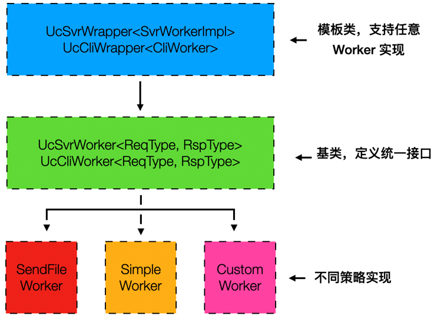

老版本 WFS 在数据传输过程中存在大量的 CPU 拷贝操作，造成了严重的性能损耗，性能优化的关键是如何做到零拷贝。##### **客户端零拷贝**

客户端数据传输链路中总共存在 5 次拷贝，流程为内核 socket → userspace → 反序列化 → 缓存 → fuse buffer → /dev/fuse。每一次拷贝都需要消耗 CPU 资源，拖慢了数据传输速度。通过 ultra-core 网络组件配合 splice 接口，结合自定义网络协议格式，实现了零拷贝传输。数据传输流程简化为内核 socket ---splice move---&gt; /dev/fuse，直接省略了用户空间的多次拷贝操作。##### **服务端零拷贝**

服务端数据传输链路中总共存在 3 次拷贝，流程为内核 disk → userspace → 序列化 → 内核 socket。同样，多次拷贝导致服务端 CPU 负载居高不下，限制了带宽的提升。采用 sendfile 接口，彻底消除了用户空间和内核空间的数据拷贝。数据从内核 disk 通过 DMA 传输到 page cache，再通过 DMA 直接传输到 NIC。整个过程完全由 DMA 完成，不占用 CPU 资源，大幅降低了服务端的 CPU 消耗。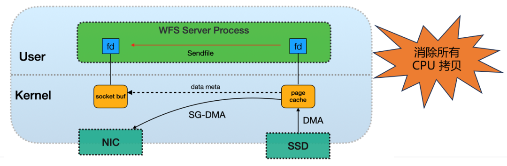

经过优化，全链路总共减少了 8 次 CPU 拷贝。服务端启用 sendfile 模式后，性能表现极为出色，跑满 200Gb 带宽仅占用 3 个核心。但该模式也存在一定的缺点，它不支持实时 CRC 校验。为了规避这一风险，我们通过定期巡检的方式，降低在该模式下访问到静默损坏数据的概率。#### **负载自适应预读**

##### **预读策略**

预读技术是提升文件读取速度的有效手段，为了提高低并发下文件的读取速度，我们引入了预读机制。当系统探测到顺序读行为时，会主动发起 ReadAhead 操作，提前将后续可能需要的数据读取到内存中，提升了读取效率。但预读机制也存在一定的挑战，预读需要开辟额外的内存来存储预读结果。首先，内存分配过程可能会带来不可预期的抖动消耗，为了解决这一问题，我们采用了内存池优化方案，通过预先分配固定大小的内存块，避免了运行时的内存申请与释放操作，保证了系统的稳定性。由于内存有限，WFS 采用细粒度流式预读的方式，在相同内存消耗的情况下，能够最大程度地提升单路文件的吞吐。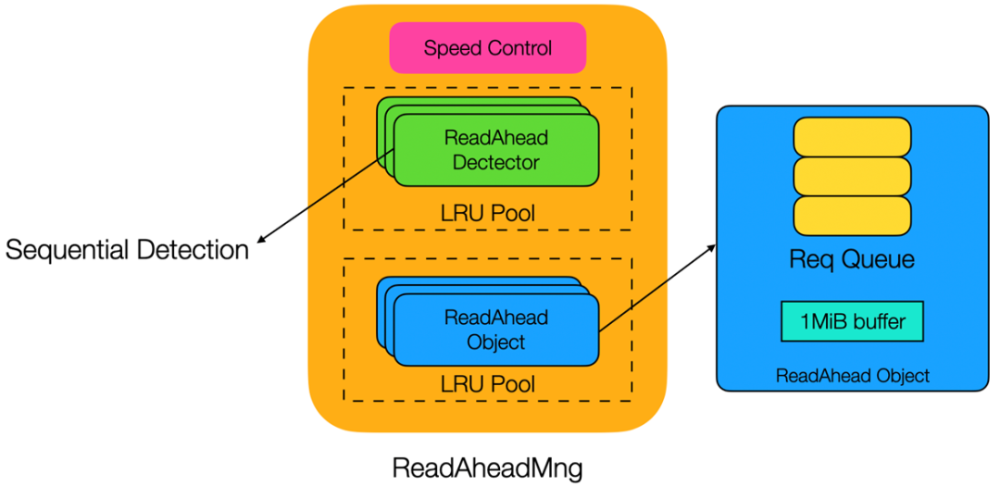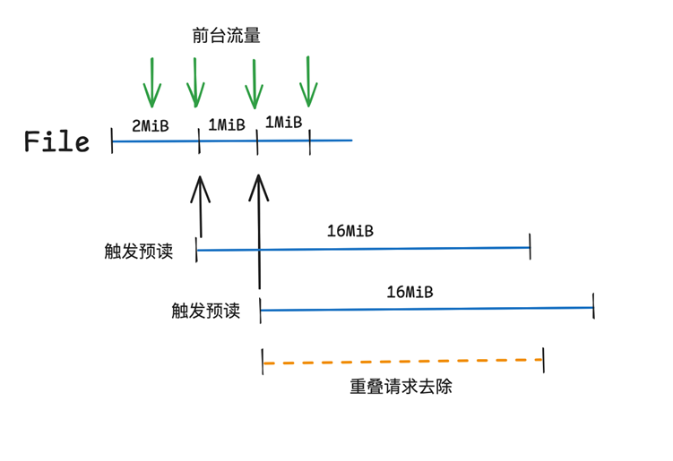##### **负载自适应策略**

其次，在多并发场景下，预读引入的额外 CPU Copy 会影响 Client 整体的读性能。针对这一问题，我们对预读机制实施了严格的限速策略，保证在高并发场景下，系统的吞吐性能不受影响。同时，系统内部会针对 BufferIO 和 DirectIO 进行区分处理。BufferIO 模式下会存在额外的 Page Cache 拷贝，叠加预读的拷贝操作后，性能下降会比较严重。因此，我们在限速统计流量时，给 BufferIO 赋予更大的权重，当系统负载较大时，自动停止预读操作，保障高并发场景下的带宽性能。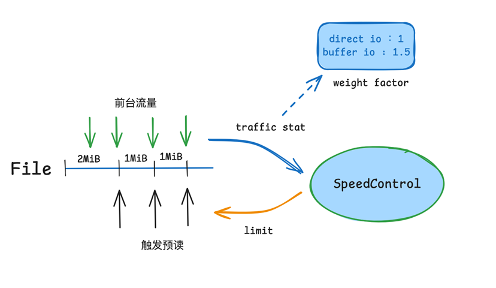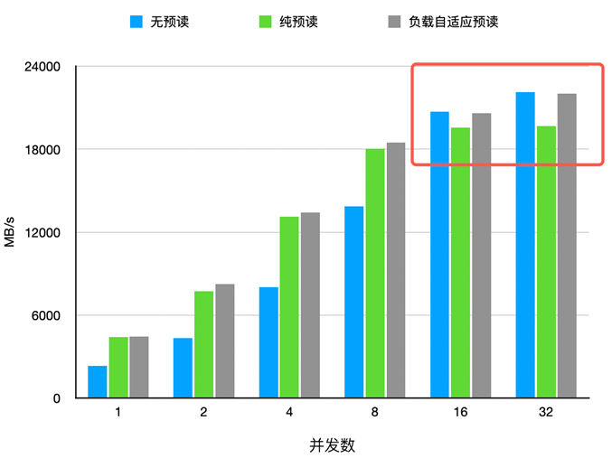
### **优化应用场景**

#### **预热Overlap加速模型加载**

在 AI 模型训练与推理场景中，模型加载的耗时直接影响业务的启动效率。我们将 WFS 的优化方案应用于模型加载场景，通过预热 Overlap 策略，进一步实现了模型加载速度的大幅提升。预热 Overlap 策略通过提前将模型数据加载到内存中，实现了模型加载与框架初始化的并行执行，极大缩短了整体启动时间，从测试数据来看，不同规模模型的参数数据加载耗时均有显著下降。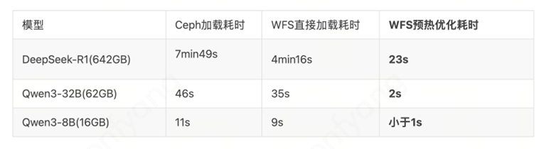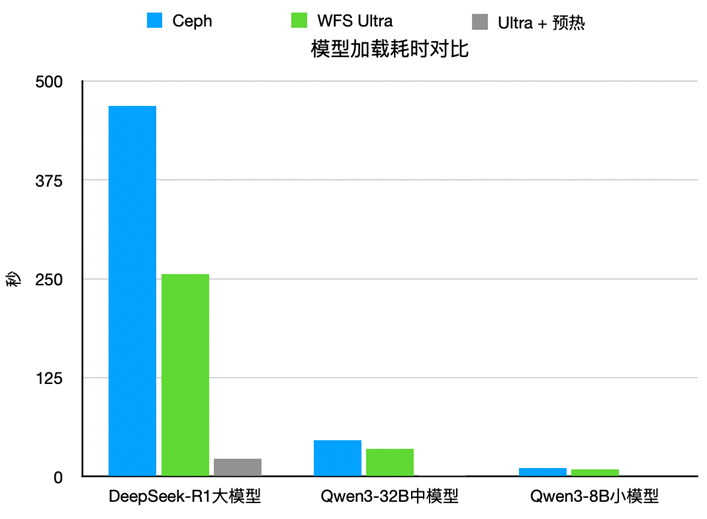#### **异步化加速随机读**

在高并发场景，或者网络环境不稳定、延迟较高的部署方式下，异步化改造对随机读性能的提升效果尤为显著。我们在内部生产环境进行了实测，结果显示，在相同并发条件下，WFS Ultra 版本的随机读性能相较于常规实现，差距可达 10 倍以上。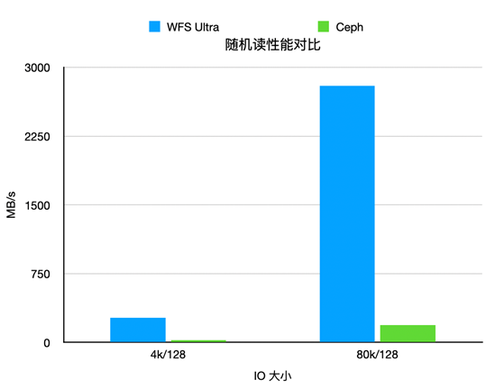### **总结**

以上是WFS 针对传统 TCP 网络的优化实践，通过 Run-To-Completion 线程模型、全链路零拷贝、负载自适应预读等关键优化，充分发挥传统 TCP 网络的性能极限。在 200Gb 网络环境下，实现了 Fio 吞吐超越 RDMA 下 3FS 的吞吐，跑满200Gb网卡带宽。相较于 3FS 依赖 RDMA 硬件的方案，WFS 的优化方案更具普适性，无需额外的硬件升级支持。然而，RDMA 在 KVCache 等延迟敏感场景、以及在更大吞吐的网卡环境有更优的性能上限优势，WFS 也正在完善这部分的支持。

