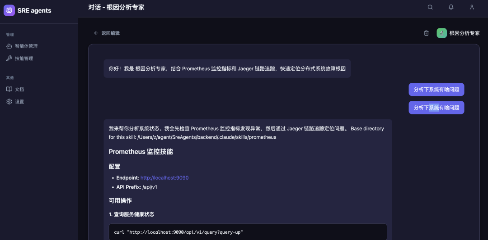
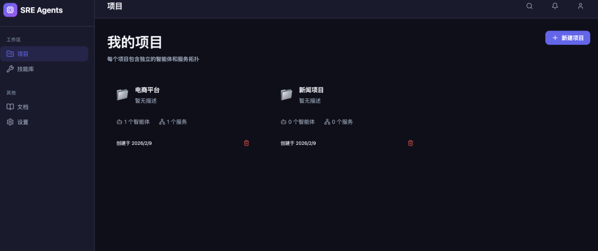
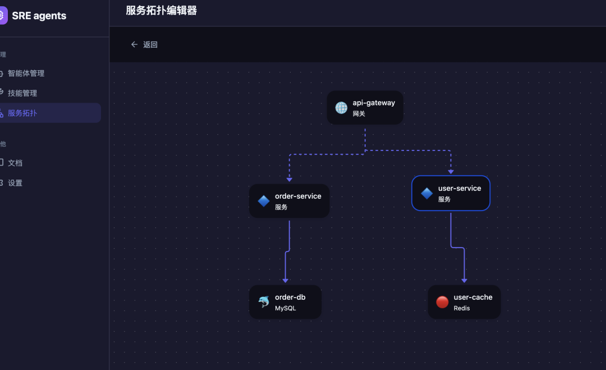
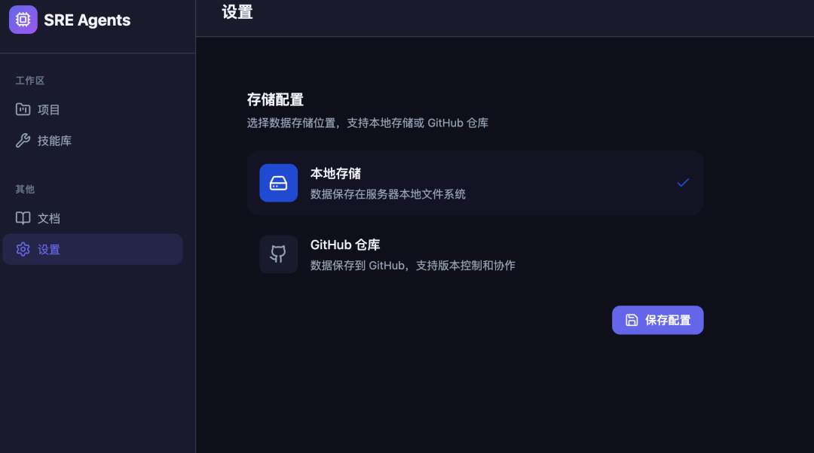
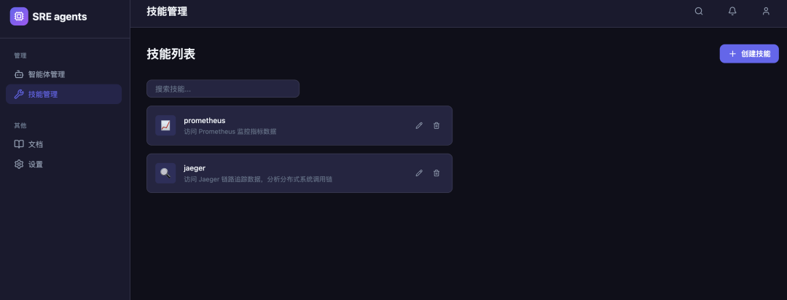

# 我做了个会进化的SREAgents，每个公司都能用

> 原文链接：[我做了个会进化的SREAgents，每个公司都能用](https://mp.weixin.qq.com/s?__biz=Mzg2OTYwNTM1MA==&mid=2247492012&idx=1&sn=ba0ab1c43d5d835dc682349524a0918a&chksm=cf5ace6cfe1baf84b92a7f1970550aaa1a74e6d8e115c911423d65fd9299fec297f375586d42&mpshare=1&scene=1&srcid=02094mUZwZT7HD2KoEktCLPX&sharer_shareinfo=3dc2e9925eed9a8de3fd1f0fb03e5638&sharer_shareinfo_first=3dc2e9925eed9a8de3fd1f0fb03e5638#rd)

hi，我是南哥。

上周熬了几个夜，做了个挺有意思的东西。

一个可以自己进化的 SRE 运维平台。智能体对话界面

听起来有点夸张对吧？

一开始我也觉得。但做着做着发现，这玩意儿还真有点那个意思。

**一、凌晨 3 点，又是告警**

去年有段时间，我被凌晨告警折磨疯了。

监控一报警，爬起来登录 Prometheus 查指标，再去 Jaeger 翻调用链，最后去 Sentry 看错误堆栈。

每次都是这套流程，机械得像个机器人。

那时候就想，能不能搞个 AI 直接帮我干这些活？

有了想法之后，我就开始折腾。用 Claude Agent SDK 搭了个原型，给它配上 Prometheus 和 Jaeger 的 Skills。Skills 管理

结果第一版跑起来，我傻眼了。

这玩意儿只能分析我自己公司的服务。换个项目就歇菜。

后来我想明白了，运维这事儿，每个公司的架构都不一样。有的用 K8s，有的还在虚拟机；有的上了 Istio，有的连 Service Mesh 都没听过。

要做一个通用的 SRE Agent，得让它能**自己适应不同的环境**。

**二、让 Agent 能进化**

这个问题卡了我好几天。

直到我看到一个开源项目的做法：把项目、拓扑、智能体全部分开管理。

这给了我启发。

既然每个公司的架构不一样，那就让用户**自己定义项目结构**。项目管理

你看这个项目列表，每个项目都是独立的。

电商平台有自己的智能体和服务拓扑，新闻项目也是。它们互不干扰。

更关键的是，每个项目可以配置自己的**服务拓扑图**。服务拓扑编辑器

这个拓扑编辑器是我花了两天时间搞出来的。

你可以在上面拖拽服务节点，定义它们之间的依赖关系。比如 api-gateway 依赖 order-service，order-service 依赖 order-db。

AI 在排查问题的时候，会根据这个拓扑图去分析。

如果 order-service 挂了，它知道要先看 order-db 是不是有问题，再看上游的 api-gateway 有没有请求堆积。

这就是我说的"进化"——**AI 会根据你的架构来调整自己的分析思路**。

**三、存储这个坑**

做到这一步，我又遇到新问题了。

智能体的配置、项目的拓扑图，这些数据存哪儿？

一开始我图省事，全扔本地文件里。

跑了两天发现不对劲。如果团队里有多个 SRE 要用，难道每个人都自己配一遍？

那不还是回到老路上了。

所以我又加了个**存储抽象层**。存储配置

现在支持两种存储方式：

**本地存储**：数据保存在服务器本地，适合个人使用。

**GitHub 仓库**：数据保存到 GitHub，支持版本控制和团队协作。

你可能会问，为啥选 GitHub？

因为运维配置本身就该被版本管理。

你给某个 Agent 加了个新 Skill，或者改了服务拓扑，这些变更都应该能追溯。万一改出问题了，还能回滚。

而且 GitHub 天然支持多人协作。A 同事配好了电商项目的拓扑，B 同事可以直接拿来用，不用重复劳动。

代码我是这么写的（摘录一小段给你们看看）：

`class&nbsp;StorageProvider(ABC):
&nbsp; &nbsp;&nbsp;"""存储提供者抽象基类"""

&nbsp; &nbsp; @abstractmethod
&nbsp; &nbsp;&nbsp;async&nbsp;def&nbsp;get_file(self, path: str)&nbsp;-&gt; Optional[str]:
&nbsp; &nbsp; &nbsp; &nbsp;&nbsp;"""读取文件内容"""
&nbsp; &nbsp; &nbsp; &nbsp;&nbsp;pass

&nbsp; &nbsp; @abstractmethod
&nbsp; &nbsp;&nbsp;async&nbsp;def&nbsp;put_file(self, path: str, content: str, message: str =&nbsp;"")&nbsp;-&gt; bool:
&nbsp; &nbsp; &nbsp; &nbsp;&nbsp;"""写入文件内容"""
&nbsp; &nbsp; &nbsp; &nbsp;&nbsp;pass
`

这个抽象基类定义了存储接口。具体是用本地文件系统还是 GitHub API，都实现这几个方法就行。

这样以后想接入 GitLab、或者 S3，改起来也方便。

**四、Skills 才是核心**

搞完存储，我发现最关键的还是&nbsp;**Skills**。

Agent 能干什么活，完全取决于你给它配了哪些 Skills。Skills 列表

我现在配了两个基础 Skill：**prometheus**：查 Prometheus 监控指标**jaeger**：查 Jaeger 调用链路

用起来是这样的。你问 AI："帮我分析下最近 5 分钟的报错。"

它会自动调用 prometheus Skill 去查指标，发现 user-service 的错误率飙升了。

然后它再调用 jaeger Skill 去翻调用链，定位到是 user-cache 连接 Redis 超时了。

整个过程你啥都不用管，AI 自己搞定。

这个 Skills 机制是 Claude Agent SDK 原生支持的，写起来特别简单。

一个 SKILL.md 文件，配上几行 YAML 头，就能让 AI 学会新技能。

比如我想加个 Sentry 错误追踪的 Skill，只要写个&nbsp;`sentry/SKILL.md`，告诉它怎么调 Sentry API 就行了。

**适配任何公司的秘密就在这儿**——你可以根据自己公司的技术栈，随便加 Skills。

用 Datadog？写个 Datadog Skill。 用 Grafana？写个 Grafana Skill。 自研监控？没问题，写个自己的 Skill。

Agent 会根据你配的 Skills 进化出对应的能力。

**五、现在能干啥**

折腾了大概一周多，现在这个平台能做到：**多项目管理**：每个项目独立配置，互不干扰**可视化拓扑**：拖拽定义服务依赖，AI 根据拓扑分析问题**智能体对话**：自然语言问问题，AI 自动调用 Skills 排查**灵活存储**：本地存储或 GitHub 仓库，支持版本控制**可扩展 Skills**：根据技术栈自由添加技能

我自己试了几天，效果还行。

之前要 10 分钟才能定位的问题，现在问一句话，AI 不到 1 分钟就能给出根因分析。

关键是它能记住你的架构。第二次再问类似问题，它直接就知道从哪儿查起。

**六、技术栈**

前端用的 React 19 + Vite 7，后端 Python FastAPI + Claude Agent SDK。

拓扑编辑器是我参考了几个开源流程图库，自己拼出来的。

存储层抽象用的 Python 的 ABC（抽象基类），这样后面加新的存储后端不用动核心代码。

整个项目结构大概是这样：

`├── frontend/ &nbsp; &nbsp; &nbsp; &nbsp; &nbsp;# React 前端
│ &nbsp; ├── src/
│ &nbsp; │ &nbsp; ├── components/ &nbsp;&nbsp;# 组件
│ &nbsp; │ &nbsp; └── pages/ &nbsp; &nbsp; &nbsp; &nbsp;# 页面
├── backend/ &nbsp; &nbsp; &nbsp; &nbsp; &nbsp;&nbsp;# Python 后端
│ &nbsp; ├── storage/ &nbsp; &nbsp; &nbsp; &nbsp; &nbsp;# 存储抽象层
│ &nbsp; │ &nbsp; ├── base.py &nbsp; &nbsp; &nbsp;&nbsp;# 抽象基类
│ &nbsp; │ &nbsp; ├── local.py &nbsp; &nbsp; &nbsp;# 本地存储
│ &nbsp; │ &nbsp; ├── github.py &nbsp; &nbsp;&nbsp;# GitHub 存储
│ &nbsp; │ &nbsp; └── manager.py &nbsp; &nbsp;# 统一管理
│ &nbsp; ├── projects/ &nbsp; &nbsp; &nbsp; &nbsp;&nbsp;# 项目数据
│ &nbsp; └── server.py &nbsp; &nbsp; &nbsp; &nbsp;&nbsp;# FastAPI 主服务
└── start.sh &nbsp; &nbsp; &nbsp; &nbsp; &nbsp;&nbsp;# 一键启动
`

代码已经开源，私信获取。

**七、接下来要干的事**

现在这个版本还很粗糙。

我脑子里已经有一堆想加的功能了：**告警自动接入**：直连 Prometheus Alertmanager，告警来了 AI 自动开始分析**历史案例学习**：记录每次排查过程，下次遇到类似问题直接给建议**自动生成 Runbook**：AI 分析完问题后，自动写成处理文档**多 Agent 协作**：一个 Agent 负责监控，一个负责日志，一个负责链路，协同工作

最让我兴奋的是第二点。

想象一下，AI 记住了你过去处理的所有故障。下次遇到类似场景，它直接告诉你"上次这个问题是 Redis 主从切换导致的，建议先看..."

这才是真正的"进化"。

**八、为啥要做这个**

可能有人会问，市面上不是有很多 AIOps 平台吗？

是的。但它们都有个问题——**太重了**。

要么是商业产品，功能强大但价格劝退。 要么是开源项目，部署复杂得要死，光看文档就头大。

而且大部分都是面向大厂设计的，中小团队根本用不起来。

我想做的是一个**轻量、灵活、能快速适配**的 SRE Agent 平台。

不需要改你现有的架构，也不需要学一堆新概念。

装好 Claude Agent SDK，配几个 Skills，拖一下服务拓扑图，就能用。

好啦，这就是我这一周多的折腾成果。

如果你也被凌晨告警折磨过，如果你也想让 AI 帮你干运维的脏活累活，可以关注下这个项目。

我会持续更新的。

对了，还有个事儿没说。

下一步我打算做个**真实故障演练功能**。

AI 模拟线上故障，自动注入各种异常（比如某个服务延迟飙升、数据库主从切换、网络抖动），然后看你的系统能不能扛住，运维团队能不能快速定位。

这个功能做出来之后，可能会很有意思。

感兴趣的评论区聊？

以上，既然看到这里了，如果觉得不错，随手点个赞、在看、转发三连吧～

*我是南哥，10年大厂架构师，擅长 AIOps，Agent开发，k8s源码*

