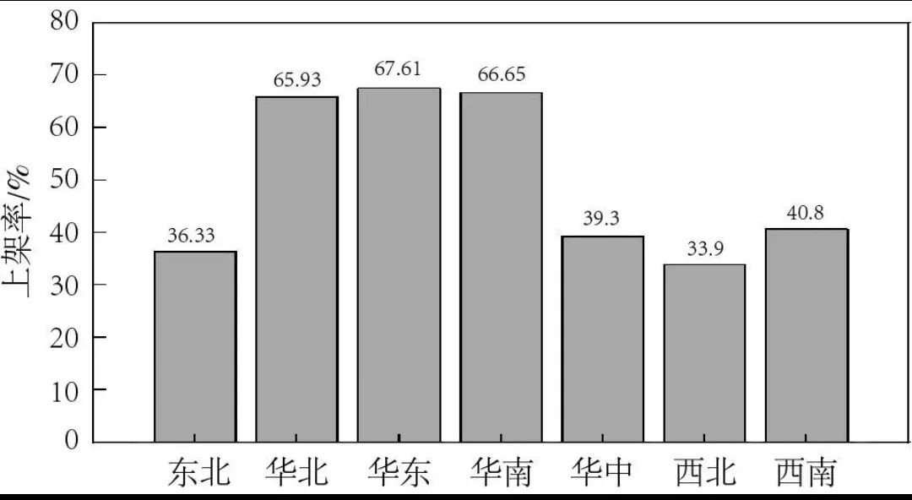
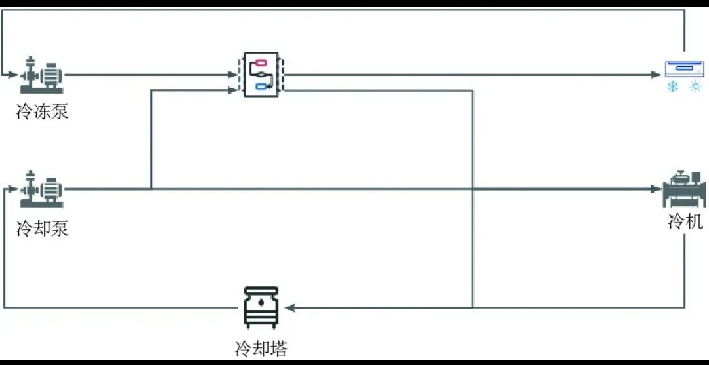
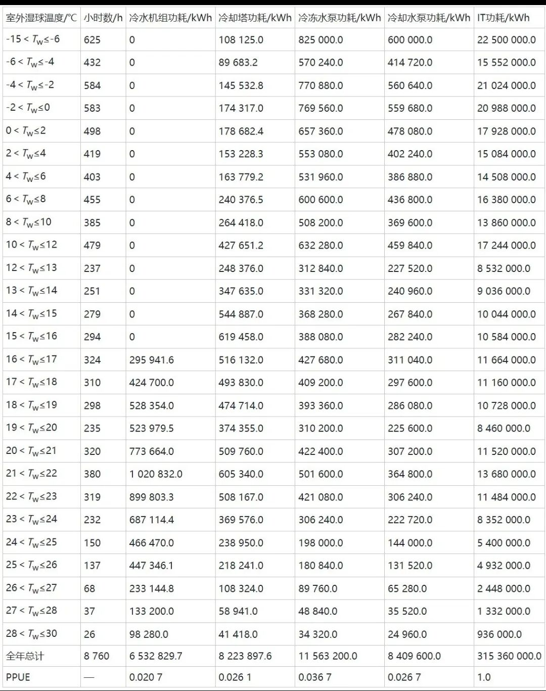
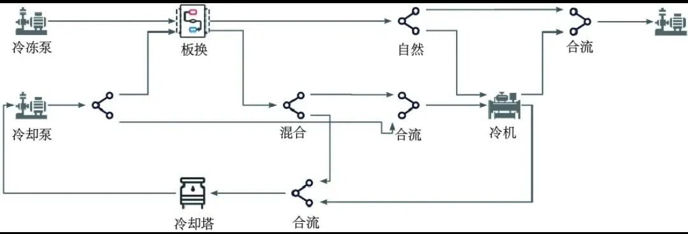
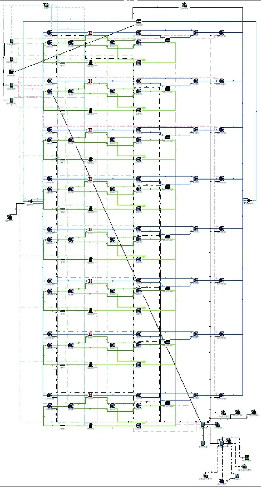
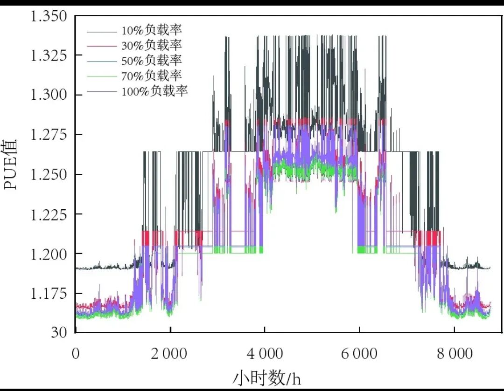
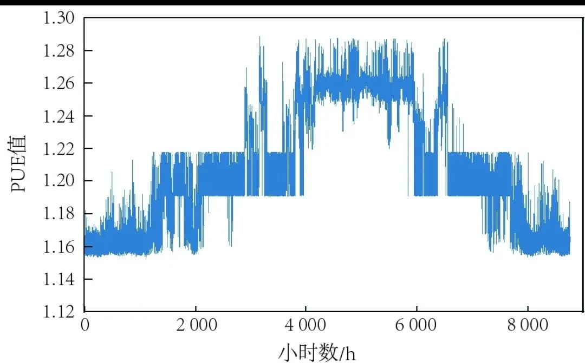

# 我国数据中心PUE的计算方法

> 原文链接：[我国数据中心PUE的计算方法](https://mp.weixin.qq.com/s/hKtCf8sVROt_XHThESuAsw?scene=1)

# 摘要：目前，我国对数据中心能耗的要求趋于严格，需要有合理的手段对数据中心能耗进行计算评估。以天津地区某数据中心为例，分别使用Excel和Trnsys进行数据中心PUE计算。在介绍两种基本计算方法的基础上，对项目进行模拟计算，并根据模拟计算结果分析了两种计算方式的优势劣势，最后给出不同计算方法适用的项目及场景。

关键词：数据中心；PUE计算；能耗；Trnsys随着经济和技术的发展，近年来短视频的出现、通信的升级等技术都带来了大量的数据处理和信息传输需求。为了满足生产生活需求，我国建设了大量数据中心，按2.5 kW的标准机架统计，截至2021年底，我国在用机架数量约为520万架[1]。同时，相关分析表明，到2025年底，我国数据中心的机架规模将达到1 043万架[2]。而ChatGPT、Stability AI等AI模型的出现和应用，对算力的需求更是飞速提升，据华为发布的《智能世界2030》[3]报告预测，到2030年，人工智能算力需求将比2020年增长500倍。

在数据中心体量增大和算力需求增加的背景下，数据中心的能耗也大幅增加。据统计，2020年我国数据中心用电量达到1 500亿kWh，占全社会用电量的2.7%[4]。2024年，我国数据中心总用电量已经达到1 970亿kWh[5]。数据中心耗电量统计表明[6-8]，数据中心用电设备中，IT设备用电占比50%～80%；空调系统用电占比20%～35%；供配电系统及其他设备耗电量占比3%～10%。由统计数据可以看出，数据中心中IT设备和空调系统能耗占比大，应做好对应耗电量的监管，保证数据中心整体能耗处于合理水平，推动绿色数据中心的建设。

为实现数据中心高技术、高算力、高能效的发展目标，在发展节能技术的同时，要更好地管控数据中心耗电。为规范数据中心能效，近年来各级单位不断推出相关政策及要求：2020年，国家发展改革委等部门发布《关于加快构建全国一体化大数据中心协同创新体系的指导意见》[9]要求，2025年大型、超大型数据中心运行电能使用效率(PUE)降到1.3以下；2021年，工信部及国家发展改革委相关政策指出，到2023年底新建大型及以上数据中心PUE降到1.3以下，达到绿色数据中心要求，到2025年，全国新建大型、超大型数据中心平均PUE降到1.3以下，国家枢纽节点PUE降到1.25以下[10]；2022年，工信部等7部门计划要求加快“老旧小散”存量数据中心资源的整合和节能改造，到2025年，全国新建大型、超大型数据中心PUE降到1.3以下，改建核心机房PUE降到1.5以下[11]。

从国家出台的相关政策可以看出，在加快数据中心发展的同时，也要求严格控制数据中心能效。为降低数据中心PUE，项目初期设计阶段会采用多种节能技术，以求实现最优能耗，在确定技术组合后计算数据中心满负荷情况的PUE值。而目前在数据中心的实际运行中，华东地区数据中心平均上架率为67.61%，是各地区最高，上架率最低的地区为西北，地区平均上架率仅为33.9%，全国平均上架率仅为50.07%，各地区数据中心上架率如图1所示[12]。从图1可以看出，我国各地区的上架率存在不平衡现象，IT设备实际上架情况往往与设计的满载工况偏差较大。#### 图1 各地区数据中心上架率

这种实际运行的数据中心PUE与前期PUE的设计工况存在差异的现状，给数据中心的实际运行能耗的评估带来困难，实际运行PUE是否为合理状态，仅根据初期设计计算结果往往难以回答。通过技术手段，正确评估数据中心能效情况是有效管控PUE的前提，也是实现数据中心能耗降低的重要依据。

本文以天津地区某项目为例，分别使用Excel和Trnsys(Transient System Simulaion，瞬态系统模拟)两种计算方式对数据中心的PUE进行计算分析。通过不同的计算方式，得到设计工况及不同负荷率情况下数据中心的能耗变化。# 1 项目概况

该项目位于天津，属于分区中的寒冷地区，可利用自然冷源时间，因此采用离心式冷水机组作为主冷源，及间接蒸发冷却塔作为冬季、过渡季主冷源，配套板式换热器实现不同季节冷源的切换供水。该系统以16 ℃ 室外湿球温度作为自然冷源切换节点，根据统计数据可知，天津全年满足自然冷却条件的时间为5 924 h。

系统共有3种运行模式，分别为机械制冷模式、混合模式及自然冷却模式。夏季室外温度较高时使用冷水机组制冷，系统处于机械制冷模式，冷却塔仅提供冷却水为冷凝器降温，冷却水不经过板式换热器；过渡季由冷却塔作为主要制冷设备，不足的制冷量由冷水机组补充，系统处于混合制冷模式，冷却水的制冷量通过板式换热器传递给冷冻水，与冷机补充的制冷量一起实现末端制冷；当室外湿球温度低于16℃时，由间接蒸发冷却塔和板式换热器共同工作为末端制冷，此时系统切换至自然冷却模式。系统基本原理如图2所示。#### 图2 制冷系统原理图

# 2 PUE计算

## 2.1 传统计算

由设备工作原理及厂家相关数据可以得到不同温度区间设备的耗能情况，根据设备数据将全年室外湿球温度进行分区，并按照统计年鉴[13]确定温度区间对应的小时数，室外湿球温度及对应湿球小时数见表1。表1 传统(Excel)PUE计算表

如前所述，当室外湿球温度低于16 ℃ 时无需开启冷水机组，此时冷水机组总功耗为0。随着室外温度升高，冷却塔功耗不断增加，当湿球温度达到临界状态后开启冷水机组补足制冷量。采用Excel进行计算时，往往认为冷冻水及冷却水流量不发生改变，因此水泵功耗与室外温度无关。进入夏季机械制冷模式后，冷却塔、冷冻泵及冷却泵的运行功耗保持稳定，随着温度的升高，为保证系统内冷冻水温度，冷水机组的功耗会持续增大。

在采用Excel进行计算时，通常仅将冷水机组与温度进行耦合，少部分计算会将冷却塔与温度进行耦合，这种耦合通常基于理想状态。室外温度波动、设备通风及太阳辐射等对设备传热和设备运行所带来的影响通常不考虑。同时，水流量的变化往往也不在考虑范围内，为了避免全流量计算带来的PUE值过大，功耗计算时往往会统一代入0.9～1.0的附加系数，减少水泵的PPUE(Partial Power Usage Effectiveness，局部电能使用效率)占比。

采用Excel的传统计算方式计算满负载情况具有便捷、计算快速的特点，适用于特定场景。但这种计算方式往往未考虑到数据中心的实际情况，如数据中心在建设完成后，设备的上架通常要经历初期运行阶段、中期增长阶段以及末期稳定阶段，各阶段中机房内IT功耗逐步增大，并在末期达到稳定。同时，设备运行中不同设备、不同时间以及机房内任务量均有所差异，一天当中可能出现多种运行场景[14]。这些变化产生的能耗波动，往往无法在传统计算中得到体现。

综合上述情况，在数据中心设计及运行阶段，如果有更精确的PUE计算方法，将大大提高对数据中心能耗评估的准确性，同时可指导运维人员正确判断系统是否处于合理的运行状态，从而实现对设备运行的合理监管。## 2.2 Trnsys计算

利用Trnsys方法对数据中心制冷系统进行计算时，除了确定系统内耗能设备数量外，还应将空调主系统图进行简化分析，最终确定不同工况的切换条件和切换模块。将空调系统图进行整理，可得到如图3所示的制冷系统模拟架构图。从图3中可以看出，系统处于自然冷却模式时，开启“机械”分流模块上方支路和“自然”分流模块上方支路；混合模式及机械制冷模式切换方式同理。架构图是模拟正常进行的前提，因此应确保各模式切换的状态正确，确保切换逻辑能够满足系统需求。#### 图3 制冷系统模拟架构图

根据图纸确定系统的基本模块和初始参数。该数据中心由8组小制冷系统构成，分别设冷水机组、板式换热器及冷却塔、冷却泵8台，数据中心采用二次冷冻泵，以减少一次冷冻泵的能耗、体积和采购成本，共设16台冷冻泵。按照制冷系统的原理图对模块进行连接，本项目所需设备模块如图4所示。#### 图4 设备模块图

如前所述，制冷系统共有3种运行逻辑，将运行模式的切换逻辑写入计算器，以实现不同室外湿球温度下冷水系统的切换。考虑到项目实际运行时存在多数上架率不断变化的现象，针对这一情况应补充设备启停控制计算器，实现随着负荷率的改变，设备开启数量随之变化的目标。各模块设置完成后，将计算器的输出信号传递给设备，同时导入天气模块完成系统连接，项目制冷系统模型如图5所示。

对该数据中心不同上架情况进行模拟，分别模拟机房上架率为10%、30%、50%、70%及100%的工况。同时，考虑到实际运行中还存在设备上下架、设备运行业务量变化以及补充负荷变化等工况，最终将模拟结果进行整理，完成不同负载率工况全年PUE变化图，如图6所示。从图6中可以看出，不同负载率情况数据中心PUE出现呈先降低后升高的变化趋势，即从负载率为100%的工况起，随着负载率的降低，PUE逐渐降低，并在70%负载率时达到最低；随着负载率的继续降低，PUE逐渐升高，并在10%负载率时达到最高。从图6中不同负载率的PUE变化同时可发现，100%负载率与50%负载率工况的PUE相近；随着负载率的降低，各负载率之间的能耗差值也随之增大，即升高的过程中PUE增速同时增大。

负载率全年持续波动的PUE情况如图7所示。当负载率存在波动时，即使在冬季和过渡季数据中心的能耗也有明显的上浮趋势，其逐时能耗表现情况与单一负载率下存在明显差别。可以看出，在计算数据中心实际运行PUE时，需要采用合理的计算方式，传统计算方式难以体现PUE的逐时波动和整体变化带来的影响。#### 图5 制冷系统模型图

# 3 结语

通过前述模拟分析，可以得到如下结论：

(1)当仅需对数据中心满负荷进行简单计算时，建议采用Excel方式进行计算，具有快捷、方便的优点，适用于对全过程能耗评估、监管无要求，需要快速得到满负荷PUE的数据中心项目。

(2)当需要对数据中心多种工况场景进行PUE评估时，建议采用Trnsys方式进行能耗计算，适用于对数据中心全生命周期进行监管的项目。#### 图6 不同负荷率系统PUE变化图

#### 图7 负载率变化工况系统PUE图

(3)由于传统计算方式采用的是满负荷下的设备性能曲线数据，PUE结果往往较为理想。但在实际运行中由于存在管路沿程阻力、过渡季切换的机组启停耗能等损耗情况，系统PUE表现往往与理想计算情况存在偏差，未能体现系统自身损耗带来的影响，建议采用Trnsys计算方法将管路模块和切换损耗添等因素加至模型中，以实现更准确的PUE计算结果。### 参考文献

[1]中国信息通信研究院云计算与大数据研究所.数据中心白皮书(2022年)[R].北京：中国信息通信研究院，2022.[2]工信部.新型数据中心发展三年行动计划(2021—2023年)[EB/OL].[2025-07-01].http://www.gov.cn/zhengce/zhengceku/2021-07/14/content_5624964.htm.[3]华为技术有限公司.智能世界2030[R/OL].(2022-05-26)[2025-07-03].https://www.huawei.com/cn/giv.[4]彭扬.耗电大户数据中心何以践行“碳中和”[J].科学大观园，2022(6):32-35.[5]智伟威，周新星，杨磊.PUE在数据中心节能管理中的应用研究[J].智能建筑，2021(12):70-71,77.[6]戴新强，丁卫科，黄建如，等.数据中心空调系统能耗与节能应用研究[J].中国设备工程，2020(4):12-14.[7]原世杰，鹿世化，詹艳平，等.数据中心空调系统节能降耗研究进展[J].低温与超导，2015,43(7):86-92.[8]窦海波，陈琼环，杨宜楠，等.深圳某数据中心节能运营优化实践总结[J].暖通空调，2023,53(1):112-116.[9]国家发展改革委，中央网信办，工信部，等.关于加快构建全国一体化大数据中心协同创新体系的指导意见[EB/OL].(2020-12-23)[2025-07-01].http://www.gov.cn/zhengce/zhengceku/2020-12/28/content_5573684.htm.[10]国家发展改革委，中央网信办，工信部，等.贯彻落实碳达峰碳中和目标要求推动数据中心和5G等新型基础设施绿色高质量发展实施方案[EB/OL].(2021-11-30)[2025-07-01].https://www.miit.gov.cn/jgsj/jns/wjfb/art/2021/art_3b6c8d9c0c6e4c6d9c0c6e4c6d9.html.[11]工信部，国家发展改革委，财政部，等.信息通信行业绿色低碳发展行动计划(2022—2025年)[EB/OL].(2022-08-22)[2025-07-01].https://www.gov.cn/zhengce/zhengceku/2022-08/26/content_5706914.htm.[12]中国数据中心工作组.2021年中国数据中心市场报告[R].北京：中数智慧信息技术研究院，2021.[13]付凌晖，刘爱华.2022年中国统计年鉴[M].北京：中国统计出版社，2023.[14]吴智勇.数据中心气流组织改善及开机策略研究[D].沈阳：东北大学，2018.**来源：数据中心基础设施运营管理**

