# 我的 OpenClaw Token 账单降了72%，只因装了这个插件

> 原文链接：[我的 OpenClaw Token 账单降了72%，只因装了这个插件](https://mp.weixin.qq.com/s?__biz=MzU4MjY5NTc4OQ==&mid=2247498704&idx=1&sn=e174edad3a57c2d47a7d1410b8555357&chksm=fc0938941c7d34b936705139748d6a8d6c6af2579e762ecef9b1327b8cff5afabd39fd1f24ab&mpshare=1&scene=1&srcid=0214MBMRDxcmbKaSEOYOGkmt&sharer_shareinfo=93ffc93e1c2a81da769ff20a4f6bbee6&sharer_shareinfo_first=93ffc93e1c2a81da769ff20a4f6bbee6#rd)


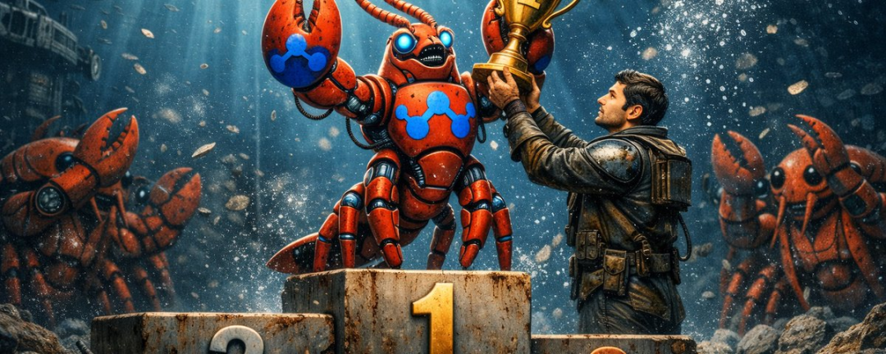

最近 OpenClaw 玩法很多，组建 AI 打工天团，养成系 AI 女友，每一个都让人上头。


但激情过后，打开 API 账单，瞬间透心凉。


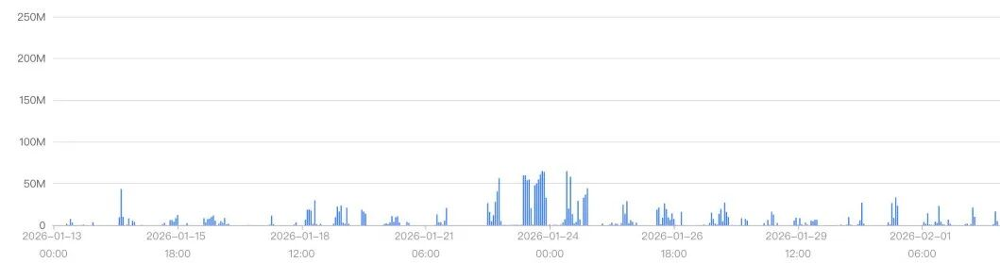

这种吞金速度，别说跑应用了，多聊几句都心疼。


## 为什么会变成"吞金兽"？


因为在大模型领域，Context 即成本。


OpenClaw 默认把所有对话，全塞进上下文，Agent 带着一堆无关信息，Token 消耗指数级增长。更糟的是，噪点太多，模型注意力分散，甚至出现幻觉。


而且我发现一个普遍现象，群里不少朋友用 OpenClaw，都是一个主 Agent 干所有事，写代码、头脑风暴、写文章、查资料……时间一长，记忆文件越堆越多，每次执行任务，都要读一大坨历史。


结果就是，Agent 开始"神经错乱"。


你让它写代码，它突然蹦出上周的公众号大纲；你让它分析需求，它把调试 Bug 的记忆也塞进来了。不同任务的上下文交叉污染，精准度直线下降，Token 还在疯狂燃烧。


## 我在X上刷到一个本地方案，然后放弃了


看到这里，硬核玩家可能会说，"自己搭个本地向量库不就行了？"


我也想过。


前阵子在 X 上刷到有人分享了一个叫&nbsp;QMD&nbsp;的方案，看起来挺美好，能让 OpenClaw 拥有本地检索记忆。

但打开文档，看到这段话，可能会倒吸一口凉气：


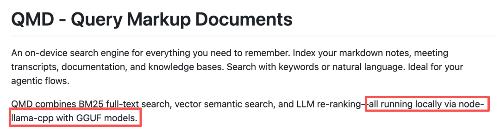

这意味着什么？


你得先交一笔"设备税"：


第一，下载模型，首次运行会自动拉取约 2G 的 GGUF 模型到本地。

第二，常驻进程，后台必须跑一个 node-llama-cpp，只要 Agent 在用，就不能关。

第三，资源爆炸，向量化和重排序，都是 CPU 密集型任务。


实际体验就是，你唤醒 Agent 准备干活，笔记本风扇开始狂转，CPU 占用飙升。

还没写出第一行代码，16G内存已经吃掉一大半。


为了省 API 费，把生产力工具搞成了卡顿模拟器。


不值得。


## MemOS：把"大脑皮层"搬到云端


然后我在 GitHub 上看到了&nbsp;MemOS。

说实话，做 AI 记忆的项目不少，mem0、supermemory、memU 都试过。

但 MemOS 有几个点，让我决定深入试试。


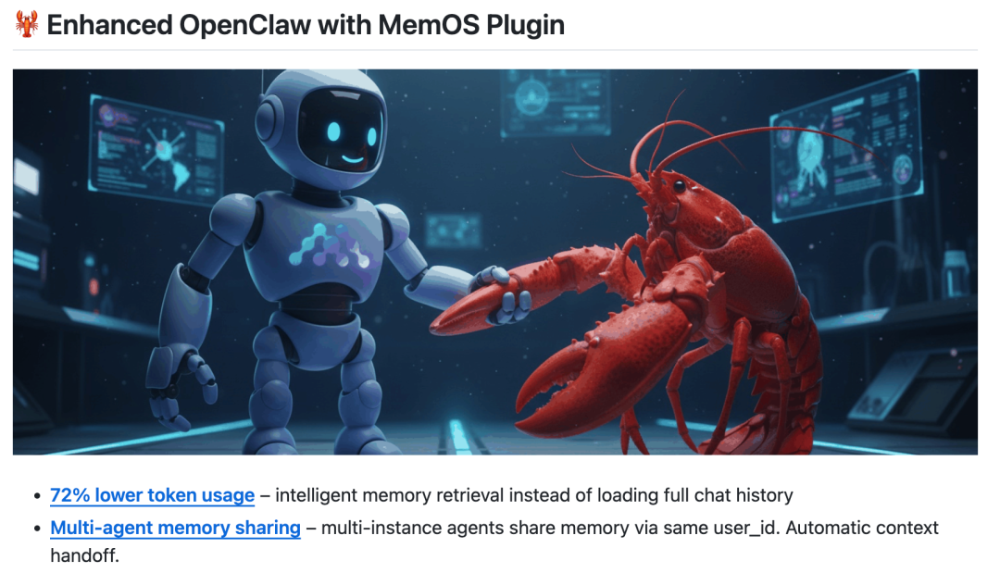

### 第一，它是真的轻。


跟本地方案思路完全不同，MemOS 把最吃资源的活，向量化、检索、记忆管理，全部云端化了。不需要下载 GGUF模型，不需要后台常驻重型进程，只需要一个轻量 Plugin，几行配置，即装即用。


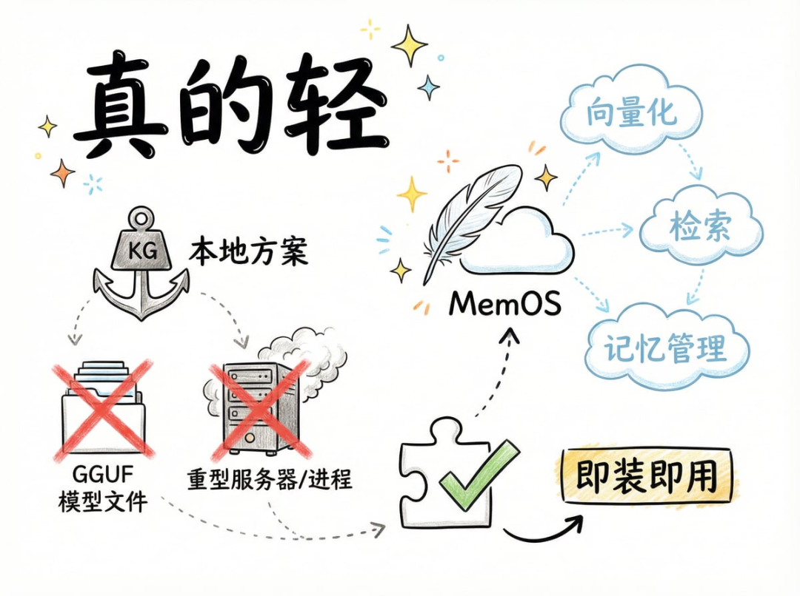

### 第二，不是暴力塞上下文，而是"精准召回"。


MemOS 引入了激活记忆机制，它不会把所有历史对话一股脑塞给模型，而是基于当前任务意图，精准检索最相关的几条记忆。


只为"有效信息"付费。


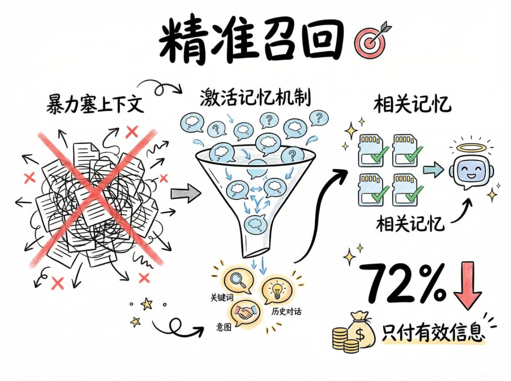


根据官方数据，Token 消耗可以下降72%。我自己体感也很明显，同样的任务，接入前后差距肉眼可见。


### 第三，个性化体验。


用了一段时间后，你会发现，Agent 真的"认识你"了。

它记得你的偏好，记得你的项目背景，记得你之前的决策。


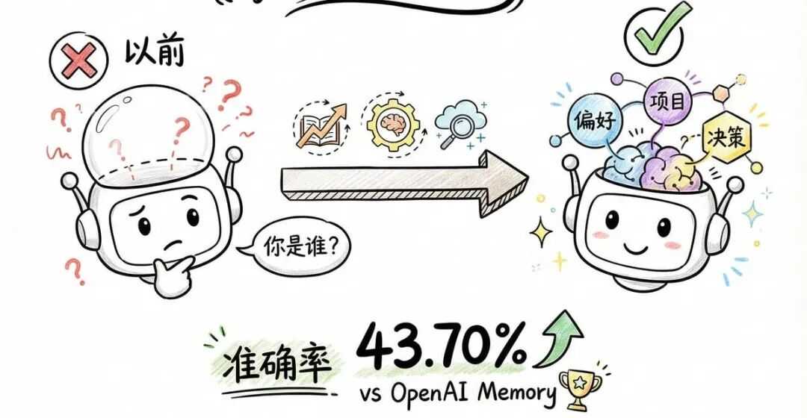

不像以前，每次开新会话，Agent 就像失忆了一样，你得从头交代一遍。

根据官方评测数据，在 PrefEval-10 基准上，MemOS 准确率比 OpenAI Memory 高出 43.70%。


这不是小数字。


## 真正让我"回不去"的功能：多 Agent 记忆共享


省钱当然好，但真正让我觉得值回票价的，是 MemOS 解决了多 Agent 协作最大的痛点——Agent之间的记忆隔离。


先说说为什么要用多 Agent。


前面提到了，所有任务塞一个 Agent，时间久了就会错乱。

所以正确做法是，不同任务，不同 Agent，不同工作空间。


我目前常用的几个 Agent：

🧠&nbsp;头脑风暴Agent：负责发散思维、搜集资料、产出创意，用便宜模型就行，比如 gemini-2.5-flash。

✍️&nbsp;公众号写作Agent：负责把想法收敛成文章。

💻&nbsp;Coding Agent：负责写代码、调试。


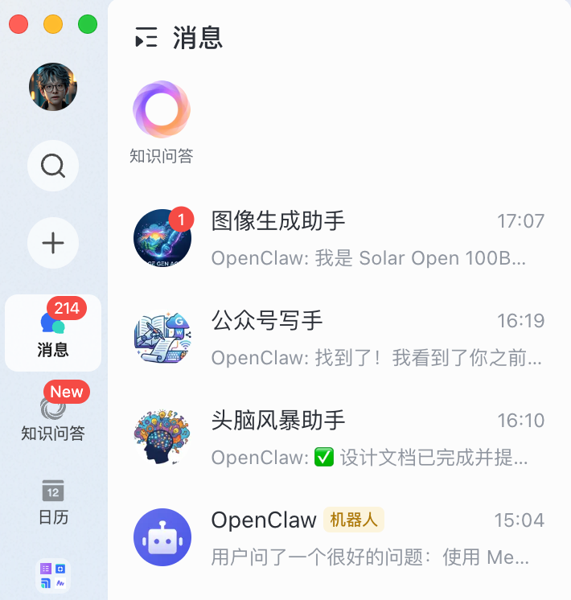

这种拆分好处很明显。


每个 Agent 记忆独立，不会因为加载复杂记忆而错乱；上下文不会交叉污染，写代码不会蹦出写文章的记忆；成本也好控制，简单任务用便宜模型，复杂任务上强模型。


但问题来了——

拆分之后，Agent 之间变成了信息孤岛。头脑风暴产出的 20 个创意，写作 Agent 根本不知道。你只能手动复制粘贴，充当"人肉传话筒"。


MemOS 解决的就是这个矛盾：工作空间隔离，但关键信息共享。


接入 MemOS 后，玩法变了。

比如我对头脑风暴 Agent 说："帮我出个智能家居控制系统的方案。"


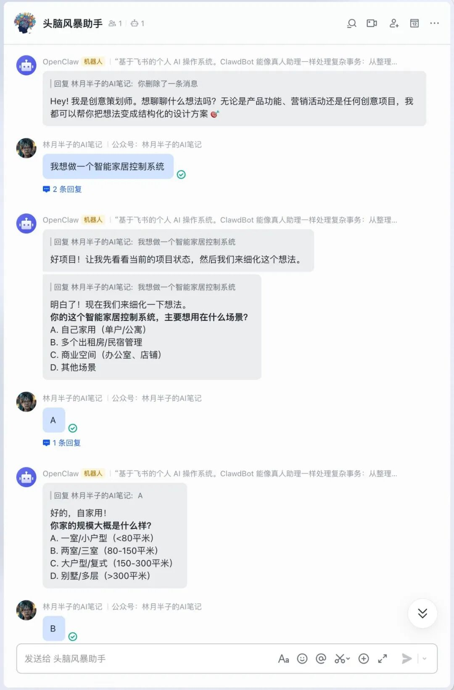

Agent 正常回复，给出方案细节。


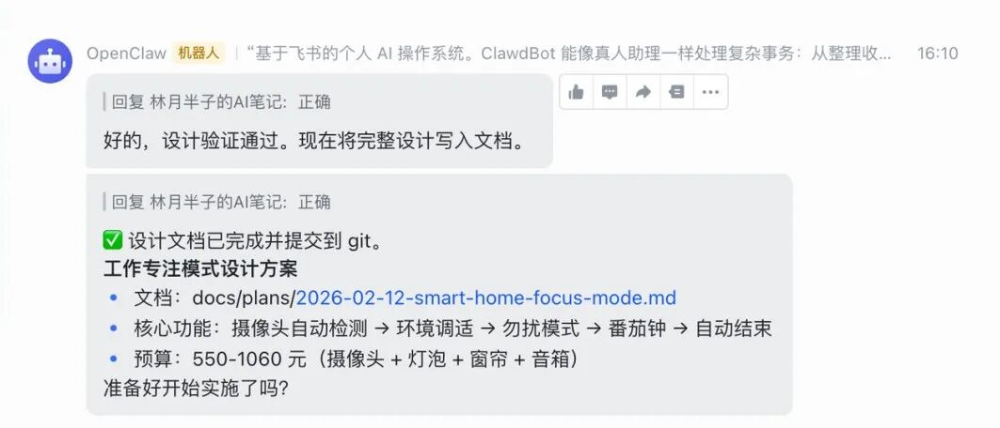

整个对话过程中，你不需要额外操作，对话内容会自动同步到 MemOS（后台日志显示为&nbsp;addMessage）


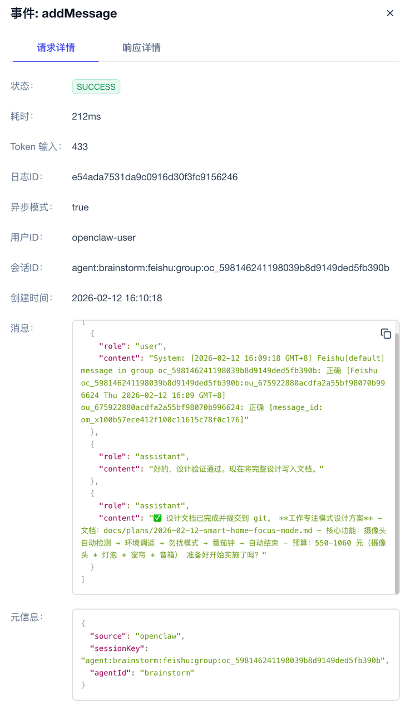

然后我切到写作 Agent，直接说："我之前在brainstorm里聊过一个智能家居方案，根据那个方案，帮我写篇公众号文章。"

Agent自动调用 search_memory，精准捞出刚才的方案。


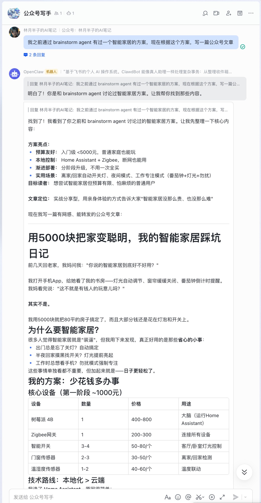

注意，我没指定标签，也没手动保存。

MemOS 的检索基于语义，你用自然语言描述"之前聊过什么"，它就能找到。


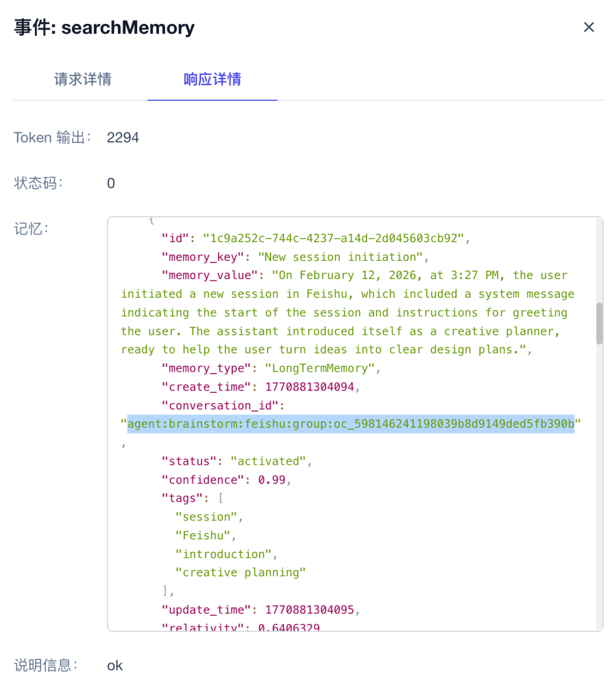

不需要复制粘贴，不需要重复交代背景。

Agent A 产生的智慧，Agent B 秒懂。


而且整个过程是"无感"的，对话输出会自动回写 MemOS，不需要手动保存，不需要指定格式，它自己完成分类和索引。你要做的，就是正常对话。


同样的逻辑适用于 Coding Agent。

比如我在头脑风暴里讨论完技术方案，切到 Coding Agent 直接说"开始写代码"，它就能从记忆里捞出技术栈和架构，不用再交代一遍。


这才是多 Agent 协作该有的样子。


而且因为每个 Agent 只检索自己需要的记忆，而不是加载全量历史，Token 消耗反而更低了。


省钱，防错乱，真协作，三件事一次解决。


## 30秒极速安装


好用的工具必须简单，MemOS 接入流程非常友好。


### Step 1：获取API Key


前往MemOS Dashboard（https://memos-dashboard.openmem.net/cn/login/）注册，获取免费 API Key。


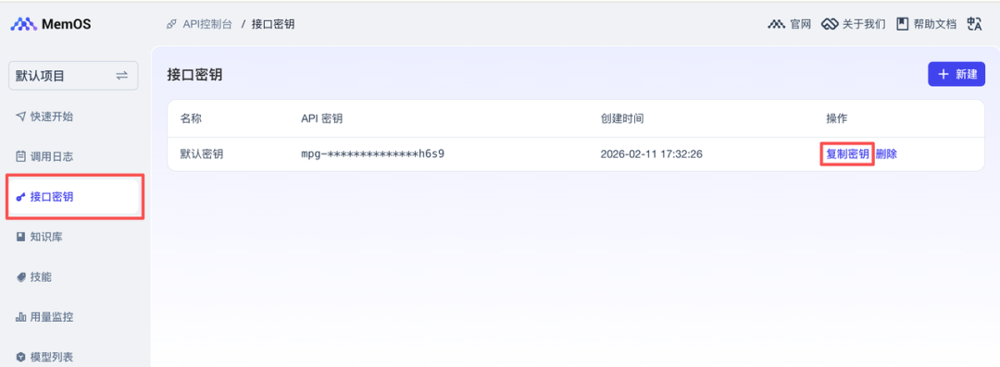

### Step 2：配置环境变量


```
echo&nbsp;"MEMOS_API_KEY=你的key"&nbsp;&gt; ~/.openclaw/.env
```### Step 3：一键安装插件


```
openclaw plugins install github:MemTensor/MemOS-Cloud-OpenClaw-Plugin
```


重启后，你的 OpenClaw 就有了一个外置大脑。


## 写在最后


折腾了这么多 AI 工具，我越来越觉得一件事：


未来AI的竞争，不在于模型参数多大，而在于上下文管理和记忆能力多强。


模型能力在趋同，但记忆管理的差距，决定了你的 Agent 是每次见面都像陌生人，还是一个真正了解你的长期搭档。


MemOS 目前 GitHub上 5.2k Star，Apache 2.0 协议开源，值得关注。

GitHub地址：https://github.com/MemTensor/MemOS


觉得有用，顺手去 GitHub 点个 Star，让好项目被更多人看到。


感谢看到这里 👏

觉得有用的话，点赞 👍 / 在看 👀 / 转发 🫱 / 评论 📣

星标 ⭐ 一下，下次更新不迷路

